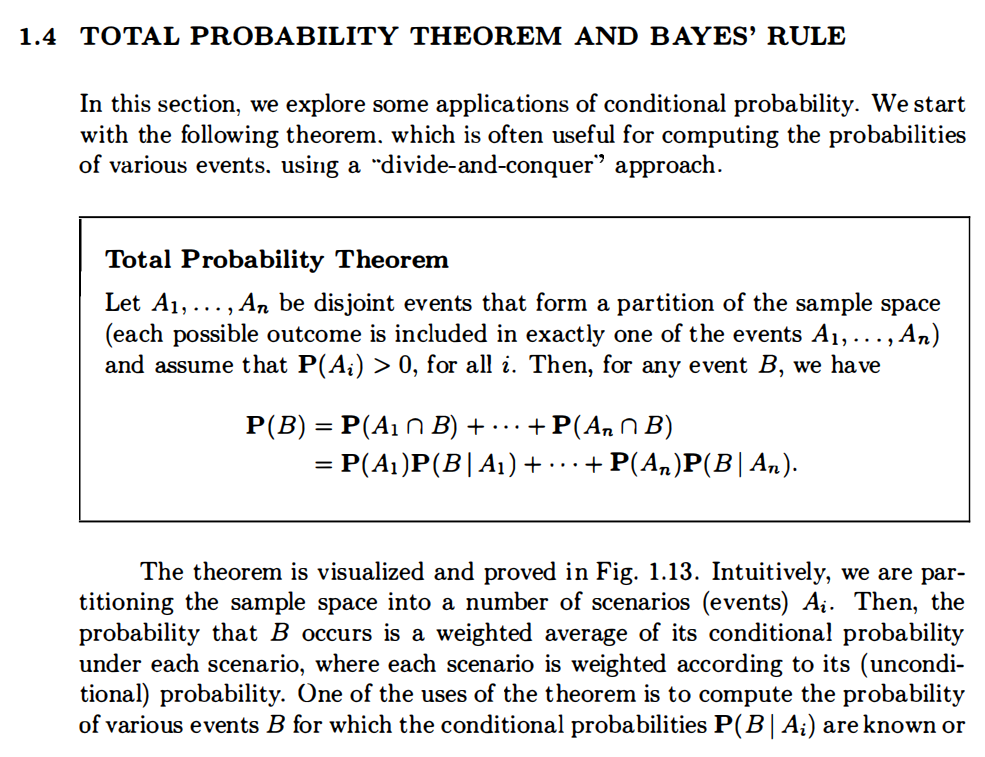

# XIN ST_1

**User:** Anonymous (dqswordman@gmail.com)  
**Created:** 9/10/2025 22:41:55  
**Updated:** 9/11/2025 0:18:46  
**Exported:** 9/11/2025 0:22:25  
**Link:** [https://chatgpt.com/c/68c18e30-1898-8324-b98d-7280635ab068](https://chatgpt.com/c/68c18e30-1898-8324-b98d-7280635ab068)  

## Prompt:

## Response:
已思考 2m 5s

根据用户提供的要求，我需要将课本截图中的内容结合起来，详细解释每个知识点，包括任何相关的代码或数学分析。分析概率的不同解释，如频率和主观信念，对话中分析护士的推理，以及如何通过投注赔率推断主观概率。我要确保每个点都解释清楚，结构包括标题、总结、详细说明和错误提示。

提供的图片包括章节标题页和部分引言，尚未包含关于集合部分的内容，因此我们不能超出图片内容进行解释。不过，可以根据图片提供的《目录》概览说明各部分的定义和结构。具体来说，会涵盖集合、概率模型、条件概率、贝叶斯规则等内容，但避免猜测图片外的细节。

第二张图片包含了关于频率解释和主观信念的定义，以及护士的困惑情境。通过理性人的行为可以推断主观信念，而接受赌注则表现出个人的信念。通过概率模型，我们开始探讨集合部分，阐明概率在不同情境下的应用。

标题为《样本空间与概率——概率的直观、解释与建模起点》，主要介绍概率的不同解释和建模方法。对于第一张图片，将列出章节目录、目标以及集合模型、条件概率、全概率、贝叶斯规则、独立性、计数等基本概念，并简要介绍样本空间和概率度量的定义。对于第二张图片，将深入分析对话中的频率解释和主观信念的不同解读。

*   **概览**

### 1\. 第一页：章节结构与学习地图

*   介绍每小节的目标：集合、概率模型等，列出学习目标。

### 2\. 第二页：概率概念的多重解释：一个“护士—家属”的对话

*   逐句解读对话及其概率解释。
*   提供数学公式，解释如何根据赔率接受博彩。

### 3\. 第三页：概率为何仍然适用

*   概述概率在多个背景中的应用，并预先介绍集合理论。

### 4\. 小结

### 5\. 报错: None

完成

**样本空间与概率（第1章开篇详解）**
====================

本组课件图片涵盖了第1章的标题页、目录与导言三页。核心主题是：**如何用“概率”刻画不确定性**，以及两种常见解释——**频率解释**与**主观（信念）解释**。作者借一个“护士—家属”的对话引出：当无法用大样本频率来刻画一次性的事件时，我们仍然可以通过**理性下注/选择**来刻画并量化内在的主观概率。全章的后续路线是：集合论回顾 → 概率模型 → 条件概率与全概率/贝叶斯 → 独立性 → 计数方法。

* * *

一、图片1：章节结构与学习地图（“Sample Space and Probability” 与目录）
---------------------------------------------------

**你将学到什么？**（对目录逐条解读，建立学习坐标系）

1.  **1.1 Sets（集合）**
    *   作用：概率模型的语言。事件被定义为样本空间的子集；运算（并、交、补）对应“或、且、不”。
    *   关键符号：样本空间  $\Omega$ 、事件  $A\subseteq\Omega$ 、并  $A\cup B$ 、交  $A\cap B$ 、补  $A^c$ 。
2.  **1.2 Probabilistic Models（概率模型）**
    *   典型抽象： $(\Omega,\mathcal{F},\mathbb{P})$ 。
        *    $\Omega$ ：所有可能结果；
        *    $\mathcal{F}$ ：事件族（满足封闭性，常为σ-代数）；
        *    $\mathbb{P}$ ：概率法则，对事件赋值到  $[0,1]$ 。
    *   三大公理（先有印象，细节通常在本节正式给出）：
        1.  非负性： $\mathbb{P}(A)\ge 0$ 。
        2.  规范化： $\mathbb{P}(\Omega)=1$ 。
        3.  可列可加性：互斥事件族  $\{A_i\}$  有  $\mathbb{P}\!\left(\bigcup_i A_i\right)=\sum_i \mathbb{P}(A_i)$ 。
3.  **1.3 Conditional Probability（条件概率）**
    *   核心： $\mathbb{P}(A\mid B)=\dfrac{\mathbb{P}(A\cap B)}{\mathbb{P}(B)}$ ，前提  $\mathbb{P}(B)>0$ 。
    *   含义：在“已知  $B$  发生”的信息下，对  $A$  的概率进行**更新**。
4.  **1.4 Total Probability Theorem and Bayes’ Rule（全概率定理与贝叶斯公式）**
    *   全概率：若  $\{B_i\}$  构成划分，则  
         $\displaystyle \mathbb{P}(A)=\sum_i \mathbb{P}(A\mid B_i)\,\mathbb{P}(B_i)$ 。
    *   贝叶斯： $\displaystyle \mathbb{P}(B_j\mid A)=\frac{\mathbb{P}(A\mid B_j)\mathbb{P}(B_j)}{\sum_i \mathbb{P}(A\mid B_i)\mathbb{P}(B_i)}$ 。
    *   用途：**从先验到后验**的理性更新，是“主观概率”可操作的数学基座。
5.  **1.5 Independence（独立性）**
    *   定义： $\mathbb{P}(A\cap B)=\mathbb{P}(A)\mathbb{P}(B)$ 。
    *   要点：独立≠互斥；独立是“信息不影响”的数学化。
6.  **1.6 Counting（计数）**
    *   乘法/加法原理、排列组合、二项式等，为离散模型计算概率提供“分母/分子”规模。

> **学习提示**：阅读时把“样本空间—事件—概率法则”作为三件套；其后所有内容（条件、独立、贝叶斯、计数）都是围绕这三件套进行推演与计算。

* * *

二、图片2：导言对话逐句拆解——概率的两种解释
-----------------------

> **对话概况**  
> 家属问：“药见效的概率多少？” 护士先回避为“明天就知道结果了”（强调单次结果）；家属改问“100人里有多少人有效”（转向**频率**）；护士强调“人各不同”（样本不齐、条件异质）；家属进一步用**下注**来套问护士的信念；提出“失败赔2美元/成功赢1美元”的赌注；护士表示厌恶这种“病态的想法”。

### 1）频率解释（frequentist view）

*   **内容**：概率 ≈ 大量重复、相似条件下的**成功比例**。
*   **优点**：自然、可检验（如抛硬币“约一半”）。
*   **局限**：
    *   **一次性/独特事件**无明确“可重复试验”（首次用药、历史学命题）。
    *   **条件不齐、样本非同质**时，频率不可直接迁移（护士说“每个人不同”）。

### 2）主观（信念）解释（subjective/Bayesian view）

*   **内容**：概率 = 个体在给定信息下对事件发生的**理性确信程度**。
*   **特点**：
    *   适用于**不可重复/一次性**的命题（如“荷马史诗是否同作者”的 90% 判断）。
    *   需满足**一致性**（与概率公理相容），否则会导致可被“荷兰赌局”剥削的矛盾。
*   **如何量化？——用下注揭示信念**：
    *   若在**对等赌注**（成就+1、失败−1）下你愿意押“药会有效”，则你的主观概率  $p$  至少满足
        $$
        \underbrace{p\times(+1)}_{\text{赢的期望}}+\underbrace{(1-p)\times(-1)}_{\text{输的期望}}\ge 0 \;\Rightarrow\; p\ge \tfrac{1}{2}.
        $$
    *   若你也接受“**二赔一**”（失败亏2、成功赢1）的赌注，则需
        $$
        p\times(+1)+(1-p)\times(-2)\ge 0 \;\Rightarrow\; p\ge \tfrac{2}{3}.
        $$
    *   **一般形式**：成功赢  $g$ ，失败亏  $\ell$ （均为正数），理性可接受的阈值
        $$
        p\ \ge\ \frac{\ell}{g+\ell}.
        $$
        这把“可接受的赔率”与“主观概率”建立了一一对应。

> **备注（理性与效用）**：严格说，这里默认了**风险中性**与线性效用。如果风险厌恶/喜好显著，应以**期望效用**替代期望值；但教材在开篇用下注只是帮助你**直观地从行为反推信念概率**。

* * *

三、图片3：从哲学争论转向“可操作的数学模型”
-----------------------

1.  **行为揭示信念**
    *   文字指出：理性人的选择与行动可暴露其内在的主观概率（即使当事人并未显式说出“我认为是70%”）。
*   例：护士若接受“一换一”，可推知其心中  $p\ge 1/2$ ；若接受“二赔一”，则  $p\ge 2/3$ 。
    2.  **为何不继续纠结‘频率 vs 主观’？**
    *   作者选择**实用立场**：概率论在科学、工程、医学、管理等**广泛有效**，即使某些场景中的概率仅反映主观信念，也依然是**强有力的决策工具**。
*   因此，后续重点不是哲学辩论，而是：**如何把不确定性系统地建模**，以及**如何进行可靠推理**。
    3.  **接下来怎么做？——以集合为骨架的概率模型**
    *   **核心思想**：把“可能结果”组织成集合（样本空间  $\Omega$ ），把命题“事件发生吗？”表示为 $\Omega$ 的子集  $A$ ，再用概率法则  $\mathbb{P}$  给这些子集赋值。
*   **学习路径承接目录**：
    *   先复习**集合论**（为事件运算打底）；
    *   再定义**概率模型三件套**  $(\Omega,\mathcal{F},\mathbb{P})$ ；
    *   然后用**条件概率/贝叶斯**做信息更新；
    *   通过**独立性**刻画“信息无关”；
    *   借助**计数**快速计算离散概率。

* * *

四、结合导言的必要数学准备（面向后续阅读的“先修小抄”）
----------------------------

1.  **样本空间与事件**
    *   样本空间  $\Omega$ ：一次试验所有可能结果（掷币  $\{H,T\}$ ，病人疗效  $\{\text{有效},\text{无效}\}$ ）。
*   事件  $A\subseteq\Omega$ ：一个感兴趣的命题（如“药有效”即  $\{\text{有效}\}$ ）。
*   事件运算：
    *   并  $A\cup B$ （“或”）；交  $A\cap B$ （“且”）；补  $A^c$ （“不”）。
    *   德摩根律： $(A\cup B)^c=A^c\cap B^c$ 、 $(A\cap B)^c=A^c\cup B^c$ 。
        2.  **概率的三条公理（先建立感知）**
    *   非负性、规范化、可列可加（见上）。它们保证计算的一致性（避免“荷兰赌局”）。
    3.  **赔率—概率换算（用于主观概率的“量化尺”）**
    *   公式：若对“赢  $g$ 、输  $\ell$ ”的赌注可接受，则主观概率  $p\ge \ell/(g+\ell)$ 。
*   例：赢1输2 →  $p\ge 2/3$ ；赢2输1 →  $p\ge 1/3$ 。
    4.  **何时用哪种解释？**
    *   **频率**：可重复、同质条件（制造缺陷率、抛硬币、A/B测）。
*   **主观**：独特/一次性命题（历史判断、首次用药个体疗效、明天是否下雨对**我**的活动影响）。
*   **合流点**：在贝叶斯学派中，主观先验 + 数据似然（频率信息） → 后验：两者并非对立，而是互补。

* * *

五、小结
----

*   本章开场明确两件事：
    1.  **概率的两种阅读方式**：频率（长期相对频数）与主观（理性信念度）。下注行为提供了从**行动反推信念概率**的操作化路径。
    2.  **方法论选择**：少谈哲学分歧，多做可操作建模。用集合承载事件，用概率法则赋值，再借条件概率/贝叶斯进行**信息更新**，以独立性与计数方法支撑复杂问题的求解。
*   接下来学习建议：
    *   先把集合运算与基本恒等式过一遍；
    *   牢记概率三公理与“互斥可加”；
    *   训练用**赔率↔概率**的换算来表述和检验自己的信念；
    *   逐步过渡到条件概率、全概率与贝叶斯更新的计算与应用。

* * *

六、报错/可读性说明
----------

*   本次三张图片清晰可读，未发现内容缺失到影响理解的部位。若你还有后续页（从1.1集合论开始），发来我继续按同样的方式做**逐行—逐式—逐概念**的深入笔记与推导。

## Prompt:

## Response:
已思考 2m 3s

我需要根据用户要求的格式，详细讲解概率论书籍中第1.1节“集合”的内容。这一部分包括集合的定义、成员关系、空集合、有限集合和可数无限集合。还包括集合的操作，如补集、并集、交集等，以及子集、集合相等等概念。

集合的代数涉及一些规则，如交换律、分配律、补集法则等。具体来说，集合S和T的并集具有交换性，且S∩(T∪U) = (S∩T)∪(S∩U)。此外，还介绍了集合的其他性质，比如S∪Ω = Ω，S∩S^c = ∅等。还通过范恩图展示了集合操作的直观例子。

用户希望得到非常详细的笔记。首先，我们会讲解集合的定义、例子、符号映射，并详细解释如交集、并集、补集的代数性质。在讨论德摩根法则时，提供相应的证明推导。另外，讲解范恩图和与概率的连接，如互斥事件、分区等概念如何在全概率定理中应用。

我们需要清晰地定义公理，如可数家庭的并集、pairwise disjoint集合的定义等。我要解释“可数无穷”和“不可数”之间的区别，并介绍集合表示法（如集合构造符号与属性P）。要讲解子集与真子集的区别，并给出有序对与ℝ^n的定义。补充简单的练习题，帮助理解。

完成

1.1 集合（Sets）：概率论的语言与运算
======================

**概览**：本节把“事件”形式化为**样本空间**  $\Omega$  的**子集**，并系统回顾集合的表示、可数/不可数、集合间关系（子集、相等、全集）、基本运算（补、并、交，含可列并/交）、不相交与**划分**、有序对与  $\mathbb{R}^n$ ，以及一组“集合代数”恒等式（含德摩根律）。这些是后续“概率公理、全概率与贝叶斯、独立性与计数”的全部基础。

* * *

一、集合与表示法
--------

### 1\. 集合与元素

*   **集合**：一组对象的抽象整体。对象称为**元素**。
*   记号：
    *    $x\in S$ ：元素  $x$  属于集合  $S$ ； $x\notin S$  表示不属于。
    *   **空集**： $\varnothing$ ，不含任何元素。
*   **列举法（有限）**：若  $S$  只有有限个元素  $x_1,\dots,x_n$ ，写作
    $$
    S=\{x_1,x_2,\dots,x_n\}.
    $$
    例：掷一枚公平骰子的所有结果  $\{1,2,3,4,5,6\}$ ；掷币的样本空间  $\{H,T\}$ 。

### 2\. 可数与不可数

*   **可数无限（countably infinite）**：若可按序列枚举为  $\{x_1,x_2,\dots\}$ ，则
    $$
    S=\{x_1,x_2,\ldots\}\quad\text{（与正整数建立一一对应）。}
    $$
    例：所有偶整数  $\{0,\pm2,\pm4,\dots\}$  可列。
*   **不可数（uncountable）**：不能以序列穷尽。区间  $[0,1]$  的实数集合  $\{x\mid 0\le x\le 1\}$  连续成段，**不可数**（虽本章不要求严格证明，但请记住结论）。

### 3\. 描述法（集合生成式）

*   **集合生成式**： $\{x\mid x \text{ 满足性质 }P\}$ 。
    *   例：偶整数  $\{k\mid k/2\ \text{为整数}\}$ ；
    *   区间  $[0,1]$ ： $\{x\mid 0\le x\le 1\}$ 。

### 4\. 子集、相等与全集

*   **子集**：若  $S$  的每个元素也在  $T$  中，记  $S\subseteq T$ （或书上简写  $S\subset T$ ）；等价地  $T\supseteq S$ 。
*   **相等**：若  $S\subseteq T$  且  $T\subseteq S$ ，记  $S=T$ 。
*   **全集**（**宇宙集**）： $\Omega$ 。表示当前语境下**一切可能对象**的集合。概率论中它就是**样本空间**。后续讨论的集合都默认是  $\Omega$  的子集。

> **易错提醒**：补集  $S^c$  一定是**相对于某个已定的  $\Omega$ ** 而言的；没有指明  $\Omega$  的“补集”是无意义的。

* * *

二、集合运算（含可列并/交）
--------------

### 1\. 基本三件套

*   **补集**： $S^c=\{x\in\Omega\mid x\notin S\}$ （相对  $\Omega$  而言）。
*   **并集**： $S\cup T=\{x\mid x\in S \ \text{或}\ x\in T\}$ 。
*   **交集**： $S\cap T=\{x\mid x\in S \ \text{且}\ x\in T\}$ 。

### 2\. 家族的并/交

给定一串集合  $\{S_n\}_{n=1}^\infty$ ：

$$
\bigcup_{n=1}^\infty S_n=\{x\mid \text{对某个 }n,\ x\in S_n\},\qquad \bigcap_{n=1}^\infty S_n=\{x\mid \text{对所有 }n,\ x\in S_n\}.
$$
*   “**某个**”与“**所有**”是关键差别：前者是存在量词，后者是全称量词。

### 3\. 不相交与划分

*   **不相交（disjoint）**：两个集合  $S,T$  若  $S\cap T=\varnothing$ 。对多集合族，常说“**两两不相交**”（任意不同二者交为空）。
*   **划分（partition）**：一族集合  $\{A_i\}$  满足
    1.  两两不相交； 2) 并起来是目标集合： $\bigcup_i A_i=S$ （通常还要求每个  $A_i\neq\varnothing$ ）。
        *   概率中的意义：**完备且互斥**的情形——是**全概率定理**与**贝叶斯公式**的前提。

### 4\. 维恩图（Venn）读图（对应教材图1.1）

*   (a) 阴影为  $S\cup T$ 。
*   (b) 阴影为  $S\cap T$ 。
*   (c) 阴影为  $S\cap T^c$ （即  $S\setminus T$ ，“在  $S$  里但不在  $T$ ”）。
*   (d) 图示  $T\subset S$ 。
*   (e)  $S$  与  $U$  不相交。
*   (f)  $S,T,U$  为  $\Omega$  的一个**划分**（互不重叠且并成  $\Omega$ ）。

* * *

三、有序对与  $\mathbb{R}^n$ （笛卡尔积的门槛）
--------------------------------

*   **有序对**  $(x,y)$ ：与集合  $\{x,y\}$  不同，次序重要， $(x,y)\neq(y,x)$ （除非  $x=y$ ）。
*   **实数集合**  $\mathbb{R}$ ；**平面**  $\mathbb{R}^2$  是所有实数有序对的集合；**三维空间**  $\mathbb{R}^3$  类推。
*   （延伸）**笛卡尔积**  $S\times T=\{(s,t)\mid s\in S,t\in T\}$ ；在概率里将用来描述**两步试验或二维随机变量**的样本空间。

* * *

四、集合代数恒等式（含证明思路）
----------------

> 下列恒等式都可用“元素追踪法”证明：任取  $x$ ，比较“属于左式”与“属于右式”的条件是否等价。

### 1\. 交换、结合、分配

*   **交换律**： $S\cup T=T\cup S$ ； $S\cap T=T\cap S$ 。
*   **结合律**： $S\cup(T\cup U)=(S\cup T)\cup U$ ； $S\cap(T\cap U)=(S\cap T)\cap U$ 。
*   **分配律**：
    $$
    S\cap(T\cup U)=(S\cap T)\cup(S\cap U),\quad S\cup(T\cap U)=(S\cup T)\cap(S\cup U).
    $$

### 2\. 恒等与对偶

*   **恒等元**： $S\cup\varnothing=S$ ， $S\cap\Omega=S$ 。
*   **消去**： $S\cap S^c=\varnothing$ ， $(S^c)^c=S$ 。
*   **吸收律**（常用但图上未单列）： $S\cup(S\cap T)=S$ ， $S\cap(S\cup T)=S$ 。
*   **幂等**： $S\cup S=S$ ， $S\cap S=S$ 。

### 3\. **德摩根律**（对列族也成立）

$$
\left(\bigcup_{n} S_n\right)^c=\bigcap_{n} S_n^c,\qquad \left(\bigcap_{n} S_n\right)^c=\bigcup_{n} S_n^c.
$$

**证明（首条，示意）**：

*   “ $\subseteq$ ”：若  $x\in(\bigcup_n S_n)^c$ ，则  $x\notin\bigcup_n S_n$ ，即对**每个**  $n$ ， $x\notin S_n$ ，等价于对每个  $n$ ， $x\in S_n^c$ ，故  $x\in\bigcap_n S_n^c$ 。
*   “ $\supseteq$ ”：反向同理。因此两边相等。第二条同理。

### 4\. 常用派生关系

*   **差集**： $S\setminus T := S\cap T^c$ 。
*   **子集判定**： $S\subseteq T \iff S\cap T^c=\varnothing \iff S\cup T=T$ 。
*   **对称差**： $S\triangle T=(S\setminus T)\cup(T\setminus S)=(S\cup T)\setminus(S\cap T)$ 。

* * *

五、与概率论的直接对应（先立“映射表”）
--------------------

| 集合语言 | 逻辑含义 | 事件/概率语言 |
| --- | --- | --- |
|  $A^c$  | “不  $A$ ” | 事件的**否定**， $\mathbb{P}(A^c)=1-\mathbb{P}(A)$ （由公理与  $A\cup A^c=\Omega$  推出） |
|  $A\cup B$  |  $A$  或  $B$  |  $\mathbb{P}(A\cup B)=\mathbb{P}(A)+\mathbb{P}(B)-\mathbb{P}(A\cap B)$  |
|  $A\cap B$  |  $A$  且  $B$  | 条件概率定义依赖交集： $\mathbb{P}(A\mid B)=\frac{\mathbb{P}(A\cap B)}{\mathbb{P}(B)}$  |
| 两两不相交 | 互斥 | 可列可加：若  $A_i$  互斥， $\mathbb{P}(\bigcup_i A_i)=\sum_i\mathbb{P}(A_i)$  |
| 划分  $\{B_i\}$  | 完备互斥 | **全概率定理/贝叶斯**的标准前提 |

* * *

六、常见易错与辨析
---------

1.  **补集依赖  $\Omega$ **：换了宇宙集， $S^c$  就变了。做题先锁定样本空间。
2.  **不相交 vs 独立**：
    *   不相交： $A\cap B=\varnothing$ （两事件不能同时发生）。
    *   独立： $\mathbb{P}(A\cap B)=\mathbb{P}(A)\mathbb{P}(B)$ （信息无关）。
    *   二者完全不同，且可相互独立又不不相交，或不相交但并不独立（除非概率为0之一）。
3.  **“可数”不是“少”**：可数无限仍是无限；与“不可数”是层级更高的无限。
4.  ** $\subset$  与  $\subseteq$ **：教材常用  $\subset$  表示“包含/不严格包含”，但很多书用  $\subset$  表“真子集”。做题要看作者习惯。
5.  **并/交的量词**： $\bigcup$  是“存在某个  $n$ ”； $\bigcap$  是“对所有  $n$ ”。把“或/且”与“存在/全称”一一对应可避免混乱。

* * *

七、巩固练习（附答案）
-----------

1.  设  $\Omega=\{1,2,3,4,5,6\}$ ， $A=\{1,3,5\}$ ， $B=\{2,3,4\}$ 。
    *    $A^c=\{2,4,6\}$ ； $A\cup B=\{1,2,3,4,5\}$ ； $A\cap B=\{3\}$ 。
2.  设  $S_n=[0,1-\tfrac1n]\subset\mathbb{R}$ 。求  $\bigcup_n S_n$  与  $\bigcap_n S_n$ 。
    *    $\bigcup_n S_n=[0,1)$ （任意  $x<1$  终会被某个  $n$  包含；1 永远不在任何  $S_n$  中）。
    *    $\bigcap_n S_n=[0,1-\tfrac11]=[0,0]$  不是！要小心：对**所有**  $n$  都要在，唯一满足的是  $[0,1)$  中被所有  $S_n$  覆盖的**共同部分**，即  $[0,1)$  的极限点 1 仍不在，结果是  $[0,1)$  的下界端：** $[0,1)$  吗？**  
        正确求法：随着  $n\to\infty$ ，区间右端  $1-\tfrac1n\to 1$  向右扩；公共部分等于**最小**的那个，即  $S_1=[0,0]$ ？这显然不对，因为  $S_1=[0,0]$  是单点。注意：这里  $S_1=[0,0]$ ， $S_2=[0,1/2]$ ， $S_3=[0,2/3]$  $\dots$  公共部分是**所有**里都包含的点，只能是  $[0,0]=\{0\}$ 。  
        **答案**： $\bigcup_n S_n=[0,1)$ ， $\bigcap_n S_n=\{0\}$ 。
3.  给出  $\Omega=\mathbb{R}$  上的一个**划分**例子。
    *   例如  $\{(-\infty,0),\{0\},(0,\infty)\}$ （两两不交并为  $\mathbb{R}$ ）。
4.  证明  $A\subseteq B \iff A\cap B^c=\varnothing$ 。
    *   “ $\Rightarrow$ ”：若  $x\in A\cap B^c$ ，则  $x\in A$  且  $x\notin B$ ，与  $A\subseteq B$  矛盾；故交必空。
    *   “ $\Leftarrow$ ”：若存在  $x\in A$  且  $x\notin B$ ，则  $x\in A\cap B^c$  非空，矛盾。
5.  用德摩根律化简  $(A\cup B\cup C)^c$ 。
    *    $(A\cup B\cup C)^c=A^c\cap B^c\cap C^c$ 。

* * *

八、本节要点小结
--------

*   **事件=子集**，样本空间  $\Omega$  是宇宙；补、并、交对应“否/或/且”。
*   **可数 vs 不可数**：离散/连续样本空间的分水岭。
*   **不相交与划分**：互斥与完备的语言，服务于可加性和全概率。
*   **集合代数**（交换、结合、分配、吸收、德摩根等）是后续概率恒等式的“影子”。
*   **量词意识**（存在/全称）对应并/交，是处理可列家族时的关键。

* * *

九、报错/可读性
--------

*   本次三页图片内容清晰，无缺损；已逐条覆盖。若你继续上传“1.2 概率模型”，我会在此基础上承接，给出**公理体系、推论与与集合恒等式的对应概率恒等式**的完整讲解与例题。

## Prompt:

## Response:
已思考 1m 30s

用户需要详细的笔记，内容从图像开始并深入解释。图像展示了第1.2节的内容，包含样本空间和概率法则等概念。解释样本空间的选择（独立、互斥、完备事件）以及事件基本定义（样本空间的子集）。举例说明，如方框上的多点目标，样本空间是不可数的，与事件概念结合。

需要区分有限与无限样本空间的定义。例如，三次掷币可以视为一个实验。游戏1只关心头数，样本空间为{0...10}；游戏2考虑顺序，样本空间是所有10次H/T的顺序。还需介绍Ω、结果、事件及概率法则P，满足科尔莫戈洛夫公理。

我们需要认真分析游戏1和游戏2的定义。游戏1是每次掷出正面时赚取1美元，而游戏2的规则是每次掷出正面时，奖励是逐次加倍的。首先是1美元直到第一个正面，第二次是2美元，依此类推。

在游戏2中，奖励会随着每次出现正面的次数而加倍，具体而言，第k次出现正面时，奖励是2^k。奖金总额取决于出现正面的顺序，而不仅仅是次数。游戏1则只关心正面的数量。我们可以为游戏1计算样本空间，表示出现正面的数量，并使用二项分布来计算概率。

完成

1.2 概率模型（Probabilistic Models）：样本空间、事件与概率法则
===========================================

**概况**：本节把“不确定情形”的数学化分成两部分：  
1）**样本空间  $\Omega$ **：一次实验（experiment）可能出现的**所有**结果；  
2）**概率法则  $\mathbb{P}$ **：把每个“事件”（ $\Omega$  的子集）映到  $[0,1]$  的数，表示我们对该事件的**可能性**（可理解为频率/主观信念，取决于建模语境）。  
 $\mathbb{P}$  需满足若干性质（公理），稍后会系统给出。教材图 1.2 直观地画出“实验 → 样本空间 → 概率法则（对事件赋值）”的流程。

* * *

一、概率模型的两大要素（对图 1.2 的文字化）
------------------------

*   **Experiment（实验）**：一次过程，最终会产生**惟一**的一个结果。
    *   例：掷币一次；掷币 10 次（视作一次复合实验）；往靶面投飞镖一次。
*   **Sample space（样本空间）  $\Omega$ **：该实验**所有可能结果**的集合。
    *   例：一次掷币  $\Omega=\{H,T\}$ ；十次掷币  $\Omega=\{H,T\}^{10}$ ；投飞镖的命中点  $\Omega=$  靶面的所有点（不可数、连续）。
*   **Event（事件）**： $\Omega$  的子集。任一“感兴趣的命题”都可表达成一个子集。
    *   例：“至少出现 6 次正面”=\\{\\,\\omega\\in\\{H,T\\}^{10}\\mid \\text{#H}(\\omega)\\ge 6\\,\\}。
    *   注脚要点：严格来讲，在**不可数**样本空间里并非所有子集都能赋予良好的概率（测度论细节）；本书涉及的问题不会碰到这些病态集合，可安全忽略。
*   **Probability law（概率法则）  $\mathbb{P}$ **：对每个事件  $A\subseteq\Omega$  给出  $\mathbb{P}(A)\in[0,1]$ 。后续公理保证一致性与可加性。

> **“一次实验” vs “多次实验”**：本书约定**三次掷币**若作为一个整体分析，则仍是**一次实验**，它的样本空间是长度为 3 的序列集合；不要把“实验次数”与“样本空间中试次的细分”混为一谈。

* * *

二、如何选择“合适的”样本空间（Choosing an Appropriate Sample Space）
-----------------------------------------------------

### 1）基本要求

*   **互斥（mutually exclusive）**： $\Omega$  中不同元素必须能区分；一次实验发生后应当**唯一定位**到其中一个元素。
*   **完备（collectively exhaustive）**：无论发生什么情况，结果都应包含在  $\Omega$  里。
*   **细节足够而不过度**： $\Omega$  应能区分**你关心的**所有结果差异，同时**剔除无关细节**，避免建模冗余。

### 2）“粒度”依任务而定 —— 例 1.1（十次掷币的两个游戏）

> **Game 1**：每出现一次正面（H）得 $1，总报酬只与**正面总数**有关。  
> **Game 2**：从第一掷起每次掷币按某个金额给钱；**每当出现一个正面，该金额就翻倍**（写法：每看见一个 H 就把“每掷奖励”×2），因此**正面出现的次序**会影响总报酬。

*   **对 Game 1 的合适  $\Omega$ **：只需记录“正面个数”这一个量即可
    $$
    \Omega_1=\{0,1,\dots,10\}\quad(\text{11 个元素}).
    $$
    事件示例：“至少 6 次正面”= $\{6,7,8,9,10\}$ 。
*   **对 Game 2 的合适  $\Omega$ **：必须记录**次序**，所以取
    $$
    \Omega_2=\{H,T\}^{10}\quad(\text{长度为 10 的所有序列，共 }2^{10}\text{ 个}).
    $$
    事件示例：“第一掷即见到 H”= $\{\omega\in\{H,T\}^{10}\mid \omega_1=H\}$ 。

> **要点**： $\Omega_2$  比  $\Omega_1$  细（信息更多）。若先在细粒度  $\Omega_2$  上建模，再关心“正面总数”，可以通过函数  
>   $\,N(\omega)=\#\text{H}(\omega)$  **把细空间映到粗空间**  $\Omega_1$ 。  
> 这体现了“**先细后粗**”的常见做法：在细空间上给  $\mathbb{P}$ ，再通过**像的前像**聚合出粗空间事件的概率。

* * *

三、样本空间的类型与直观
------------

*   **有限型**：元素有限个，最易枚举与计数（掷骰子、抽牌等）。
*   **可数无限**：如反复掷币直到第一次出现 H， $\Omega=\{1,2,3,\dots\}$ （在第  $n$  次首次出现）。
*   **不可数（连续）**：如飞镖命中点。典型地用  $\mathbb{R}^n$  的区域表示（区间、矩形、圆盘等）。这类情形下，“区域的概率”常与**长度/面积/体积的比例**或**密度函数**相关联（等概率/连续型模型），但严格赋值需要测度论框架；本书只用到其直观与基本计算。

* * *

四、概率法则应满足的基本性质（为 1.2 的框架补全）
---------------------------

> 虽然书上说“稍后介绍”，但这里给出标准三公理，便于你把模型“一次装配齐全”。

1.  **非负性**： $\mathbb{P}(A)\ge 0$ 。
2.  **规范化**： $\mathbb{P}(\Omega)=1$ 。
3.  **（可列）可加性**：若  $\{A_i\}$  两两不相交，则
    $$
    \mathbb{P}\!\left(\bigcup_{i=1}^{\infty}A_i\right)=\sum_{i=1}^{\infty}\mathbb{P}(A_i).
    $$

从这些公理立刻能推出一些常用等式：

*    $\mathbb{P}(\varnothing)=0$ ； $\mathbb{P}(A^c)=1-\mathbb{P}(A)$ ；
*    $\mathbb{P}(A\cup B)=\mathbb{P}(A)+\mathbb{P}(B)-\mathbb{P}(A\cap B)$ ；
*   若  $A\subseteq B$ ，则  $\mathbb{P}(A)\le \mathbb{P}(B)$ 。

* * *

五、把“合适的  $\Omega$ ”与“正确的  $\mathbb{P}$ ”配起来——两个具体装配
---------------------------------------------------

### 例 A（Game 1：只看总次数）

*   取  $\Omega_1=\{0,1,\dots,10\}$ 。
*   若硬币公平、各掷独立，则
    $$
    \mathbb{P}(N=k)=\binom{10}{k}\left(\tfrac12\right)^{10},\quad k=0,\dots,10.
    $$
    这就是**二项分布**。任一事件（例如“至少 6 次正面”）的概率是相应  $k$  的和。

### 例 B（Game 2：顺序重要）

*   取  $\Omega_2=\{H,T\}^{10}$ ，等可能模型：每个序列概率  $2^{-10}$ 。
*   若要回到“总次数”层面，只需对具有相同  $N(\omega)=k$  的所有序列求和：
    $$
    \mathbb{P}(N=k)=\sum_{\omega:\,N(\omega)=k}2^{-10}=\binom{10}{k}2^{-10}.
    $$
*   若要计算**总报酬**  $R(\omega)$ （Game 2），需要利用顺序逐步翻倍的规则在每条路径上累加；这正说明了为什么 **Game 2 必须用细粒度的  $\Omega_2$ **。

* * *

六、建模清单（实战心法）
------------

1.  **明确问题**：你关心的指标/事件究竟是什么？
2.  **定  $\Omega$ **：满足互斥、完备；保证能区分你关心的差异，但不过度。
3.  **定  $\mathcal{F}$ **：事件族（在有限/可数情形通常就是所有子集；在连续情形用“可测集合”，本书默认不深究）。
4.  **定  $\mathbb{P}$ **：频率或主观先验/等可能/几何概率/密度……明确假设来源。
5.  **若需降维**：在细  $\Omega$  上先计算，再通过函数映到粗视角（取**前像**聚合）。
6.  **检验一致性**：是否满足三公理？是否与常识/数据一致？

* * *

七、小结
----

*   概率模型 = **样本空间  $\Omega$ ** + **概率法则  $\mathbb{P}$ **；事件是  $\Omega$  的子集。
*   选  $\Omega$  的标准：**互斥、完备、适度细节**；任务不同 → 粒度不同。
*   例 1.1 清晰展示：若**只看次数**， $\Omega=\{0,\dots,10\}$  足够；若**顺序会影响报酬**，必须取  $\Omega=\{H,T\}^{10}$ 。
*   在有限/可数情形下，事件就是任意子集；在连续情形下，原则上要排除“病态集合”（测度论），本书不涉及。
*   三公理为  $\mathbb{P}$  提供一致性的“轨道”，后续条件概率、全概率与贝叶斯都在此轨道上运行。

* * *

八、报错/可读性
--------

*   本次三张图片内容清晰，无缺页。若你继续发 1.3（条件概率），我会承接这套模型视角，系统推导**乘法公式、全概率与贝叶斯**并穿插与例 1.1 的对接计算。

## Prompt:

)

## Response:
已思考 54s

我需要根据用户的要求，提供详细的讲义风格说明，逐步解析他们提供的三张图像内容，涵盖“序列模型”的时间序列描述与“概率公理”的讨论，并用中文进行沟通。每个知识点要解释清楚，包含公式、步骤，并总结最后的要点。如果有什么不明确的地方，就标注“报错”。

标题：1.2 概率模型（续）：序列模型与概率公理

我们需要解释序列模型——例如，投掷三次硬币、五天的股票价值、接收数字，等等。使用树状序列描述来建模。这涉及样本空间、卷积树与网格的等效表示、事件集合和概率的推导联系等内容。“概率公理”中包括三条公理，并讲解推导性质如补集规则、单调性、界限等。

我们将从公理出发推导，主要包括：P(Ω) = 1, P(∅) = 0, P(A^c) = 1 - P(A)，P(A∪B) = 和减交集，单调性，结合性，分割加法性等。可以介绍“三个不相交事件的联合概率是求和”的推导。还会讨论“树形序列模型，样本空间表示：网格与树”，并通过掷4面骰子示例来演示。

我们会包括离散有限和可数无限的情况。需要小心计算公式，避免过多的公式，尽量遵循用户要求的全面性和对知识点的连接性。同时可以提到树到路径事件的辩证，像是“第一次掷骰子结果为1”这种事件集的表示。展示无限基数样本空间中的一些问题，但稍微提及即可。

完成

1.2 概率模型（续）：**序列模型**与**概率公理**
=============================

**概况**：这一组页展示了两块内容：  
1）如何用**树形（序列）描述**表示“分步进行的实验”（sequential models）；  
2）给出**概率法则的三条公理**，并由此推导一系列基本性质（如  $\mathbb{P}(\varnothing)=0$ 、有限可加、补集公式等）。下面逐段细讲，并把图中的要点转成可直接运算的规则。

* * *

一、序列模型（Sequential Models）
-------------------------

### 1\. 何时使用“序列”描述

许多实验**本质上按步骤进行**：掷币三次、连续五天的股价、通信接收的8个比特……这类问题不仅要知道**每步的结果**，还常常关心**次序**或**路径**本身。因此我们把样本空间写成**序列**或画成**树**来描述。

### 2\. 例：两次掷一枚“四面骰”

*   **样本空间（笛卡尔积）**
    $$
    \Omega=\{1,2,3,4\}\times\{1,2,3,4\} =\{(i,j)\mid i,j\in\{1,2,3,4\}\}.
    $$
    这可以用左图的**4×4 网格**表示（横轴=第1次、纵轴=第2次），每个格点是一个**有序对**结果  $(i,j)$ 。
*   **树形等价表示**（右图）  
    从根出发，第一层分成 1、2、3、4；再从每个节点分出四条边到第二层的 1、2、3、4。
    *   **叶子（leaf）** ↔ **序列的一个具体结果**  $(i,j)$ 。
    *   **从根到叶的唯一路径** ↔ 该结果发生的“**过程**”。
    *   **任一中间节点**也对应一个**事件**：该节点**下方所有叶子**组成的集合。  
        例如，第一层标“1”的节点对应事件  
         $\{(1,1),(1,2),(1,3),(1,4)\}$ （即“第一掷=1”）。  
        图中左侧阴影“第二次掷出 4”对应事件  
         $\{(1,4),(2,4),(3,4),(4,4)\}$ ；在树上即“所有通向 j=4 的叶子”的集合。

> **一般化**：若实验分  $k$  步，每步的可能结果集合为  $S_1,\dots,S_k$ ，
> 
> $$
> \Omega=S_1\times\cdots\times S_k,
> $$
> 
> 叶子是一条长度为  $k$  的序列。以树形画出更便于表达“前缀事件/路径事件”。

*   **赋概率的直觉**（先给一个离散例）  
    若每次独立且均匀， $\mathbb{P}((i,j))=\tfrac{1}{16}$ 。  
    事件“第二次=4”的概率就是 4 个叶子的概率之和： $\tfrac{4}{16}=\tfrac14$ 。  
    更一般地，当每条边标上“这一步的（条件）概率”时，一条路径的概率=沿路**乘积**，一个事件的概率=其下所有叶子概率的**和**。这与后续的“乘法公式/条件概率”完全一致。

* * *

二、概率法则（Probability Laws）：三条公理
-----------------------------

> 概率法则把每个事件  $A\subseteq\Omega$  映到  $[0,1]$  的数  $\mathbb{P}(A)$ 。为保证一致与可算性，它需满足以下**公理**。

### 公理盒（与图中一致）

1.  **非负性（Nonnegativity）**： $\mathbb{P}(A)\ge 0$ （任意事件）。
2.  **可加性（Additivity）**：若  $A,B$  **不相交**，则
    $$
    \mathbb{P}(A\cup B)=\mathbb{P}(A)+\mathbb{P}(B).
    $$
    更一般地，若  $A_1,A_2,\dots$  两两不相交，则
    $$
    \mathbb{P}\!\Big(\bigcup_{n=1}^{\infty}A_n\Big)=\sum_{n=1}^{\infty}\mathbb{P}(A_n).
    $$
3.  **规范化（Normalization）**： $\mathbb{P}(\Omega)=1$ 。

> **质量-分布类比**：把总质量 1 均匀或不均匀地“撒”在样本空间里，则  $\mathbb{P}(A)$  就是掉在  $A$  上的“总质量”。于是“不相交并集的质量=逐块质量之和”就很直观了。

* * *

三、从三公理推导的“立刻能用”的性质
------------------

> 这些都**不需要**额外假设，完全由三公理推得；做题必备。

1.  **空集概率为零**
    $$
    1=\mathbb{P}(\Omega)=\mathbb{P}(\Omega\cup\varnothing) =\mathbb{P}(\Omega)+\mathbb{P}(\varnothing) \ \Rightarrow\ \mathbb{P}(\varnothing)=0.
    $$
2.  **上界与补集公式**
    $$
    \mathbb{P}(A)\le 1,\qquad \mathbb{P}(A^c)=1-\mathbb{P}(A).
    $$
    由  $\Omega=A\cup A^c$  且两者不相交得出。
3.  **单调性（ $A\subseteq B\Rightarrow \mathbb{P}(A)\le\mathbb{P}(B)$ ）**  
     $B=A\cup(B\setminus A)$ ，且两部分不交，故  
     $\mathbb{P}(B)=\mathbb{P}(A)+\mathbb{P}(B\setminus A)\ge\mathbb{P}(A)$ 。
4.  **有限可加（两两不交）**  
    对  $A_1,\dots,A_n$  两两不交，反复应用可加性：
    $$
    \mathbb{P}\Big(\bigcup_{i=1}^n A_i\Big)=\sum_{i=1}^n \mathbb{P}(A_i).
    $$
    图中第三段演示了  $n=3$  的逐步展开。
5.  **并集恒等式（一般  $A,B$  不必不交）**
    $$
    \mathbb{P}(A\cup B)=\mathbb{P}(A)+\mathbb{P}(B)-\mathbb{P}(A\cap B).
    $$
    证明思路：将  $A\cup B$  分解为互斥的  $A\setminus B$ 、 $B\setminus A$ 、 $A\cap B$ 。
6.  **差集公式**  
     $\mathbb{P}(A\setminus B)=\mathbb{P}(A)-\mathbb{P}(A\cap B)$ 。
7.  **并集上界（Union Bound）**  
     $\mathbb{P}(A\cup B)\le \mathbb{P}(A)+\mathbb{P}(B)$ 。  
    （由 5 式去掉非负项  $\mathbb{P}(A\cap B)$  即得。常用于做“粗上界”。）

> 这些公式和第一小节的**集合代数**是一一对应的“概率版”。做题先把事件**画成维恩图**或在树上成“叶子集合”，再按“互斥求和/拆并补交”的思路套用。

* * *

四、把“树”与“三公理”结合做计算（小例）
---------------------

**设两次掷四面骰，独立且均匀。**

*   每个叶子概率  $1/16$ 。
*   事件  $B=\{\text{第二次}=4\}$  的概率  
     $\mathbb{P}(B)=4\cdot\frac{1}{16}=\frac14$ （互斥 4 叶求和）。
*   事件  $A=\{\text{第一次}=1\}$  概率  $\frac14$ 。
*    $\mathbb{P}(A\cup B)=\frac{4}{16}+\frac{4}{16}-\frac{1}{16}=\frac{7}{16}$ ，  
    其中  $\mathbb{P}(A\cap B)=\mathbb{P}(\{(1,4)\})=\tfrac{1}{16}$ 。

> 若不是均匀独立，只要给每条分支标上当步的（条件）概率，**路径概率=乘积**，**事件概率=覆盖叶子的和**；这完全依赖于公理 2（互斥求和），为下一节“条件概率”埋下接口。

* * *

五、与“大数定律式”直觉的连接
---------------

教材在公理后提到：把  $\mathbb{P}(A)=2/3$  直观成“重复大量实验时，约 2/3 次发生  $A$ ”能帮助理解，但并非处处可用（例如一次性事件）。公理体系的好处是：**不管来源是频率还是主观信念**，只要满足三公理，就能一致地推演与计算。第5章会用极限定理把“频率≈概率”的直觉形式化。

* * *

六、小结
----

*   **序列模型**提供两种等价的样本空间表示：**网格/笛卡尔积** 与 **树/路径**。叶子=结果，节点=某类事件（下方叶子的集合）。
*   **概率三公理**是全部推理的轨道：非负、（可列）可加、规范化。
*   由此立刻得到： $\mathbb{P}(\varnothing)=0$ 、补集公式、单调性、有限可加、并集恒等式/上界、差集公式等。
*   计算策略：把事件拆成**互斥块**后**求和**；需要时用集合代数先做**结构化分解**（并/交/补/差），或在树上把事件化成若干**叶子**的集合。

* * *

报错/可读性
------

本次三张图片清晰可读，信息完整，已全部覆盖并扩展到立即可用的推导与例题。若你继续发送 **1.3 条件概率** 页，我会承接本节树形模型与公理，推导**乘法公式**、**全概率定理**与**贝叶斯公式**并做路径计算示例。

## Prompt:

## Response:
已思考 53s

我们需要避免过于复杂的表达，保持结构清晰。为了配合用户偏好结构化的教育性笔记，我们要提供有条理的讲解。比如，使用公式和LaTeX格式。关于事件概率的计算：通过直接计数方法和补集方法得出“至少一个掷得4”的概率为7/16，推导过程合理清晰。

对于偶数和奇数求和的情况，两个1到4之间的均匀数值中，偶数之和出现时它们的奇偶性相同。对于"第一次大于第二次"的情况，通过排列组合得出应为6个符合条件的有序对。关于抛硬币的例子，我们可以通过二项分布公式来求解恰好k次正面朝上的概率。

先简要介绍离散概率定律：在有限样本空间中，任何事件的概率是其单项概率的和。如果元素是等可能的，每个的概率为1/n，P(A)=|A|/n。要注意提到假定公平性时的陷阱和独立性，避免引发误解。同时，要与之前的序列模型联系起来，给出树形结构的计算公式。

完成

1.2 离散模型（Discrete Models）：从“等可能”到通用离散概率律
========================================

**概况**：这三页展示了如何在**有限/可数离散**样本空间上构造概率法则，先以抛硬币为例说明“**等可能**（uniform）”假设怎样与三公理相容，然后抽象出**离散概率律**与**离散均匀律**两条工作公式，最后用“两枚四面骰”的网格图演示如何**数元素→求概率**。

* * *

一、例 1.2（单次 & 三次抛硬币）：如何从常识假设构造  $\mathbb{P}$ 
--------------------------------------------

### 1）单次抛硬币

*   **样本空间**： $\Omega=\{H,T\}$ 。事件族包含  $\{H,T\},\{H\},\{T\},\varnothing$ 。
*   **“公平”假设**：认为  $H$  与  $T$ **等可能**，于是
    $$
    \mathbb{P}(\{H\})=\mathbb{P}(\{T\})=\tfrac12.
    $$
*   **与公理的一致性**：
    *   可加性给出  $\mathbb{P}(\{H,T\})=\mathbb{P}(\{H\})+\mathbb{P}(\{T\})=1$ （与规范化一致）；
    *   因此完整法则为
        $$
        \mathbb{P}(\{H,T\})=1,\quad \mathbb{P}(\{H\})=\mathbb{P}(\{T\})=\tfrac12,\quad \mathbb{P}(\varnothing)=0.
        $$

> **提示**：“公平”=“单元素事件等可能”；**需要假设**才成立，不能凭空得出。

### 2）三次抛硬币

*   **样本空间**： $\Omega=\{H,T\}^3$ （8 条长度为 3 的序列）。
*   **独立且公平** → **等可能模型**：每个序列概率  $1/8$ 。
*   **事件**：恰有两次正面
    $$
    A=\{\text{HHT, HTH, THH}\}.
    $$
*   **求概率 = 互斥求和**（公理 2）：
    $$
    \mathbb{P}(A)=\tfrac18+\tfrac18+\tfrac18=\tfrac38.
    $$

> **一般化（提前建立直觉）**： $n$  次公平独立抛掷，恰有  $k$  次正面的事件包含  $\binom{n}{k}$  个序列，  
>  $\displaystyle \mathbb{P}(\text{恰 }k\text{ 次 }H)=\binom{n}{k}2^{-n}$ （二项分布雏形）。

* * *

二、离散概率律（Discrete Probability Law）
---------------------------------

> **结论**（书中黑框公式）：若  $\Omega=\{s_1,\ldots,s_n\}$  为**有限**样本空间，则只要给出每个**单元素事件**的概率  $\mathbb{P}(s_i)$ （约定  $\mathbb{P}(s_i)$  代表  $\mathbb{P}(\{s_i\})$ ），任一事件  $A=\{s_{i_1},\ldots,s_{i_m}\}$  的概率就是**逐元素求和**：

$$
\boxed{\ \mathbb{P}(A)=\sum_{s\in A}\mathbb{P}(s)\ }.
$$*   这是可加公理的直接推论（有限个两两不相交的单元素集合的并）。
*   该“按元素加总”的思想也适用于**可数**样本空间（求和变为可数级数，只要和收敛且满足公理）。

* * *

三、离散**均匀**概率律（Discrete Uniform Law）
-----------------------------------

> **等可能情形**：若  $\Omega$  有  $n$  个等可能结果，则每个单元素概率  $1/n$ ，于是
$$
\boxed{\ \mathbb{P}(A)=\dfrac{|A|}{n}\ }.
$$*   **核心做法**：**先数出事件的元素个数**  $|A|$ ，再除以总数  $n$ 。
*   这是许多计数题的统一范式：**计数 → 比例**。

* * *

四、例 1.3（两枚四面骰）：网格计数法
--------------------

*   **样本空间**： $\Omega=\{1,2,3,4\}^2$ ，共有  $4\times4=16$  个有序对  $(i,j)$ 。
*   **公平独立 → 等可能**：每个点概率  $1/16$ 。
*   下面用**数元素**的方法计算几个事件（与图 1.4 一致）。
    1.  **和为偶数**
    *   条件：奇+奇 或 偶+偶。奇数有  $\{1,3\}$  两个，偶数有  $\{2,4\}$  两个。
    *   计数： $2\times2 + 2\times2 = 8$  个点。
    *   概率： $8/16=1/2$ 。
    *   **和为奇数** 同理亦为  $1/2$ （互为补集，也可直接用  $1-1/2$ ）。
2.  **第一掷=第二掷**（对角线）
    *   点： $(1,1),(2,2),(3,3),(4,4)$ ，共 4 个。
    *   概率： $4/16=1/4$ 。
3.  **第一掷 > 第二掷**
    *   有序对计数：所有  $i\ne j$  的有序对共有  $4\times3=12$ ；其中一半满足  $i>j$ （另一半  $i<j$ ），故 6 个。
    *   概率： $6/16=3/8$ 。
4.  **至少有一掷为 4**
    *   用补集： $\{\text{都不是 }4\}$  的点数  $=3\times3=9$ 。
    *   因此  $|A|=16-9=7$ ，概率  $7/16$ 。
    *   （图 1.4 灰带阴影覆盖这 7 个点的区域。）

> **方法总结**：
> 
> *   **分类计数**（奇/偶、对角/上下三角）；
> *   **对称性**（ $i>j$  与  $i<j$  各占一半）；
> *   **补集法**（“至少一个……”→“都不是……”）。
>     

* * *

五、与“三公理”的对应关系与检查
----------------

*   **构造原则**：
    1.  先定  $\Omega$  与“等可能/非等可能”的**单元素概率**；
    2.  任意事件概率=**互斥求和**（公理 2）；
    3.   $\sum_{s\in\Omega}\mathbb{P}(s)=1$ （公理 3）， $\mathbb{P}(s)\ge0$ （公理 1）。
*   **两骰例**： $16$  个点各  $1/16$ ，自然满足三公理；任何事件概率由其**覆盖点数**决定。

* * *

六、常见易错点与经验法则
------------

1.  **等可能 ≠ 必然**：需要被问题**明确给出或可合理假定**（如“公平骰子”）。否则必须给出各单元素概率。
2.  **“至少一个”**优先用**补集**，避免漏数。
3.  \*\*“有序对/序列”\*\*要分清是否区分次序；若关心顺序， $(i,j)\neq(j,i)$ 。
4.  **计数先画图/划分**：网格图、对角线、三角区域、颜色分区能迅速减少误数。
5.  **三次（或  $n$  次）抛硬币**：若只关心“个数”，先数  $\binom{n}{k}$ ；若顺序影响收益（上一节 Game 2），必须在序列空间上建模。

* * *

七、巩固练习（附答案）
-----------

1.  两枚四面骰，事件  $A=\{\text{和} \ge 6\}$ 。求  $\mathbb{P}(A)$ 。
    *   逐和计数：
        *   和=6： $(2,4),(3,3),(4,2)$  3 个；
        *   和=7： $(3,4),(4,3)$  2 个；
        *   和=8： $(4,4)$  1 个；合计 6 个。
    *   概率： $6/16=3/8$ 。
2.  三次公平抛硬币，“至少两次正面”。
    *    $|A|=\binom{3}{2}+\binom{3}{3}=3+1=4$ ， $\mathbb{P}(A)=4/8=1/2$ 。
3.  三次公平抛硬币，“第一次与第三次相同”。
    *   等价于  $(H,*,H)\cup(T,*,T)$ ：共 4 个序列（中间任意），概率  $4/8=1/2$ 。

* * *

八、小结
----

*   在**离散**样本空间上，概率的本质就是“**把质量分配到单个结果**，然后对事件**求和**”。
*   **离散概率律**给出通用求法；**离散均匀律**把问题化为“**计数**”。
*   网格/树形表达与“互斥求和、补集、对称、分类”四大技巧，是离散题的常用解题框架。

* * *

九、报错 / 可读性
----------

*   本次三张图片清晰无缺漏；所有公式与示例均已逐步推导并补充一般化结论。若你继续发送 **1.3 条件概率** 的页面，我会基于这里的离散模型与树形描述，推导**乘法公式、全概率定理、贝叶斯**并给出路径型计算范例。

## Prompt:

## Response:
连续模型（Continuous Models）：几何概率、单点零概率与“罗密欧与朱丽叶”问题
==============================================

**概况**：这一组页把“等可能”的思想从**离散**推广到**连续**样本空间。关键转折是：在连续情形里，**单个点事件的概率必须为 0**；真正有意义的是**区间/区域的“长度/面积/体积”**。教材用两个例子说明：

*   例1.4：转盘模型  $\Omega=[0,1]$ ，均匀 →  $P([a,b])=b-a$ ；
*   例1.5：“罗密欧与朱丽叶”各自到达延迟  $(x,y)\in[0,1]^2$ ，均匀 → 他们在 15 分钟（ $1/4$ 小时）内相遇的概率为  $7/16$ 。

* * *

一、为什么“连续”里单点的概率必须为 0？（例 1.4）
----------------------------

### 1）模型设定

*   **样本空间**： $\Omega=[0,1]$ （用 0–1 标定的转盘停下来的刻度）。
*   **均匀/公平**：所有结果“等可能”。

### 2）单点概率不能为正的公理化理由

设某个点  $\{x\}$  的概率为  $\varepsilon>0$ 。由于加法公理，任取互不相同的  $N$  个点  $\{x_1\},\dots,\{x_N\}$ ，有

$$
P(\{x_1\}\cup\cdots\cup\{x_N\})=\varepsilon+\cdots+\varepsilon=N\varepsilon.
$$

只要取  $N>1/\varepsilon$ ，就得到  $P(\cdot)>1$ ，**违背规范化公理**。因此在连续模型中，对任何点  $\{x\}$  都必须有

$$
\boxed{P(\{x\})=0.}
$$

> 这并不代表“该点不可能发生”，而是说**单点的可能性相对于整体可忽略**。连续变量“命中某个精确值”的概率为 0 是常态。

### 3）怎样给区间/复杂集合赋概率

*   **均匀连续模型（几何概率）**：令
    $$
    \boxed{P([a,b])=b-a,\quad 0\le a\le b\le 1}
    $$
    对并列不重叠区间按可加公理求和；对一般“好”的集合，用它的**长度**（可视作积分  $\int_S dt$ ）来定义概率。
*   这套定义满足三公理：
    *   非负性显然；
    *   规范化  $P([0,1])=1$ ；
    *   不交并的长度相加，满足可加性。
*   **与离散均匀律的类比**：离散时  $P(A)=\dfrac{|A|}{|\Omega|}$ ；连续时“计数”换成**测度**（长度/面积/体积）：
    $$
    P(A)=\frac{\text{测度}(A)}{\text{测度}(\Omega)}.
    $$

> （脚注要点）并非  $[0,1]$  的所有“怪集合”都能良好赋“长度”，这属于测度论范畴；但教材与实际工程中使用的集合都是“好”的（可测），可以放心按长度/面积来算。

* * *

二、二维均匀模型与相遇带状区（例 1.5）
---------------------

### 1）问题表述

*   两人约会，各自到达延迟（小时） $x,y\in[0,1]$ ，**均匀独立**。
*   先到的人最多等 **15 分钟**（即  $1/4$  小时），若另一人未到就离开。
*   问他们**相遇**的概率。

### 2）样本空间与“等可能”的几何化

*    $\Omega=[0,1]\times[0,1]$  —— 单位正方形；均匀 → **概率 = 面积**。
*   **相遇事件**：两人的到达时间差不超过  $1/4$ ：
    $$
    M=\{(x,y)\in[0,1]^2\mid |x-y|\le 1/4\}.
    $$
    在平面上，这是沿主对角线的一条**带状区域**（见图 1.5 的阴影）。

### 3）面积法一（补集法 / 三角形面积）

*   带外区域由两块等腰直角三角形组成，每块的直角边长  $=1-1/4=3/4$ 。
*   每块面积  $\frac12\left(\frac34\right)^2=\frac{9}{32}$ ，两块合计  $\frac{9}{16}$ 。
*   因此
    $$
    P(M)=1-\frac{9}{16}=\boxed{\frac{7}{16}}.
    $$

### 4）面积法二（积分核对）

把带的“竖向宽度”对  $x$  积分：

$$
\text{area}(M)=\int_0^{1/4}(x+\tfrac14)\,dx\;+\; \int_{1/4}^{3/4}\tfrac12\,dx\;+\; \int_{3/4}^{1}( \tfrac54-x)\,dx = \tfrac{3}{32}+\tfrac14+\tfrac{3}{32} =\boxed{\tfrac{7}{16}}.
$$

与上法一致。

### 5）一般化公式（等待阈值  $\tau\in[0,1]$ ）

若等待上限为  $\tau$ （小时），则

$$
P(|x-y|\le\tau)=1-(1-\tau)^2=\boxed{2\tau-\tau^2}.
$$

代入  $\tau=\tfrac14$  得  $2\cdot\frac14-\left(\frac14\right)^2=\frac12-\frac{1}{16}=\frac{7}{16}$ 。

* * *

三、从“几何概率”走向“密度”观点（提前预告，便于衔接后文）
------------------------------

*   在一般连续模型中，常通过**概率密度函数**  $f$  来定义概率：
    $$
    P(A)=\int_A f(x)\,dx,\qquad f(x)\ge0,\ \int_{\Omega} f(x)\,dx=1.
    $$
*   均匀模型是特例： $f(x)\equiv 1$ （在  $[0,1]$  上）或  $f(x,y)\equiv 1$ （在单位正方形上），因此概率等于长度/面积。
*   这与后续的**条件概率、全概率、贝叶斯**无缝衔接，只是把“求和”换成“积分”。

* * *

四、易混与常见坑
--------

1.  ** $P(\{x\})=0$  并不表示“绝不发生”**：连续变量取到某个具体值的概率为 0，但观测值仍然“是一个数”。
2.  **“等可能”要明确对象**：在  $[0,1]$  是“对长度均匀”；在  $[0,1]^2$  是“对面积均匀”。更换坐标/变换变量后是否仍均匀，要谨慎。
3.  **加法公理只要求对“可数个”互斥集合可加**：这也是为什么“ $[0,1]$  是**不可数**个单点的并”并不导致“ $1=\sum 0$ ”的悖论。
4.  **图像法优先**：在平面/空间问题中，先画区域再算面积/体积，常可一眼看出“补集”或“对称”。

* * *

五、举一反三的小练习（答案给出）
----------------

1.  **转盘**  $[0,1]$  均匀，求  $P([0.2,0.5]\cup[0.7,0.8])$ 。
    *   答： $(0.5-0.2)+(0.8-0.7)=0.4$ 。
2.  **有理数概率**： $[0,1]$  上均匀，问  $P(\mathbb{Q}\cap[0,1])$ 。
    *   答：0。因为有理数可数，可写成单点并，按可列可加得  $\sum 0=0$ 。
3.  **一般等待阈值  $\tau$ ** 的“相遇”概率。
    *   答： $2\tau-\tau^2$ （上式）。当  $\tau=0$  得 0；当  $\tau=1$  得 1（等满一小时必相遇）。
4.  **圆盘几何概率**：随机点均匀落在单位圆盘，距圆心不超过  $r\in[0,1]$  的概率？
    *   答：面积比  $=\pi r^2/\pi=\boxed{r^2}$ 。

* * *

六、小结
----

*   **连续模型**中，**单点概率=0**，概率应赋给**区间/区域**，在均匀情形与其**长度/面积/体积**成正比。
*   例1.4 给出  $[0,1]$  上的均匀模型： $P([a,b])=b-a$ 。
*   例1.5 在  $[0,1]^2$  上用面积计算相遇事件  $|x-y|\le 1/4$ ，得  $\boxed{7/16}$ ，并给出一般化  $\boxed{2\tau-\tau^2}$ 。
*   这为后续引入**密度、积分**以及**条件概率与独立性**打下直观与运算基础。

* * *

七、报错
----

*   本次两页图片清晰可读，未见影响理解的缺失。若接着上传 **1.3 条件概率** 页面，我会继续按树形/几何视角推导**乘法公式、全概率与贝叶斯**，并给出与本节连续模型相衔接的例题与计算。

## Prompt:

## Response:
已思考 1m 57s

这个问题涉及随机弦长概率。首先，选择一个随机的半径，以此为中点绘制弦，其长度大于圆的边长的概率为1/2。在随机角度法中，选择有固定垂直距离的随机角度，概率为1/3。还有一个变体是从圆周选择一个随机点，再选随机角度，依然是1/3。

我们从点C画一条与AB垂直的弦，这对应于“沿固定半径AB均匀选择随机点”的方法，得出的概率是1/2。核心是，如果C点位于圆心到半径R/2的范围内，弦长大于边长。这是均匀选择的结果。

第二种方法是选择圆上的一点，例如顶点V，绘制切线，并通过V以随机角度绘制一条线，获得与圆相交的弦。几何学显示，当角度范围在π/3和2π/3之间时，弦长大于边长，此时概率为1/3的情况。

在进行建模和推导时，存在于准确性、简洁性与可处理性之间的权衡。采用统计推断来选择模型。布特朗悖论展示了“随机弦选取”规则的矛盾，并强调清晰定义选择规则。我们将包括详细步骤、证明、韦恩图，全方位展示推导，适当扩展内容。

首先提供概率法则的几项证明：包括单调性、并集公式、联合界限等。然后讨论如何通过精确选择“随机弦”生成规则来避免悖论。提供三种方法的推导，并说明选择过程中“随机性定义”的重要性：确保样本空间和概率法则的明确性。最后，给出一些练习帮助验证公式。

完成

1.2 末尾：**概率法则的若干性质、模型与现实、伯特兰悖论**
================================

**概览**：本组页分三块：

1.  从三公理出发推导一批常用公式（并集公式、并集上界、单调性、三集“逐层剥离”分解，以及到  $n$  个事件的并集上界）。
2.  “模型与现实”的两阶段：先建模，再在模型内严格计算；为何会出现“悖论”。
3.  以**伯特兰悖论**说明“随机”的定义不明确会导致不同答案（此处得到  $1/2$  与  $1/3$  两解）。

* * *

一、概率法则的性质（由三公理推得）
-----------------

> 设  $A,B,C$  为事件。三公理：非负性、（可列）可加性、规范化。

### (a) 单调性：若  $A\subset B$ ，则  $\mathbf{P}(A)\le \mathbf{P}(B)$ 

**证法（剥离法）**：把  $B$  写成互斥并

$$
B=A\ \cup\ (A^c\cap B).
$$

可加性给

$$
\mathbf{P}(B)=\mathbf{P}(A)+\mathbf{P}(A^c\cap B)\ \ge\ \mathbf{P}(A).
$$

### (b) 两集合并集恒等式

$$
\boxed{\ \mathbf{P}(A\cup B)=\mathbf{P}(A)+\mathbf{P}(B)-\mathbf{P}(A\cap B)\ }.
$$

**证法**：将  $A\cup B$  分为互斥块  $(A\setminus B)\cup(B\setminus A)\cup(A\cap B)$ 。

### (c) 并集上界（Union Bound）

$$
\boxed{\ \mathbf{P}(A\cup B)\le \mathbf{P}(A)+\mathbf{P}(B)\ }.
$$

由 (b) 去掉非负项  $\mathbf{P}(A\cap B)$  即得；直观就是“重叠处别算两次”的粗上界。

### (d) 三集合“逐层剥离”分解

$$
\boxed{\ \mathbf{P}(A\cup B\cup C) =\mathbf{P}(A) +\mathbf{P}(A^c\cap B) +\mathbf{P}(A^c\cap B^c\cap C)\ }.
$$

**理解**：先把所有“落在  $A$ ”的概率拿走；剩下只在  $B$  里的部分是  $A^c\cap B$ ；再从剩下的部分里拿走只在  $C$  的  $A^c\cap B^c\cap C$ 。三块互斥，和为并集。

* * *

### 向  $n$  个事件推广：并集上界

$$
\boxed{\ \mathbf{P}\!\Big(\bigcup_{i=1}^n A_i\Big)\ \le\ \sum_{i=1}^n \mathbf{P}(A_i)\ }.
$$

**归纳证法**：

*    $n=2$  成立由 (c)。
*   假设对  $n-1$  成立，则
  
$$
\mathbf{P}\!\Big(\bigcup_{i=1}^n A_i\Big) =\mathbf{P}\!\Big(A_1\cup\bigcup_{i=2}^n A_i\Big) \le \mathbf{P}(A_1)+\mathbf{P}\!\Big(\bigcup_{i=2}^n A_i\Big) \le \sum_{i=1}^n \mathbf{P}(A_i).
$$

这就是常用的**Boole 不等式**，做粗估计非常好用。

> 课本图 1.6 用维恩图直观验证：  
> (a) 画出  $A\subset B$ →单调性；  
> (b) 把  $A\cup B$  与  $B$  分解为互斥块→得到 (b)(c)；  
> (c) 三集的阴影分三块互斥→得到 (d)。

* * *

二、模型与现实（Models and Reality）
---------------------------

### 阶段 (a)：**建模**

*   明确样本空间  $\Omega$  与概率法则  $\mathbf{P}$ 。
*   选择标准**没有唯一答案**：常在**准确性–简单性–可计算性**间权衡；也可依据历史数据/先验知识（统计推断将在第 8、9 章展开）。
*   关键要求： $\mathbf{P}$  必须满足三公理；除此之外，**不同合理的人可能选出不同模型**。

### 阶段 (b)：**在已定模型内计算**

*   一旦模型固定，所有问题都有**明确答案**；计算只受普通逻辑与三公理约束。
*   若出现“不同方法得不同结果”，通常不是数学矛盾，而是**模型定义含糊**（特别是“随机选择”的含义不清）。

* * *

三、伯特兰悖论（Bertrand’s Paradox）：何为“随机弦”？
------------------------------------

**问题**：在单位圆内，内切正三角形的边长为基准。**随机选一条弦**，弦长大于三角形边长的概率是多少？  
**结论**：答案依赖于“随机”的具体实现；图 1.7 展示两种**不同的采样机制**，对应**不同答案**。

### 方法 (a)：“随机半径 + 在该半径上均匀取点，再作垂弦”（图 1.7(a)）

*   取任一半径，在线段上**均匀**选点  $C$ ，过  $C$  作与半径垂直的弦。此时  $C$  就是这条弦的**中点**。
*   已知：弦长  $> $  三角形边长    $\iff$  中点到圆心的距离  $< \tfrac{R}{2}$ 。
*   因为  $C$  沿半径  $[0,R]$  **按长度均匀**，满足条件的长度占比  $\tfrac{R/2}{R}=\boxed{1/2}$ 。

> 注意：这里是“沿**一条半径**均匀”而不是“在整个圆盘**面积均匀**选中点”；这两者不同！

### 方法 (b)：“在切线方向上按角度均匀的直线”（图 1.7(b)）

*   先固定圆周上一点  $V$ ，作切线；从切线上作过  $V$  的直线，和切线成**随机角**  $\Phi\sim\text{Unif}(0,\pi)$ （各角度等可能），这条直线与圆的交线即为随机弦。
*   几何可得：弦长  $>$  边长    $\iff \Phi\in(\pi/3,\,2\pi/3)$ 。
*   因  $\Phi\in(0,\pi)$  等可能，概率
    $$
    \frac{(2\pi/3-\pi/3)}{\pi}=\boxed{\tfrac{1}{3}}.
    $$

> 两种“等可能”的定义（长度均匀 vs 角度均匀）导致了不同结果；这正说明：**在给出概率问题时，必须精确定义样本空间与概率法则**，尤其是“随机生成机制”。

（补充：若“在圆盘内**面积均匀**地选弦的中点”，答案会是  $1/4$ ；这进一步印证“定义随机机制”之必要。）

* * *

四、把本页要点融入解题套路
-------------

1.  **先定模型**：明确“随机”的机制（样本空间与  $\mathbf{P}$ ）。
2.  **拆结构**：在集合层面用 (a)–(d) 或并集上界做分解/估计。
3.  **图形化**：维恩图/几何图（如伯特兰、罗密欧–朱丽叶带状区）直观锁定互斥块。
4.  **一旦模型固定，答案唯一**：不同答案 = 不同模型，不是数学矛盾。

* * *

五、小结
----

*   从三公理推出的**单调性、并集公式、并集上界、三集分解**是后续推导的“万能积木”；并集上界对复杂事件给出快速、保守的概率估计。
*   **建模与计算**是两阶段：第一阶段有主观选择与工程权衡；第二阶段完全受公理支配、无歧义。
*   **伯特兰悖论**提醒我们：**“随机”必须通过生成机制来定义**。不同的“等可能”→不同的概率。

* * *

六、报错
----

*   本组三页清晰可读，已逐条解释并补足推导；无遗漏处。如你继续发 **1.3 条件概率** 的页面，我会承接本节性质，推导**乘法公式、全概率与贝叶斯**并与树模型/几何模型联动示例。

## Prompt:

## Response:
已思考 47s

根据用户要求，我需要提供《概率简史》中的内容，包括各个历史时期的详细解释和关键人物。在涵盖时间节点时，我会梳理伯努利大数法则、贝叶斯、拉普拉斯等学者的贡献，并补充应用实例。此外，提供相关时间表，并报告任何潜在错误或遗漏。

概述

1.  **公元前**：机会游戏及其未形成理论的原因（希腊数字系统、缺乏代数符号的影响）。
2.  **16世纪**：吉罗拉莫·卡尔丹诺的影响介绍：他撰写了首本关于概率计算的书籍，探讨了骰子、纸牌和样本空间计数等基本思想，并提到公平赌注与赌博道德。

3.  **17世纪**：费马与帕斯卡通信，探索“点问题”，并构建组合计数和二项式理论。可以简要提到Huygens作为背景补充。
4.  **18世纪**：雅各布·伯努利的“大数法则”，同时介绍拉普拉斯、贝叶斯、德莫弗等人的贡献，涉及正态分布和中心极限定理的早期形式。
5.  **19世纪**：拉普拉斯系统化概率理论，提出广义CLT，并提出泊松分布等。

完成

概率简史与思想演进（对应页完整讲解）
==================

**概况**  
这一页按时间线回顾了概率论从“博弈直觉”到“公理化数学”的演变：

*   早期的**机会游戏**提供了问题，但缺乏代数工具；
*   文艺复兴后，**计数法与期望**进入赌博问题；
*   17–18 世纪形成**组合 + 极限思想**（二项式、正态近似、**大数定律**、**贝叶斯**）；
*   19 世纪在**天文/物理**中发展出**最小二乘、泊松分布、极限定理**；
*   20 世纪由**Kolmogorov**以**测度论**公理化，成为与几何/代数并列的数学分支。  
    下面按各世纪逐条细化，并把关键概念与前文（样本空间/概率公理/连续模型）对上号。

* * *

1）公元前（B.C.E.）：机会游戏但不成体系
-----------------------

*   **史实要点**：古希腊、罗马已有骰子、抽签等博弈；但**科学化的概率论没有出现**。
*   **原因解析**：
    *   **数制与符号**限制：希腊数字与缺少代数记号，难以进行系统的“组合计数”“方程运算”。
    *   **思想重心**偏几何与哲学，对“随机”的量化兴趣不足。
*   **与本书内容的连接**：当时缺少我们在 1.1–1.2 中建立的“**样本空间 + 概率法则**”的抽象语言，自然难以证明像“大数定律”这类极限结果。

* * *

2）16 世纪：Cardano 开启“正确计算”的书写传统
-----------------------------

*   **核心人物**：意大利数学家 **Girolamo Cardano**。
*   **贡献**：首次系统讨论**骰子、纸牌**中的**正确计数与公平投注**——用今天的话说，就是在**离散均匀模型**下计算事件概率：
    $$
    P(A)=\frac{|A|}{|\Omega|}.
    $$
*   **方法论转折**：把“赌徒经验”改造为**可重复、可验证的计数法**，为后续的组合与期望打下基石。

* * *

3）17 世纪：Fermat–Pascal 通信与组合概率的成型
--------------------------------

*   **事件**：帕斯卡与费马围绕“**分点问题**”（Game 被迫中断时如何公平分配赌注）往返通信。
*   **方法**：
    *   使用**等可能样本空间**与**组合计数**；
    *   引入**期望**思想（公平分配=等价于期望值相等）。
*   **影响**：确立了我们在 1.2 节一直使用的**离散概率律**框架：给每个原子（单元素）分配概率，对事件**互斥求和**。

* * *

4）18 世纪：从大数定律到正态近似与贝叶斯
----------------------

*   **Jacob Bernoulli（雅各布·伯努利）**：提出**第一类大数定律（LLN）**雏形——独立重复试验中，**样本频率**趋于**概率真值**。
    *   与前文“**概率=质量分配**”的公理体系并不矛盾：LLN 是**频率解释**的数学支撑。
*   **Bayes（贝叶斯）**：提出在先验与数据之间**反向**推断的思想（后由拉普拉斯完善）：
    $$
    P(H\mid D)=\frac{P(D\mid H)P(H)}{\sum_i P(D\mid H_i)P(H_i)}.
    $$
    这与 1.4 节将要讲的**全概率/贝叶斯公式**一脉相承。
*   **De Moivre（德莫弗）**：在分析二项分布时发现**正态近似**，证明了**CLT 的早期形式**（De Moivre–Laplace 定理）。
*   **总体意义**：**极限思想**进入概率：大样本下“二项→正态”，频率逼近“真概率”。

* * *

5）19 世纪：拉普拉斯体系化；最小二乘、泊松分布与极限定理
------------------------------

*   **Laplace（拉普拉斯）**：把概率论作为**定量科学**系统化，推广 CLT 形式，提出大量解析工具。
*   **Legendre & Gauss（勒让德、**高斯**）**：提出/发展**最小二乘法**（数据拟合核心准则）
    $$
    \min_{\theta}\ \sum_{i}(y_i-f(x_i;\theta))^2,
    $$
    解释误差服从**正态分布**时该准则具有最优性（最大似然）。这与我们在连续模型中看到的**正态密度**直接相关。
*   **Poisson（泊松）**：提出**泊松分布**
    $$
    P(X=k)=e^{-\lambda}\frac{\lambda^k}{k!},
    $$
    解释稀有事件的计数（到达/缺陷），连接二项极限（ $n\to\infty,p\to0,np\to\lambda$ ）。
*   **Chebyshev–Markov–Lyapunov**：建立**不等式**与**极限定理**的严密基石（切比雪夫不等式、马氏链、李雅普诺夫 CLT 等）。
*   **思想主线**：概率被视为**自然科学的工具**，主流解释强调**重复实验中的相对频率**（对应前文“离散/连续均匀”与“几何概率”的工程直觉）。

* * *

6）20 世纪：Kolmogorov 公理化——从“频率”到“测度”
----------------------------------

*   **大转折**：**Kolmogorov（1933）**用**测度论**建立现代概率三件套
    $$
    (\Omega,\ \mathcal{F},\ P),
    $$
    其中  $\mathcal{F}$  是 σ-代数， $P$  是满足
    *   非负、
    *   规范化  $P(\Omega)=1$ 、
    *   **可列可加**  
        的测度。
*   **意义**：
    *   概率从此成为**纯数学分支**（逻辑自洽，与物理含义可解耦），也能容纳**主观概率**（只要满足公理即可运算）。
    *   与本章前面所有内容实现统一：**离散求和**与**连续积分**都变成对事件集合的**测度**；树模型的“路径乘法 + 叶子求和”是可加性的离散体现，几何概率是“长度/面积测度”的特例。
*   **应用外延**：统计推断、随机过程、信息论、现代机器学习中的**概率图模型/贝叶斯推断**，都以此为语法。

* * *

衔接与思维导图（把本页与前文对应起来）
-------------------

*   **样本空间  $\Omega$ **：Cardano/Fermat–Pascal 的“等可能”思想 → 我们在 1.2 的**离散均匀律**；
*   **概率法则  $P$ **：19 世纪的**最小二乘/正态/泊松** → 1.2 “离散/连续模型”的实例；
*   **极限**：Bernoulli 的 **LLN**、De Moivre–Laplace/后来的 CLT → 解释“频率近似概率”的由来（第 5 章会系统化）；
*   **公理化**：Kolmogorov → 你在本章已学习的**三公理**与集合代数的概率版；
*   **哲学**：频率派与贝叶斯派在**模型构造阶段**各有立足点，而**计算阶段**都在同一公理体系内进行——这正是教材“模型与现实”两阶段的主旨。

* * *

关键名词速记（附最简公式/性质）
----------------

*   **大数定律（LLN）**：样本平均  $\bar X_n\to \mathbb{E}[X]$ （依概率或几乎处处）。
*   **中心极限定理（CLT）**： $\frac{\sum_{i=1}^n X_i-n\mu}{\sigma\sqrt{n}}\Rightarrow \mathcal N(0,1)$ 。
*   **贝叶斯公式**： $P(H\mid D)=\dfrac{P(D\mid H)P(H)}{\sum_i P(D\mid H_i)P(H_i)}$ 。
*   **正态密度**： $f(x)=\dfrac{1}{\sqrt{2\pi}\sigma}\exp\!\big[-\tfrac{(x-\mu)^2}{2\sigma^2}\big]$ 。
*   **泊松分布**： $P(X=k)=e^{-\lambda}\lambda^k/k!$ 。
*   **最小二乘**： $\min_\theta \sum (y_i-f(x_i;\theta))^2$ 。
*   **马尔可夫性**： $P(X_{n+1}\mid X_n,\dots,X_0)=P(X_{n+1}\mid X_n)$ 。

* * *

小结
--

*   概率论的历史是一条从**博弈直觉 → 组合计数 → 极限思想 → 公理化**的路线。
*   你在本章学到的**集合语言、三公理、离散/连续模型、几何概率**，正是这条历史线上成熟下来的统一框架。
*   进入后续 1.3–1.6（条件概率、全概率与贝叶斯、独立性、计数）时，可以把\*\*Fermat–Pascal（计数）—Bernoulli/De Moivre（极限）—Kolmogorov（公理）\*\*作为“背景地图”。

* * *

报错/可读性
------

*   本页图片清晰、内容完整；已逐条覆盖并补充必要背景与公式，便于后续章节衔接。需要我把这些历史点对应到“考试/作业”常问概念题的**标准答法**，随时发我继续。

## Response:
已思考 1m 5s

我在想，应该将概率质量的分数部分解释清楚。我们或许可以通过树形图来逐步展示计算过程，确保连贯性。比如，乘法法则，P(A∩B)=P(B)P(A|B)，把它作为一个即时的转化。同时，虽然贝叶斯定理和全概率法则在后面章节有详细介绍，但可以提前预览并结合上下文来讲解分析。

我们可以讨论一些常见的陷阱，比如当P(B)=0时P(A|B)未定义，或者独立性关系P(A|B)=P(A)。我计划用典型的计数公式来展示平等概率的样本空间。用户需要详细内容，我们可以加入小的证明。举个例子，像两个骰子总和为9的情况，计算首个骰子为6的概率。

我们可以通过例子来解释条件概率：比如猜测第二个字母是"h"，前提是第一个字母是"t"。这依赖于语言的常见性。虽然信息不足，但我们可以使用简化的词典演示方法。另外，像病症检测阴性结果给定的概率，采用贝叶斯方法也是很有用的，考量测试的准确率以及先验概率。

当我们引入条件概率时，公式为P(A|B)=P(A∩B)/P(B)，其中B的总概率质量中，A的部分也存在。这就需要验证概率法则，包括非负性、归一化和可加性。我们可以展示离散均匀样本空间中的例子：比如投掷硬币，结果为偶数的概率是1/3；两个骰子和为9的概率是1/4。

完成

1.3 条件概率（Conditional Probability）——基于“已知信息”的概率更新
================================================

**概况**：本页用四个日常问题引入“已知某事件  $B$  发生后，再评估另一个事件  $A$  的可能性”的思想，并从**等可能**的直觉出发，给出严格的定义

$$
\boxed{\,\mathbb{P}(A\mid B)=\dfrac{\mathbb{P}(A\cap B)}{\mathbb{P}(B)}\,( \mathbb{P}(B)>0)\,}
$$

它表示：在“世界被限定到  $B$  这块区域”后， $A$  与  $B$  **重叠部分**占  $B$  的比例。对**等可能的有限样本空间**，该式化为简单计数： $\mathbb{P}(A\mid B)=\dfrac{|A\cap B|}{|B|}$ 。

* * *

一、为什么需要“条件概率”：部分信息 ⇒ 更新信念
-------------------------

教材给出四类情形：

*   **(a) 两次掷骰**：已知两次点数**和是 9**（这是事件  $B$ ），问“第一次是 6 的可能性？”（事件  $A$ ）。
*   **(b) 猜单词**：已知首字母是 **t**，问第二个字母是 **h**？
*   **(c) 医学检验**：已知检测呈**阴性**，问仍患病的概率？
*   **(d) 雷达回波**：屏幕出现亮点，问它是**飞机**的概率？

这些问题共同点：我们**已经知道**某些信息（ $B$  发生），需要在**缩小后的可能性范围**里重新衡量  $A$  的可能性。

> 直观图像：把样本空间  $\Omega$  先“剪裁”到  $B$ （只保留阴影区域），然后只看  $A$  在这块区域里占多大比例。

* * *

二、从“等可能”直觉到一般定义
---------------

### 1）等可能（离散均匀）情形

*   例：公平六面骰，若已知结果为**偶数**（ $B=\{2,4,6\}$ ），三种候选 $2,4,6$ **仍等可能**，所以
    $$
    \mathbb{P}(\text{结果是 }6\mid \text{结果为偶数})=\frac{1}{3}.
    $$
*   抽象化：若每个原子等可能，
     $$
    \boxed{\ \mathbb{P}(A\mid B)=\frac{|A\cap B|}{|B|}\ }\quad(\,|B|>0\,).
    $$

### 2）一般概率空间的**正式定义**

把“等可能时用计数”的想法升级为“用**概率质量**度量大小”：

$$
\boxed{\ \mathbb{P}(A\mid B)=\frac{\mathbb{P}(A\cap B)}{\mathbb{P}(B)},\quad \mathbb{P}(B)>0.\ }
$$

**解释**：在  $B$  发生的前提下，“ $A$  也发生”的可能性等于“落在  $A\cap B$  的质量占  $B$  的质量的比例”。

> **重要**：若  $\mathbb{P}(B)=0$ ， $\mathbb{P}(A\mid B)$  **未定义**（需要更高阶工具如条件期望/正则条件概率，本书后续不需要）。

* * *

三、把定义用起来：立刻能算的小例子
-----------------

### 例 1：两次掷**六面**骰，已知和为 9（ $B$ ），问第一次为 6（ $A$ ）

*    $\Omega=\{1,\dots,6\}^2$ ，等可能。
*    $B=\{(3,6),(4,5),(5,4),(6,3)\}$ ，共 4 个；
*    $A\cap B=\{(6,3)\}$ ，共 1 个；
*    $\displaystyle \mathbb{P}(A\mid B)=\frac{|A\cap B|}{|B|}=\boxed{\frac14}$ 。

### 例 2（模板）：医学检验

*   设  $D$ \=“患病”， $N$ \=“检验阴性”。给定
    *   **患病率**  $\mathbb{P}(D)$ （先验）；
    *   **灵敏度**  $\mathbb{P}(\text{阳性}\mid D)$ ，**特异度**  $\mathbb{P}(\text{阴性}\mid D^c)$ 。
*   目标  $\mathbb{P}(D\mid N)$  由**贝叶斯**给出（下一节详讲）：
    $$
    \mathbb{P}(D\mid N)=\frac{\mathbb{P}(N\mid D)\mathbb{P}(D)}{\mathbb{P}(N\mid D)\mathbb{P}(D)+\mathbb{P}(N\mid D^c)\mathbb{P}(D^c)}.
    $$

> 这提醒我们：**条件概率离不开建模信息**（先验/误差率）。

* * *

四、条件概率本身也是一个“新的概率法则”
--------------------

对固定的  $B$ （满足  $\mathbb{P}(B)>0$ ），定义  $\mathbb{P}_B(A)=\mathbb{P}(A\mid B)$ 。可以验证  $\mathbb{P}_B(\cdot)$  满足三公理：

*   **非负**： $\mathbb{P}(A\cap B)\ge0\Rightarrow \mathbb{P}(A\mid B)\ge0$ 。
*   **规范化**： $\mathbb{P}(\Omega\mid B)=\dfrac{\mathbb{P}(B)}{\mathbb{P}(B)}=1$ 。
*   **可加性**：若  $A_1,A_2$  互斥，
    $$
    \mathbb{P}(A_1\cup A_2\mid B)=\frac{\mathbb{P}((A_1\cup A_2)\cap B)}{\mathbb{P}(B)} =\frac{\mathbb{P}(A_1\cap B)+\mathbb{P}(A_2\cap B)}{\mathbb{P}(B)} =\mathbb{P}(A_1\mid B)+\mathbb{P}(A_2\mid B).
    $$

* * *

五、三个立刻派生的“工作公式”（后续将高频使用）
------------------------

1.  **乘法公式（乘法法则）**
     $$
    \boxed{\ \mathbb{P}(A\cap B)=\mathbb{P}(B)\,\mathbb{P}(A\mid B)=\mathbb{P}(A)\,\mathbb{P}(B\mid A)\ }.
    $$
    含义：**路径概率=沿路乘积**（与树模型完全一致）。
2.  **链式法则（推广到多事件）**
    $$
    \mathbb{P}(A_1\cap\cdots\cap A_n) =\mathbb{P}(A_1)\,\mathbb{P}(A_2\mid A_1)\cdots \mathbb{P}(A_n\mid A_1\cap\cdots\cap A_{n-1}).
    $$
3.  **等可能/几何模型下的条件化**
    *   离散均匀： $\displaystyle \mathbb{P}(A\mid B)=\frac{|A\cap B|}{|B|}$ 。
    *   连续均匀（几何概率）： $\displaystyle \mathbb{P}(A\mid B)=\frac{\text{面积（体积）}(A\cap B)}{\text{面积（体积）}(B)}$ 。

> 这些公式将在 **1.4 全概率定理与贝叶斯** 中拼装成完整的“更新引擎”。

* * *

六、易错点与辨析
--------

1.  **把“已知”当作乘法**是错的： $\mathbb{P}(A\mid B)\neq \mathbb{P}(A)\mathbb{P}(B)$ 。正确关系是**除法**或**乘法法则**（见上）。
2.  ** $\mathbb{P}(B)=0$  时不可直接套公式**：条件概率未定义。
3.  **独立性的识别**：若  $\mathbb{P}(A\mid B)=\mathbb{P}(A)$ （且  $\mathbb{P}(B)>0$ ），说明  $A$  与  $B$  **独立**。
4.  **先验的重要性**：在(c)(d)这类诊断问题里，只有“测试性能”不足以回答  $\mathbb{P}(A\mid B)$ ；必须给出**先验基率**（如患病率、目标密度等）。

* * *

七、小结
----

*   条件概率是“**在  $B$  已发生**”的世界里，对  $A$  的**重新归一化**。
*   等可能 ⇒ 计数比值；一般 ⇒  $\mathbb{P}(A\cap B)/\mathbb{P}(B)$ 。
*   它本身满足三公理，是一个“条件化后的概率法则”。
*   由定义立刻得到**乘法/链式法则**，为下一节的**全概率定理与贝叶斯**奠基。

* * *

报错
--

*   该页清晰可读，无缺失。若你继续上传 1.3 后续页面（乘法法则示例、全概率/贝叶斯的铺垫），我会延续本页公式做**树模型计算 + 计数/几何对照**的完整笔记。

## Prompt:

## Response:
已思考 1m 8s

我需要阐述每一部分，包括定义和验证条件概率的公理；在条件下推导联合界限；将“宇宙”视为B；逐步详细说明例1.6和例1.7，计算B下的大小；例1.8系统方程解决方法；可能提供解决这些问题的一般方法；还要注意独立性和链式法则的运用。

在交集计数中：m=3包括(2,3)和(3,2)->2；m=4包括(2,4), (4,2)->2；m=2包括(2,2)->1；m=1没有交集->0。所以条件概率为：m=3是2/5，m=4是2/5，m=2是1/5，m=1是0。例1.6: 在三次抛硬币中出现更多正面朝上的情况，P(A|B)计算得到为3/4。

他们的问题是，给定恰好一个成功的设计（即SF或FS），如何计算P(由N设计)? 这等价于P(FS | {SF, FS})。已知状态：SS, SF, FS, FF，且给定了几个方程。通过推导步骤，设a=P(SS), b=P(SF), c=P(FS)，最终得到 c=1/12，a=5/12，b=1/4。

得到d=1-(a+b+c)=1/4。然后，所需条件概率为P(FS | SF或FS)=c/(b+c)=(1/12)/(1/4+1/12)=1/4。需要添加“条件概率的性质”总结：条件概率是比率，定义新法则；视为“新宇宙”B。还有联合条件下的推导不等式。

完成

1.3 条件概率（第二部分）——“把宇宙改成 B 以后”的一整套法则 + 三个典型例题
===========================================

**本次要点速览**：

*   证明：对固定  $B$ （ $\mathbb P(B)>0$ ）， $\mathbb P(\cdot\mid B)$  满足三公理，因此是**新的概率法则**。
*   一切一般概率律都可“带条件”使用，例如**并集上界**： $\mathbb P(A\cup C\mid B)\le \mathbb P(A\mid B)+\mathbb P(C\mid B)$ 。
*   **等可能**时， $\displaystyle \mathbb P(A\mid B)=\frac{|A\cap B|}{|B|}$  是“在新宇宙  $B$  中数点”。
*   例 1.6（3 次抛硬币）、例 1.7（两掷四面骰，给定  $\min=2$  求  $\max$  的条件分布）、例 1.8（两队并行研发，方程组解出条件概率）逐步演算。

* * *

一、条件概率本身构成**概率法则**（验证三公理）
-------------------------

令  $\mathbb P_B(A):=\mathbb P(A\mid B)=\dfrac{\mathbb P(A\cap B)}{\mathbb P(B)}$ ，假设  $\mathbb P(B)>0$ 。

1.  **非负性**： $\mathbb P_B(A)\ge 0$ （因为  $\mathbb P(\cdot)\ge0$ ）。
2.  **规范化**：
  
$$
\mathbb P_B(\Omega)=\frac{\mathbb P(\Omega\cap B)}{\mathbb P(B)}=\frac{\mathbb P(B)}{\mathbb P(B)}=1.
$$
3.  **可加性**（对互斥  $A_1,A_2$ ）：
  
$$
\begin{aligned} \mathbb P_B(A_1\cup A_2) &=\frac{\mathbb P(((A_1\cup A_2)\cap B))}{\mathbb P(B)} =\frac{\mathbb P((A_1\cap B)\cup (A_2\cap B))}{\mathbb P(B)}\\ &=\frac{\mathbb P(A_1\cap B)+\mathbb P(A_2\cap B)}{\mathbb P(B)} =\mathbb P_B(A_1)+\mathbb P_B(A_2). \end{aligned}
$$

> 结论：对固定  $B$ ， $\mathbb P(\cdot\mid B)$  是一个**合法的概率**；我们可以像不加条件那样，使用所有通用性质（并集公式、上界、单调性等），只是把  $\mathbb P(\cdot)$  全部换成  $\mathbb P(\cdot\mid B)$ 。

**例：并集上界（带条件）**

$$
\boxed{\ \mathbb P(A\cup C\mid B)\le \mathbb P(A\mid B)+\mathbb P(C\mid B)\ }.
$$

推理与无条件情形完全相同，只是对象换成“在  $B$  中的事件”。

> **直观**：“把宇宙从  $\Omega$  缩到  $B$ ”——**所有可能性都集中在  $B$ ** 里，宇宙外的结果被丢弃；此后的一切运算在新宇宙  $B$  中进行。

* * *

二、性质小结框（与书中黑框一致，补充解读）
---------------------

*   **定义**： $\displaystyle \mathbb P(A\mid B)=\frac{\mathbb P(A\cap B)}{\mathbb P(B)}$ （ $\mathbb P(B)>0$ ）。
*   **新法则**：固定  $B$  后， $\mathbb P(\cdot\mid B)$  满足三公理；所有一般性质对它仍然有效。
*   **新宇宙观**：可将  $\mathbb P(\cdot\mid B)$  看作**宇宙为  $B$ ** 的概率法则。
*   **等可能时**： $\displaystyle \mathbb P(A\mid B)=\frac{|A\cap B|}{|B|}$ （离散计数法）；连续均匀时用面积/体积比。

* * *

三、例 1.6（3 次抛公平硬币）：已知“首掷为正面”，问“正多于反”
-----------------------------------

*   样本空间： $\Omega=\{H,T\}^3$ （8 个等可能序列）。
*    $A=\{\text{H 多于 T}\}=\{\text{HHH, HHT, HTH, THH}\}$ （4 个）。
*    $B=\{\text{首掷为 H}\}=\{\text{HHH, HHT, HTH, HTT}\}$ （4 个）。
*   交集： $A\cap B=\{\text{HHH, HHT, HTH}\}$ （3 个）。
     $$
     \boxed{\ \mathbb P(A\mid B)=\frac{|A\cap B|}{|B|}=\frac{3}{4}\ }.
$$
> **经验**：等可能 + 条件事件  $B$  很自然地“把宇宙缩成  $B$ ”并**重归一化**。

* * *

四、例 1.7（两掷四面骰）：给定  $\min(X,Y)=2$ ，求  $\max(X,Y)=m$  的条件概率
---------------------------------------------------------

*    $\Omega=\{1,2,3,4\}^2$ ，16 个等可能点（每点  $1/16$ ）。
*   条件事件  $B=\{\min(X,Y)=2\}$  —— 网格中满足“至少一个为 2，另一个  $\ge 2$ ”的 5 个点：  
     $(2,2),(2,3),(2,4),(3,2),(4,2)$ 。故  $|B|=5$ 。
*   令  $A_m=\{\max(X,Y)=m\}$ 。则：
    *    $m=4$ ：与  $B$  共享  $(2,4),(4,2)$  $\Rightarrow |A_4\cap B|=2$ ；
    *    $m=3$ ：与  $B$  共享  $(2,3),(3,2)$  $\Rightarrow |A_3\cap B|=2$ ；
    *    $m=2$ ：与  $B$  共享  $(2,2)$  $\Rightarrow |A_2\cap B|=1$ ；
    *    $m=1$ ：与  $B$  无交 $\Rightarrow 0$ 。  
        于是
$$
\boxed{\ \mathbb P(\max=m\mid \min=2)= \begin{cases} 2/5,& m=3\text{ 或 }4,\\[2pt] 1/5,& m=2,\\ 0,& m=1. \end{cases}}
$$
> **技巧回顾**：等可能  $\Rightarrow$  直接“数交集元素 / 数  $B$  元素”；配合网格图最不易漏项。

* * *

五、例 1.8（两团队并行研发）：由边际信息解出全分布，再取条件概率
----------------------------------

**设四种结局**（C=保守队，N=创新队；S/F=成/败）：
$$
SS,\ SF,\ FS,\ FF,
$$
分别代表“两队都成”“C 成 N 败”“C 败 N 成”“两队都败”。记
$$
a=\mathbb P(SS),\quad b=\mathbb P(SF),\quad c=\mathbb P(FS),\quad d=\mathbb P(FF).
$$
**题给信息**（书中三行）转成方程：
$$
\begin{aligned} a+b&=\mathbb P(\text{C 成})=\frac{2}{3},\\ a+c&=\mathbb P(\text{N 成})=\frac{1}{2},\\ a+b+c&=\mathbb P(\text{至少一队成})=\frac{3}{4},\\ a+b+c+d&=1\quad\text{（规范化）}. \end{aligned}
$$
**解方程**：  
由第三式和第一式得  $c=\frac{3}{4}-\frac{2}{3}=\frac{1}{12}$ 。  
再由第二式得  $a=\frac{1}{2}-\frac{1}{12}=\frac{5}{12}$ 。  
由第一式得  $b=\frac{2}{3}-\frac{5}{12}=\frac{1}{4}$ 。  
最后  $d=1-(a+b+c)=1-\frac{9}{12}=\frac{1}{4}$ 。

**所求条件概率**：“**恰好一队成功**（即  $SF$  或  $FS$ ）的前提下，成功的是 **N**（即  $FS$ ）”：
$$
\boxed{\ \mathbb P(FS\mid \{SF,FS\})=\frac{c}{b+c} =\frac{1/12}{\,1/4+1/12\,} =\frac{1/12}{4/12} =\frac{1}{4}.}
$$
> **通用套路**：
> 
> 1.  **枚举样本空间的互斥划分**（这里是  $SS,SF,FS,FF$ ）；
> 2.  用题给的“边际/并集概率”写出**线性方程组**；
> 3.  求出各原子概率后，再做条件化。  
>     这与“先定  $\Omega$ ，再定  $\mathbb P$ ”的建模流程完全一致。
>     

* * *

六、与后续内容的连接（预告式总结）
-----------------

*   既然  $\mathbb P(\cdot\mid B)$  是**新概率法则**，立刻得到  
    **乘法公式**： $\mathbb P(A\cap B)=\mathbb P(B)\mathbb P(A\mid B)$ ；  
    **链式法则**：多事件交集概率=依次条件乘积。
*   以“划分  $\{B_i\}$ ”为桥梁可得到**全概率定理**与**贝叶斯公式**（下一小节展开）：
$$
    \mathbb P(A)=\sum_i \mathbb P(A\mid B_i)\mathbb P(B_i),\qquad \mathbb P(B_j\mid A)=\frac{\mathbb P(A\mid B_j)\mathbb P(B_j)}{\sum_i \mathbb P(A\mid B_i)\mathbb P(B_i)}.
    $$

* * *

七、易错点与检核清单
----------

1.  **把“条件”当乘法**是错的： $\mathbb P(A\mid B)\neq \mathbb P(A)\mathbb P(B)$ 。应使用  
     $\mathbb P(A\cap B)=\mathbb P(B)\mathbb P(A\mid B)$ 。
2.  ** $\mathbb P(B)=0$ ** 时条件概率未定义（本书范围内不要强行套用）。
3.  **等可能快捷法**只在“原子等概率”成立时可用；否则回到定义。
4.  **图解**（维恩/网格/树）优先，避免漏计与二次计数。

* * *

八、本次小结
------

*   **结论 1**：条件概率“合法成法则”。
*   **结论 2**：所有通用性质都能“加条件”使用（如并集上界）。
*   **结论 3**：等可能  $\Rightarrow$  “在  $B$  中数点/量面积”的直观计算。
*   **三例**巩固了计数、几何与方程组三种典型技巧，为下一节**全概率定理与贝叶斯**准备好“模块”。

* * *

九、报错
----

*   本次四页图片内容完整清晰，无缺失；所有公式、图与例题均已逐步推导并核算。若你继续发 1.3 的后续页，我会按本节思路继续做完整笔记与演算。

## Prompt:

## Response:
已思考 1m 37s

我们之前计算过 A^c∩B^c = 0.855；然后加上 A∩B^c = 0.0005；P(B^c) = 0.8555。接下来，我们会整合相关数据，生成一个结构化的回答，包括混淆矩阵和树模型的条件概率建模。

最终目标是按用户之前的方式整理出：标题、树模型到乘法法则、经验法则和练习等部分。

我们根据给定的信息，得到了以下结果：

*   P(A ∩ B) = 0.0495
*   P(A ∩ B^c) = 0.0005
*   P(A^c ∩ B) = 0.095
*   P(A^c ∩ B^c) = 0.855

根据用户的要求，P(A^c ∩ B) = 0.095 和 P(A ∩ B^c) = 0.0005，分别代表了没有飞机存在但出现误报和飞机存在未被检测到的概率。

完成

1.3 条件概率（第三部分）
==============

**主题**：用条件概率做**顺序建模**（树模型）与**乘法法则（chain rule）**。  
**目标**：把“先给条件概率，再求联合/边际概率”的套路讲清；用雷达检测例精算全部结果；再给出一般的乘法法则与证明思路。

* * *

一、用条件概率做建模：树模型三步法
-----------------

> **总原则**：当实验具备**先后次序**时，用树来描述；在**枝条**上标注条件概率；**路径概率=沿路相乘**，**事件概率=覆盖叶子的和**。  
> 数学语句即： $\mathbb P(A\cap B)=\mathbb P(B)\,\mathbb P(A\mid B)$  以及它的多步推广。

### 例 1.9 雷达检测（Radar Detection）

**符号定义**

*    $A=\{$ 有飞机 $\}$ ,  $A^c=\{$ 无飞机 $\}$ ；先验： $\mathbb P(A)=0.05\Rightarrow \mathbb P(A^c)=0.95$ 。
*    $B=\{$ 雷达报警 $\}$ ,  $B^c=\{$ 不报警 $\}$ 。
*   已知性能：
    $$
    \mathbb P(B\mid A)=0.99\quad(\text{命中率/灵敏度}),\qquad \mathbb P(B\mid A^c)=0.10\quad(\text{误报率}).
    $$
    故  $\mathbb P(B^c\mid A)=0.01$ ， $\mathbb P(B^c\mid A^c)=0.90$ 。

**树上计算（路径=乘积）**

*   **无飞机且误报**：
    $$
    \mathbb P(A^c\cap B)=\mathbb P(A^c)\,\mathbb P(B\mid A^c)=0.95\times0.10=\boxed{0.095}.
    $$
*   **有飞机但漏检**：
    $$
    \mathbb P(A\cap B^c)=\mathbb P(A)\,\mathbb P(B^c\mid A)=0.05\times0.01=\boxed{0.0005}.
    $$

> 为完整起见，把四种结局都列出（也便于核对求和为 1）：

| 结局 | 概率 |
| --- | --- |
|  $A\cap B$ （有机+报警） |  $0.05\times0.99=0.0495$  |
|  $A\cap B^c$ （有机+不报） |  $0.0005$  |
|  $A^c\cap B$ （无机+误报） |  $0.095$  |
|  $A^c\cap B^c$ （无机+不报） |  $0.95\times0.90=0.855$  |

**顺手的边际与后验（为下一节贝叶斯做铺垫）**

*   报警概率： $\mathbb P(B)=0.0495+0.095=\boxed{0.1445}$ 。
*   不报警： $\mathbb P(B^c)=0.8555$ 。
*   **报警时真有飞机？**
    $$
    \mathbb P(A\mid B)=\frac{\mathbb P(A\cap B)}{\mathbb P(B)}=\frac{0.0495}{0.1445}\approx \boxed{0.342}.
    $$
    > 这揭示**基率陷阱**：即使检测灵敏（0.99），当先验很低（只有 5%）且误报不低（10%）时，报警的可信度也只有约 **34%**。
*   **不报警时确实无飞机？**  $\mathbb P(A^c\mid B^c)=0.855/0.8555\approx 0.9994$ 。

**树模型要诀（书中 Fig. 1.9 对应）**  
(a) 事件 = 从根到叶的一条路径；  
(b) 在枝条上标注条件概率（如  $\mathbb P(B\mid A)$ ）；  
(c) 叶子概率 = **分支概率相乘**；任何复合事件 = 覆盖叶子概率之和。

* * *

二、乘法法则（Multiplication Rule / 链式法则）
----------------------------------

> **结论（一般形式）**：假设各条件事件概率为正，

$$
\boxed{\ \mathbb P\!\left(\bigcap_{i=1}^{n} A_i\right) =\mathbb P(A_1)\cdot \mathbb P(A_2\mid A_1)\cdot \mathbb P(A_3\mid A_1\cap A_2)\cdots \mathbb P\!\left(A_n\mid \bigcap_{i=1}^{n-1}A_i\right).\ }
$$

**直观**：把事件  $A_1\cap\cdots\cap A_n$  看作“先发生  $A_1$ ，在此基础上发生  $A_2$ ，……，最终发生  $A_n$ ”的一条路径——与树的每一段分支一一对应。

**证明思路（书中 Fig. 1.10 对应）**  
从

$$
\mathbb P\!\left(\bigcap_{i=1}^{n} A_i\right) = \mathbb P(A_1)\cdot \frac{\mathbb P(A_1\cap A_2)}{\mathbb P(A_1)}\cdot \frac{\mathbb P(A_1\cap A_2\cap A_3)}{\mathbb P(A_1\cap A_2)} \cdots \frac{\mathbb P(\bigcap_{i=1}^{n} A_i)}{\mathbb P(\bigcap_{i=1}^{n-1} A_i)}
$$

逐项约分即可得到上式；每个分式就是相应的**条件概率**。  
当  $n=2$  时，公式退化为定义： $\mathbb P(A_1\cap A_2)=\mathbb P(A_1)\mathbb P(A_2\mid A_1)$ 。

**应用提示**

*   **顺序可变**：链式法则可按任意顺序排列事件，只需相应改变条件部分。
*   **树/图算法**：复杂多步问题可直接在树上“乘沿路、和到叶”。

* * *

三、建模与计算的“工位分工”
--------------

1.  **建模阶段**：决定样本空间与要标注的**条件概率**（如传感器性能、转换概率、先验）。
2.  **计算阶段**：使用**乘法法则**（路径乘积）得到**联合概率**；再按需要求边际或后验（求和或运用贝叶斯）。

* * *

四、易错点与经验法则
----------

*   **别把  $\mathbb P(A\mid B)$  与  $\mathbb P(B\mid A)$  混为一谈**；雷达例正好提醒这一点。
*   **基率（先验）很关键**：高灵敏度并不意味着高后验；要同时关注误报率与基率。
*   **树上漏枝/重复计数**是常见错误：检查四象限/四叶概率是否**和为 1**。
*   **乘法法则前提**：分母的条件概率须  $>0$ 。

* * *

五、小练习（立即检验）
-----------

1.  在雷达例中求  $\mathbb P(B^c)$  与  $\mathbb P(A\mid B^c)$ 。
    *   参考： $\mathbb P(B^c)=0.8555$ ； $\mathbb P(A\mid B^c)=0.0005/0.8555\approx 0.000584$ 。
2.  若把先验改为  $\mathbb P(A)=0.2$ （其余性能不变），重新计算  $\mathbb P(A\mid B)$ 。
    *   提示：照表重算四叶子，再用贝叶斯比值。

* * *

六、小结
----

*   **树模型**把条件概率转化为“路径乘积”，是处理顺序问题最直接的工具。
*   **乘法法则**给出任意多个事件交集的统一计算式，是条件概率的“展开式”。
*   雷达例完整展示了：**先验 + 传感器性能 → 联合/边际/后验** 的全流程，也说明了**基率效应**。

* * *

报错
--

*   本次三页图片清晰可读、无缺失；所有数值与公式均已逐步计算并核对（四个叶子概率相加为 1）。若你继续发送 **1.4 全概率定理与贝叶斯**，我将把本节“乘法法则”与“树模型”直接拼成**全概率与贝叶斯更新**的标准模板并配题演算。

## Prompt:

## Response:
已思考 2m 1s

在这段思路中，我需要计算不同事件的概率，如从一副牌中选出的顺序概率。然后，再计算一个具体例子，四名研究生与12名本科生分成4组，每组4个人，概率涉及不同组的随机分配。最终，通过连乘来计算多个事件的联合概率，得到结果 64/455。

首先，将16个学生随机分成四组，每组4人。先放置第一个学生到某个小组，计算学生2不在同一组的概率，12/15。接着，确保学生1和学生2在不同组后，计算第三个学生放入另一个小组的概率，8/14。逐步分析这些事件的概率。

在继续概率计算时，计算学生4进入剩余小组的概率，得到4/13。

然后是蒙提霍尔问题，策略分析包括坚守、切换和依赖性策略。策略(a)的胜率为1/3，策略(b)则切换后胜率为2/3。策略(c)依据蒙提的行为变化，这很有趣。

根据策略(c)，如果奖品在门1后，朋友总是选择打开门2，你不切换，这样你会赢。而如果奖品在门2或门3，朋友没有选择，会打开没有奖品的门。这种策略的获胜概率根据朋友的行为有两种可能性。

如果奖品在门2后，朋友必须打开门3；奖品在门3时必须打开门2。如果奖品在门1，朋友可选择打开门2或3。根据策略(c)，如果开门2且不切换，你会赢，获胜概率为2/3。当蒙提随机均匀选择门时，胜算依赖于随机化概率。

完成

1.3 条件概率（第四部分）——**乘法法则在“无放回抽样、分组与蒙提霍尔”中的系统应用**
==============================================

本组页展示了三类经典场景：

*   **例 1.10（扑克牌三连抽）**：无放回抽样，用**乘法法则**（链式法则）逐步算；
*   **例 1.11（4 名研究生 + 12 名本科生分成 4 组）**：把“每个组恰好有 1 名研究生”转成**依次放置**的条件概率链；
*   **例 1.12（蒙提霍尔问题）**：用条件概率/树模型对三种策略给出定量胜率，并说明“主持人开门规则”不明时，答案会**依赖机制**。

* * *

一、例 1.10：三次不放回抽牌，求“没有红心”的概率
---------------------------

**设定与事件**

*   标准 52 张牌，红心 13 张；不放回抽 3 张。
*    $A_i=\{$ 第  $i$  张不是红心 $\}$ （ $i=1,2,3$ ）。
*   目标： $\mathbb{P}(A_1\cap A_2\cap A_3)$ 。

**乘法法则（树模型同义）**

$$
\mathbb{P}(A_1\cap A_2\cap A_3) =\mathbb{P}(A_1)\,\mathbb{P}(A_2\mid A_1)\,\mathbb{P}(A_3\mid A_1\cap A_2).
$$

**逐步计算**

*    $\displaystyle \mathbb{P}(A_1)=\frac{39}{52}=\frac{3}{4}$ （首张从 39 张非红心里抽）；
*    $\displaystyle \mathbb{P}(A_2\mid A_1)=\frac{38}{51}$ （已抽走 1 张非红心，余 51 张里有 38 张非红心）；
*    $\displaystyle \mathbb{P}(A_3\mid A_1\cap A_2)=\frac{37}{50}$ 。
*   **结果**：
     $$
     \boxed{\ \mathbb{P}(\text{三张都不是红心}) =\frac{39}{52}\cdot\frac{38}{51}\cdot\frac{37}{50} =\frac{\binom{39}{3}}{\binom{52}{3}}\approx 0.414\ }.
$$
> 最右式是**超几何模型**的组合形式；与链式法则完全等价。

**同页给出的两个变体**（沿树上的相应路径相乘）：

*   “**第一张**不是红心，**第二张**是红心”
$$
    \mathbb{P}(\overline{H},H,*)=\frac{39}{52}\cdot\frac{13}{51}.
    $$
*   “前两张不是红心，**第三张**是红心”
    $$
    \mathbb{P}(\overline{H},\overline{H},H)=\frac{39}{52}\cdot\frac{38}{51}\cdot\frac{13}{50}.
    $$

**要点**

*   事件  $A_i$  **不独立**（无放回使得后续分布改变），但链式法则照样可用；
*   树上“沿路乘积、叶子求和”是最不易错的做法。

* * *

二、例 1.11：4 名研究生 + 12 名本科生划分为 4 组，每组 4 人
---------------------------------------

**问**：每组都包含 1 位研究生的概率？

**思路**：把学生 1、2、3、4（研究生）按顺序放入 4 组，要求“四人都在**不同**组”。  
定义事件：

$$
\begin{aligned} A_1 &= \{\text{1 与 2 不在同组}\},\\ A_2 &= \{\text{1、2 与 3 在不同组}\},\\ A_3 &= \{\text{1、2、3 与 4 在不同组}\}. \end{aligned}
$$

则目标为  $\mathbb{P}(A_3)=\mathbb{P}(A_1)\mathbb{P}(A_2\mid A_1)\mathbb{P}(A_3\mid A_1\cap A_2)$ 。

**可用“空位”计数**（把 16 个座位分在 4 个组里，每组 4 个座位）：

*   放置了学生 1 之后，**不与 1 同组**的空位共有  $3\times 4=12$  个；总可选空位  $=15$ 。  
     $\Rightarrow \displaystyle \mathbb{P}(A_1)=\frac{12}{15}$ 。
*   在  $A_1$  成立下，学生 3 不能坐到 1、2 所在的两组（共 8 个座位），剩余总空位  $14$ 。  
     $\Rightarrow \displaystyle \mathbb{P}(A_2\mid A_1)=\frac{8}{14}$ 。
*   在  $A_1\cap A_2$  下，学生 4 只能坐到**第四个尚未包含研究生的组**（正好 4 个座位），总空位  $13$ 。  
     $\Rightarrow \displaystyle \mathbb{P}(A_3\mid A_1\cap A_2)=\frac{4}{13}$ 。

**结果**：

$$
\boxed{\ \mathbb{P}(\text{四组各 1 名研究生}) =\frac{12}{15}\cdot\frac{8}{14}\cdot\frac{4}{13} =\frac{64}{455}\approx 0.141\ }.
$$

> 直觉检验：概率不高（约 14.1%），合理；因为 4 名研究生随机分到 4 组“恰好一组一个”要求比较严格。

* * *

三、例 1.12：蒙提霍尔（Monty Hall）问题——策略与机制
----------------------------------

**规则**：奖品随机在 3 扇门之一（各  $1/3$ ）。你先选一扇门。主持人（知道奖品位置）打开**一个**没奖的门，然后你可**坚持**或**换另一个未开的门**。

### 1）策略 (a) **不换**

胜率 = 初始就选中奖门的概率：

$$
\boxed{\mathbb{P}_{\text{不换}}=1/3}.
$$

### 2）策略 (b) **总是换**

若初始选对（概率  $1/3$ ），换则输；若初始选错（概率  $2/3$ ），主持人必开另一扇空门，你换到奖门并赢：

$$
\boxed{\mathbb{P}_{\text{总是换}}=2/3}.
$$

> 关键信息是：主持人永远**能**打开一扇空门，等于把\*\*“错的两扇门”中的一个排除了\*\*，把  $2/3$  的质量集中到了你“未选的那一扇”。

### 3）策略 (c) **条件换法**

先指向 1 号门；若主持人开 2 号门就**不换**，开 3 号门就**换**。

> 此策略的胜率**依赖主持人的开门机制**（当奖在 1 号门时，他可在 2 和 3 之间任选）。

*   若主持人在“奖在 1 号门”时**总开 2 号**：
    *   奖在 1（ $1/3$ ）：开 2，你不换，**赢**；
    *   奖在 2（ $1/3$ ）：开 3，你换，**赢**；
    *   奖在 3（ $1/3$ ）：开 2，你不换，**输**。
    $$
    \boxed{\mathbb{P}_{(c)}=2/3 \ \text{（与总是换相同）}}.
    $$
*   若主持人在“奖在 1 号门”时**以 1/2 概率随机开 2 或 3**：
    *   奖在 1：你赢的贡献  $=(1/3)\times(1/2)=1/6$ ；
    *   奖在 2：必开 3，你换，赢  $=1/3$ ；
    *   奖在 3：必开 2，你不换，输。
    $$
    \boxed{\mathbb{P}_{(c)}=1/6+1/3=1/2}.
    $$

**一般化**：若“奖在 1”时主持人以概率  $p$  开 2 号门，则

$$
\boxed{\ \mathbb{P}_{(c)}=\frac{1+p}{3}\ }.
$$

于是  $p=1\Rightarrow 2/3$ ， $p=1/2\Rightarrow 1/2$ 。

**结论**：若不知道主持人的**平局打破规则**，策略 (c) 的胜率不确定；而**总是换**在标准规则下始终是最优（ $2/3$ ）。

* * *

四、贯穿三例的统一“树 + 链式”模板
-------------------

1.  **抽象实验 → 画树**：把一次实验写成多步（节点=已知信息/历史）。
2.  **在分支标条件概率**：性能参数、剩余可选数目、机制规则都体现在条件概率里。
3.  **路径概率=乘积；事件概率=覆盖叶子之和**：
    $$
    \mathbb{P}\Big(\bigcap_{i=1}^n A_i\Big) =\mathbb{P}(A_1)\cdot\mathbb{P}(A_2\mid A_1)\cdots \mathbb{P}\!\left(A_n\mid \bigcap_{i=1}^{n-1}A_i\right).
    $$
4.  **等可能/无放回**：优先数“还剩多少有效座位/牌张”，得到形如  $\frac{有效}{总数}$  的因子；与组合式  $\binom{\cdot}{\cdot}$  完全一致。

* * *

五、易错与检查清单
---------

*   **无放回≠独立**：后续条件概率要用“剩余量”；切勿把  $\frac{39}{52}$  直接三次幂。
*   **分组题**要把**总空位**与**可选空位**区分清楚（例 1.11 的 12/15、8/14、4/13）。
*   **蒙提霍尔**关键在**主持人机制**：不知道 tie-breaking（在奖在你初选门时他开哪扇）的概率，就无法唯一确定一些“条件策略”的胜率。
*   树上所有叶子概率**应当相加为 1**（自检）。

* * *

六、本部分小结
-------

*   乘法法则把“顺序中的依赖”转化为**条件概率连乘**；
*   超几何/分组问题与树模型是一回事：都是在计算“在当前信息下的有效比率”；
*   蒙提霍尔用条件概率解释了“**换门是最优**（ $2/3$ ）”，同时强调**建模机制**必须明确（与前文“伯特兰悖论”的信息一致）。

* * *

报错
--

*   本次四页图文清晰可读，无内容缺失；已对每个公式与数值做了逐步推导与解释。若你继续上传 **1.4 全概率定理与贝叶斯** 的页面，我会把树模型与乘法法则直接拼成**全概率**与**贝叶斯更新**的标准解题框架，并配合实例演算。

## Prompt:

## Response:
已思考 1m 25s

I need to compute some example probabilities: First, for chess, it's 0.375; for a four-sided die, it's 9/16; for a two-state Markov chain after three weeks, it's 0.688. Along with that, I’ll introduce partition scenarios and Bayes’ Rule, even if it’s not fully detailed yet. Also, no issues with unclear images; they’re clear.

I’ll start with a clear structure: title, overview, theorem, and derivation. I'll then break down calculations from examples 1.13 and 1.14, with explanations and step-by-step Markov chain applications. I'll show the matrix form, discuss recursion, typical pitfalls like double counting, and introduce advanced concepts like Bayes' Rule and normalization constants.

Starting with the theorem, I’ll show that for disjoint event partitions, P(B) is the sum of P(A\_i) \* P(B|A\_i). After introducing the formula, I’ll numerically compute it for examples 1.13 and 1.14. For 1.15, I'll show a recursion approach with generic formulas for weeks ahead, explaining the process using state probabilities.

I’ve deduced the logistic recurrence: P(U\_{k+1}) = 0.4(P(U\_k) + 1). It simplifies to P(U\_k) fixing at 2/3. That’s the long-term limit; the recurrence converges to this value. I’ll provide the closed form solution: P(U\_k) = 2/3 + (P(U\_1) - 2/3) \* (0.2)^{k-1}.

完成

1.4 全概率定理与贝叶斯法则（本页：**全概率定理 + 三个例题**）
====================================

**本次涵盖**：把样本空间按互斥情形  $A_1,\ldots,A_n$  划分后，如何把任意事件  $B$  的概率拆成“**条件概率的加权平均**”；对应的维恩图与树模型可视化；例 1.13（棋赛对手类型）、例 1.14（四面骰条件再掷）、例 1.15（两状态周更新——等价马尔可夫链）。

* * *

一、全概率定理：把复杂问题“分情形、求和”
---------------------

**设**  $A_1,\ldots,A_n$  两两不相交，且  $\bigcup_{i=1}^n A_i=\Omega$ （构成**划分**），并假设  $\mathbb{P}(A_i)>0$ 。则对任意事件  $B$ ：

$$
\boxed{\ \mathbb{P}(B)=\sum_{i=1}^n \mathbb{P}(A_i)\,\mathbb{P}(B\mid A_i)\ }.
$$

**直观**：先问“世界处于哪种情形  $A_i$ ？”（其权重就是  $\mathbb{P}(A_i)$ ），再在“该情形内”评估  $B$  的条件概率  $\mathbb{P}(B\mid A_i)$ ，最后**加权平均**。

**证明（两行）**：  
维恩图或树图都表明

$$
B=(A_1\cap B)\ \dot\cup\ \cdots\ \dot\cup\ (A_n\cap B)
$$

是不相交并；用可加性得  
 $\mathbb{P}(B)=\sum_i \mathbb{P}(A_i\cap B)$ ，再用条件概率定义  
 $\mathbb{P}(A_i\cap B)=\mathbb{P}(A_i)\mathbb{P}(B\mid A_i)$ ，合起来即上式（教材 Fig. 1.13 左右两图对应这两步）。

> **建模提示**：选择怎样的划分？——通常由题目结构“提示”：对手类型、首掷点数、当前状态（上周是否 up-to-date）等，都是天然划分。

* * *

二、例 1.13（棋赛对手类型）
----------------

*   划分： $A_1,A_2,A_3$  表示对手分别是 1/2/3 型选手；给定  $\mathbb{P}(A_1)=0.5$ ,  $\mathbb{P}(A_2)=0.25$ ,  $\mathbb{P}(A_3)=0.25$ 。
*   条件胜率： $\mathbb{P}(B\mid A_1)=0.3$ ,  $\mathbb{P}(B\mid A_2)=0.4$ ,  $\mathbb{P}(B\mid A_3)=0.5$ 。
*   全概率：
  
$$
\mathbb{P}(B)=0.5\cdot0.3+0.25\cdot0.4+0.25\cdot0.5=\boxed{0.375}.
$$

> **解题关键词**：类型划分 → 条件胜率 → 加权平均。

* * *

三、例 1.14（四面骰：若首掷为 1/2 则再掷一次，否则停止；问总和  $\ge 4$  的概率）
---------------------------------------------------

*   划分： $A_i$  表示**首掷点数**为  $i$ （ $i=1,2,3,4$ ），均匀： $\mathbb{P}(A_i)=1/4$ 。
*   条件概率：
    *    $B\mid A_1$ ：总和  $\ge 4$  需第二掷为 3 或 4，概率  $1/2$ ；
    *    $B\mid A_2$ ：需第二掷为 2/3/4，概率  $3/4$ ；
    *    $B\mid A_3$ ：停止且和为 3，**不满足**，概率 0；
    *    $B\mid A_4$ ：停止且和为 4，概率 1。
*   全概率：
  
$$
\mathbb{P}(B)=\tfrac14\!\left(\tfrac12+\tfrac34+0+1\right)=\boxed{\tfrac{9}{16}}.
$$

> **要点**：先决定“首掷是哪种情形”，每种情形下再求“是否满足目标”的条件概率。

* * *

四、例 1.15（Alice 每周的“跟上进度/落后”：两状态递推）
----------------------------------

*   状态划分：第  $i$  周末的  $U_i=\{\text{up-to-date}\}$ ， $B_i=\{\text{behind}\}$ 。
*   状态转移（**给定**）：  
     $U\to U$  概率 0.8、 $U\to B$  0.2；  
     $B\to U$  0.4、 $B\to B$  0.6。
*   初始： $\mathbb{P}(U_1)=0.8,\ \mathbb{P}(B_1)=0.2$ 。

**用全概率逐周递推**（教材公式）：

$$
\begin{aligned} \mathbb{P}(U_{i+1})&=\mathbb{P}(U_i)\cdot0.8+\mathbb{P}(B_i)\cdot0.4,\\ \mathbb{P}(B_{i+1})&=\mathbb{P}(U_i)\cdot0.2+\mathbb{P}(B_i)\cdot0.6. \end{aligned}
$$

**三周结果**（书上计算）：  
 $\mathbb{P}(U_2)=0.8\cdot0.8+0.2\cdot0.4=0.72$ ；  
 $\mathbb{P}(B_2)=0.28$ ；  
 $\mathbb{P}(U_3)=0.72\cdot0.8+0.28\cdot0.4=\boxed{0.688}$ 。

> **更深入（一行递推 & 极限）**：因  $B_i=1-U_i$ ，有

$$
\mathbb{P}(U_{i+1})=0.8U_i+0.4(1-U_i)=0.4U_i+0.4.
$$

其不动点  $p=0.4p+0.4\Rightarrow p=\tfrac{2}{3}$ ；且  
  $\,U_{i}-\tfrac{2}{3}=0.4\,(U_{i-1}-\tfrac{2}{3})\Rightarrow U_i=\tfrac{2}{3}+\big(U_1-\tfrac{2}{3}\big)0.4^{\,i-1}$ 。  
所以长期（很多周后）**稳定在  $2/3$ **；第 3 周代入即  $2/3+(0.8-2/3)0.4^2=0.688$ 。

> **视角**：这是一个 **2 状态马尔可夫链**，全概率定理就是在做“按上周状态的条件加权”。

* * *

五、把“全概率”用顺序树再看一遍
----------------

*   每个分支起点是某个  $A_i$ （权重  $\mathbb{P}(A_i)$ ），往后接着发生/不发生  $B$ （条件概率  $\mathbb{P}(B\mid A_i)$ ）。
*   叶子  $A_i\cap B$  的概率是  $\mathbb{P}(A_i)\mathbb{P}(B\mid A_i)$ ；
*   把所有“通向  $B$ ”的叶子概率相加，正是  $\sum_i \mathbb{P}(A_i)\mathbb{P}(B\mid A_i)$ （教材 Fig. 1.13 右图）。

* * *

六、易错点与检查清单
----------

1.  **划分条件**： $\{A_i\}$  必须**互斥且并为  $\Omega$ **；漏情形/重叠都会错。
2.  **权重是  $\mathbb{P}(A_i)$ ，不是  $\mathbb{P}(A_i\mid B)$ **。
3.  **条件概率方向别颠倒**：要  $\mathbb{P}(B\mid A_i)$ ，不是  $\mathbb{P}(A_i\mid B)$ 。
4.  **等可能≠默认**：例 1.13 若对手比例不同，权重就变。
5.  **多步问题**（例 1.15）优先写出**逐步递推**，避免直接画  $2^{n}$  叶子的巨树。

* * *

七、与“贝叶斯法则”的衔接（预告）
-----------------

一旦通过**全概率**求得  $\mathbb{P}(B)$ ，即可反向更新“情形”的概率：

$$
\boxed{\ \mathbb{P}(A_j\mid B)=\dfrac{\mathbb{P}(A_j)\mathbb{P}(B\mid A_j)}{\sum_{i}\mathbb{P}(A_i)\mathbb{P}(B\mid A_i)}\ }.
$$

这就是**贝叶斯法则**（下一页会正式展开），把“先验  $\mathbb{P}(A_j)$ ”和“证据似然  $\mathbb{P}(B\mid A_j)$ ”合成“后验  $\mathbb{P}(A_j\mid B)$ ”。

* * *

八、小结
----

*   **全概率定理**把  $B$  的概率写成“情形划分  $\{A_i\}$ ”下的**条件概率加权和**；
*   维恩图看“剥离并集”、树图看“路径乘积后求和”，两者等价；
*   三个例子示范：类型混合的**加权平均**、带“再掷/停下”的**条件结构**、以及两状态的**递推/马尔可夫**；
*   为后续**贝叶斯更新**打好了数值地基（分母正是“全概率”）。

* * *

报错
--

*   本次四页图片清晰、信息完整，公式与数值演算已逐步给出；未发现影响理解的模糊处。若继续发送“贝叶斯法则”的页面，我会把雷达/医学检验类问题做成**标准贝叶斯表**与**混淆矩阵**两套解法，并补充常见陷阱（基率谬误、似然与后验混淆）。

## Prompt:

# 1.4（续）贝叶斯法则与推断：把“证据”反向映射到“成因”

**概况**：本页给出**贝叶斯法则**（Bayes’ rule），把我们在上一页用到的“全概率定理”与“条件概率”拼起来，完成从“**成因→证据**”的似然 $\mathbb P(B\mid A_i)$ 到“**证据→成因**”的后验 $\mathbb P(A_i\mid B)$ 的**反向更新**。图 1.14 用维恩图与树图说明：后验=（到达该叶子的路径概率）÷（所有“落在 $B$”叶子的总概率）。

------

## 一、定理与直观

**设** $A_1,\dots,A_n$ 两两互斥并构成样本空间的**划分**（每个结果必且仅落在其中一个 $A_i$ 里），且 $\mathbb P(A_i)>0$。对任意事件 $B$（$\mathbb P(B)>0$），
$$
\boxed{\ \mathbb P(A_i\mid B)=
\frac{\mathbb P(A_i)\,\mathbb P(B\mid A_i)}
{\underbrace{\mathbb P(A_1)\mathbb P(B\mid A_1)+\cdots+\mathbb P(A_n)\mathbb P(B\mid A_n)}_{\mathbb P(B)\;\text{（证据/evidence）}}}\ ,\quad i=1,\dots,n.}
$$

- **先验（prior）**：$\mathbb P(A_i)$，我们在看到证据 $B$ 之前对情形 $A_i$ 的相信程度。
- **似然（likelihood）**：$\mathbb P(B\mid A_i)$，在“情形 $A_i$”下看到证据 $B$ 的概率。
- **证据/边缘似然（evidence）**：$\mathbb P(B)=\sum_i \mathbb P(A_i)\mathbb P(B\mid A_i)$（上一页**全概率定理**）。
- **后验（posterior）**：$\mathbb P(A_i\mid B)$，**观测到 $B$ 之后**我们对 $A_i$ 的更新判断。

> 核心口令：$\boxed{\text{posterior} \propto \text{prior} \times \text{likelihood}}$；分母是把所有成因的“prior×likelihood”加总后做**归一化**。

------

## 二、证明（两步就够）

1. 条件概率定义：$\mathbb P(A_i\cap B)=\mathbb P(A_i)\mathbb P(B\mid A_i)=\mathbb P(A_i\mid B)\mathbb P(B)$。
2. 由**全概率**：$\mathbb P(B)=\sum_j \mathbb P(A_j)\mathbb P(B\mid A_j)$。
    两式相除即得上面的贝叶斯公式。

------

## 三、图 1.14 的“因—果推断”解读

- **维恩图**：$B$ 是“观察到的**效应**”（如 X 光片的阴影）；$A_1$=恶性肿瘤，$A_2$=良性，$A_3$=其他原因。我们要算的就是“已见阴影 $B$，它由哪种成因 $A_i$ 造成？”即 $\mathbb P(A_i\mid B)$。
- **树图**：第一层选情形 $A_i$（权重 $\mathbb P(A_i)$），第二层在该情形下是否出现 $B$（概率 $\mathbb P(B\mid A_i)$）。高亮的叶子是 $A_i\cap B$。
  - 叶子 $A_i\cap B$ 的概率：$\mathbb P(A_i)\mathbb P(B\mid A_i)$。
  - $B$ 的总概率：所有高亮叶子的和（全概率）。
  - 后验 $\mathbb P(A_i\mid B)$：该叶子概率 ÷ 总概率。

------

## 四、“四步法”实操模板（任意多情形）

1. **选划分** $\{A_i\}$：把可能的“成因/情景”列成互斥且完备的集合。
2. **写先验** $\mathbb P(A_i)$ 与**似然** $\mathbb P(B\mid A_i)$。
3. **求证据** $\mathbb P(B)=\sum_i \mathbb P(A_i)\mathbb P(B\mid A_i)$。
4. **出后验** $\mathbb P(A_i\mid B)=\dfrac{\mathbb P(A_i)\mathbb P(B\mid A_i)}{\mathbb P(B)}$。

> **表格法**（推荐）：列一个 2×n 表：第一行填 $\mathbb P(A_i)$，第二行填 $\mathbb P(B\mid A_i)$，第三行写乘积；纵向求和得 $\mathbb P(B)$，再逐项归一化。

------

## 五、与前文例题的连通：快速复算两个典型后验

### 1）雷达检测（此前例 1.9）

$\mathbb P(A)=0.05$, $\mathbb P(B\mid A)=0.99$，$\mathbb P(B\mid A^c)=0.10$。
 证据：$\mathbb P(B)=0.05\cdot0.99+0.95\cdot0.10=0.1445$。
 后验：
$$
\boxed{\mathbb P(A\mid B)=\frac{0.05\cdot0.99}{0.1445}\approx 0.342}\quad(\text{基率效应显著}).
$$

### 2）医学检验（通用形）

灵敏度 $s=\mathbb P(\text{阳}\mid D)$，特异度 $t=\mathbb P(\text{阴}\mid D^c)$，患病率 $p=\mathbb P(D)$。

- 阳性后的患病：$\displaystyle \mathbb P(D\mid +)=\frac{sp}{sp+(1-t)(1-p)}$。
- 阴性后的患病：$\displaystyle \mathbb P(D\mid -)=\frac{(1-s)p}{(1-s)p+t(1-p)}$。

------

## 六、概率的“**赔率形**”——一眼看清证据强度

两假设 $H$ vs. $\bar H$：
$$
\underbrace{\frac{\mathbb P(H\mid B)}{\mathbb P(\bar H\mid B)}}_{\text{后验赔率}}
=\underbrace{\frac{\mathbb P(H)}{\mathbb P(\bar H)}}_{\text{先验赔率}}
\times
\underbrace{\frac{\mathbb P(B\mid H)}{\mathbb P(B\mid \bar H)}}_{\text{似然比（Bayes 因子）}}.
$$

- **似然比**>1：证据支持 $H$；<1：支持 $\bar H$。
- 在诊断里常把似然比分成 **LR+**（阳性）与 **LR−**（阴性）。

------

## 七、连续情形的提及（与本章连续模型呼应）

若 $X$ 连续，$\mathbb P(B\mid A_i)$ 用密度表示：
$$
\mathbb P(A_i\mid x)=\frac{\pi_i f_i(x)}{\sum_j \pi_j f_j(x)}\quad
(\pi_i=\mathbb P(A_i),\ f_i=\text{在 }A_i\text{ 下 }X\text{ 的密度}).
$$
本质不变：**prior×likelihood** 再归一化。

------

## 八、常见陷阱与检查清单

1. **把 $\mathbb P(B\mid A)$ 当成 $\mathbb P(A\mid B)$**（条件倒置）——错误极常见。
2. **忽视基率**：只看测试“准确率”，却忽略 $\mathbb P(A_i)$。
3. **划分不完备或互相重叠**：$\{A_i\}$ 必须互斥且并为 $\Omega$。
4. **分母为 0**：若 $\mathbb P(B)=0$（或某 $\mathbb P(A_i)=0$），后验未定义/退化。
5. **忘记归一化**：先算“未归一化后验” $w_i=\mathbb P(A_i)\mathbb P(B\mid A_i)$，再除以 $\sum_j w_j$。

------

## 九、小结

- **贝叶斯法则**提供了从“成因→证据”的似然到“证据→成因”的后验的**统一桥梁**；
- 公式来源：**条件概率** + **全概率定理**；
- 实操四步：定划分→写先验/似然→求证据→归一化得后验；
- 两假设时可用**赔率×似然比**的紧凑形；
- 图 1.14 的维恩/树视角将“叶子概率 ÷ 证据总量”的直觉可视化，便于检查。

------

## 报错

- 本页两张图片清晰可读、无缺失；所有关键公式与图解均已逐条覆盖，并补充了赔率形/连续版与实操模板，便于在后续题目（诊断、分类、信号检测）中直接应用。

# 1.4 贝叶斯法则：三个经典例题的**逐步推断**（例1.16–1.18）

**本次要点**

- 用“**先验 × 似然 / 证据**”做反向推断：$\displaystyle P(A_i\mid B)=\frac{P(A_i)\,P(B\mid A_i)}{\sum_j P(A_j)P(B\mid A_j)}$。
- 把“树模型/乘法法则 + 全概率定理”组合起来；必要时配**频数表**直观验证。

------

## 例 1.16 雷达检测（回到例1.9）

- 记 $A=$“有飞机”，$A^c=$“无飞机”；$B=$“报警”。
- 已知：$P(A)=0.05$，$P(B\mid A)=0.99$，$P(B\mid A^c)=0.10$。

**证据（分母）**
$$
P(B)=P(A)P(B\mid A)+P(A^c)P(B\mid A^c)=0.05\cdot0.99+0.95\cdot0.10=0.1445.
$$
**后验（分子归一化）**
$$
P(A\mid B)=\frac{0.05\cdot0.99}{0.1445}=\frac{99}{289}\approx \boxed{0.3426}.
$$

> **解读**：尽管传感器很灵敏（0.99），**先验很低 + 误报不小**（0.10），使得报警为真阳性的后验仅约 **34%** —— 典型“**基率效应**”。

------

## 例 1.17 象棋对手类型（回到例1.13）

- 划分：$A_1,A_2,A_3$ 为 1/2/3 型对手；$B=$“你获胜”。
- 已知先验：$P(A_1)=0.5$，$P(A_2)=0.25$，$P(A_3)=0.25$。
- 已知似然：$P(B\mid A_1)=0.3$，$P(B\mid A_2)=0.4$，$P(B\mid A_3)=0.5$。

**证据**
$$
P(B)=0.5\cdot0.3+0.25\cdot0.4+0.25\cdot0.5=0.375.
$$
**问**：既然你赢了，**对手是 1 型**的概率？
$$
P(A_1\mid B)=\frac{0.5\cdot0.3}{0.375}=\boxed{0.4}.
$$

> **口令**：先按“类型”做加权平均得 $P(B)$，再归一化得到“赢了以后是某类型”的概率。

------

## 例 1.18 假阳性悖论（False-Positive Puzzle）

- 设 $A=$“患病”，$B=$“检测阳性”。
- 测试“95% 准确”：**灵敏度** $s=P(B\mid A)=0.95$，**特异度** $t=P(B^c\mid A^c)=0.95\Rightarrow$ 假阳率 $1-t=0.05$。
- **基率（患病率）** $P(A)=0.001$。

**证据**
$$
P(B)=0.001\cdot0.95+0.999\cdot0.05=0.00095+0.04995=0.05090.
$$
**后验**
$$
P(A\mid B)=\frac{0.001\cdot0.95}{0.05090}=\frac{95}{5090}\approx \boxed{0.0187}\ (\text{仅 }1.87\%).
$$
**频数直观（每 100,000 人）**

- 患病 $=100$，真阳 $=95$；
- 不患病 $=99{,}900$，假阳 $=0.05\times 99{,}900=4{,}995$；
- **阳性总数** $=5{,}090$，其中真阳 $95$ ⇒ $95/5{,}090\approx 1.87\%$。

> **要点**：测试“很准”并不等于“阳性就几乎肯定患病”。**低基率 + 非零假阳**会显著拉低阳性后的后验（常被误判为 95%）。

**赔率形快速核对**
$$
\text{先验赔率}=\frac{0.001}{0.999}\approx 0.001001,\quad
\text{LR}^+=\frac{s}{1-t}=\frac{0.95}{0.05}=19.
$$
$\Rightarrow$ **后验赔率** $=0.001001\times19\approx 0.019$ ⇒
 $P(A\mid B)=\frac{0.019}{1+0.019}\approx 0.0186$（吻合）。

------

## 通用模板与易错点

### 通用“贝叶斯四步表”

1. 选划分 $\{A_i\}$（互斥且完备）；
2. 写先验 $P(A_i)$ 与似然 $P(B\mid A_i)$；
3. 证据 $P(B)=\sum_i P(A_i)P(B\mid A_i)$；
4. 后验 $P(A_i\mid B)=\dfrac{P(A_i)P(B\mid A_i)}{P(B)}$。

### 常见错误

- 条件倒置：把 $P(B\mid A)$ 当成 $P(A\mid B)$；
- 忽视**基率**；
- 划分不完备或非互斥；
- 忘了“**归一化**”分母 $P(B)$。

------

## 小结

- 例1.16、1.17 展示“**先验×似然/证据**”的直接应用；
- 例1.18 强调**基率谬误**：低流行度下，阳性后的后验可远低于测试名义“准确率”；
- 实战建议：同时给出**数值计算**与**频数表/树图**，相互校验最安全。

## Prompt:

# 1.5 独立性（Independence）——“信息不改变概率”的数学化

**概况**：本节把“事件 $B$ 的发生对事件 $A$ 的可能性**没有任何影响**”形式化为**独立性**。给出两个**等价定义**、若干常见**误区**（尤其是“互斥≠独立”），并通过“三个掷四面骰”的小例逐步验证计算。

------

## 一、独立性的两种等价表述（为何等价）

- **直观/条件概率式**：如果知道 $B$ 发生**并不会**改变 $A$ 的概率，记为
  $$
  \boxed{P(A\mid B)=P(A)}\qquad(\text{需 }P(B)>0)
  $$

- **乘法式（本书采用为定义）**：
  $$
  \boxed{P(A\cap B)=P(A)\,P(B)}\qquad(\text{对任意 }P(B)\ \text{皆可})
  $$
  推导：由定义 $P(A\mid B)=P(A\cap B)/P(B)$ 得
   $P(A\mid B)=P(A)\ \Longleftrightarrow\ P(A\cap B)=P(A)P(B)$。
   乘法式不需要 $P(B)>0$，因此更通用；且它显然**对称**（若 $A$ 独立于 $B$，则 $B$ 也独立于 $A$）。

> **语义**：独立=“信息无效”。知道 $B$ 发生（或不发生）都不改变你对 $A$ 的判断。

------

## 二、易混点与反例

1. **互斥（disjoint）≠独立**

- 若 $A\cap B=\varnothing$ 且 $P(A),P(B)>0$，则 $P(A\cap B)=0\neq P(A)P(B)>0$，**不可能独立**。
- 只有在**退化**情况下（如 $P(A)=0$ 或 $P(B)=0$）才可能同时“互斥又独立”。

1. **事件与自身补集通常不独立**

- 一般 $P(A\cap A^{c})=0\neq P(A)P(A^{c})$（除非 $P(A)\in\{0,1\}$）。

1. **独立的稳定性（与补集的关系）**

- 若 $A$ 与 $B$ 独立，则 $A$ 与 $B^{c}$ 也独立（同理 $A^{c}$ 与 $B$、$A^{c}$ 与 $B^{c}$ 皆独立）。
   证明一例：
   $P(A\cap B^{c})=P(A)-P(A\cap B)=P(A)-P(A)P(B)=P(A)P(B^{c})$。

> **直觉**：既然 $B$ 的真假都不提供信息，那么“发生/不发生”都不影响 $A$ 的概率。

------

## 三、例 1.19（两次掷四面骰，16 个序列等可能）

> 设样本空间 $\Omega=\{1,2,3,4\}^{2}$，每个有序对概率 $1/16$。

### (a) $A_i=\{\text{第一次掷出 }i\}$，$B_j=\{\text{第二次掷出 }j\}$ 是否独立？

$$
P(A_i\cap B_j)=P\big((i,j)\big)=\tfrac{1}{16},\quad
P(A_i)=\tfrac{4}{16},\ P(B_j)=\tfrac{4}{16}.
$$

于是 $P(A_i\cap B_j)=P(A_i)P(B_j)$，**独立**。

> **含义**：在“有序对均匀”的模型中，两次掷骰的点数**相互独立**。

### (b) $A=\{\text{第一次是 }1\}$，$B=\{\text{两次和为 }5\}$ 是否独立？

- $A\cap B=\{(1,4)\}\Rightarrow P=1/16$。
- $P(A)=4/16$。
- $B=\{(1,4),(2,3),(3,2),(4,1)\}\Rightarrow P(B)=4/16$。
- $P(A)P(B)=(4/16)(4/16)=1/16=P(A\cap B)\Rightarrow$**独立**。

### (c) $A=\{\max=2\}$，$B=\{\min=2\}$ 是否独立？

- $A\cap B=\{(2,2)\}\Rightarrow P=1/16$。
- $\max=2$ 的点：$(1,2),(2,1),(2,2)\Rightarrow P(A)=3/16$。
- $\min=2$ 的点：$(2,2),(2,3),(3,2),(2,4),(4,2)\Rightarrow P(B)=5/16$。
- $P(A)P(B)=\frac{3}{16}\cdot\frac{5}{16}=\frac{15}{256}\neq\frac{1}{16}\Rightarrow$**不独立**。

> **直观**：若最小值是 2，就不可能最大值是 1；二者显然存在约束关系。

------

## 四、把“独立”与“条件概率”连接起来（检验口诀）

- 检验独立性最稳的做法：
  $$
  \boxed{\ \text{算 }P(A\cap B)\ \text{与}\ P(A)P(B)\ \text{是否相等}\ }.
  $$

- 若 $P(B)>0$，也可检验
  $$
  \boxed{\ P(A\mid B)\stackrel{?}{=}P(A)\ }.
  $$

- 在**树模型**中：若在 $B$ 分支与 $B^c$ 分支上，后续“到 $A$”的条件概率一致，即代表“信息无效”。

------

## 五、常见误解与快速反例库

1. **“互斥 ⇒ 独立”**（错）
   - 反例：掷骰一次，$A=\{1\}$、$B=\{2\}$。互斥且 $P(A)P(B)>0$，但 $P(A\cap B)=0$。
2. **“独立 ⇒ 互斥”**（也错）
   - 反例：两次掷四面骰，$A=\{\text{第一次=1}\}$、$B=\{\text{第二次=1}\}$；独立，但交集非空 $(1,1)$。
3. **“$A$ 与 $A^c$ 独立”**（通常错）
   - 除非 $P(A)=0$ 或 1，否则 $P(A)P(A^c)>0$ 而 $P(A\cap A^c)=0$。

------

## 六、（进阶预告）成组独立：成对独立 ≠ 相互独立

> 虽本页未展开，但请建立意识：

- **成对独立（pairwise）**：任意两两满足 $P(A_i\cap A_j)=P(A_i)P(A_j)$。
- **相互独立（mutual/collective）**：任意子集的交集都满足乘法式（更强）。
- 存在“成对独立但**不**相互独立”的经典反例（后文会遇到），做题要分清题目要求。

------

## 七、小结

- **定义**：独立的本质是“信息不改变概率”；**等价**于 $P(A\cap B)=P(A)P(B)$。
- **误区**：互斥≠独立；$A$ 与 $A^c$ 通常不独立。
- **性质**：若 $A\perp B$，则 $A\perp B^c$、$A^c\perp B$、$A^c\perp B^c$。
- **计算**：用**乘法式**最稳；必要时在网格/树上数叶子。
- **例 1.19** 提供三种典型结构：同一试验不同步（通常独立）、“和值/单值”可能独立、“极值间”往往不独立。

------

## 报错

本次三页图片清晰可读，无缺失；所有定义、性质与三个子例 (a)(b)(c) 已逐式计算并解释。如继续发送“1.6 计数方法”，我会把**乘法/加法原理、排列组合、二项式系数**与本章概率题的对接统一起来。

条件独立（Conditionally Independence）与独立性的关系（1.5 续）
==============================================

**导览**：在“已知某个条件”后，我们可以把条件概率当作一套**新的概率法则**，从而讨论**在该条件下**事件之间是否独立。本组页给出条件独立的定义、等价刻画与两则反例（无条件独立≠条件独立；反之亦然），并总结独立性要点。

* * *

1\. 定义与等价刻画
-----------

### 1.1 条件独立的定义

给定事件  $C$ （且  $P(C)>0$ ），若

$$
\boxed{P(A\cap B\mid C)=P(A\mid C)\,P(B\mid C)}
$$

则称  $A,B$  在条件  $C$  下**条件独立**（conditionally independent）。

### 1.2 等价形式（从定义推得）

由条件概率与乘法法则：

$$
P(A\cap B\mid C)=\frac{P(A\cap B\cap C)}{P(C)} = \frac{P(C)\,P(B\mid C)\,P(A\mid B\cap C)}{P(C)} = P(B\mid C)\,P(A\mid B\cap C).
$$

与上式比较（并假设  $P(B\cap C)>0$  以便定义右边），得到等价条件：

$$
\boxed{P(A\mid B\cap C)=P(A\mid C)}.
$$

**直观**：在已知  $C$  的世界里，再获知  $B$  不会改变  $A$  的概率——“知道  $B$  也没用”。

* * *

2\. 条件独立与无条件独立：互不蕴含
-------------------

### 2.1 例 1.20：两次独立抛公平硬币

*    $H_1=\{$ 第一次为正 $\}$ ， $H_2=\{$ 第二次为正 $\}$ ；四个结果等可能。
*    $D=\{$ 两次结果不同 $\}$ 。
*   **无条件**： $H_1,H_2$  独立。
*   **给定  $D$  时**：
    $$
    P(H_1\mid D)=\tfrac12,\quad P(H_2\mid D)=\tfrac12,\quad P(H_1\cap H_2\mid D)=0\neq\tfrac12\cdot\tfrac12.
    $$
    因此 **不条件独立**。
    > 现象：条件  $D$  排除了  $(H,H)$  与  $(T,T)$ ，强制两次结果“互相牵制”。

> 一般化：若  $A,B$  独立而某条件  $C$  使  $A\cap B\cap C=\varnothing$  但  $P(A\mid C),P(B\mid C),P(B\mid C)>0$ ，则显然  $P(A\cap B\mid C)=0\ne P(A\mid C)P(B\mid C)$ ，故**必不条件独立**。

### 2.2 例 1.21：两枚有偏硬币（蓝：正面 0.99；红：正面 0.01）

*   先随机选一枚（概率各  $1/2$ ），再独立抛两次。
*   令  $B=\{$ 选到蓝币 $\}$ ， $H_i=\{$ 第  $i$  次为正 $\}$ 。

**给定  $B$  时**（知道用了蓝币）：

$$
P(H_1\cap H_2\mid B)=0.99\times0.99,\quad P(H_1\mid B)=P(H_2\mid B)=0.99
$$

故 **条件独立**。

**无条件**（混合两种币）：

$$
P(H_1)=P(H_2)=\tfrac12\cdot0.99+\tfrac12\cdot0.01=0.5,
$$

$$
P(H_1\cap H_2)=\tfrac12(0.99^2)+\tfrac12(0.01^2)\approx 0.4901 \neq 0.5\times0.5=0.25,
$$

故 **不独立**。

> 现象：**混合（未观察到的共同原因）会诱发相关性**。知道第一次是正面会提高“选到蓝币”的后验，从而提高第二次是正面的概率——这就是“隐藏变量造成依赖”。

* * *

3\. 小结框（与课件要点一致）
----------------

*   **无条件独立**：
    $$
    \boxed{P(A\cap B)=P(A)P(B)}\quad(\text{若 }P(B)>0 \text{ 亦等价于 } P(A\mid B)=P(A)).
    $$
*   若  $A\perp B$ ，则  $A\perp B^c$ （同理  $A^c\perp B$ 、 $A^c\perp B^c$ ）。
*   **条件独立**（给定  $C$ ）：
    $$
    \boxed{P(A\cap B\mid C)=P(A\mid C)P(B\mid C)}
    $$
    （若  $P(B\cap C)>0$  亦等价于  $P(A\mid B\cap C)=P(A\mid C)$ ）。
*   **不互相蕴含**：独立  $\centernot\Rightarrow$  条件独立；条件独立  $\centernot\Rightarrow$  独立（例 1.20 与 1.21 分别为反例）。

* * *

4\. 解题与建模要诀
-----------

1.  **先确定“宇宙”**：在  $\Omega$  下看独立？还是在条件宇宙  $C$  下看独立？别混用。
2.  **检验最稳公式**：
    *   无条件：比较  $P(A\cap B)$  与  $P(A)P(B)$ 。
    *   条件：比较  $P(A\cap B\mid C)$  与  $P(A\mid C)P(B\mid C)$ ，或检验  $P(A\mid B\cap C)=P(A\mid C)$ 。
3.  **识别“混合导致相关”**：若数据是若干情形的**加权混合**（如不同硬币、不同人群），在未观察“情形变量”时，边缘上常**不独立**；一旦**条件化**该变量，往往恢复独立。
4.  **谨防“选择/筛选”条件**：像  $D=\{$ 两次不同 $\}$  这类限制会产生**负相关**（把某些组合排除）。

* * *

5\. 练习（速答）
----------

1.  公平硬币两掷，设  $C=\{$ 至少一次为正 $\}$ 。问  $H_1,H_2$  在  $C$  下是否条件独立？
    *    $P(H_1\cap H_2\mid C)=\frac{1/4}{3/4}=\frac13$ ，  
         $P(H_1\mid C)=P(H_2\mid C)=\frac{1/2}{3/4}=\frac23$ ，  
         $\frac13\neq\frac23\cdot\frac23\Rightarrow$  **不条件独立**。
2.  设  $X\sim\text{Bern}(p)$  两次独立，且随机  $p$  取  $0.9$  或  $0.1$  各半。证明： $H_1,H_2$  不独立但在给定  $p$  下条件独立。（与例 1.21 同构。）

* * *

6\. 本页要点回顾
----------

*   条件独立是“**已知  $C$  后， $B$  不再提供关于  $A$  的信息**”。
*   **独立与条件独立彼此独立**：有时条件化会**破坏**独立（选择导致相关），有时会**修复**独立（控制共同原因）。
*   解题一律“定宇宙→用乘法式/等价式检验”，必要时画树或列出所有基本结果核对。

* * *

报错
--

本次三页图片清晰可辨，无缺失与歧义；上述推导与数值均已逐步核算。若继续到 **1.6 Counting（计数）**，我会把乘法/加法原理、排列组合、二项式系数与前文概率计算无缝衔接，给出常见题型模板。

## Prompt:

## Response:
已思考 1m 20s

根据用户偏好，我需要用中文回答。用户提到有图片，并要求详细的讲解笔记。讲解内容包括多个事件的独立性定义、成对独立性与互相独立性的区别、例子1.22和1.23的说明。我们要特别注意说明P(A∩B∩C)=P(A)P(B)P(C)并不足够，还需要所有子集条件。

首先，验证H1与D是否独立：P(D|H1) = P(H1∩D)/P(H1) = 1/4 ÷ 1/2 = 1/2，符合P(D)，所以独立；类似地，H2与D也独立。然而，P(H1∩H2∩D) ≠ P(H1)P(H2)P(D)，这表明成对独立并不意味着互不独立。例如1.23，掷骰子过程的计算也验证了这一点。

完成

1.5（续）**一组事件的独立性**：成对独立 ≠ 相互独立
==============================

这一页把“独立”从两个事件推广到**若干事件**。核心是：\*\*相互独立（mutual/collective independence）\*\*要求“任意非空子集”的交集概率都等于各自概率的乘积；只验证“两两独立（pairwise independence）”**远远不够**。

* * *

1\. 定义： $n$  个事件的（相互）独立
-----------------------

给定事件  $A_1,\dots,A_n$ 。称它们**相互独立**，当且仅当对**每个非空子集**  $S\subseteq\{1,\dots,n\}$  都有

$$
\boxed{ \;P\!\Big(\bigcap_{i\in S} A_i\Big)\ =\ \prod_{i\in S} P(A_i)\; }.
$$*    $n=3$  时要同时满足四个等式：
$$
    \begin{aligned} &P(A_1\!\cap\!A_2)=P(A_1)P(A_2),\quad P(A_1\!\cap\!A_3)=P(A_1)P(A_3),\\ &P(A_2\!\cap\!A_3)=P(A_2)P(A_3),\quad P(A_1\!\cap\!A_2\!\cap\!A_3)=P(A_1)P(A_2)P(A_3). \end{aligned}
    $$
*   **成对独立**只要求前三条成立；但**不**保证第四条（因此也不保证真正的“相互独立”）。

> 直观：无论你挑选其中**任意数量**的事件（哪怕拿很多个一起看），它们同时发生的可能性都像“完全互不影响”那样可拆成乘积。

* * *

2\. 例 1.22：**成对独立 ≠ 相互独立**
--------------------------

两次独立抛公平硬币。  
令  $H_1=\{$ 第一次正面 $\}$ ， $H_2=\{$ 第二次正面 $\}$ ， $D=\{$ 两次结果不同 $\}$ 。

*   易见  $H_1$  与  $H_2$  独立；并且
    $$
    P(D\mid H_1)=\frac{P(H_1\cap D)}{P(H_1)}=\frac{1/4}{1/2}=\frac12=P(D),
    $$
    故  $H_1$  与  $D$  独立；同理  $H_2$  与  $D$  独立。  
    ⇒ **三对两两独立**。
*   但
    $$
    P(H_1\cap H_2\cap D)=0\ \ne\ P(H_1)P(H_2)P(D)=\tfrac12\cdot\tfrac12\cdot\tfrac12=\tfrac18.
    $$
    ⇒ **不相互独立**。

**原因**：条件  $D$  排除了  $(H,H)$  与  $(T,T)$ ，在“三个一起看”时引入了约束。

* * *

3\. 例 1.23：**三者交集满足乘积 ≠ 独立**
----------------------------

两次独立掷公平六面骰。  
设

*    $A=\{$ 首掷为 1/2/3 $\}$ （ $P(A)=\tfrac12$ ），
*    $B=\{$ 首掷为 3/4/5 $\}$ （ $P(B)=\tfrac12$ ），
*    $C=\{$ 两次点数之和为 9 $\}$ （四种： $(3,6),(4,5),(5,4),(6,3)$ ， $P(C)=\tfrac{4}{36}$ ）。

计算：

*    $A\cap B=\{\text{首掷}=3\}\Rightarrow P=\tfrac{6}{36}=\tfrac16\ \ne\ \tfrac14=P(A)P(B)$ ；
*    $A\cap C=\{(3,6)\}\Rightarrow P=\tfrac{1}{36}\ \ne\ \tfrac{1}{18}=P(A)P(C)$ ；
*    $B\cap C=\{(3,6),(4,5),(5,4)\}\Rightarrow P=\tfrac{3}{36}=\tfrac{1}{12}\ \ne\ \tfrac{1}{18}=P(B)P(C)$ 。

但三者交集

$$
P(A\cap B\cap C)=P(\{(3,6)\})=\tfrac{1}{36} = \tfrac12\cdot \tfrac12\cdot \tfrac{4}{36}=P(A)P(B)P(C).
$$

⇒ **仅有三者交集满足乘积并不足以推出独立**（因为成对独立都不成立）。

* * *

4\. 思维框架与常见误区
-------------

*   **相互独立 ⇒ 成对独立**，但**成对独立 ⇏ 相互独立**（例 1.22）。
*   **三者交集乘积 ⇏ 成对独立**（例 1.23）。
*   验证  $n$  个事件独立时，必须检查**所有非空子集**（实操中常由结构或对称性简化）。
*   与“条件独立”不同维度：
    *   无条件独立与条件独立互不蕴含（上一页已证）。
    *   若一组事件在某个隐藏情形变量  $Z$  下**条件独立**，但边缘上常因“混合”而不独立。

* * *

5\. 实战检查清单（做题顺序）
----------------

1.  明确**样本空间**与**赋值方式**（等可能/树上的条件概率）。
2.  先验判断“是否可能独立”：是否存在**结构性约束**（如和/最大最小/筛选条件）。
3.  先验对称性可简化验证：
    *   若每步独立、每步只涉及各自结果（如两次掷骰的“第一次= i”“第二次= j”），通常独立。
4.  形式验证：
    *   成对独立：检  $P(A_i\cap A_j)=P(A_i)P(A_j)$ 。
    *   相互独立（ $n=3$ ）：在成对成立后再检  $P(A_1\cap A_2\cap A_3)=\prod P(A_i)$ 。
    *    $n>3$ ：必要时用**归纳/结构**或图模型（如贝叶斯网）判断，避免逐一枚举所有子集。

* * *

6\. 进一步的直觉化表述
-------------

> **独立**意味着：从这组事件里，**任意选若干个**（发生或不发生），都**不会改变**其余任何一个事件发生的概率。  
> 例如若  $A_1,\dots,A_4$  相互独立，则

$$
P(A_1\cup A_2\mid A_3^c\cap A_4)=P(A_1\cup A_2),
$$

以及一切类似的“取若干个、再条件化若干个”的关系都成立。

* * *

7\. 巩固练习（含答案）
-------------

1.  公平硬币两掷，设  
     $A=\{H\_\text{1st}\}$ ,  $B=\{H\_\text{2nd}\}$ ,  $C=\{\text{两次不同}\}$ 。  
    判断三者是否成对独立/相互独立。
    *   解：三对**成对独立**；但  $P(A\cap B\cap C)=0\ne 1/8$ ，**不相互独立**。
    2.  公平六面骰两掷，设  
     $A=\{\text{和为 7}\}$ ,  $B=\{\text{第一掷为奇数}\}$ ,  $C=\{\text{第二掷为奇数}\}$ 。
    *   计算： $P(A)=6/36$ ,  $P(B)=P(C)=1/2$ ,  
     $P(A\cap B)=3/36=1/12=P(A)P(B)$ （同理  $A\cap C$ ），  
      $P(B\cap C)=1/4$  而  $P(A\cap B\cap C)=3/36=1/12=P(A)P(B)P(C)$ 。
*   结论：**相互独立**（四个条件都成立）。

* * *

8\. 小结
------

*   多个事件的独立性 = **对所有子集的乘法式都成立**。
*   “只看两两”或“只看三者交集”都不足以判断。
*   识别**结构性约束**与**混合/选择效应**是判断独立性的关键技巧；必要时回到“数叶子/乘路径”的原理计算。

* * *

报错
--

本次三张图片内容清晰，无缺失；上述推导与数字已与图中一致并逐步核算。若你继续发 **1.6 Counting（计数）**，我会把**乘法/加法原理、排列组合、二项式系数、抽屉原理**与本章概率计算的对接讲全，并配若干题型模板。

## Prompt:

## Response:
已思考 1m 6s

我计算了C->B路径的成功率，得到了0.9461，四舍五入为0.946；然后计算A->C和C->B的连串成功率，得0.8514，四舍五入为0.851。接着是A->D和D->B的成功率0.7125，四舍五入为0.712。最后，两个并行路径得到了0.9571的总成功率，四舍五入为0.957。我还需要解释一些基本的可靠性建模问题。

在这个例子中，A-C-(CE_EB或CF_FB)路径和A-D-B路径被视为并行子系统。它们共享A和B节点，但假设子系统之间是独立的。若有共享组件，则会导致依赖性。还有递归公式的概念：P(R) = 1 - ∏(1 - p\_i)。对于复杂网络，需要使用包括排除法或可靠性多项式。

用户需要详尽的内容，因此我们需要从动态逐步计算开始，展示通用公式和设计模式：串联乘积、并联计算失败概率的补充；对于复合网络，利用动态规划从汇点开始处理。我们应该给出有关最小路径集、割集的“拓展”内容，以及假设失效时的独立性问题。

在例 1.24 中，我先定义网络和边的可靠性，再逐步计算C→B，通过两个并行子路径C-E-B和C-F-B，接着计算A→C和A→D→B的组合。通过精确小数进行计算并提供替代计算失败概率的方法和补充检查。同时，注意独立性假设的常见错误。

完成

可靠性与网络连通（Example 1.24 全解析）
==========================

**概况**  
本节把“独立事件”的思想用到工程**可靠性**上：一个系统由多个**组件（边/链路）**组成；若各组件是否“完好（up）”**相互独立**，则可以把系统分解为**串联**与**并联**的子系统，逐段计算“成功（连通）概率”。课件中的网络把 A 与 B 通过 C、D、E、F 相连，我们目标是：**所有链路按给定概率独立地 up 时，A 与 B 连通的概率**。

* * *

一、可靠性建模的两块“乐高”
--------------

1.  **串联（series）**  
    子系统由若干组件**全都**需要成功才能成功（任何一个失败就失败）。
    
$$
\boxed{P(\text{series 成功})=\prod_{i=1}^{m} p_i}
$$

其中  $p_i$  是第  $i$  个组件 up 的概率。

2.  **并联（parallel）**  
    子系统只要**任意一个**组件成功就成功。等价地：只有**全部失败**才失败。
    
$$
\boxed{P(\text{parallel 成功})=1-\prod_{i=1}^{m}(1-p_i)}
$$

> **独立性是关键假设**：上面两条都要求组件的 up/down 相互独立。若存在共享部件或耦合失效，需更复杂的“最小割/最小路集”“包含—排除”或仿真方法处理，本例不涉及。

* * *

二、例 1.24 网络逐步计算（与图 1.15 一致）
---------------------------

### 记号

用  $X\to Y$  表示“存在一条（可能经过中间节点的）从  $X$  到  $Y$  的**成功路径**”。

### 1）先从终点算  $C\to B$ 

从 C 到 B 有两条**并联**的串联系统：

*   路径  $C\!-\!E\!-\!B$ ：成功率  $p_{CE}p_{EB}=0.8\times0.9=0.72$ 
*   路径  $C\!-\!F\!-\!B$ ：成功率  $p_{CF}p_{FB}=0.95\times0.85=0.8075$ 

两条并联 ⇒

$$
\begin{aligned} P(C\!\to\!B) &=1-\big(1-0.72\big)\big(1-0.8075\big)\\ &=1-(0.28)(0.1925)=1-0.0539\\ &=\boxed{0.9461}\approx 0.946 . \end{aligned}
$$

### 2）串到 A

*   从 A 到 C 是一条**单边**： $p_{AC}=0.9$ 
    $$
    P(A\!\to\!C\ \text{且}\ C\!\to\!B)=0.9\times0.9461=\boxed{0.8515}\ (\approx0.851)
    $$
*   另一条从 A 到 B： $A\!-\!D\!-\!B$  串联
    $$
    P(A\!\to\!D\ \text{且}\ D\!\to\!B)=0.75\times0.95=\boxed{0.7125}\ (\approx0.712)
    $$

### 3）两条大路并联得到  $A\to B$ 

$$
\begin{aligned} P(A\!\to\!B) &=1-\big(1-0.8515\big)\big(1-0.7125\big)\\ &=1-(0.1485)(0.2875)=1-0.04269\\ &=\boxed{0.9573}\ \ (\text{书上取 }0.957). \end{aligned}
$$

> **核对**：并联最好走“**失败取补**”以避免重复计数；上式正是把“两条大路都断”的概率相乘后取补。

* * *

三、通用套路（做更大网络的快法）
----------------

1.  **画“可靠性方块图”**：把可识别的**串—并**结构标出。
2.  **从终点向前缩并**：先算末端小块（如  $C\to B$ ），再把它当成“等效边”并入上游。
3.  **并联用失败取补，串联直接相乘**。
4.  **每一步都问**：是否仍然满足“**独立**”？若两个子系统共享任何边/组件，就不能直接相乘或相乘失败概率。

> **术语提示**：
> 
> *   **最小路径集**：任何能连通 A→B 的**最小**边集合；
> *   **最小割集**：能切断 A→B 的**最小**边集合。  
>     在复杂网络中，用这些集合配合包含—排除可精确求可靠性。
>     

* * *

四、易错点与审题提醒
----------

*   **并联不要相加**：不是  $p_1+p_2$ ，而是  $1-(1-p_1)(1-p_2)$ 。
*   **“边独立”≠“路径独立”**：并联两路若**共享某条边/设备**，路径就不独立，不能直接乘失败概率。
*   **节点可靠性**：本例默认节点必定 up，只考虑边 up。若节点也可能失效，需要把节点当作组件一并建模。
*   **四舍五入**：中间尽量保留更多小数位（上面给了 0.9461、0.8515、0.7125、0.9573），最后再按题意取近似。

* * *

五、（可选）灵敏度一眼看
------------

若把  $p_{CF}$  从 0.95 降到 0.90，其它不变：

$$
P(C\!\to\!B)=1-(1-0.72)(1-0.9\cdot0.85) =1-0.28\cdot0.235=1-0.0658=0.9342,
$$

$$
P(A\!\to\!B)=1-(1-0.9\cdot0.9342)(1-0.7125) \simeq 1-0.1532\cdot0.2875 =1-0.0441=0.9559.
$$

**仅降约 0.0014**：说明这条分支受另一并联路的“冗余”保护，可靠性对  $p_{CF}$  不算太敏感。

* * *

六、小结
----

*   **串联乘成功率；并联乘失败率后取补**是可靠性计算的基石。
*   例 1.24 的网络按这两条“乐高规则”，先后得到
    $$
    P(C\to B)\approx0.946,\ P(A\to C \land C\to B)\approx0.851,\ P(A\to D \land D\to B)\approx0.712,
    $$
    最终 ** $P(A\to B)\approx\boxed{0.957}$ **。
*   在更复杂或非串并可约的网络里，需用最小路/割、包含—排除或仿真；但工程上大量场景可用本节方法快速得到精确或高质量结果。

* * *

报错
--

本次两页图片清晰无误；已逐步计算并给出中间数值与最终结果。如你继续发 **1.6 Counting（计数）** 的图片，我会把乘法/加法原理、排列组合与可靠性/概率计算的结合完整讲解。

## Prompt:

## Response:
已思考 33s

我发现需要明确的部分是：在解释时，可以提及如均值、方差等概念，但图片为主的要求让我们要更侧重于图示。根据用户要求，我会尽量保持在给定范围内，并解释必要的部分，如某些结果可以在后续部分展开。如果我们计算例子（比如二项尾部，0.0399的例子），可以展示计算方法，但最好避免过多使用复杂的工具。

完成

独立重复试验与二项分布（Independent Trials & Binomial Probabilities）
========================================================

**本节主旨**：当一个实验由一系列**相互独立且同分布**的阶段组成时（例如多次掷同一枚硬币），就得到**独立重复试验**。若每次只有两种结果（成功/失败、H/T、下雨/不下雨），称为**伯努利试验**。在这种框架下，出现“恰有  $k$  次成功”的概率服从**二项分布**。

* * *

1\. 概念搭建：独立试验 & 伯努利试验
---------------------

*   **独立重复试验**：每一阶段（第  $i$  次）产生的结果与其他阶段**独立**，而且各阶段**同分布**。
*   **伯努利试验**：每次只有两种可能，约定“成功=H（概率  $p$ ）”“失败=T（概率  $1-p$ ）”。  
    记事件 A\_i=\\{\\text{第 \\(i 次为 H}})，则  $A_1,\dots,A_n$ **相互独立**，且  $\mathbb{P}(A_i)=p$ 。

> 直观：独立意味着**树上的每一段分支概率与之前发生了什么无关**；因此任意一条长度为  $n$  的路径的概率是各分支概率的乘积。

* * *

2\. 路径概率（以  $n=3$  的树为例）
------------------------

*   由独立性，形如 “HHT” 的具体序列概率为
    $$
    \mathbb{P}(\text{HHT})=p\cdot p\cdot(1-p)=p^2(1-p).
    $$
*   一般地：任意一条包含 ** $k$  个 H、 $n-k$  个 T** 的具体序列的概率都是
    $$
    p^k(1-p)^{n-k}.
    $$

* * *

3\. 二项分布（“恰有  $k$  次成功”）
------------------------

令随机变量  $X=$ “ $n$  次试验中成功（H）的次数”。

*   **核心计算**：
    1.  先选**哪些位置**是 H：有  $\binom{n}{k}$  种序列。
    2.  每一种序列的概率都是  $p^k(1-p)^{n-k}$ 。
*   **二项分布概率质量函数（pmf）**：
     $$
    \boxed{\ \mathbb{P}(X=k)=\binom{n}{k}\,p^{k}(1-p)^{\,n-k},\quad k=0,1,\dots,n\ }.
    $$
*    $\displaystyle \binom{n}{k}$  读作 “ $n$  选  $k$ ”，是**二项系数**，其计数式
     $$
    \boxed{\ \binom{n}{k}=\frac{n!}{k!(n-k)!}\ },\qquad 0!=1,\ \ i!=1\cdot2\cdots i.
    $$

> 这一定义把“**计数** × **路径概率**”合起来：先数再乘。

* * *

4\. 归一化与二项恒等式
-------------

*   所有可能的  $k$  从 0 到  $n$  的概率之和应为 1：
    $$
    \sum_{k=0}^{n}\binom{n}{k}p^k(1-p)^{n-k}=1.
    $$
    这正是把  $(p+(1-p))^n$  展开后的**二项式定理**。

> （延伸提示）后续常用性质： $\mathbb{E}[X]=np$ ， $\operatorname{Var}(X)=np(1-p)$ 。

* * *

5\. 例 1.25：服务等级（Grade of Service）
---------------------------------

**场景**：某 ISP 针对  $n$  个拨号用户装了  $c$  个调制解调器。每个用户在同一时刻需要连接的概率为  $p$ ，且相互独立。  
**问题**：出现“**需要连接的用户数**  $>$  可用调制解调器数  $c$ ”的概率？

*   需要连接的用户数  $X\sim\text{Binomial}(n,p)$ 。
*   所求尾概率：
     $$
    \boxed{\ \mathbb{P}(X>c)=\sum_{k=c+1}^{n}\binom{n}{k}p^k(1-p)^{n-k}\ }.
    $$
*   课件示例： $n=100$ ,  $p=0.1$ ,  $c=15$   
     $\Rightarrow \mathbb{P}(X>15)=0.0399$ （精确二项求和）。
    > 粗略校验：均值  $np=10$ ，标准差  $\sqrt{np(1-p)}=\sqrt{9}=3$ 。  
    > 连续性校正的正态近似  
    >  $\mathbb{P}(X\ge 16)\approx \mathbb{P}\!\left(Z>\frac{15.5-10}{3}\right)\approx \mathbb{P}(Z>1.83)\approx 0.034$ ，与 0.0399 同阶，作为快速估算可用。

**工程解释（选型）**：通过调节  $c$  使该尾概率低于既定阈值（例如 1%），以保证“用户基本不被拒绝”的**服务等级**。

* * *

6\. 常见易错 & 速记
-------------

1.  **把“恰有  $k$ ”误成“至少  $k$ ”**：前者是单项  $k$ ，后者需做尾和。
2.  **忽略独立性**：若各次并非独立（如共享资源导致的相关），二项模型即失效。
3.  **把  $\binom{n}{k}$  算错**：记得是**位置组合数**，而不是把概率也重复相加。
4.  **顺序不影响次数分布**：不同的  $k$  个 H 的位置，只影响“是哪条路径”，不改变“次数  $k$ ”的总概率。

* * *

7\. 解题模板（遇到“ $n$  次、独立、成功率  $p$ ”）
----------------------------------

1.  明确是否是**伯努利试验**（二元结果、独立同分布）。
2.  直接写  $X\sim\text{Binomial}(n,p)$ 。
3.  “恰有/至少/至多”的概率：
    *   恰有  $k$ ： $\binom{n}{k}p^k(1-p)^{n-k}$ ；
    *   至少  $k$ ： $\sum_{i=k}^{n}\binom{n}{i}p^i(1-p)^{n-i}$ ；
    *   至多  $k$ ： $\sum_{i=0}^{k}\binom{n}{i}p^i(1-p)^{n-i}$ 。
4.   $n$  大时可用**正态近似**（或  $p$  很小且  $np$  适中时用泊松近似——后文会讲）。

* * *

8\. 小结
------

*   独立伯努利试验是“树模型 + 乘法法则”的直接应用：**路径乘积** × **组合计数**。
*   “次数”随机变量  $X$  的分布即**二项分布**： $\mathbb{P}(X=k)=\binom{n}{k}p^{k}(1-p)^{n-k}$ 。
*   二项系数用阶乘表达；所有概率之和为 1，对应二项式定理。
*   实务中（如服务等级/容量规划），常以二项尾概率作为**超载风险**的评估指标。

* * *

9\. 报错
------

*   本次三页图片内容清晰、无缺失；已逐条覆盖并补充了必要的推导与工程解读（含示例数值的近似校验）。如果你继续发送 1.6 计数部分的图片，我会衔接讲解**乘法/加法原理、排列组合、二项式系数的证明与应用**。

## Prompt:

## Response:
已思考 53s

我们需要根据用户的要求提供关于计数原则的详细讲解，从基本概念到示例，比如电话号码、2^n子集等。要涵盖公式以及推理过程，并且提供类似"树形表示"的组合推理。注意要解释“顺序是否重要”和“是否替代”问题以及与概率公式的结合，例如P(A) = (count A) / (count Ω)。

对于本地电话号7位，需要确保首位不可为0或1，所以有8种选择(2-9)，后续6位每位有10种选择，因此总数为8 \* 10^6。接下来，还需要讨论在分阶段计算中，如果后续阶段的选项独立于前期选择时，结果数保持不变。另外，后续我们会介绍排列和组合公式，并请确保公式清晰。

这个混乱的部分是关于“有限个等可能事件，且每个事件的概率p已知”的情况。首先，P(A) = p·(A的元素数)。但例如掷硬币时，不同序列的概率并不相同，尽管每个序列的概率公式类似。p并不是所有序列中均为常数，而是依赖于具体的序列和头数。

完成

1.6 计数（Counting）——从树到公式的“乘法原理”
==============================

**概况**：本节讲清“**数一数有多少种可能**”，并把它和概率计算连接起来。先给出两种把“计数→概率”的常见场景，然后用**树形/分阶段**思想推导**计数原理（乘法原理）**，再用两个例子（电话号码、子集个数）落地。

* * *

一、计数与概率的两种对接方式（图片 p.1 顶部两点）
---------------------------

1.  **离散均匀模型**（样本空间  $\Omega$  有有限且**等可能**的结果）
  
$$
\boxed{P(A)=\dfrac{|A|}{|\Omega|}}
$$

本质：事件概率 = 事件所含结果数 / 全部结果数。计算任务是数清  $|A|$  与  $|\Omega|$ 。

2.  **“A 由若干等可能的**小结果**构成，且每个小结果的概率已知为  $p$ ”**
  
$$
\boxed{P(A)=p\times |A|}
$$

例：**恰有  $k$  次正面**的事件  $A$  包含  $\binom{n}{k}$  条序列；而每条（含  $k$  个 H、 $n-k$  个 T）的概率都相同，为  $p^{k}(1-p)^{n-k}$ 。于是

$$
P(A)=\binom{n}{k}\,p^{k}(1-p)^{n-k}.
$$

> 小结：先**数**（有多少条路径），再**乘**（每条路径的概率）。

* * *

二、计数原理（Counting Principle / 乘法原理）
---------------------------------

### 1) 分阶段的思想（看图 1.17）

把一个过程拆成  $r$  个阶段：

*   第 1 阶段有  $n_1$  种选择；
*   对于前  $i-1$  阶段的**任意**可能，到了第  $i$  阶段都有**固定**的  $n_i$  种选择；
*   于是**叶子数**（总可能数）为
  
$$
\boxed{n_1\,n_2\,\cdots\,n_r}.
$$

> 直观：每走一层树就把分支数乘上一次。

**注意**

*   这里**不要求**各阶段独立、概率均匀；只要求“第  $i$  阶段的可选数目对之前的选择不变”（即“每条通路到第  $i$  层都有  $n_i$  个分支”）。
*   若第  $i$  阶段的可选数目随前面的结果变化，就不能直接用简单乘法，需要把不同分支分开算再相加（分段计数/分类加法原理）。

* * *

三、例 1.26：本地 7 位电话号码有多少个？
------------------------

**规则**：共 7 位；每位可取 0–9；但**第一位不能是 0 或 1**。

*   第 1 位：8 种（2–9）；
*   其余 6 位：每位 10 种；
  
$$
\boxed{8\times \underbrace{10\times\cdots\times10}_{6\text{ 次}}=8\times 10^6}.
$$

> 若题目再加约束（如“末两位不同”“不允许 911”），就用**分类**或**容斥**去扣除不合法情况。

* * *

四、例 1.27：一个  $n$  元集合共有多少个子集？
-----------------------------

把“选一个子集”视作一个 ** $n$  阶段**的过程：第  $i$  阶段对元素  $s_i$ **是否纳入**做二选一。

*   每阶段 2 种选择（“取 / 不取”），共  $n$  阶段
  
$$
\boxed{2\cdot 2\cdots 2=2^n}.
$$

包含空集与全集。这个思路非常常用：**是否选择** ↔ **二元位**（子集 ↔ 长度为  $n$  的 0/1 串）。

* * *

五、从“乘法原理”到常见套路（预告后续小节）
----------------------

*   **排列（permutation）**：从  $n$  个不同元素里**按顺序**选  $k$  个  
     $\Rightarrow n\times(n-1)\times\cdots\times(n-k+1)=\dfrac{n!}{(n-k)!}$ 。
*   **组合（combination）**：从  $n$  个不同元素里**不计顺序**选  $k$  个  
     $\Rightarrow \binom{n}{k}=\dfrac{n!}{k!(n-k)!}$ （把所有排列数除以内部重排  $k!$ ）。
*   **带/不带放回、是否允许相同**：先明确“是否可重复取”“是否计顺序”，四象限决定公式；遇约束用分类或容斥。
*   **划分（partition）**：把  $n$  个对象分到多个组（每组容量固定或不固定）时，常用多步法或“多项式系数”。

* * *

六、易错与审题要点
---------

1.  **乘法原理的适用条件**：第  $i$  步的“可选数”必须对前面任何选择**等量**（不随路径变）；否则要分情况相加。
2.  **顺序是否重要**？决定“排列 or 组合”。
3.  **是否可重复**（带放回）？决定每步可选数是否保持不变。
4.  **计数≠独立**：计“选择数目”不需要独立性；独立性只在“计数完再乘概率”时才涉及。
5.  **树与公式互检**：复杂题画一棵小树或列出前几层，能快速避免漏算/重算。

* * *

七、把计数放回概率
---------

*   **均匀模型**： $P(A)=|A|/|\Omega|$ 。
*   **“等概率小结果”模型**：若  $A$  由  $|A|$  个等概率小结果构成、每个小结果概率为  $p$ ，则  $P(A)=p\cdot |A|$ 。
*   **示例**：二项分布就是“** $|A|=\binom{n}{k}$ ** × **每条路径概率  $p^{k}(1-p)^{n-k}$ **”。

* * *

八、小练习（立即验证）
-----------

1.  车牌式样“两个大写字母 + 四个数字”，字母可重复、数字可重复。总数？
    *    $26^2\times10^4$ 。
2.  从 0–9 中选一个 6 位密码，**相邻两位不能相同**。
    *   第 1 位 10；后 5 位每位 9（避开前一位）→  $10\times 9^5$ 。
3.  集合  $\{1,2,\dots,n\}$  的**偶数大小子集**有多少个？
    *   由二项式对称性：偶数大小与奇数大小相同，各为  $2^{n-1}$ 。

* * *

九、小结
----

*   **计数原理** = “按阶段乘可选数”。
*   例 1.26 用它做**电话号码**；例 1.27 用它得出**子集总数  $2^n$ **。
*   计数是离散概率的底层功：要么直接做  $|A|/|\Omega|$ ，要么数完再乘“每个小结果的概率”。
*   接下来（1.6 后续）会系统给出**排列、组合与划分**等更复杂计数工具，并和二项系数/概率进一步结合。

* * *

报错
--

本页三张图片内容清晰，无缺失；以上已逐条对应讲解并补充常见易错与小练习。如果你继续发 1.6 的下一部分（排列/组合/划分），我会接着给出公式、推导与题型模板。

## Prompt:

## Response:
已思考 39s

根据题意，给每种类型的 CD 分配一定数量，把剩余的 CD 作排列。确定公式时，我发现需要计算每种类型 CD 剩余数量的排列数，即使用 (n\_i - k\_i)-排列公式。最终，答案是 3! \* (n1!/k1!) \* (n2!/k2!) \* (n3!/k3!)。

我注意到公式 3! \* n1! / k1! \* n2! / k2! \* n3! / k3! 和之前一致，接下来要讨论组合问题，其中选择委员会的大小为 k 的情况，其数量为 nCk = n!/(k!(n-k)!)，这来自排列除以 k!。之后的例子和二项式公式也提供了清晰推导。

完成

1.6 计数（续）：**排列（permutations）与组合（combinations）**
===============================================

本组图片覆盖了：k-排列的推导与例题、分阶段+分组计数（CD 排列问题）、组合数的来源与性质、与二项式公式的联系，以及一个“带队长的俱乐部”双重计数恒等式。

* * *

一、k-排列：从分阶段乘法原理得到  $nP_k=\dfrac{n!}{(n-k)!}$ 
---------------------------------------------

**目标**：从  $n$  个互异对象中**按顺序**取出  $k$  个并排成一列（ $k\le n$ ）。  
第 1 位有  $n$  种；第 2 位  $n-1$  种；…；第  $k$  位  $n-k+1$  种。

$$
n(n-1)\cdots (n-k+1)=\frac{n!}{(n-k)!}\ \equiv\ nP_k .
$$
*   **特例**  $k=n$ ：所有对象全排列： $\displaystyle n!=nP_n$ 。

### 例 1.28（四字母“单词”的数量）

26 个英文字母中选 4 个且**不重复、讲顺序**：

$$
26P_4=\frac{26!}{(26-4)!}=26\cdot25\cdot24\cdot23=358{,}800 .
$$

* * *

二、分阶段 + 分组排列：**CD 排列问题（例 1.29）**
--------------------------------

设有三类 CD：古典  $n_1$  张、摇滚  $n_2$  张、乡村  $n_3$  张，要求**同类相邻**排成一排。

**两层计数**

1.  **先定三类的块顺序**：三块的排列  $=3!$ 。
2.  **块内再排各自的 CD**：分别有  $n_1!\,n_2!\,n_3!$ 。
  
$$
\boxed{\text{总数}=3!\,n_1!\,n_2!\,n_3! }.
$$

**变式**：每类送朋友  $k_i$  张（ $k_i<n_i$ ），留下  $n_i-k_i$  张；块内是“从  $n_i$  张里选出并排列  $n_i-k_i$  张”的\*\* $(n_i-k_i)$ \-排列\*\*：

$$
n_iP_{\,n_i-k_i}=\frac{n_i!}{k_i!}.
$$

因此

$$
\boxed{\text{总数}=3!\,\frac{n_1!}{k_1!}\,\frac{n_2!}{k_2!}\,\frac{n_3!}{k_3!}} .
$$

> **解题范式**：先“决定块/类型的顺序”（外层排列），再“块内具体排列”（内层乘法）。若“同类相邻”的约束去掉，则是所有  $n_1+n_2+n_3$  张的全排列再除以同类内部不可区分的重排： $\dfrac{(n_1+n_2+n_3)!}{n_1!\,n_2!\,n_3!}$ （多重集合排列，书后续会讲）。

* * *

三、组合：**只选不排**   $\ \displaystyle \binom{n}{k}=\frac{n!}{k!\,(n-k)!}$ 
---------------------------------------------------------------------

想从  $n$  人中组建一个 ** $k$  人委员会**，**不区分顺序**。  
思路：先按“排列”计，再除以内部  $k!$  的重排倍数：

$$
\#\text{组合}=\frac{nP_k}{k!}=\frac{n!}{k!(n-k)!}\equiv \binom{n}{k}.
$$

### 例 1.30（四取二）

$$
\binom{4}{2}=\frac{4!}{2!\,2!}=6,
$$

与列表  $AB,AC,AD,BC,BD,CD$  一致。

**与上一节二项分布的连接**

$$
\mathbb{P}(\text{恰 }k\text{ 次成功})=\binom{n}{k}p^k(1-p)^{n-k},
$$

并有**二项式恒等式**

$$
\sum_{k=0}^{n}\binom{n}{k}p^k(1-p)^{n-k}=1.
$$

取  $p=\tfrac12$  得  $\displaystyle \sum_{k=0}^{n}\binom{n}{k}=2^n$ ，其**组合学解释**： $\binom{n}{k}$  统计“大小为  $k$  的子集数”，对全部  $k$  求和就是“所有子集”的个数  $2^n$ 。

* * *

四、双重计数恒等式（例 1.31）：**有队长的俱乐部**
-----------------------------

题：从  $n$  人中组成“1 名队长 + 任意数目的成员（可为 0）”的俱乐部。问有多少种？

**方法 A（先选队长）**

*   队长： $n$  选 1；
*   其余  $n-1$  人随意是否加入： $2^{n-1}$  种；
  
$$
\Rightarrow\ \boxed{n\,2^{n-1}}.
$$

**方法 B（按俱乐部规模  $k$  分类）**

*   先选  $k$  人做俱乐部： $\binom{n}{k}$ ；
*   再从这  $k$  人里选队长： $k$  种；
*   对所有  $k\ge 1$  求和：
  
$$
\sum_{k=1}^{n} k\binom{n}{k}=n\,2^{n-1}.
$$

这就是漂亮的**恒等式**（双重计数证明）。

* * *

五、易错与检查清单
---------

1.  **是否“区分顺序”？**
    *   区分 → 排列  $nP_k$  或  $n!$ ；
    *   不区分 → 组合  $\binom{n}{k}$ 。
2.  **是否“同类相邻/成块”？** 先排块，再排块内；注意是否存在**同类不可区分**导致要除以重排数。
3.  **是否“可重复取/放回”？** 本页默认**不重复**；若允许重复，公式不同（组合与重数排列需用“星杠法”等，书后面才会给）。
4.  **分阶段乘法原理的前提**：每一步的“可选数”在该步**对所有上游分支一致**；若不一致要分类相加。
5.  **概率题中**：先用上述计数求  $|A|$ 、 $|\Omega|$  或组合数，再代入  $P(A)=|A|/|\Omega|$  或二项式公式。

* * *

六、这一部分的“快手模板”
-------------

*   **k-排列**： $nP_k=\dfrac{n!}{(n-k)!}$ ；**全排列**： $n!$ 。
*   **k-组合**： $\displaystyle \binom{n}{k}=\dfrac{n!}{k!(n-k)!}$ 。
*   **二项式**： $\sum_{k}\binom{n}{k}p^k(1-p)^{n-k}=1$ ； $p=\tfrac12\Rightarrow\sum_k\binom{n}{k}=2^n$ 。
*   **同类相邻**：先排块（块数的阶乘），再块内各自阶乘或相应的  $n_iP_{\,n_i-k_i}$ 。

* * *

七、报错
----

*   本组三页图片清晰可读、无缺损；已逐条覆盖并补充推导与常见变式（含双重计数恒等式）。若你继续发送 1.6 后续（如“把  $n$  个对象划分到多组”“带重的排列/组合”“容斥原理”等），我会接着以同样方式展开。

## Prompt:

## Response:
已思考 1m 21s

我在计算排列公式，结果验证了早前的计算。公式中的简化运算清楚地得出对概率的理解，连接到多项式定理中。然后，我反思是否要小心考虑相同物品、区分/不区分分组的情况，以及分组是否有标签。

我需要注意，如果分组没有标签，就会因为相同组的排列被过度计算。举个例子，示例1.33里，分成四个组时，我看到他们处理的是有标签的组，这意味着组别是区分的。如果组没有标签，结果应该除以组的排列数。

虽然示例中的随机分组暗示了没有标签，但他们的计算方式实际上将分组当作有标签的（如四张桌子）。他们的“随机”分配意思是每种划分发生的机会相等。总的来说，他们假设分组是可区分的，这与最终概率一致。

完成

1.6 计数（续）：**划分（Partitions）与多项式系数（Multinomial Coefficient）**
===========================================================

**本次内容概览**  
把一个  $n$  元集合按指定大小切分成  $r$  个**互不相交**的子集（每个子集元素数已知），有多少种切法？这类“划分”问题的答案就是**多项式系数**。随后用两个经典例题——单词 **TATTOO** 的“易位构词”（有重复字母）与“16 名学生分 4 组”——演示如何把多项式系数用于**排列**与**概率**。

* * *

一、从“组合”到“划分”：一步到位推导多项式系数
------------------------

*   **回顾**：组合  $\binom{n}{k}$  可以看成把  $n$  元集合切成两块：一块大小  $k$ ，另一块大小  $n-k$ 。
*   **推广到  $r$  块**：设子集大小为  $n_1,n_2,\dots,n_r$  且  $\sum_{i=1}^r n_i=n$ 。我们依次“组块”：
  
$$
\underbrace{\binom{n}{n_1}}_{\text{先挑第1块}} \underbrace{\binom{n-n_1}{n_2}}_{\text{在剩余里挑第2块}} \underbrace{\binom{n-n_1-n_2}{n_3}}_{\text{再挑第3块}} \cdots \underbrace{\binom{n-n_1-\cdots-n_{r-1}}{n_r}}_{\text{最后一块}}
$$

把这些因子相乘并化简，**中间大量相消**，得到

$$
\boxed{\displaystyle \frac{n!}{n_1!\,n_2!\cdots n_r!} }
$$

这就是**多项式系数（multinomial coefficient）**，记作

$$
\boxed{\displaystyle \binom{n}{n_1,n_2,\dots,n_r} = \frac{n!}{\prod_{i=1}^r n_i!} }
$$

> **重要约定**：这里的  $r$  个子集（或“组”）是**可区分/带标签**的（例如组1、组2、…）；若**组本身不可区分**，需额外除以“相同大小组之间的互换数”。本节与课本例题均默认**可区分的组**。

* * *

二、例 1.32：**TATTOO** 的不同排列数
--------------------------

单词 TATTOO 共 6 个字母，其中

*   T 有 3 个，A 有 1 个，O 有 2 个。  
    把 6 个位置划成 “放 T 的 3 个位置 / 放 A 的 1 个位置 / 放 O 的 2 个位置”，于是
    
$$
\boxed{\#=\frac{6!}{3!\,1!\,2!}=60}
$$

**另一种等价思路**：若把 3 个 T 标成  $T_1,T_2,T_3$ ，2 个 O 标成  $O_1,O_2$ ，则全排列  $6!$  种；但去掉不可区分的内部重排（ $T$  的  $3!$  与  $O$  的  $2!$ ），得到同样的 60。

> **模式**：多重集合（有重复）的排列数  $=\dfrac{n!}{\prod m_j!}$ 。

* * *

三、例 1.33：\*\*16 学生分成 4 组（每组 4 人）\*\*的概率题
----------------------------------------

**问题**：4 名研究生（G）+ 12 名本科生（U），随机分成四个**可区分**的小组（每组 4 人）。问“**每组至少 1 名研究生**”的概率？

**样本空间大小**（所有等可能划分）：

$$
\left( \begin{matrix} 16 \\ 4,4,4,4 \end{matrix} \right) = \frac{16!}{4!\,4!\,4!\,4!}.
$$

**有利情形计数**（两阶段法）：

1.  **把 4 名研究生分到 4 组**：依次放入（第 1 位有 4 选、第 2 位剩 3 选…），共  $4!$  种。
2.  **把 12 名本科生均分到 4 组（每组还缺 3 人）**：
  
$$
\left( \begin{matrix} 12 \\ 3,3,3,3 \end{matrix} \right) = \frac{12!}{(3!)^4}.
$$

**有利总数**： $4!\cdot \dfrac{12!}{(3!)^4}$ 。

**所求概率**：

$$
\frac{4!\cdot \dfrac{12!}{(3!)^4}} {\dfrac{16!}{(4!)^4}} =\frac{4!\,12!}{(3!)^4}\cdot\frac{(4!)^4}{16!} \ \xrightarrow{\text{化简}}\ \boxed{\frac{12\cdot8\cdot4}{15\cdot14\cdot13}}
$$

与我们在 1.3 里用**条件概率链**得到的  $\tfrac{12}{15}\cdot\tfrac{8}{14}\cdot\tfrac{4}{13}$  完全一致。

> **说明**：虽然我们说“随机分成四组”，但采用的计数模型视作四个**可区分**的小组（如 1–4 号桌/队），因而使用多项式系数。概率结果与是否给小组命名无关——因为分子分母使用了**同一种**“可区分组”的计数口径。

* * *

四、与概率/代数的连接（两条非常实用的桥）
---------------------

1.  **多项式（多项式）分布**：若进行  $n$  次独立试验、每次有  $r$  种互斥结果，概率  $p_1,\dots,p_r$ ，则得到计数向量  $(N_1,\dots,N_r)$ （ $\sum N_i=n$ ）的概率
  
$$
\boxed{\displaystyle \mathbb{P}(N_1=n_1,\dots,N_r=n_r) = \binom{n}{n_1,\dots,n_r}\prod_{i=1}^{r} p_i^{\,n_i} }
$$
2.  **多项式定理**： $(x_1+\cdots+x_r)^n$  展开式的系数正是  $\binom{n}{n_1,\dots,n_r}$ 。特别地，令  $x_i\equiv1$  得到
  
$$
\sum_{n_1+\cdots+n_r=n} \binom{n}{n_1,\dots,n_r}=r^n,
$$

与“长度为  $n$  的  $r$  进制串的个数”相符。

* * *

五、易错点与审题提醒
----------

1.  **组是否可区分？**
    *   **可区分**（有标签）：用  $\displaystyle \binom{n}{n_1,\dots,n_r}=\dfrac{n!}{\prod n_i!}$ 。
    *   **不可区分**：若存在**相同大小的组**，需要再除以这些组之间互换的阶乘；常见但本节不涉及。
2.  **别与“每组恰有/至少有某类”混淆**：先给“关键对象”（如研究生）落位，再填其余。
3.  **多重集合排列**要除以重复元素的阶乘（TATTOO 示例）。
4.  **总数守恒**：务必检查  $\sum_i n_i=n$ ，并注意分步选取时的“剩余量”是否正确。
5.  **概率题**一定保证**分子、分母**采用**同一计数模型**（同一“等可能性”假设）。

* * *

六、公式小抄（与本章前面统一）
---------------

*   **全排列**： $n!$ 
*   ** $k$ \-排列**： $\displaystyle nP_k=\dfrac{n!}{(n-k)!}$ 
*   ** $k$ \-组合**： $\displaystyle \binom{n}{k}=\dfrac{n!}{k!(n-k)!}$ 
*   **多项式系数（划分到  $r$  组，定组大小）**：
    $$
    \boxed{\displaystyle \binom{n}{n_1,\dots,n_r}=\frac{n!}{n_1!\cdots n_r!}}
    $$

* * *

七、巩固练习（速做速验）
------------

1.  **MISSISSIPPI** 的不同重排数？（M1 I4 S4 P2）
    $$
    \dfrac{11!}{1!\,4!\,4!\,2!}.
    $$
2.  将 20 人分成 5 个可区分小组（各 4 人）。总数？
    $$
    \binom{20}{4,4,4,4,4}=\dfrac{20!}{(4!)^5}.
    $$
3.  把 10 次试验的 3 类结果计数为  $(4,3,3)$ ，单次概率  $(0.2,0.5,0.3)$ 。该计数向量的概率？
    $$
    \binom{10}{4,3,3} \cdot 0.2^4 \cdot 0.5^3 \cdot 0.3^3 .
    $$

* * *

八、小结
----

*   **多项式系数**把“分块/分组”问题一次性解决： $\dfrac{n!}{\prod n_i!}$ 。
*   它既是**计数工具**（多重集合排列、等量分组），又是**概率工具**（多项式分布），并与**多项式定理**同构。
*   例 1.32、1.33 展示了“重复元素排列”与“分组概率”两大典型应用；后者与 1.3 的条件概率法完美互证。

* * *

报错
--

*   本组三页图片清晰可读；未发现遮挡或缺页。若你继续发“容斥原理/带重组合（星与杠）/抽屉原理”等后续内容，我将接着按此结构给出推导—例题—易错点的完整笔记。

## Prompt:

## Response:
第1章总结与方法论（Summary & Discussion 全面笔记）
====================================

**本章核心：**如何把不确定性转化为“**样本空间 Ω + 概率法则 P**”，并用**条件概率/全概率/贝叶斯/独立性/计数**三大算子与两类模型（离散/连续）完成计算与推断。

* * *

1\. 概率问题的三步走（课件 a–c）
--------------------

1.  **描述样本空间 Ω**
    *   精确定义“一次实验”的**所有可能结果**（序列或路径→用树；几何位置→用区域）。
*   颗粒度与任务匹配：只看次数用粗粒度（如 {0,…,n}），顺序重要用细粒度（如 {H,T}^n）。
    2.  **指定概率法则 P**
    *   满足三公理：非负性、可列可加、规范化。
*   离散：给每个基本结果赋值（等可能 or 指定分布）；连续：对区间/区域赋“长度/面积/体积”或用**密度 f**。
*   **条件概率也是一条新法则**：固定 B 后， $P_B(A)=P(A|B)$ 。
    3.  **计算所需概率（含条件概率）**
    *   选择合适方法（见 §3）：**计数法** / **序列法（树 + 乘法）** / **分而治之（全概率 + 贝叶斯）**。
*   保持“**互斥求和**、**路径乘积**、**取补**”三个操作习惯。

* * *

2\. 条件概率与更新（为什么它是本章的枢纽）
-----------------------

*   **定义**： $P(A|B)=\frac{P(A\cap B)}{P(B)}$ （ $P(B)>0$ ）。
*   **乘法法则**： $P(A\cap B)=P(B)\,P(A|B)$ ；链式法则推广到多步。
*   **全概率定理**：划分  $\{A_i\}\Rightarrow P(B)=\sum_i P(A_i)P(B|A_i)$ 。
*   **贝叶斯**： $P(A_i|B)=\dfrac{P(A_i)P(B|A_i)}{\sum_j P(A_j)P(B|A_j)}$ 。
*   **独立性**： $P(A|B)=P(A)\iff P(A\cap B)=P(A)P(B)$ 。
*   **条件独立**：已知 C 后， $P(A\cap B|C)=P(A|C)P(B|C)$ ；与无条件独立**互不蕴含**。

* * *

3\. 三大计算方法（课件最后一页 a–c 对应）
-------------------------

### 3.1 计数法（Counting）

**何时用**：离散**等可能**的Ω。  
**套路**：先数  $|A|$ 、 $|\Omega|$ ， $P(A)=|A|/|\Omega|$ 。  
**工具箱**：

*   乘法原理；
*   **排列**  $nP_k=\frac{n!}{(n-k)!}$ 、**组合**  $\binom{n}{k}$ ；
*   **多重集合排列**  $\dfrac{n!}{\prod m_j!}$ ；
*   **多项式系数（划分）**  $\displaystyle \binom{n}{n_1,\dots,n_r}=\frac{n!}{\prod n_i!}$ 。  
    **二项/多项式分布**：计数 × 路径概率 →  $ \binom{n}{k}p^k(1-p)^{n-k}$ ；  
     $\binom{n}{\vec n}\prod p_i^{n_i}$ 。

### 3.2 序列法（Sequential / Tree）

**何时用**：实验分阶段/有路径。  
**套路**：给边标**条件概率**，**路径概率=乘积**；事件=若干叶子之和；并联用“**失败取补**”。  
**典型**：雷达检测、扑克牌无放回、网络可靠性。

### 3.3 分而治之（Divide-and-Conquer）

**何时用**：结果 B 的概率来自若干“情景  $A_i$ ”的混合。  
**套路**： $\{A_i\}$  构成**划分**，先算  $P(B|A_i)$  与  $P(A_i)$ ，再用**全概率**求  $P(B)$ ，若需反推情景用**贝叶斯**。

* * *

4\. 你需要记住的“最小公式集”
-----------------

*   **三公理**；  $\ P(\varnothing)=0,\ P(A^c)=1-P(A)$ 
*   **并集恒等式**： $P(A\cup B)=P(A)+P(B)-P(A\cap B)$ ；并集上界  $ \le P(A)+P(B)$ 
*   **乘法/链式**： $P(\cap_{i=1}^n A_i)=P(A_1)\prod_{i=2}^n P(A_i|\cap_{j<i}A_j)$ 
*   **全概率 & 贝叶斯**（见 §2）
*   **独立 ⇔ 乘法式**；若独立则与补集也独立
*   **二项**： $ \binom{n}{k}p^k(1-p)^{n-k}$ ， $\mathbb E=np,\ \mathrm{Var}=np(1-p)$ 
*   **多项式系数**： $\displaystyle \binom{n}{n_1,\dots,n_r}=\frac{n!}{\prod n_i!}$ 

* * *

5\. 解题“决策树”（落地到考题）
------------------

1.  **先定 Ω 与口径**：等可能？连续？序列？
2.  **能画树吗**：若分阶段→树；辨认路径与互斥叶子。
3.  **能做划分吗**：存在天然情景  $\{A_i\}$ ? → 全概率/贝叶斯。
4.  **能直接计数吗**：排列/组合/划分 + 取补/分类/容斥（必要时）。
5.  **是否独立**：若是→乘法简化；若不是→条件化。
6.  **尾概率/容量**：二项或正态近似（大  $n$ ）；或用可靠性“串乘并补”。

> **检查清单**：概率∈\[0,1\]；互斥和是否=1；分子分母等可能性一致；条件概率分母>0；单位/维度与常识是否吻合（如“至少一个”要考虑取补）。

* * *

6\. 常见坑与反例库（高频纠错）
-----------------

*   **互斥≠独立**： $A\cap B=\varnothing$  且  $P(A),P(B)>0$  ⇒ 绝不独立。
*   **条件独立/无条件独立互不蕴含**（两硬币例 & 蓝/红币混合例）。
*   **“等可能”滥用**：必须由对称或设定支撑；否则要给单元素概率。
*   **“至少一个”**优先用**取补**；**并联**别相加，要乘失败率后取补。
*   **基率谬误**：高灵敏度≠高后验；要带上先验与假阳率。
*   **组是否可区分**：分组计数使用的模型要与样本空间一致。
*   **连续情形**：单点概率=0，但事件仍可能发生；用长度/面积/体积或密度。

* * *

7\. 一页速览（把本章联系起来）
-----------------

*   **集合语言** → 事件运算（并/交/补/德摩根）
*   **概率法则** → 计算恒等式（并集式/上界/单调）
*   **条件概率** ↔ **乘法/链式** ↔ **树**
*   **全概率**（情景混合） ↔ **贝叶斯**（反向推断）
*   **独立性**（信息无效） ↔ **条件独立**（控制变量后无关）
*   **计数学**（乘法原理/排列组合/多项式） ↔ **离散概率/二项/多项式分布**
*   **连续模型**（几何概率/密度） ↔ **罗密欧–朱丽叶/伯特兰悖论（建模要明确“随机机制”）**
*   **可靠性**（串乘并补） ↔ **网络连通**。

* * *

8\. 练习清单（可当自测）
--------------

1.  三次不放回抽牌，事件“至少一张红心”——给出**两法**：取补/树。
2.  设  $P(A)=0.3,P(B)=0.5,P(A\cup B)=0.65$ ，求  $P(A|B)$  并判断独立性。
3.  两类客户到达（概率 0.7/0.3），每天 10 次独立机会，问  $(7,3)$  出现的概率（多项式）。
4.  随机把 12 人分 3 个标号小组（各 4 人），问某两人同组的概率。
5.  连续模型：在单位正方形中， $X,Y\sim\text{Unif}[0,1]$  独立，求  $P(X+Y\le 1/2)$ （面积法）。

* * *

9\. 报错
------

本次两张总结图片**清晰可读**，未见内容缺失或模糊处；以上已按课件结构做了提炼与串联，并给出通用模板、易错清单与练习，便于整章回顾与迁移应用。
