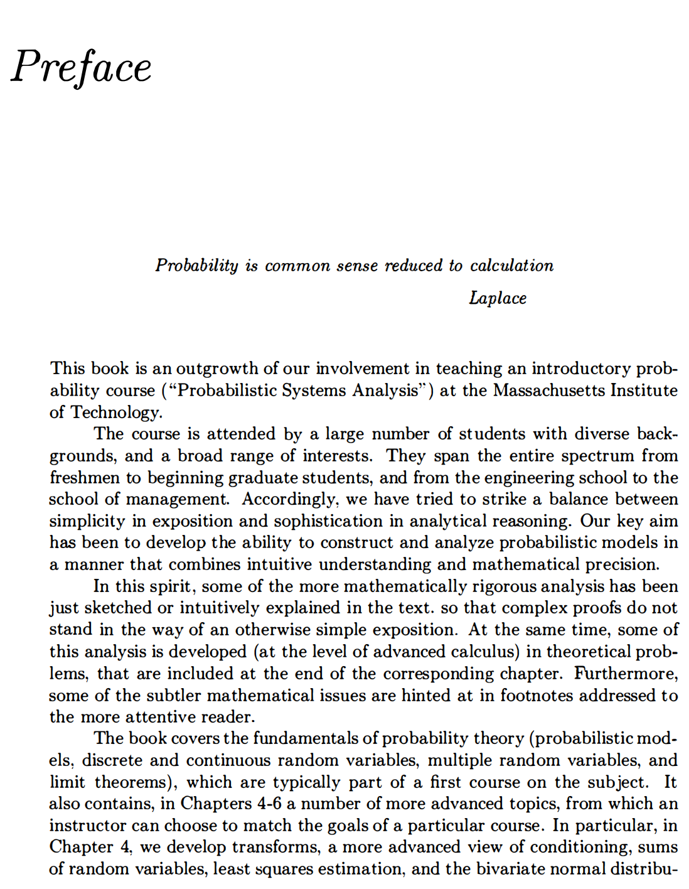
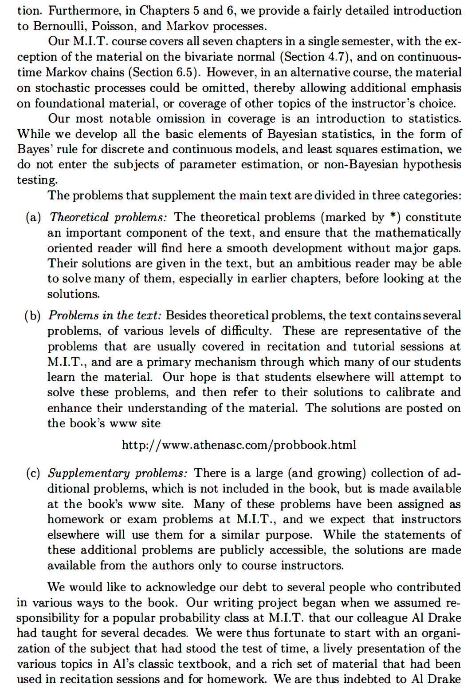
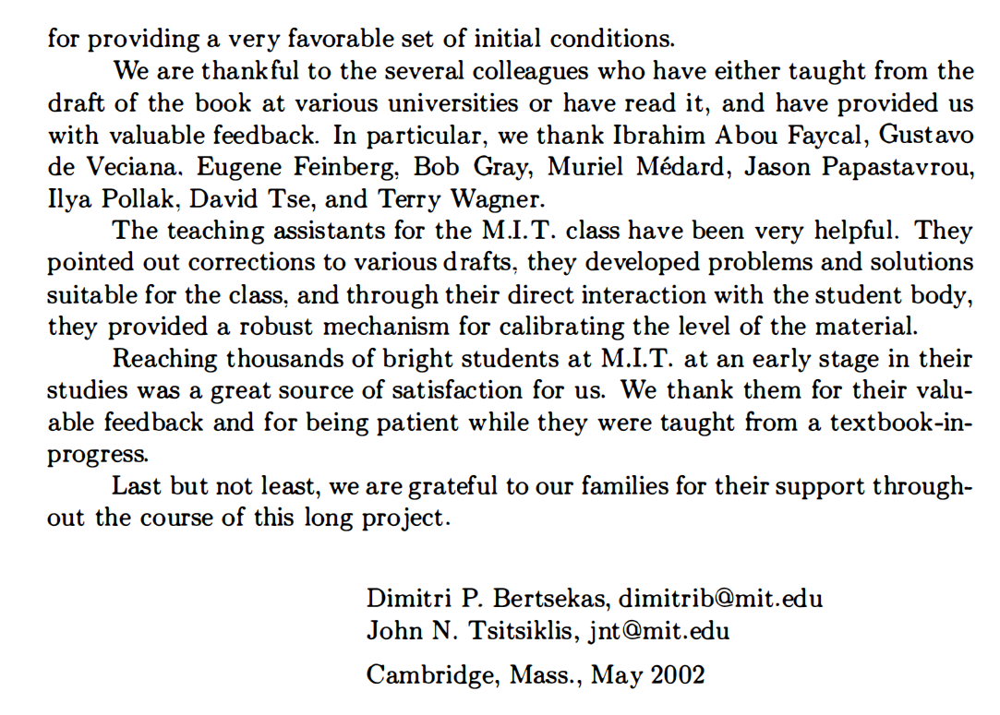
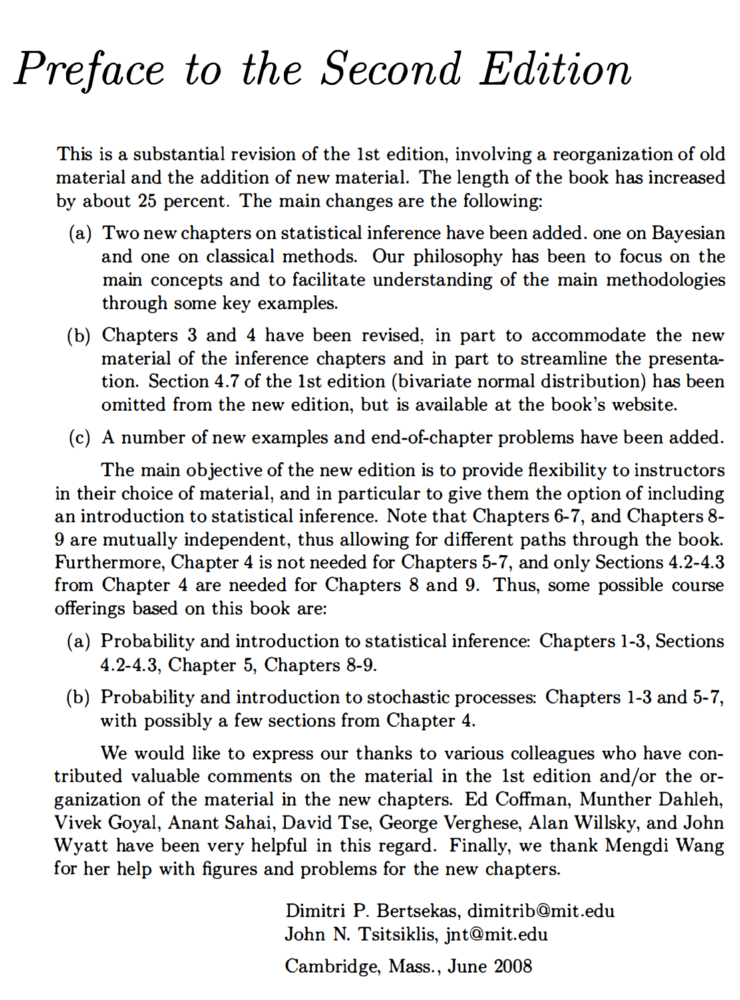
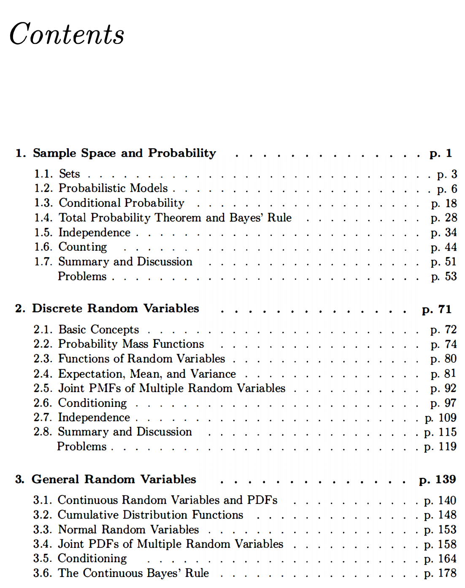
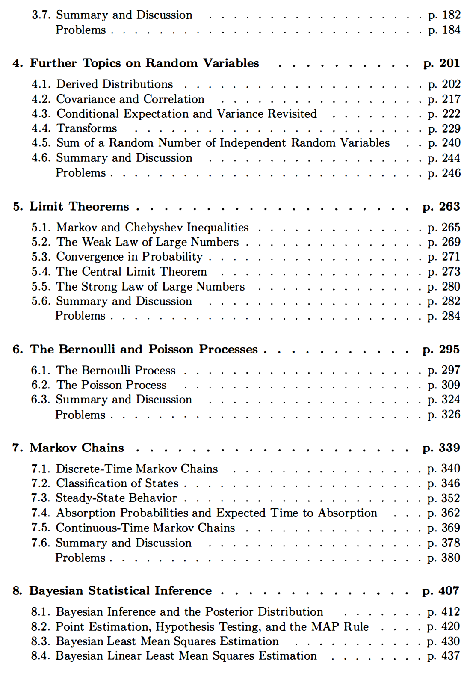
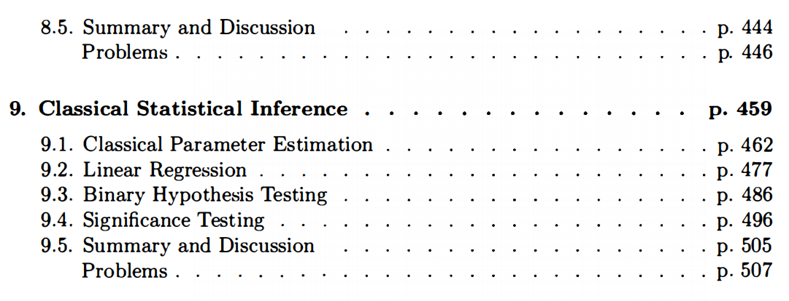

## CHAPTER 0






## Response:
《概率系统分析》前言详解笔记
==============

* * *

一、整体概况
------

这份前言来自 **《Probabilistic Systems Analysis》**（《概率系统分析》），由 MIT 教授 Dimitri P. Bertsekas 与 John N. Tsitsiklis 合著。本书是他们长期教授概率论入门课程的总结，主要面向工科与管理学院的学生。

前言的重点：

1.  **课程背景**：MIT 大量学生参与，涵盖从新生到研究生，背景广泛。
2.  **写作目的**：在直观与数学严谨之间取得平衡，帮助学生既能建立直觉又能掌握精确的推理方法。
3.  **内容覆盖**：概率论基础 + 随机变量 + 随机过程，但**不涉及完整的数理统计**。
4.  **学习路径**：前几章是概率建模与随机变量，后几章涉及更高阶的内容，如变换、条件化、马尔可夫过程等。
5.  **题目设置**：书中问题分为三类（理论、课文内、补充），配合 MIT 的课程体系。

* * *

二、书的目标与方法论
----------

### 1\. 平衡直观与严谨

*   **直观**：通过建模与例子让学生迅速理解。
*   **严谨**：必要时引入数学精确描述。
*   **避免冗余证明**：复杂的证明放在脚注或略去，仅对愿意深入的读者提示。

核心目标：

> 培养学生**构建并分析概率模型**的能力，使之能兼顾直觉和数学推理。

* * *

### 2\. 内容范围

书的主体内容：

*   **基本概率理论**：概率模型、离散/连续随机变量、多维随机变量、大数定律、中心极限定理。
*   **高阶内容**：
    *   第4章：变换（Transforms）、条件化（conditioning）、随机变量和的分布、最小二乘估计、二元正态分布。
    *   第5章、第6章：详细介绍伯努利过程、泊松过程、马尔可夫过程。
*   **未涉及的主题**：完整的数理统计（如参数估计、假设检验，特别是非贝叶斯方法）。

说明：虽然介绍了 **Bayes 公式**（离散与连续情况）、**最小二乘估计**，但并未进入统计推断领域。

* * *

### 3\. 课程安排（MIT 内部）

*   MIT 的课程通常覆盖书中 **7 章**，但不包含：
    *   **二元正态分布**（4.7节）
    *   **连续时间马尔可夫链**（6.5节）
*   可根据需要调整：如跳过随机过程，转而加强基础内容。

* * *

三、习题体系
------

书中题目被分为 **三类**：

### (a) 理论题（Theoretical problems）

*   在正文中以 `*` 标注。
*   旨在保持数学推理的完整性，避免“知识断层”。
*   答案附在正文中，但建议读者先独立尝试。

### (b) 文本内习题（Problems in the text）

*   各种难度的题目，类似 MIT 的课堂习题与讨论题。
*   主要帮助学生**练习与自检**。
*   答案公开在书的网站：
    ```
    http://www.athenasc.com/probbook.html
    ```

### (c) 补充习题（Supplementary problems）

*   不在书中，而是在网站上提供的大量附加题。
*   来源：MIT 的作业与考试题。
*   面向全球学生和教师，题目公开但答案仅供教师使用。

* * *

四、致谢与写作背景
---------

1.  **课程传承**：
    *   前身由 MIT 教授 **Al Drake** 教授几十年，作者继承课程体系并扩展。
    *   书的结构与材料延续了 Al Drake 的经典教材与讲义。
2.  **贡献者**：
    *   特别感谢 Ibrahim Abou Faycal、Gustavo de Veciana、Eugene Feinberg、Bob Gray、Muriel Médard、Jason Papastavrou、Ilya Pollak、David Tse、Terry Wagner 等人提供反馈。
    *   MIT 助教们协助修订草稿、设计题目和解答、与学生互动。
3.  **学生反馈**：
    *   MIT 数千名学生的课堂体验与反馈，为本书提供了宝贵的改进意见。
4.  **个人感谢**：
    *   感谢家人长期的支持，帮助完成这部多年积累的著作。

书末署名：

*   **Dimitri P. Bertsekas**（dimitrib@mit.edu）
*   **John N. Tsitsiklis**（jnt@mit.edu）
*   地点：美国剑桥
*   时间：2002年5月

* * *

五、总结
----

这本书的特点：

1.  **定位清晰**：入门概率论，但面向工科应用，强调模型与直觉。
2.  **结构合理**：从基础到进阶，覆盖到马尔可夫过程，但不包含完整的数理统计。
3.  **习题体系完善**：分为理论、正文、补充，形成渐进学习链条。
4.  **MIT 特色**：高度依赖课堂练习、讨论与作业。
5.  **教学理念**：兼顾“直观启发 + 数学严谨”，为后续更深入的学习打下基础。

* * *

要不要我帮你把这份前言内容进一步转化成 **学习地图**（例如每章的目标、重点、对应的数学先修要求），这样你能直接对照学习概率论的路径？

## Prompt:


## Response:
《概率系统分析》第二版前言详解笔记
=================

* * *

一、整体概况
------

这段文字是 **第二版（2008年6月出版）前言**。相比第一版（2002年），本版是一次 **实质性修订**：重新组织原有内容，增加了约 25% 的新材料，结构更灵活，适合不同教学路径。

* * *

二、主要变化
------

### 1\. 新增章节：统计推断（Statistical Inference）

*   新增 **两章**：
    *   **贝叶斯方法**（Bayesian methods）
    *   **经典方法**（Classical methods，如点估计、区间估计、假设检验）
*   写作理念：注重核心概念，用关键实例帮助理解方法。

> 与第一版不同，第二版正式引入了统计推断的内容，使教材覆盖面从“概率论+随机过程”扩展到了“概率论+统计推断+随机过程”。

* * *

### 2\. 第三、四章修订

*   为了与新加的推断章节协调，**第3章和第4章**被修改。
*   **简化部分内容**，使表达更流畅。
*   \*\*第一版中的 4.7 节（二元正态分布）\*\*不再包含，但可以在书籍网站获取。

* * *

### 3\. 新例题与新习题

*   增加了大量新的示例与章节末尾的习题。
*   使学生在理解与练习上有更多资源。

* * *

三、第二版的总体目标
----------

1.  **给教师更大灵活性**：可以选择是否引入统计推断内容。
2.  **不同章节独立性更强**：
    *   **第6–7章** 与 **第8–9章** 相互独立。
    *   **第4章**只在部分地方对后续章节必要（如 4.2–4.3 对第8–9章必需）。
    *   这样教师可根据课程目标自由组合。

* * *

四、课程可能的结构（不同路径）
---------------

1.  **概率论 + 统计推断**
    *   第1–3章
    *   第4章的部分内容（4.2–4.3）
    *   第5章
    *   第8–9章（统计推断部分）
2.  **概率论 + 随机过程**
    *   第1–3章
    *   第5–7章
    *   再加上第4章的少量内容（仅必要时）

这种灵活结构让教材既可用于统计方向课程，也可用于随机过程方向的课程。

* * *

五、致谢
----

*   感谢在第一版和新章节中提供反馈和组织建议的同事：
    *   **Ed Coffman, Munther Dahleh, Vivek Goyal, Anant Sahai, David Tse, George Verghese, Alan Willsky, John Wyatt**
*   特别感谢 **Mengdi Wang** 协助绘制图表和设计新习题。

* * *

六、署名与时间
-------

*   **作者**：
    *   Dimitri P. Bertsekas (dimitrib@mit.edu)
    *   John N. Tsitsiklis (jnt@mit.edu)
*   **地点**：Cambridge, Mass.
*   **时间**：2008年6月

* * *

七、总结与对比第一版
----------

*   **第一版**（2002）：概率论 + 随机变量 + 随机过程，不包含系统的统计推断。
*   **第二版**（2008）：在保持原有结构的基础上，加入了 **统计推断** 两章，使得内容覆盖从“概率建模 → 随机过程 → 统计分析”更加完整。
*   **灵活性**：第二版强化了“模块化”特点，便于不同课程方向使用。

* * *

要不要我帮你整理一个 **对比表格（第一版 vs 第二版的章节内容与适用课程路径）**，让你能一眼看出修订前后的变化？







## Response:
《概率系统分析》第二版目录详解笔记
=================

* * *

一、整体结构概览
--------

第二版全书共 **九章**，相较于第一版最大的变化是：

*   **前七章**：仍然是概率论与随机过程的核心内容。
*   **新增第八章与第九章**：引入 **统计推断**，分别介绍 **贝叶斯推断** 与 **经典推断**。
*   **整体逻辑路径**：
    *   1–4章：构建概率模型与随机变量的基础框架。
    *   5章：极限定理（大数定律、中心极限定理）。
    *   6–7章：随机过程（伯努利、泊松、马尔可夫链）。
    *   8–9章：统计推断（贝叶斯与经典）。

* * *

二、章节逐一解析
--------

### **第1章：样本空间与概率 (Sample Space and Probability)**

*   1.1 集合论基础 (Sets)
*   1.2 概率模型 (Probabilistic Models)
*   1.3 条件概率 (Conditional Probability)
*   1.4 全概率公式与贝叶斯法则 (Total Probability Theorem & Bayes’ Rule)
*   1.5 独立性 (Independence)
*   1.6 计数方法 (Counting)
*   1.7 小结

**重点**：为概率论打基础，引入条件概率与贝叶斯公式。

* * *

### **第2章：离散型随机变量 (Discrete Random Variables)**

*   2.1 基本概念
*   2.2 概率质量函数 (PMF)
*   2.3 随机变量函数
*   2.4 期望、均值、方差
*   2.5 多维离散随机变量与联合分布
*   2.6 条件分布
*   2.7 独立性
*   2.8 小结

**重点**：离散随机变量建模与计算。

* * *

### **第3章：一般随机变量 (General Random Variables)**

*   3.1 连续型随机变量与概率密度函数 (PDF)
*   3.2 累积分布函数 (CDF)
*   3.3 正态分布 (Normal Random Variables)
*   3.4 多维连续型随机变量
*   3.5 条件分布
*   3.6 连续型贝叶斯法则
*   3.7 小结

**重点**：将第2章思想扩展到连续情形，特别是 **正态分布** 与 **连续贝叶斯法则**。

* * *

### **第4章：随机变量的进一步主题 (Further Topics on Random Variables)**

*   4.1 随机变量变换 (Derived Distributions)
*   4.2 协方差与相关系数 (Covariance & Correlation)
*   4.3 条件期望与条件方差
*   4.4 变换方法 (Transforms, 如 MGF/CGF)
*   4.5 独立随机变量的随机和
*   4.6 小结

**重点**：引入协方差、相关性、变换方法，连接到极限定理与推断。

* * *

### **第5章：极限定理 (Limit Theorems)**

*   5.1 马尔可夫与切比雪夫不等式
*   5.2 弱大数定律 (Weak Law of Large Numbers)
*   5.3 概率收敛
*   5.4 中心极限定理 (CLT)
*   5.5 强大数定律 (Strong Law of Large Numbers)
*   5.6 小结

**重点**：极限定理是从概率论到统计学的桥梁。

* * *

### **第6章：伯努利与泊松过程 (The Bernoulli and Poisson Processes)**

*   6.1 伯努利过程
*   6.2 泊松过程
*   6.3 小结

**重点**：介绍两个最基本的随机过程。

* * *

### **第7章：马尔可夫链 (Markov Chains)**

*   7.1 离散时间马尔可夫链
*   7.2 状态分类
*   7.3 稳态分布
*   7.4 吸收概率与吸收时间
*   7.5 连续时间马尔可夫链
*   7.6 小结

**重点**：马尔可夫链的建模、稳态行为与应用。

* * *

### **第8章：贝叶斯统计推断 (Bayesian Statistical Inference)**

*   8.1 贝叶斯推断与后验分布
*   8.2 点估计、假设检验与 MAP 规则
*   8.3 贝叶斯最小均方估计 (Bayesian Least Mean Squares)
*   8.4 贝叶斯线性最小均方估计 (Bayesian Linear LMS)
*   8.5 小结

**重点**：贝叶斯框架下的估计与推断。

* * *

### **第9章：经典统计推断 (Classical Statistical Inference)**

*   9.1 参数估计 (Classical Parameter Estimation)
*   9.2 线性回归 (Linear Regression)
*   9.3 二元假设检验 (Binary Hypothesis Testing)
*   9.4 显著性检验 (Significance Testing)
*   9.5 小结

**重点**：传统统计学方法，如极大似然估计、回归分析、假设检验。

* * *

三、学习路径总结
--------

1.  **概率论基础课程**：第1–5章
2.  **概率论 + 随机过程课程**：第1–7章
3.  **概率论 + 统计推断课程**：第1–5章 + 第8–9章
4.  **完整路径（进阶/研究生水平）**：第1–9章

* * *

四、与第一版对比
--------

*   **第一版（2002）**：1–7章（概率与随机过程），无系统统计推断。
*   **第二版（2008）**：新增 **第8、9章**，覆盖贝叶斯与经典推断，结构更完整。


