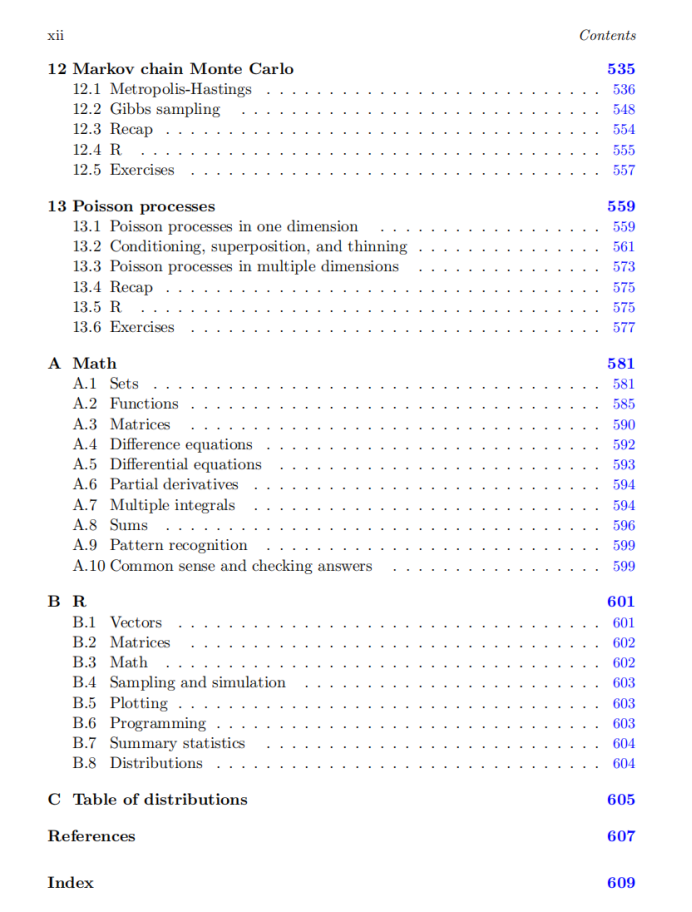
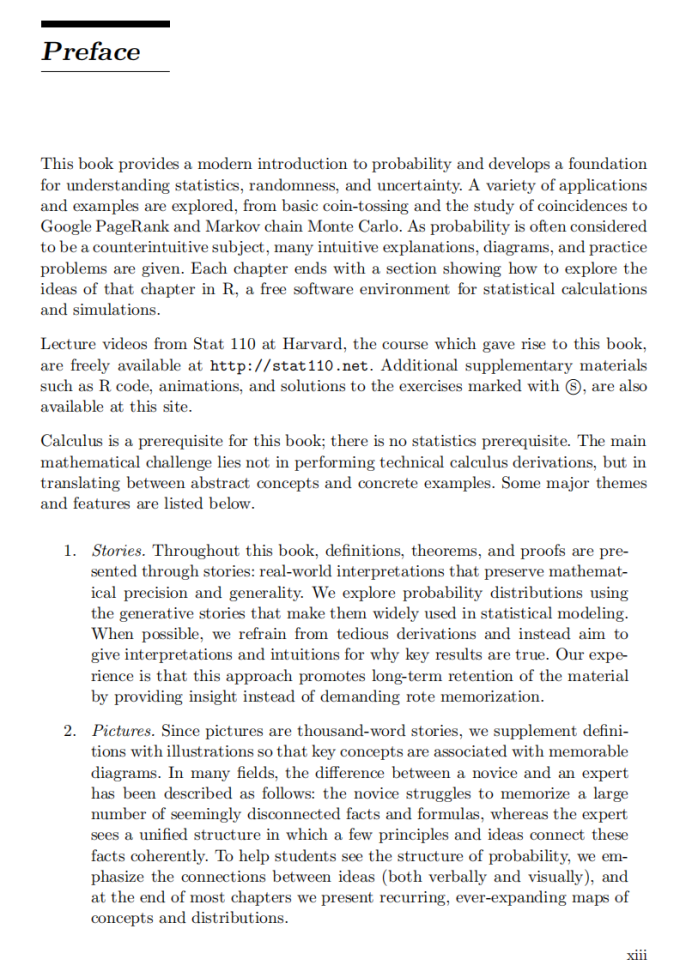

# 概率论 chapter 0

**1．标题：**  
从初步概率到马氏链：一本系统的概率论与数理统计导学笔记

* * *

**2．内容详解：**

下面的笔记将依照图片中显示的目录结构，对各章节的主题与关键知识点做一个贯穿全书的系统梳理和讲解。通过这份笔记，即使没有预先阅读教材，也能对整个概率论和数理统计的脉络有清晰认识，为后续深入学习奠定基础。

* * *

### 第1章　_Probability and counting_

1.1 **Why study probability?**

*   **动机与背景：**
    
    *   概率学在统计、数据科学、金融、工程等领域广泛应用，是研究不确定性及随机过程的核心工具。
        
    *   学习概率能帮助我们正确理解事件发生的可能性、进行风险评估以及做出合理决策。
    
*   **实用性：**
    
    *   在日常生活中，很多现象具有随机性，例如彩票、天气预报等；理解概率能帮助我们判断事件发生的可能性并做出合理预期。
        

1.2 **Sample spaces and Pebble World**

*   **样本空间（Sample Space）：**
    
    *   定义：所有可能结果的集合。
        
    *   例如抛硬币时，样本空间可记为{正面(H)，反面(T)}。
    
*   **Pebble World示例：**
    
    *   教材使用一个“小石子世界”或者其他直观模型来引导对样本空间的理解。
        
    *   通过在有限、可数或可描述的情境中构造样本空间，可以更直观地了解随机试验的结果集合及其特征。
        

1.3 **Naive definition of probability**

*   **频率派/相对频率定义：**
    
    *   “事件发生的概率 = 在大量重复试验中该事件发生的相对频率”。
        
    *   长期频率观点：试验重复无数次后，事件出现次数除以试验总次数趋近于一个常数，这个常数即概率。
    
*   **局限性：**
    
    *   该定义过于依赖无限重复试验的可行性，在某些理论推导时会产生困难；也无法很好解释“先验概率”或“主观概率”等情形。
        

1.4 **How to count**

*   **计数方法：**
    
    *   组合学基础：排列、组合、排列与组合的混合。
        
    *   加法原理与乘法原理：
        
        *   加法原理：互斥事件或情况的数量相加。
            
        *   乘法原理：多步骤事件或多种选择并行时的总数为各步骤可行数的乘积。
    
*   **典型应用：**
    
    *   在计算概率时，需要准确掌握总的样本数或者感兴趣事件的样本数。
        
    *   例如“从 n 个物品中选 k 个”的组合数 C(n, k) 在二项分布或超几何分布建模时会频繁出现。
        

1.5 **Story proofs**

*   **概念：**
    
    *   通过构造“情景”或“故事”来辅助证明某些组合恒等式或概率结论。
        
    *   直观地看出为什么某些计数公式正确，并提供更强的理解感。
    
*   **示例：**
    
    *   例如证明  $\binom{n}{k} = \binom{n}{n-k}$  可以通过“选 k 件物品”和“舍弃 n-k 件物品是等价”的思路来解释。
        

1.6 **Non-naive definition of probability**

*   **公理化概率：**
    
    *   由柯尔莫戈罗夫(Kolmogorov)提出的概率三公理：非负性、公认的规范化以及可列可加性。
        
    *   用集合论方式刻画事件与概率函数，为后续所有严格的概率推导奠定基础。
    
*   **与朴素定义的衔接：**
    
    *   频率概念可以被当作对公理化定义的一种解释。公理化使概率理论更具有一般性和数学严谨性。
        

1.7 **Recap**

*   对第1章涉及的核心概念——为什么研究概率、样本空间、朴素概率定义、组合计数方法以及公理化定义进行总结回顾。
    

1.8 **R**

*   介绍如何在统计软件R中利用简单的函数进行概率演算与模拟，如 `choose(n,k)`（组合数），或简单的概率试验模拟等。
    

1.9 **Exercises**

*   提供本章基础概念与计算技巧的练习题，以巩固对样本空间、概率定义及组合计数的掌握。
    

* * *

### 第2章　_Conditional probability_

2.1 **The importance of thinking conditionally**

*   **条件思维：**
    
    *   不同条件下，事件发生概率可能发生显著变化。
        
    *   通过条件概率，可以更好地评估在不同信息背景下事件的可能性。
        

2.2 **Definition and intuition**

*   **条件概率公式：**
    
    $$
     P(A \mid B) = \frac{P(A \cap B)}{P(B)}, \quad P(B) > 0.
    $$
    
*   **直观理解：**
    
    *   在已知事件 B 发生的前提下，我们只关注 B 所限定的样本空间，再看 A 在其中发生的比例。
        

2.3 **Bayes’ rule and the law of total probability**

*   **Bayes’ rule：**
    
    $$
     P(A \mid B) = \frac{P(B \mid A) \, P(A)}{P(B)}.
    $$
    
*   **全概率公式（Law of total probability）：**
    
    *   用于把一个事件的概率分解到若干互斥子事件上，写作
        
        $$
         P(B) = \sum_i P(B \mid A_i) P(A_i).
        $$
        
    *   特别在多假设或分层模型中非常有用。
        

2.4 **Conditional probabilities are probabilities**

*   在理解条件概率时，必须记住它们依旧满足公理化要求（非负性、总和为1，可列可加性），只是底层样本空间被“限制”在条件事件发生的情形中。
    

2.5 **Independence of events**

*   **独立性定义：**
    
    $$
     P(A \cap B) = P(A)P(B).
    $$
    
    等价于
    
    $$
     P(A \mid B) = P(A), \quad P(B \mid A) = P(B).
    $$
    
*   **常见误区：**
    
    *   两事件不相关并不一定意味着独立（但在随机变量相关性分析中，独立    $\implies$  不相关）。要注意区分概念。
        

2.6 **Coherency of Bayes’ rule**

*   **一致性：**
    
    *   Bayes公式在公理化框架下的一致性，不会因为多次迭代而产生矛盾。
        
    *   强调先验、似然和后验的逻辑关系。
        

2.7 **Conditioning as a problem-solving tool**

*   **简化问题：**
    
    *   通过将问题分解到条件事件上，简化或分块分析复杂概率模型。
        
    *   在期望、方差甚至更深层分析时，条件化都能显著降低难度。
        

2.8 **Pitfalls and paradoxes**

*   **典型案例：**
    
    *   Monty Hall问题、Simpson悖论、检验中的假阳性假阴性误差等。
        
    *   强调如果不正确运用条件概率，容易引发直觉上的“悖论”。
        

2.9 **Recap**

*   整理条件概率、Bayes’ rule、独立性以及常见陷阱等要点。
    

2.10 **R**

*   在R中模拟或计算条件概率、Bayes推断以及可视化结果（如朴素贝叶斯模型的简单实现等）。
    

2.11 **Exercises**

*   以各种情景化例题考察条件概率的应用与熟练度。
    

* * *

### 第3章　_Random variables and their distributions_

3.1 **Random variables (r.v.s)**

*   **定义：**
    
    *   将样本空间中的每个元素映射为一个实数（或更广泛的数值），用来量化随机试验结果的数值表现。
    
*   **离散型与连续型随机变量：**
    
    *   离散型：取值通常为可数集合（整数、有限集合等）。
        
    *   连续型：取值为某个实区间内的所有实数，通常需要用密度函数描述。
        

3.2 **Distributions and probability mass functions (pmf)**

*   **离散分布：**
    
    *   以概率质量函数(pmf)  $p_X(x) = P(X=x)$ 描述。
    
*   **分布函数：**
    
    *   累积分布函数(CDF)  $F_X(x) = P(X \le x)$ 既适用于离散也适用于连续。
        

3.3 **Bernoulli and Binomial**

*   **Bernoulli：**
    
    *   只有两种结果(0或1)；参数 $p$ 表示成功概率。
    
*   **Binomial：**
    
    *   n次独立Bernoulli试验成功次数的分布；参数(n, p)。
        
    *   pmf： $\displaystyle P(X=k) = \binom{n}{k} p^k (1-p)^{n-k}$ 。
        

3.4 **Hypergeometric**

*   **超几何分布：**
    
    *   适用场景：从不放回的有限总体中抽取样本，求成功个数的分布。
        
    *   与Binomial最大的区别在于抽取方式是否有放回/独立。
        

3.5 **Discrete Uniform**

*   **离散均匀分布：**
    
    *   在某有限可数集合上取值且每个点的概率相等，例如1到n之间每个整数都有相同概率 $\frac{1}{n}$ 。
        

3.6 **Cumulative distribution functions (CDFs)**

*   **累积分布函数性质：**
    
    *   非减、右连续，范围\[0,1\]，并且 $\lim_{x\to -\infty}F_X(x)=0,\ \lim_{x\to +\infty}F_X(x)=1$ 。
    
*   **离散型CDF的跳跃：**
    
    *   每个原子点(可能取值)处跃升，跃升大小就是该点的pmf值。
        

3.7 **Functions of random variables**

*   **方法：**
    
    *   若是简单函数(如线性变换)，直接代入即可。
        
    *   更复杂情形可先写出分布函数或利用变换技巧(如在离散情形列举，在连续情形用Jacobian等)。
        

3.8 **Independence of r.v.s**

*   **随机变量独立：**
    
    *   若对于任意的x和y， $P(X \le x, Y \le y) = P(X \le x)P(Y \le y)$ 。
        
    *   离散时则是pmf可分解为乘积；连续时pdf可分解。
        

3.9 **Connections between Binomial and Hypergeometric**

*   **对比：**
    
    *   Binomial是有放回抽样(独立试验)的成功次数；Hypergeometric是无放回抽样的成功次数。
        
    *   当总体很大、样本量远小于总体时，Hypergeometric可近似为Binomial。
        

3.10 **Recap**

*   本章核心：随机变量概念、常见离散分布(pmfs)以及它们的基本性质和计算方式。
    

3.11 **R**

*   在R中如何生成离散随机变量、计算或模拟Bernoulli、Binomial、Hypergeometric等分布，如 `rbinom()`、`dhyper()` 等函数。
    

3.12 **Exercises**

*   不同类型离散随机变量题目，如计算分布、期望、方差，以及练习独立性判定等。
    

* * *

### 第4章　_Expectation_

4.1 **Definition of expectation**

*   **离散型随机变量的期望：**
    
    $$
     E[X] = \sum_{x} x \, p_X(x).
    $$
    
*   **连续型随机变量的期望：**
    
    $$
     E[X] = \int_{-\infty}^{\infty} x \, f_X(x)\, dx.
    $$
    

4.2 **Linearity of expectation**

*   **结论：**
    
    *   对任意随机变量 $X$ 和 $Y$ 以及常数 $a,b$ ， $E[aX + bY] = aE[X] + bE[Y]$ 。
        
    *   这一性质不需要 $X$ 和 $Y$ 独立，是常用的简化工具。
        

4.3 **Geometric and Negative Binomial**

*   **几何分布：**
    
    *   表示直到第一次成功所需的试验次数或失败次数；期望可利用求和技巧推导。
    
*   **负二项分布：**
    
    *   推广到“直到r次成功所需的试验总次数”的分布；包含几何分布作为特例(r=1)。
        

4.4 **Indicator r.v.s and the fundamental bridge**

*   **指示随机变量：**
    
    *   对某事件 $A$ ，定义 $I_A = 1$ （如果事件 $A$ 发生），否则为0。
        
    *   可以将复杂事件的期望拆分为若干指示变量之和，从而大幅简化计算。
        
    *   **“桥”思想：**  $E[I_A] = P(A)$ 。
        

4.5 **Law of the unconscious statistician (LOTUS)**

*   **无意识统计学家法则：**
    
    *   若 $Y = g(X)$ ，则 $E[g(X)] = \sum_{x} g(x)p_X(x)$  (离散)或 $\int g(x) f_X(x) dx$ (连续)。
        
    *   不需要先求出 $Y$ 的分布再求期望，可以直接对 $X$ 做加总/积分。
        

4.6 **Variance**

*   **方差定义：**
    
    *    $Var(X) = E[(X - E[X])^2] = E[X^2] - (E[X])^2$ 。
        
    *   用于衡量随机变量离散程度，常与标准差 $\sqrt{Var(X)}$ 结合使用。
        

4.7 **Poisson**

*   **Poisson分布：**
    
    *   典型场景：单位时间(或空间)随机事件出现的计数，且事件发生相互独立。
        
    *   参数 $\lambda$ ，表示平均事件发生率；期望和方差均为 $\lambda$ 。
        

4.8 **Connections between Poisson and Binomial**

*   当 $n$ 大且 $p$ 小， $np = \lambda$ 固定时，Binomial(n,p)可近似为Poisson( $\lambda$ )。
    

4.9 **\*Using probability and expectation to prove existence**

*   **进阶话题：**
    
    *   通过期望、概率不等式等，证明某些事件的存在性，而不一定显式构造出该事件（常见于极值或算法分析）。
        

4.10 **Recap**

*   小结期望与方差的计算与应用；强调指示变量技巧、线性性质以及常见分布的期望和方差公式。
    

4.11 **R**

*   在R中计算和模拟各种分布的期望与方差，如 `mean()`、`var()` 函数以及随机数生成函数等。
    

4.12 **Exercises**

*   练习期望、方差以及常见分布性质的各种题目。
    

* * *

### 第5章　_Continuous random variables_

5.1 **Probability density functions (pdf)**

*   **密度函数与分布函数：**
    
    *    $f_X(x)$ 必须满足 $f_X(x) \ge 0$ 且 $\int f_X(x)\,dx = 1$ 。
        
    *    $F_X(x) = \int_{-\infty}^{x} f_X(t)\,dt$ 。
    
*   **与离散分布的区别：**
    
    *   连续情形中 $P(X=a)=0$ ，更多关注区间上的概率。
        

5.2 **Uniform**

*   **\[a,b\]上的均匀分布：**
    
    *   pdf为 $\frac{1}{b-a}$ ，方差、期望可直接积分计算。
        

5.3 **Universality of the Uniform**

*   **概率积分变换(重要性质)：**
    
    *   若 $X$ 是任意连续随机变量， $F_X(X)$ 会服从Uniform(0,1)。
        
    *   这一性质对模拟和推断非常关键。
        

5.4 **Normal**

*   **高斯分布：**
    
    *   pdf： $\displaystyle f(x) = \frac{1}{\sqrt{2\pi}\sigma}\exp\Big(-\frac{(x-\mu)^2}{2\sigma^2}\Big)$ 。
        
    *   中心极限定理(CLT)的核心分布，也是许多自然现象近似分布的基础。
        

5.5 **Exponential**

*   **指数分布：**
    
    *   典型“无记忆”性质；在排队论、寿命分析等应用广泛。
        
    *   pdf： $\lambda e^{-\lambda x}$ ， $x \ge 0$ 。
        

5.6 **Poisson processes**

*   虽然在标题里，这里仅做简要介绍(较完整在第13章)。主要说明：
    
    *   指数分布和Poisson过程之间的联系：在Poisson过程里，事件间隔时间服从指数分布。
        

5.7 **Symmetry of i.i.d. continuous r.v.s**

*   **独立同分布随机变量的对称性：**
    
    *   在次序统计量、样本均值等方面的对称性特征，常用来做推断或估计。
        

5.8 **Recap**

*   重点回顾连续型分布与离散型分布的异同；掌握Uniform、Normal、Exponential等关键分布。
    

5.9 **R**

*   在R中使用 `dnorm()`、`dunif()`、`dexp()` 等函数生成或评估这些分布，并进行可视化。
    

5.10 **Exercises**

*   针对各种连续分布的基础计算、期望方差分析，以及混合分布或简单转化计算。
    

* * *

### 第6章　_Moments_

6.1 **Summaries of a distribution**

*   **矩(Moments)：**
    
    *   各阶矩 $E[X^k]$ 能够概括分布的重要信息，如位置、离散程度、偏度(skewness)、峰度(kurtosis)等。
        

6.2 **Interpreting moments**

*   **几何意义：**
    
    *   一阶矩=期望；二阶矩与方差的关系；更高阶矩对应分布形状信息。
        

6.3 **Sample moments**

*   **样本矩：**
    
    *   在实际数据中，用 $\frac{1}{n}\sum_{i=1}^n X_i^k$ 来估计总体k阶矩。
        
    *   与统计推断中样本均值、样本方差、偏度、峰度等联系紧密。
        

6.4 **Moment generating functions (MGFs)**

*   **定义：**
    
    $$
     M_X(t) = E[e^{tX}],
    $$
    
    在 $t$ 附近展开可得到分布所有阶矩。
    
*   **存在性：**
    
    *   并非所有随机变量都存在MGF（如Cauchy分布就没有）。
        

6.5 **Generating moments with MGFs**

*   **求矩：**
    
    *    $\frac{d^k}{dt^k} M_X(t)\bigg|_{t=0} = E[X^k]$ 。
    
*   **常见分布MGF：**
    
    *   包括Bernoulli、Binomial、Poisson、Normal等，掌握其标准形式在分析独立性、和分布时很有帮助。
        

6.6 **Sums of independent r.v.s via MGFs**

*   **关键性质：**
    
    *   对独立随机变量 $X$ 和 $Y$ ， $M_{X+Y}(t) = M_X(t)\cdot M_Y(t)$ 。
        
    *   这为研究和分布、中心极限定理打下基础。
        

6.7 **\*Probability generating functions**

*   **PGF定义：**
    
    *   对离散非负整数值随机变量： $G_X(s) = E[s^X]$ 。
        
    *   在研究离散型随机变量(特别是计数分布，如Poisson、Binomial)时非常有用。
        

6.8 **Recap**

*   汇总矩、MGF、PGF在分布分析中的应用与优缺点。
    

6.9 **R**

*   演示如何用R计算样本矩、绘制MGF或PGF曲线等示例。
    

6.10 **Exercises**

*   包括对高阶矩、MGF性质以及独立随机变量和分布求和的相关综合练习。
    

* * *

### 第7章　_Joint distributions_

7.1 **Joint, marginal, and conditional**

*   **联合分布：**
    
    *   若 $(X,Y)$ 是二维随机变量，联合pmf/pdf记为 $f_{X,Y}(x,y)$ 。
    
*   **边缘分布：**
    
    *    $\displaystyle f_X(x) = \sum_{y} f_{X,Y}(x,y)$  (离散) 或  $\int f_{X,Y}(x,y)\,dy$  (连续)。
    
*   **条件分布：**
    
    *    $\displaystyle f_{Y\mid X}(y \mid x) = \frac{f_{X,Y}(x,y)}{f_X(x)}$ 。
    

7.2 **2D LOTUS**

*   **二维情形的无意识统计学家定理：**
    
    *   对 $g(X,Y)$ 的期望可直接对联合分布做加总或积分：
        
        $$
         E[g(X,Y)] = \sum_x\sum_y g(x,y)f_{X,Y}(x,y) \quad \text{或} \quad \int \int g(x,y)f_{X,Y}(x,y)\,dxdy.
        $$
        

7.3 **Covariance and correlation**

*   **协方差：**
    
    $$
     Cov(X,Y) = E[XY] - E[X]E[Y].
    $$
    
    衡量两个随机变量间线性相关程度。
    
*   **相关系数：**
    
    $$
     \rho_{X,Y} = \frac{Cov(X,Y)}{\sqrt{Var(X)Var(Y)}}.
    $$
    

7.4 **Multinomial**

*   **多项分布：**
    
    *   将Binomial拓展到k类结果的情形；若在一次试验中结果可以是k种类型，每种类型概率之和为1。
        
    *   参数 $(n; p_1,\dots,p_k)$ 。
        

7.5 **Multivariate Normal**

*   **多元正态分布：**
    
    *   在高维情形中，对向量 $\mathbf{X}$ 的分布进行描述；由均值向量和协方差矩阵决定形状。
        
    *   在多元统计、机器学习领域应用极其广泛。
        

7.6 **Recap**

*   小结：联合分布、边缘分布、条件分布之间的关系，常见的高维分布(多项式、多元正态)等。
    

7.7 **R**

*   使用R计算或模拟联合分布、画出散点图、估计协方差与相关系数等常规操作。
    

7.8 **Exercises**

*   综合题目练习，涉及联合/条件分布计算、多元分布性质、协方差与相关分析等。
    

* * *

### 第8章　_Transformations_

8.1 **Change of variables**

*   **随机变量变换：**
    
    *   一维变换： $Y=g(X)$ 时，通过CDF或pdf之间的关系（Jacobian法）找出 $Y$ 的分布。
        
    *   多维变换：需要用Jacobian行列式并注意映射的单射性。
        

8.2 **Convolutions**

*   **卷积：**
    
    *   若 $X$ 和 $Y$ 独立，要找 $Z=X+Y$ 的分布，可用卷积：
        
        $$
         f_Z(z) = \int f_X(x)f_Y(z-x)\,dx.
        $$
        

8.3 **Beta**

*   **Beta分布：**
    
    *   定义在区间(0,1)上，pdf常写作：
        
        $$
         f(x;\alpha,\beta) = \frac{x^{\alpha-1}(1-x)^{\beta-1}}{B(\alpha,\beta)},\quad x\in(0,1).
        $$
        
    *   常出现在贝叶斯推断、比例数据建模等场景。
        

8.4 **Gamma**

*   **Gamma分布：**
    
    *   一般形式： $\displaystyle f(x;k,\theta) = \frac{1}{\Gamma(k)\theta^k} x^{k-1} e^{-x/\theta}$ ， $x>0$ 。
        
    *   当 $k=n$ 为整数时，对应 Erlang分布；当 $k=1$ 时即指数分布。
        

8.5 **Beta-Gamma connections**

*   **重要联系：**
    
    *   如果 $X \sim \Gamma(\alpha, 1)$ 且 $Y=\sum_i X_i$ ，或者Beta与Gamma在分式变换中也有紧密关系。
        
    *   Beta可视作Gamma分布比值的一种形式。
        

8.6 **Order statistics**

*   **次序统计量：**
    
    *   对i.i.d样本 $X_1,\dots,X_n$ 从小到大排序后得到 $X_{(1)}\le X_{(2)}\le \cdots \le X_{(n)}$ 。
        
    *   常用于区间估计、极值分析，分布可用Beta函数进行推导。
        

8.7 **Recap**

*   回顾变换的关键方法：Jacobian、卷积，以及常见特殊分布Beta、Gamma及它们间的联系。
    

8.8 **R**

*   在R中如何生成Beta、Gamma分布样本，或者求卷积分布（如用数值积分或模拟方式）。
    

8.9 **Exercises**

*   结合变换技术和特殊分布的综合性题目，如找和/差的分布、Beta-Gamma关系及次序统计量分布。
    

* * *

### 第9章　_Conditional expectation_

9.1 **Conditional expectation given an event**

*   **定义：**
    
    *   与条件概率类似，固定某事件发生时的期望计算。
        
    *    $E[X \mid A] = \frac{1}{P(A)}\int_{A} x\, dP(x)$  (连续情形) 或相应离散形式。
    

9.2 **Conditional expectation given an r.v.**

*   **随机变量条件期望：**
    
    *    $E[X \mid Y]$ 本身也是一个随机变量。
        
    *   反映了在给定Y的数值信息后，对X的平均预测。
        

9.3 **Properties of conditional expectation**

*   **线性、取外期望的性质：**
    
    *    $E[E[X \mid Y]] = E[X]$ 。
        
    *   条件期望的线性、单调等性质在很多推导中起到关键作用。
        

9.4 **\*Geometric interpretation of conditional expectation**

*   **投影观点：**
    
    *   在Hilbert空间 $L^2$ 概念中，可将 $E[X \mid Y]$ 理解为对X在以Y张成的子空间的“正交投影”。
        

9.5 **Conditional variance**

*   **定义：**
    
    *    $Var(X\mid Y) = E[(X - E[X\mid Y])^2 \mid Y]$ 。
        
    *   也有分解公式： $Var(X) = E[Var(X\mid Y)] + Var(E[X\mid Y])$ 。
        

9.6 **Adam and Eve examples**

*   **命名示例：**
    
    *   教材可能构造一个有趣的场景(“Adam and Eve”)来展示条件期望在猜测或预测中的应用。
        

9.7 **Recap**

*   综合：条件期望的定义、性质及计算技巧。
    

9.8 **R**

*   如何在R中通过模拟或数据分组计算条件期望、条件方差等。
    

9.9 **Exercises**

*   各种条件期望和方差的练习，包括与Bayes公式、投影解释等挂钩的思考题。
    

* * *

### 第10章　_Inequalities and limit theorems_

10.1 **Inequalities**

*   **Chebyshev, Markov, Jensen等不等式：**
    
    *   用于界定尾部概率、估计或比较期望；在大数定理、集中不等式中皆有应用。
        

10.2 **Law of large numbers (LLN)**

*   **大数定理：**
    
    *    $ \frac{1}{n}\sum_{i=1}^n X_i \xrightarrow{a.s. / p} E[X]$ 。
        
    *   说明当样本数增多，样本平均值收敛到总体期望。
        

10.3 **Central limit theorem (CLT)**

*   **中心极限定理：**
    
    *   独立同分布随机变量的和在适当标准化后趋近于正态分布；
        
    *    $\sum X_i\approx N(n\mu, n\sigma^2)$  当n大时。
    

10.4 **Chi-Square and Student-t**

*   **常见相关分布：**
    
    *    $\chi^2$ 分布：正态分布平方和的分布；在方差检验中常出现。
        
    *   t分布：样本量小、方差未知情形下基于正态的推断分布。
        

10.5 **Recap**

*   整理各大不等式与极限定理的核心思想与应用场景。
    

10.6 **R**

*   在R中利用随机模拟演示大数定理、中心极限定理，或计算 $\chi^2$ 、t分布相关概率。
    

10.7 **Exercises**

*   理论推导与实际应用结合，如证明或使用各种不等式和极限定理；涉及统计推断的例子等。
    

* * *

### 第11章　_Markov chains_

11.1 **Markov property and transition matrix**

*   **马氏性：**
    
    *   未来只依赖当前状态，而与过去历史无关。
    
*   **转移矩阵：**
    
    *   离散马氏链中，用矩阵 $P$ 记录从一个状态转移到另一个状态的概率。
        

11.2 **Classification of states**

*   **状态类型：**
    
    *   可达性、常返/非常返状态、周期性/无周期等概念。
    
*   **收敛性：**
    
    *   对遍历马氏链，状态分布会随迭代趋近于唯一的平稳分布。
        

11.3 **Stationary distribution**

*   **平稳分布 $\pi$ ：**
    
    *   满足 $\pi P = \pi$ ，是链长时间运行后系统所处的稳定概率分布。
        

11.4 **Reversibility**

*   **可逆马氏链：**
    
    *   存在 $\pi$ 使得 $\pi_i p_{ij} = \pi_j p_{ji}$ ；在马尔可夫链蒙特卡罗等算法中有重要意义。
        

11.5 **Recap**

*   小结马氏链的核心概念与定理：马氏性、转移矩阵、分类、平稳分布等。
    

11.6 **R**

*   用R语言构建马氏链、计算转移概率、模拟轨迹、验证平稳分布等。
    

11.7 **Exercises**

*   检验状态分类、长期分布计算、实际问题建模和模拟。
    

* * *

### 第12章　_Markov chain Monte Carlo_

12.1 **Metropolis-Hastings**

*   **算法思想：**
    
    *   通过提议分布和接受-拒绝机制，在复杂分布上进行抽样的马尔可夫链方法。
        

12.2 **Gibbs sampling**

*   **条件抽样：**
    
    *   对于多维分布，交替地从各条件分布中抽样，从而得到全局分布的样本。
        
    *   在贝叶斯推断等高维推断中非常重要。
        

12.3 **Recap**

*   MCMC核心：用马氏链的长程行为在复杂概率分布上进行逼近和采样。
    

12.4 **R**

*   R的MCMC包或自写脚本示例，展示如何实现Metropolis-Hastings或Gibbs sampling。
    

12.5 **Exercises**

*   练习题包括动手编写简单的MCMC程序、验证收敛性、比较不同提议分布效率等。
    

* * *

### 第13章　_Poisson processes_

13.1 **Poisson processes in one dimension**

*   **基本性质：**
    
    *   独立增量、固定时间间隔内事件数服从Poisson分布，间隔时间服从指数分布。
        

13.2 **Conditioning, superposition, and thinning**

*   **关键操作：**
    
    *   不同Poisson过程叠加后仍是Poisson过程；
        
    *   对Poisson过程进行“删减”或“保留”，分别得到子过程，也满足Poisson性（在一定条件下）。
        

13.3 **Poisson processes in multiple dimensions**

*   扩展到更高维度（如平面中的点过程），在空间点模式或网络流分析有广泛应用。
    

13.4 **Recap**

*   总结Poisson过程在时间/空间维度下的特征和建模技巧。
    

13.5 **R**

*   R中可使用如`pprocess`或相关包来模拟与分析Poisson过程。
    

13.6 **Exercises**

*   针对Poisson过程基本性质、综合应用（如队列模型或空间统计）设置的题目。
    

* * *

### 附录A　_Math_

A.1 **Sets**

*   集合及运算符号复习，子集、并集、交集等。
    

A.2 **Functions**

*   函数与映射的相关概念，单射、满射与双射等。
    

A.3 **Matrices**

*   矩阵运算基础：加法、数乘、矩阵乘法、转置、逆矩阵等。
    

A.4 **Difference equations**

*   离散版微分方程，如递推关系： $x_{n+1}=f(x_n)$ 。
    

A.5 **Differential equations**

*   连续版微分方程基础(一阶、二阶等)，在建模中常配合概率思路使用。
    

A.6 **Partial derivatives**

*   多元微分基础，用于Jacobian法、多元函数极值分析等。
    

A.7 **Multiple integrals**

*   重要于多维随机变量概率计算(如联合分布、条件分布)。
    

A.8 **Sums**

*   常见求和技巧与公式(几何级数等)。
    

A.9 **Pattern recognition**

*   与机器学习或模式识别的简单衔接概念。
    

A.10 **Common sense and checking answers**

*   提示读者在做数学或概率运算时要关注合理性检验与常识检查。
    

* * *

### 附录B　_R_

B.1 **Vectors**

*   R语言中向量的基本操作：创建、索引、运算等。
    

B.2 **Matrices**

*   矩阵创建、`matrix()`函数、子集操作、矩阵乘法等。
    

B.3 **Math**

*   在R中进行数学运算、内建函数(`sin()`, `exp()` 等)。
    

B.4 **Sampling and simulation**

*   `sample()` 函数、各种分布随机数生成 (`rnorm()`, `runif()`, etc.)。
    

B.5 **Plotting**

*   `plot()`及其拓展(`hist()`, `boxplot()`, `ggplot2`包等)。
    

B.6 **Programming**

*   R脚本、`for`循环、`if`语句、`apply`族函数等。
    

B.7 **Summary statistics**

*   `mean()`, `sd()`, `summary()` 等对数据进行描述性统计。
    

B.8 **Distributions**

*   R中关于分布函数的命名规范 (`dxxx()`, `pxxx()`, `qxxx()`, `rxxx()`)。
    

* * *

### 附录C　_Table of distributions_

*   **分布表：**
    
    *   重点分布的参数、均值、方差、MGF及常用性质索引表，方便快速查阅。
        

* * *

### References

*   书中参考文献列表，涉及概率与统计的经典文献与论文。
    

* * *

### Index

*   全书的索引，方便快速定位到相关定义和公式所在的页面。
    

* * *

**3．总结本次部分涉及的内容：**

*   通过以上对目录每一章的细致解读，我们可以看到本教材从最基础的概率公理体系与计数方法出发，逐步深入到随机变量（离散与连续）的分布与期望、方差等性质，再进入更高阶的矩与母函数、联合分布以及各类高级话题（如变换、条件期望、不等式与极限理论、马氏链、MCMC、Poisson过程等）。
    
*   附录部分还提供了必要的数学和R语言补充，使读者在学习本书时能快速衔接所需的数学基础与编程模拟手段。
    
*   整体而言，这是一门相当完整而系统的概率论与数理统计导论，为后续的统计学、高等概率研究、机器学习、数据科学、金融模型等提供坚实的理论基石。
    

**4．报错：**

*   本次图片内容清晰，笔记已对每个目录条目做了尽可能全面的讲解，无需额外更正。若后续发现有具体公式或推导细节需要展开，可在后面章节配合课本及更多图片进行深入探讨。

**1．标题：**  
现代概率论的实践导向前言：从直观故事到统计思维的全新启航

* * *

**2．详细内容解析：**

以下笔记基于截图中“Preface（前言）”的完整内容，为便于理解，特将关键主题与细节分条展开，帮助读者在开始学习本书前，对本书的定位、特色与学习方式有一个清晰而深入的认识。

* * *

### （1）本书定位与总体特色

1.  **现代引介、奠基统计与不确定性分析：**
    
    *   本书提供了一个现代的概率论入门，并为理解统计学、随机性以及不确定性打下坚实基础。
        
    *   涉及从最基础的掷硬币、巧合性研究到Google PageRank算法以及马尔可夫链蒙特卡罗等丰富应用场景。
        
    *   之所以称之为“现代”，是因为书中紧密联系当下常见数据分析、网络算法、机器学习等新兴领域。
    
2.  **应对概率直觉困难、提供直观工具：**
    
    *   概率常常被认为反直觉或难以琢磨，因此本书以各种直观的解释、图解和示例，配合大量练习题帮助读者克服理解障碍。
        
    *   在每章结尾，还会给出如何在R语言中探索对应概念的方法，使学习更加具体、可操作。
    
3.  **课程与资源来源：**
    
    *   这本书源于哈佛大学的Stat 110课程。相关的课程视频可在[http://stat110.net](http://stat110.net)免费获取。
        
    *   该网站还提供额外的补充资料，如R代码示例、动画演示和标有特殊符号(例如 $\biohazard$ )的练习题解析等。
    
4.  **数学和统计前置要求：**
    
    *   本书对微积分（Calculus）有一定要求，但不需要具备更深入的统计学先修知识。
        
    *   书中不会过分聚焦繁琐的微积分推导，更多强调的是从抽象概念到具体应用的转换；即在有微积分思维支持的基础上，通过实例与故事来建构概率论理解。
        

* * *

### （2）书中的主要主题与教学特色

在本书的前言里，作者特别强调了六大教学核心要点，使读者在学习时能够快速把握本书的写作特色和方法论：

1.  **Stories（故事）：**
    
    *   全书中，定义、定理、证明都力求通过现实世界的情景、浅显易懂的“故事”来呈现，以兼顾数学的严谨和应用的广泛性。
        
    *   通过“生成式故事（generative stories）”来阐述为什么这些分布和方法被广泛应用于统计建模；尽可能避免过度重复和抽象的演绎推导。
        
    *   这样的“故事”视角会带给读者更形象的直觉和思考方式，同时有助于长久记忆与理解。
    
2.  **Pictures（图示）：**
    
    *   书中配有大量插图，用来直观展示概率论中关键概念，以便读者将抽象理论与清晰形象联系起来。
        
    *   在许多领域，新手与专家的区别在于能否将大量零碎的公式和概念融会贯通。本书在图示中突显要点及概念之间的关联，力图帮助读者快速看出一个统一的结构。
        
    *   每章末尾还提供“全局思维图”或“概念分布拓展图”，让读者形成对核心知识的视觉化网络认知。
    
3.  **Dual teaching of concepts and strategies（概念与策略的双重教学）：**
    
    *   目标不仅是教授概率学的概念，同时也希望读者能掌握可广泛运用于各领域的解题策略和思路。
        
    *   在书中的示例中，会逐步解释解题每一步的思路、为何能这样做，并展示多种可能的解法。
        
    *   书中会显式标注并命名重要解题策略，如“对称性（symmetry）”、“模式识别（pattern recognition）”，并主动澄清常见的误解（以 $\biohazard$ 符号标记）。
    
4.  **Practice problems（习题与练习）：**
    
    *   本书包含约600道练习题，难度各异，旨在强化读者对书中理论的理解并培养解决问题的能力，而非仅仅为了重复运算。
        
    *   部分习题属于“策略性练习题（strategic practice problems）”，帮助读者集中攻克某个单元主题；另一些是“混合练习题（mixed practice）”，要求综合多章节知识。
        
    *   大约有250道题配有详细的解决方案，既可用于课堂讨论，也适合自学时查漏补缺。
    
5.  **Simulation, Monte Carlo, and R（模拟、蒙特卡洛以及R语言）：**
    
    *   许多概率问题纯粹在理论上并不易求出确切解，或运算量庞大，但通过数值模拟可进行近似、检验。
        
    *   本书示范了在R里仅用几行代码就能搭建一次模拟实验，从而近似解出一个看似复杂的概率问题。
        
    *   通过这种方式，读者可以切实体会概率过程如何在计算机上以模拟方式呈现，从而学会检验和猜测结果的可行度。
    
6.  **Focus on real-world relevance and statistical thinking（关注现实应用与统计思维）：**
    
    *   本书的示例与练习均来自真实世界问题，帮助读者将学到的概率工具自然过渡到后续的统计推断与建模。
        
    *   书中也预览性介绍了重要的统计理念，如抽样理论、模拟、贝叶斯推断及马氏链蒙特卡罗在更大范围的应用。
        
    *   这些示例领域（基因学、医学、计算机科学、信息论等）展现了概率思想的普适性、实用性与美感。
        

* * *

### （3）第二版改进与额外资源

*   **更多习题与示例：**  
    作者在吸收了读者、使用本书的教师及学生的反馈后，为新版本加入了更多新的例子、习题与解释，帮助读者更深刻理解或自学。
    
*   **配套网站与互动材料：**  
    书中多次提及的[http://stat110.net](http://stat110.net)已经更新，增添了动画演示与互动可视化工具（特别是和edX在线课程Stat110相结合的部分），让概率的学习过程更具直观性、可视化和操作感。
    

* * *

**3．总结本次部分内容：**

*   本书前言强调了学习概率时的“直观与实践并重”原则，旨在通过真实案例、故事化解释、图示辅助以及精心设计的练习题，引导读者在理解概念的同时掌握通用解题思路。
    
*   R语言和蒙特卡罗模拟的引入，则为读者提供了强大的工具来验证和探索复杂概率模型。
    
*   无论是研究者、在校学生还是自学者，通过本书都能在兼具微积分基础的前提下，以更具应用性和创造力的方式深入掌握概率论的精髓，为后续统计学习乃至其他交叉领域奠定稳固基础。
    

* * *

**4．报错：**

*   此处图片内容较为清晰，笔记已对所有段落与要点做了详细说明，不存在明显遗漏或辨识不清之处。如后续在阅读和练习中发现需要更具体的讲解，可随时进一步讨论。

