# 概率论应用与策略chapter1


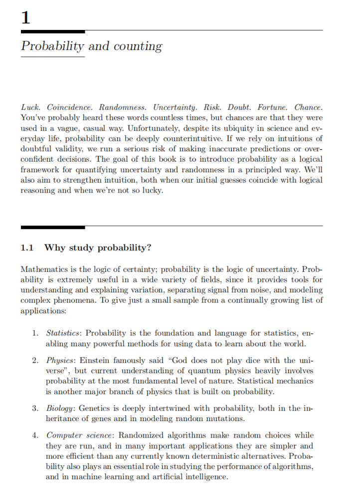

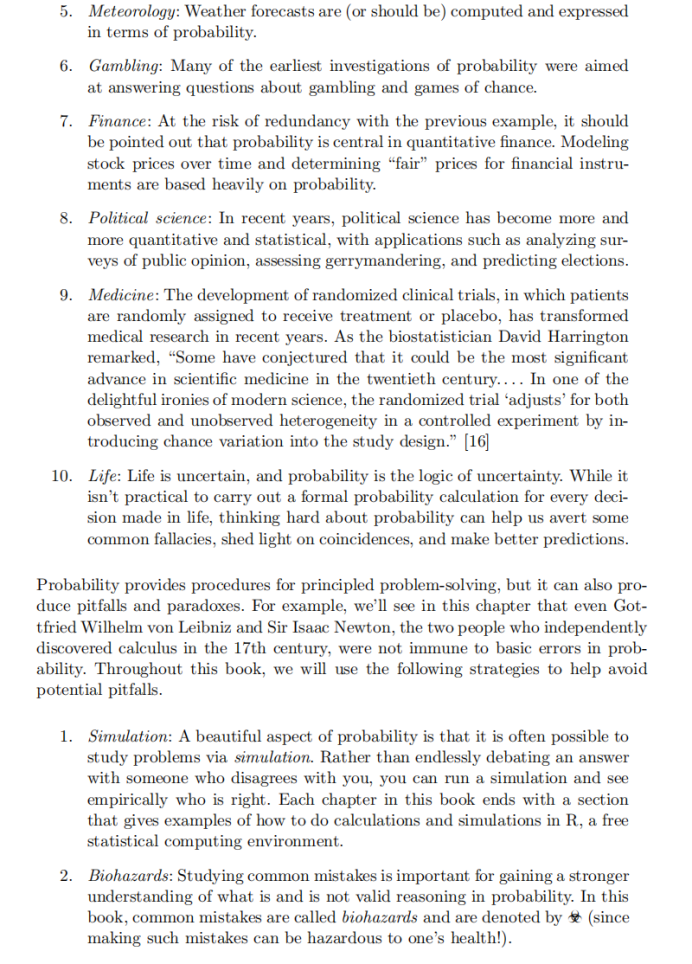

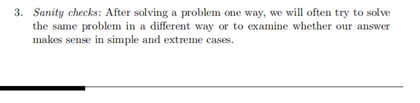


**1\. 概览与标题**  
_标题示例：《概率与计数：不确定性的逻辑与应用》_

本部分内容主要围绕概率论的背景、重要性及其在不同学科中的应用展开，介绍了人们对“随机”“不确定”“运气”等概念的直觉可能会产生误解，并阐述了学习概率论在科学研究和日常决策中的必要性和常见应用领域。此外，还讨论了在学习和使用概率时，为避免思维陷阱而常用的三种策略：模拟、识别常见错误（生物危害，biohazards）以及结果的合理性检查(sanity checks)。

* * *

**2\. 详细内容解析**

1）**引言：概率与我们的日常**

*   在开篇部分，文中以“Luck（运气）、Coincidence（巧合）、Randomness（随机性）、Uncertainty（不确定性）、Risk（风险）、Doubt（怀疑）、Fortune（机遇）、Chance（偶然）”等一系列词汇引出主题。强调这些概念经常被人们提及，却往往使用得较为随意或模糊。
    
*   指出虽然概率在科学研究和日常生活中无处不在，但由于其本质具有反直觉性，如果仅依赖主观直觉，我们可能会做出错误决策或过度自信的预测。
    
*   本书（或本章节）的目标：将概率视为一种严谨的逻辑框架，帮助人们理性地量化和应对不确定性与随机性；同时通过理论与直觉的结合，提升人们在直觉良好时的自信，以及在直觉不足时的理性判断。
    

2）**1.1 为什么要学习概率？**

*   概率被称为“不确定性的逻辑”（logic of uncertainty），在不同学科中都有极其广泛的应用价值。作者列举了大量实例，说明概率在以下领域扮演不可或缺的角色：
    
    1.  **统计学（Statistics）**
        
        *   概率是统计学的基础与语言，统计学中很多有力的方法都建立在概率理论之上，用于理解和利用数据来探索世界。
        
    2.  **物理学（Physics）**
        
        *   爱因斯坦曾说过“上帝不掷骰子”，表现了他对随机性的怀疑，但如今量子物理学的核心却离不开概率论。在更宏观的领域中，统计力学也完全建立在概率理论的基础之上。
        
    3.  **生物学（Biology）**
        
        *   遗传学和概率紧密相连，基因的遗传以及随机突变都与概率密不可分。例如对基因重组、突变发生概率的研究，都需要使用概率工具。
        
    4.  **计算机科学（Computer Science）**
        
        *   随机化算法在计算机科学中至关重要，它们在很多情形下比确定性算法更简单或更高效；概率论在算法性能分析以及机器学习、人工智能等领域也举足轻重。
        
    5.  **气象学（Meteorology）**
        
        *   天气预报本质上应体现为概率预测，因为气象系统极其复杂，对天气的判断往往只能以概率方式呈现（如“降雨概率”“下雪概率”等）。
        
    6.  **赌博（Gambling）**
        
        *   最早对于概率的数学研究就与赌博和碰运气游戏密切相关；早期的概率理论诞生于对赌局的分析和探讨。
        
    7.  **金融学（Finance）**
        
        *   在量化金融领域，概率论是核心工具。预测股票价格走向、评估金融工具的“合理”价格，都高度依赖随机模型和概率分布。
        
    8.  **政治学（Political Science）**
        
        *   近年来，政治学更加定量化和数据化，如民意调查、选区划分合法性（“选区操纵”gerrymandering）评估、选举预测等，都需要统计和概率方法。
        
    9.  **医学（Medicine）**
        
        *   随机临床试验（randomized clinical trials）在现代医学研究中极为重要。通过随机分配受试者到实验组或对照组，可以使得实验结果更具科学性。统计学家David Harrington曾评价，这种随机试验方法也许是20世纪科学领域里最重大的进步之一。
            
        *   医学研究中对已知和未知异质性的控制，也需要概率和统计方法来设计与分析。
        
    10.  **生活（Life）**
    
    
    *   生活处处充满不确定性，概率便是用来处理不确定性的逻辑。虽然不可能对生活中每一个决策都做形式化的概率计算，但掌握概率思维能帮助我们识别和避免常见的谬误，理解诸多“巧合”背后的必然性，并做出更明智的判断与预测。
    
*   总结而言，概率不仅为理性决策提供了原则与工具，也可能带来各种悖论或易犯的陷阱。历史上包括莱布尼茨（Gottfried Wilhelm von Leibniz）和牛顿（Sir Isaac Newton）这样的伟大数学家、物理学家，也都曾在概率问题上犯过错误。
    

3）**如何避免概率陷阱：三种常见策略**

*   在书中，作者提出了三种关键的思维方式或技术，帮助学习者在学习和应用概率时走得更稳健：
    

1.  **Simulation（模拟）**
    
    *   模拟是概率的一个美妙之处：很多时候可以通过程序模拟来帮助我们回答“究竟谁对谁错”。如果理论推导各执一词，就去实际写一个模拟程序，重复试验足够多次，从实验统计结果来验证推论或猜想。
        
    *   在本书或相关资料中，每章的结尾通常都会示范如何在R（一个常见的统计计算环境）中做此类计算与模拟。
    
2.  **Biohazards（生物危害）**
    
    *   这里的“biohazards”并非真正的生化危险，而是指“常见错误”或“思维陷阱”，提醒学习者在概率推理中容易走入哪些误区。
        
    *   此类错误因为在推理中非常常见且对结论危害巨大，被称为“生物危害”；作者用此概念来强调识别与防范的关键性。
    
3.  **Sanity checks（合理性检查/常识检验）**
    
    *   当我们用一种方法得出某个概率或期望后，往往需要换个思路再解决一遍，或者通过极端情况(如极大值或极小值的情形)来检验结果是否仍然说得通。
        
    *   如果在极端情况下结果明显荒谬，那么我们原先的推导或运算很可能出现了问题。通过这种多角度、常识和边界案例的检查，来让自己的结论更可靠。
        

* * *

**3\. 本次内容小结**

*   概率论是“不确定性的逻辑”，可帮助我们定量地处理生活与研究中的随机现象。
    
*   从统计、物理、生物、计算机、金融、政治、医学到日常决策，概率思维都扮演着重要角色。
    
*   虽然概率深入各领域，但很多时候会因直觉与形式化推断的偏差而导致错误或悖论，甚至大科学家也可能出错。
    
*   为了更好地掌握并应用概率，需要借助模拟方法、认识并警惕常见的错误“biohazards”，以及从多种视角对结果进行“sanity check”，以确保推理和结果的可靠性。
    

* * *

**4\. 报错（若有）**

*   从截图内容上看，文字清晰完整，无明显遗漏或看不清的地方。如有未尽之处，可随时指出再行补充。


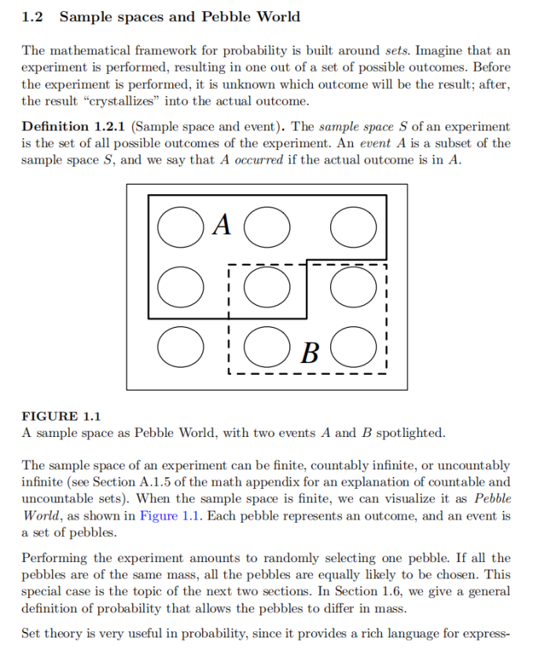

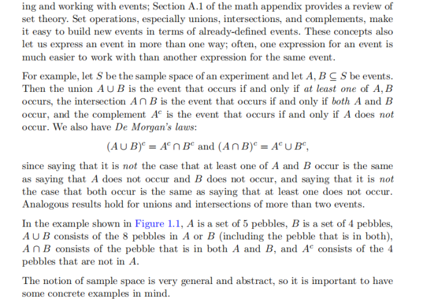


**1\. 标题与大体内容概括**  
_示例标题：《1.2 样本空间与Pebble World：用集合理论表达概率》_

本部分介绍了概率论的核心概念——样本空间（sample space）和事件（event）。通过“Pebble World”这一比喻，将样本空间形象化为若干“卵石（pebbles）”构成的集合，每一枚卵石代表一个可能的结果。作者同时阐述了事件与样本空间之间的集合关系，并回顾了集合论中常见的运算（并、交、补）及其在概率中的意义，如德摩根律(De Morgan’s laws)。

* * *

**2\. 详细内容解析**

1）**样本空间（Sample space）与事件（Event）**

*   **样本空间  $S$ **：一个实验可能出现的所有结果所构成的集合。
    
    *   样本空间可以是有限的，也可以是可数无限或不可数无限（对应更高阶的数学概念，书中会在附录A.1.5中具体解释）。
    
*   **事件  $A$ **：一个子集，包含了样本空间中部分（或全部）结果。
    
    *   当实际结果落在某事件的子集中时，就说这个事件“发生”了。
        

2）**Pebble World 的类比**

*   文中以一个“Pebble World”为例，将样本空间描绘成若干卵石，每一块卵石对应一次实验可能出现的某个具体结果。
    
*   “实验”的过程即：随机“选出”一块卵石，如果所有卵石质量相同，则每块卵石被选中的概率相等。
    
*   在图1.1中：
    
    *   事件  $A$ （如图中的大框）包含 5 块卵石；
        
    *   事件  $B$ （如图中的虚线框）包含 4 块卵石；
        
    *    $A \cup B$  表示所有属于  $A$  或  $B$  的卵石（合并起来一共 8 块，其中有1块同时属于  $A$  和  $B$ ）；
        
    *    $A \cap B$  表示同时属于  $A$  和  $B$  的那 1 块卵石；
        
    *    $A^c$  表示不在  $A$  中的卵石（在该例子里共有 4 块）。
    

3）**集合运算在概率中的作用**

*   概率论的数学框架建立在集合论之上：
    
    *   **并集  $A \cup B$ **：事件  $A\cup B$  的发生表示至少有  $A$  或  $B$ （或两者）发生；
        
    *   **交集  $A \cap B$ **：事件  $A\cap B$  的发生表示必须同时满足  $A$  和  $B$  都发生；
        
    *   **补集  $A^c$ **：如果事件  $A^c$  发生，表示 $A$  没有发生，实际结果落在样本空间中但不在  $A$  中的那些结果里。
    
*   **德摩根律（De Morgan’s laws）**：对并、交和补的运算关系进行描述，包括：
    
    $$
    (A \cup B)^c = A^c \cap B^c, 
    $$
    
    $$
    (A \cap B)^c = A^c \cup B^c. 
    $$
    
    这些公式的含义在于：
    
    *   “ $A\cup B$  未发生” 等价于 “ $A$  未发生并且  $B$  未发生”；
        
    *   “ $A\cap B$  未发生” 等价于 “ $A$  未发生或者  $B$  未发生”。
        

4）**有限/可数/不可数样本空间的说明**

*   若样本空间有限，可以直接用离散元素（如卵石）来表示；
    
*   样本空间也可能是可数无限或不可数无限，例如掷无穷次硬币的结果序列、或者连续型随机变量可能的取值范围等，需要更高级的数学工具（在书的附录中有所延伸讨论）。
    

5）**抽象概念与具体例子相结合**

*   样本空间的概念非常宽泛抽象，但通过“Pebble World”这种具象化的方式，可以帮助理解：选一块卵石就是“执行一次实验”，每块卵石是一个“可能结果”。
    
*   实际概率计算常常先用这种“离散”或“可视化”的例子来练习，后面在遇到连续型或者更复杂的情况时，再延伸这个概念。
    

* * *

**3\. 本次内容总结**

*   本节阐述了概率论中最基础的概念：**样本空间**和**事件**，并强调了集合论在表达事件之间关系时所提供的丰富工具。
    
*   通过“Pebble World”的图示，我们了解到如何将有限样本空间可视化，事件则为其中的若干子集。
    
*   常用的集合操作（并集、交集、补集）在概率论里对应了“至少有一个事件发生”、“多个事件同时发生”以及“某个事件未发生”等情况，而德摩根律使我们能够在不同形式的事件表达之间转换。
    
*   对于更复杂的样本空间（可数或不可数），需要进一步的数学概念支撑，但其核心思想依然可以追溯到集合理论。
    

* * *

**4\. 报错信息**

*   本次图片内容基本完整且清晰，无明显缺失。若有进一步补充或疑问，可在后续提出。


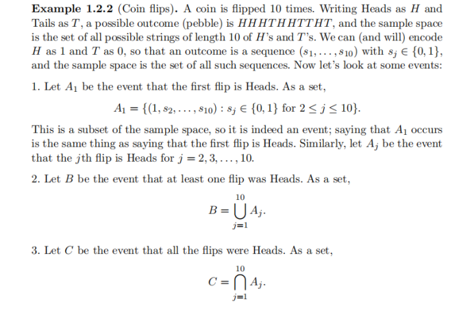

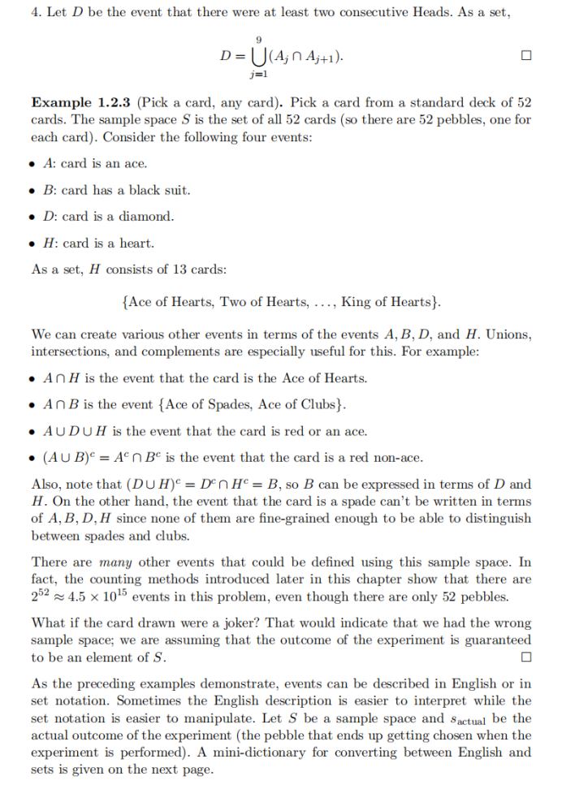

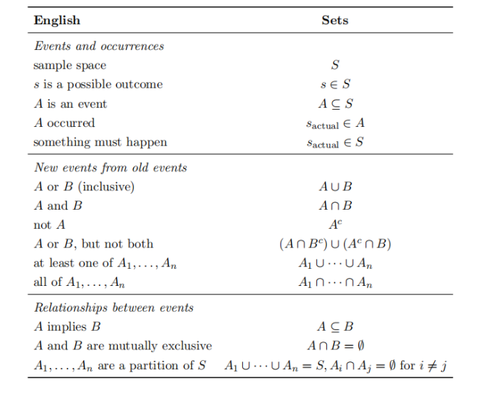


**1\. 标题与总体介绍**  
_示例标题：《关于离散样本空间的示例：抛硬币与抽纸牌——事件的集合表示与英语描述》_

这一部分主要通过两个实际案例（抛硬币与抽扑克牌）来演示如何将“事件”表达为样本空间的子集，以及如何使用并、交、补等集合运算来描述复杂事件。最后给出了一张“英语表述”和“集合符号”之间的对照表，方便我们在描述概率问题时准确地进行形式化。

* * *

### 2\. 详细内容解析

#### 2.1 Example 1.2.2：抛硬币10次

*   **样本空间**
    
    *   将连续抛硬币10次的所有可能结果视作样本空间。
        
    *   每个结果可以用一个长度为10的序列表示，每个位置要么是  $H$ （正面）或  $T$ （反面）。
        
    *   若用  $1$  表示  $H$ ，用  $0$  表示  $T$ ，则样本空间中任意一个元素可记为  $(s_1, s_2, \dots, s_{10})$ ，其中  $s_j \in \{0,1\}$ 。样本空间共有  $2^{10}$  个元素。
    
*   **事件  $A_j$ ：第  $j$  次抛出正面**
    
    *    $A_1$  表示“第一次抛出正面”。用集合来写就是
         
        $$
        A_1 = \{(1, s_2, \dots, s_{10}) : s_j \in \{0,1\} \text{ 对 } j = 2,3,\dots,10\}. 
        $$
        
    *   同理， $A_j$  表示“第  $j$  次抛出正面（Heads）”；也就是序列中第  $j$  个位置为 1。
    
*   **事件 B：至少出现过一次正面**
    
    *   用集合运算表示：
        
        $$
        B = \bigcup_{j=1}^{10} A_j.
        $$
        
    *   直观含义：只要有任意一个  $j$  使得第  $j$  次是正面，就属于此事件。
    
*   **事件 C：所有次数都是正面**
    
    *   用集合运算表示：
        
        $$
        C = \bigcap_{j=1}^{10} A_j.
        $$
        
    *   也即“10次全是正面”的唯一序列： $(1,1,\dots,1)$ 。在离散集合上，这就是一个单元素集合。
    
*   **事件 D：至少出现一次连续两个正面**
    
    *   用集合运算表示：
        
        $$
        D = \bigcup_{j=1}^{9} \bigl(A_j \cap A_{j+1}\bigr).
        $$
        
    *   含义：至少在第  $j$  次和第  $j+1$  次同时出现正面（并且这种  $j$  存在于1到9之间）。
        

#### 2.2 Example 1.2.3：从一副标准扑克牌中抽牌

*   **样本空间  $S$ **
    
    *   包含 52 张标准扑克牌，每一张牌是一个可能结果（“一块卵石”）。
    
*   **定义四个事件**
    
    *    $A$ ：抽到的牌是 “Ace”（A，四张A中的任意一张）。
        
    *    $B$ ：抽到的牌花色是“黑色”（♠或♣）。
        
    *    $D$ ：抽到的牌花色是“方块”（♦）。
        
    *    $H$ ：抽到的牌花色是“红心”（♥）。
    
*   **更多示例**
    
    *    $A \cap H$  表示“红心A”（Ace of Hearts），这是一个只有一张牌的集合。
        
    *    $A \cap B$  表示“黑色A”（Ace of Spades 或 Ace of Clubs），对应2张牌。
        
    *    $A \cup D \cup H$  表示 “是A，或花色为方块，或花色为红心”；可用集合运算进一步简化或理解。
        
    *   注意：有些事件（如“抽到的是黑桃(♠)还是梅花(♣)？”）没法用单独的  $A,B,D,H$  这几个事件简单表达，因为这些定义没有区分黑桃与梅花。然而，如果我们把事件定义得更细，就能表达任意组合或情形。
    
*   **事件总数的巨大**
    
    *   虽然扑克牌只有 52 张，但理论上可从 52 张中选出任意子集，事件总数是  $2^{52}$ ，大约  $4.5 \times 10^{15}$ 。
    
*   **错误样本空间的例子**
    
    *   如果抽到了一张“Joker(小丑牌)”，其实并不在标准52张牌之内，这意味着我们定义的样本空间原本就不包括那张牌，也就不符合我们的实验设定。
        

#### 2.3 英语与集合符号的对照表

在课件的最后，给出了一个“英语表述”和“集合符号”之间的对照表，常用的包括：

1.  **Events and occurrences（事件与发生）**
    
    *   样本空间： $S$ 
        
    *   可能结果： $s \in S$ 
        
    *   事件： $A \subseteq S$ 
        
    *   事件  $A$  发生： $s_{\text{actual}} \in A$ 
        
    *   任何情形总会发生： $s_{\text{actual}} \in S$ 
    
2.  **New events from old events（由已有事件构造新事件）**
    
    *   “ $A$  或  $B$ ”（inclusive or）： $A \cup B$ 
        
    *   “ $A$  且  $B$ ”： $A \cap B$ 
        
    *   “非  $A$ ”： $A^c$ 
        
    *   “ $A$  或  $B$ ，但不同时”:  $(A \cap B^c) \cup (A^c \cap B)$ 
        
    *   “至少有一个  $A_i$  发生”： $A_1 \cup A_2 \cup \dots \cup A_n$ 
        
    *   “所有  $A_i$  都发生”： $A_1 \cap A_2 \cap \dots \cap A_n$ 
    
3.  **Relationships between events（事件之间的关系）**
    
    *   “ $A$  蕴含（implies） $B$ ”： $A \subseteq B$ 
        
    *   “ $A$  与  $B$  互斥（mutually exclusive）”： $A \cap B = \varnothing$ 
        
    *   “ $A_1,\dots,A_n$  是对  $S$  的一个分割（partition）”：
        
        $$
        A_1 \cup A_2 \cup \dots \cup A_n = S, \quad A_i \cap A_j = \varnothing \text{ for } i\neq j.
        $$
        

* * *

### 3\. 本次内容总结

*   通过抛硬币和抽扑克牌两个示例，文中展示了如何将实际问题中的“事件”映射到样本空间的子集，并运用并、交、补等集合运算对事件进行组合描述。
    
*   在抛硬币的例子里，事件用  $\bigcup$  或  $\bigcap$  来表示“至少一个发生”或“全部发生”的状况；而对于“至少有两个连续正面”则用到了“交集的并集”。
    
*   在抽扑克牌的例子里，作者强调有时可以用已有的事件（如“Ace”、“黑色”、“方块”、“红心”）做各种并、交、补的组合；但若要更细节的事件（例如区分不同黑色花色），就需要重新定义事件集。
    
*   最后，给出“英语表述—集合符号”的对照总结，帮助我们在文字与数学形式之间快速转换；这一转换在后续计算概率、推理事件关系时十分重要。
    

* * *

### 4\. 报错信息

*   从截图来看，文字和示例均完整呈现，没有出现明显的内容缺失或模糊不清之处。若后续需要更深入或具体的推导与计算，我们可以再结合课本后续章节或补充材料。


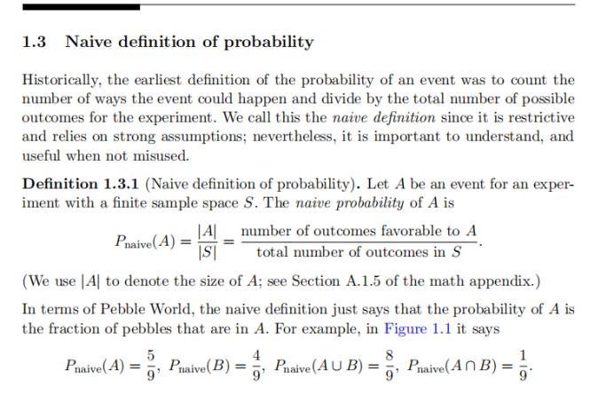

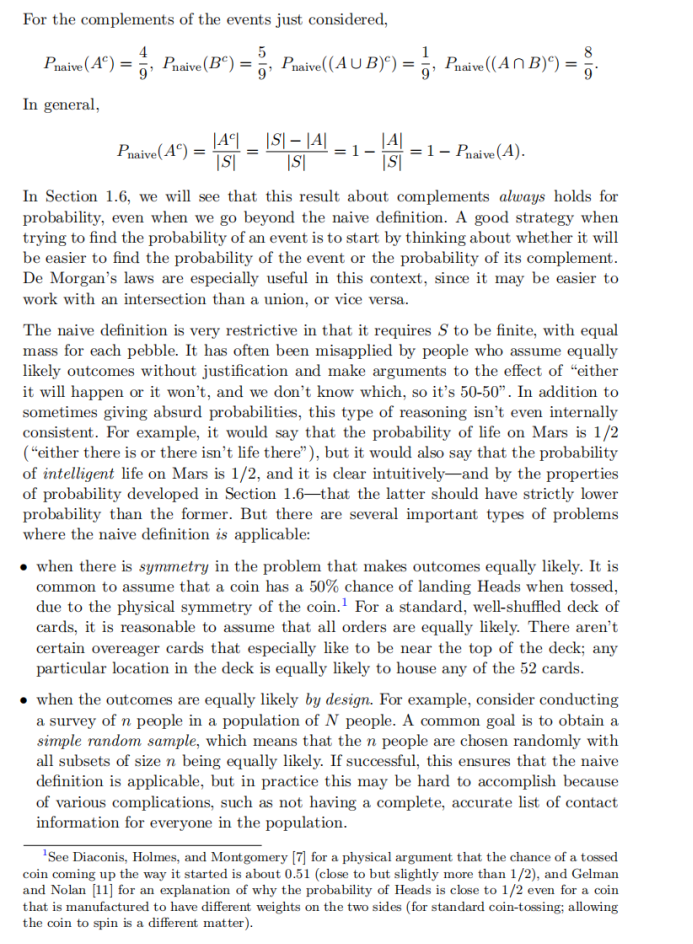

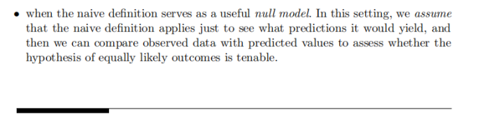


**1\. 标题与主要概述**  
_示例标题：《1.3 朴素概率定义：等可能样本空间下的概率计算与局限性》_

本节介绍了最早、最基本的“朴素概率定义”（Naive definition of probability），即在有限且等可能的样本空间中，某事件的概率被定义为“该事件包含的结果数占样本空间所有结果数的比例”。随后指出了这种定义适用的典型场景（如存在对称性、或实验设计保证等可能性、或作为零假设模型使用），并强调了其限制和可能被误用的情形。

* * *

### 2\. 详细内容解析

1）**朴素概率定义（Naive definition of probability）**

*   **定义1.3.1**：对于一个实验，若样本空间  $S$  是有限集合，且假设所有结果等可能发生，则事件  $A$  的朴素概率记为
    
    $$
    P_{\text{naive}}(A) \;=\; \frac{\lvert A \rvert}{\lvert S \rvert},
    $$
    
    其中  $\lvert A \rvert$  表示事件  $A$  含有的结果数， $\lvert S \rvert$  表示样本空间的结果总数。
    
*   “朴素”之所以得名，是因为它建立在所有结果完全等可能且样本空间有限的前提之上。在许多现实情形中，这种前提并不成立，但在适当场合依然有用。
    

2）**Pebble World 中的示例**

*   在Pebble World的图1.1（上一节提到），假设有9块卵石，每块卵石等可能被选中：
    
    $$
    P_{\text{naive}}(A) = \frac{|A|}{|S|},\quad P_{\text{naive}}(B) = \frac{|B|}{|S|}, \quad \dots
    $$
    
    文中示例给出： $\lvert A \rvert = 5, \lvert B \rvert = 4, \lvert A \cup B \rvert = 8, \lvert A \cap B \rvert = 1$ ，以及
    
    $$
    P_{\text{naive}}(A) = \tfrac{5}{9},\quad P_{\text{naive}}(B) = \tfrac{4}{9}, \quad P_{\text{naive}}(A \cup B) = \tfrac{8}{9},\quad P_{\text{naive}}(A \cap B) = \tfrac{1}{9}.
    $$
    

3）**补集事件的朴素概率**

*   对于事件  $A$  的补集  $A^c$ ，有
    
    $$
    P_{\text{naive}}(A^c) \;=\; \frac{\lvert A^c \rvert}{\lvert S \rvert} \;=\; 1 - \frac{\lvert A \rvert}{\lvert S \rvert} \;=\; 1 - P_{\text{naive}}(A).
    $$
    
*   该结论不仅在朴素定义中成立，而且在更一般的概率公理体系中也保持一致（后面章节将进一步说明）。
    

4）**朴素定义的局限和误用**

*   **限制**：需要  $S$  是有限集，且所有元素（结果）“等可能”——这通常需要“对称性”或“特意设计”才能成立。
    
*   **常见误用**：如果人们没有足够理由就将事件简单地判定“要么发生要么不发生，概率就是50%”，显然没有按照逻辑定义事件发生的可能性（比如“火星上是否有生命？”绝非随便认为1/2就行）。
    
*   文中举例：
    
    *   如果我们用朴素定义来估计“火星上有生命的概率是 1/2”，又说“火星上有智慧生命的概率也是 1/2”，就会产生明显不合理之处。更严格地讲，“有智慧生命”应是“有生命”事件的子事件，其概率应低于或等于“有生命”的概率。
    
*   然而，在一些场合朴素定义仍然“够用”或具有参考价值：
    
    1.  **对称性：** 物理上或结构上的对称让各个结果有相同机会（如理想硬币的正反面）
        
    2.  **人为设计：** 例如从  $N$  人群中随机抽样  $`simple random sample`$ ，理论上每个子集具有相同被选中的概率
        
    3.  **用作零假设模型：** 当我们先假设“各结果等可能”，用这个假设来做预测，随后与实际数据对比，以评估这个等可能假设是否合理
        

5）**边注：硬币的正面概率为什么不是精确的1/2？**

*   文中脚注引用了文献指出，实际物理中抛硬币并非完美对称，正面概率大约在 0.51 附近（略高于 1/2），原因包括硬币质量分布、硬币旋转方式等。但在很多初步讨论或理论模型中，往往近似地当作 1/2 使用。
    

* * *

### 3\. 本次内容总结

*   **朴素概率定义**：对于有限且等可能的样本空间，概率即“事件中结果数占总结果数的比例”。
    
*   **适用场景**：当问题本身或实验设计保证每个结果等可能，或当其被用作简化的零假设时。
    
*   **常见误用**：随意将不确定事件视为“二分之一”概率，而没有考虑实际先验或从属关系，这种做法会产生逻辑矛盾，也无法反映真实情况。
    
*   **在更广泛的概率理论中**，我们需要放宽样本空间的规模以及结果的可能性分布，不再局限于朴素定义，后续章节将介绍更通用的公理化定义以及加权概率的概念。
    

* * *

### 4\. 报错信息

*   本次截图内容字迹清晰，未见缺失或严重模糊。如有需要更详细的拓展或计算实例，可在后续章节或补充材料中进一步讨论。


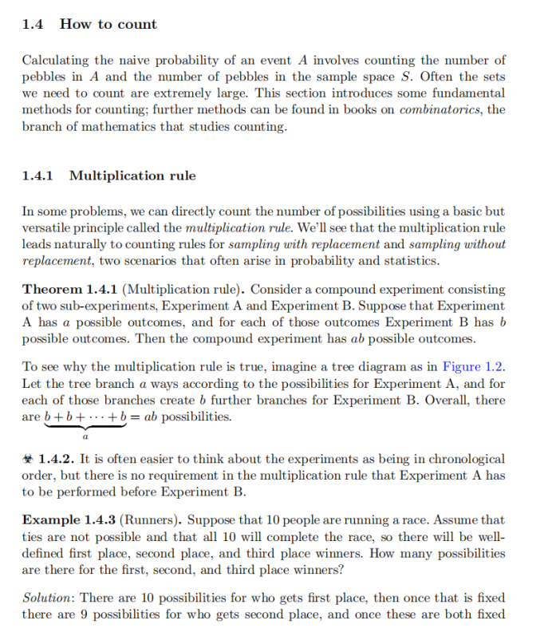

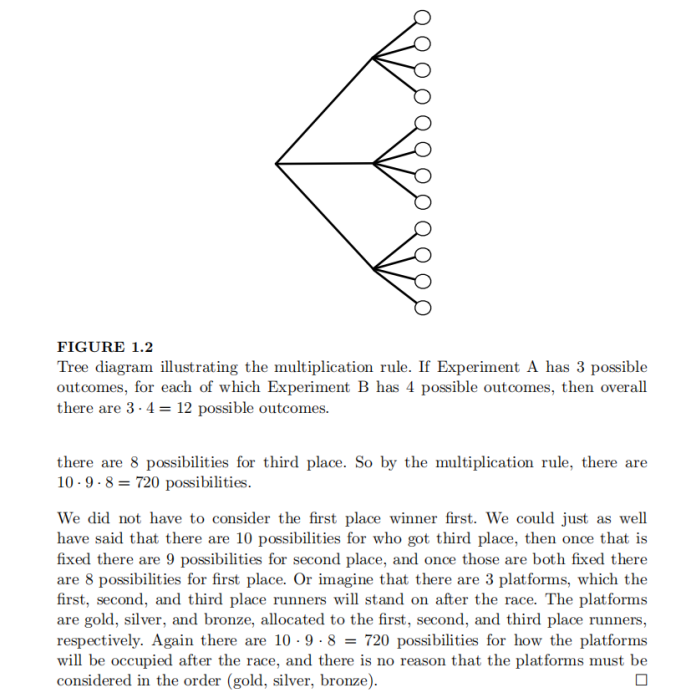


**1\. 标题与总体介绍**  
_示例标题：《1.4 如何数：乘法原理与计数树》_

本节开始讨论如何计算事件中“可能结果的数量”，并引入最基本的计数方法之一——乘法规则（multiplication rule）。在概率论中，我们往往需要先数清楚事件  $A$  和整个样本空间  $S$  中各自可能结果数，再使用（朴素）概率定义  $\frac{|A|}{|S|}$  来求概率。然而，很多实际问题的结果数巨大且不易直接罗列，因此本节介绍的乘法原理和后续的组合数学方法，就成为必备工具。

* * *

### 2\. 详细内容解析

#### 2.1 如何数：前言

*   当样本空间  $S$  较大时，我们无法依赖“一一列举”来数出 $|S|$ 或 $|A|$ 的大小。这时需要借助组合数学（combinatorics）中的各种技巧。
    
*   最常用也最基础的方法之一就是**乘法规则（multiplication rule）**。借助树形图（如图1.2）可以形象理解：若有两个子实验，先从第一个实验的每种结果再分叉到第二个实验所有可能结果，最终所有可能性相乘即给出总数。
    

#### 2.2 乘法规则（Theorem 1.4.1）

*   **内容表述：**  
    如果一个试验由两个子实验（Experiment A 与 Experiment B）组成：
    
    *   Experiment A 有  $a$  种可能结果；
        
    *   对于A的每一种结果，Experiment B 各有  $b$  种可能结果；  
        那么整个复合试验有  $a \times b$  种可能结果。
    
*   **树状图示例（Figure 1.2）**：
    
    *   假设 A 有3种结果，则树会先分成 3 条“主枝”；
        
    *   每条主枝再派生 4 条分枝（对应 B 有4种可能）；
        
    *   全部可能结果数即 3×4=12。
    
*   **思路本质**：每当我们能把某个多步骤过程拆成一个个“阶段”（或子实验），并且每一阶段的结果数目与前一阶段的具体结果无关，只取决于“有多少可能”，就能运用乘法规则累乘得到全部可能数。
    

#### 2.3 应用示例：Example 1.4.3（跑步比赛前三名）

*   问题：有10人参加比赛且都能跑完，问“第一名、第二名、第三名分别是谁”有多少种可能？
    
*   **解法 1（按先后名次思路）**：
    
    1.  第一名的选择：10 种可能（10 人中任选其一）。
        
    2.  确定第一名后，剩余 9 人角逐第二名，所以第二名有 9 种可能。
        
    3.  最后第三名从剩余 8 人中选，因此有 8 种可能。
        
    
    *   乘法原则： $10 \times 9 \times 8 = 720$ 。
    
*   **解法 2（反向思路）**：
    
    1.  先选择第三名：10 种；
        
    2.  再从剩下 9 人中选第二名：9 种；
        
    3.  最后第一名：8 种；
        
    
    *   依然得到： $10 \times 9 \times 8 = 720$ 。
    
*   **解法 3（分配思路）**：
    
    *   想象有 3 个领奖台（金牌、银牌、铜牌），把 10 人中任意 3 人放到这 3 个位置上，并且位置次序不同代表的情况也不同。根据乘法原则，同样得到 720。
    
*   **结论**：顺序选择的过程只要拆分成每一步有多少可能，就能相乘得到结果；并不要求先定第一名、再定第二名……可以换顺序，但最终乘积相同。
    

#### 2.4 乘法原理的时间先后次序

*   在课件中专门指出，运用乘法规则并不要求子实验一定是“先做A，再做B”。即使在逻辑或时间上 B 先发生，也不影响最终结果数是  $a \times b$ 。
    
*   关键在于“能否把不同子实验的可能结果数独立地乘起来”，而非子实验顺序本身。
    

* * *

### 3\. 本次内容总结

*   **乘法规则是最基础的计数法则**：如果可以把某个复合实验分解成彼此独立的几个子过程，那么其总的可能结果数就是各子过程可能结果数的乘积。
    
*   **跑步比赛示例**展示了从不同角度（先选第一名或先选第三名）都能得到同样结果；这说明我们只要遵循“每一步都明确剩余可供选择的数量，然后把这些数量相乘”，就能正确计出总可能数。
    
*   **树状图**是帮助我们形象理解“分叉 × 分叉 = 乘法累计”的直观方法，非常适合在问题不太复杂时做可视化。
    
*   在后续的章节里，将继续探讨其他常见的计数规则（如加法规则、排列组合、抽样有放回/无放回等），为我们计算更复杂场景中的事件概率做好准备。
    

* * *

### 4\. 报错信息

*   从截图可见，内容展示完整，图示及文字清晰，没有明显的缺失或模糊。如有更深入的问题或需要举更多示例，后面章节通常会继续展开讨论。


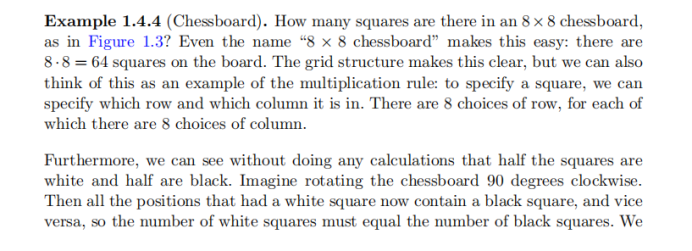

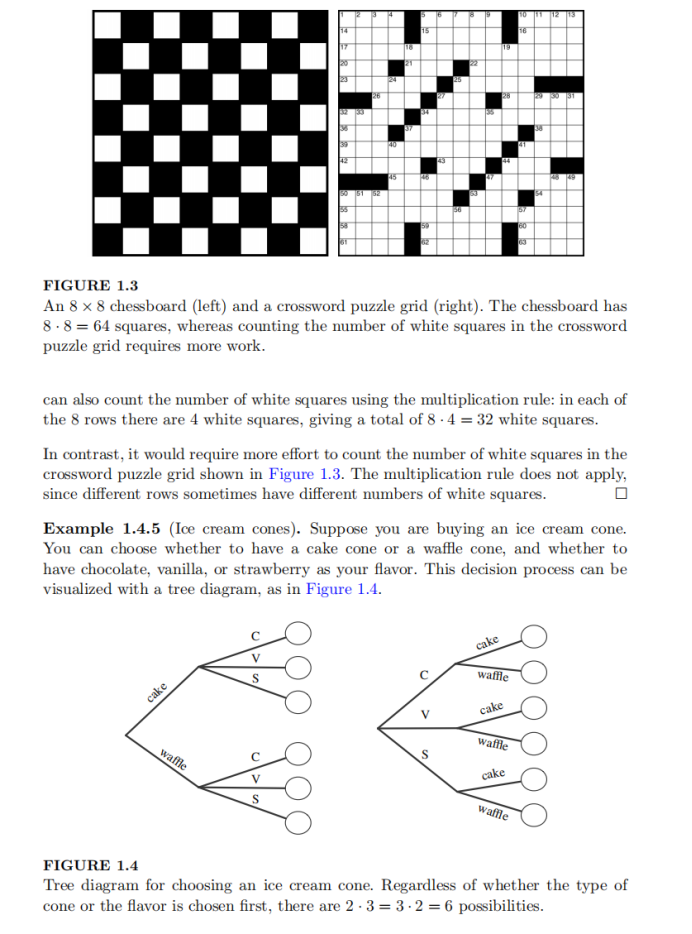

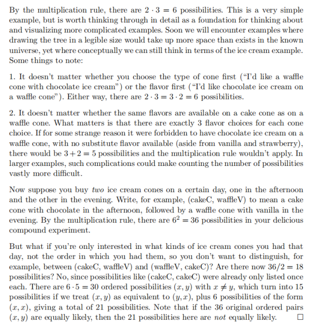


**1\. 标题与总体概述**  
_示例标题：《1.4.4 棋盘与 1.4.5 冰激凌：乘法规则与计数的灵活应用》_

本节继续展示乘法规则在不同场景下的运用：先以棋盘（8×8）为例，说明如何用乘法规则计算总格子数以及相同数目的黑白方格；然后通过对比带有不规则空白方格的填字游戏图，说明在某些情况下无法简单运用乘法规则计数。接着给出一个“买冰激凌”的示例，利用树状图和乘法规则计算不同口味与蛋筒类型的组合数量，并进一步讨论顺序是否重要等更深层次的计数问题。

* * *

2\. 详细内容解析
----------

### 2.1 Example 1.4.4（Chessboard：国际象棋棋盘）

1.  **8×8 棋盘**
    
    *   如图1.3左侧所示的国际象棋棋盘，**行**有8条，**列**有8条，共计  $8 \times 8 = 64$  个小方格。
        
    *   这直接利用了乘法规则：要指定一个格子，只需指定它所在的“第几行”和“第几列”，每个方向都有8种可能，因此总格子数为  $8 \times 8$ 。
    
2.  **黑白方格数目相等**
    
    *   不做任何计算也能看出有32个白格、32个黑格：
        
        *   如果把棋盘顺时针或逆时针旋转 90°，原本白格的位置就变成了黑格，黑格的位置变成了白格。由此可知白格和黑格数量相同。
        
    *   当然，也可以用乘法规则来求白格数：在图示规范的国际象棋棋盘里，每一行都交替出现4个白格与4个黑格，总计 8 行 × 4 白格/行 = 32 白格。
    
3.  **填字游戏格子（Figure 1.3右）**
    
    *   与国际象棋格子不同，填字游戏棋盘各行的白格数不统一，所以没法直接用一个简单的“行数×列数”得到白格总数。
        
    *   这意味着**乘法规则不适用**于这样的不规则排布，需要更细致的方法（如逐行统计再相加，或其他技巧）。
        

### 2.2 Example 1.4.5（Ice cream cones：冰激凌）

1.  **基本场景**
    
    *   你想买一个冰激凌，需要先决定：
        
        1.  蛋筒类型（cake cone 或 waffle cone, 共2种）
            
        2.  冰激凌口味（chocolate, vanilla, strawberry, 共3种）
        
    *   如图1.4的树状图所示，可以先分成2个主枝（不同的蛋筒），每个主枝再分成3条分枝（不同的口味），总共 2×3=6 种组合。
    
2.  **乘法规则的多重扩展**
    
    *   无论先决定蛋筒还是先决定口味，结果的总数量都不变，都是 6 种。
        
    *   如果某些口味仅限某种蛋筒（比如不允许“waffle+chocolate”组合），乘法规则就会被打破，需要另作修改或分情况计算。
    
3.  **再举一层：加上甜筒浇头？**
    
    *   文中还举了“假设加一层额外选择”的例子，比如蛋筒种类2种、口味3种、另外还要决定是否加浇头（2种选或不选），那么可能是2×3×2=12种方案。这里依然是乘法规则，只要每一步都有固定的选择数且独立。
    
4.  **两次买冰激凌的情形**
    
    *   进一步延伸：假设一天买两次冰激凌，下午一次、晚上一次；则若**区分**先后顺序（下午 vs. 晚上），就有  $6^2=36$  种可能搭配（因为下午有6种选择、晚上也有6种选择）。
        
    *   如果**不区分**先后顺序，只关心两次各吃了什么口味与蛋筒，那么需要另一种计数方法，因为“(下午cakeC, 晚上waffleV)”和“(下午waffleV, 晚上cakeC)”在不区分顺序时视为同一个组合。此时需要考虑去重，往往是组合或分段计算的问题。
    
5.  **对顺序敏感或不敏感**
    
    *   文中后半段举例讨论：当只关心每天两次冰激凌的“种类集合”而非“具体顺序”时，原先的36种中会出现重复计数，需要进行辨别或归并。
        
    *   例如，对两个选择  $(x,y)$  和  $(y,x)$ ，如果   $\,x \neq y$  则在“顺序敏感”情况下是两种，但在“无顺序”情况下可以合并成一种；若   $\,x=y$ ，则不需要合并。这样会得到一个新的计数结果。
        
    *   这些都属于在乘法规则基础上进一步探讨“顺序 vs. 无序”以及“相同元素 vs. 不同元素”时，如何调整计数方法。
        

* * *

3\. 本次内容总结
----------

1.  **8×8 棋盘**
    
    *   单纯的乘法规则可立即得到 64 个格子，每行4白4黑，总共32白32黑。
        
    *   乘法规则适用于“每行都具有相同数量的某种元素”，否则需要更精细的计算。
    
2.  **冰激凌示例**
    
    *   2种蛋筒 × 3种口味 = 6 种选择，若再添加步骤（如再选配料、再来第二次冰激凌等），只要步骤之间互不排斥且选择数固定，都可以利用乘法规则进行“阶乘式”推导。
        
    *   若要考虑无序（不分先后）或有重复项，需要结合排列组合的思想进行修正，并注意去重。
    
3.  **对比与启示**
    
    *   乘法规则是简单而通用的工具，但前提是各阶段选择数目固定且独立，不随上一阶段具体结果而改变；若行列不均、口味受限等，就需要更灵活或分步的分析。
        
    *   日常在应用乘法规则时，应首先确认是否满足“每个分支都有相同数目结果可供选择”的假设；若不满足，需要进行条件分支或加法规则、组合等方法的协同计算。
        

* * *

4\. 报错信息
--------

*   截图内容清晰完整，无明显缺失。如后续需要了解如何进一步处理“顺序/无序”及“有限制的多重选择”场景，后面章节通常会涉及排列、组合等更丰富的计数方法。


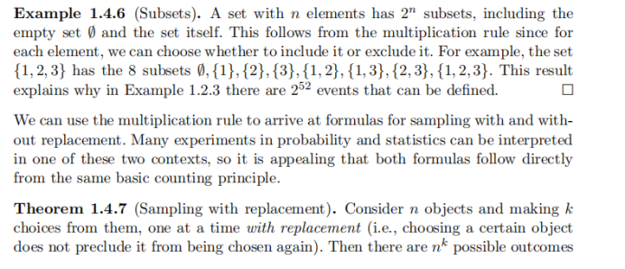

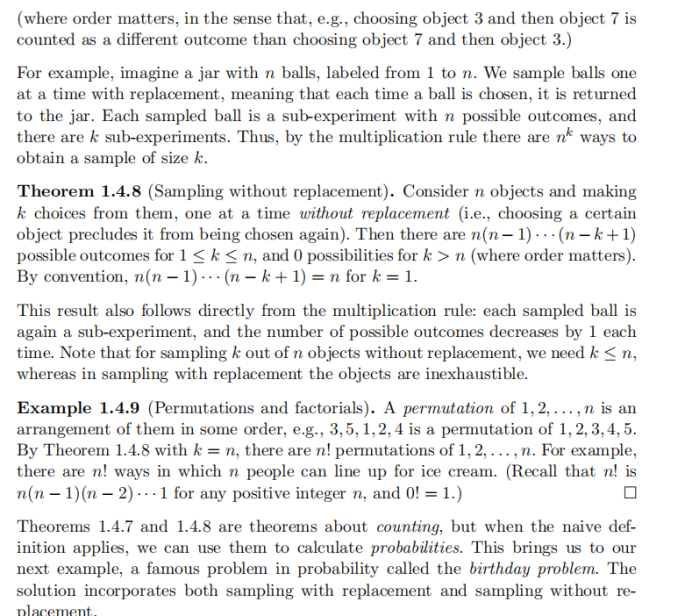


**1\. 标题与总体概括**  
_示例标题：《1.4.6 ~ 1.4.9：子集计数、抽样（有放回与无放回）及排列》_

这一部分先介绍了集合的子集数量（即从  $n$  个元素里可形成  $2^n$  个子集），然后运用前面提到的乘法规则给出了“有放回抽样”和“无放回抽样”两种情形下的计数公式，并进一步阐述了排列与阶乘在此时的作用。通过这些定理与示例，可以一并理解为什么上一节提到的“从一副52张牌中可以构造出  $2^{52}$  个不同事件”——这正是子集计数的结果。

* * *

2\. 详细内容解析
----------

### 2.1 Example 1.4.6：子集数量（Subsets）

*   **结论：** 对于一个包含  $n$  个元素的集合，其子集总数为  $2^n$ 。
    
    *   包括空集  $\varnothing$  和整个集合本身，所有可能的子集都要计算在内。
    
*   **推理方式：** 使用乘法规则。从每个元素出发，我们有“要/不要（include/exclude）”两种选择，故对于  $n$  个元素共有  $2^n$  种组合。
    
*   **示例：**  $\{1,2,3\}$  的子集共有 8 个： $\varnothing,\{1\},\{2\},\{3\},\{1,2\},\{1,3\},\{2,3\},\{1,2,3\}$ 。
    
*   **应用：** 这也解释了之前在 Example 1.2.3（抽扑克牌）中提到的，52 张牌可构成  $2^{52}$  个不同事件（因为每个事件就是52张牌某一子集），故所有事件数是  $2^{52}$ 。
    

### 2.2 Theorem 1.4.7：有放回抽样（Sampling with replacement）

*   **情景：** 从  $n$  个不同对象中，进行  $k$  次选择，每次选完之后“放回”（也就是说同一个对象下一次依然可以被选中），并且**顺序**有意义（先选哪个、后选哪个视作不同结果）。
    
*   **结论：** 最终可能产生的不同结果数是
    
    $$
    n^k.
    $$
    
*   **直观解释：** 每一次抽样都有  $n$  种选择，因为放回后下次仍然可选，所以第 1 次到第  $k$  次的选择数都不变。乘法原则告诉我们总数为  $n \times n \times \cdots \times n = n^k$ 。
    
*   **举例：** 若有编号 1~ $n$  的  $n$  个球在罐子里，每次抽一个球看其编号，然后放回搅匀再抽一次，抽  $k$  次所形成的结果序列数就是  $n^k$ 。
    

### 2.3 Theorem 1.4.8：无放回抽样（Sampling without replacement）

*   **情景：** 从  $n$  个不同对象中，进行  $k$  次选择，每次选完之后**不放回**，被选过的对象不再进入下一次的候选集合；同样**顺序**有意义。
    
*   **结论：** 对于  $1 \le k \le n$ ，可能的不同结果数是
    
    $$
    n \times (n-1) \times \cdots \times (n-k+1) \;=\; \frac{n!}{(n-k)!}.
    $$
    
    若  $k>n$  则不可能选出更多不重复对象，这种情形的结果数为 0。
    
*   **推理依据：** 第 1 次有  $n$  种选择；选走一个后，剩下  $n-1$  种；第 3 次剩下  $n-2$  种……乘起来得到上式。
    
*   **对比有放回：** 有放回使得每次的选择数目都相同（都是  $n$ ），而无放回会随选择次数而递减，若想依次选择  $k$  个不重复对象就必须满足  $k \le n$ 。
    

### 2.4 Example 1.4.9：排列与阶乘（Permutations and factorials）

*   **概念：** 如果我们选出所有  $n$  个对象且要排定一个顺序，那么这种无放回抽样的情形就是  $k=n$ 。
    
*   **公式：**
    
    $$
    n \times (n-1) \times \cdots \times 2 \times 1 \;=\; n!.
    $$
    
    这便是“排列数”的一个特例：排列  $n$  个不同元素的总数记为  $n!$ 。
    
*   **举例：** 若要把  $n$  个人排成一行队列，则一共有  $n!$  种不同的排法；例如 5 个人排队，就是  $5!$  种队形。
    
*   **术语：**  $n!$  读作“n 阶乘”；并且约定  $0! = 1$ 。
    

* * *

3\. 本次内容总结
----------

1.  **子集计数  $2^n$ **
    
    *   对于一个  $n$  元集合，每个元素都有“进或不进”子集的二元选择，因此可得  $2^n$  种子集。
        
    *   这在事件空间里解释了“对样本空间每个元素，要么包含在事件中、要么不包含”的思想，从而得到所有可能事件的数目。
    
2.  **有放回与无放回抽样**
    
    *   **有放回（with replacement）**：抽  $k$  次，每次  $n$  种可能，合计  $n^k$ 。
        
    *   **无放回（without replacement）**：抽  $k$  次，每次可选择的剩余对象数依次递减，合计
        
        $$
         n \times (n-1) \times \dots \times (n-k+1) \;=\; \frac{n!}{(n-k)!}.
        $$
        
    *   两者都假设选出的不同顺序视为不同结果（order matters）。
    
3.  **排列与阶乘**
    
    *   当  $k=n$  并且不放回时，就得到经典的排列数： $n!$ 。
        
    *   阶乘是组合数学和概率论中常见的基础运算，后续会频繁出现。
    
4.  **与概率的联系**
    
    *   这些定理主要是“计数”的结论，但回到朴素概率  $\frac{\lvert A\rvert}{\lvert S\rvert}$  的思路，如果我们能用这些公式分别计算事件  $A$  和样本空间  $S$  中的可能结果数，就能得到事件的朴素概率。
        
    *   后面将要介绍的典型案例“生日悖论”（Birthday Problem）就综合运用了“有放回”和“无放回”的思想来计算概率。
        

* * *

4\. 报错信息
--------

*   本次内容文字清晰，公式表达完整，无明显缺失或看不清之处。如有需要更详尽或针对性的例题推导，后续章节或补充示例会进一步展开。


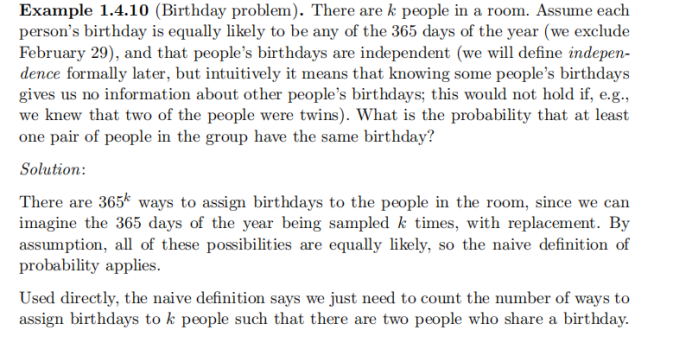

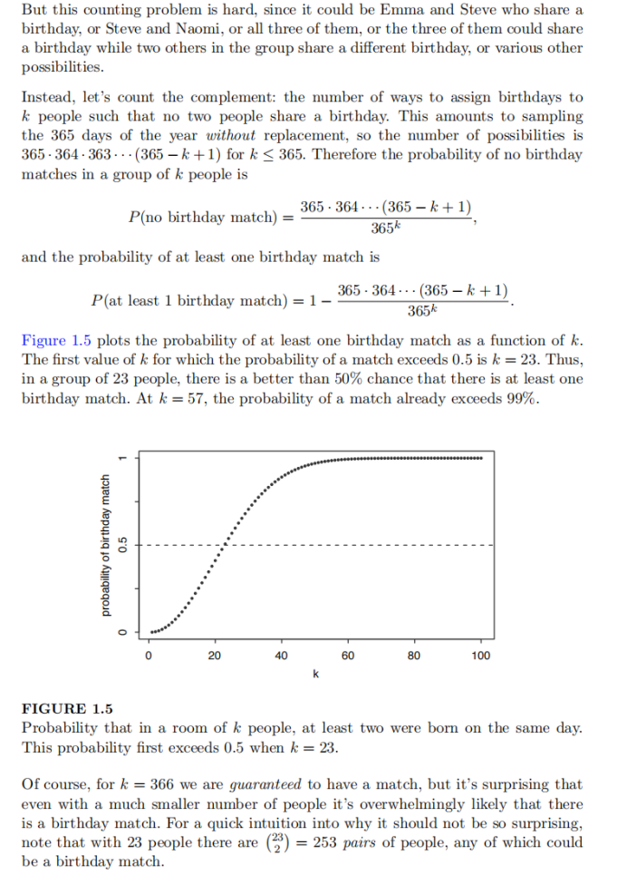


**1\. 标题与整体概述**  
_示例标题：《1.4.10 生日问题：从补事件的计数到惊人的小样本效果》_

本节利用前面介绍的“有放回”和“无放回”抽样思想，结合补事件（no match）计数的方法，推导了著名的“生日问题”的概率公式。结果显示，只需要 23 个人时，至少有两人同生日的概率就已超过 50%，从而体现了这一问题的“反直觉性”。

* * *

2\. 详细内容解析
----------

### 2.1 生日问题的描述

*   **问题表述**：在一个房间里有  $k$  个人，每个人的生日（不含闰日2月29）都被认为是独立且等可能地落在 365 天的任意一天。问：这  $k$  个人中至少有一对人生日相同的概率是多少？
    
*   **背景**：直觉可能认为要有很多人才会“撞生日”，但真实情况是只要有 23 个人，上述概率便超过 50%，这个结果常被称为“生日悖论（Birthday Paradox）”。
    

### 2.2 两种思路：直接计数 vs. 补事件法

1.  **直接计数 “至少有一对同生日”**
    
    *   表面看似要把各种形式的“撞生日”一一列举（可能是一对人撞，也可能两对人撞生日，甚至多对），情况十分复杂。
        
    *   若要逐案细分，工作量极大，不适合手动推导。
    
2.  **补事件：没有任何人同生日**
    
    *   先计算“所有  $k$  人的生日互不相同”的概率，然后用
        
        $$
         1 - \; P(\text{no match})
        $$
        
        即可得到“至少一对同生日”的概率。
        
    *   这相当于将“无重复生日”的情形视为“无放回”抽样：第一个人的生日可任取 365 天，第二个人需从剩余 364 天中选择生日，第三个人则从剩余 363 天中选择，以此类推。
        

### 2.3 公式推导

*   **样本空间**：视作“有放回”抽样——给  $k$  个人生日，可想象为从 365 天中抽取  $k$  次，每次都能选到任意一天，因此总可能结果数为  $365^k$ 。
    
*   **事件 “无重复生日”**：相当于在  $k$  次中“不放回”地使用不同的天数（前提是  $k \le 365$ ，否则若  $k=366$ ，必有重复生日，概率100%），于是可分配的方法数为
    
    $$
     365 \times 364 \times 363 \times \dots \times (365 - k + 1).
    $$
    *   若  $k>365$ ，此事件概率为0。
    
*   **概率**：
    
    $$
     P(\text{no match}) \;=\; \frac{365 \times 364 \times \cdots \times (365 - k + 1)}{365^k}.
    $$
    
    故
    
    $$
     P(\text{at least one match}) \;=\; 1 \;-\; \frac{365 \times 364 \times \cdots \times (365 - k + 1)}{365^k}.
    $$
    

### 2.4 数值结果与图示

*   **关键值**：当  $k=23$  时，“至少一对同生日”的概率就超过 0.5。
    
*   如 **Figure 1.5** 所示，随着  $k$  增加，概率迅速上升：
    
    *    $k=57$  时，该概率已超过 0.99；
        
    *    $k=366$  时必定有人同生日（鸽巢原理），概率=1。
    
*   **直觉解释**：当  $k=23$  时，存在  $\binom{23}{2} = 253$  对人，每对都有一定概率（ $\frac{1}{365}$ ）撞上同一天，这个规模远比仅仅考虑 “23 vs. 365” 直觉来得大。因此，即便 23 不算一个很大的数目，也足以让 “至少有一对撞生日” 的事件相当常见。
    

* * *

3\. 本次内容总结
----------

1.  **问题背景**：生日问题使用了“有放回的总情况”和“无放回的无重复情况”来计算概率，避开了直接统计各种复杂撞生日模式的困难。
    
2.  **公式核心**：
    
    $$
     P(\text{at least one match among } k \text{ people}) \;=\; 1 \;-\;\frac{365 \times (365-1) \times \cdots \times (365-k+1)}{365^k}.
    $$
    
3.  **反直觉性**：只要 23 人就超过 50% 的概率会出现生日重复，容易超出很多人的初始预期。此结论常被用于说明现实中依赖直觉判断概率时可能产生的偏差。
    
4.  **一般结论**：若考虑到 366 人或更多，必然有撞生日（鸽巢原理）；中间值可由公式或近似计算。
    

* * *

4\. 报错信息
--------

*   内容与图表均较为完整清晰，无缺失或模糊之处。若需要更精确的数值表格或进一步的近似推导（如泊松近似或指数近似），可在后续章节或附录中查阅。


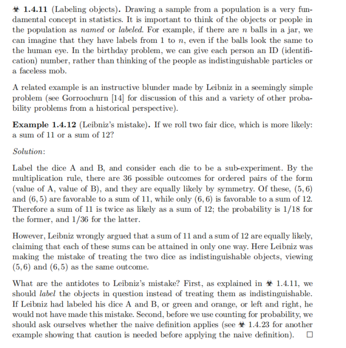


**1\. 标题与整体概括**  
_示例标题：《1.4.11~1.4.12：区分对象与莱布尼茨的失误——骰子点数的正确计数》_

这一小节首先强调了在抽样或分析概率时，为了正确应用朴素概率定义，务必将各对象（或个体）视作“带有标签/可区分”的个体（如给骰子贴上A、B标签）。随后通过“莱布尼茨的失误”这一历史例子，说明在抛掷两枚骰子求和时，如果错误地把它们当作不可区分的对象，就会得出“和为11与和为12等可能”的错误结论，而正确方法则须将所有有序对( $A$ 的点数, $B$ 的点数)都纳入计算。

* * *

### 2\. 详细内容解析

#### 2.1 1.4.11 给对象贴标签（Labeling objects）

*   在统计学和概率论中，通常要“区分”或“标记”样本空间中的对象。
    
    *   举例：若罐子里有  $n$  个球，看起来相同，但在数学模型上可想象它们的编号分别是 1,2, $\dots$ , $n$ ，以保证每次抽到哪个球都视作不同结果。
        
    *   生日问题中也是如此：给每个人分配一个ID，避免把人视为“不可区分的同质群体”，从而能正确应用“每个人各自选择生日”的乘法规则。
        

#### 2.2 1.4.12 莱布尼茨的失误（Leibniz’s mistake）

*   **问题**：掷两枚公正骰子，问“和为11”与“和为12”哪个更可能？
    
    *   **正确解法**：
        
        *   把两枚骰子标成“骰子A”和“骰子B”，每个都可能出现1~6点，共有 36 个有序结果(6×6)。
            
        *   “和为11”的有序对只有 (5,6) 和 (6,5)，共 2 种；
            
        *   “和为12”的有序对只有 (6,6)，共 1 种。
            
        *   于是
            
            $$
            P(\text{sum }=11) = \frac{2}{36} = \frac{1}{18}, \quad P(\text{sum }=12) = \frac{1}{36}.
            $$
            
        *   和为11 的概率是和为12 的两倍。
        
    *   **莱布尼茨的错误说法**：
        
        *   他忽视了骰子A、B之间的区别，把(5,6)与(6,5)视为“同一种状况”，误以为“和为11”也只有一种形式(5和6)，与“和为12”一样只有(6和6)一种，从而得出了两者等可能的结论。
            
        *   本质原因：把骰子当成“不可区分”。
    
*   **反思**：
    
    *   要避免这种错误，首先就要给两个骰子明确“标签”或视为不同颜色，以保证运用乘法规则时能正确数清结果；
        
    *   其次，还要检查朴素概率定义是否真能适用（这里可以，因两个骰子独立且等可能）。
        

* * *

### 3\. 本次内容总结

1.  **对象区分**是概率计数的先决条件：若对象不可区分，就会在计算可能数时“折叠”掉多个有序结果，导致错误结论。
    
2.  **莱布尼茨的失误**典型示例：
    
    *   和为11的组合(5,6)和(6,5)本该算作两种，但未加区分就把它们当作同一个结果。
        
    *   由此引出在概率学习中，“给对象贴标签、承认它们彼此有序差别”十分关键。
    
3.  **适用与局限**：
    
    *   当骰子（或对象）确实不可区分时，需要其他更复杂的计数方式，但在大多数标准情形（尤其是独立可区分实验）中，需默认给出“可区分标签”，否则就会重复莱布尼茨那样的失误。
        

* * *

### 4\. 报错信息

*   截图内容清晰完整，无明显缺失。若需更多关于“区分/不区分”对象在概率计数中影响的例子，可在后续章节中寻找相关讨论。


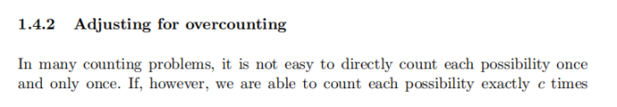

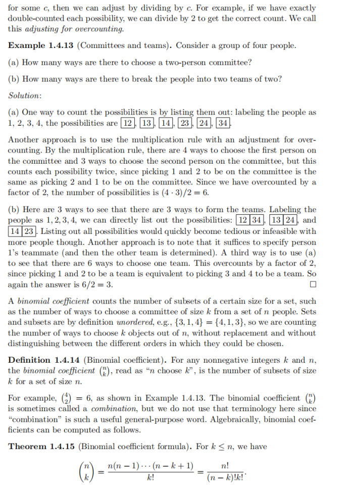

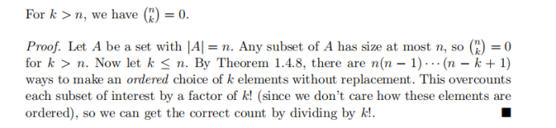


**1\. 标题与总体概括**  
_示例标题：《1.4.2 调整过度计数：从组合数到团队分组》_

本节讨论了在计数过程中常见的“重复计数（overcounting）”问题：当我们用乘法原理或直接罗列方法进行计算时，可能会不小心把同一个结果算多次。如果能够确定每个结果都被数了恰好  $c$  次，就可以通过除以  $c$  来获得正确结果。随后给出了两个小问题：在4个人中选出一个2人委员会，以及将4个人拆分成两个2人小组；并进一步引出了二项式系数  $\binom{n}{k}$  的定义和计算公式。

* * *

2\. 详细内容解析
----------

### 2.1 调整过度计数（Adjusting for overcounting）

*   **核心思路**：有些计数问题中，直接使用乘法规则会出现“重复计算”现象。比如“选人”时不在意先后顺序，却用了一种按顺序来选择的方法，就会让同一个“组合”被统计多次。
    
*   **解决方案**：若我们能确认每个最终可能结果都被重复了  $c$  次，那么只需要用最初的计算结果再除以  $c$  就能得到准确答案。
    
    *   这在数学上常被形象地称作“纠正因子（correcting factor）”、“除重（division for overcount）”。
        

### 2.2 Example 1.4.13：Committees and teams

本例有两问，均基于“4个人的小场景”来说明如何在不同的选人/分组方式下处理重复计数。

1）**(a) 选一个2人委员会**

*   有4个人，给他们贴标签：1, 2, 3, 4。
    
*   **直接罗列法**：所有可能的2人组合有  $\{1,2\}, \{1,3\}, \{1,4\}, \{2,3\}, \{2,4\}, \{3,4\}$ ，共6种。
    
*   **乘法 + 除重法**：
    
    *   若用乘法原理来想：先选第一个人有4种可能，接着选第二个人有3种可能，总计  $4\times 3=12$ 。
        
    *   但是，这里面把“先选1后选2”和“先选2后选1”当成了两种不同的结果，而实际上对于委员会来说  $\{1,2\}$  与  $\{2,1\}$  视为同一个组合。
        
    *   因而每个委员会都被算了2次（即  $c=2$ ）。
        
    *   所以正确答案是  $\frac{4\times 3}{2}=6$ 。
        

2）**(b) 把4个人拆成两个2人小队**

*   这里的问题是：怎样将4人分成两个2人组，且不区分哪个组在前哪个组在后？
    
*   **直接列举**：标签1, 2, 3, 4时，可能的拆分方式是
    
    1.   $\{1,2\}$ 与 $\{3,4\}$ 
        
    2.   $\{1,3\}$ 与 $\{2,4\}$ 
        
    3.   $\{1,4\}$ 与 $\{2,3\}$ 
    
    
    *   一共3种。
    
*   **使用上一小问的方法并再做除重**：
    
    *   如果只数“选出其中一个2人团队”的方法，和问题(a)一样是6种。
        
    *   但每选出一个2人团队，剩余的2人就自动成为另一个团队。
        
    *   如此一来，每一个“拆分”都出现了2次：例如，选 $\{1,2\}$ 意味着另一组是 $\{3,4\}$ ，而选 $\{3,4\}$ 则意味着另一组是 $\{1,2\}$ ，这两种其实是同一个拆分方案。
        
    *   因而最终答案  $\frac{6}{2}=3$ ，与直接列举法一致。
        

### 2.3 Binomial coefficient（二项式系数）

*   **定义1.4.14**： $\displaystyle \binom{n}{k}$  表示从  $n$  个元素中选出一个大小为  $k$  的子集数量，也就是不考虑顺序的“组合”数目。
    
    *   例如， $\binom{4}{2}=6$ ，对应上面两人委员会的示例。
        
    *    $\binom{n}{k}$  又读作“ $n$  choose  $k$ ”。
    
*   **含义**：二项式系数正好就是我们在(a)问题中得到的结果：从4人中选2人形成子集或“委员会”，共有6种。
    
*   **为什么不直接称“组合”**：文中提到有时“combination”在一般英语中用途较多，作者只把 $\binom{n}{k}$ 称为“binomial coefficient”，以免混淆。
    

### 2.4 Theorem 1.4.15：Binomial coefficient formula

*   **公式**：对于  $k \le n$ ，
    
    $$
     \binom{n}{k} \;=\; \frac{n \times (n-1) \times \cdots \times (n-k+1)}{k!} \;=\; \frac{n!}{k!\,\bigl(n-k\bigr)!}.
    $$
    
    对于  $k>n$ ， $\binom{n}{k} = 0$ （因为不可能从 $n$  个元素里取更多的元素）。
    
*   **推导思路**：
    
    *   若先按照无放回、按顺序地取  $k$  个对象（Theorem 1.4.8），会得到  $n(n-1)\cdots (n-k+1)$  种排法。
        
    *   但这些排法中，相同的集合被数了  $k!$  次（因为任何 $k$ 个元素的所有排列都对应同一个子集）。
        
    *   因此最后用  $\div k!$  进行调整过度计数。
        

* * *

3\. 小结
------

1.  **过度计数的产生**：当问题对顺序不敏感（不关心先后），但我们却用了一种“先选谁后选谁”的方式计数，就会产生重复；可用一个除重因子来修正。
    
2.  **组合数  $\binom{n}{k}$ **：是从 $n$ 个互不相同的对象中无放回、且不管顺序地选择 $k$ 个元素的数目，对应公式
    
    $$
     \frac{n!}{k!\,(n-k)!}.
    $$
    
3.  **示例**：
    
    *   (a) 4人选2人委员：先数顺序选择有12种，每种重复2次，故最后答案6。
        
    *   (b) 4人分两队(每队2人)：先选出一队有6种，再除以2消除“另一队”的重复，答案3。
    
4.  **一般原理**：只要能明确每个“真正想要的结果”在我们先前的计数中出现了固定次数 $c$ ，就可以用 $\div c$  来修正，即“调整过度计数”。若要进一步应用到更大规模问题，就会依赖二项式系数、排列组合等公式。
    

* * *

4\. 报错信息
--------

*   本次截图内容完整且清晰，无明显缺失。若后续需要更多例题（如组合数在概率中的典型应用等），可在相应章节或补充材料中继续学习。


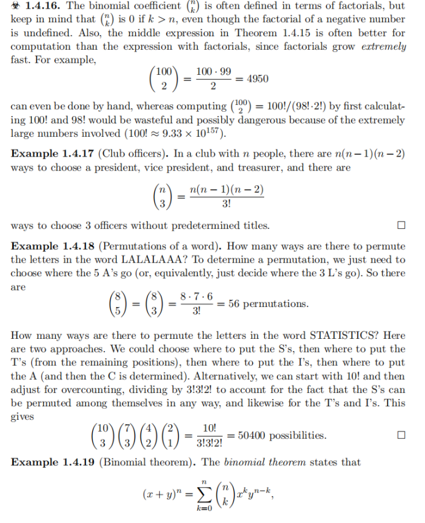

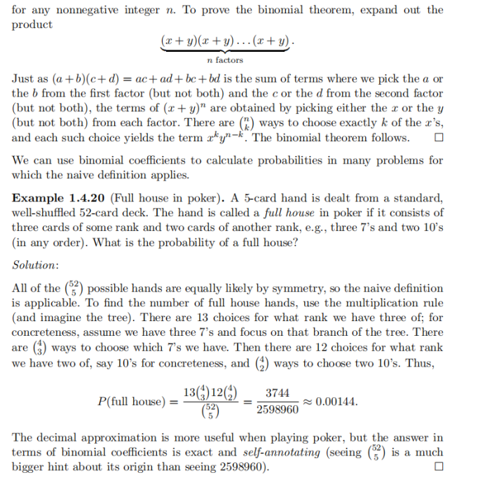


**1\. 标题与概览**  
_示例标题：《1.4.16 ~ 1.4.20：二项式系数的应用、单词的排列、二项式定理以及扑克牌“葫芦”概率》_

本部分首先补充了一些关于二项式系数  $\displaystyle \binom{n}{k}$  的运算技巧和应用实例，包括大数计算的注意事项、在俱乐部官员选举中选不同职务的排列方法、以及对单词中重复字母的排列计数。然后介绍了二项式定理  $\displaystyle (x+y)^n$  的展开公式，并以此引出在概率问题中如何灵活运用二项式系数。最后，通过示例1.4.20演示了扑克牌中“葫芦（Full house）”的概率计算，展示了将乘法规则和二项式系数结合使用来求解实际概率问题的完整流程。

* * *

2\. 详细内容解析
----------

### 2.1 关于二项式系数与大数计算（1.4.16）

*   ** $\binom{n}{k}$  的另一种计算方式**
    
    *   为了避免直接用阶乘计算  $\binom{n}{k} = \frac{n!}{k!(n-k)!}$  时遇到特别巨大的中间值，可以用
        
        $$
         \binom{n}{k} \;=\; \frac{n \times (n-1) \times \cdots \times (n-k+1)}{k \times (k-1) \times \cdots \times 1}
        $$
        
        逐步计算，减少溢出的风险。
    
*   **示例**： $\binom{100}{2} = \frac{100 \times 99}{2} = 4950$  很容易手算；但若先算  $100!$  再除以  $98! \, 2!$  则会触及非常大的中间数  $(100!)$ 。
    

### 2.2 Example 1.4.17：俱乐部官员(Club officers)

*   在一个包含  $n$  个人的俱乐部中，要选出总统（president）、副总统（vice president）和财务（treasurer）三位不同职务。问有多少种选法？
    
    *   用**有序**选择： $n$ 人里选总统有  $n$  种，选副总统剩下  $(n-1)$  种，选财务剩  $(n-2)$  种，总计
        
        $$
         n \cdot (n-1) \cdot (n-2) = n(n-1)(n-2).
        $$
        
    *   如果是“不分职务、只要3人组”则是  $\binom{n}{3}$  种。但这里每个职务不同，所以是一种排列问题。
        

### 2.3 Example 1.4.18：单词排列（Permutations of a word）

*   **1) LALALAAA**
    
    *   共有 8 个字母：3 个 L，5 个 A。
        
    *   问：这 8 个字母能排成多少种不同的次序？
        
    *   **思路**：在 8 个位置中选 5 个放置 A，其余 3 个位置放 L。
        
        $$
         \binom{8}{5} \;=\; \binom{8}{3} \;=\; \frac{8 \cdot 7 \cdot 6}{3 \cdot 2 \cdot 1} \;=\; 56.
        $$
    
*   **2) STATISTICS**
    
    *   字母分布：10 个字母，总体为 S(3个)、T(3个)、A(1个)、I(2个)、C(1个)。
        
    *   **方法A**：先选出 S 出现的位置，再选 T 出现的位置，再选 I 出现的位置，等等；中间要用乘法并注意剩余位置依次减少。
        
    *   **方法B**：将10个字母当作完全不同来排，即  $10!$  种；然后再除以 3!（S内部排列导致的重计）、再除以 3!（T内部重计）、再除以 2!（I内部重计）。
        
        $$
         \frac{10!}{3! \, 3! \, 2! \, 1! \, 1!} \;=\; 50400.
        $$
        
    *   结果：有 50400 种排列。
        

### 2.4 Example 1.4.19：二项式定理（Binomial theorem）

*   **定理陈述**：
    
    $$
     (x+y)^n \;=\; \sum_{k=0}^{n} \binom{n}{k} \, x^k \, y^{\,n-k}.
    $$
    
*   **证明思路**：
    
    *   将  $(x+y)$  这个因子乘  $n$  次，用展开法（类似多项式乘法）可发现，选中  $k$  个  $x$  和  $(n-k)$  个  $y$  的所有组合次数恰为  $\binom{n}{k}$ 。
        
    *   用到的思想与“在n个位置中选出k个放置x”类似，与我们前面讨论的组合数原理一脉相通。
    
*   **应用**：二项式系数在许多概率模型的计算中都会出现，比如在“n重伯努利试验”中， $\binom{n}{k}$  自然出现于成功 $k$ 次、失败 $(n-k)$ 次的项。
    

### 2.5 Example 1.4.20：扑克牌 Full house（葫芦）

*   **问题**：从标准 52 张扑克牌中任意发 5 张（无放回、等可能），问得到“葫芦”的概率多少？
    
    *   “葫芦”指 5 张牌中有 3 张同rank（牌面点数，如三张7），以及 2 张同rank（如两张10），共两种面值；花色随意但满足组合数量。
    
*   **解答**：
    
    1.  样本空间： $\binom{52}{5}$  个 5张组合。
        
    2.  计算“葫芦”分支：
        
        *   先决定哪种点数是三张(13种可能)；
            
        *   在这 4 张同点数的花色中，选出 3 张  $\rightarrow \binom{4}{3}$ ；
            
        *   再决定哪种点数是两张(剩下 12 种可能，因为不能与第一种点数相同)；
            
        *   在这 4 张同点数的花色中，选出 2 张  $\rightarrow \binom{4}{2}$ 。
        
    3.  将这些分支结果乘起来：
        
        $$
         13 \;\times\; \binom{4}{3} \;\times\; 12 \;\times\; \binom{4}{2} \;=\; 13 \times 4 \times 12 \times 6 \;=\; 3744.
        $$
        
    4.  **概率**：
        $$
         P(\text{full house}) \;=\; \frac{3744}{\binom{52}{5}} \;\approx\; 0.00144 \quad (\text{约 }0.144\%).
        $$
        
    
    *   该数值更常在实际打牌或赌博时使用它的小数形式，但用二项式系数写出则更能体现来源与含义。
        

* * *

3\. 本次内容小结
----------

1.  **二项式系数的应用范围非常广**：从简单的“选 k 个元素”到单词字母的排列计数，再到扑克牌组合概率， $\binom{n}{k}$  都是最核心的工具。
    
2.  **单词排列中重复字母的处理**：可理解为先把所有字母当不同，然后再除以相同字母内部的排列数（重计），或是直接用“选位置”的思路；两种做法是一致的。
    
3.  **二项式定理**提供了展开  $(x+y)^n$  的精确公式，并与“选 x 或 y”在每个因子中的组合次数相对应；在概率论中常见的“二项分布”恰是此定理的具体用例之一。
    
4.  **“葫芦”概率示例**：将朴素概率（ $\frac{|A|}{|S|}$ ）与组合计数方法相结合，示范了如何计算扑克牌组合的概率问题。
    
5.  **大数处理的提示**： $\binom{n}{k}$  可能涉及到极大阶乘，故常用更安全或分步方式计算，或采用对数运算以避免数值溢出。
    

* * *

4\. 报错信息
--------

*   本次截图内容文本清晰，无明显缺失或模糊之处。若需更深入的例题或对二项式定理的扩展证明，可在后续相关章节或附录中查阅。


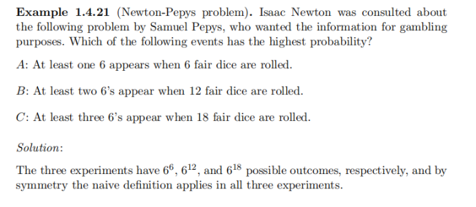

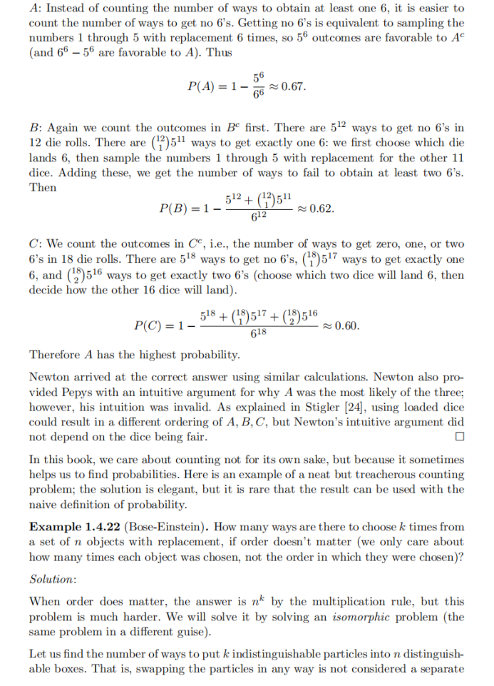

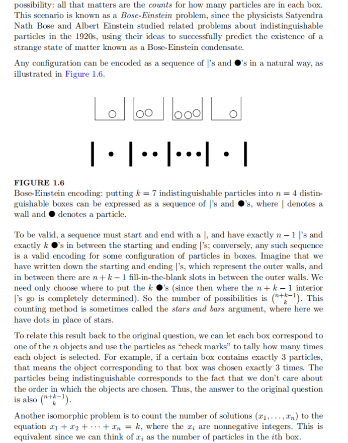


**1\. 标题与本次内容概览**  
_示例标题：《1.4.21 牛顿–佩皮斯问题与 1.4.22 Bose–Einstein问题：从多次掷骰子的概率比较到不区分顺序的抽样计数》_

在这部分内容里，我们先看到著名的“牛顿–佩皮斯（Newton–Pepys）问题”，比较了在不同数量的骰子中出现若干次“6”的概率大小。随后讨论了一个称为“Bose–Einstein”的计数问题，核心在于如何计算“有放回但不关心顺序”的抽样方式，使用了“星与棒（stars and bars）”技术来解决。

* * *

2\. 详细内容解析
----------

### 2.1 Example 1.4.21: Newton–Pepys 问题

*   **问题背景**  
    这是历史上著名的一个赌局/概率问题：佩皮斯（Samuel Pepys）向牛顿（Isaac Newton）咨询，以下三个事件哪个最有可能发生？
    
    1.  **A**：掷 6 枚公平骰子时，出现“至少一个 6”。
        
    2.  **B**：掷 12 枚公平骰子时，出现“至少两个 6”。
        
    3.  **C**：掷 18 枚公平骰子时，出现“至少三个 6”。
    
*   **样本空间**
    
    *   对于掷 6 枚骰子，结果总数是  $6^6$ 。
        
    *   对于掷 12 枚骰子，结果总数是  $6^{12}$ 。
        
    *   对于掷 18 枚骰子，结果总数是  $6^{18}$ 。
        
    *   这里每个骰子都独立且有 6 种等可能结果，故可以用朴素概率定义。
    
*   **计算思路：使用补事件**
    
    1.  **事件 A：至少 1 个 6**
        
        *   补事件  $A^c$  表示“零个 6”，即所有骰子都不是 6——相当于每次都出现  $\{1,2,3,4,5\}$  中的某一面。
            
        *   故  $\lvert A^c\rvert = 5^6$ 。
            
        *    $\displaystyle P(A)=1-\frac{5^6}{6^6}\approx 0.67$ 。
        
    2.  **事件 B：至少 2 个 6**
        
        *   补事件  $B^c$  = “0 个 6 或恰好 1 个 6”。
            
            *   0 个 6 的结果数： $5^{12}$ 。
                
            *   恰好 1 个 6 的结果数：先选出哪一枚骰子显示 6（有  $\binom{12}{1}$  种选法），然后剩余 11 枚都不是 6（ $5^{11}$  种），合计  $\binom{12}{1}5^{11}$ 。
            
        *    $\displaystyle P(B)=1-\frac{5^{12} + \binom{12}{1}5^{11}}{6^{12}}\approx 0.62$ 。
        
    3.  **事件 C：至少 3 个 6**
        
        *   补事件  $C^c$  = “0 个 6、1 个 6、2 个 6”。
            
            *   0 个 6： $5^{18}$ 。
                
            *   1 个 6： $\binom{18}{1}5^{17}$ 。
                
            *   2 个 6： $\binom{18}{2}5^{16}$ 。
            
        *    $\displaystyle P(C) = 1 \;-\;\frac{5^{18} + \binom{18}{1}5^{17} + \binom{18}{2}5^{16}}{6^{18}} \;\approx 0.60$ 。
    
*   **结果比较**
    
    *    $P(A)\approx 0.67$ 、 $P(B)\approx 0.62$ 、 $P(C)\approx 0.60$ 。
        
    *   因此事件 A 的概率最大，B 次之，C 最小。
    
*   **牛顿的结论**
    
    *   通过相似的计算，牛顿断定“6 枚骰子至少出一个 6”的概率高于另两种情况。
        
    *   值得注意的是，牛顿曾给出过一个直觉“对称性”解释，后来被学者指出：若骰子并非完美公平，则直觉对称性会导致不同排序。不过他用的正式计算并不受此影响，且给出了正确结果。
        

* * *

### 2.2 Example 1.4.22: Bose–Einstein 问题

*   **问题背景**
    
    *   现在考虑从  $n$  个对象中，进行“ $k$  次选择（有放回）”，但**不区分顺序**——即只关心每个对象被选了多少次，而不在意选的先后顺序。
        
    *   若我们关心顺序，结果数是  $n^k$ （每次从  $n$  种里选一项，共进行  $k$  次）。
        
    *   可是这里“顺序”不重要，所以需要另一种计数方式。
    
*   **“星与棒” (stars and bars) 思想**
    
    *   这种问题又称 Bose–Einstein 问题，与物理中研究“玻色–爱因斯坦凝聚”时的统计模型类似：将  $k$  个“不可区分的粒子”分配到  $n$  个“可区分的盒子”中，各盒子有多少粒子即可，不关心粒子的先后。
        
    *   可以把此情形转化为一个“序列”或“方程”来解：
        
        *   等价于在  $n$  个选项的“计数器”上分配  $k$  个“标记”；
            
        *   或者说， $x_1 + x_2 + \cdots + x_n = k$ （每  $x_i$  是非负整数），问有多少解？
        
    *   **核心结论**：
        
        $$
         \text{解数} \;=\; \binom{n + k - 1}{k}.
        $$
        
        （亦可写成  $\binom{n + k - 1}{n-1}$ 。）
    
*   **图示解释（Figure 1.6）**
    
    *   用“ $\circ$ ”表示粒子，用“ $|$ ”表示分割盒子的“墙”；
        
    *   若有  $n$  个盒子，就需要  $n-1$  个“|”划分；再加上  $k$  个“ $\circ$ ”代表粒子，合计  $n-1 + k$  个符号。
        
    *   只要在这  $n-1 + k$  个位置中选出哪  $k$  个放“ $\circ$ ”，其余放“|”，就能确定每个盒子里多少粒子。
        
    *   因此，这就是从  $n+k-1$  中选  $k$  的二项式系数。
    
*   **与原题的等价**
    
    *   把“第  $i$  个盒子中有多少粒子”对应为“第  $i$  个对象被选了多少次”。
        
    *   这样就得出：**在有放回且不关心顺序的抽样中，可能结果总数是  $\binom{n+k-1}{k}$ **。
        
    *   相比之下，若顺序也要区分，则有  $n^k$  种。
        

* * *

3\. 本次内容总结
----------

1.  **Newton–Pepys 问题**
    
    *   分别计算“6 骰子至少 1 个 6”、“12 骰子至少 2 个 6”、“18 骰子至少 3 个 6”的概率，结果依次约为 0.67、0.62、0.60，故最可能的是第一种情形。
        
    *   这一结果提醒我们：有时直觉会感到后面选项似乎“出现更多 6”好像“更容易”，但实际上概率并非如此，具体要根据补事件和朴素概率来精确计算。
    
2.  **Bose–Einstein 问题 / Stars and bars**
    
    *   当我们要“从  $n$  个类别中选  $k$  次，但不关心选的顺序，只关心各类别被选多少次”时，不能直接用乘法规则  $n^k$ 。
        
    *   通过“星与棒”法可得  $\binom{n+k-1}{k}$  种分配方式；这是物理和组合数学中常见的模型。
        
    *   在概率论里，这也会出现在“有放回且不计次序”的抽样场景中。
    
3.  **方法论要点**
    
    *   在骰子/独立试验中运用朴素定义时，要注意是“有放回且顺序有区分”( $6^n$ 之类)的情形，而组合计数往往用于“无放回或不计顺序”时，需要星与棒或相关技巧进行。
        
    *   通常先识别“我们关心的是顺序与否”“能否把对象视为可区分” 等，再匹配相应的计数方法。
        

* * *

4\. 报错信息
--------

*   从截图中所见，文字及公式内容均清晰完整，无明显遗漏或模糊之处。若后续需要更深入的示例（例如如何将“星与棒”应用于更多复杂情况，或者如何在分布中运用Bose–Einstein思路），可在后续章节或其他参考文献中继续探讨。


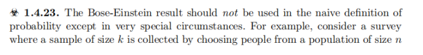

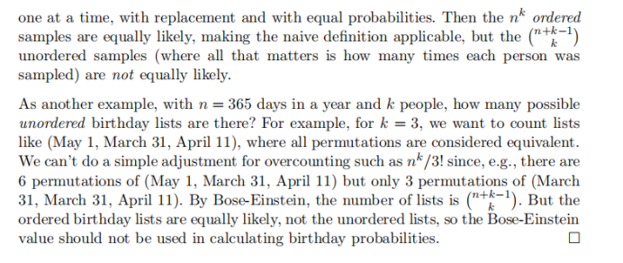


**1\. 标题与整体概括**  
_示例标题：《1.4.23 Bose–Einstein结论的局限：为什么在大多数情形下不能用于朴素概率？》_

本节强调了“星与棒（Bose–Einstein）”公式  $\displaystyle \binom{n+k-1}{k}$  在计算“有放回但不区分顺序”的情况时虽然非常有用，但不适合直接用于朴素概率的场景，除非在极其特殊的条件下。换言之，当每个“有序”样本都等可能时，并不意味着“无序”样本也等可能；若我们只想要无序样本却误用 Bose–Einstein 的数目来套用朴素定义，就会犯下错误。

* * *

2\. 详细内容解析
----------

### 2.1 Bose–Einstein结果与“无序”样本

*   **Bose–Einstein 结果**：  
    从  $n$  个对象中“有放回”抽取  $k$  次，且不关心抽取顺序（只关心每个对象被选了几次），其可能情况数为
    
    $$
     \binom{n + k - 1}{k}.
    $$
    
    这是“星与棒(stars and bars)”计数法的直接结论，亦称“玻色–爱因斯坦（Bose–Einstein）”分配模型。
    
*   **对概率的误用**：
    
    *   若我们想用“朴素概率”来计算事件概率，需要确保**每一个基本结果都等可能**。
        
    *   在“有放回且区分顺序”的抽样里，每一个有序序列（大小为  $k$ ）确实等可能，总数是  $n^k$ ；
        
    *   **但如果我们只把结果当作‘无序’的样本”，就会把多个不同有序序列合并成同一个“无序”集合，而这些不同序列各自都有相同概率**。
        
    *   合并后得到的那些“无序”子集彼此并不会等可能：某些“无序”结果包含的有序排列种数更多，就会具有更高的累积概率。
        
    *   因此， $\binom{n+k-1}{k}$  里的每一种“无序”选择在真实实验中并不都拥有相同概率，直接将其作为分母代入朴素定义将导致谬误。
        

### 2.2 调查示例：有放回抽样但不同排列不等价

*   设想人口为  $n$ ，要选  $k$  个人做调查，**每次**从  $n$  人里抽1位“有放回”，并假设每一次抽取独立且等可能（总共有  $n^k$  种有序序列）。
    
*   若有人只关心“哪些人被抽中、以及各被抽几次”，就变成“无序”视角：可用星与棒算得  $\binom{n+k-1}{k}$  种不同的“计数组合”。
    
*   但在真实抽样过程中，**每个有序样本(序列)的概率是  $\frac{1}{n^k}$ ；无序样本并非都拥有相同数量的对应序列**。因此把无序样本的数目当成“等可能事件的总数”，错误地纳入朴素概率，必然与真实概率模型相悖。
    

### 2.3 生日示例：为什么不能用  $\binom{n+k-1}{k}$ 

*   **具体情形：**  $n=365$  天， $k$ 个人，每人生日独立且等可能地落在任意1天；真实模型里“有序”样本总数是  $365^k$ 。
    
*   **想要无序列表**：
    
    *   例如当  $k=3$ ，我们可能说“(5月1日, 3月31日, 4月11日)”和“(3月31日, 5月1日, 4月11日)”是同一个无序集合——但它们在有序模型中是两种不同结果，各有相同概率  $\frac{1}{365^3}$ 。
        
    *   因此若把两种排列全合并为一个无序组合，就等于把那一组合所占的真实概率加起来（实际上可能多达6种排列）。
        
    *   不同的无序组合往往包含的排列数不一样：比如3个互不相同的生日能排列6种，而如果有2人同日生日、另1人不同，则排列种数只有3种……这显然会导致“无序组合”间不具备等可能性。
    
*   **结论**：
    
    *   **(有序)生日列表**每个出现的概率相同；
        
    *   **(无序)生日集合**则绝不等可能。因此不能用 Bose–Einstein 的  $\binom{365 + k -1}{k}$  当作分母去做朴素概率分析。
        

* * *

3\. 本次内容总结
----------

1.  **Bose–Einstein结果适用场合**
    
    *   在真正“粒子不可区分、盒子可区分”的物理模型中，各种“无序分配”被视为等可能，或在某些特定的离散数学问题中专门设定为“每个无序分配同样可能”。
        
    *   这类问题非常特殊，现实中多数“抽样”或“生日”情形并不满足“无序分配等可能”。
    
2.  **朴素概率的等可能性要求**
    
    *   若每一“基本结果”必须具有相同概率，则这些“基本结果”通常指向“有序实验”的每一种情形（例如一次次独立抽样所形成的序列）。
        
    *   把多个有序结果“合并”成一个无序类之后，各类不再等可能，不能简单以“无序类的计数”充当朴素概率的分母。
    
3.  **常见误区**
    
    *   有人看到  $\binom{n+k-1}{k}$  很漂亮，就想套用于任何“从 n 项里选 k 项的情况”，却忽略了真实概率过程中的等可能性落在“序列”上，而非“无序组合”上；这会得出错误的概率结论。
        
    *   例如调查抽样、生日问题，大多数情况都不能使用Bose–Einstein式的无序计数做分母。
    
4.  **结论**
    
    *   除非题目明确声明“无序配置各自等可能”，并给出确凿理由，否则切勿将 Bose–Einstein 结果直接代入朴素概率。
        
    *   在大多数日常及统计学抽样中，朴素概率对应的是“有序”模型（ $n^k$  或  $\binom{n}{k}$  等），要避免“星与棒”在此处的滥用。
        

* * *

4\. 报错信息
--------

*   从截图内容看，一切文字与公式完整无缺，无明显阅读困难。如有需要更详细讨论如何区分“序列等可能”和“无序组合等可能”，可以在后续更高阶章节或相关文献中查询。


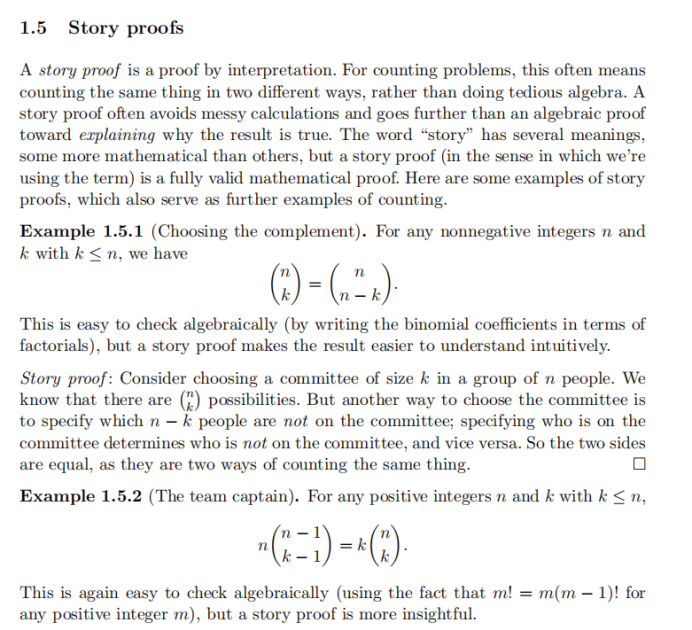

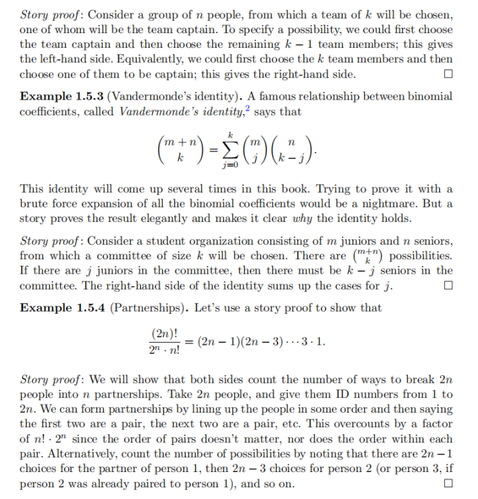


**1\. 标题与大体内容概述**  
_示例标题：《1.5 故事式证明：以更直观的方式理解组合恒等式》_

这一节介绍了“故事证明”（story proof）的概念：不再依赖繁琐的代数推导，而是通过“解释两种不同的计数方法实际上在数同样的东西”来展示公式为何成立。文中给出了一系列经典的组合恒等式（如 $\binom{n}{k}=\binom{n}{n-k}$ 、 $n \binom{n-1}{k-1} = k \binom{n}{k}$ 、Vandermonde恒等式、以及将 $2n$ 人两两分组的计算），并用生动的情节来说明每个恒等式在“计数什么”，从而让读者更直观地理解这些结果为什么正确。

* * *

2\. 详细内容解析
----------

### 2.1 “故事式证明”是什么？

*   在组合数学中，很多恒等式可以用代数方法（如展开、化简阶乘等）得到。然而，这些代数运算往往繁琐，且不易直观理解“为什么”结论如此。
    
*   “故事证明”则通过一个可视化或情节化的场景，展示“左边”和“右边”分别是什么样的计数方案，最后说明它们数的实际上是同一个集合（或同一类情况），因此二者相等。
    
*   这种“故事”不仅是一种简洁的思维方法，也构成了完全合法的数学证明。
    

* * *

### 2.2 Example 1.5.1： $\binom{n}{k} = \binom{n}{n-k}$  （选择补集）

*   **代数上**： $\binom{n}{k} = \frac{n!}{k! (n-k)!}$ ，而  $\binom{n}{n-k} = \frac{n!}{(n-k)!\,(n-(n-k))!} = \frac{n!}{(n-k)!\,k!}$ ，显而易见二者相等。
    
*   **故事证明**：
    
    *   设想在  $n$  个人中选一个大小为  $k$  的委员会；肯定有  $\binom{n}{k}$  种选法。
        
    *   但你也可以用“选哪  $n-k$  个人不进入委员会”的方式，反过来确定委员会。
        
    *   无论是“选谁进”还是“选谁不进”，最终的结果是一一对应。
        
    *   所以， $\binom{n}{k}$  与  $\binom{n}{n-k}$  都数了同一件事，故相等。
        

* * *

### 2.3 Example 1.5.2： $n\binom{n-1}{k-1} = k\binom{n}{k}$  （选队长）

*   **公式**：
    
    $$
     n\,\binom{n-1}{k-1} \;=\; k\,\binom{n}{k}.
    $$
    
*   **故事背景**：
    
    *   从  $n$  人中先要组成一个 $k$ 人团队，然后在这个团队里再指定一个队长（Team Captain）。
    
*   **两种计算方式**：
    
    1.  **先选队长，再选其余队员**：
        
        *   队长可从  $n$  人里随意选 1 位；
            
        *   剩余  $(k-1)$  人从余下  $(n-1)$  人中挑， $\binom{n-1}{k-1}$  种。
            
        *   总数：   $\; n \times \binom{n-1}{k-1}.$ 
        
    2.  **先选  $k$  人，再指定队长**：
        
        *   先把  $k$  人团队从  $n$  人里选出： $\binom{n}{k}$  种；
            
        *   然后在这  $k$  人当中指定 1 位做队长： $k$  种选择。
            
        *   总数： $\binom{n}{k}\times k$ .
            
    
    *   既然这两种过程数的都是“先组队 + 选队长”同一件事，就可知两者相等。
        

* * *

### 2.4 Example 1.5.3：Vandermonde’s Identity

*   **Vandermonde恒等式**：
    
    $$
     \binom{m+n}{k} \;=\; \sum_{j=0}^{k} \binom{m}{j}\,\binom{n}{\,k-j}.
    $$
    
*   **代数推导**：若展开二项式系数的阶乘式则可做，但会非常繁杂。
    
*   **故事证明**：
    
    *   假设有一个组织里有  $m$  个“初级生（juniors）”和  $n$  个“高年级生（seniors）”，合计  $(m+n)$  人。要从中选出  $k$  人的委员会。
        
    *   **左边  $\binom{m+n}{k}$ **：从  $(m+n)$  人整体中直接选  $k$  人。
        
    *   **右边**：按“选多少初级生”和“选多少高年级生”来分类：
        
        *   若委员会里有  $j$  位初级生，则就有  $(k-j)$  位高年级生；
            
        *   从  $m$  个初级生里选  $j$  人： $\binom{m}{j}$ ，从  $n$  个高年级里选  $(k-j)$  人： $\binom{n}{k-j}$ ；
            
        *   让  $j$  在 0 到  $k$  间所有可能值求和： $\sum_{j=0}^k \binom{m}{j}\,\binom{n}{k-j}$ 。
        
    *   这两种视角事实上对同一个“选  $k$  人”的结果进行划分、统计，因而二者相等——这就是Vandermonde恒等式背后的“故事逻辑”。
        

* * *

### 2.5 Example 1.5.4： $\frac{(2n)!}{2^n\cdot n!} = (2n-1)(2n-3)\cdots 3\cdot 1$  （伙伴配对）

*   **公式**：
    
    $$
     \frac{(2n)!}{2^n\,n!} = (2n-1)(2n-3)\cdots 3\cdot 1.
    $$
    
    这被视为一种计数“将2n人分成n对”的做法。
    
*   **故事证明**：
    
    1.  **左边**：
        
        *   先把  $2n$  个人排成一个顺序：有  $(2n)!$  种排法；
            
        *   再将队列依次两人一组，(1,2)是一组，(3,4)是一组……
            
        *   但这样会有重复：
            
            *   (a) 组内成员顺序不重要（若(1,2)和(2,1)视作同一对）。  
                因此每一对有2种排列，需要除以  $2^n$ 。
                
            *   (b) 不同对的顺序不重要，（(1,2),(3,4))与((3,4),(1,2))算同一种配对），这又引入了一因子“n!”，需继续除。
            
        *   故最终  $\frac{(2n)!}{2^n\,n!}$  种。
        
    2.  **右边**：
        
        *   先拿(2n)人给他们编号1到2n，按如下步骤配对：
            
            *   先从 2n 人里给1号选择其搭档(有  $2n-1$  种)；
                
            *   再从剩余的 2n-2 人里给下一个（比如 2 号或最小编号尚未成对的人）找搭档(有  $2n-3$  种)；
                
            *   一直下去……最后留下最后 2 人自动成对。
            
        *   乘起来得到  $(2n-1)(2n-3)\cdots 3\cdot 1$ 。
    
*   因这两种方法都数出了“如何把2n人拆成n对”，就得出二者相等。
    

* * *

3\. 本次内容总结
----------

1.  **故事式证明的意义**
    
    *   它为我们提供了对公式“为什么成立”的深层次解释，而不仅仅是代数上的正确性。
        
    *   许多看似神秘的组合恒等式，其本质是“从不同角度数同一个事物”，故事式证明能帮助我们形象地理解并记忆。
    
2.  **几个关键示例**
    
    *    $\binom{n}{k} = \binom{n}{n-k}$ ：通过选谁进委员会/选谁出委员会看出二者相等。
        
    *    $n \binom{n-1}{k-1} = k\binom{n}{k}$ ：先选队长再选队友 vs. 先选队友再定队长。
        
    *   Vandermonde恒等式：按“初级生人数”分层次加和，与“全部一起选”相同。
        
    *   拆分2n人成对：用排列+除重 或直接在每步选搭档，二者结果吻合。
    
3.  **实用性**
    
    *   故事式证明不但在数学竞赛中常见，也在教学场景里帮助学生/读者更好地接受与记忆公式。
        
    *   它们往往也让我们知道如何将复杂场景拆分为简单的“子问题”去计数，具有启发性。
        

* * *

4\. 报错信息
--------

*   当前截图文字清晰、无缺损或难以辨认之处，可视为完整呈现了本节内容。若后续需要更多类似故事证明（例如Catalan数或其他高级组合恒等式），可在相应章节或参考书中进一步探索。


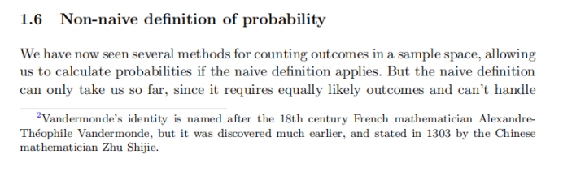

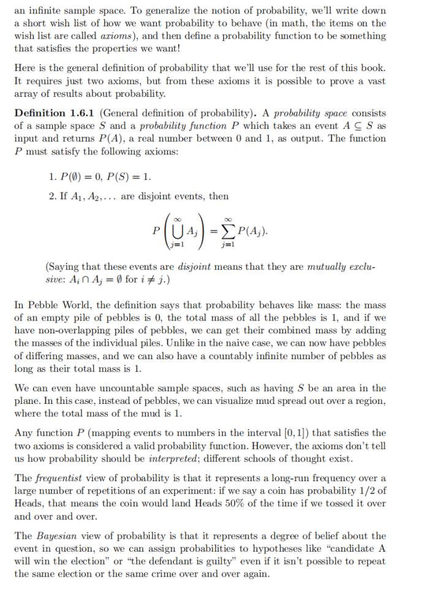

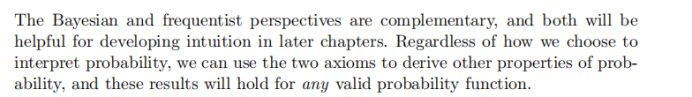


**1\. 标题与概述**  
_示例标题：《1.6 非朴素概率定义：从有限等可能到一般概率空间》_

在前面几节，我们主要依赖“朴素概率定义”（naive probability）来计算事件概率：当样本空间有限且每个结果等可能时，用  $\tfrac{|A|}{|S|}$  即可求得概率。但是在很多现实或更复杂的场景中，样本空间可能是无限、或结果并非等可能，这时朴素定义就不再适用。  
为此，本节引入了**更普适的概率论公理体系**，它只需满足两个核心公理，便能在无限、非均匀等多样化情况下使用。

* * *

2\. 详细内容解析
----------

### 2.1 朴素定义的局限性

*   **朴素定义**：假设样本空间  $S$  中每个结果等可能，事件  $A\subseteq S$  的概率就是
    
    $$
     P_{\text{naive}}(A) \;=\; \frac{|A|}{|S|}.
    $$
    
*   **局限**：
    
    1.  要求结果等可能，往往在实际问题中并不成立（如有偏硬币、不均匀球、或更复杂的分布）；
        
    2.  样本空间可能是**无限的**（可数或不可数），此时用“数目”来分母已不合适；
        
    3.  即使有限，但若结果分布并非均匀，朴素定义也不适用。
        

### 2.2 一般概率空间：两个公理 (Definition 1.6.1)

为了应对更广泛的情形，我们建立了更通用的“概率空间（probability space）”概念。具体来说，包括：

1.  **样本空间  $S$ **：所有可能结果的集合（可有限、可数无限、或不可数无限）。
    
2.  **概率函数  $P$ **：将事件（ $S$  的子集）映射到区间  $[0, 1]$  上，满足以下两条公理：
    
    *   **公理1**： $P(\varnothing) = 0$ ，且  $P(S)=1$ 。
        
        *   解释：空事件不可能发生，概率为0；整个空间“必定”发生，概率为1。
        
    *   **公理2**：若  $A_1, A_2, \dots$  是两两互斥的事件（disjoint events, 即  $A_i\cap A_j = \varnothing$  for  $i\neq j$ ），则
        
        $$
         P\Bigl(\bigcup_{j=1}^\infty A_j\Bigr) \;=\;\sum_{j=1}^{\infty} P(A_j).
        $$
        *   解释：对互不重叠的事件，其概率可以“相加”起来，这称为**可数可加性（countable additivity）**。
            

*   只要一个函数  $P$ （定义在事件的集合上）满足上述两个公理，就可以称之为一个“有效的概率函数”，进而和样本空间  $S$  一起构成“概率空间”。
    

### 2.3 Pebble World 的推广

*   在此前的“Pebble World”模型里，如果各卵石质量都一样，我们可做“等可能”假设；但若卵石质量不同，则每块卵石并非等可能，概率需要对每块“分配”一个相应权重，使总和=1。
    
*   只要**所有卵石加起来的总质量=1**，并且把互不重叠的卵石堆相加，就能得到总质量，这就符合可数可加性和公理1的要求。
    
*   这样，就不必局限于“有限且等可能”的情况：
    
    *   可以有无限多块卵石；
        
    *   可以让每块卵石拥有不同“质量（概率权重）”。
        

### 2.4 连续与不可数样本空间

*   我们甚至能将  $S$  视为**连续的区域**（如二维平面的一部分），把它想象成“摊开在那儿的泥巴总质量为1”，每个子区域对应一个事件，且其“面积”或“体积”或更一般的测度就是概率函数  $P$ 。
    
*   由此，从离散到连续都能在同一个公理体系下处理，不再被“等可能性”限制。
    

### 2.5 概率的诠释：频率派 vs. 贝叶斯派

*   **频率派（Frequentist view）**：
    
    *   概率代表**大量重复实验**中某事件出现的“长程频率”。
        
    *   如说“硬币正面概率=0.5”意味着若抛此硬币许多次，正面将大约出现一半。
    
*   **贝叶斯派（Bayesian view）**：
    
    *   概率代表我们对某命题的主观确信程度，哪怕这个命题只能发生一次或无法重复试验。
        
    *   如说“某候选人赢得选举的概率=0.6”，即我们对这个未来事件的信心程度；即便无法在现实中重复大选很多次，也可以基于信息先验、证据更新来量化不确定性。
    
*   **互补性**：
    
    *   这两种解释都能满足公理1和公理2，所以数学上没有冲突。
        
    *   在实际应用中，人们常结合这两种观点；本书后续也会在不同场合使用不同直觉进行推理。
        

### 2.6 结论：一个“更强大”的概率定义

*   通过只要**满足公理1和2**，就能得到一大套通用的性质和推论（如补集概率=1-事件概率，有限可加性，以及条件概率、独立性定义等）。
    
*   **朴素定义**可视为此公理化框架下的一个特殊情形（有限且等可能分配）；而公理化定义能处理更多形式的样本空间（无限，不均匀分配等）。
    

* * *

3\. 本次内容小结
----------

1.  **朴素概率定义的局限性**：只能处理有限、等可能的情况，不适用于无限空间或非等概率分配。
    
2.  **一般概率论公理**：采用只需满足两条公理（总概率=1, 可数可加性），从而构造出对所有事件分配到  $[0,1]$  的函数。
    
3.  **Pebble World 的推广**：可以把一堆不同质量的卵石看作离散分布，甚至延伸到连续空间的“泥巴图景”，只要总质量=1，并且彼此不重叠的堆加起来概率也可相加。
    
4.  **不同解释学派**：
    
    *   频率派：概率=长程频率
        
    *   贝叶斯派：概率=对事件发生的信念或不确定性度量  
        这两种诠释都能在公理框架内存在，后续章节会综合运用。
    
5.  **与后续内容的联系**：基于这两个公理，可以拓展出基本概率性质（补集、有限可加性、单调性等）和更高级内容（条件概率、独立性、期望等），无论样本空间大小或分配方式如何，都可适用。
    

* * *

4\. 报错信息
--------

*   从截图看，文本完整、段落连贯，没有出现不清晰或缺失。若需更深入讨论“如何在公理化定义下具体赋值一个概率函数”，可在后续学习测度论、概率分布、随机变量等章节探究。


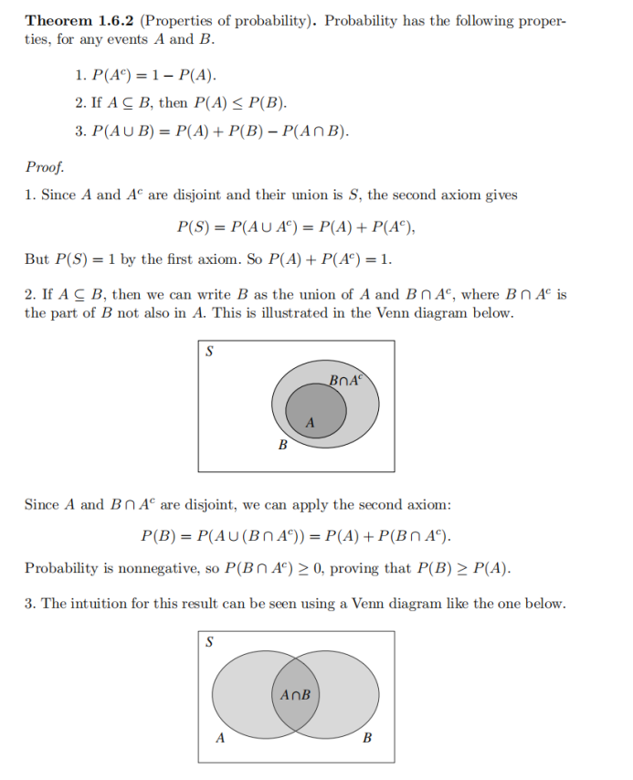

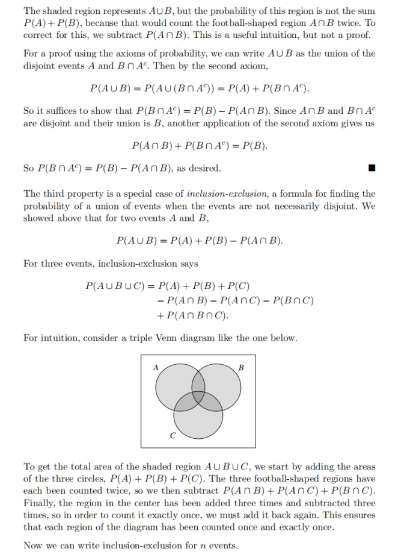


**1\. 标题与概述**  
_示例标题：《1.6.2 概率的基本性质：补集、子集与并集-交集的容斥原则》_

在引入了概率公理之后，本节通过简单推导展示了若干基本且常用的概率性质，包括对补集的概率 $P(A^c)$ 、子集的比较 $P(A) \le P(B)$ ，以及对两个或多个事件并集的**容斥公式(inclusion-exclusion)**。这些性质在实际概率运算中非常频繁地用到，也能借助维恩图(Venn diagram)形象理解。

* * *

2\. 详细内容解析
----------

### 2.1 Theorem 1.6.2：概率的三个基础性质

1）** $P(A^c) = 1 - P(A)$ **

*   由公理可知： $P(S) = 1$ 。又因为  $A$  与其补集  $A^c$  互不重叠，且  $A \cup A^c = S$ 。
    
*   按可加性公理： $P(A) + P(A^c) = P(S)=1$ 。
    
*   因而得到  $P(A^c) = 1 - P(A)$ 。
    
*   **直观**：若事件  $A$  发生的概率是 0.3，则它不发生的概率就是 0.7。
    

2）**若  $A \subseteq B$ ，则  $P(A) \le P(B)$ **

*   如果事件  $A$  是事件  $B$  的子集，那么  $B$  至少包含  $A$  所有的结果，还可能更多，所以概率上不会更小。
    
*   形式化：
    
    *   因为  $B$  可以分成  $A$  与  $B \cap A^c$  两部分（互不重叠），故
        
        $$
         P(B) = P(A \cup (B \cap A^c)) = P(A) + P(B \cap A^c).
        $$
        
    *   由于概率非负，因此  $P(B)\ge P(A)$ 。
        

3）** $P(A\cup B) = P(A) + P(B) - P(A\cap B)$ **

*   称为 “两事件时的容斥公式(inclusion-exclusion)”。
    
*   **为什么要减去  $P(A\cap B)$ **：
    
    *   如果只做“ $P(A)+P(B)$ ”，那么在维恩图中“A与B相交的区域”会被数了两次。
        
    *   所以要减去一次 $P(A\cap B)$ 以确保这部分只被算一次。
    
*   这个结果可以借助公理2，通过把  $A\cup B$  写成“不相交子集的并”来推导，或通过Venn图来直观理解。
    

### 2.2 容斥原理的扩展（Inclusion-exclusion for 3 events）

*   对三个事件  $A, B, C$  的并集，容斥原则进一步给出：
    
    $$
     P(A \cup B \cup C) = \; P(A) + P(B) + P(C) \;-\; P(A\cap B) - P(A\cap C) - P(B\cap C) \;+\; P(A\cap B\cap C).
    $$
    
*   **原因**：
    
    *   第一步：将三个事件的概率相加，三块“足球形”区域各被重复计算一次，需要减去各两两交集；
        
    *   但中央的“三重交集”已被加了3次又减了3次，等于0次，所以最后要再加回来一次。
    
*   对更多事件的并集，也有类似的累加减操作，一般称为“高阶容斥公式(inclusion-exclusion principle)”。
    

### 2.3 直观理解：Venn图

*   课件的插图用不同重叠圆圈来表示事件，在计算并集概率时可以看出：
    
    *   简单累加会多次计重叠部分；
        
    *   两事件时要减去它们的交集；
        
    *   三事件时要减去三组两两交集，再把三重交集加回去，等等。
    
*   这也说明使用维恩图作图辅助可以快速判断在求事件并集概率时该怎样进行加减运算。
    

* * *

3\. 本次内容总结
----------

1.  **三大基本性质**：
    
    1.   $P(A^c) = 1 - P(A)$ 
        
    2.  若  $A\subseteq B$ ，则  $P(A)\le P(B)$ 
        
    3.   $P(A\cup B)=P(A)+P(B)-P(A\cap B)$   
        这是在概率公理(可数可加性)之上推导出的最常用结论，也为后续多事件的容斥公式打下基础。
    
2.  **容斥公式(Inclusion-exclusion)**：
    
    *   两事件情况：   $\;P(A\cup B) = P(A)+P(B)-P(A\cap B)$ 。
        
    *   三事件情况：再加减两两交集与三重交集，保证“每块区域恰好被数一次”。
        
    *   对更多事件则出现更复杂的加减交集结构；但思路相同——避免重复计数或漏计。
    
3.  **直观工具：维恩图**
    
    *   在手动解题或教学中，画出各事件的圆圈并标注其相交区域，再数一遍看哪些区域是否被算多次，可更好地防止漏加或多减。
        

* * *

4\. 报错信息
--------

*   从截图里，文字与示意图都很清晰完整，无明显缺失。若想要更深度或更多例子，如推导四个及更多事件的容斥公式，可以在后续章节或习题中继续学习。


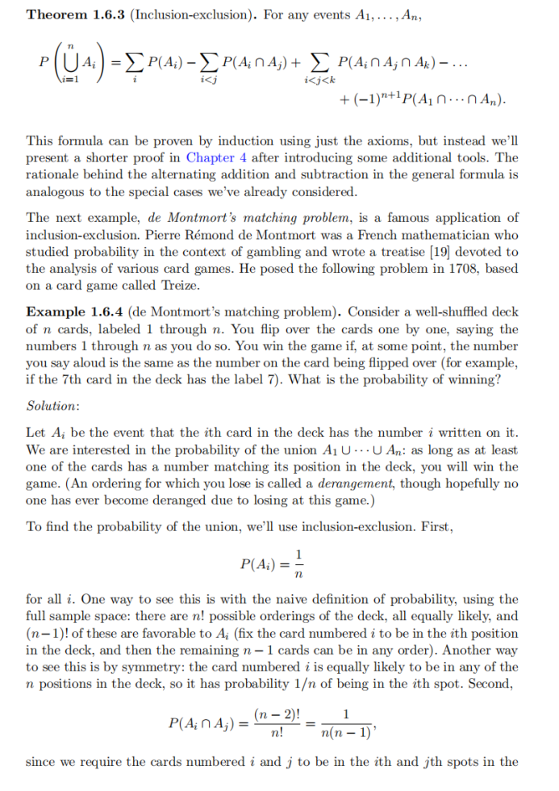

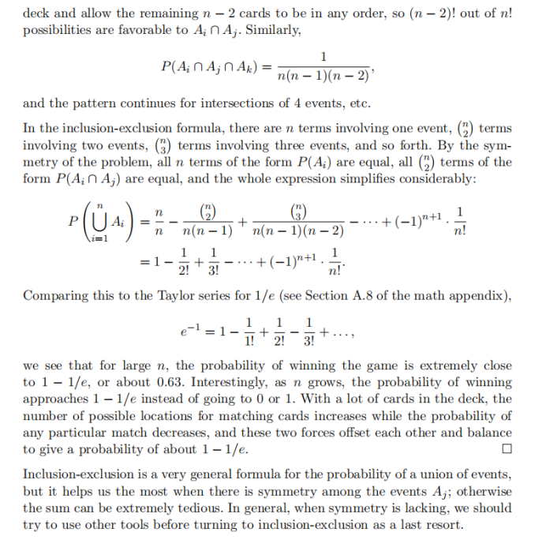


**1\. 标题与总体简介**  
_示例标题：《1.6.3~1.6.4：多事件的容斥公式与蒙莫（Montmort）的配对问题》_

本部分先给出了**容斥公式**在一般  $n$  个事件情形下的表达式（Theorem 1.6.3），然后通过一个著名的纸牌示例——**蒙莫问题（de Montmort’s matching problem）**——说明如何运用容斥公式来求解“随机排列中至少出现一次匹配”的概率。结果表明，当牌数  $n$  很大时，“至少有一张牌的顺序匹配其编号”的概率会逼近  $1 - \tfrac{1}{e}\approx 0.63$ 。

* * *

2\. 详细内容解析
----------

### 2.1 Theorem 1.6.3：容斥公式的通用形式

*   **多事件情形**：对任意  $n$  个事件  $A_1, A_2,\dots,A_n$ ，其并集概率为
    
    $$
     P\Bigl(\bigcup_{i=1}^{n} A_i\Bigr) \;=\;\sum_{i} P(A_i) \;-\; \sum_{i<j} P(A_i\cap A_j) \;+\; \sum_{i<j<k} P(A_i\cap A_j\cap A_k) \;-\;\cdots +\;(-1)^{n+1} P(A_1\cap \dots \cap A_n).
    $$
    
*   **意义**：这是前面两、三事件时的容斥结果在  $n$  维度上的自然推广。其推导可以用数学归纳或其他方法，在本书第四章还会给出更简短的证明思路。
    

### 2.2 Example 1.6.4：蒙莫的配对问题（de Montmort’s matching problem）

1.  **问题背景**
    
    *   有一副洗好的  $n$  张牌，编号 1 到  $n$ ；它们被随机排列后按顺序翻开。
        
    *   我们在翻第  $i$  张牌时，就说出数字  $i$ 。如果在翻某张时恰好牌面与所说的数字相同（例如翻到第7张牌时，牌面也是7），则我们“赢”了。
        
    *   问：赢的概率是多少？（即“至少有一张牌的序号与位置相同”的概率）
        
        *   若没有任何一张牌与其位置匹配，则称此排列为“错排(derangement)”。问题实际在计算“非错排”的反面概率。
    
2.  **定义事件**
    
    *    $A_i$ ：“第  $i$  张牌正好是编号  $i$ ”
        
    *   我们要的是  $P(A_1 \cup A_2 \cup \dots \cup A_n)$ 。
    
3.  **使用容斥公式与对称性**
    
    *   每个事件  $A_i$  出现的概率都相同，由对称性可知：
        
        $$
         P(A_i)=\frac{1}{n}.
        $$
        
    *   两个事件  $A_i \cap A_j$  表示“第  $i$  张牌是  $i$ ，且第  $j$  张牌是  $j$ ”；其概率为  $\tfrac{1}{n(n-1)}$ 。再往下，三个事件交集  $\tfrac{1}{n(n-1)(n-2)}$ ，等等。
        
    *   应用容斥公式
        
        $$
         P\Bigl(\bigcup_{i=1}^n A_i\Bigr) \;=\; \sum_{k=1}^n (-1)^{k+1}\;\frac{1}{k!}.
        $$
        
        更具体地写成：
        
        $$
         1 - \frac{1}{1!} + \frac{1}{2!} - \frac{1}{3!} + \cdots + \frac{(-1)^{n+1}}{n!}.
        $$
    
4.  **结果：逼近  $1-\tfrac{1}{e}$ **
    
    *   将以上和式与 $e^{-1} = 1 - \tfrac{1}{1!} + \tfrac{1}{2!} - \tfrac{1}{3!} + \dots$ 的泰勒展开相比，可知当  $n$  很大时，
        
        $$
         P(\text{至少1张牌匹配}) \;\approx\; 1 - \tfrac{1}{e} \;\approx\; 0.63212\dots
        $$
        
    *   因此对于大  $n$ ，你差不多有六成以上的概率能在某张翻牌时“报对”它的编号。
    
5.  **直觉**
    
    *   随着牌数增多，能匹配的位置变多，但同时“概率上每个位置不匹配”的情况也更可能出现；两种趋势抵消后，概率稳定到约 0.63。
        
    *   这在组合数学中也被称为“错排数”问题，其概率极限是  $\tfrac{1}{e}$ （不匹配）或  $1-\tfrac{1}{e}$ （至少有匹配）。
        

* * *

3\. 本次内容小结
----------

1.  **容斥公式**：在处理多事件的并集概率时是一种通用方案，但若事件很多、交集也很多，直接使用容斥往往繁琐。我们通常要么用对称性简化、要么另寻巧妙思路。
    
2.  **蒙莫问题（de Montmort’s matching problem）**：
    
    *   令  $A_i$  表示“第 $i$ 张牌是 $i$ 号”，从而“赢”的事件是  $A_1\cup\cdots\cup A_n$ 。
        
    *   通过容斥与对称性得到概率表达式
        
        $$
         1 - \frac{1}{1!} + \frac{1}{2!} - \cdots + \frac{(-1)^{n+1}}{n!},
        $$
        
    *   当  $n$  大时，该概率  $\to 1-\tfrac{1}{e}\approx 0.63$ 。
    
3.  **一大启示**：
    
    *   “只要至少有一个位置匹配”的概率并不会随着  $n$  无限增大而逼近 1，也不会趋近 0，而是稳定在  $\sim 0.63$ 。
        
    *   这类问题在随机排列、错排分析、算法概率分析里都常出现。
    
4.  **容斥的一般意义**：
    
    *   提供了一种精确地计算并集概率的方法，在事件相互之间对称或结构简单时尤为有效；
        
    *   若缺乏对称性，容斥会产生大量项难以简化，则须在实务中考虑其他技巧或近似方法。
        

* * *

4\. 报错信息
--------

*   从截图看，内容完整无缺。若需更深入了解错排数的计算或进一步应用，可参考后续章节或组合数学相关章节。


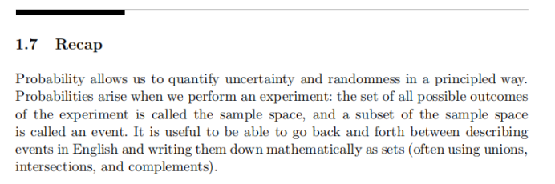

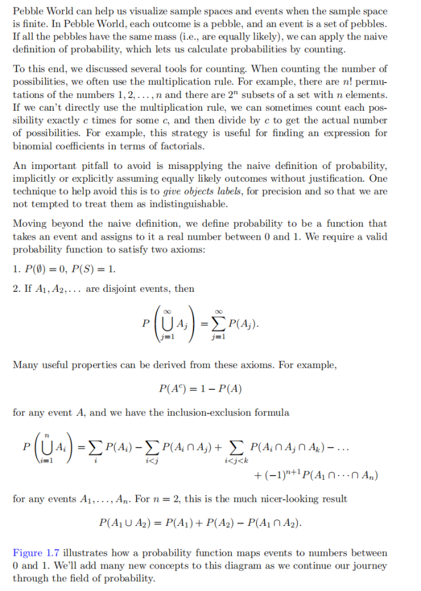

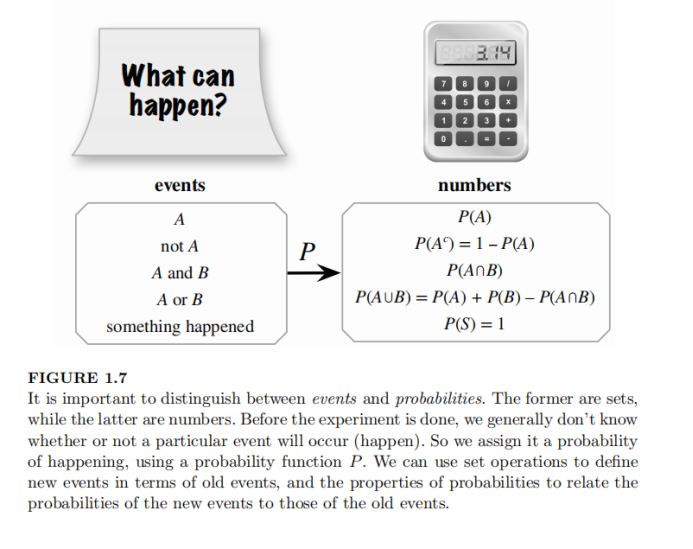


**1\. 标题：**  
《第1章回顾：概率与计数的基础概念及一般概率定义》

* * *

**2\. 本章核心内容概览**  
本章从概率的直觉和日常应用出发，首先介绍了样本空间（sample space）与事件（event）的基本概念，并在“Pebble World”这一具象化示例中展示了如何用集合（并、交、补）的方式来描述各种事件。接着，章节围绕“朴素概率定义”和其局限性展开，讨论了在有限且等可能情况下如何用 $\frac{|A|}{|S|}$ 求概率，以及为何在无限或不等可能的情形下该定义无法适用。

随后，本章花了较多篇幅介绍**计数方法**（乘法规则、排列组合、星与棒方法、容斥原理等），帮助我们在确定“有多少种可能结果”时提供技术支持；并通过抛硬币、扑克牌、生日问题、Bose–Einstein模型等例子说明如何数结果以及何时能用朴素概率做计算。最后，本章以**公理化的概率定义**收尾，引入了“概率空间”的两个核心公理（总概率=1，可数可加性），并列举了从这些公理推导出的基本性质（如 $P(A^c)=1-P(A)$ 、 $P(A\cup B)=P(A)+P(B)-P(A\cap B)$ 等），从而为后续更深入的概率理论奠定了统一的框架。

* * *

**3\. 详细回顾要点**

1）**样本空间与事件**

*   每次实验都有一组可能结果，称为样本空间 $S$ 。
    
*   事件则是 $S$ 的一个子集，如果实验实际结果落在该子集中，就说此事件“发生”了。
    
*   通过“Pebble World”的可视化比喻，我们把样本空间视作一堆卵石，每颗卵石代表一种可能结果；事件则是一堆卵石的子集。
    

2）**朴素概率定义及其适用范围**

*   当样本空间是有限且所有结果等可能时，可用 $\frac{|A|}{|S|}$ 定义事件 $A$ 的概率。
    
*   这一“朴素”定义有显著局限：当结果不等可能或样本空间无限，或当我们无法证明“等可能”时，就必须寻找更普适的概率定义。
    

3）**基础的计数工具**

*   **乘法规则**：如果一个试验可拆为多个阶段，每阶段有若干可能结果，则总可能结果数为各阶段结果数的乘积。
    
*   **排列组合**：
    
    *   排列：强调顺序；如从 $n$ 人里选 $k$ 人的有序方式是 $\frac{n!}{(n-k)!}$ 。
        
    *   组合：不考虑顺序；如二项式系数 $\binom{n}{k}$ 表示“从 $n$ 项选 $k$ 项的子集数”。
    
*   **星与棒（Bose–Einstein）**：计算“有放回且无序”的抽样结果数为 $\binom{n+k-1}{k}$ ，但这一计数**不等价于**“所有无序样本等可能”。切勿在概率计算中直接把它当分母套用朴素定义。
    
*   **容斥原理（inclusion-exclusion）**：
    
    *   对两个事件： $P(A\cup B)=P(A)+P(B)-P(A\cap B)$ 。
        
    *   对 $n$ 个事件：先加上所有单事件的概率，再减去所有两两交集，再加上所有三重交集……依此类推，确保每一部分只被计数一次。
        

4）**常见示例及应用**

*   **生日问题**：只要有23人，至少两人同生日的概率便超一半；利用“有放回、均匀”的样本空间( $365^k$ )计算并借助补事件简化。
    
*   **蒙莫问题**（de Montmort’s matching problem）：从随机排列的 $n$ 张牌里“牌面等于位置编号”至少出现一次的概率约为 $1-\frac{1}{e}$ 。这里借助容斥公式和对称性来求解。
    
*   **扑克牌例题**：如“葫芦”概率，通过 $\binom{52}{5}$ 做分母，用组合计数事件；较好地示范了朴素定义在有限等可能情景下的正确使用。
    

5）**一般概率定义：公理化框架**

*   为突破“朴素定义”的限制，引入了**概率空间**(sample space $S$  + 概率函数 $P$ )，满足两条公理：
    
    1.   $P(\varnothing)=0$ 、 $P(S)=1$ ；
        
    2.  对两两互斥事件 $A_1,A_2,\dots$ ， $P(\bigcup_j A_j)=\sum_j P(A_j)$ 。
    
*   从此即可推出很多常见性质，如 $P(A^c)=1-P(A)$ 、 $P(A\cup B)=P(A)+P(B)-P(A\cap B)$ 等。
    
*   该框架允许我们处理无限、不均匀分布的情况，也容纳不同解释流派（频率派vs.贝叶斯派），在后续理论中会不断用到。
    

* * *

**4\. 小结与展望**

*   本章为我们**搭建了概率学的基础概念**：
    
    1.  事件与样本空间的集合表示；
        
    2.  对有限等可能样本空间，如何用“数结果”来计算概率；
        
    3.  多种组合与排列技巧（乘法规则、排列组合、星与棒、容斥原理）及其在概率问题中的应用；
        
    4.  由朴素概率过渡到更一般、可适用无限情境的公理化概率定义。
    
*   从下章开始，我们将在这个公理化框架下，讨论条件概率、独立性、期望等更深层的概念，并结合频率派和贝叶斯派的视角学习如何分析复杂的随机现象。
    

* * *

**5\. 报错信息**

*   本次内容的截图和文字均完好、解释已全面覆盖。如后续需要查看更具体的例题推导或做练习，可以结合本章习题与下一章材料进一步学习。


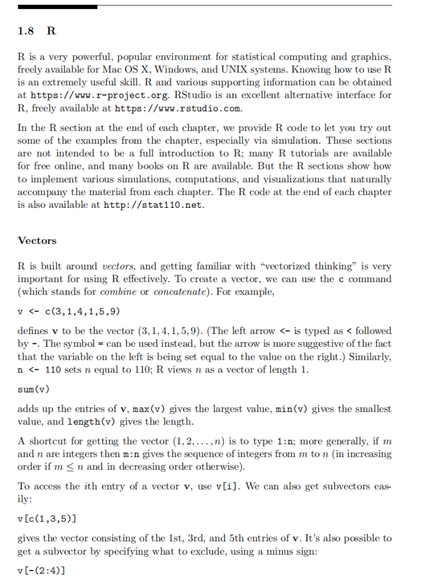

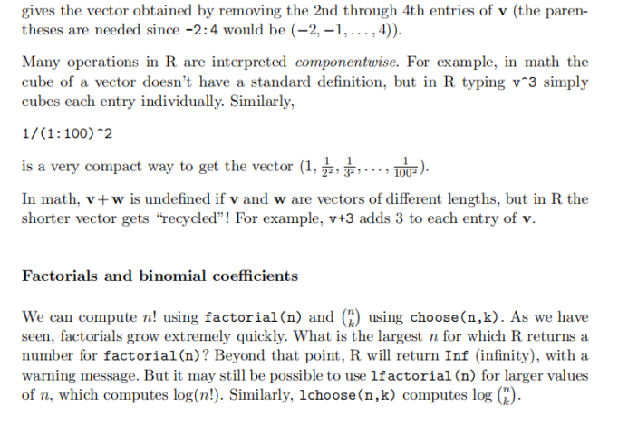


**1\. 标题与大体内容概览**  
_示例标题：《1.8 R：基础向量操作与组合函数》_

本节展示了如何使用 R 语言（一个功能强大的统计计算与绘图环境）来完成与本章内容相关的一些模拟、计算和可视化。文中首先介绍了 R 中最常见的数据结构之一：**向量（vector）**，以及常见的向量操作方式。随后讲解了如何使用 R 计算**阶乘与二项式系数**等在概率与组合数学中常用的函数。

* * *

2\. 详细内容解析
----------

### 2.1 R 环境简介

*   **R 语言特点**
    
    *   免费、跨平台，适用于 Mac/Windows/UNIX；
        
    *   专长于统计分析和可视化；
        
    *   通过 RStudio 等图形化界面能让编程和数据分析更为便捷。
    
*   **本书中“R”部分的定位**
    
    *   每章结尾处都会附上一些 R 代码实例，主要用于**演示模拟**（simulation）和简单的统计计算，让读者能亲手验证或探索本章所学的概率概念。
        
    *   并非要系统教 R 语言本身；如需深入学习 R，可参考其他在线教程或书籍。
        

### 2.2 向量（Vectors）

*   **向量的创建**
    
    *   用 `c()` 函数（combine/concatenate）即可创建向量，例如：
        
        ```r
        v <- c(3,1,4,1,5,9)
        ```
        
        这会把变量 `v` 定义为含有 6 个元素的向量：`(3,1,4,1,5,9)`。
        
    *   或者用 `=` 代替 `<-` 也可以，但 `<-` 更具可读性（它暗示“把右侧值赋给左侧变量”）。
        
    *   序列生成：`1:n` 生成从 1 到 n 的整数序列；更一般的 `m:n` 则从 m 到 n 递增（若 m<n）或递减（若 m>n）。
    
*   **向量常用函数**
    
    *   `sum(v)`：求和
        
    *   `max(v)` / `min(v)`：向量最大/最小值
        
    *   `length(v)`：向量长度（元素个数）
    
*   **向量取子集 (indexing/subsetting)**
    
    *   `v[i]`：取第 i 个元素。
        
    *   `v[c(1,3,5)]`：取第 1、3、5 个元素，并返回它们组成的新向量。
        
    *   `v[-(2:4)]`：将下标 2~4 的元素排除，返回除第 2、3、4 之外剩余元素的新向量。
        
        *   注意：如果不加小括号，`-2:4` 会被解释为 `(-2):4`，会产生错误范围；因此需写 `-(2:4)` 指明要排除的区间。
    
*   **向量运算：分量式 (componentwise) 执行**
    
    *   在 R 中，对向量做诸如 `v*3`（乘以 3）或 `v+3`（每个元素加 3）都被视为“逐元素操作”。
        
    *   `1/(1:100)^2` 可以迅速生成一个长度为 100 的向量，元素依次是 `(1, 1/2^2, 1/3^2, …, 1/100^2)` 等。
        
    *   **向量“长度不匹配”时的回收（recycling）**：若两个向量做加法，但一个较短，R 会将短向量重复拼接，以符合操作。需留意这可能带来逻辑错误或警告。
        

### 2.3 阶乘（factorial）与二项式系数（choose）

*   **阶乘**
    
    *   使用 `factorial(n)` 计算 n!
        
    *   当 n 很大时，`factorial(n)` 可能返回 `Inf` 表示无穷大，也可能有警告；这仅说明超出了机器可表示范围。
        
    *   若只需要 `log(n!)`，可使用 `lfactorial(n)` 获取对数值。
    
*   **二项式系数**
    
    *   使用 `choose(n, k)` 计算  $\binom{n}{k}$ 
        
    *   同样有 `lchoose(n,k)` 用于计算  $\ln\bigl(\binom{n}{k}\bigr)$  以防止数值过大。
        

* * *

3\. 本次内容总结
----------

*   R 语言提供了丰富的统计与绘图功能，我们可以用它来模拟抛硬币、抽扑克牌等概率实验，或者直接计算所需的排列组合、阶乘、二项式系数等数量。
    
*   **向量**是 R 中的核心概念：
    
    *   创建向量：`c()`, `m:n`;
        
    *   访问或排除某些下标：`v[i]`, `v[-(2:4)]`;
        
    *   逐元素运算：`v*3`, `1/(1:100)^2` 等；
    
*   **组合函数**：`factorial(n)`、`choose(n,k)` 在 R 中让我们能够快速获取在概率或组合数学中常见的数值。对超大 n 值则可选择对数型函数 `lfactorial`、`lchoose` 以防溢出。
    

* * *

4\. 报错信息
--------

*   本次截图所示文字与示例均清晰完整，无明显缺失。若需更深入的 R 语言用法（如数据框、循环、函数式编程等），可参考专业 R 教程或官方文档。


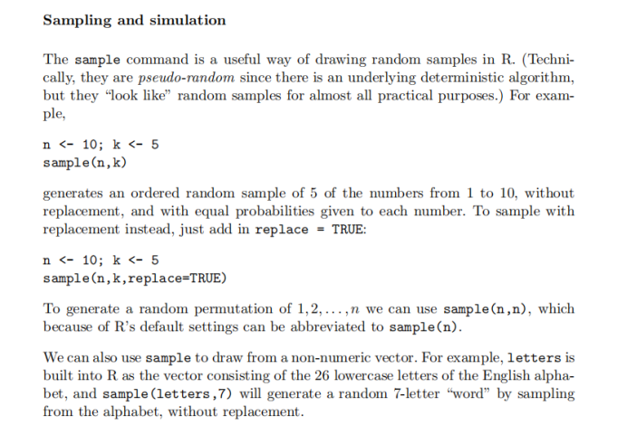

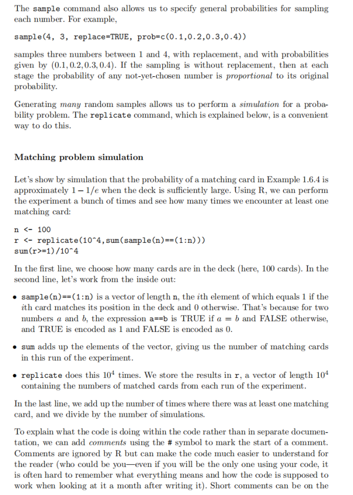

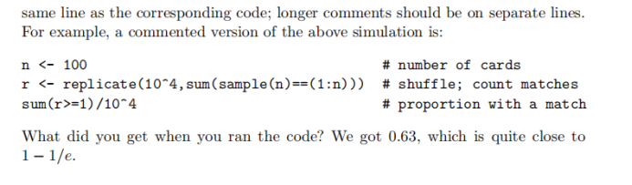


**1\. 标题与大体内容概览**  
_示例标题：《1.8 使用R进行抽样与模拟：示例与代码说明》_

本节介绍了如何在 R 语言环境下执行随机抽样（sampling）以及如何利用模拟（simulation）来验证或近似估计概率问题的结果。作者说明了 `sample()` 函数的多种用法，包括有无放回抽样、自定义抽样概率，并通过一个配对问题（matching problem）的示例，展示了如何用 R 代码多次重复实验并统计结果，从而对理论概率做出数值上的逼近与验证。

* * *

2\. 详细内容解析
----------

### 2.1 `sample()`函数：抽样与随机置换

1）**最基本用法**

*   `sample(n,k)`：从 `1,2,...,n` 中**无放回**随机抽取 `k` 个数，返回一个长度为 `k` 的向量，顺序即为抽到的次序。若不指定 `k`，默认 `k=n`，即得到 `1,...,n` 的一个随机排列。
    
    ```r
    n <- 10
    k <- 5
    sample(n, k)
    ```
    
    这行代码会返回在 `1..10` 范围内随机挑选的 5 个整数，且不重复；等同于默认概率均为 `1/10`。
    

2）**有放回抽样**

*   若需有放回抽样，则在 `sample()` 里加 `replace=TRUE`：
    
    ```r
    sample(n, k, replace=TRUE)
    ```
    
    每次抽取后，元素还放回，因而可能出现重复的选项。
    

3）**自定义抽样概率**

*   可以用 `prob=` 参数来设定不同元素的被抽取概率（只在 `replace=TRUE` 时每次抽取保持此分布；若 `replace=FALSE`，则下一次的概率要基于已抽过的结果进行比例调整）。
    
    ```r
    sample(4, 3, replace=TRUE, prob=c(0.1,0.2,0.3,0.4))
    ```
    
    这表示从 `1..4` 中有放回抽 3 次，抽到1的概率0.1，2的概率0.2，3的概率0.3，4的概率0.4。
    

4）**从非数值向量里抽样**

*   `sample()` 也能从字符串或其他类型的向量中做随机挑选。比如，R 内置的 `letters` 是 26 个小写英文字母：
    
    ```r
    sample(letters, 7)
    ```
    
    会产生一个由7个随机不重复字母构成的向量（默认无放回）。
    

### 2.2 多次模拟：`replicate()`命令

*   **动机**：当我们想估计一个概率（例如在理论上不易直接计算，或想验证公式）时，可以重复做许多次随机抽样，并观察目标事件发生的频率来近似它的概率。
    
*   **用法**：
    
    ```r
    r <- replicate(times, expr)
    ```
    
    其中 `expr` 是要重复执行的 R 代码表达式，`times` 是重复次数；`replicate()` 会把每次运行的结果收集到一个向量或矩阵里（取决于 `expr` 的返回结构）。
    

### 2.3 配对问题模拟（Matching problem simulation）

1）**示例背景**

*   在第1.6.4节的配对问题中，我们知道当有 `n` 张卡片时，“至少有一张卡片与其位置编号相同”的概率会趋近 `1 - 1/e`。
    
*   若 `n` 很大，理论上这个概率大约在 0.63 左右；R 的模拟可以帮助我们“洗牌并检查匹配数”，多次重复从而得到频率估计。
    

2）**核心代码**

```r
n <- 100
r <- replicate(10^4, sum(sample(n)==(1:n)))
sum(r >= 1) / 10^4
```

*   第1行：`n <- 100` 设置卡片总数（洗牌后的一副牌）。
    
*   第2行：
    
    *   `sample(n)` 产生 `1..n` 的一个随机排列；
        
    *   `(1:n)` 是位置向量；
        
    *   `==` 判断逐元素是否相等（真或假），结果是逻辑向量；
        
    *   `sum(...)` 将逻辑向量中 `TRUE` 的个数相加（R中 TRUE=1, FALSE=0），得到本次试验里匹配卡片的数量。
        
    *   `replicate(10^4, ...)` 表示做 10000 次试验，把每次匹配数存入向量 `r` 中。
    
*   第3行：
    
    *   `sum(r >= 1)` 统计在这10000次中，“匹配数 >=1”的次数，也就是至少有一张牌匹配；
        
    *   再除以 `10^4` 得到估计的“至少1张匹配”发生频率。
        

3）**示例结果**

*   运行后得到的概率约为 0.63，与理论值  $1 - 1/e \approx 0.63212$  相当接近。
    
*   这说明模拟能很好地验证我们在容斥公式中推导出的极限结论。
    

### 2.4 代码注释与可读性

*   作者还强调了在 R 中使用 `#` 符号来添加注释的重要性，让自己或别人事后能读懂脚本的意图。
    
*   例如：
    
    ```r
    n <- 100                  # number of cards
    r <- replicate(10^4, sum(sample(n) == (1:n)))  # shuffle, count matches
    sum(r >= 1) / 10^4        # proportion with a match
    ```
    
    这样便于回顾时快速理解每行代码在做什么。
    

* * *

3\. 本次内容小结
----------

1.  **`sample()`是 R 中随机抽样的核心函数**
    
    *   支持无放回/有放回；
        
    *   可指定概率分布；
        
    *   能从数值或字符向量抽样。
        
    *   缺省参数可轻松获得 `1..n` 的随机排列。
    
2.  **`replicate()`配合`sample()`可实现多次模拟**
    
    *   循环执行抽样+计算的过程，积累足够多的试验结果；
        
    *   观测目标事件发生次数的比例来近似真实概率。
    
3.  **应用：蒙莫问题（配对问题）**
    
    *   验证“至少一张卡片与其位置对应”约为  $1-1/e$ ；
        
    *   通过 `sample(n)==(1:n)` 来检查匹配；多次重复后获得频率约 0.63。
    
4.  **实用贴士**
    
    *   对大规模试验可先行试跑，以估算所需时间或内存；
        
    *   善用注释，保持代码的可读性和可维护性。
        

* * *

4\. 报错信息
--------

*   从截图可见，所有示例和文字完整清晰，无明显遗漏或难以辨认的地方。若有更多复杂模拟（如自定义函数封装、向量化操作等），可继续参考 R 相关教程或后续章节。


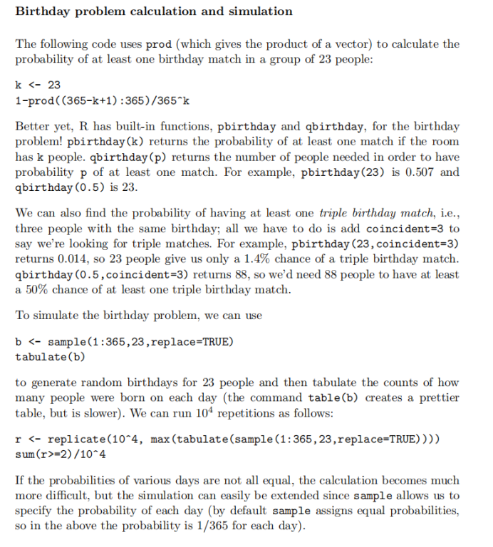


**1\. 标题与大体概览**  
_示例标题：《生日问题的计算与模拟：R 语言内置函数与扩展示例》_

在前面已介绍过经典的“生日问题”（即在 k 个人中至少有两人同一天生日的概率）。本节进一步展示了在 R 语言中如何直接使用一些内置函数（如 `pbirthday`、`qbirthday`）来快速计算相关概率，并演示了如何通过模拟来近似求解。其中，还探讨了“至少三人同生日”的更罕见情形，以及如何使用 `sample()` 与 `tabulate()` 来模拟 23 人的生日分布并统计是否出现冲突。

* * *

2\. 详细内容解析
----------

### 2.1 生日问题的基本概率计算

1）**用乘法 (prod) 手动计算**

*   我们先回顾常规做法：要得到“至少有两人同生日”的概率，通常先计算“所有人生日都不相同”的概率，再用 `1 - ...` 得出目标概率。
    
*   例如，当  $k=23$  时：
    
    $$
     P(\text{no match}) \;=\;\frac{365 \times 364 \times \dots \times (365-23+1)}{365^{23}}
    $$
    
    在 R 里可写作：
    
    ```r
    k <- 23
    1 - prod((365 - k + 1):365) / 365^k
    ```
    
    其中 `prod((365 - k + 1):365)` 代表将  $(365-22), \dots, 365$  这些整数相乘。
    

2）**R 中的内置函数：pbirthday() 与 qbirthday()**

*   `pbirthday(k)`：直接返回当房间里有 k 人时，“至少有两人同生日”的概率。
    
*   `qbirthday(p)`：给定概率 p，返回需要多少人时，至少两人同生日的概率才会达到或超过 p。
    
    *   例如：
        
        *   `pbirthday(23)` ≈ 0.507，表示 23 人时撞生日概率约 50.7%。
            
        *   `qbirthday(0.5)` = 23，表示若想达 50% 撞生日概率，至少需 23 人。
            

3）**三人同生日 (triple match)**

*   `pbirthday(23, coincident=3)` 表示“23 人中至少有 3 人同一天生日”的概率，大约 0.014（即 1.4%）。
    
*   `qbirthday(0.5, coincident=3)` 则给出要多少人时，“至少有三人同一天生日”的概率达到 50%，结果约 88 人。
    

### 2.2 生日问题的模拟方法

1）**模拟一个房间 23 人的生日**

*   用 `sample(1:365, 23, replace=TRUE)` 生成 23 个生日（数值在 1..365），其中 `replace=TRUE` 表示有放回抽样（每个人都可在 365 天中任选一天）。
    
*   `tabulate(b)` 可统计向量 b 中各数出现的次数（返回长度为 365 的向量，第 i 个位置表示“数 i 出现了几次”）。
    
    *   或者用 `table(b)` 也可，不过 `tabulate()`在数值整型上更高效。
        

2）**检验是否“至少有人同生日”**

*   在模拟层面，可以看 `max(tabulate(b)) >= 2`，如果最大计数≥2，就说明有日子出现了至少两人。
    
*   一个示例：
    
    ```r
    b <- sample(1:365, 23, replace=TRUE)
    tabulate(b)
    ```
    
    *   `tabulate(b)` 得到一个长度 365 的向量。
        
    *   `max(tabulate(b))` 如果≥2 则说明有人撞生日。
        

3）**多次重复模拟**

*   与之前的做法类似，可以用 `replicate(10^4, ...)` 重复 10000 次，然后计算有多少次出现 `max(...)≥2`。
    
    ```r
    r <- replicate(10^4, max(tabulate(sample(1:365,23,replace=TRUE))) )
    sum(r >= 2) / 10^4
    ```
    
    *   这样就得到“至少有 2 人同生日”的模拟估计概率。
        

### 2.3 不同概率分配的情形

*   若 365 天并非等可能（例如某些节日生日更常见），那么只要在 `sample()` 中设定相应的 `prob=`，即可模拟不均匀分布。
    
*   只需将 `prob` 参数设为一个长度 365 的概率向量（和为1），就能生成贴合真实分布的生日模拟。不过此时理论计算会变得更复杂，但模拟依然可以给出近似结果。
    

* * *

3\. 本次内容小结
----------

1.  **R 的内置生日函数**
    
    *   `pbirthday(k)`、`qbirthday(p)` 能快速计算至少两人同生日的概率或相应人数阈值；还可用参数 `coincident=` 求“至少 m 人同生日”。
    
2.  **模拟思路**
    
    *   `sample(1:365, k, replace=TRUE)` 产生 k 人的生日向量；
        
    *   `tabulate()`或`table()` 统计各天出现次数，再检验是否存在 ≥2、≥3 的计数；
        
    *   `replicate()` 多次重复以得到频率估计。
    
3.  **三人同日或更多复杂情形**
    
    *   只需做类似思路，但关注 `max(tabulate(b))` 是否≥3；或借助 `pbirthday(k, coincident=3)` 直接获取结果。
    
4.  **不均匀分布扩展**
    
    *   只需在 `sample()` 中传入 `prob=` 参数即可模拟真实世界更贴近的生日分布场景。
        

* * *

4\. 报错信息
--------

*   根据截图内容，文字与命令行示例都很完整，没有出现明显缺失或不清晰部分；无需特殊报错说明。若有需要更高阶的代码或扩展，请参见后续章节示例。
