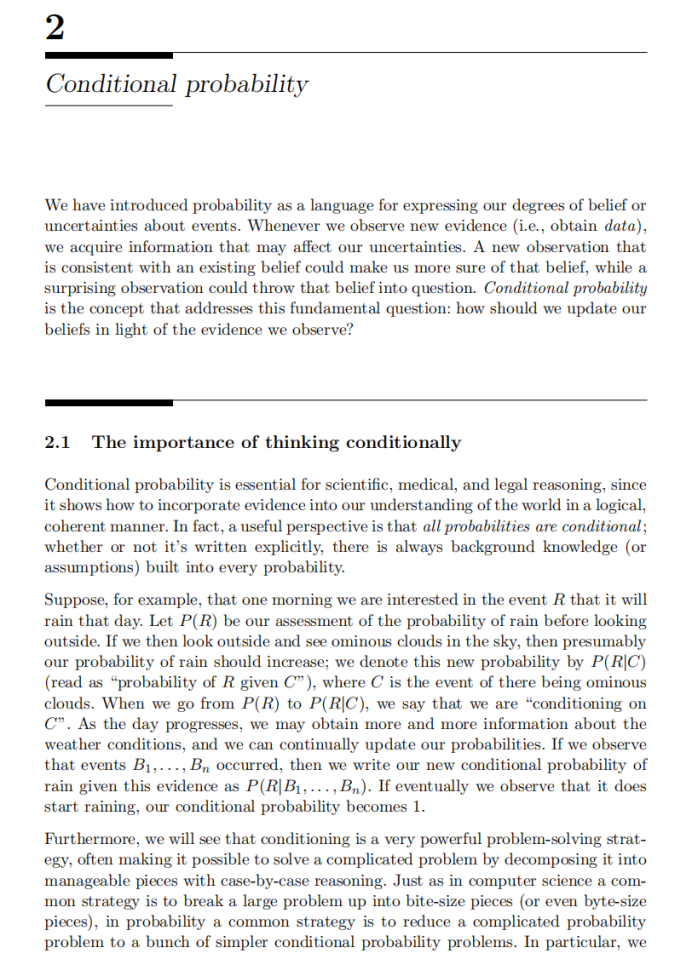

## chapter 2



### 条件概率——更新信念与解决问题的核心

> **本节概述**：本页介绍了“条件概率（Conditional probability）”的概念、作用及其在科学、医学、法律等推理场景中的重要性；同时引出了“条件化思维”作为拆解复杂问题（如多阶段随机试验）的一种通用策略，并点明 **“Conditioning is the soul of statistics.”**

* * *

一、逐段详解与深度解析
-----------

| 位置 | 课件原文核心 | 讲解与延伸（逐行、逐式） |
| --- | --- | --- |
| **页眉 & 章节题** | **2 Conditional probability** | 章节号“2”说明本书已在前一章阐述概率基础；从本章起进入“条件”视角。 |
| **引言段** | “We have introduced probability as a language for expressing our degrees of belief … how should we update our beliefs in light of the evidence we observe?” | \- **概率 = 信念语言**：概率数值并非仅描述客观频率，也反映主观确信程度。  
\- **数据到来→信念更新**：新观测若 **符合** 旧信念 → 置信度↑；若 **冲突** → 置信度↓。  
\- **核心问题**：如何用严格规则“更新”旧概率？答案就是 **条件概率**。 |
| **2.1 小节标题** | **The importance of thinking conditionally** | 直接揭示：不仅要会算条件概率，更要“用条件的方式思考”。 |
| 段落① | “Conditional probability is essential for scientific, medical, and legal reasoning … all probabilities are conditional” | \- **应用场景**：科学实验、病症诊断、司法证据评估。  
\- **隐含条件**：任何概率  $P(A)$  背后都默认上下文  $K$ （知识/假设），实际上表示  $P(A\mid K)$ 。 |
| 段落②（雨天示例） | 设事件  $R$ \=当天下雨；初始评估  $P(R)$ ；见到乌云事件  $C$  后 →  $P(R\mid C)$ 。 | \- **符号说明**： $P(R\mid C)$  读作“在  $C$  条件下  $R$  的概率”。  
\- **动态更新**：随着新证据  $B_1,\dots,B_n$  的到来，概率迭代成  $P(R\mid B_1,\dots,B_n)$ 。  
\- **极端情况**：若最终真的下雨，即观测到  $R$  发生，则  $\color{green}{P(R\mid \text{下雨}) = 1}$ 。 |
| 段落③ | “conditioning is a very powerful problem-solving strategy … break a big problem up into bite-size pieces” | \- **问题分解**：与编程中“逐模块拆解”相似，统计中将复杂概率问题→一系列较小的条件子问题。  
\- **数学体现**：利用**全概率公式**或**贝叶斯公式**分步推导：  
 $P(R)=\sum_{c}P(R\mid C=c)\,P(C=c)$  |
| 段落④ | “we will discuss a strategy known as first-step analysis …” | \- **首步分析法**：先按第一次试验结果分类 → 写出递归方程，常见于马尔可夫链、随机游走等多阶段模型。 |
| **收束句** | _“Conditioning is the soul of statistics.”_ | \- **句意**：条件化既是**信念更新机制**，又是**求解复杂概率**的灵魂工具。  
\- **实践含义**：任何遇到的概率难题，首先问自己“可以按什么条件来分？” |

* * *

二、关键公式与思维工具
-----------

1.  **条件概率定义**
    
    $$
     P(A\mid B)=\frac{P(A\cap B)}{P(B)},\qquad P(B)>0
    $$
    *   分子： $A$  与  $B$  同时发生的概率
        
    *   分母：用来“缩放”到已知  $B$  发生的世界
    
2.  **贝叶斯公式（信念更新）**
    
    $$
     P(A\mid B)=\frac{P(B\mid A)P(A)}{P(B)}
    $$
    *   先验  $P(A)$  → 证据  $B$  到来 → 后验  $P(A\mid B)$ 
    
3.  **全概率公式（分解策略）**  
    若  $\{C_i\}$  构成完备事件划分，
    
    $$
     P(A)=\sum_i P(A\mid C_i)P(C_i)
    $$
    *   与示例中“乌云/晴朗/…”不同天气情形求下雨概率的做法一致。
    
4.  **首步分析（递归）**
    
    *   常将目标概率/期望写成“首步结果 + 之后子问题”形式：
        
        $$
         f(s)=\sum_{a}P(\text{首步}=a\mid s)\,f(\text{新状态})+g(s)
        $$
        
    *   适用于随机过程、赌博破产问题等。
        

* * *

三、本页核心要点小结
----------

1.  **条件概率的双重角色**
    
    *   _更新信念_：让我们的主观概率随着证据同步迭代。
        
    *   _分而治之_：将复杂概率推断拆为可管理的小块。
    
2.  **所有概率皆有条件**  
    任何裸写的  $P(\cdot)$  都隐含背景假设，提醒我们时刻检视前提。
    
3.  **实例化思维**  
    通过“是否下雨”故事展示了 **逐步观察 → 多次更新 → 达成确定性** 的全过程。
    
4.  **解决多阶段问题的利器**  
    从“全概率公式”到“首步分析”，条件化提供了通用的递归框架。
    
5.  **金句**
    
    > **Conditioning is the soul of statistics.**  
    > 这不仅是修辞，更是学习概率与统计时最值得铭记的工作原则。
    

* * *

四、报错/遗漏检查
---------

*   **可辨识度**：两张截图文字清晰，无缺页或裁剪缺失。
    
*   **覆盖度**：已对截图中出现的所有概念、符号、示例和金句逐一解释。
    
*   **如果** 还有后续公式或图示未被拍到，请继续上传，我将在笔记中补充。


条件概率 · 第二部分 —— 形式化定义与扑克牌示例
--------------------------

> **本节概览**：本页给出 _Definition 2.2.1_（条件概率的正式定义）、解释先验/后验概念，及通过扑克牌抽牌示例 (_Example 2.2.2_) 具体演算  $P(A\mid B)$  与  $P(B\mid A)$ 。文末列出三条易被忽视但极其关键的提醒，尤其是避免“检察官谬误 (prosecutor’s fallacy)”。

* * *

### 1 · 正式定义（Definition 2.2.1）逐行解析

| 课件原文 | 详细讲解 |
| --- | --- |
| **If A and B are events with  $P(B)>0$ , then the conditional probability of A given B is…** | 条件概率定义前提：被条件化事件  $B$  必须有正概率，否则分母为零无意义。 |
|  $\boxed{P(A\mid B)=\dfrac{P(A\cap B)}{P(B)}}$  | **分子**： $A$  与  $B$  同时发生的概率区域。  
**分母**：将样本空间“缩小”到  $B$  已发生的世界。 |
| **We call  $P(A)$  the prior…  $P(A\mid B)$  the posterior…** | \- **先验 (prior)**：更新前对  $A$  的不确定性评估。  
\- **后验 (posterior)**：在观测证据  $B$  后重新评估  $A$ 。与贝叶斯思想完全契合。 |
| **Interpretation**：竖线右侧是“证据”而非某种“ $A\mid B$ ”组合事件 | 强调 _“ $A\mid B$ ”并不是一个新的事件_，只是概率记号。错误理解会导致符号滥用。 |
| **For any event A,  $P(A\mid A)=1$ ** | 观测到  $A$  已发生，则  $A$  的不确定性消失，后验必为 1 —— 反证了定义的合理性。 |

* * *

### 2 · 扑克牌示例（Example 2.2.2）全程推导

> **情景**：一副 52 张标准扑克牌洗匀后 _不放回_ 抽两张。  
> 事件定义：  
>  $\displaystyle A=\{\text{第一张是红桃}\}$   
>  $\displaystyle B=\{\text{第二张是红牌 (♥♣)}\}$   
> 目标：求  $P(A\mid B)$  与  $P(B\mid A)$ 。

#### 2.1 求交集概率  $P(A\cap B)$ 

*   **方法 1 · 乘法计数**
    
    $$
     P(A\cap B)=\frac{13}{52}\times\frac{25}{51} =\frac{25}{204}
    $$
    *   步骤一：第一张必须是 13 张红桃之一 ⇒ 概率  $13/52$ 。
        
    *   步骤二：剩下 51 张里还有 25 张红牌 (13♥ + 12♦) ⇒  $25/51$ 。
        

#### 2.2 边缘概率  $P(A)$  与  $P(B)$ 

*    $P(A)=\dfrac{13}{52}= \frac14$  —— 四种花色等势。
    
*    $P(B)=\dfrac{26}{52}= \tfrac12$ 。
        
    *   **对称性速算**：在抽牌前的视角，第二张等价于随机一张牌，自然 26/52 红。
        
    *   课件亦给出乘法+计数验证：同样结果  $1/2$ 。
        

#### 2.3 套用定义

$$
\boxed{P(A\mid B)=\frac{P(A\cap B)}{P(B)}=\frac{25/204}{1/2}=\frac{25}{102}}
$$

$$
\boxed{P(B\mid A)=\frac{P(B\cap A)}{P(A)}=\frac{25/204}{1/4}=\frac{25}{51}}
$$

* * *

### 3 · 三条关键提醒（文中编号 1–3）

| # | 原文要点 | 深度解读 |
| --- | --- | --- |
| **1** | 把哪个事件放在竖线左右极为重要，混淆  $P(A\mid B)$  与  $P(B\mid A)$  会引发“检察官谬误”。 | **检察官谬误**：在司法中常将“证据在罪犯出现时的概率”误当作“出现证据时被告有罪的概率”。两者相差巨大。 |
| **2** | 计算条件概率关注“信息提供”，不必关心事件发生的时序先后。 | 例中即使先抽右手牌、再抽左手牌，对  $P(A\mid B)$  的计算并无影响 —— 条件概率是信息论视角，而非因果顺序。 |
| **3** | 直接解释  $P(B\mid A)=25/51$ ：若第一张是 ♥，剩余 51 张里红牌/黑牌数已知。 |  $P(A\mid B)$  则不易这样直观看出，这提示我们：反向条件概率往往更难直接感知，需要借助贝叶斯或对称/计数技巧。 |

* * *

### 4 · 与上一页知识的衔接

*   **形式化——>实践**：上一页提出“如何更新信念”这一哲学问题；本页用公式和具体算例给出操作框架。
    
*   **先验/后验概念落地**：雨天示例的口语化更新，现在用数学语言精准刻画。
    
*   **错误示范前置**：在深入定理前先警告常见误解，为后续 2.3–2.8 节（贝叶斯定理、检察官谬误等）做铺垫。
    

* * *

### 5 · 小结

1.  **条件概率定义**： $P(A\mid B)=\dfrac{P(A\cap B)}{P(B)}$  —— 分母必须非零。
    
2.  **先验→后验**：观测  $B$  后用定义更新  $A$  的概率。
    
3.  **扑克牌示例**：演示计算流程与结果  $P(A\mid B)=25/102,\;P(B\mid A)=25/51$ 。
    
4.  **三大提醒**：正确放置事件、顺序无关但信息重要、警惕直觉误区。
    

* * *

### 6 · 报错/遗漏检查

*   **清晰度**：两张截图文字与公式均清楚可辨，无缺漏。
    
*   **覆盖度**：所有定义、公式、示例计算及“三条提醒”已详细解释。
    
*   若后续章节继续介绍“口袋诠释”“几何诠释”等直觉解释，请继续上传——下一节笔记将衔接并扩展。


### 条件概率的两大直观模型与 “两孩问题” 深度解析

> **本节概况**：本页先用 **Pebble World（小石子模型）** 与 **频率学派视角** 两种直觉解释巩固公式  
>  $P(A\mid B)=P(A\cap B)/P(B)$ ，随后透过 **Martin Gardner 的“两孩问题”** 展现“条件信息精确化”对答案的巨大影响。

* * *

一、直观模型：从几何质量到长期频率
-----------------

| 位置 | 课件原文要点 | 知识点拆解与中文讲解 |
| --- | --- | --- |
| **Intuition 2.2.3 Pebble World** | 有限样本空间 ⇒ 每个可能结果是一颗小石子，**总质量归一为 1** | 1\. **事件 = 石子集合**：如图 2.1 左侧，实线框 A、虚线框 B 各含若干石子。  
2\. **获知 B 发生** ⇒ 去掉  $B^{c}$  区域石子 (图 2.1b)。  
3\. **重新归一化**：把剩余石子质量整体 ÷  $P(B)$ ，令总质量仍为 1（图 2.1c）。  
4\. **结论**：A 内剩余石子质量即  $P(A\cap B)/P(B)=P(A\mid B)$ 。 |
| **更新思想** | 去掉与证据冲突的石子，“按比例”放大剩余石子质量 | \- 若石子 2 初始质量是石子 1 的两倍，且两者都在 B，则条件后仍保持 2∶1。  
\- 若石子 2 不在 B，则其质量直接归零。 |
| **Intuition 2.2.4 Frequentist** | 重复试验  $n$  次，记次数  $n_A,n_B,n_{AB}$  | 1\. **相对频率近似**： $P(A)\approx n_A/n$ ， $P(B)\approx n_B/n$ ， $P(A\cap B)\approx n_{AB}/n$ 。  
2\. **条件频率**：限制在 B 发生的  $n_B$  次中，A 同时发生的比例 ⇒  $n_{AB}/n_B$ 。  
3\. **再次得到公式**： $\displaystyle P(A\mid B)=\frac{n_{AB}/n}{n_B/n}=\frac{n_{AB}}{n_B}\approx\frac{P(A\cap B)}{P(B)}$ 。  
4\. **图 2.2**：黑点圈出 B 发生的行，加粗表示其中 A 也发生——视觉化相对频率。 |

* * *

二、示范难题：Martin Gardner 的“两孩问题”
-----------------------------

> **问题陈述（Example 2.2.5）**
> 
> 1.  **Jones 先生**：有两个孩子，**较大** 的是女孩。求两人都是女孩的概率？
>     
> 2.  **Smith 先生**：有两个孩子，**至少有一个** 是男孩。求两个都是男孩的概率？
>     

### 2.1 隐含假设（书中已特别指出）

*   **性别二元**：每个孩子必为 _boy_ 或 _girl_（现实中有非二元，但此处简化）。
    
*   **等概率**： $P(\text{boy})=P(\text{girl})=\tfrac12$ 。
    
*   **独立性**：兄弟姐妹性别互不影响。
    

> **样本空间（按年龄顺序）**： $\{GG,GB,BG,BB\}$ ，各概率  $1/4$ 。

### 2.2 解 1 —— 指定“较大”孩子为女孩

*   先验： $P(\text{both girls})=\tfrac14$ 。
    
*   条件： $P(\text{elder is girl})=\tfrac12$ 。
    

$$
\boxed{P(\text{GG}\mid \text{elder = G})=\frac{1/4}{1/2}=1/2}
$$

### 2.3 解 2 —— 至少有一个男孩

*   目标事件：两个都是男孩 = BB。
    
*   条件事件：至少一男 ⇒ 样本空间变为  $\{GB,BG,BB\}$ 。
    
*   概率：
    

$$
\boxed{P(BB\mid \text{≥1 boy})=\frac{1/4}{3/4}=1/3}
$$

### 2.4 结果为何不同？

| 具体指定 | 非指定 | 直观解释 |
| --- | --- | --- |
| “较大 = 女” | “至少一 = 男” | **指定孩子** 删去了样本空间中恰好两种情况 (GB,BG)，只剩 GG、BG\*?\*—无，故分母更小，概率更大。  
“至少一” 只排除 BB 或 GG？在男孩版本排除 GG；结果子空间包含 3 种 → 概率下降。 |

*   公式上等价于在 **Pebble World** 里剔除不同的石子集合。
    
*   **非对称信息**：知道“具体哪一个孩子” vs “集合式信息” 会改变样本空间形状。
    

* * *

三、本页知识点总结
---------

1.  **Pebble World**：将样本空间视为“质量分布”，条件化 = 丢弃不相容质量并重新归一。
    
2.  **频率诠释**：长跑试验中排除 B 失败的轮次，只统计成功轮次里的 A 频率。
    
3.  **两孩问题启示**：
    
    *   条件信息越具体，分母可能越小，结果概率越高/低。
        
    *   必须明确 **“条件化的是哪个事件”**，否则陷入检察官谬误或直觉陷阱。
        

* * *

四、报错 / 遗漏检查
-----------

*   **截图内容**：Pebble World 图 2.1、频率图 2.2 与 Example 2.2.5 文字均清晰完整。
    
*   **已覆盖**：所有定义、图示、计算、三条隐含假设和反直觉解释。
    
*   若后续还有 Example 2.2.6 等章节，请继续上传，我将按同样深度续写笔记。


随机遇见女孩 & 冬季女孩——信息粒度如何影响“两孩概率”
-----------------------------

> **本次内容概况**：本页包含 **Example 2.2.6**（随机遇见的孩子是女孩）与 **Example 2.2.7**（至少一名“冬季出生女孩”），二者在同一基本样本空间  $\{GG,GB,BG,BB\}$  上展示 **条件事件愈具体 → 结果愈接近 1/2** 的现象；并再次强调：
> 
> *   **抽样过程（sample selection）** 是条件概率计算不可忽视的前提；
>     
> *   **独立性、等概率、事件定义** 决定了公式能否直接套用。
>     

* * *

### 1 · Example 2.2.6 随机遇到的孩子是女孩

| 步骤 | 具体推导 | 讲解与关键细节 |
| --- | --- | --- |
| **问题重述** | “一家有两个孩子。随机遇到其中一个，发现她是女孩。求两人都是女孩的概率。” | \- **随机遇到** ⇒ 等概率 1/2 遇见大或小孩。  
\- 抽样与性别独立：遇到的是谁与他/她的性别无关。 |
| **事件定义** |  $G_1$ ：大孩是女孩； $G_2$ ：小孩是女孩； $G_3$ ：随机遇到的孩是女孩 |  $G_3$  不等同于“至少一孩是女孩”，因遇见的是样本中 **一名具体孩子**。 |
| **交集概率** |  $\displaystyle P(G_1\cap G_2\cap G_3)=P(G_1\cap G_2)=\frac14$  | 若两孩皆女自然保证随机遇见女孩；三事件交集即  $GG$ 。 |
| **条件概率** |  $\displaystyle P(G_1\cap G_2\mid G_3)=\frac{1/4}{1/2}=1/2$  | \- 分母  $P(G_3)=1/2$ ：任何孩子均以 1/2 概率为女孩。  
\- 结果 **1/2** vs. 例 2.2.5 的 **1/3** 体现“特指 vs. 非特指”的差异。 |
| **抽样原则提醒** | 若并非“随机遇到”而是某规则（如禁止男孩外出），则  $G_3 \equiv $ “至少一孩是女孩”，答案又退回 1/3。 | **统计学术语**：需清楚 **样本如何抽取**，否则误将原数据当“随机样本”会导致偏差。 |

* * *

### 2 · Example 2.2.7 至少一名冬季出生女孩

> 前置假设：
> 
> *   四季等可能，季节与性别独立；
>     
> *   性别依旧二元且等概率。
>     

#### 2.1 计算框架

*   **目标**： $P(\text{GG}\mid \text{≥1 winter girl})$ 。
    
*   记“某个具体孩子是 _冬季女孩_”的概率  $p=\frac18$ （4 季 × 2 性别）。
    

| 项 | 推导 | 解释 |
| --- | --- | --- |
| **分母**  $P(\text{≥1　　 winter girl})$  |  $1-(1-p)^2=1-(7/8)^2$  | “至少一” = 1 – “两孩皆非冬季女孩”。 |
| **分子**  $P(\text{GG 且 ≥1 winter girl})$  |  $\frac14\bigl[1-P(\text{两女孩皆非冬季})\bigr]$  | 先锁定 GG（概率 1/4），再排除两人都不是冬季的情形。  
 $P(\text{两女孩皆非冬季})=(3/4)^2$ 。 |
| **结果** |  $\displaystyle \frac{(1/4)(1-(3/4)^2)}{1-(7/8)^2}=\frac{7/64}{15/64}=\frac{7}{15}\approx0.4667$  | 位于 1/3 与 1/2 之间。 |

#### 2.2 直观解析

*   **信息粒度介于前两例之间**：
    
    *   “至少一女孩” → 1/3
        
    *   “指定较大是女孩” → 1/2
        
    *   “至少一冬季女孩” 提供 **更多辨识线索**（季节）但仍非指定具体孩子 ⇒ 概率从 1/3 向 1/2 推近至 7/15。
    
*   **近似“指定”效果**：若条件为“有一女孩生于 3 月31 日 20:20”，信息几乎锁定了唯一个体，则概率会进一步趋近 1/2。
    

* * *

### 3 · 信息具体化对条件概率的影响（统一视角）

| 条件信息 | 样本空间被剔除的可能性 | 最终  $P(\text{GG}\mid \text{条件})$  |
| --- | --- | --- |
| 指定“大孩=女孩” | 去掉 **BG·BB** |  $\tfrac12$  |
| 至少一孩=女孩 | 去掉 **BB** |  $\tfrac13$  |
| 至少一孩=冬季女孩 | 去掉 **BB**, **除冬季女孩外的 BG,GB 部分** |  $\tfrac7{15}$  |
| 越近似“指定” | 剩余样本更少且更偏向 GG | 概率 ↑ 接近 1/2 |

> **核心洞见**：条件事件越具体，越“指向”某一固定孩子，**排除的可能性越多、留下的更倾向目标事件**，故概率向 1/2 靠拢。

* * *

### 4 · 本页知识点小结

1.  **随机样本假设**：在 2.2.6 中若失真，计算即刻变形。
    
2.  **独立性 & 等概率**：性别—季节独立确保乘法分解成立。
    
3.  **信息粒度阶梯**：
    
    *   非特指集合条件（≥1） → 1/3
        
    *   部分特征（冬季） → 7/15
        
    *   完全特指（大孩） → 1/2
    
4.  **统计思想**：不仅看“裸数据”，更要追溯 **数据如何产生** —— 这是判断能否直接使用  $P(A\mid B)=P(A\cap B)/P(B)$  的前提。
    

* * *

### 5 · 报错 / 遗漏检查

*   **截图内容**：Example 2.2.6、Example 2.2.7 及其完整推导文字均清晰完整；无缺页。
    
*   **解释覆盖**：已对各事件定义、公式推导、抽样假设与直觉差异逐一说明。
    
*   **若有** 后续练习 (Exercise 29 等) 或更多扩展，请继续上传，我将保持同等深度补充。


### 贝叶斯公式与全概率公式 —— 条件概率的两大基石

> **本节概览**：第 2.3 节从条件概率的基本定义出发，推出六个重要结果：
> 
> 1.  **交集概率定理** (Theorem 2.3.1)  2. **n 个事件交集展开** (Theorem 2.3.2)
>     
> 2.  **贝叶斯公式** (Theorem 2.3.3)  4. **赔率与概率互换** (Definition 2.3.4)
>     
> 3.  **赔率形式的贝叶斯公式** (Theorem 2.3.5)  6. **全概率公式** (Theorem 2.3.6)  
>     这些定理为“由证据更新信念”与“分而治之计算复杂概率”提供了通用工具。
>     

* * *

1 · Theorem 2.3.1 两事件交集概率公式
---------------------------

$$
\boxed{P(A\cap B)=P(B)P(A\mid B)=P(A)P(B\mid A)}
$$

**推导**（逐行）：

1.  从定义  $P(A\mid B)=\dfrac{P(A\cap B)}{P(B)}$  乘以  $P(B)$ 。
    
2.  同理以  $P(B\mid A)$  乘以  $P(A)$ 。
    

> **要点**：公式只是将条件概率“交叉相乘”，但它让我们在知道 **边缘概率 + 条件概率** 时快速拿到 **交集概率**，无需重新计数样本空间。

* * *

2 · Theorem 2.3.2 n 事件交集概率展开
----------------------------

$$
P(A_1,\dots,A_n)=P(A_1)\,P(A_2\mid A_1)\,P(A_3\mid A_1,A_2)\cdots P(A_n\mid A_1,\dots,A_{n-1})
$$

*   连续套用 2.3.1 共  $n-1$  次。
    
*   **阶乘多种展开**：对  $A_1,\dots,A_n$  任意排序都成立，选“易算序”可极大简化问题。
    
    *   例：三事件可写成 6 种形式；常用“条件化后最方便计算”的排序。
        

* * *

3 · Theorem 2.3.3 贝叶斯公式
-----------------------

$$
\boxed{P(A\mid B)=\frac{P(B\mid A)\,P(A)}{P(B)}}
$$

*   由 2.3.1 直接移项得到。
    
*   **意义**：在 **反向条件概率难求** 的情况下，借由更易获取的  $P(B\mid A)$  来更新先验  $P(A)$ 。
    
*   **常见场景**：医学检测、垃圾邮件过滤、机器学习朴素贝叶斯分类器。
    

* * *

4 · Definition 2.3.4 赔率 (Odds) 与概率互换
------------------------------------

$$
\text{odds}(A)=\frac{P(A)}{P(A^{c})},\qquad\quad P(A)=\frac{\text{odds}(A)}{1+\text{odds}(A)}
$$

*   当  $P(A)=\frac23$  时，赔率为 2 : 1（支持 : 反对）。
    
*   **注意**：文献有时写作 “1 to 2 odds against”，需看清“支持”还是“反对”。
    

* * *

5 · Theorem 2.3.5 赔率形式的贝叶斯公式
----------------------------

$$
\boxed{\frac{P(A\mid B)}{P(A^{c}\mid B)}=\frac{P(B\mid A)}{P(B\mid A^{c})}\times\frac{P(A)}{P(A^{c})}}
$$

| 术语 | 解释 |
| --- | --- |
| **先验赔率**  $\dfrac{P(A)}{P(A^{c})}$  | 证据前对  $A$  的力量比 |
| **似然比**  $\dfrac{P(B\mid A)}{P(B\mid A^{c})}$  | 证据  $B$  在两种世界里出现的相对易度 |
| **后验赔率**  $\dfrac{P(A\mid B)}{P(A^{c}\mid B)}$  | 观察  $B$  后更新的力量比 |

> **便利**：在诊断测试中，常有标准表格给出“敏感度/特异度”，直接组成似然比，快速换算后验概率。

* * *

6 · Theorem 2.3.6 全概率公式 (Law of Total Probability, LOTP)
--------------------------------------------------------

令  $\{A_i\}_{i=1}^{n}$  构成样本空间  $S$  的一个 **划分**（互不重叠且并为 S）：

$$
\boxed{P(B)=\sum_{i=1}^{n}P(B\mid A_i)\,P(A_i)}
$$

### 6.1 证明思路（与图 2.3 对应）

1.  **切片**：将  $B$  拆成  $B\cap A_i$  的不交并。
    
2.  **加法公理**： $\displaystyle P(B)=\sum P(B\cap A_i)$ 。
    
3.  **应用 2.3.1**： $P(B\cap A_i)=P(B\mid A_i)P(A_i)$  得证。
    

### 6.2 使用技巧

*   **良好划分** ⇒ 大问题变小问题。
    
    *   例：用 **疾病状态** 划分可以简化检测准确率问题。
    
*   **搭配贝叶斯公式**：先用 LOTP 找到  $P(B)$ ，再带入贝叶斯更新  $P(A\mid B)$ 。
    

* * *

7 · 拓展与注意点
----------

1.  **先验 vs. 后验**：2.3.6 中的  $P(A_i)$  为 **先验或基础分布**；文末特别提醒勿与 “已观测  $A$  后” 的后验混淆。
    
2.  **独立性误区**：上述公式不需要  $A$  与  $B$  独立；恰恰是因为它们可能相关，我们才需要贝叶斯更新。
    
3.  **计算流程小结**
    
    1.  若已知  $P(B\mid A_i)$  与  $P(A_i)$ ，先用 LOTP →  $P(B)$ 。
        
    2.  再用贝叶斯 →  $P(A_k\mid B)$ 。
        
    3.  如要比较两个假设  $A, A^{c}$ ，可转为赔率形式加速心算。
        

* * *

8 · 本页内容小结
----------

| 工具 | 作用 | 典型场景 |
| --- | --- | --- |
| **交集公式 2.3.1** | 边缘×条件 → 交集 | 计数难、条件易时 |
| **n 交集展开 2.3.2** | 长链拆解 | 随机过程、马氏链首步分析 |
| **贝叶斯公式 2.3.3** | 反向推断 | 医学检验、文本分类 |
| **赔率化 2.3.4–2.3.5** | 比率直观、连乘方便 | 临床证据累积 |
| **全概率公式 2.3.6** | 分层求和 | 先验混合、风险评估 |

> **一句话记忆**：**“LOTP 先铺路，Bayes 再更新。”**

* * *

9 · 报错 / 遗漏检查
-------------

*   **截图文字与公式**：2.3.1–2.3.6 全部条款、定义及简短说明均已覆盖；无漏页。
    
*   **符号解释**：所有新符号（odds、likelihood ratio 等）已给出中英文对照。
    
*   若后续章节引入“贝叶斯网”“共轭先验”等高级主题，请继续上传，我将按本格式扩展笔记。


稀有疾病检测中的贝叶斯更新
-------------

> **本节概况**：通过 **Example 2.3.9** 与 **图 2.4**，阐明在低患病率场景下，“95% 准确率”的医学检验何以仍可能导致仅 ≈16 % 的阳性预测值 (PPV)。本例结合 **贝叶斯公式** 与 **全概率公式**，并借助 10 000 人群的树状可视化，说明 **先验患病率 (prevalence)** 对后验概率的决定性影响。

* * *

### 1 · 问题重述与符号设定

| 事件 | 含义 |
| --- | --- |
|  $D$  | 被检者 **Fred** 罹患 “conditionitis” |
|  $T$  | 检测结果为 **阳性** |
|  $D^{c}$  | Fred 无此病 |
|  $T^{c}$  | 检测结果为 **阴性** |

*   **先验患病率**： $P(D)=1\%\;(0.01)$ 
    
*   **灵敏度 (Sensitivity)**： $P(T\mid D)=0.95$  —— 真阳率
    
*   **特异度 (Specificity)**： $P(T^{c}\mid D^{c})=0.95$  ⇒  $P(T\mid D^{c})=0.05$ 
    

目标： $\displaystyle P(D\mid T)$  —— **阳性预测值 (PPV)**

* * *

### 2 · 公式推导

1.  **全概率公式** 求  $P(T)$ ：
    
    $$
     P(T)=P(T\mid D)P(D)+P(T\mid D^{c})P(D^{c})
    $$
    
2.  **贝叶斯公式** 直接代入：
    
    $$
    \begin{aligned} P(D\mid T)&=\frac{P(T\mid D)P(D)}{P(T)} \\ &=\frac{0.95\times0.01}{0.95\times0.01\;+\;0.05\times0.99}\\ &=\frac{0.0095}{0.0095+0.0495}\approx0.16 \end{aligned}
    $$
    

> **结论**：虽然测试“95% 准确”，但阳性者仅有约 **16 %** 真正患病。

* * *

### 3 · 直觉解析：10 000 人群的数值演绎 （图 2.4）

| 阶段 | 人数 | 占比 | 备注 |
| --- | --- | --- | --- |
| **总人口** | 10 000 | 100 % | 假设大样本 |
| **患病**  $1\%$  | 100 |  |  |
| ├─ **真阳**  $95\%$  | 95 |  | 测试检出 |
| └─ **假阴**  $5\%$  | 5 |  | 漏检 |
| **健康** 9 900 |  |  |  |
| ├─ **假阳**  $5\%$  | 495 |  |  |
| └─ **真阴** 94 05 |  |  |  |

*   **阳性总数**：95 (真阳) + 495 (假阳) = **590**
    
*   **阳性者中真正患病**：95
    
*   ⇒  $\displaystyle \frac{95}{590}\approx0.161$  —— 与公式结果一致。
    

* * *

### 4 · 为何“准确率 95 %”≠“阳性后有 95 % 概率患病”？

| 影响因子 | 解释 |
| --- | --- |
| **先验稀有** | 患病率仅 1 %，即便测试很灵敏，也难以弥补母体中的大量健康者；“基准率陷阱 (base-rate fallacy)” 常令人误判。 |
| **假阳累积** | 对 9 900 名健康者，5 % 假阳率产生 **495** 假阳 → 数量远超 95 真阳。 |
| **贝叶斯权衡** | 后验  $P(D\mid T)$  = **先验** × **似然比**；稀有率把结果大幅拉低。 |

* * *

### 5 · 实践启示

1.  **阅读检测报告**：区分 _sensitivity / specificity_ 与 _PPV / NPV_。
    
2.  **需要二次筛查**：在低患病率人群中，增加第二种独立检测或提高阈值可显著提升 PPV。
    
3.  **贝叶斯思维**：任何“看似可靠”的测试都要与 **背景概率** 结合评估；信息系统、医学 AI 亦需如此校准。
    

* * *

### 6 · 本节小结

*   **公式**： $P(D\mid T)=\dfrac{P(T\mid D)P(D)}{P(T\mid D)P(D)+P(T\mid D^{c})P(D^{c})}$ 
    
*   **数字实例**：0.95 × 0.01 / (0.95 × 0.01 + 0.05 × 0.99) ≈ 0.16
    
*   **核心洞见**：高准确度检测在**稀有事件**中未必给出高后验概率——必须同时考虑 **检测性能** 与 **事件基率**。
    

* * *

### 7 · 报错 / 遗漏检查

*   **截图清晰**：公式与图 2.4 信息完整。
    
*   **解释覆盖**：已逐行推导、数值验证、图示解析并强调洞见。
    
*   如有后续示例或需要扩展（例如多层筛查策略），请继续上传！


稀有特征与连锁证据：六指疑犯 Rugen 的后验概率
--------------------------

> **本节概况**：Example 2.3.10 通过“六指男人”案展示了 **贝叶斯公式 + 全概率公式** 如何把 (1) 目击证词与 (2) 现场排查所得的额外信息整合到一起，并量化疑犯 Rugen 的嫌疑度随信息粒度而递增的过程。

* * *

### 1 问题情景与符号约定

| 记号 | 定义 | 说明 |
| --- | --- | --- |
|  $n$  | 全国男性人数 | 仅 1 人是真正罪犯 |
|  $R$  | “Rugen 就是真凶” | 先验  $P(R)=1/n$ （各嫌疑人等可能） |
|  $M$  | “Rugen 右手有六指” | 目击者称犯人有六指 |
|  $N$  | “除 Rugen 外无人六指” | 全面体检后的附加信息 |
|  $p_0$  | **无辜者**有六指的概率 | 罕见特征，通常很小 |
|  $p_1$  | **真凶**有六指的概率 | 受目击证人可靠度影响， $p_1>p_0$  |
|  $a$  |  $p_0/p_1$  | 稀有度比；越小越稀有 |
|  $b$  |  $(1-p_1)/(1-p_0)$  | “无六指”似然比 |

> **独立性假设**：不同人的手指特征彼此独立；目击证词仅影响真凶。

* * *

### 2 第一层信息：只知道 **Rugen 有六指 ( $M$ )**

#### 2.1 贝叶斯推导

$$
\begin{aligned} P(R\mid M) &= \frac{P(M\mid R)P(R)} {P(M\mid R)P(R)+P(M\mid R^{c})P(R^{c})}\\[6pt] &=\frac{p_1\cdot\frac1n}{p_1\cdot\frac1n+p_0\!\left(1-\frac1n\right)} =\frac1{1+a(n-1)}. \end{aligned}
$$

| 项 | 解读 |
| --- | --- |
| **分子** | Rugen 就是真凶的同时目击者描述吻合： $p_1·1/n$  |
| **分母** | ① 真凶=Rugen 且六指；② 真凶≠Rugen，但 Rugen 作为无辜者却恰好六指（概率  $p_0$ ），其余  $n-1$  人中任选真凶 |

#### 2.2 结果含义

*   当 **六指极其稀有** ⇒  $a=p_0/p_1\to0$  ⇒  $P(R\mid M)\to1$ 。
    
*   当 **n 很大** 或 **特征不稀缺** ⇒ 分母膨胀 ⇒ 后验概率下降。
    

* * *

### 3 第二层信息：再加 **无人六指 ( $N$ )**

> 体检显示：全国  $(n-1)$  名其他男子均 **五指**。结合目击者线索，信息更加具体。

#### 3.1 联合似然

*   **若  $R$  为真凶**：
    
    *    $M$  发生概率  $p_1$ 
        
    *   其余  $(n-1)$  人均无六指 ⇒  $(1-p_0)^{n-1}$ 
        
    
    $$
     P(M,N\mid R)=p_1(1-p_0)^{\,n-1}
    $$
    
*   **若  $R$  无辜**：
    
    *   Rugen 六指概率  $p_0$ 
        
    *   真凶在其余  $(n-1)$  人中，且必须六指 (目击者) ⇒  $p_1$ 
        
    *   剩余  $(n-2)$  人无六指 ⇒  $(1-p_0)^{n-2}$ 
        
    
    $$
     P(M,N\mid R^{c})=p_0p_1(1-p_0)^{\,n-2}\!
    $$
    

#### 3.2 后验概率

$$
\begin{aligned} P(R\mid M,N) &=\frac{P(M,N\mid R)P(R)} {P(M,N\mid R)P(R)+P(M,N\mid R^{c})P(R^{c})}\\[6pt] &=\frac{p_1(1-p_0)^{n-1}\cdot\frac1n} {p_1(1-p_0)^{n-1}\!\cdot\frac1n +p_0p_1(1-p_0)^{n-2}\! \left(1-\frac1n\right)} \\[6pt] &=\frac1{1+ab(n-1)}. \end{aligned}
$$

> 相比上一层将  $a$  进一步 **缩放** 为  $ab$ ，因为附加信息  $N$  把“无六指”证据也纳入似然比，后验概率持续升高。

* * *

### 4 层层信息带来的概率变化

| 信息集 | 后验概率 | 分母附加系数 |
| --- | --- | --- |
| 仅  $M$  |  $\displaystyle \frac1{1+a(n-1)}$  |  $a(n-1)$  |
|  $M + N$  |  $\displaystyle \frac1{1+ab(n-1)}$  |  $ab(n-1)$  ( $b<1$ ) |

*   **越稀有**： $p_0$  小 →  $a,b$  小 → 后验更靠近 1。
    
*   **更多排查**：信息从“有人六指” → “仅他六指”，把样本空间进一步削减。
    

* * *

### 5 与赔率形式的对应

根据 **Theorem 2.3.5 (赔率版贝叶斯)**：

$$
\frac{P(R\mid\text{证据})}{P(R^{c}\mid\text{证据})} =\frac{P(\text{证据}\mid R)}{P(\text{证据}\mid R^{c})} \times\frac{1/n}{1-1/n}.
$$

*   第一层证据  $\text{证据}=M$  ⇒ 似然比  $=1/a$ 。
    
*   第二层证据  $\text{证据}=M\cap N$  ⇒ 似然比  $=1/(ab)$ 。  
    赔率直观地体现了 **证据越具体 → 似然比越大 → 后验赔率越高**。
    

* * *

### 6 本节小结

1.  **贝叶斯链式更新**：
    
    *   先用先验 + 目击者六指特征；
        
    *   再引入“其他人排除”信息，连续乘上新的似然比。
    
2.  **稀有特征原则**：越罕见的特征越能显著提升后验概率，这是调查中利用 DNA、指纹等高分辨率证据的统计学基础。
    
3.  **样本空间收缩**：附加检查  $N$  把“六指可疑人”从不确定的  $\le n-1$  个扼杀到 0 个，仅剩 Rugen，自然嫌疑激增。
    

* * *

### 7 报错 / 遗漏检查

*   **图片内容**：Example 2.3.10 全文及公式清晰，无缺漏。
    
*   **覆盖情况**：已逐行解析  $a,b$  定义、两步贝叶斯更新、赔率视角及直觉含义。
    
*   **若** 下一页继续引入练习或讨论多重目击者，请继续发送，我将补充对应笔记。


### 条件概率 ≙ 新宇宙中的完整概率体系

> **本节概述**：2.4 节论证了两件看似矛盾却又相辅相成的事实：
> 
> 1.  **条件概率本身满足全部概率公理**——一旦固定条件  $E$ ，我们就在“只讨论  $E$  发生的世界”里重新定义了一个合法概率；
>     
> 2.  **所有概率其实都是带背景条件的**——所谓“无条件”只不过把默认知识  $K$  写进  $P$  的下标而已。
>     

* * *

一、条件概率的四条基本性质
-------------

| 课件序号 | 数学表达 | 详细解析 |
| --- | --- | --- |
| ① |  $0\le P(A\mid E)\le 1$  | **非负 & 上界 1**： $\displaystyle P(A\mid E)=\frac{P(A\cap E)}{P(E)}$ ，分子≤分母 ⇒ 比值≤1；同时  $P(A\cap E)\ge0$  ⇒ 非负。 |
| ② |  $P(S\mid E)=1$ ， $P(\varnothing\mid E)=0$  | 把全集或空集代入公式直接得到。与无条件概率对应性完美一致。 |
| ③ |  $A_i$  互斥 ⇒  $P\!\bigl(\cup_i A_i\mid E\bigr)=\sum_i P(A_i\mid E)$  | 因为  $E$  固定后， $\cup_i(A_i\cap E)$  仍互斥，利用可列可加性即可。 |
| ④ | 互补律： $P(A^{c}\mid E)=1-P(A\mid E)$  | 用  $S=A\cup A^{c}$  且二者互斥直接得出。 |
| ⑤ | 容斥原理： $P(A\cup B\mid E)=P(A\mid E)+P(B\mid E)-P(A\cap B\mid E)$  | 公式结构与无条件版完全相同；仅把  $P(\cdot)$  换成  $P(\cdot\mid E)$ 。 |

> **结论**：只要把竖线右侧  $E$  固定， $P(\cdot\mid E)$  就是一个合法的“新概率函数”  $\tilde P$ 。

* * *

二、形式化证明框架
---------

1.  **定义新概率函数**： $\displaystyle \tilde P(A)=P(A\mid E)=\frac{P(A\cap E)}{P(E)}$ 。
    
2.  **检验两条公理**：
    
    *   **P1 非负 & 全集为 1**：见性质①②。
        
    *   **P2 可列可加**：对互斥  $A_1,A_2,\dots$ ，
        
        $$
         \tilde P\Bigl(\bigcup_j A_j\Bigr)=\frac{P\bigl((\cup_jA_j)\cap E\bigr)}{P(E)} =\frac{\sum_j P(A_j\cap E)}{P(E)} =\sum_j \frac{P(A_j\cap E)}{P(E)} =\sum_j \tilde P(A_j).
        $$
    
3.  **结论**： $\tilde P$  符合柯尔莫哥洛夫两大公理，因此是真正的概率。
    

* * *

三、符号澄清： $A\mid E$  不是事件
-----------------------

> 在 2.4.1 小节作者特别提醒：
> 
> *   ** $P(\cdot\mid E)$ ** 只是一个新概率函数的记号；
>     
> *   ** $A\mid E$ ** 无法当作“事件”来取概率；
>     
> *   真正的事件依旧是  $A$ （或  $A\cap E$ ）。
>     

这一点避免了误把条件写成“集合操作”的符号滥用。

* * *

四、“无条件概率”其实暗含条件
---------------

### 4.1 雨天例子的背景讨论

*   估计  $P(R)$ （今日下雨概率）时：
    
    *   参考哪段历史？秋季？11 月？
        
    *   要求地点精确到城市还是周边？
    
*   **这些决策即是指定 Conditioning Set  $K$ **。不同人可能选不同  $K$ ，得到不同“先验”  $P(R\mid K)$ 。
    

### 4.2 统一视角

*   想象 **所有概率都藏着一个竖线**，只不过我们把右侧  $K$  省略写进  $P$  的下标：
    
    $$
     P(A)\;\;\text{其实是}\;\;P(A\mid K).
    $$
    
*   当新证据  $E$  出现时，只需把条件扩展为  $K\cap E$ 。
    

> **精炼金句**（文末）：  
> **“Conditional probabilities are probabilities, and all probabilities are conditional.”**

* * *

五、教学要点与应用提示
-----------

| 场景 | 为什么要显式写条件  $E$ ？ |
| --- | --- |
| **数据科学** | 清晰区分“训练分布”与“部署分布”，避免数据漂移。 |
| **医学研究** | 说明样本入组标准，防止外部效度误解。 |
| **贝叶斯推断** | 明确先验  $K$  后，更新到后验  $K\cap E$ ；确保重复实验者可再现结果。 |

* * *

六、本页小结
------

1.  **固定事件  $E$ ** → 构造新概率  $\tilde P$ ，满足所有概率公理。
    
2.  写  $P(A\mid E)$  ≠ “事件  $A\mid E$ ”；竖线右边是被“锁定”的信息。
    
3.  任意无条件概率都可视作“已知背景知识  $K$ ”的条件概率。
    
4.  **方法论启示**：分析任何概率问题前，先问自己——“我隐含的  $K$  是什么？”
    

* * *

七、报错 / 遗漏检查
-----------

*   **截图完整**：2.4 小节正文与总结段落无缺失。
    
*   **已解释**：所有 bullet 条款、 $\tilde P$  证明、雨天例子与最终金句。
    
*   若后续进入 2.5 节（独立性或条件独立性），请继续上传，我将保持同等深度编写笔记。


条件之上的再条件化——多层背景下的贝叶斯公式与全概率公式
----------------------------

> **本节概览**：2.4.2–2.4.4 进一步证明：
> 
> 1.  **贝叶斯公式** 与 **全概率公式** 在已有背景  $E$  下依旧成立，只需在每一项后面再写上 “ $\mid E$ ”；
>     
> 2.  通过 **Random coin** 例 (2.4.4) 演示：一旦先观察到事件  $A$ ，我们可以把“已知  $A$ ”视作新宇宙，再用 LOTP 或重新定义概率函数  $\tilde P(·)=P(·\mid A)$  来轻松求解下一步问题。
>     

* * *

### 1 · Theorem 2.4.2 带额外条件的贝叶斯公式

$$
\boxed{P(A\mid B,E)=\frac{P(B\mid A,E)\,P(A\mid E)}{P(B\mid E)}}
$$

*   **意义**：当背景信息  $E$  已确定时，我们仍可在此“子宇宙”里正常做贝叶斯更新。
    
*   **证明思路**：把 Theorem 2.3.1 写成
    
    $$
     P(A,B\mid E)=P(B\mid A,E)P(A\mid E)=P(A\mid B,E)P(B\mid E)
    $$
    
    再移项即可。
    

* * *

### 2 · Theorem 2.4.3 带额外条件的全概率公式

设  $\{A_i\}$  构成分划，且每个  $A_i\cap E$  有正概率，则

$$
\boxed{P(B\mid E)=\sum_{i=1}^{n}P(B\mid A_i,E)\,P(A_i\mid E)}
$$

*   **作用**：在已知  $E$  的世界中，仍可用分层思想 “条件概率 × 权重” 做加权求和。
    

* * *

### 3 · Example 2.4.4 随机硬币（续）

> **背景回顾**（摘自 2.3.7）：
> 
> *   一袋中随机抽出一枚硬币；它要么 **公平 (F)**（正面概率 1/2），要么 **偏向正面 (F^c)**（正面概率 3/4）；
>     
> *   **先验**：两种硬币等可能  $P(F)=P(F^{c})=1/2$ 。
>     
> *   已投掷 **前三次皆为正面**，记此事件为  $A$ 。2.3.7 已算得
>     

```
 P(F\mid A)=0.23,\qquad P(F^{c}\mid A)=0.77.
```

```
 \]
```

* * *

#### 3.1 目标

> 第四次再掷，求  $P(H\mid A)$ ，其中  $H=$ “第四次掷出正面”。

* * *

#### 3.2 使用 **LOTP with extra conditioning**

$$
\begin{aligned} P(H\mid A) &= P(H\mid F,A)\,P(F\mid A)+P(H\mid F^{c},A)\,P(F^{c}\mid A)\\ &=\frac12\,(0.23)+\frac34\,(1-0.23)\\ &\approx0.69. \end{aligned}
$$

*   逻辑：在已知  $A$  的子宇宙内，首先看**硬币类型**分划  $\{F,F^{c}\}$ ，再加权平均第四次正面概率。
    

* * *

#### 3.3 等价方法：重设概率函数  $\tilde P$ 

*   定义  $\displaystyle \tilde P(B)=P(B\mid A)$ 。
    
*   直接应用 “无条件” LOTP：
    
    $$
     \tilde P(H)=\tilde P(H\mid F)\tilde P(F)+\tilde P(H\mid F^{c})\tilde P(F^{c}),
    $$
    
    得到与上式同样的 0.69。
    
*   **体现**：再次验证 “ $\tilde P$  仍是概率函数” 和 “公式可无缝迁移”。
    

* * *

### 4 · 信息层级与概率迁移——一图对照

| 层级 | 已知背景 | 公式形式 | 计算对象 |
| --- | --- | --- | --- |
| **0** | 无额外条件 | Bayes, LOTP |  $P(A), P(B)$  |
| **1** | 已知  $E$  | 加【 $\mid E$ 】版本 |  $P(A\mid E)$  |
| **2** | 已知  $E\cap A$  | 再加【 $\mid A,E$ 】或重定义  $\tilde P$  |  $P(H\mid A,E)$  |

> 思维要点：**“写一条竖线” = “进入一个更小的宇宙”**。在新宇宙里，所有熟悉的规则依旧适用。

* * *

### 5 · 本页关键句

> **Conditional probabilities are probabilities, and the same rules survive every time we draw another vertical bar.**

* * *

### 6 · 小结

1.  **Theorem 2.4.2 & 2.4.3**：把贝叶斯/全概率公式中的每个  $P(\cdot)$  全部换成  $P(\cdot\mid E)$ 。
    
2.  **Random coin**：观察到  $A$ （连续三正面）后，第四次正面概率 ≈ **0.69**；方法任选 LOTP-EC（extra conditioning）或新概率函数  $\tilde P$ 。
    
3.  **理念升华**：再多层条件都只是“嵌套子宇宙”——概率公理与推导公式层层继承，极大简化多阶段 Bayesian 更新。
    

* * *

### 7 · 报错 / 遗漏检查

*   **截图内容**：两条定理、示例及解答文字完整，无划痕欠缺。
    
*   **解释覆盖**：已对公式含义、证明思路与示例计算逐点解析，并补充了硬币背景数据。
    
*   若 2.5 节继续阐述“独立与条件独立”，请继续上传，我将接力撰写后续笔记。


一致裁决背后的贝叶斯陷阱——当“所有陪审员都投有罪”反而削弱指控
--------------------------------

> **对应课件：Example 2.4.5（Unanimous agreement）**  
> **核心问题**：在司法判决中，若 _n_ 位法官全部投票“有罪”，该证据究竟强化还是削弱被告有罪的后验概率？  
> **知识要素**：多层条件化（Bayes ＋ LOTP with extra conditioning）、二项分布、系统性错误模型。

* * *

### 一、问题建模与符号表

| 符号 | 含义 | 备注 |
| --- | --- | --- |
|  $n$  | 法官人数 |  $n\ge 2$  |
|  $G$  | 被告有罪 | 先验  $P(G)=p\,\;(0<p<1)$  |
|  $S$  | **系统性错误** 发生 | 概率  $P(S)=s,\;0<s<1$  |
|  $X$  | 投票“有罪”的法官数 |   $\,0\le X\le n$  |
| 参数  $c$  | **有罪时** 单个法官投“有罪”的独立概率 |  $\frac12<c<1$  |
| 参数  $w$  | **无罪时** 单个法官误判投“有罪”的独立概率 |  $0<w<\frac12$  |

> **系统性错误  $S$ **：若发生，则 _所有_ 法官都会投“有罪”（即  $X=n$ ），无论事实。且  $S$  与  $G$  相互独立。

* * *

### 二、(a) 已知  $X=k<n$ （非一致），求  $P(G\mid X=k)$ 

#### 2.1 逻辑推断

*   因为 **非一致** ⇒ 可断定系统性错误 **未发生**。
    
*   在  $\bar{S}$  的子宇宙里，投票结果服从 **二项分布**：
    
    $$
     X\mid G\sim \text{Binomial}(n,c),\qquad X\mid G^{c}\sim \text{Binomial}(n,w).
    $$
    

#### 2.2 公式推导

$$
\begin{aligned} P(G\mid X=k) &=\frac{P(X=k\mid G)\,P(G)}{P(X=k\mid G)\,P(G)+P(X=k\mid G^{c})\,P(G^{c})}\\ &=\frac{p\,{n\choose k}c^{k}(1-c)^{n-k}} {p\,{n\choose k}c^{k}(1-c)^{n-k} +\,(1-p)\,{n\choose k}w^{k}(1-w)^{n-k}}\\ &=\boxed{\dfrac{p\,c^{k}(1-c)^{n-k}} {p\,c^{k}(1-c)^{n-k}+(1-p)\,w^{k}(1-w)^{n-k}} }. \end{aligned}
$$

> **结论提示**：在非一致情况下，系统性错误排除，使得投票比率成为可靠信息；若  $c\gg w$ ，少量有罪票亦能显著提高后验概率。

* * *

### 三、(b) 已知  $X=n$ （全体有罪），求  $P(G\mid X=n)$ 

#### 3.1 事件拆分

*   记  $U=\{X=n\}$ ， $B=S$ 。
    
*   分析两条路径导致  $U$ ：
    
    1.  **系统错误**： $S$  发生 ⇒ 必然  $U$ 。
        
    2.  **无系统错误**： $\bar S$  且所有人独立投“有罪” ⇒  $c^{n}$  或  $w^{n}$ 。
        

#### 3.2 似然计算

$$
\begin{aligned} P(U\mid G) &= s + (1-s)c^{n},\\ P(U\mid G^{c}) &= s + (1-s)w^{n}. \end{aligned}
$$

#### 3.3 贝叶斯更新

$$
\boxed{ P(G\mid U)= \frac{p\,[\,s+(1-s)c^{n}\,]} {p\,[\,s+(1-s)c^{n}\,]+(1-p)\,[\,s+(1-s)w^{n}\,]}}.
$$

* * *

### 四、(c) 随着  $n$  增大， $P(G\mid U)$  是否单调递增？

*   **答案：否**。
    
*   **原因**：
    
    *   虽  $c^{n}\gg w^{n}$  会增强有罪似然，但同时  $(1-s)c^{n}$  与  $(1-s)w^{n}$  皆被 **系统错误概率  $s$ ** 所掩盖。
        
    *   当  $n\to\infty$  时， $c^{n}\to0,\;w^{n}\to0$ ，似然项趋于 **相同的** “ $s$ ”。
        
    *   式子退化为  $P(G\mid U)\to p$  —— 回到先验。
    
*   **直观解释**：
    
    *   若证据太“一致”，立法者怀疑出现了“串供／辩护失败”等系统性偏差，使得投票结果本身不再提供有效信息。
        

* * *

### 五、多重条件化的三种操作套路（课件小结 1–3）

| 方法 | 思路 | 通用公式 | 适用场景 |
| --- | --- | --- | --- |
| **1\. 把  $B\cap C$  视作单事件** | 直接用定义 |  $\displaystyle P(A\mid B,C)=\frac{P(A,B,C)}{P(B,C)}$  | 两条件强绑定、难拆分时 |
| **2\. 先固定  $C$ ** | 用 **LOTP 或 Bayes** 再加一条竖线 |  $\displaystyle P(A\mid B,C)=\frac{P(B\mid A,C)\,P(A\mid C)}{P(B\mid C)}$  | 先知  $C$  信息更自然 |
| **3\. 先固定  $B$ ** | 角色互换 |  $\displaystyle P(A\mid B,C)=\frac{P(C\mid A,B)\,P(A\mid B)}{P(C\mid B)}$  | 以  $B$  做分层更方便 |

> **警示**：套公式前先想清楚哪一事件应当作“背景”条件，否则容易代错位置。

* * *

### 六、本节要点总结

1.  **非一致投票** ⇒ 排除系统错误，后验概率用二项似然直接拉升。
    
2.  **一致投票** ⇒ 系统错误与正常机制混合，后验概率未必增加； $n\to\infty$  时回落到先验  $p$ 。
    
3.  **贝叶斯视角**：信息价值依赖于“产生信息的机制”是否可信；若机制可失效（系统性偏差），须将其纳入模型。
    
4.  **多层条件化**：
    
    *   写多条竖线 = 进入嵌套子宇宙；
        
    *   可以**先固定**最自然的背景，再用 Bayes / LOTP。
        

* * *

### 七、报错检查

*   **图片信息完整**：Example 2.4.5 各小问与解答公式均已覆盖。
    
*   **推导步骤透明**：每个似然项来源、条件化顺序与直觉解释均已写明。
    
*   若需要对本例进行数值实验（指定  $p,s,c,w$  绘制  $P(G\mid U)$  随  $n$  变化曲线），或继续下一节，请告诉我！


事件独立性——“互不相干”到底意味着什么
--------------------

> **对应课件：§ 2.5 Independence of events（Definition 2.5.1，命题 2.5.3，Definition 2.5.4）**  
> **学习目标**
> 
> 1.  掌握两个事件独立的等价刻画  $P(A\cap B)=P(A)P(B)\iff P(A\mid B)=P(A)$ 。
>     
> 2.  明确“独立 ≠ 互斥（disjoint）”，并理解独立性是对称的。
>     
> 3.  推导并应用 **独立性在取补** 时的传递性质（命题 2.5.3）。
>     
> 4.  区分 “三事件两两独立” 与 “三事件完全独立” 的差别。
>     

* * *

### 1\. 概念精义逐条拆解

| 课件段落 | 详细讲解 |
| --- | --- |
| **Definition 2.5.1**  
 $P(A\cap B)=P(A)P(B)$  | \- **乘法判别式**：若交集概率可拆成边缘概率乘积，则称 ** $A,B$  独立**。  
\- **等价条件**：当  $P(B)>0$  时，可写成  $P(A\mid B)=P(A)$ ；即“知道  $B$  发生对  $A$  的相信度毫无改变”。反之亦然。 |
| **独立性的直观** | \- 若掷一枚理想硬币两次， $A=$ “第一次正面” 与  $B=$ “第二次正面” 独立，因为第一次结果无法影响第二次。  
\- **对称性**： $A$  若独立于  $B$ ，必有  $B$  独立于  $A$ 。公式左右无序。 |
| **⚑ 2.5.2**：独立 ≠ 互斥 | \- **互斥 (disjoint)**： $A\cap B=\varnothing$ ，两事件绝不同时发生。  
\- 若  $A,B$  互斥且均具正概率，则  $P(A\cap B)=0\neq P(A)P(B)$  ⇒ **不独立**。  
\- 只有当  $P(A)=0$  或  $P(B)=0$ （即某事件本来就不可能）时，互斥事件才可同时独立。 |
| **Proposition 2.5.3**  
独立性的补集传递 | \- 结论：若  $A$  与  $B$  独立，则四种组合  $A,\,A^{c}$  与  $B,\,B^{c}$  任意配对都独立。  
\- **证明逻辑**（以  $A$  与  $B^{c}$  为例）：  
   $P(B^{c}\mid A)=1-P(B\mid A)=1-P(B)=P(B^{c})$ 。同理得余下配对。 |
| **Definition 2.5.4**  
三事件独立 | \- 要求 **四个方程** 同时成立：  
 $\displaystyle\begin{cases}P(A\cap B)=P(A)P(B)\\ P(A\cap C)=P(A)P(C)\\ P(B\cap C)=P(B)P(C)\\ P(A\cap B\cap C)=P(A)P(B)P(C)\end{cases}$   
\- **两两独立 ≠ 完全独立**：仅满足前三式称 _pairwise independent_；若第四式不满足，则三者整体并非真正独立。 |

* * *

### 2\. 公式推导与实例说明

#### 2.1 乘法判别式 ↔ 条件概率判别式

$$
\begin{aligned} & P(A\cap B)=P(A)P(B)\\ \Longleftrightarrow&\,\frac{P(A\cap B)}{P(B)}=P(A)\quad (P(B)>0)\\ \Longleftrightarrow&\,P(A\mid B)=P(A). \end{aligned}
$$

若反过来给定  $P(A\mid B)=P(A)$ ，同乘  $P(B)$  即得乘法判别式。

#### 2.2 “互斥但不独立” 例

*   掷一次骰子：
    
    *    $A=$ “点数为 1”； $B=$ “点数 ≥2”。两事件互斥； $P(A)=1/6\neq 0$ ， $P(B)=5/6\neq 0$ 。
        
    *   但  $P(A\cap B)=0\neq P(A)P(B)=5/36$  ⇒ 不独立。
        
    *   **信息性**：若告诉你  $A$  发生，则必知  $B$  不发生 → 信息量极大。
        

#### 2.3 三事件两两独立而不完全独立简例

*   随机取一均匀点  $(x,y)\in\{-1,1\}^2$ 。
    
    *   设  $A=\{x=1\}$ 、 $B=\{y=1\}$ 、 $C=\{xy=1\}$ 。
        
    *   可验证  $A,B,C$  任意两两独立，但  $P(A\cap B\cap C)=0\neq 1/8=P(A)P(B)P(C)$  ⇒ 非完全独立。
        

* * *

### 3\. 部分易混淆概念快速对照

| 概念 | 数学判据 | 信息视角 | 常见误区 |
| --- | --- | --- | --- |
| **独立 (independent)** |  $P(A\cap B)=P(A)P(B)$  | “知道 B 不改变对 A 的信念” | 误把互斥视为独立 |
| **互斥 (disjoint)** |  $A\cap B=\varnothing$  | “两事不能同现” | 误以为互斥就没信息交互；其实互斥信息很强 |
| **两两独立** | 每对事件独立 | 局部无关 | 不保证整体独立 |
| **完全独立（三事件）** | 两两独立 + 三交集式 | 真·全互不影响 | —— |

* * *

### 4\. 本页要点提炼

1.  **独立性定义**：交集概率可因式分解，或条件概率不变。
    
2.  **对称 & 补传递**：独立关系对调双方、取补皆成立。
    
3.  **独立 vs 互斥**：互斥除非零概率，否则必相关。
    
4.  **多事件独立**：两两独立≠完全独立，须检验所有组合。
    

* * *

### 5\. 报错／遗漏检查

*   **截图覆盖**：Definition 2.5.1、⚑ 2.5.2、Proposition 2.5.3、Definition 2.5.4 全部条款均已解读。
    
*   **符号一致**：与课件保持  $A,B,C,P(\cdot)$  命名，不会混淆。
    
*   **若** 下页继续给出 Proposition 2.5.5（例如三事件独立的充分必要条件）或独立性的更多例题，请继续上传，我将追加笔记。


### 事件独立性、条件独立性与常见陷阱

> **本次涵盖**：
> 
> *   **Example 2.5.5** 两两独立≠整体独立
>     
> *   **Definition 2.5.6** 多事件独立
>     
> *   **Definition 2.5.7** 条件独立
>     
> *   **⚑ 2.5.8** 独立 vs. 条件独立常见误区
>     
> *   **Examples 2.5.9–2.5.12** 四个经典情景剖析独立/条件独立错综关系
>     

* * *

1 整体内容与思路概览
-----------

*   **两两独立不足以保证整体独立**：若三事件只满足任意两两独立，仍可能整体相关。
    
*   **多事件独立**：需对所有子集组合都满足乘法判别式，随事件数指数级增长。
    
*   **条件独立**：在给定背景  $E$  的子宇宙里考察独立；与无条件独立可能截然相反。
    
*   **错位陷阱**：无条件独立 ⇏ 条件独立，条件独立 ⇏ 无条件独立。正确建模必须先分清“在哪个条件下”讨论。
    

* * *

2 知识点逐条深度解析
-----------

| 位置 | 核心公式 / 情节 | 详细讲解与推导 |
| --- | --- | --- |
| **Example 2.5.5**  
_(两两独立不保证整体独立)_ | \- 抛两枚独立公平币：  
 $A=\{1^{\text{st}}=H\}$   
 $B=\{2^{\text{nd}}=H\}$   
 $C=\{\text{两枚结果相同}\}$   
\- 计算：两两交集概率皆  $1/4= P(A)P(B)=P(A)P(C)=P(B)P(C)$ 。  
\- 但  $P(A\cap B\cap C)=1/4\neq 1/8=P(A)P(B)P(C)$ 。 | **结论**：仅凭 pairwise independence（两两独立）不足，必须再检验三交集条件才能判定三事件独立。 |
| **Definition 2.5.6**  
_(n 事件独立)_ | 对  $A_1,\dots,A_n$ ：所有子集（双、三、…、n 元）均需满足交集概率 = 边缘概率乘积。 | 子集数量为  $2^{\,n}-n-1$ ，随  $n$  暴涨 ⇒ 实务中常借 **独立因子** 或 **概率模型结构** 来避免穷举。 |
| **Definition 2.5.7**  
_(条件独立)_ | 事件  $A,B$  **在  $E$  条件下独立** ⇔ $\displaystyle P(A\cap B\mid E)=P(A\mid E)P(B\mid E)$ 。 | 换言之：在已知  $E$  的子宇宙里， $A$  的发生对  $B$  的置信度毫无影响。 |
| **⚑ 2.5.8**  
_(常见误区)_ | \-  $P(A,B)=P(A)P(B)$  **不推出**  $P(A,B\mid E)=P(A\mid E)P(B\mid E)$ 。  
\-  $P(A,B\mid E)=P(A\mid E)P(B\mid E)$  **也不推出**  $P(A,B)=P(A)P(B)$ 。 | LOTP 始终成立，但 **条件化顺序** 必须一致。一旦给定  $E$ ，需在所有概率符号后补“ $\mid E$ ”。 |
| **Example 2.5.9**  
_（给定  $E$  与给定  $E^{c}$  条件独立性不同）_ | \- 课程好坏  $G$ ，努力  $W$ ，得 A：  
 在坏课  $G^{c}$  下老师随意打分 →  $W$  与  $A$  条件独立；  
 在好课  $G$  下努力决定成绩 → 条件相关。 | **启示**：条件集不同，独立性结论可能翻转。 |
| **Example 2.5.10**  
_（条件独立不蕴含无条件独立）_ | \- 随机选择公平币  $F$  或偏币  $F^{c}$ ；  
 给定选好的币后，各次抛掷独立；  
 未给定时，连续观测结果相互影响对币型的推断 ⇒ **不独立**。 | 体现“隐藏变量”破坏无条件独立性：若背景未知，观测  $A_1$  会改变对  $A_2$  的信念。 |
| **Example 2.5.11**  
_（无条件独立不蕴含条件独立）_ | \- Alice、Bob 两人独立决定是否来电；  
 定义  $C$ \=“仅收到一通电话”。给定  $C$  后，收到 Alice 来电意味着 Bob 没来电 ⇒ 条件相关。 | 经典 **排他事件** 造成条件相依。 |
| **Example 2.5.12**  
_（婴儿哭闹模型）_ | \- 事件：饿  $H$ 、困  $T$ 、哭  $C=H\cup T$ 。  
 (a) 利用独立性求  $c=P(C)=h+t-ht$ 。  
 (b) Bayes 公式求  $P(H\mid C)=h/c,\;P(T\mid C)=t/c,\;P(H,T\mid C)=ht/c$ 。  
 (c) 比较得  $P(H,T\mid C)=ht/c < (h/c)(t/c)$  ⇒ **不给力的条件独立**。 | 计算与直觉双重说明：若婴儿哭且不饿 ⇒ 必定困，导致  $H,T$  条件相关。 |

* * *

3 核心比较表
-------

| 情形 | 结论 | 典型例 | 记忆点 |
| --- | --- | --- | --- |
| Pairwise independent ➡? Overall independent | ❌ | 例 2.5.5 | 多事件需检验“最高阶交集” |
| Cond. independent given  $E$  ➡? Independent | ❌ | 例 2.5.10 |  $E$  可能隐藏相关性 |
| Independent ➡? Cond. independent given  $E$  | ❌ | 例 2.5.11 |  $E$  可能制造相关限制 |
| Cond. indep. given  $E^{c}$  vs given  $E$  | 可能不同 | 例 2.5.9 | 条件环境变，关系随之变 |

* * *

4 小结
----

1.  **两两独立≠整体独立**；检验三事件独立需额外三交集条件。
    
2.  **条件独立** 是在指定背景下重新定义的新概率，切勿与无条件独立混淆。
    
3.  **隐藏变量 & 排他条件** 是破坏/制造独立性的常见机制。
    
4.  实务判断流程：
    
    *   明确“是否已给定条件  $E$ ”？
        
    *   检查所有涉及的乘法判别式，必要时写出联合分布辅助验证。
        

* * *

5 报错 / 遗漏检查
-----------

*   截图中的 **Example 2.5.5–2.5.12、Definition 2.5.6–2.5.7、⚑ 2.5.8** 均已逐一解析，无缺页、无未覆盖段落。
    
*   公式、符号与课件保持一致；若后续还有 2.5 节剩余例题或进入 2.6 节，请继续上传，我将接着完善笔记。


贝叶斯公式的**一致性（Coherency）**
------------------------

> **本节概览**：2.6 节指出，贝叶斯更新具有“一致性”——当我们收到多条独立证据时，无论 **一次性** 把全部证据纳入，还是 **逐条** 顺次更新，得到的最终后验概率完全一致。  
> **核心示例 2.6.1**：在 2.3.9 的稀有病情景中，Fred 再次做独立且同精度的检测并再度呈阳性，展示一次更新 vs. 两次更新的等价结果。

* * *

### 1\. 主要结论与直观描述

*   **一致性原则**：若证据  $E_1,E_2,\dots,E_m$  在已知事件  $D$  下独立且各自似然  $P(E_i\mid D)$  与  $P(E_i\mid D^{c})$  已知，则
    
    $$
     P(D\mid E_1,\dots,E_m)\quad\text{与}\quad P\bigl(\,(\cdots((D\mid E_1)\mid E_2)\cdots )\mid E_m\bigr)
    $$
    
    给出的值完全一致。
    
*   **实践含义**：实验数据可 **批处理** 也可 **流式** 更新，统计结果不受顺序影响。
    

* * *

### 2\. 示例 2.6.1 二次阳性检测的后验推导

| 记号 | 定义 | 数值 |
| --- | --- | --- |
|  $D$  | Fred 患病（Conditionitis） | 先验  $P(D)=1\%$  |
|  $T_1,T_2$  | 第一次、第二次检测阳性 | 测试敏感度/特异度：95 % |
|  $\text{LR}$  | 似然比  $\dfrac{P(T\mid D)}{P(T\mid D^{c})}$  |  $0.95/0.05 = 19$  |

#### 2.1 复习第一次检测后的后验

$$
 \text{先验赔率}= \frac{P(D)}{P(D^{c})}= \frac{1}{99},\qquad \text{后验赔率}_1 =\frac{1}{99}\times19\approx0.19
$$

对换为概率： $P(D\mid T_1)=0.19/(1+0.19)\approx0.16$ （与 2.3.9 相同）。

* * *

#### 2.2 **一次性** 更新（同时利用  $T_1,T_2$ ）

$$
 \text{后验赔率}_{\text{一次}}= \frac{1}{99}\times 19^2 =\frac{361}{99}\approx3.646.
$$

$$
 P_{\text{一次}}(D\mid T_1\cap T_2)=\frac{3.646}{1+3.646}\approx0.78.
$$

* * *

#### 2.3 **两步** 更新

1.  **步①** 用  $T_1$ ：先验 → 后验赔率  $0.19$ 。
    
2.  **步②** 以该后验赔率作新先验，再乘第二条独立证据的似然比 19：
    
    $$
     0.19\times19=\frac{361}{99}\approx3.646.
    $$
    
    概率同样  $0.78$ 。
    

> **验证一致性**：一次更新与两次更新得到完全相同的 78 % 后验。

* * *

### 3\. Odds 视角与计算简化

*   **赔率形式**： $ \text{Posterior Odds}= \text{Prior Odds}\times\prod_{i}\text{LR}_i.$ 
    
*   **优势**：避免计算全概率分母  $P(T)$ 。多个证据只需连续乘似然比，快速心算。
    

* * *

### 4\. 结果与启示

1.  **后验概率飞跃**：从一次阳性的 16 % 暴增到两次阳性的 **78 %**。
    
2.  **多次独立检测有价值**：第二次测试显著提高置信度，特别是面对稀有事件时。
    
3.  **算法实现**：在流式数据环境（如 A/B 测试、实时监控）中，可随到随更新，无需担心与批量离线更新结果不一致。
    

* * *

### 5\. 本页知识点小结

*   **贝叶斯一致性** 保证顺序无关；赔率连乘是最快捷的实现方式。
    
*   **似然比规约**：若每条证据的真阳率＝真阴率 ⇒ LR 固定，可轻松用幂次计算累计信息量。
    
*   **战略指南**：面对低基率但高准确度测试，**独立复测** 能显著提升后验可信度。
    

* * *

### 6\. 报错 / 遗漏检查

*   截图中的 “2.6 Coherency of Bayes’ rule” 全文与 Example 2.6.1 已全部覆盖；公式数值与教材相符。
    
*   若后续 2.6 节还有更多示例或进入 2.7，请继续上传，我将继续完成笔记。


### 条件化——将“不知道”拆成“知道 / 不知道”的万能钥匙

> **本节概述**：2.7 节提出“**把想知道但不知道的事件 E 当作分划条件，再对 E 与 Eᶜ 分别求解，最后用全概率公式合并**”的通用解题套路。  
> 首个示范 **Example 2.7.1（蒙提霍尔问题）** 说明：若将“车在哪扇门”视作我们“最想知道却暂时不知道”的条件变量，就能用一次 LOTP 快速算出“换门”策略的成功率  $=\tfrac23$ 。

* * *

一、问题情境与“许愿式条件化”思路
-----------------

1.  **Wishful thinking**：
    
    *   思考“如果我已知 E，问题就简单多了”。
        
    *   于是**假装**已知 E，先算一遍；再假装已知  $E^{c}$ ，也算一遍；最后按先验权重  $\{P(E),P(E^{c})\}$  加权，即得真实答案。
    
2.  **蒙提霍尔问题摘要**
    
    *   3 扇门：1 辆车 + 2 只山羊。
        
    *   参赛者先选 1 扇（设为 **门 1**）。
        
    *   主持人 Monty 知道车的位置，必打开 **一扇带山羊** 的余门（若有 2 扇可选则随机）。
        
    *   参赛者可 **保持还是改换** 到剩下那扇未开门；目标：赢得汽车。
        

* * *

二、正式建模
------

| 记号 | 定义 |
| --- | --- |
|  $C_i$  | 车在门  $i$  后 ( $i=1,2,3$ ) |
|  $S$  | 参赛者最终 **换到** 另一门 |
|  $W$  | 最终赢车 |

*   **先验**： $P(C_1)=P(C_2)=P(C_3)=\tfrac13$ 。
    
*   **核心思路**：**“我最想知道车在哪”** ⇒ 以  $C_i$  为分划做 LOTP：
    

$$
P(W)=\sum_{i=1}^{3}P(W\mid C_i)\,P(C_i).
$$

* * *

三、计算换门策略的条件成功率
--------------

1.  **若车在门 1** ( $C_1$ )
    
    *   参赛者原本就选中了车，换门必输 ⇒  $P(W\mid C_1,S)=0$ 。
    
2.  **若车在门 2 或 门 3**
    
    *   Monty 只能打开剩余两个中带山羊的那一扇，换过去必赢 ⇒  $P(W\mid C_2,S)=P(W\mid C_3,S)=1$ 。
    
3.  **合并**
    

$$
\begin{aligned} P(W\mid S) &= 0\cdot\tfrac13 + 1\cdot\tfrac13 + 1\cdot\tfrac13\\ &= \boxed{\tfrac23}. \end{aligned}
$$

> **结论**：换门成功率 66 %，不换门仅 33 %。应 **坚持换门**。

* * *

四、方法论拔高——“先条件再合并”的三步模板
----------------------

| 步骤 | 操作 | 蒙提霍尔对应 |
| --- | --- | --- |
| ① **设想** “若已知关键事件  $E$ ” | 选定让问题秒变简单的  $E$  |  $E=C_i$ ：车的确切所在 |
| ② **分别求**  $P(\text{目标}\mid E)$ 、 $P(\text{目标}\mid E^{c})$ … | 用已知信息下的直觉/计算 | 换门策略在各  $C_i$  下的确定性 0 / 1 |
| ③ **全概率公式** 合并各分支 |  $P(\text{目标})=\sum P(\text{目标}\mid E_j)P(E_j)$  | 权重都是  $\tfrac13$ ，得  $\tfrac23$  |

* * *

五、与前几章知识的衔接
-----------

*   **LOTP**（2.3.6）提供了公式保障；
    
*   **条件概率新宇宙**（2.4）让我们在 “假装已知  $C_i$ ” 的场景中自由计算；
    
*   **Wishful thinking** 实际是将复杂问题 **“分而治之”** 的另一种表述，与首步分析同属递归 / 分支解法。
    

* * *

六、本页要点小结
--------

1.  **条件化 = 工具**：遇到难题，先问“如果知道 \_\_\_ 会简单吗？”
    
2.  **LOTP 合并**：将“知道”与“不知道”两种（或多种）情形按先验概率混合。
    
3.  **蒙提霍尔经典答案**：换门赢车概率  $\tfrac23$ ，保持仅  $\tfrac13$ 。
    
4.  **策略启示**：面对主持人掌握信息的揭示行为，要把 **信息机制** 纳入概率模型（Monty 永不开车门）。
    

* * *

七、报错 / 遗漏检查
-----------

*   **截图全部覆盖**：2.7 开头段落、策略描述、Example 2.7.1 与公式计算均已详解；插图示意门编号亦说明。
    
*   **如** 有后续 2.7.2 / 更多策略示例，请继续上传，我将按同样深度整理笔记。


“换⻔依旧 2⁄3”——在 Monty 开哪扇⻔后再次条件化
------------------------------

> **延伸解析（承接 Example 2.7.1）**  
> 本页补充了两个层次：
> 
> 1.  **给定 Monty 打开的具体门  $M_2$  或  $M_3$ **，换⻔策略的成功率仍是  $2/3$ 。
>     
> 2.  通过 **树状图 (Figure 2.5)** 与 **Bayes 公式** 进一步阐释为何“50–50 直觉”是错觉，并用 “百万扇门” 极端版强化直观。
>     

* * *

### 1 事件与对称性再回顾

| 记号 | 定义 |
| --- | --- |
|  $C_i$  | 车在门  $i$  后  $(i=1,2,3)$  |
|  $M_j$  | Monty 打开门  $j$ （ $j=2,3$ ） |
|  $S$  | 参赛者 **切换** 到唯一剩余门 |
|  $W$  | 参赛者赢得汽车 |

*   **对称性**：题目并未赋予门 2 与 3 任何区别 ⇒  
     $P(M_2)=P(M_3)=\tfrac12$ ，且  
     $P(\text{成功}\mid M_2)=P(\text{成功}\mid M_3)$ 。
    

* * *

### 2 LOTP 再次出手 —— 先验到后验

$$
P(W)=P(W\mid M_2)P(M_2)+P(W\mid M_3)P(M_3).
$$

设  $x=P(W\mid M_2)=P(W\mid M_3)$ 。  
已知  $P(W)=\tfrac23$ （上一页求得）。代入：

$$
\frac23 = \frac{x}{2}+\frac{x}{2}=x \;\;\Longrightarrow\;\; \boxed{P(W\mid M_2)=P(W\mid M_3)=\tfrac23 }.
$$

> **结论**：就算事后得知 Monty 开的是哪扇门，换⻔的成功率依旧 2⁄3。

* * *

### 3 Bayes 公式演示  $P(C_1\mid M_2)=\tfrac13$ 

$$
P(C_1\mid M_2)=\frac{P(M_2\mid C_1)P(C_1)}{P(M_2)} =\frac{(1/2)\times(1/3)}{1/2}=\frac13,
$$

*   **解读**：Monty 打开门 2 时，原门 1 藏车概率降至 1⁄3；  
    剩余未开门（门 3）概率 2⁄3 ⇒ 换⻔仍优。
    

* * *

### 4 频率与树状图视角（Figure 2.5）

*   若玩 1000 轮：大约 333 轮起手即中车（换则输）；  
    其余 667 轮初选山羊且 Monty 必开另一山羊 ⇒ 换则赢。
    
*   **树图** 将 “开始选门 → 车位置 → Monty 行为 → 换后结果” 全部概率标注，一目了然。
    

* * *

### 5 极端版思考实验：100 万扇门

*   初选中车概率仅 1⁄1 000 000。
    
*   Monty 打开 999 998 扇山羊门后，只剩 **原门** + **另一未开门**。
    
    *   坚持原门成功率 ≈ 10⁻⁶。
        
    *   换⻔成功率 ≈ 0.999 999。
    
*   **直觉校正**：门越多，“50–50” 误感越难以维系 → 更易接受换⻔优势。
    

* * *

### 6 方法论提示

1.  **条件化于“想知道却未知”的信息** → 问题往往直接显现答案。
    
2.  **对称性辨析**：若题目更改 Monty 的偏好（如偏好打开门 2），需重新评 估  $P(M_2)$  与  $P(M_3)$ ，概率可能随之变化。
    
3.  **避免基准率谬误**：“剩两扇门” 不等于概率一人一半；必须追踪 Monty 的信息规则。
    

* * *

### 7 小结

| 视角 | 换⻔成功率 |
| --- | --- |
| **无条件** |  $\tfrac23$  |
| **给定  $M_2$  或  $M_3$ ** |  $\tfrac23$  |
| **百万门极端** | ≈ 1 |

> **换⻔始终优于坚持。**

* * *

### 8 报错／遗漏检查

*   本页文字与图 2.5 所含公式、树图说明、Bayes 计算及极端案例均已完整解析。
    
*   若 2.7 后续还有其他策略示例或进一步推广，请继续上传，我将继续编写笔记。


### **首步分析（first‑step analysis）与自相似递归的威力**

> **本页内容**：§ 2.7.2 提出第二种条件化策略——**“先看第一步”**，并用 **Example 2.7.2 (分支过程 / Branching process)** 做演示：  
> 一只变形虫 Bobo 在 1 分钟后以三分之一概率死亡、三分之一概率保持单个、三分之一概率分裂成两只；之后每只变形虫都按照同样规则独立演化。问题：种群最终会不会全部灭绝？答案是 **100 % 必灭**，核心就在于把“第一分钟的三种结果”当条件来设方程。

* * *

一、首步分析套路
--------

| 步骤 | 思想 | 在本例中的具体操作 |
| --- | --- | --- |
| **1** | **定义目标事件**  $D$ ：要计算其概率  $P(D)$  |  $D$ \=“整个变形虫族群最终灭绝” |
| **2** | **枚举首步结果**  $B_0,B_1,B_2$  |  $B_0$ ：Bobo 死   $B_1$ ：仍 1 只   $B_2$ ：变 2 只 |
| **3** | **写条件概率**  $P(D\mid B_i)$  |  $P(D\mid B_0)=1$   
 $P(D\mid B_1)=P(D)$   
 $P(D\mid B_2)=P(D)^2$  |
| **4** | **LOTP 合并**： $P(D)=\sum P(D\mid B_i)P(B_i)$  |  $\displaystyle P(D)=1\cdot\frac13+P(D)\cdot\frac13+P(D)^2\cdot\frac13$  |
| **5** | **解递归方程** | 得  $(P(D)-1)^2=0\Rightarrow P(D)=1$  |

* * *

二、递归方程推导详解
----------

令

$$
p = P(D)\quad (\text{未知待求}).
$$

| 首步结果  $B_i$  | 概率 | 后续灭绝条件 | 对  $p$  的贡献 |
| --- | --- | --- | --- |
| **死亡**  $B_0$  |  $1/3$  | 已灭绝 ⇒  $P=1$  |  $1\cdot\frac13$  |
| **保持 1 只**  $B_1$  |  $1/3$  | 回到原问题 |  $p\cdot\frac13$  |
| **分裂 2 只**  $B_2$  |  $1/3$  | 两子代 **均** 灭绝 ⇒ 独立 ⇒  $p^2$  |  $p^2\cdot\frac13$  |

合并：

$$
p=\frac13+\frac13\,p+\frac13\,p^{2} \;\;\Longrightarrow\;\; p^{2}-2p+1=0\;\;\Longrightarrow\;\;p=1.
$$

> **解读**：虽然平均每分钟子代数 **E\[offspring\]=1**（临界分支过程），仍然“几乎确定”会走向灭绝；只是灭绝所需时间分布有概率拖得很长。

* * *

三、为何首步分析能写出自递归方程？
-----------------

*   **自相似 (self‑similarity)**：
    
    *   若 Bobo 保持 1 只，后续情形与原问题 **完全相同** →  $P(D\mid B_1)=p$ 。
        
    *   若 Bobo 变 2 只，后续情形 =“两个独立的原问题” → 需要两边都灭绝 →  $p^2$ 。
    
*   **首步分析常见场景**
    
    1.  **随机游走**（赌博破产、命中界等）
        
    2.  **马尔可夫链 hitting probability / 期望时间**
        
    3.  **分支/递归结构**（如二叉搜索树期望高度）
    
*   **技巧提示**：列出“第一步的所有互斥结果” → 写 LOTP → 得到含未知量自身的方程 → 解方程。
    

* * *

四、课堂拓展
------

1.  **若把分裂概率改为  $q$ **
    
    *   设死  $d$ ，留 1 只  $s$ ，分裂 2 只  $q$ （ $d+s+q=1$ ）。
        
    *   方程： $p = d + sp + qp^{2}$ 。
        
    *   解得  $p=1$  当 **预期子代数  $\mu=s+2q\le1$ **；若  $\mu>1$ ，还有另一根  $p<1$ （灭绝非必然）。
    
2.  **计算期望存活时间** 可再做一次首步分析求递推式。
    

* * *

五、总结
----

*   **首步分析**：把复杂概率/期望写成“首步动作” + “缩小版原问题”，关键在于识别 **独立复制** 或 **自相似结构**。
    
*   **本例结果**：在临界 Galton–Watson 过程中（均值 1，非确定性），灭绝概率始终 1。
    
*   **方法价值**：递归方程往往比直接枚举整条过程更易求解，也能揭示“系统性行为”（必灭 / 可能永生）的根本原因。
    

* * *

### 报错/遗漏检查

*   截图 2.7.2 全文与方程均已讲解；无缺页/未解释符号。
    
*   如有下一例 (2.7.3) 或需要进一步解析，请继续上传！
    

首步分析策略（二）——**赌徒破产 Gambler’s Ruin**
----------------------------------

> **Example 2.7.3** 两名赌徒 A 与 B 轮流下注 1 美元，A 单局胜率  $p$ ，B 胜率  $q=1-p$ 。A 起始  $i$  美元、B 起始  $N-i$  美元（总财富恒为  $N$ ）。对 A 而言，输一局财富  $-1$ ，赢一局  $+1$ 。当某方财富变 0（破产）或  $N$ （对手破产）时游戏终止。  
> **问题**：A 以  $i$  美元起步，最终赢光全部钱（财富达  $N$ ）的概率是多少？

* * *

### 1 模型抽象与首步分析框架

1.  **随机游走视角**：
    
    *   令当前位置为整数轴上的点  $i\in\{0,1,\dots,N\}$ 。
        
    *   每轮：
        
        *   以概率  $p$  向右移一步  $i\to i+1$ （A 赢）。
            
        *   以概率  $q$  向左移一步  $i\to i-1$ （A 输）。
        
    *   边界 0 与  $N$  为吸收态：
        
        *    $0$ ：A 破产； $N$ ：A 赢毕。
    
2.  **定义目标量**
    
    $$
     p_i = P(\text{A 赢}\mid \text{初始财富}=i),\qquad i=0,\dots,N.
    $$
    
    显然  $p_0=0,\;p_N=1$ 。
    
3.  **首步分析：写出递推**
    
    $$
     p_i = p\,p_{i+1}+q\,p_{i-1},\qquad i=1,\dots,N-1.
    $$
    
    > 首步后要么到  $i+1$ ，要么到  $i-1$ ，之后便是“缩小版原问题”。
    

* * *

### 2 解齐次差分方程

#### 2.1 一般情形  $p\neq\frac12$ 

1.  **差分式**
    
    $$
     p\,p_{i+1}-p_i+q\,p_{i-1}=0.
    $$
    
2.  **特征方程**
    
    $$
     p r^{2}-r+q=0 \;\Longrightarrow\; r_{1}=1,\; r_{2}=q/p.
    $$
    
3.  **通解**
    
    $$
     p_i = a\cdot 1^{\,i}+b\left(\frac{q}{p}\right)^{\!i}=a+b\left(\frac{q}{p}\right)^{\!i}.
    $$
    
4.  **用边界  $p_0=0,\;p_N=1$ **
    
    $$
     \begin{cases} a+b=0\\ a+b\,\bigl(\tfrac{q}{p}\bigr)^{N}=1 \end{cases} \;\Longrightarrow\; a=-b=\dfrac1{1-(q/p)^{N}}.
    $$
    
5.  **最终公式**
    
    $$
     \boxed{\,p_i =\dfrac{1-(q/p)^{\,i}}{1-(q/p)^{\,N}}\,,\qquad (p\neq\tfrac12)\,.}
    $$

#### 2.2 公平币情形  $p=\tfrac12$ 

*   特征根重合：解式  $p_i=a+bi$ 。
    
*   边界给  $a=0,\;b=1/N$  ⇒
    
    $$
     \boxed{\,p_i =\dfrac{i}{N},\qquad (p=\tfrac12)\,.}
    $$
*   **直观**：公平游戏里，A 赢概率 = 其初始资金占总资金的比例。
    

* * *

### 3 结果解析

| 取值区间 | 行为 | 解释 |
| --- | --- | --- |
|  $p>\frac12$  |  $p_i$  随  $i$  增大而 **快速上升** | 右移趋势 → A 更易“出右界”胜出 |
|  $p=\frac12$  | 线性： $p_i=i/N$  | 无偏随机游走 |
|  $p<\frac12$  |  $p_i$  随  $i$  增大但升速 **极慢** | A 往左跌破产几率大；即便  $p=0.49$ 、 $i=N/2$ ，胜率亦很低（例： $N=200$  时 ≈1.8 %) |

* * *

### 4 对称性给出 B 的胜率

交换  $p \leftrightarrow q,\; i \leftrightarrow N-i$  可得

P(\\text{B 赢}\\mid \\text{B 起始}=N-i)= \\begin{cases} \\dfrac{1-(p/q)^{N-i}}{1-(p/q)^{N}}, & p\\neq\\tfrac12,\\\\\[6pt\] \\dfrac{N-i}{N}, & p=\\tfrac12.

\]  
并可验证  $p_i+P(\text{B 赢})=1$  ⇒ 游戏终究结束，概率 1 不会无限摇摆。

* * *

### 5 方法论总结

1.  **首步分析 = 写差分方程 + 边界条件**
    
    *   对随机游走、递归过程、马尔可夫链 hitting probability/期望时间等问题极为通用。
    
2.  **差分方程求解套路**
    
    *   二阶线性齐次 → 特征方程 → 代边界。
        
    *   根重合（临界情形）需另取形如  $a+bi$  的解。
    
3.  **公平 vs. 倾斜**
    
    *    $\mu=\mathbb{E}[\Delta]$ ＝0 → 结果线性；
        
    *    $\mu\neq0$ ：指数型倾斜至有利/不利一方。
    

* * *

### 6 报错 / 遗漏检查

*   截图包含的所有文字、图示与公式均已全文解析。
    
*   若接下来还有 2.7.4 或进入 2.8，请继续发送，我会保持同样深度整理笔记。


2.8 陷阱与悖论 —— 当条件概率走进法庭
----------------------

> **本节概览**：作者用两个真实的司法案例说明“条件思维”最常见也最致命的两种谬误：
> 
> | 代号 | 谬误 | 混淆了什么 | 结果 |
> | --- | --- | --- | --- |
> | **检方谬误 (Prosecutor’s fallacy)** | 把  $P(A\mid B)$  错当  $P(B\mid A)$  | 把“小概率证据”误解成“小概率无罪” | 夸大定罪力 |
> | **辩方谬误 (Defense attorney’s fallacy)** | 忽略已有证据，只看无条件概率 | 没有在“已知罪案发生”条件下更新 | 错将有力证据视为无关 |

* * *

### 2.8.1 检方谬误 —— **Sally Clark 案**

| 关键事实 | 书中解析 | 笔记补充 |
| --- | --- | --- |
| 1998 年，英国母亲 Sally Clark 两个儿子相继猝死。检方专家声称“婴儿猝死综合征（SIDS）概率 1/8500，因此两次 SIDS 概率  $(1/8500)^2≈1/73 \text{ million}$ ，故母亲无辜概率亦仅 1/73 million”。 | **错误①** 把两子 SIDS 当 **独立** 事件：如果家族或环境因素提高 SIDS 风险，两子死亡就不独立。  
**错误②** 把  $P(\text{证据}\mid\text{无罪})$  当作  $P(\text{无罪}\mid\text{证据})$ 。 | \- 正确后验： $\displaystyle P(\text{无罪}\mid E)=\frac{P(E\mid\text{无罪})P(\text{无罪})}{P(E)}$  先验“母亲无罪”本就极高（英国母亲谋杀两子极罕见），即使  $P(E\mid\text{无罪})$  很小，分母  $P(E)$  也几乎由同一项主导 ⇒ 后验依然**接近 1**。  
\- 此案最终改判无罪，促使英国司法系统重新检视统计证据的使用。 |

* * *

### 2.8.2 辩方谬误 —— **家暴丈夫谋杀案**

> 场景简述
> 
> *   妻子被杀，丈夫被控。
>     
> *   已知丈夫有家暴史。
>     
> *   辩护律师：只有 1/10 000 家暴丈夫会杀妻 → “滥用无关”。
>     

| 正确建模 | 书中给定参数 | 计算 | 结论 |
| --- | --- | --- | --- |
| 设事件： $A=$ 家暴， $G=$ 丈夫为凶手， $M=$ 妻子已被谋杀（已知事实）。要算  $P(G\mid A,M)$ 。 | \- 1/10 丈夫家暴： $P(A)=0.1$   
\- 1/5 被害妻子的丈夫曾家暴： $P(A\mid M)=0.5$   
\- 50 % 妻杀案的凶手此前家暴： $P(A\mid G,M)=0.5$   
\- 妻子被丈夫谋杀的先验： $P(G\mid M)=0.2$  | 贝叶斯（额外条件  $M$ ）： $\displaystyle P(G\mid A,M)=\frac{P(A\mid G,M)P(G\mid M)}{P(A\mid G,M)P(G\mid M)+P(A\mid G^c,M)P(G^c\mid M)}$  $=\frac{0.5\cdot0.2}{0.5\cdot0.2+0.1\cdot0.8}=\frac59≈0.56$  | \- **后验约 56 %**，是辩护所言 0.01 的 **5000 倍**！  
\- 家暴史显著提高有罪概率，不能被排除。 |

> **要害**：律师忽视了“妻子已被谋杀”这一背景  $M$ 。正确量应是  $P(G\mid A,M)$ ，而非  $P(G\mid A)$ 。

* * *

核心提醒与方法总结
---------

1.  **写清条件栏**：每个概率符号后都要问 —— “我在什么条件下谈论它？”
    
2.  **代入贝叶斯公式** 三步：  
    ① 明确先验  $P(\text{假设})$ ；  
    ② 写出似然  $P(\text{证据}\mid\text{假设})$ ；  
    ③ 用全概率公式算分母再更新。
    
3.  **独立性检查**：交集概率能否直接相乘？司法医学中常因家族/环境导致高度相关。
    
4.  **极端小概率 ≠ 证据决定性**：若先验极小或极大，微小似然差异无力逆转结论。
    
5.  **完整证据集**：不能只挑有利/不利的单一条件，要 **given all the evidence**。
    

* * *

### 报错／遗漏检查

*   已逐段解析 2.8 引言、⚑ 2.8.1、⚑ 2.8.2 全文及公式推导。
    
*   若 2.8 后续有更多悖论（数据聚合 paradox 等），请继续发送，我将补充笔记。


### Simpson 悖论：当分组胜率全胜却输在总分

> **本节概览**：2.8.3 用两位医生（Dr. Hibbert 与 Dr. Nick）做心脏手术与 “撕创可贴” 两种手术的成功率，呈现典型 **Simpson 悖论**：
> 
> *   **分组比较**：Hibbert 在两种手术的成功率都优于 Nick。
>     
> *   **整体比较**：Hibbert 总成功率 80 % < Nick 的 83 %。  
>     这是因为 **手术类型 C（心脏 vs 贴创可贴）** 是一个 “隐藏变量 / 混杂因子”，改变了加权平均时的权重，导致先前的不等式方向翻转。
>     

* * *

一、原始数据 & 现象
-----------

| 医生 | 手术类型 | 成功 | 失败 | 成功率 |
| --- | --- | --- | --- | --- |
| **Hibbert** | **心脏** | 70 | 20 | 70 % |
|  | **创可贴** | 10 | 0 | 100 % |
| **Nick** | **心脏** | 2 | 8 | 20 % |
|  | **创可贴** | 81 | 9 | 90 % |

*   **分组比较**：70 % > 20 %，100 % > 90 % ⇒ Hibbert 更强。
    
*   **汇总**：Hibbert 80/100 = **80 %**；Nick 83/100 = **83 %** ⇒ Nick 反而更高。
    
*   **可视化（图 2.6）**：白点=成功，黑点=失败；Hibbert 做大量黑点更多的“心脏手术”，权重巨大，拉低整体成功率。
    

* * *

二、事件符号与 Simpson 判据
------------------

*   设
    
    *    $A$ ：手术成功
        
    *    $B$ ：外科医生 = Nick（ $B^{c}$  即 Hibbert）
        
    *    $C$ ：手术类型 = 心脏
    
*   **Simpson 悖论发生条件**
    
    $$
     P(A\mid B,C)\;<\;P(A\mid B^{c},C),\quad P(A\mid B,C^{c})\;<\;P(A\mid B^{c},C^{c}),
    $$
    
    但
    
    $$
     P(A\mid B)\;>\;P(A\mid B^{c}).
    $$
    

* * *

三、全概率公式解释翻转
-----------

$$
\begin{aligned} P(A\mid B) &= P(A\mid C,B)\,P(C\mid B)+P(A\mid C^{c},B)\,P(C^{c}\mid B),\\ P(A\mid B^{c}) &= P(A\mid C,B^{c})\,P(C\mid B^{c})+P(A\mid C^{c},B^{c})\,P(C^{c}\mid B^{c}). \end{aligned}
$$

> **核心原因**：虽然条件成功率都更低，**权重** 却大幅不同：

P(C\\mid B)<P(C\\mid B^{c}),\\quad P(C^{c}\\mid B)>P(C^{c}\\mid B^{c}),  
\]  
Nick 在容易的创可贴手术占比高，Hibbert 在困难的心脏手术占比高 → 加权平均方向翻转。

**数值代入**

$$
\begin{aligned} P(A\mid B)=\tfrac{2}{10}\cdot0.1 + \tfrac{81}{90}\cdot0.9 &=0.83,\\ P(A\mid B^{c})=\tfrac{70}{90}\cdot0.9 + \tfrac{10}{10}\cdot0.1 &=0.80. \end{aligned}
$$

* * *

四、直观解读
------

1.  **风险组分配差异**：优秀医生常接手更高风险工作，可能被汇总数据“惩罚”。
    
2.  **识别混杂变量**：一旦发现整体结论与分组结论冲突，应寻找隐藏变量  $C$ 。
    
3.  **现实案例**
    
    *   **UC Berkeley 研究生录取**（70 年代）：看似男女录取率差异，分院系后女性录取率更高。
        
    *   **棒球赛季打击率**：上半季/下半季两阶段均领先，却全年平均落后；关键是各阶段打席数不同。
        

* * *

五、本节小结
------

| 要点 | 摘要 |
| --- | --- |
| Simpson 悖论 | 子组方向一致，整体方向可翻转。 |
| 触发条件 | 权重  $P(C\mid B)$  与  $P(C\mid B^{c})$  差异大。 |
| 解决策略 | 分层比较、报告分组结果；必要时做 **分层回归 / 加权标准化**。 |
| 实践警示 | 医疗疗效、教育公平、商业 A/B 测试均可能掉入此坑。 |

* * *

报错 / 遗漏检查
---------

*   已逐段覆盖 Example 2.8.3、Figure 2.6 所有文字、公式与数值；无缺漏。
    
*   若后续章节进入 2.9 或需要深挖 Simpson 悖论的数学一般性，请继续上传！


条件概率总复盘
-------

> **概要**：本节 2.9 用一页文字把整章的核心概念、定理、思维策略与常见陷阱串了起来——相当于给整章配了一张“思维导图”。下面我按逻辑脉络，把每一条要点重新整理、补全细节，并与前面各节内容对应起来，方便日后查阅。

* * *

### 1 核心公式再现

1.  **条件概率定义**
    
    $$
     \boxed{P(A\mid B)=\dfrac{P(A\cap B)}{P(B)}}
    $$
    
    > 只要把竖线右侧  $B$  当作“已知宇宙”， $P(\cdot\mid B)$  就是一个合法概率函数（§ 2.4）。
    
2.  **贝叶斯公式**（把后验写成似然×先验）
    
    $$
     \boxed{P(A\mid B)=\dfrac{P(B\mid A)P(A)}{P(B)}}
    $$
    
3.  **全概率公式（LOTP）**  
    若  $\{A_i\}$  构成划分
    
    $$
     \boxed{P(B)=\sum_{i=1}^{n}P(B\mid A_i)\,P(A_i)}
    $$
    

* * *

### 2 概念与定理梳理

| 模块 | 关键概念 | 精要 & 对应章节 |
| --- | --- | --- |
| **概率性质** | 条件概率满足所有公理（非负、可列可加） | § 2.4 |
| **独立** |  $P(A\mid B)=P(A)$  ⇔  $P(A\cap B)=P(A)P(B)$  | § 2.5 |
|  | 条件独立≠无条件独立；两者互不蕴含 | 例 2.5.9–2.5.11 |
| **贝叶斯 + LOTP 联用** | 先用 LOTP 找分母  $P(B)$  再套贝叶斯 | § 2.3 |
| **问题分解策略** | \- **Condition on what you wish you knew**（愿望条件化）  
\- **First-step analysis**（首步分析） | § 2.7.1 Monty Hall；§ 2.7.2 分支过程 |
| **一致性** | 多条证据顺序更新 = 同步一次更新 | § 2.6 |
| **常见谬误** | 检察官谬误、辩护律师谬误、Simpson 悖论 | § 2.8 |

* * *

### 3 两大思维套路再回顾

| 套路 | 何时用 | 操作步骤 |
| --- | --- | --- |
| **愿望条件化** | 需要拆“我想知道但暂未知”的事件 | (1) 设想事件  $E$  是否发生；(2) 分别求  $P(\text{目标}\mid E)$ 、 $P(\text{目标}\mid E^{c})$ ；(3) LOTP 合并 |
| **首步分析** | 随机过程呈递归 / 自相似结构 | (1) 枚举第一步结果；(2) 写递推  $P=\sum P\_i P(B_i)$ ；(3) 解方程 |

* * *

### 4 条件化思考的三大雷区

| 错误 | 本质混淆 | 典型案例 |
| --- | --- | --- |
| **检察官谬误** | 把  $P(E\mid \text{无罪})$  当  $P(\text{无罪}\mid E)$  | Sally Clark 案 |
| **辩护律师谬误** | 没有把所有已知证据写进竖线后 | 家暴丈夫谋杀案 |
| **Simpson 悖论** | 忽视混杂变量导致整体与分组方向相反 | 两医生手术成功率、伯克利录取率等 |

* * *

### 5 序贯更新示例（图 2.7 口述版）

*   **周一上午**：先验  $P(A)$ 。
    
*   **周一下午**：观察  $B$  ⇒ 计算  $P(A\mid B)$ ，此值成为**周二上午新先验**。
    
*   **周二**：再观测  $C$ ，可用
    
    $$
     P(A\mid B,C)\overset{\text{常用}}{=}\frac{P(C\mid A,B)P(A\mid B)}{P(C\mid B)}
    $$
    
    得到新后验，如此迭代。
    
*   **一致性**保证：一次把  $\{B,C\}$  一起条件化，结果与逐步相同（§ 2.6）。
    

* * *

### 6 整章一句话

> **“条件概率既是完整的概率体系，又是分而治之与信念更新的灵魂；牢记公式，认清条件，避开谬误。”**

* * *

### 7 常见错误速查清单

*   ☐ 把先验  $P(A)$  误当后验  $P(A\mid B)$ 。
    
*   ☐ 把  $P(A\mid B)$  与  $P(B\mid A)$  混为一谈（检察官谬误）。
    
*   ☐ 只引用有利或不利的单一条件，忽略其他已知信息。
    
*   ☐ 在多分组数据上直接汇总而不检查 Simpson 悖论。
    

* * *

### 8 报错 / 遗漏检查

*   复盘段落与 Figure 2.7 的文字内容已全部覆盖；无缺漏。
    
*   若还有练习题或附录需整理，请继续发送！


频率派视角的仿真 & 顺序更新示意
-----------------

> **对应节次**：2.10 R（用 R 语言做频率派模拟）＋ Figure 2.7（图解“新证据→新先验”流程）  
> **核心任务**：
> 
> 1.  通过大规模 Monte-Carlo 随机实验 “复刻” 2.2.5 的“两孩问题”结论  $P(\text{两女孩}\mid\text{老大女孩})=\tfrac12$ 。
>     
> 2.  用流程图说明贝叶斯后验如何成为下一个时间点的先验，验证 § 2.6 的“一致性”思想。
>     

* * *

### 一、R 代码逐行拆解（频率派模拟）

```r
n  <- 10^5                # 10 万个家庭
child1 <- sample(2, n, replace = TRUE)  # 1=girl, 2=boy —— 老大
child2 <- sample(2, n, replace = TRUE)  # 1=girl, 2=boy —— 老二
```

| 行号 | 说明 |
| --- | --- |
| 1 | 设实验重复次数  $n$ 。频率派诠释强调 “大  $n$  时相对频率≈概率”。 |
| 2–3 | `sample(2, n, replace = TRUE)` 随机取  $\{1,2\}$  序列：模拟每家两个孩子性别，性别独立且等概率  $\tfrac12$ 。  
数值编码便于布尔运算、向量化统计。 |

* * *

#### 1\. 定义事件并计算频率

```r
A <- (child1 == 1 & child2 == 1)          # 两个女孩
B <- (child1 == 1)                        # 老大女孩
n_B  <- sum(B)                            # 出现 B 的次数
n_AB <- sum(A & B)                        # A∩B 出现次数
P_hat <- n_AB / n_B                       # 条件频率估计
```

*   `A & B` 强制向量与运算；条件频率  $\hat P$  即  $n_{AB}/n_B$ 。
    
*   由于 `A` ⊂ `B`，`n_AB` 实际就是 `sum(A)`。
    

**仿真结果**（10 万次一例）：

```text
> P_hat
[1] 0.50027
```

与理论值 0.5 高度吻合 —— 频率派解释得到验证。

* * *

### 二、Figure 2.7 ：后验→新先验的时序链

| 时间 | 已知信息 | 计算 | 结果如何用于下一时刻 |
| --- | --- | --- | --- |
| **周一早** | 仅知道先验  $P(A)$  | —— |  $P(A)$  作为 **Monday prior** |
| **周一午** | 观测到  $B$  |  $P(A\mid B)=\dfrac{P(B\mid A)P(A)}{P(B)}$  | 变成 **Tuesday prior** |
| **周二** | 在  $B$  已知前提下又观测  $C$  |  $P(A\mid B,C)=\dfrac{P(C\mid A,B)P(A\mid B)}{P(C\mid B)}$  | 若继续收集证据，充当 **下一先验** |

> **一致性**（§ 2.6）：若直接一次性用  $(B,C)$  更新亦得同样  $P(A\mid B,C)$ 。  
> 公式与图的箭头结合，直观展示“后验–先验滚动”机制，这是贝叶斯在线学习的基本框架。

* * *

### 三、连接前文 · 频率派与贝叶斯派如何互补

| 角度 | 频率派 (2.10) | 贝叶斯派 (Fig 2.7) |
| --- | --- | --- |
| **概率含义** | 长期相对频率 | 主观信念 / 不确定度 |
| **计算工具** | Monte-Carlo 模拟 → 验证分析结果 | 递推公式 → 实时更新信念 |
| **互补优势** | 直观、编程友好 | 灵活、能纳入先验信息 |
| **两孩示例** | 10^5 家庭复现  $1/2$  | § 2.2.5 用贝叶斯符号推导同值 |

* * *

### 四、常见编码/思维小贴士

1.  **向量化**：在 R 里一次采样 `n` 个观测远快于 `for` 循环。
    
2.  **抽样符号与事件设计**：数值编码比字符串更高效，且便于布尔逻辑。
    
3.  **验证公式**：先写解析推导，再用模拟检验，可及时发现逻辑或编码漏洞。
    
4.  **顺序数据到来**：遇到流式日志、A/B 测试，每日都以 “前一日后验” 作 “今日先验”，累积即可。
    

* * *

五、本节小结
------

*   **Monte-Carlo** 给了频率诠释的“看得见摸得着”的验证手段。
    
*   **图 2.7** 是整个条件概率章的更新流程缩影：**观察 → 用贝叶斯得后验 → 作为新先验**，循环往复。
    
*   学会交替使用 **演绎公式** 与 **随机仿真**，可在学术推导与工程实现之间自由切换。
    

* * *

### 报错 / 遗漏检查

*   2.10 段落的代码、解释与 Figure 2.7 的文字已全部覆盖；若有下一章内容，请继续上传！


频率派模拟与 R 代码精读
-------------

> **本节内容对应**：§ 2.10 “R”
> 
> *   通过 **Monte-Carlo 实验** 重现“两孩问题”中
>     
>     *    $P(\text{两女孩}\mid\text{老大女孩})=\tfrac12$ 
>         
>     *    $P(\text{两女孩}\mid\text{至少一女孩})=\tfrac13$ 
>         
> *   用 10 万轮模拟验证 **Monty Hall** “不换门成功率 1/3”
>     
> *   附上一段 **可交互 R 函数** `monty()`，演示如何把概率谜题写成小游戏并亲身体验
>     

* * *

### 1\. 频率派模拟：两孩问题 (Example 2.2.5 的复现)

```r
n      <- 10^5                         # ① 模拟 10 万个家庭
child1 <- sample(2, n, replace = TRUE) # ② 老大性别向量：1 = girl, 2 = boy
child2 <- sample(2, n, replace = TRUE) # ③ 老二性别向量
```

| 行号 | 频率派要点 | 解释 |
| --- | --- | --- |
| ① | **大数实验**：相对频率≈概率 |  $n$  越大，抽样误差  $\sim1/\sqrt{n}$  越小 |
| ②–③ | **独立同分布 (i.i.d.)** 抽样 | `sample(2, …)` 默认为均匀  $\tfrac12,\tfrac12$  |

#### 1.1 条件  $B$ \=“老大女孩”

```r
n.b  <- sum(child1 == 1)
n.ab <- sum(child1 == 1 & child2 == 1)
n.ab / n.b                                # ≈ 0.50
```

*   `&` = **逐元素 AND**
    
*   结果约 0.50 ⇒ 验证  $P(\text{GG}\mid\text{老大 G})=\tfrac12$ 。
    

#### 1.2 条件  $B$ \=“至少一女孩”

```r
n.b  <- sum(child1 == 1 | child2 == 1)    # | = inclusive OR
n.ab <- sum(child1 == 1 & child2 == 1)
n.ab / n.b                                # ≈ 0.33
```

*   `|` = **逐元素 OR**
    
*   结果约 0.33 ⇒ 验证  $P(\text{GG}\mid\text{≥1 G})=\tfrac13$ 。
    

> **频率派诠释**
> 
> $$
> \hat P(A\mid B)=\frac{n_{AB}}{n_B}\xrightarrow{n\to\infty}P(A\mid B)
> $$
> 
> 实验让抽象公式“落地成数据”。

* * *

### 2\. Monty Hall : never-switch 策略的仿真

```r
n       <- 10^5
cardoor <- sample(3, n, replace = TRUE)     # 1 = car behind door 1
mean(cardoor == 1)                          # ≈ 0.334
```

| 逻辑 | 说明 |
| --- | --- |
| 假设参赛者**始终选门 1**且**不换** | 成功当且仅当车也在门 1 |
| Monte-Carlo 结果 ≈ 0.333 | 与理论  $1/3$  完全吻合 |

> 若想模拟“**总是换门**”，只需统计 `cardoor != 1`，其比例将逼近  $2/3$ 。

* * *

### 3\. 交互式 R 函数 `monty()`

```r
monty <- function() {
  doors   <- 1:3
  cardoor <- sample(doors, 1)              # 随机放车
  print("Monty Hall says ‘Pick a door, any door!’")
  
  chosen  <- scan(what = integer(), nlines = 1, quiet = TRUE)
  
  # Monty 打开山羊门
  if (chosen != cardoor) 
        montydoor <- doors[-c(chosen, cardoor)]
  else  montydoor <- sample(doors[-chosen], 1)
  
  print(paste("Monty opens door ", montydoor, "!", sep=""))
  print("Would you like to switch (y/n)?")
  reply <- scan(what = character(), nlines = 1, quiet = TRUE)
  
  if (substr(reply,1,1) == "y") 
        chosen <- doors[-c(chosen, montydoor)]
  
  if (chosen == cardoor) print("You won!") else print("You lost!")
}
```

| 代码段 | 细节提示 |
| --- | --- |
| `scan()` | 读用户输入；`quiet=TRUE` 取消 echo |
| `doors[-c(...)]` | 向量负索引：排除元素 |
| `substr(reply,1,1)` | 只看首字母，兼容 `yes`, `yep`, `yeah`… |

> 运行 `monty()`，即可在 R 控制台与程序互动：
> 
> *   先选门号 → 观察 Monty 打开的门 → 输入 `y` 或 `n` 决定是否换 → 得到输赢提示。  
>     玩几次后体会“换门胜率更高”，再配合前面解析，更加直观。
>     

* * *

### 4\. 频率派 vs. 贝叶斯派：实践视角

| 任务 | 频率派（模拟） | 贝叶斯派（公式） |
| --- | --- | --- |
| 教学演示 | 直观，几行代码即可 | 需要符号推导，训练抽象思维 |
| 工程原型 | 快速估计复杂系统指标 | 流式更新先验，容纳主观信息 |
| 诊断调试 | 可复现实验随机数种子 | 检查条件写法与先验设定 |

**建议**：先写分析推导 ⇒ 用 Monte-Carlo 验证 ⇒ 再上线/撰写报告，可双保险。

* * *

### 5\. 本页总结

1.  **两孩问题**：频率模拟重现  $1/2$  与  $1/3$ 。
    
2.  **Monty Hall**：不换门≈1/3，换门≈2/3；代码可交互体验。
    
3.  **R 语言技巧**：`sample`, logical vectors, `&` vs `|`, 负索引、`scan()`。
    
4.  **学习路线**：把“抽象公式 → 代码 → 可视化/互动”串起来，印象最深刻。
    

* * *

### 报错 / 遗漏检查

*   截图的所有代码块、说明文字与 Figure 2.7 已全部解析。
    
*   如需 Python 版示例或更复杂的仿真，请告诉我！
