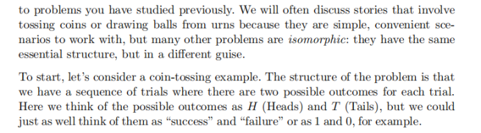

# chapter 3 





随机变量及其分布（第一部分）
==============

——为什么要把“事件”变成“数值函数”？

* * *

一、内容概况
------

本节摘自教材第 3 章的开篇与 3.1 小节，核心目标是**引入随机变量 (random variable, r.v.) 的概念**。作者先指出仅靠“事件”符号表达复杂数量关系会变得十分笨拙，然后通过赌博破产（gambler’s ruin）与抛硬币两个熟悉的例子说明：

1.  **随机变量让我们可以用简洁的数值符号来刻画**诸如资产、差额、持续时长等随机量；
    
2.  **随机变量本质上是一个函数**：它把样本空间  $S$  中的每一个基本结果  $s$  映射到实数轴  $\mathbb{R}$  上的一个确定值  $X(s)$ 。
    
3.  随机性来自实验本身，而映射  $X$  **本身是确定的**。
    

* * *

二、逐点深度解析
--------

### 1\. 为何“事件记号”不够用？——以赌博破产问题为例

*   **背景回顾**：第 2 章讲了两个赌徒  $A$  与  $B$  抢钱游戏，若用事件  $A_{j,k}$  表示“第  $k$  轮后  $A$  拥有  $j$  元”， $B_{j,k}$  类似，则：
    
    *   想表达“**两人财富差**”或“**游戏持续的轮数**”时，需要把这些事件做联合、并、差集运算，十分冗长。
        
    *   如果再想把赌徒  $A$  的美元资产换算成当时的欧元资产， $\text{美元资产}\times\text{汇率}$  本质上是“数字×数字”，但事件集合无法直接相乘。
    
*   **随机变量化简思路**
    
    *   令 ** $X_k$ ** = 第  $k$  轮后  $A$  的财富；
        
    *   ** $Y_k=N-X_k$ ** =  $B$  的财富（其中  $N$  是固定总财富）；
        
    *   ** $Z_k=X_k-Y_k=2X_k-N$ ** = 财富差；
        
    *   ** $c_kX_k$ ** = 以当轮汇率  $c_k$  折算的欧元财富；
        
    *   ** $R=\min\{n:X_n=0\text{ 或 }Y_n=0\}$ ** = 游戏持续轮数。
        
    
    如此，所有关心的量都变成了整洁的 **数字序列**，省却事件符号的嵌套与繁琐并集。
    

### 2\. “随机变量”的精确定义

> **定义 3.1.1**  
> 给定样本空间  $S$ ，随机变量  $X$  是从  $S$  到实数集  $\mathbb{R}$  的**函数**：
> 
> $$
> X:\;S\longrightarrow\mathbb{R},\quad s\mapsto X(s).
> $$

*   **为什么要强调“函数”而不是“变量”**
    
    *   常见口语说法“随机变量会随机取值”只指出了现象，却没说**随机性来源于哪里**。
        
    *   从数学上讲：
        
        1.  **随机性**——因为实验每次选到的基本结果  $s$  随机；
            
        2.  **确定性**——一旦给定结果  $s$ ，映射  $X(s)$  的输出是唯一且确定的。
    
*   **图 3.1 的要点**
    
    *   样本空间示例：6 颗标有不同概率的小石子；
        
    *   箭头代表映射  $X$ ：把石子映到数轴的 0、1、4 三个可能值；
        
    *   **“随机”**的是**抽哪颗石子**；
        
    *   \*\*“变量”\*\*不是“会自己乱跳”，而是对每个石子写好一个确定数字标签。
        

### 3\. 把抽象模式映射到熟悉的“抛硬币”

*   许多概率问题彼此**同构（isomorphic）**：把元素名称换掉，本质结构不变。
    
*   **双结果序列**：
    
    *   抛硬币： $H$ (正)、 $T$ (反)；
        
    *   其它同构情形：成功 VS 失败，或直接记为 1 VS 0。
    
*   将每次试验结果映射为数字，使得后续可方便地统计“正面数量”“连续正面的最长长度”等**数值特征**。
    

### 4\. 抽象与具体之间来回切换的能力

*   学习随机变量的根本意义在于：
    
    1.  看到真实故事 → **抽象成样本空间 + 随机变量**；
        
    2.  利用数学工具（分布、期望、方差等）**推导性质**；
        
    3.  再把结果**翻译回原情境**解释。
    
*   这也是日后学统计建模、机器学习时必须掌握的思维习惯。
    

* * *

三、本节小结
------

1.  **随机变量 = 样本空间到实数的函数**，映射本身确定，随机性来自实验选到哪一元素。
    
2.  **引入随机变量的动机**：让复杂的“事件语言”化为简洁的“数字语言”，大幅减少符号操作成本。
    
3.  通过赌博破产与抛硬币案例，我们看到：
    
    *   使用随机变量可以轻松表达财富、差额、持续时间等多样量；
        
    *   **同构问题**可通过统一的数值表示获得共用的解决方案框架。
    
4.  掌握随机变量的概念，是后续讨论分布、期望、方差、极限定理等整个概率统计体系的**必备基石**。
    

* * *

（报错检查：截图文字与公式均清晰可辨，本次笔记已对所有出现的概念与示例做了逐段讲解；若后续章节还有图片，请继续发送。）


抛两次硬币：随机变量具体示例与“指示变量”
=====================

本节承接上一部分的定义，借由 **例 3.1.2** 与 **图 3.2** 展示如何在同一试验上构造多种随机变量，并强调随机变量作为“数值摘要”的优势。

* * *

一、总体内容概述
--------

*   **例 3.1.2**：对一次“抛两次公平硬币”的实验，分别构造
    
    1.  头数随机变量  $X$ 、
        
    2.  尾数随机变量  $Y$ 、
        
    3.  **指示随机变量**  $I$ （判断第一次抛掷是否为正面）。
    
*   通过数值编码  $(s_1,s_2)\in\{0,1\}^2$ （1 表示  $H$ ，0 表示  $T$ ），给出  $X,Y,I$  的显式公式。
    
*   **图 3.2**：展示“同一组鹅卵石（样本点）+ 不同数值标注”如何得到两个不同的随机变量；并再次阐明“随机”来自实验抽样，“变量”本身是确定函数的思想。
    

* * *

二、逐点深入解析
--------

### 1\. 样本空间与基本事件

实验：**两次抛一枚公平硬币**

$$
S=\{HH,\,HT,\,TH,\,TT\}
$$

其中

*    $H$  (Heads) = 正面
    
*    $T$  (Tails) = 反面


### 2\. 构造 3 种随机变量

| 随机变量 | 取值范围 | 口语解释 | 数学表示（对  $\omega\in S$ ） |
| --- | --- | --- | --- |
|  $X$  |  $\{0,1,2\}$  | 两次中出现的正面数 |  $X(HH)=2,\; X(HT)=X(TH)=1,\; X(TT)=0$  |
|  $Y$  |  $\{0,1,2\}$  | 两次中出现的反面数 | 用 **恒等式**  $Y=2-X$  描述，故  $Y(\omega)=2-X(\omega)$  |
|  $I$  |  $\{0,1\}$  | 指示第一次是否为正面 |  $I(HH)=I(HT)=1,\; I(TH)=I(TT)=0$  |

> **指示随机变量 (indicator r.v.)**
> 
> *   定义：用  $\{0,1\}$  表示某事件是否发生。
>     
> *   常记作  $\mathbf{1}_{\{\text{事件}\}}$ 。
>     
> *   在概率论与统计推导（如线性期望、方差分解、蒙特卡洛算法）中极为常用。
>     

* * *

### 3\. 将样本点编码为数值向量

令

$$
HH\!\to (1,1),\ HT\!\to (1,0),\ TH\!\to(0,1),\ TT\!\to(0,0),
$$

写成  $(s_1,s_2)$  形式后，可得更简洁的闭式：

| 随机变量 | 向量公式 |
| --- | --- |
|  $X$  |  $X(s_1,s_2)=s_1+s_2$  |
|  $Y$  |  $Y(s_1,s_2)=2-s_1-s_2$  |
|  $I$  |  $I(s_1,s_2)=s_1$  |

> **启示**：当样本空间天然可表示为 0-1 组合时，随机变量常常是对分量的线性或非线性组合。
> 
> *   在 **二项分布**、**多项分布**、**逻辑回归特征工程** 中频繁出现这样的“向量化”技巧。
>     

* * *

### 4\. 图 3.2：同一试验，不同随机变量

*   左、右两幅石子图使用**同一组样本点  $s_1,\dots,s_6$ **，但每块石子上的数字不同 ⇒ 对应 **两个随机变量**。
    
*   说明**随机性来源**：在执行实验之前，哪块石子会被选中（由概率函数  $P$  决定）是未知的；一旦  $s$  被抽到，随机变量  $X(s)$  的值随之“凝固”。
    

#### 4.1 数值摘要的优势

*   样本空间可能是高维或非数值型（问卷答案、图像、文本）。
    
*   将结果压缩为 **一维或低维数字**，便于
    
    1.  **计算**（期望、方差、分布函数）
        
    2.  **可视化**（直方图、箱线图）
        
    3.  **建模**（线性模型、深度网络输入）
    
*   换言之，随机变量是一种“信息提炼器”，在不过度丢失关键信息的前提下消解掉样本空间的复杂度。
    

* * *

三、本节小结
------

1.  **随机变量的多样性**：即便在极简单的抛硬币实验中，也能构造出计数型、差值型、指示型等多种随机变量。
    
2.  **函数视角再强化**： $X,Y,I$  都是把  $\omega\in S$  映到实数的确定映射；实验未进行前  $\omega$  未定，故  $X(\omega)$  未知。
    
3.  **指示随机变量** 是概率论的“最小单位”，后续推导中常用它们组合逼近复杂事件。
    
4.  **图 3.2** 形象化地说明：**相同的随机试验**可以用 **不同随机变量**提取不同侧面特征。
    
5.  掌握这些基本例子，将为之后学习 **分布函数、离散∕连续型随机变量、期望与方差** 奠定直观基础。
    

* * *

**报错检查**：所有截图文字和公式均清晰，已完整覆盖示例与图解要点；若有下一批图片，请继续发送。


**离散随机变量的分布与概率质量函数（PMF）**
=========================

——3.2 节完整笔记与深入解析

* * *

一、内容总览
------

本节正式引入**随机变量的分布**这一核心概念，并聚焦于**离散随机变量 (discrete r.v.)**。在之后的章节中才会讨论连续型，因而本节奠定了理解 **PMF（概率质量函数）** 的全部基础。主要知识点如下：

| 序号 | 主题 | 关键词 |
| --- | --- | --- |
| 1 | 离散/连续随机变量的区分 | support（取值支撑集） |
| 2 | 分布的意义 | 事件概率、区间概率 |
| 3 | **定义**：离散随机变量 | 有限/可数可列取值集 |
| 4 | **定义**：PMF  $p_X(x)=P(X=x)$  | 0-1 事件转化 |
| 5 | 符号说明 ✤3.2.3 | “ $X=x$ ” 其实是事件  $\{s:X(s)=x\}$  |
| 6 | 例 3.2.4：继续抛两次硬币 |  $X,Y,I$  三个 r.v. 的 PMF & 图形比较 |

* * *

二、概念与公式逐条解析
-----------

### 2.1 离散 vs. 连续随机变量

| 类型 | 取值形式 | 描述方式 | 本章重点 |
| --- | --- | --- | --- |
| **离散**  $X$  | 有限或可数无限的数集（常见为整数） | **PMF**  $p_X(x)=P(X=x)$  | **是** |
| **连续**  $X$  | 区间上的任意实数 | **PDF / CDF**（下章细讲） | 否（第 5 章） |

*   **支撑集 (support)**： $\{x: P(X=x)>0\}$ 。离散 r.v. 的支撑通常是一堆独立点。
    
*   实际应用中，“混合型”随机变量也存在（抛硬币决定再抽连续量），但第一要务是理解纯离散/连续。
    

### 2.2 为什么需要“分布”

> 分布告诉我们“随机变量落在哪些值/区间的概率是多少”。  
> **常见提问**：

1.   $L$  = 毕业生终身收入，问  $P(L>1\text{ million})$ ？
    
2.   $M$  = 5 年内加州重大地震数，问  $P(M=0)$ ？  
    这些问题都必须先知道  $L,M$  的概率分布，才能回答。
    

### 2.3 **定义 3.2.1**：离散随机变量

若存在有限或可数无限序列  $\{a_j\}$  使

$$
P\bigl(X=a_j\ \text{for some }j\bigr)=1,
$$

则  $X$  为离散型。

> **注意**：
> 
> *   “可数无限”= 与自然数一一对应；
>     
> *   如果随机变量可落在无穷不可数点集（例如一个区间），它就不是离散的。
>     

### 2.4 **定义 3.2.2**：概率质量函数 (PMF)

$$
\boxed{p_X(x)=P(X=x)} 
$$

若  $x$  在支撑内， $p_X(x)>0$ ；否则  $p_X(x)=0$ 。

*   **性质**
    
    1.  非负： $p_X(x)\ge 0$ 。
        
    2.  总和为 1： $\sum_{x\in\text{support}}p_X(x)=1$ 。
    
*   **解读“ $X=x$ ”**：它是一个**事件**，即  $\{s\in S: X(s)=x\}$ 。见 ✤3.2.3。
    

### 2.5 ✤3.2.3 事件视角的符号解剖

*   写  $P(X=x)$  实际是对 **事件  $\{X=x\}$ ** 求概率。
    
*   若随机变量  $X$  抛硬币示例中代表“正面数”，则  $X=1$  对应样本结果集合  $\{HT,TH\}$ ，这是 **样本空间的子集**，当然可以有概率。
    
*   **警示**：
    
    *   不要把  $P(X)$  当成有意义的表达；必须是事件或事件组合才可谈概率。
        

* * *

三、例 3.2.4：继续抛两次硬币 —— 计算 PMF
---------------------------

### 3.1 回顾三随机变量

*    $X$ ：正面数；
    
*    $Y=2-X$ ：反面数；
    
*    $I$ ：第一次是否为正面（指示变量）。


### 3.2 逐个求 PMF

1.  ** $X$ **
    
    $$
    p_X(0)=P(TT)=\tfrac14,\quad p_X(1)=P(HT\text{ or }TH)=\tfrac12,\quad p_X(2)=P(HH)=\tfrac14.
    $$
    
    其余  $x$  值概率为 0。
    
2.  ** $Y$ **（利用  $Y=2-X$ ）
    
    $$
    p_Y(y)=p_X(2-y), \quad y=0,1,2.
    $$
    
    实际上数值与  $p_X$  完全一致（但它们是两个不同函数！）。
    
3.  ** $I$ **（指示第一次是  $H$ ）
    
    $$
    p_I(0)=P(TH\text{ or }TT)=\tfrac12,\quad p_I(1)=P(HH\text{ or }HT)=\tfrac12.
    $$
    

### 3.3 视觉比较（图 3.3）

*   书中画柱状“棒棒糖”图：
    
    *   横轴 = 随机变量可能值；
        
    *   纵轴 = PMF 值。
    
*   特点：
    
    *   **离散 PMF** ⇒ 用竖线（而非连续曲线）；
        
    *   易于看出  $X$  与  $Y$  样式相同但横轴标记不同。
        

* * *

四、要点归纳与提示
---------

1.  **离散支撑集**：只要支撑是点集且可数，即可用 PMF 描述。
    
2.  **PMF vs. PDF**：PMF 是概率本身，PDF 是密度，需要积分才得概率。
    
3.  **事件化思想**：
    
    *   写  $P(X=x)$  时要默念“这其实是事件  $\{s:X(s)=x\}$  的概率”。
        
    *   对于 **连续型 r.v.** 将来我们会写  $f_X(x)$ ，此时  $P(X=x)=0$ ，概念区别需牢记。
    
4.  **指示变量的应用**：
    
    *   未来在期望/方差、伯努利过程、蒙特卡洛估计中经常把复杂事件拆为若干指示变量求和。
    
5.  **同 PMF 不同 r.v.**： $X$  与  $Y$  PMF 相同但表示意义迥异，说明\*\*“分布相同”≠“变量相同”\*\*。
    

* * *

五、本节自检问题
--------

1.  **什么条件下随机变量离散？**
    
2.  **PMF 的两条基本性质？**
    
3.  **为什么  $P(X)$  写法错误？如何修正？**
    
4.  如果抛 3 次硬币，正面数  $X$  的支撑集与 PMF 是什么？
    
5.  令  $J$  = “恰好一次正面”这一事件的指示变量，写出  $J$  的 PMF。
    

试着独立回答，有疑问随时回到笔记对照！

* * *

（报错确认：截图清晰，无缺失内容；已覆盖定义、例题、公式与图形说明。如有下一部分，请继续上传。）


例 3.2.5 两枚六面骰之和的概率质量函数
======================

——离散均匀分布、卷积思想与 “三角形” PMF

* * *

一、本节概要
------

*   **实验**：掷两枚完全相同、且各面概率均为  $1/6$  的公平六面骰。
    
*   **随机变量**
    
    *    $X$ ：第一枚骰子的点数
        
    *    $Y$ ：第二枚骰子的点数
        
    *    $T=X+Y$ ：两枚骰子点数之和（**总和随机变量**）
    
*   **目标**：
    
    1.  说明  $X$ 、 $Y$  各自服从 **离散均匀分布**  $ \mathrm{DU}\{1,\dots,6\}$ ；
        
    2.  证明  $X$  与  $Y$  拥有**相同分布但不是同一个随机变量**；
        
    3.  逐值推导  $T$  的 PMF，展示其**对称性与三角形形状**；
        
    4.  给出概率检验  $\sum_{t=2}^{12}P(T=t)=1$ 。
        

* * *

二、核心知识点逐条解析
-----------

### 2.1 样本空间与基本结果

$$
S=\{(1,1),(1,2),\dots,(6,6)\},\quad |S|=36.
$$

每个元素  $(x,y)$  表示“第一枚掷出  $x$  点、第二枚掷出  $y$  点”，所有 36 种结果**等可能**，概率  $\frac{1}{36}$ 。

### 2.2 单个骰子点数  $X$ 、 $Y$  的分布

$$
P(X=j)=\frac16,\quad j=1,\dots,6.
$$

这就是 **Discrete Uniform**（离散均匀分布）。

*   **同分布不同随机变量**
    
    *   虽然  $X$  与  $Y$  的 PMF 完全相同，二者却映射到**样本空间的不同坐标**；一次实验中， $X=Y$  的概率为  $\tfrac{6}{36}=\tfrac16$ （只有  $(1,1),\dots,(6,6)$  六种对角情形）。
        
    *   拓展：骰子两面数字作镜像变换  $7-X$ 、 $7-Y$  也服从离散均匀分布，但依旧是新的随机变量。
        

### 2.3 求和随机变量  $T=X+Y$  的 PMF

> **朴素计数法**（直接列举等可能结果）：

|  $t$  | 可行组合数  $\#\{(x,y):x+y=t\}$  | 概率  $P(T=t)=\dfrac{\text{组合数}}{36}$  |
| --- | --- | --- |
| 2 & 1 &  $\frac{1}{36}$  |  |  |
| 3 & 2 &  $\frac{2}{36}$  |  |  |
| 4 & 3 &  $\frac{3}{36}$  |  |  |
| 5 & 4 &  $\frac{4}{36}$  |  |  |
| 6 & 5 &  $\frac{5}{36}$  |  |  |
| 7 & 6 &  $\frac{6}{36}$  |  |  |
| 8 & 5 &  $\frac{5}{36}$  |  |  |
| 9 & 4 &  $\frac{4}{36}$  |  |  |
| 10 & 3 &  $\frac{3}{36}$  |  |  |
| 11 & 2 &  $\frac{2}{36}$  |  |  |
| 12 & 1 &  $\frac{1}{36}$  |  |  |

*   **支撑集**： $\{2,3,\dots,12\}$ 。
    
*   **检验**：
    
    $$
    \sum_{t=2}^{12}P(T=t)=\frac{1+2+3+4+5+6+5+4+3+2+1}{36}=\frac{36}{36}=1.
    $$
    

### 2.4 对称性与 “三角形” 形状

*   **对称公式**
    
    $$
    P(T=t)=P\!\bigl(T=14-t\bigr),\quad t=2,\dots,12.
    $$
    *   原因：若  $(x,y)$  使  $T=t$ ，则  $(7-x,7-y)$  也在样本空间且  $ (7-x)+(7-y)=14-t$ ，两结果等概率。
    
*   **图 3.4** 可视化
    
    *   直立棒棒糖图形呈**等腰三角形**，顶点在  $t=7$  处达最大概率  $6/36$ 。
        
    *   右侧与左侧镜像，对称轴  $t=7$ 。
        

### 2.5 卷积视角（补充理解）

*   若把点数转化为 PMF 向量  $\mathbf{p}=(1/6,\dots,1/6)$ ，则总和  $T$  的 PMF 是  $\mathbf{p}$  与自身的**离散卷积**：
    
    $$
    p_T(t)=\sum_{j=1}^{6}p_X(j)\,p_Y(t-j),
    $$
    
    对称性与三角形形状正来源于卷积后系数随移位递增再递减。
    
*   该方法适用于 **更多骰子**（或任何独立同分布离散随机变量的求和）；结果会渐趋**近似正态**，即经典的中心极限定理预兆。
    

* * *

三、扩展与练习
-------

1.  **更多骰子**：三枚公平骰总和支撑为  $\{3,\dots,18\}$ 。请写出其 PMF 并验证概率和为 1（提示：使用卷积或“Stars & Bars” 计数）。
    
2.  **偏骰子**：若每一面点数概率不再均等，如何计算  $T$  的 PMF？（提示：仍可用卷积，但卷积核不再均匀。）
    
3.  **条件概率**：已知  $T=7$ ，求  $X=3$  的条件概率。
    
4.  **随机变量相等**：给出例子说明“同分布”但“几乎处处不相等”的随机变量（除了  $X,Y$  对角线外互不相等）。
    

* * *

四、本节小结
------

*   **离散均匀分布** 是骰子点数最直接的模型。
    
*   **求和随机变量** 的 PMF 可通过“计数 ÷ 样本量”或更通用的卷积计算。
    
*   **对称性** 与 **三角形形状** 源自两骰等可能与点数配对规律。
    
*   熟练掌握这一例子，能帮助理解：
    
    1.  **卷积** 与 **分布加法规则**；
        
    2.  **支撑、PMF、分布** 等基本概念；
        
    3.  多维随机变量（ $(X,Y)$ ）到一维函数  $T(X,Y)$  的映射思想。
        

* * *

**报错/缺漏检查**：图片中的表格、公式与图像均已覆盖。若后续章节或其它示例需要讲解，请继续上传。


离散随机变量的 PMF：性质、实例与区间概率
======================

——3.2.6 ~ 3.2.8 及定理 3.2.7 详解

* * *

一、内容概况
------

> **聚焦主题**
> 
> 1.  **实例 3.2.6**：美国住户的子女数量——如何用实际调查数据估计 PMF。
>     
> 2.  **定理 3.2.7**：**合法 PMF** 的两条充分必要条件（非负 & 求和为 1）。
>     
> 3.  **实例 3.2.8**：利用已知 PMF 计算随机变量落入某区间的概率（回到两枚骰子之和  $T$ ）。
>     
> 4.  补充：PMF 与分布函数的“一一对应”思想。
>     

* * *

二、逐点深度解析
--------

### 2.1 例 3.2.6——**住户子女数** 的 PMF

*   **实验**：随机抽取美国任一住户；令随机变量
    
    $$
    X=\text{该住户的孩子数量}\quad (X\in\mathbb{Z}_{\ge 0}).
    $$
    
*   **离散性**： $X$  只能取整数，故为离散随机变量。
    
*   **概率近似**：依据 2010 年 **General Social Survey (GSS)** 数据，统计各住户中  $x=0,1,2,\dots$  子女所占比例，作为  $P(X=x)$  的估计。
    
*   **图 3.5**：
    
    *   横轴  $x$ \=0,1,2,\\dots,8 (8) 以上稀少，可合并为“8+”)；
        
    *   纵轴为估计 PMF；
        
    *   呈现典型的“右偏分布”：无子女、1‒2 个子女概率最高，随后快速衰减。
        

> **启示**
> 
> *   PMF 完全可由**经验频率**估计；
>     
> *   不同社会群体（城市/农村、年份、经济状况）会导致 PMF 形状差异。
>     

* * *

### 2.2 定理 3.2.7——**合法 PMF 的判定准则**

设离散随机变量  $X$  的支撑  $\{x_1,x_2,\dots\}$ （可有限或可数无限）已给出，则函数  $p_X(x)$  是**合法 PMF** 的充要条件：

1.  **非负性**
    
    $$
    p_X(x)\ge 0,\quad \text{且 }p_X(x)>0\text{ 当且仅当 }x=x_j\text{ 对某 }j.
    $$
    
2.  **归一化（总和为 1）**
    
    $$
    \sum_{j=1}^{\infty}p_X(x_j)=1.
    $$
    

> **证明要点**
> 
> *   非负：概率本身定义即不可能为负。
>     
> *   求和为 1：
>     
>     $$
>     \sum_{j}P(X=x_j)=P\Bigl(\bigcup_j\{X=x_j\}\Bigr)=P(\Omega)=1,
>     $$
>     
>     因  $\{X=x_j\}$  两两互斥且必覆盖样本空间。
>     
> *   **逆向**：若给定某函数满足上述两条，就能在抽象层面构造出一个随机试验，使其 PMF 正好等于该函数（见第 5 章“从分布构造随机变量”）。
>     

* * *

### 2.3 例 3.2.8——用 PMF 计算区间概率

> **情境回顾**
> 
> *   随机变量  $T=X+Y$ （两枚骰子之和）已求得 PMF：
>     
>     $$
>     P(T=2)=P(T=12)=\tfrac1{36},\; P(T=3)=P(T=11)=\tfrac2{36},\dots
>     $$
>     

> **问题**
> 
> $$
> P\bigl(1\le T\le 4\bigr)=?
> $$
> 
> **步骤**
> 
> 1.  找到区间  $[1,4]$  内的所有支撑点： $2,3,4$ 。
>     
> 2.  “柱状相加”——将对应的 PMF 高度相加：
>     
>     $$
>     P(T=2)+P(T=3)+P(T=4) =\frac1{36}+\frac2{36}+\frac3{36}=\frac6{36}.
>     $$
>     

> **一般原则**
> 
> *   给定离散 r.v.  $X$ ，要算  $P(X\in B)$ （ $B$  为某实数集合或区间），只需**枚举  $B$  内的支撑点**并求和。
>     
> *   因此 **“知道 PMF ⇔ 知道全部分布信息”**：任何事件  $\{X\in B\}$  的概率都可由 PMF 导出。
>     

* * *

三、连接前后文 & 关键思维
--------------

| 知识点 | 前后关联 | 实际价值 |
| --- | --- | --- |
| 支撑 (support) | 只包含概率 >0 的点；求和检验依赖支撑 | 决定了求和范围，影响计算效率 |
| 非负 & 总和为 1 | PMF 必须满足 | 开发随机数生成 & 模型校验时的**合法性检查** |
| 实例化 PMF | 硬币/骰子 → 理论 PMF；调查/抽样 → 经验 PMF | 统计推断、贝叶斯建模需要先估计 PMF |
| 区间概率 | 离散：直接求和；连续：需积分（第 5 章） | 蒙特卡洛 & 置信区间计算基础 |

* * *

四、本节小结
------

1.  **例 3.2.6** 说明了如何把**人口调查数据**转为离散 PMF，并展示现实分布往往偏斜。
    
2.  **定理 3.2.7** 给出了验证/构造 PMF 的**必要且充分条件**。
    
3.  **例 3.2.8** 演示了一个至关重要的技巧：
    
    *   **离散概率 = “柱子相加”**；
        
    *   该方法将在后续“期望”“方差”乃至“离散卷积”中不断出现。
    
4.  当你掌握了 PMF，你就**完全掌握了离散随机变量的分布**——任何事件概率均由 PMF 决定。
    

* * *

### ✎ 思考练习

1.  设  $X$  的支撑为  $\{0,1,2,\dots\}$ ，若给定
    
    $$
    p_X(x)=\frac{1}{2^{x+1}},\quad x=0,1,2,\dots
    $$
    
    证明它满足定理 3.2.7 并画出前 6 个点的“棒棒糖图”。
    
2.  随机抽取一家中国住户，设子女数随机变量  $Y$ 。查找最近一次人口普查数据，估计  $Y$  的 PMF，并与美国数据做比较：哪个国家 **0 子女比例**更高？
    
3.  若骰子变为**八面骰**，总点数  $T_8=X+Y$  的 PMF 是否仍呈对称三角形？请给出理由或反例。
    

有疑问或需要更多练习，可随时告诉我！


伯努利分布与二项分布
==========

——3.3 节完整笔记：从“单次成功/失败”到“ n 次成功计数”

* * *

一、概况
----

本节引入两种最常用的命名离散分布：

| 分布 | 记号 | 参数 | 典型故事 |
| --- | --- | --- | --- |
| **伯努利 (Bernoulli)** |  $X\sim\text{Bern}(p)$  |  $p=P(X=1)$  | 单次试验成败 |
| **二项 (Binomial)** |  $X\sim\text{Bin}(n,p)$  |  $n$ ：独立重复次数  
 $p$ ：每次成功概率 |  $n$  次伯努利试验成功总数 |

核心思路：先把**一次试验**的结果编码成 0/1（伯努利），再将 **n 次独立重复** 的总成功数视作计数（⟹ 二项）。伯努利可看作二项在  $n=1$  的特例。

* * *

二、逐段深入解析
--------

### 2.1 Definition 3.3.1 — **伯努利分布**

*   若随机变量  $X$  只取 0、1，且
    
    $$
    P(X=1)=p,\qquad P(X=0)=1-p\;(0<p<1),
    $$
    
    则称  $X\sim\text{Bern}(p)$ 。
    
*   **参数  $p$ ** 决定哪一个具体的伯努利族成员；写“ $X$  是 Bernoulli”必须附带参数。
    
*   **指示变量自然伯努利**：若事件  $A$  发生记作 1，未发生记作 0，则
    
    $$
    I_A\sim\text{Bern}\bigl(P(A)\bigr).
    $$
    

### 2.2 Definition 3.3.2 — **指示随机变量  $I_A$ **

*   定义：
    
    $$
    I_A=\begin{cases}1,&A\text{ 发生}\\0,&A\text{ 不发生}\end{cases}
    $$
    
*   用途：简化事件运算、期望/方差推导、蒙特卡洛估计。
    

### 2.3 Story 3.3.3 — **伯努利试验**

*   单次实验仅有“成功/失败”两种互斥结果。
    
*   伯努利随机变量  $X$  = “成功” 的指示量。
    
*   因此  $p$  常称**成功概率**。
    

### 2.4 Story 3.3.4 — **二项分布的故事版定义**

*   进行 ** $n$  次独立伯努利试验**（每次成功概率同为  $p$ ），令
    
    $$
    X=\text{成功次数},
    $$
    
    则称  $X\sim\text{Bin}(n,p)$ 。
    

### 2.5 Theorem 3.3.5 — **二项分布 PMF**

> 若  $X\sim\text{Bin}(n,p)$ ，则
> 
> $$
> P(X=k)=\binom{n}{k}p^{\,k}(1-p)^{n-k},\qquad k=0,1,\dots,n.
> $$

*   **推导思路**
    
    1.  固定  $k$  个位置成功，概率  $p^k(1-p)^{n-k}$ 。
        
    2.  选取成功位置的组合数  $\binom{n}{k}$ 。
        
    3.  总概率 = 二者乘积。
    
*   **合法性**：非负且 by binomial theorem  $\sum_{k=0}^n\binom nk p^k(1-p)^{n-k}=1$ 。
    

#### ✤ 3.3.6 — 支撑与“隐式为 0”

*   凡未写出的点  $x\notin\{0,\dots,n\}$ ，默认  $P(X=x)=0$ 。
    
*   **支撑 (support)** = 概率正的取值集合。
    

### 2.6 图 3.6 — **PMF 形状随  $n,p$  变化**

| 图 | 形态 | 观察 |
| --- | --- | --- |
| Bin(10, ½) | 对称钟形，中心  $k=5$  |  $p=½$  时分布关于  $n/2$  对称 |
| Bin(10, ⅛) | 左峰右尾（右偏） | 成功概率低 ⇒ 大多数次数很小 |
| Bin(100, 0.03) | 极度偏态 | 展示只截取 0–10，因为更大 k 概率近零 |
| Bin(9, 4/5) | 右峰左尾（左偏） |  $p$  高 ⇒ 高 k 概率集中 |

### 2.7 Theorem 3.3.7 — **失败次数亦二项，自带“互补”参数**

*   设  $X\sim\text{Bin}(n,p)$ ，取  $q=1-p$ 。
    
*   定义  $Y=n-X$  = 失败次数。则
    
    $$
    Y\sim\text{Bin}(n,q).
    $$
    
*   **证明**：互换成功/失败；或直接将  $Y=n-X$  代入 PMF。
    

#### Corollary 3.3.8 — **对称性条件**

*   若  $p=½$  且  $n$  为偶数，则
    
    $$
    P\!\bigl(X=n/2+j\bigr)=P\!\bigl(X=n/2-j\bigr),\quad j=0,1,\dots
    $$
    
*   对应图 3.6 中 Bin(10, ½) 的对称柱状图。
    

### 2.8 Example 3.3.9 — **回到双硬币例**

*   之前得  $X$  = 正面数。现识别
    
    $$
    X,Y\sim\text{Bin}(2,\tfrac12),\quad I\sim\text{Bern}(\tfrac12).
    $$
    
*   与例 3.1.2、定理 3.3.7、推论 3.3.8 完全一致，解释了对称性与同分布现象。
    

* * *

三、要点梳理
------

1.  **命名分布 = 故事 + 参数**：先记故事，再写  $\sim$  记号。
    
2.  **伯努利 → 二项**：将指示变量成功累计即得二项分布。
    
3.  **PMF 公式**  $\binom nk p^k(1-p)^{n-k}$  来自“组合 × 概率乘积”。
    
4.  **支撑** 决定求和范围；任何合法 PMF = 非负 + 求和 1。
    
5.  **互补对称**： $n-X$  把成功失败交换； $p=½$  时分布中心对称。
    
6.  **图像直观**： $p$  远离 ½ ⇒ 分布偏斜； $n$  越大柱子越集中呈正态趋向（中心极限定理前奏）。
    

* * *

四、本节小结
------

> **一句话**：伯努利描述“一次成败”，二项描述“多次成败计数”；二者同族，理解其故事、参数与 PMF，可在实际问题中迅速识别并套用，无需每次重新推导。

* * *

（报错：截图清晰，所有定义、定理、例题与图形均已讲解。若后续还有图片，请继续发送。）


超几何分布（Hypergeometric）
=====================

——有放回 vs. 无放回抽样的本质区别

* * *

一、内容概况
------

*   **场景**：一个装有  $w$  个白球、 $b$  个黑球的容器（“两类标签”），一次性 **不放回** 随机抽取  $n$  个球。
    
*   **随机变量**： $X=$  抽样中白球的个数。
    
*   **目标**：阐明
    
    1.  为什么若 **放回** 则  $X\sim\text{Bin}(n,\frac{w}{w+b})$ ；
        
    2.  为什么 **不放回** 时  $X$  遵循 **超几何分布**  $\text{HGeom}(w,b,n)$ ；
        
    3.  超几何 PMF 的组合数推导、支撑范围、与二项分布的关系。
        

* * *

二、逐点深入解析
--------

### 2.1 放回抽样 ⇒ 二项分布

*   每抽 1 球都是独立伯努利试验，成功概率  $p=\dfrac{w}{w+b}$ 。
    
*   抽  $n$  次后白球数  $X\sim\text{Bin}(n,p)$ 。
    

> **关键**：独立性源于“放回”保持总体组成不变。

### 2.2 无放回抽样 ⇒ 故事 3.4.1：**超几何分布**

> **Story 3.4.1**
> 
> *   总体中第一组标签：颜色（白 / 黑）
>     
> *   第二组标签：是否被抽中
>     
> *    $X$  统计的是“两标签都符合”（既白又被抽中）的元素数量
>     
> *   记作
>     
>     $$
>     X\sim\text{HGeom}(w,b,n).
>     $$
>     

### 2.3 图 3.7 直观演示

*   示例： $w=6,\ b=4,\ n=5$ 。
    
*   图中虚线表示已抽出 5 球，其中白球数  $X=3$ 。
    
*   **要点**：抽样过程一次完成，无回放，样本之间 **依赖**（第 1 次抽到白球会减少剩余白球基数）。
    

### 2.4 定理 3.4.2 —— **超几何 PMF**

$$
\boxed{P(X=k)=\dfrac{\binom wk\binom b{\,n-k\,}}{\binom{w+b}{n}}},\qquad 0\le k\le w,\; 0\le n-k\le b.
$$

#### 2.4.1 支撑条件

*   不可能抽到比库存还多的白球或黑球：
    
    $$
    k\le w,\quad n-k\le b\;( \Leftrightarrow k\ge n-b).
    $$
    

#### 2.4.2 组合数推导步骤

1.  **选白球**：从  $w$  个白球里挑  $k$  个 →  $\binom wk$  种。
    
2.  **选黑球**：从  $b$  个黑球里挑  $n-k$  个 →  $\binom b{n-k}$  种。
    
3.  **总样本数**： $\binom{w+b}{n}$ （从  $w+b$  球选  $n$  个，不区分顺序）。
    
4.  各样本等可能 ⇒ 概率 = “符合方案数 ÷ 总方案数”。
    

#### 2.4.3 合法性检验

*   由 **范德蒙恒等式**（Vandermonde’s identity）
    
    $$
    \sum_{k}\binom wk\binom b{n-k}=\binom{w+b}{n},
    $$
    
    可知  $\sum_k P(X=k)=1$ 。
    
*   非负性显然。
    

### 2.5 与二项分布的比较

|  | **二项 Bin** | **超几何 HGeom** |
| --- | --- | --- |
| **抽样方式** | 独立有放回 | 依赖无放回 |
| **参数** |  $n,p$  |  $w,b,n$  |
| **方差** |  $np(1-p)$  |  $np(1-p)\dfrac{w+b-n}{w+b-1}$  (含 **有限总体修正系数**  $<1$ ) |
| **近似关系** | 当总体极大、 $n\ll w+b$  时，HGeom ≈ Bin $(n,\frac{w}{w+b})$  | —— |

> **直观差异**：无放回会逐渐“耗尽”白球，导致抽样之间负相关，方差被压缩。

### 2.6 超几何分布的通用“标签”视角

*   在很多非“球-盒”问题中，只要总体元素可按**两种属性**分类（如 “缺陷 / 良品” + “是否检验”），且样本 **等容量随机抽取**，就落入超几何框架。
    
*   记忆技巧：**Hyper-** = “跨种类联合计数”；二项只看一次独立试验。
    

* * *

三、常用性质（补充）
----------

| 性质 | 公式 |
| --- | --- |
| **期望** |  $E[X]=n\cdot\dfrac{w}{w+b}$  |
| **方差** |  $ \mathrm{Var}(X)=n\cdot\dfrac{w}{w+b}\left(1-\dfrac{w}{w+b}\right)\dfrac{w+b-n}{w+b-1}$  |
| **对称性** | 如果把“白球”↔“黑球”交换，则  $ X' = n-X \sim \text{HGeom}(b,w,n)$ 。 |

* * *

四、本节小结
------

1.  **故事记忆**：二项 = 放回独立，超几何 = 无放回依赖。
    
2.  **PMF** 的核心是“从两堆中各自挑球再除以总挑法”。
    
3.  **有限总体修正系数** 解释了无放回方差更小的原因。
    
4.  当总体巨大、样本相对小，超几何可安全近似二项——工程与统计抽样中常用简化。
    

* * *

（报错检查：截图文字与示意图均清晰，本笔记已覆盖定义、PMF 推导、适用条件及对二项分布的比较。如需继续第 3.5 小节，请继续上传图片。）


超几何分布的现实场景、对称性质与与二项分布的对比
========================

——3.4.3 – 3.4.6 节完整笔记

* * *

一、内容概况
------

本组截图围绕超几何分布的**三大主题**展开：

1.  **实际案例解析**
    
    *   **例 3.4.3** — 野生动物“捕–标记–再捕获”估计。
        
    *   **例 3.4.4** — 扑克牌五张手牌中 A 的数量。
    
2.  **两类标签的统一抽象**
    
    *   通过一个对照表说明：看似不同的问题，其实都和“两个集合标签交集计数”同构。
    
3.  **对称性质与分布比较**
    
    *   **定理 3.4.5**： $\text{HGeom}(w,b,n)$  与  $\text{HGeom}(n,w+b-n,w)$  **同分布**。
        
    *   **✤ 3.4.6**：明确二项分布与超几何分布的关键差异——独立 vs. 依赖。
        

* * *

二、逐点深入解析
--------

### 2.1 例 3.4.3 — **麋鹿捕–标记–再捕获 (Elk capture–recapture)**

| 设定 | 超几何映射 |
| --- | --- |
| 森林共有  $N$  头麋鹿 | 总球数  $w+b=N$  |
| 第一天捕获并标记  $m$  头 → 放回 |  $w=m$  （“白球” = 已标记） |
| 之后随机再捕  $n$  头 | 不放回抽样大小  $n$  |
| 随机变量  $X$ ：再捕样本中 **被标记**头数 |  $X\sim\text{HGeom}(m,\;N-m,\;n)$  |

> **直觉**：如果  $X$  的观测值显著偏小/偏大，可据此估计总体规模  $N$ 。这正是经典 **Lincoln–Petersen 估计** 的统计基础。

### 2.2 例 3.4.4 — **五张扑克牌中的 A 数量**

*   **牌堆**：52 张，4 张 A（白球），48 张非 A（黑球）。
    
*   **手牌**：一次性抽 5 张（无放回）。
    
*   随机变量  $X$ ：手牌中 A 的个数。
    
*    $X\sim\text{HGeom}(4,48,5)$ 。


$$
P(X=3)=\frac{\binom43\binom{48}{2}}{\binom{52}{5}}\approx0.0017.
$$

> **技巧**：任何“扑克牌/彩票选牌”类计数题，只要是“无放回 + 两类标签”，直接套用超几何即可。

### 2.3 “双标签”抽象表

| 故事 | **第一标签** | **第二标签** | 关注的交集 |
| --- | --- | --- | --- |
| 抽球 | 白 vs. 黑 | 被抽 vs. 未抽 | 白 ∧ 被抽 |
| 麋鹿 | 已标记 vs. 未标记 | 再捕 vs. 未再捕 | 已标记 ∧ 再捕 |
| 扑克牌 | A vs. 非 A | 在手牌 vs. 不在手牌 | A ∧ 在手牌 |

> **结论**：任何“总体元素 ×（类别标签 ✕ 抽样标签）”的**二维交集计数**，在“样本等可能”前提下都服从超几何。

### 2.4 定理 3.4.5 — **超几何分布的对称性**

$$
X\sim\text{HGeom}(w,b,n) \quad\Longrightarrow\quad Y\sim\text{HGeom}(n,\;w+b-n,\;w)\;\;\text{且}\;\;Y{\buildrel d\over=}X.
$$

*   **故事证明**
    
    *   将“颜色标签”与“抽样标签”互换：
        
        *   先把“被抽 vs. 未抽”当作第一标签；
            
        *   再把“白 vs. 黑”当作第二标签。
        
    *   两种计数本质上是同一组交集，只是互换了行列顺序 ⇒ 分布相同。
    
*   **代数检验**
    
    $$
    P(X=k)=\frac{\binom wk\binom b{\,n-k\,}}{\binom{w+b}{n}} ,\qquad P(Y=k)=\frac{\binom nk\binom{w+b-n}{\,w-k\,}}{\binom{w+b}{w}}
    $$
    
    两式通过阶乘化简可证相等——见截图公式。
    

> **实用意义**：若计算上  $w,b,n$  某个参数较大，可以用互换后的分布减少组合数规模。

### 2.5 ✤ 3.4.6 — **二项 vs. 超几何：别再混淆**

*   **共同点**
    
    *   都在  $\{0,1,\dots,n\}$  取值，可解释为“成功次数”。
    
*   **根本区别**
    

|  | 二项  $\text{Bin}(n,p)$  | 超几何  $\text{HGeom}(w,b,n)$  |
| --- | --- | --- |
| 试验之间 | **独立**（放回） | **依赖**（不放回） |
| 成功概率 | 固定  $p$  | 随抽样改变（负相关） |
| 方差 |  $np(1-p)$  |  $np(1-p)\dfrac{w+b-n}{w+b-1}$  —— **更小** |
| 近似关系 | — | 当  $w+b\gg n$  时 ≈ Bin $(n,\frac{w}{w+b})$  |

> **记忆**：二项 = “每次掷硬币” → 互不影响；超几何 = “抽签抽走” → 余下池子被改变。

* * *

三、小结
----

1.  **不同故事共用同一公式**：只要能把对象分成两类并一次性等可能抽样，直接套  $\text{HGeom}(w,b,n)$ 。
    
2.  **对称互换** 提供了化简与审题角度：颜色 ↔ 抽样身份互换，分布不变。
    
3.  **二项 vs. 超几何** 的判别关键：是否“放回”、试验是否独立。
    
4.  面对实际问题，应先识别标签与抽样机制，再从二项/超几何中择其一 —— 不走弯路、杜绝混淆。
    

* * *

四、报错检查
------

*   截图文字、公式与示例均清晰可辨；本笔记已对 **两则例题、对称定理、分布比较** 等所有段落逐一解析。若后续还有图片，请继续发送；如有未覆盖之处，欢迎指出！


离散均匀分布 DUnif 与「随机抽纸条」全流程解析
==========================

——3.5 节 Story 3.5.1 及 Example 3.5.2

* * *

一、内容概览
------

本节讨论最朴素却极重要的 **离散均匀分布 (Discrete Uniform, 记 DUnif)**，并通过「100 张号码纸条随机抽 5 张」的例题，比较 **放回抽样** 与 **不放回抽样** 两种情形，贯通前面已学的二项分布、超几何分布和独立性概念。

* * *

二、离散均匀分布 Story 3.5.1
--------------------

1.  **故事定义**
    
    *   给定一非空有限集合  $C$ （可看作若干互不相同的数字）。
        
    *   随机变量  $X$  = 从  $C$  中**等可能**地挑选出的一个元素。
        
    *   记作  $X\sim\text{DUnif}(C)$ 。
    
2.  **PMF 公式**
    
    $$
    P(X=x)=\frac1{|C|},\qquad x\in C;\quad P(X=x)=0,\; x\notin C.
    $$
    
3.  **事件概率化为计数**
    
    *   对任何子集  $A\subseteq C$ ，
        
        $$
        P(X\in A)=\frac{|A|}{|C|}.
        $$
        
    *   等价于《概率学 naive 定义》中“有利结果数 ÷ 全结果数”。
        

> **关键词**：等可能、计数、有限集合。只要题目中出现「随机打乱后随便抽一个编号/位置」，几乎都对应离散均匀模型。

* * *

三、例题 3.5.2——100 张纸条随机抽 5 张
--------------------------

### 3.1 题面摘要

*   帽子里有 **100 张纸条**，分别写 1 – 100 中的一个数字且无重复。
    
*   分两种抽样方案：
    
    1.  **有放回**：抽 5 次，每次抽出后放回重新混匀；
        
    2.  **无放回**：一次抽走 5 张，不放回。
    
*   问六个子问题 (a) – (f)，分别关注
    
    1.  抽到「≥80」的纸条数；
        
    2.  第  $j$  次/第  $j$  张抽到的号码分布；
        
    3.  抽到号码 100 至少一次的概率  
        在两种抽样方式下的差异。
        

* * *

### 3.2 有放回（独立伯努利模型）

| 子问题 | 思路 | 结论 |
| --- | --- | --- |
| **(a)** 抽到 ≥80 的纸条数 | 每次成功概率  $p=\tfrac{21}{100}=0.21$ ，5 次独立伯努利 ⇒ 二项分布 |  $X\sim\text{Bin}(5,0.21)$  |
| **(b)** 第  $j$  次抽到的号码 | 每次都是 1 – 100 等可能 ⇒ 离散均匀 |  $X_j\sim\text{DUnif}\{1,\dots,100\}$  |
| **(c)** 至少一次抽到 100 | 先算补事件「5 次都≠100」： $(99/100)^5$  |  $1-(99/100)^5\approx0.049$  |

> **知识点连接**
> 
> *   二项公式来源于「独立 + 固定成功率」。
>     
> *   (b) 用到离散均匀；(c) 体现了独立乘法原理。
>     

* * *

### 3.3 无放回（依赖抽样 → 超几何模型）

| 子问题 | 思路 | 结论 |
| --- | --- | --- |
| **(d)** 抽到 ≥80 的纸条数 | 总共 21 张符合条件，剩余 79 张不符合；一次性抽 5 张 ⇒ 超几何 |  $X\sim\text{HGeom}(21,79,5)$  |
| **(e)** 第  $j$  张抽到的号码 | 抽前没有次序偏好，**条件独立**虽消失，但无条件仍等可能 |  $Y_j\sim\text{DUnif}\{1,\dots,100\}$  |
| **(f)** 5 张里至少有一张 100 | 视作 5 个不相交事件  $Y_j=100$ ；每张抽到 100 概率 =  $1/100$  |  $5/100 = 0.05$  |

> **依赖性说明**
> 
> *   五张号码彼此相关（知其一则剩余选择数减少），因此  $Y_1,\dots,Y_5$  **不独立**；但对任一固定  $j$ ，其边际分布仍是离散均匀。
>     
> *   (f) 利用「事件互斥」直接相加；与 (c) 对比，可见无放回使抽到 100 概率略高。
>     

* * *

### 3.4 统一视角与技巧小结

| 概念 | 有放回 | 无放回 |
| --- | --- | --- |
| 模型 | 二项、离散均匀 | 超几何、离散均匀 |
| 依赖性 | 抽次之间独立 | 抽次之间依赖但边际均匀 |
| 计算策略 | 乘法原理 / 二项公式 | 组合计数 / 超几何公式 |
| 特殊概率 |  $1-(\tfrac{99}{100})^5$  |  $\tfrac{5}{100}$  |

*   **离散均匀作为“基元”**：无论放回与否，第  $j$  张单独看都是 DUnif。
    
*   **“大样本近似”**：若总体很大而  $n$  相对小，超几何近似二项（例子中 100 → 21 / 79 的比例使差异有限）。
    
*   **直觉检验**：不放回更易找到特定纸条，因为不会抽到同一张重复浪费机会；故 (f) > (c)。
    

* * *

四、小节
----

1.  **DUnif**：最纯粹的“等可能”分布，所有概率题的起点。
    
2.  **结合放回/不放回**：
    
    *   放回 ⇒ 独立 ⇒ **Binomial**；
        
    *   不放回 ⇒ 依赖 ⇒ **Hypergeometric**。
    
3.  例 3.5.2 通过 6 个具体问答让你练习怎样**先识别故事，再套用正确分布**，避免计算陷阱。
    
4.  进一步学习时，离散均匀还将作为**构造随机变量**与**蒙特卡洛采样基础**频繁出现。
    

* * *

（报错：截图内容已全部覆盖，若有遗漏或需要更深入的推导，请指出！）


累积分布函数（CDF）
===========

——离散 PMF 以外的第三种“全能”描述方式

* * *

一、总体概况
------

在 3.6 节中，教材把**累积分布函数 (cumulative distribution function, CDF)** 正式介绍为“描述随机变量分布的另一种函数”。区别于 **PMF 仅适用于离散型**、PDF 仅适用于连续型，**CDF 对所有随机变量都适用**，因此是最通用的分布刻画手段。

* * *

二、逐点深入解析
--------

### 2.1 定义 3.6.1 — CDF

$$
F_X(x)\;=\;P(X\le x),\qquad -\infty<x<\infty.
$$

*   若上下文唯一，也记作  $F(x)$ 。
    
*   **关键词**：“ $\le$ ” 而非 “ $<$ ”；这确保右极限连续性的自然出现。
    

### 2.2 例 3.6.2 — Binomial(4, ½) 的 PMF 与 CDF 转换

*   **PMF**：四枚硬币，成功概率  $p=½$ ，支撑  $\{0,1,2,3,4\}$ 。
    
*   **CDF 构造**：
    
    *   把 PMF 柱形图自左向右累加，高度累积即为 CDF 的**跳跃值**；
        
    *   每个跳点  $x=k$  处的跃高＝  $P(X=k)$ 。
    
*   **读图技巧**：
    
    *   PMF 柱  $P(X=2)$  的高度在 CDF 图中表现为  $x=2$  处的阶梯高度；
        
    *   CDF 左端开圆、右端实点，表示“右连续但有跳”。
        

### 2.3 从 PMF ↔ CDF 的两条捷径

| 方向 | 公式/步骤 | 解释 |
| --- | --- | --- |
| PMF → CDF | 对所有  $t\le x$  的  $P(X=t)$  求和 | 离散累加 |
| CDF → PMF |  $P(X=k)=F(k)-F(k^-)$ （跳高） | “前后极限差” |

### 2.4 定理 3.6.3 — **合法 CDF 的判定标准**

任何函数  $F$  若满足：

1.  **单调不减**： $x_1\le x_2\Rightarrow F(x_1)\le F(x_2)$ ；
    
2.  **右连续**： $F(a)=\displaystyle\lim_{x\to a^+}F(x)$ ；
    
3.  **极限**： $\displaystyle\lim_{x\to-\infty}F(x)=0,\quad\lim_{x\to\infty}F(x)=1$ ，  
    则  $F$  一定是某随机变量的 CDF；反之，任何 CDF 必满足这三条。
    

> **直观记忆**：
> 
> *   “单调”体现概率累加永不减少；
>     
> *   “右连续”避免跳点的“空洞”；
>     
> *   “0→1” 表示概率全覆盖。
>     

### 2.5 右连续性 & 跳跃

*   离散 r.v. 的 CDF = **阶梯函数**；每一步横平台长度对应“区间无概率”。
    
*   连续 r.v. 的 CDF “平滑”无跳（处处连续）。
    
*   混合型 r.v. 的 CDF 同时含平滑段与跳跃。
    

### 2.6 CDF 与 PMF/PDF/Story 的“三角关系”

| 形式 | 适用范围 | 信息量 | 何时更方便 |
| --- | --- | --- | --- |
| **Story** | 命名分布 / 实验过程 | 直觉、推理 | 证明对称性、构造 |
| **PMF / PDF** | 离散 / 连续 | 精确点概率 / 密度 | 代数运算、期望方差 |
| **CDF** | **全部** | 任意区间概率 | 计算  $P(a<X\le b)$ 、统一极限定理 |

> 图书最后一句强调：**三种方式等价**，但直觉证明常以 Story 为佳；离散计算常用 PMF；理论分析（例如收敛、极限分布）常靠 CDF。

* * *

三、要点小结
------

1.  **CDF 定义**： $F(x)=P(X\le x)$ ，对所有随机变量都合法。
    
2.  **离散阶梯**：跳高 = PMF；连续 CDF 无跳。
    
3.  **合法性三要素**：单调、右连续、极限 0/1。
    
4.  **转换**：离散情形 PMF ↔ CDF 随时互换；连续情形可对 CDF 求导得 PDF（第 5 章）。
    
5.  **场景选择**：
    
    *   算点概率 → PMF；
        
    *   算区间/尾部概率 → CDF；
        
    *   说明来源、做图、找对称 → 故事。
        

* * *

（报错检查：截图全部内容已覆盖，包括定义、例子、定理与末尾“story vs PMF vs CDF”段落；若下一节或图 3.9 需要解析，请继续发送。）


随机变量的函数
=======

——当 ** $g:\mathbb{R}\to\mathbb{R}$ ** 遇到随机变量  $X$ 

* * *

一、内容概况
------

*   **核心问题**：若  $X$  是随机变量、 $g$  是普通确定函数，则 ** $Y=g(X)$ ** 仍是随机变量吗？它的分布如何求？
    
*   **应用场景**：
    
    *   篮球系列赛记分： $g(X)=7-X$  得到另一队胜场数； $h(X)=\mathbf{1}_{\{X\ge4\}}$  判断 A 队是否晋级。
        
    *   数学运算： $X^2,\ e^{X},\ \sin X$  …
        
    *   数据变换：对数、平方根、阈值化。
        

* * *

二、逐点深入解析
--------

### 2.1 复习“随机变量 = 给每颗鹅卵石贴数字”

*   早前在图 **3.1 / 3.2** 中，我们把样本空间  $S$  的每个元素  $s$  映到数轴某点 ** $X(s)$ **。
    
*   **函数复合** 思想：再把实数轴上的这些数字输入到普通函数  $g$  里，得到
    
    $$
    g\bigl(X(s)\bigr),\quad s\in S.
    $$
    
    这就为每颗鹅卵石贴上了新的数字 ⇒ **新的随机变量**  $g(X)$ 。
    

### 2.2 定义 3.7.1 — 随机变量的函数

> 给定试验样本空间  $S$ ，随机变量  $X:S\to\mathbb{R}$ ，以及函数  $g:\mathbb{R}\to\mathbb{R}$ 。  
> 定义
> 
> $$
> g(X):\;s\mapsto g\!\bigl(X(s)\bigr),\qquad\forall s\in S.
> $$
> 
> 则 ** $g(X)$ ** 亦为随机变量。

*   **思考**：关键是复合后仍旧把 **每个  $s$ ** 唯一映到 **一个实数**。
    

### 2.3 图示直觉（Figure 3.9 & 3.10）

*   **图 3.9**：
    
    1.  左侧 6 颗鹅卵石 →  $X$  把它们映到数轴  $\{0,1,4\}$ ；
        
    2.  再用  $g(x)=\sqrt{x}$ （虚线曲线），把 0→0, 1→1, 4→2；
        
    3.  复合作用 = “先贴  $X$ ，再贴  $g$ ” ⇒ 产生  $g(X)$  取值  $\{0,1,2\}$ 。
    
*   **图 3.10**：直接在鹅卵石内写入  $g(X)$  的值，更直观地说明它已成为新随机变量。
    

### 2.4 如何从  $X$  的 PMF 求  $Y=g(X)$  的 PMF？

1.  **若  $g$  在支撑上一一对应**
    
    *   支撑  $\{x_1,\dots,x_n\}$  经  $g$  后变为  $\{y_1,\dots,y_n\}$ （各不相同）。
        
    *   直接映射：
        
        $$
        P(Y=y_i)=P(X=x_i),\quad i=1,\dots,n.
        $$
    
2.  **若  $g$  非一一对应（最常见）**
    
    *   同一点  $y$  可能由多个  $x$  对应，需**聚合同类项**：
        
        $$
        P(Y=y)=\sum_{x:\,g(x)=y} P(X=x).
        $$
        

> **公式记忆**：“先找原像，再累加概率”。

#### 例子： $g(x)=\sqrt{x}$ ， $X$  支撑  $\{0,1,4\}$ 

|  $x$  |  $P(X=x)$  (设) |  $g(x)=y$  | 汇总至  $P(Y=y)$  |
| --- | --- | --- | --- |
| 0 |  $p_0$  | 0 |  $P(Y=0)=p_0$  |
| 1 |  $p_1$  | 1 |  $P(Y=1)=p_1$  |
| 4 |  $p_4$  | 2 |  $P(Y=2)=p_4$  |

若某 y 对应多个 x（如  $g(x)=|x|$ ）就需要把多列概率相加。

* * *

三、实战示例：七场四胜制篮球赛
---------------

*    $X\sim\text{Bin}(7,½)$  = A 队胜场数。
    
*   **B 队胜场数**： $Y= g(X)=7-X$ 。
    
    *    $g$  一一对应 ⇒  $P(Y=y)=P(X=7-y)$ 。
    
*   **A 队是否晋级**： $H(X)=\mathbf{1}_{\{X\ge4\}}$ 。
    
    *   支撑  $\{0,1\}$ 。
        
    *    $P(H=1)=P(X\ge4)=\sum_{k=4}^{7}\binom7k 2^{-7}$ 。
    

* * *

四、要点归纳
------

1.  **函数复合** 保证  $g(X)$  必是随机变量。
    
2.  **求分布**：
    
    *   一一对应 ⇒ 直接改标签；
        
    *   多对一 ⇒ “把概率归并到同一桶”。
    
3.  **图像思维**：把两步映射画在数轴上，有助快速看出支撑与合并关系。
    
4.  **应用**：分段阈值、对数/幂变换、正负号、绝对值，乃至后续连续型变量的变换（Jacobian）都以此为本。
    

* * *

**报错检查**：截图中的所有段落、两个图 (3.9, 3.10)、Definition 3.7.1 均已解释。如需继续后续内容（如何处理非单射  $g$  的完整 PMF 推导、或 3.8 节随机变量独立性），请继续上传！


随机变量的函数（二）
==========

——从“一对一”到“多对一”，再到多随机变量函数

* * *

一、内容概览
------

本组截图覆盖了 **3.7.2–3.7.5**，重点讲述在不同情形下如何由已知随机变量  $X$ 、 $Y$  推导 ** $g(X)$ 、 $g(Y)$ ** 或 ** $g(X,Y)$ ** 的 PMF。核心要点：

| 段落 | 要学会的技术 |
| --- | --- |
| 表格示意 |  $g$  一对一 ⇒ 直接“改标签” |
| **例 3.7.2** | 把随机游走位置  $Y$  表示成 Binomial 的一对一函数 |
| **定理 3.7.3** | 非一对一时合并原像概率： $\displaystyle P(g(X)=y)=\sum_{x:g(x)=y}P(X=x)$  |
| **例 3.7.4** | 距离 (D= |
| **定义 3.7.5** | 推广到 **两个随机变量的函数**  $g(X,Y)$  |

* * *

二、逐点深度解析
--------

### 2.1 一对一情形的“改标签”法

*   表格示意：若  $g$  在  $X$  支撑上单射，则
    
    $$
    P(Y=g(X)=g(x_i))=P(X=x_i)=p_i.
    $$
    
*   **策略**：寻找一个已知分布的  $X$ ，用一对一函数  $g$  表出目标随机变量  $Y$ 。
    

* * *

### 2.2 例 3.7.2 ——**随机游走位置**

*   **模型**：粒子在数轴， $n$  步，每步向右(+1)或向左(–1)等概率。
    
*   **思路**：
    
    1.  向右步数  $X\sim\text{Bin}(n,\tfrac12)$ 。
        
    2.  位置  $Y= \underbrace{(+1)\times X}_{\text{右移}} + \underbrace{(-1)\times(n-X)}_{\text{左移}}\;=2X-n$ .
        
    3.   $g(x)=2x-n$  **单射**，故
         
        $$
        P(Y=k)=P\!\Bigl(X=\frac{n+k}{2}\Bigr)=\binom{n}{\frac{n+k}{2}}\Bigl(\tfrac12\Bigr)^{\!n},
        $$
        
        其中  $k\in\{-n,-n+2,\dots,n\}$ 。
        

> **技巧**：将新量表达为旧量的线性函数并检查是否一对一。

* * *

### 2.3 定理 3.7.3 ——**非一对一时的合并公式**

$$
\boxed{P\bigl(g(X)=y\bigr)=\sum_{x:\,g(x)=y}P(X=x)},\quad y\in\text{support}(g(X)).
$$

*   **解释**：对同一  $y$  可能有多个  $x$  使  $g(x)=y$ ，事件并列且互斥，故概率求和。
    

* * *

### 2.4 例 3.7.4 ——**到原点的距离  $D=|Y|$ **

*   仍用上一例的  $Y$ 。
    
*    $D=|Y|$  **非单射**： $|k|=|{-k}|$ 。
    
*   **利用对称性**  $P(Y=k)=P(Y=-k)$ ：
    
    *    $D=0$ ：只对应  $Y=0$ 。
        
    *    $D=k\,(\,k=2,4,\dots,n$ )：对应  $Y=k$  或  $Y=-k$ ，两者概率相加：
         
        $$
        P(D=k)=2\,P(Y=k)=2\binom{n}{\frac{n+k}{2}}\Bigl(\tfrac12\Bigr)^{\!n}.
        $$
        

* * *

### 2.5 定义 3.7.5 ——**两个随机变量的函数  $g(X,Y)$ **

> 若  $X,Y$  均定义在同一样本空间  $S$ ，则
> 
> $$
> g(X,Y):s\mapsto g\!\bigl(X(s),Y(s)\bigr)
> $$
> 
> 亦为随机变量。

*   **思路延伸**：
    
    *   可把样本空间扩充为足够大，使需要的所有随机变量都可在其上定义；
        
    *   例如同时考虑抛硬币  $X$  和掷骰子  $Y$ ，可用笛卡尔积  $S=\{H,T\}\times\{1,\dots,6\}$ 。
    
*   **实际应用**：
    
    *    $T=X+Y$ 、 $\max(X,Y)$ 、 $\min(X,Y)$ 、 $X/Y$  等组合随机变量的分布推导。
    

* * *

三、方法汇总
------

| 情景 | PMF 求法 |
| --- | --- |
|  $g$  单射 | **改标签**： $P(Y=y)=P(X=g^{-1}(y))$  |
|  $g$  多射 | **合并原像**：对所有  $x$  满足  $g(x)=y$  求和 |
| 多变量  $g(X,Y)$  | 建立 joint 支撑，列举/积分后合并 |

* * *

四、本节小结
------

1.  **函数随机变量仍是随机变量**——保证新变量映射每个样本点到单一实数。
    
2.  **找一对一映射最省事**：先识别熟悉分布，再用线性或单调函数转换。
    
3.  **定理 3.7.3 提供通解**：非单射时合并各原像概率。
    
4.  **多随机变量函数** 只需在 joint 空间上重复上述步骤；见后续章节将深入讨论联合分布与独立性。
    

* * *

（如需继续 3.8 独立性或更多示例，请继续上传！）


两枚骰子取最大值的分布 & “分类错误 / 同感魔法”
===========================

——3.7.6 例题与 3.7.7 概念全面笔记

* * *

一、本次内容概况
--------

1.  **例 3.7.6：max(X,Y)**
    
    *   通过  $6\times6$  网格和计数法求两枚公平六面骰最大点数的 PMF。
    
2.  **例 3.7.7：Category errors & sympathetic magic**
    
    *   解释常见的“对象类别混淆”错误，特别是把随机变量与其分布搞混。
        
    *   给出两个典型误用情境并澄清正确做法。
        

* * *

二、例 3.7.6 —— 两枚骰子最大值随机变量
------------------------

### 2.1 问题设定

*   抛两枚独立公平骰：
    
    *    $X$ \=第一枚点数， $Y$ \=第二枚点数。
    
*   定义随机变量
    
    $$
    M=\max(X,Y).
    $$
    
    目标：求  $M$  的 PMF。
    

### 2.2 网格计数法

|  $M$  值 | 满足  $\max(X,Y)=m$  的有序对数 | 概率  $P(M=m)$  |
| --- | --- | --- |
| 1 | 1 对 → (1,1) |  $1/36$  |
| 2 | 3 对 → (1,2),(2,1),(2,2) |  $3/36$  |
| 3 | 5 对 → (1,3),(2,3),(3,1),(3,2),(3,3) |  $5/36$  |
| 4 | 7 对 |  $7/36$  |
| 5 | 9 对 |  $9/36$  |
| 6 | 11 对 |  $11/36$  |

*   总和检验： $1+3+5+7+9+11=36$ 。
    

### 2.3 公式推导（另一视角）

$$
P(M\le m)=P(X\le m,\,Y\le m)=\bigl(\tfrac{m}{6}\bigr)^2
$$

对差分得

$$
P(M=m)=P(M\le m)-P(M\le m-1)=\frac{(2m-1)}{36},
$$

与上表一致（适用于  $m=1,\dots,6$ ）。

### 2.4 示例计算

$$
P(M=5)=P(X=5,\,Y\le4)+P(X\le4,\,Y=5)+P(X=5,Y=5) =\frac{2(4)+1}{36}= \frac{9}{36}.
$$

* * *

三、3.7.7 —— Category errors & “Sympathetic Magic”
------------------------------------------------

### 3.1 什么是 Category Error?

*   **概念**：回答问题时给出的对象类型与问题要求的类型根本不符。
    
*   例子：问“波士顿人口是多少？”回答“-42”或“粉红大象”——毫无意义的类别错配。
    

### 3.2 概念延伸：Sympathetic Magic

*   **定义**：把 _随机变量_ 与 _其分布_ 混为一谈，引发荒谬操作。
    
*   **比喻**：分布只是“蓝图”或“地图”，而随机变量是“真实房子 / 真实领土”。地图≠领土。
    

### 3.3 两个常见误用情境

| 误用 | 错误做法 | 正确思路 |
| --- | --- | --- |
| **(1) 直接把 PMF 乘常数**  
“已知  $X$  的 PMF，想要 2X 的 PMF，就把横坐标不变竖直拉伸两倍” | 把每个概率  $p_i$  乘 2 ⇒ 概率和 ≠ 1 | 2X 的 **取值** 是  $2x_i$ ，**概率** 仍是  $p_i$ 。PMF 发生水平平移/伸缩，而不是纵向缩放（见图 3.11 上下对比）。 |
| **(2) 认为同分布 ⇒ 两变量必相等** | 若  $X,Y$  都 ~Bern(½) 就断言  $P(X=Y)=1$  | 同分布≠同随机变量。抛硬币一次  $X$ \=头指标， $Y=1-X$ \=尾指标，分布相同但  $X=Y$  永不发生。另次抛得到  $Z$ ， $P(Z=X)=½$ 。 |

> **自检**：写概率符号时，先想清楚“我指的是事件、随机变量还是数字？”

* * *

四、本节小结
------

1.  **max(X,Y)** 的分布可通过 6×6 列表计数或“补事件”公式快速获得。
    
2.  **非单射函数**（如 max、|·|）常需把多对原像概率合并。
    
3.  **Category error** 提醒我们：
    
    *   不能在 _分布_ 上做本应在 _随机变量_ 上做的操作；
        
    *   同分布的随机变量彼此独立、相关、甚至永不相等都是可能的。
    
4.  谨记 **“The word is not the thing; the map is not the territory.”**
    
    *   概率分布是地图；
        
    *   随机变量是在地图上行走的真实旅者。
        

* * *

如需继续学习 3.8 “独立随机变量”或其他后续章节，请继续发送图片！


随机变量的独立性
========

——3.8 节完整笔记：从定义到常见误区

* * *

一、总体概况
------

在事件独立的概念基础上，本节正式给出**随机变量 (r.v.) 独立**的严格定义，并讨论：

1.  两个及多个随机变量的独立判据
    
2.  “两两独立”≠“共同独立”的陷阱
    
3.  典型反例与函数独立性定理
    
4.  **i.i.d.**（独立同分布）的精确定义及与“独立”“同分布”三者关系
    

* * *

二、逐点深入解析
--------

### 2.1 定义 3.8.1 —— **两个随机变量独立**

> 对所有实数  $x,y$ 
> 
> $$
> \boxed{P(X\le x,\;Y\le y)=P(X\le x)\,P(Y\le y)}.
> $$

*   **离散型等价条件**
    
    $$
    P(X=x,\;Y=y)=P(X=x)\,P(Y=y),\quad x\in\text{supp}(X),\ y\in\text{supp}(Y).
    $$
    
*   **直观**：知道  $X$  落在哪区间，对  $Y$  的概率分布没有任何影响，反之亦然。
    

### 2.2 定义 3.8.2 —— **多随机变量独立**

>  $X_1,\dots,X_n$  独立
> 
> $$
> P(X_1\le x_1,\dots,X_n\le x_n)=\prod_{k=1}^n P(X_k\le x_k),\quad\forall x_1,\dots,x_n\in\mathbb{R}.
> $$

*   若无法让等式对**所有**  $(x_1,\dots,x_n)$  成立，则不独立。
    
*   检验独立要满足**无限多**个约束，找到一个反例即可判“非独立”。
    

#### ✤ 3.8.3 —— **独立 ⇒ 两两独立**

*   若  $X_1,\dots,X_n$  独立，则任何  $X_i,X_j$  ( $i\ne j$ ) 也独立。
    
*   反之不成立：两两独立不保证全部独立（见第 2 章事件例子）。
    

* * *

### 2.3 例 3.8.4 —— ** $X+Y$  与  $X-Y$  不独立**

*   两枚公平骰： $X$ \=第一枚， $Y$ \=第二枚。
    
*   考查  $S=X+Y,\;D=X-Y$ ：
    
    $$
    P(S=12,\;D=1)=0,\quad P(S=12)=1/36,\;P(D=1)=5/36.
    $$
    
    若独立应满足  $0=(1/36)(5/36)$ ，显然不符 ⇒ **依赖**。
    
*   **解释**：若  $S=12$  已知，则必为  $(6,6)$ ，随即决定  $D=0$ ，因此  $S$  含有  $D$  信息。
    

* * *

### 2.4 Theorem 3.8.5 —— **独立函数的独立性**

> 若  $X$  与  $Y$  独立，则 **任何**函数  $g(X)$  与 **任何**函数  $h(Y)$  仍独立。

*   **含义**：可对各自进行任意(可测)变换，独立性不会被打破。
    

### 2.5 Definition 3.8.6 —— **i.i.d.**

*   **Independent & Identically Distributed**
    
*   需同时满足
    
    1.  互相独立（Definition 3.8.2）
        
    2.  每个  $X_k$  拥有 **相同** PMF/PDF/CDF。
        

#### ✤ 3.8.7 —— **“独立” vs “同分布”**

> *   可以 **独立但不同分布**：骰子点数 vs. 道琼斯月末收盘价
>     
> *   可以 **同分布但不独立**： $X$  = 正面数， $Y=n-X$  = 反面数，均 ~Bin( $n,\tfrac12$ ) 但完全相关
>     
> *   可以 **既独立又同分布**：连掷两次骰子的结果
>     
> *   可以 **既不独立也不同分布**：多领域随机指标混合
>     

* * *

三、避免“同感魔法 (sympathetic magic)”在独立性场景中的两大误区
------------------------------------------

| 误区 | 错误思路 | 正确做法 |
| --- | --- | --- |
| **把 PMF 作“纵向缩放”** 以得到  $2X$  的 PMF | 把各概率乘 2（不再归一） | 应**横向伸缩**：把支撑乘 2，概率维持原值 |
| **同分布 ⇒ 必相等** | 断言  $P(X=Y)=1$  | 仅表示“蓝图”相同，不代表“房子”同一个；可能全不相等 |

* * *

四、要点小结
------

1.  **两变量独立判据**： $\forall x,y, P(X\le x,Y\le y)=P(X\le x)P(Y\le y)$ 。
    
2.  **独立性的强度**远大于两两独立，需要对所有分量组合同时成立。
    
3.  **函数独立性传递**：独立变量经各自函数映射后依旧独立。
    
4.  **i.i.d. = 独立 + 同分布**。不要把两个概念互换使用。
    
5.  警惕 **类别错误**：分清“随机变量”本身与“其分布”这一蓝图的区别。
    
6.  找到**任一反例** 即可否定独立；证明独立则需一般性等式始终成立。
    

* * *

如需继续深入 3.9 节或其他后续内容，请继续发送截图！


独立随机变量的进一步性质
============

——3.8.9 “Bin + Bin 仍是 Bin” 与条件独立性 (3.8.10 – 3.8.14)

* * *

一、内容总览
------

| 章节 | 关键结果 / 技巧 | 作用 |
| --- | --- | --- |
| **定理 3.8.9** | 两个独立 Binomial 相加仍服从 Binomial | 简化“分批试验”计算 |
| **三种证明** | LOTP（全概率定理）  
i.i.d. Bernoulli 表示法  
Story 直观法 | 各自展示不同思考工具 |
| **定义 3.8.10 & 3.8.11** | 条件独立、条件 PMF | 描述“给定信息后”的独立性 |
| **例 3.8.12 – 3.8.14** | 无条件独立但条件相关；条件独立但总体相关 | 阐明两概念并非互推 |
| **i.i.d. 再强化** | 独立 ≠ 同分布，i.i.d. 需两者兼具 | 纠正常见混淆 |

* * *

二、定理 3.8.9 —— **Bin + Bin = Bin**
---------------------------------

> **结论**  
> 若
> 
> $$
> X\sim\text{Bin}(n,p),\qquad Y\sim\text{Bin}(m,p),\qquad X\perp Y,
> $$
> 
> 则
> 
> $$
> S=X+Y\;\sim\;\text{Bin}(n+m,\,p).
> $$

### 2.1 证明 1：**LOTP + Vandermonde**

$$
\begin{aligned} P(S=k) &=\sum_{j=0}^{k} P(X=j)\,P(Y=k-j) \\ &=\sum_{j=0}^{k} \binom{n}{j}p^{j}q^{\,n-j}\;\binom{m}{k-j}p^{\,k-j}q^{\,m-k+j}\\[2pt] &=p^{\,k}q^{\,n+m-k}\sum_{j=0}^{k}\binom{n}{j}\binom{m}{k-j} \\[1pt] &\overset{\text{Van.}}{=} \binom{n+m}{k}p^{\,k}q^{\,n+m-k}. \end{aligned}
$$

### 2.2 证明 2：**i.i.d. Bernoulli 表示法**

*   把
    
    $$
    X=\sum_{i=1}^{n}X_i,\quad Y=\sum_{j=1}^{m}Y_j,
    $$
    
    其中  $X_i,Y_j\stackrel{\text{i.i.d.}}{\sim}\text{Bern}(p)$ 。
    
*    $S$  即  $n+m$  次 Bernoulli 成功数 ⇒ Binomial。


### 2.3 证明 3：**Story 法**

*    $X$ \=前  $n$  次试验成功数， $Y$ \=接着做的  $m$  次成功数；总成功 =  $n+m$  次中成功数 ⇒ Bin $(n+m,p)$ 。


> **实战应用**：
> 
> *   官式 A/B 测试分两段统计成功数，可直接合并。
>     
> *   推导 Negative Binomial、Poisson 极限时常用此结果。
>     

* * *

三、条件独立性 (Definitions 3.8.10 & 3.8.11)
-------------------------------------

### 3.1 定义 3.8.10 —— **Conditional Independence**

随机变量  $X,Y$  在给定  $Z$  时独立，若

$$
P(X\le x,\;Y\le y\mid Z=z)=P(X\le x\mid Z=z)\,P(Y\le y\mid Z=z), \quad\forall x,y,\;z.
$$

*   离散版：  
     $P(X=x,Y=y\mid Z=z)=P(X=x\mid Z=z)P(Y=y\mid Z=z)$ 。
    

### 3.2 定义 3.8.11 —— **Conditional PMF**

$$
P_{X\mid Z}(x\mid z)=P(X=x\mid Z=z),
$$

把  $z$  视为参数获得一族 PMF。

> **提示**：无条件独立并不推出条件独立，反之亦然（见例子）。

* * *

四、例题剖析
------

| 例 | 情景 | 现象 |
| --- | --- | --- |
| **3.8.12** Matching pennies |  $X,Y\in\{-1,1\}$  独立；给定  $Z=XY$ （谁赢），则  $X=Y$  ⇒ 条件相关 | 无 → 有 |
| **3.8.13** 两好友来电 |  $X,Y$  是否来电 独立；给定“恰有一人来电”( $Z=1$ ) ⇒  $Y=1-X$  绝对相关 | 无 → 有 |
| **3.8.14** 神秘对手 | 打两盘网球， $Z$ \=遇到哪位双胞胎；给定  $Z$  时两盘结果独立，但合并看  $X,Y$  相关 | 有 → 无 |

* * *

五、更多要点
------

### 5.1 **Theorem 3.8.5**：

若  $X\perp Y$ ，则对任何函数  $g,h$ ：

$$
g(X)\;\perp\;h(Y).
$$

> *   例如： $X$  与  $Y$  独立 ⇒  $X^2$  与  $\sin Y$  仍独立。
>     

### 5.2 **i.i.d. 再辨析** (✤ 3.8.7)

*   **独立**：互不提供信息。
    
*   **同分布**：PMF / CDF 完全相同。
    
*   **i.i.d.**：同时满足。
    
*   四种组合示例已在截图给出，务必区分。
    

* * *

六、本节小结
------

1.  **Binomial 稳定性**：独立同  $p$  Binomial 可直接相加。
    
2.  **条件 vs. 无条件独立**：三个例子警示二者无蕴含关系。
    
3.  **函数保持独立**：独立性在各自可测变换后依旧存在。
    
4.  **i.i.d. ≠ independent ≠ identically distributed**：三者层级与交集应牢记。
    

* * *

（报错检查：截图文字与公式均已覆盖；若需继续 3.8.15 或后续 Poisson 极限，请继续上传！）


Binomial 与 Hypergeometric 的双向联结
===============================

——条件化 & 极限：从 Fisher 精确检验到极大总体近似

* * *

一、内容概况
------

本节展示两条核心桥梁，把我们已熟悉的 **二项分布** 与 **超几何分布** 连接起来：

| 方向 | 方法 | 关键词 | 结果 |
| --- | --- | --- | --- |
| **Binomial → Hypergeometric** | **条件化 (conditioning)** | Fisher exact test | 在固定总成功数  $X+Y=r$  的条件下， $X$  的分布由 Bin 转为 HGeom |
| **Hypergeometric → Binomial** | **取极限 (large-population limit)** |  $N=w+b\to\infty$  且比例固定 | HG $(w,b,n)$  PMF → Bin $(n,p=\frac{w}{w+b})$  PMF |

* * *

二、动机示例：Fisher 精确检验（Example 3.9.1）
---------------------------------

### 2.1 问题情景

*   目标：检验男女患某疾病的概率是否相同。
    
*   采样：随机抽取  $n$  名女性、 $m$  名男性；检测结果完全准确。
    
*   随机变量：
    
    *    $X\sim\text{Bin}(n,p_1)$  = 女患病数
        
    *    $Y\sim\text{Bin}(m,p_2)$  = 男患病数
        
    *   假设  $H_0:\;p_1=p_2=p$ ，且  $X\perp Y$ 。
    
*   观察到总患病人数  $X+Y=r$  后，Fisher 检验在**固定行列和**的  $2\times2$  表中比较  $X$  的“极端性”。
    

### 2.2 条件 PMF 推导

$$
\begin{aligned} P(X=x\mid X+Y=r) &=\frac{P(X=x,\;Y=r-x)}{P(X+Y=r)} \\ &=\frac{\dbinom{n}{x}p^{x}q^{\,n-x}\;\dbinom{m}{\,r-x\,}p^{\,r-x}q^{\,m-r+x}} {\dbinom{n+m}{r}p^{\,r}q^{\,n+m-r}} \\[6pt] &=\frac{\dbinom{n}{x}\dbinom{m}{\,r-x\,}}{\dbinom{n+m}{r}} \;=\;\text{HGeom}(n,m,r). \end{aligned}
$$

> **结论**：在  $X+Y=r$  条件下， $X$  的分布不再依赖未知参数  $p$ ，而是纯组合性的 **Hypergeometric $(n,m,r)$ **。

* * *

三、定理 3.9.2 —— **条件化得到 HGeom**
-----------------------------

若

$$
X\sim\text{Bin}(n,p),\quad Y\sim\text{Bin}(m,p),\quad X\perp Y,
$$

则

$$
(X\mid X+Y=r)\;\sim\;\text{HGeom}(n,m,r).
$$

*   **直觉雷同**：把“女性=标记球，男性=未标记球；患病=被抽中” ⇒ Elk 捕捉故事。
    
*   **统计意义**：只关心总患病  $r$  时，不必估计  $p$ ，使用超几何即可做精确检验。
    

* * *

四、定理 3.9.3 —— **Hypergeometric 的 Binomial 极限**
----------------------------------------------

> **陈述**  
> 若  $X\sim\text{HGeom}(w,b,n)$  且  $N=w+b\to\infty$  同时保持比例
> 
> $$
> p=\frac{w}{w+b}\quad(\text{或 }q=1-p),
> $$
> 
> 则
> 
> $$
> P(X=k)\;\longrightarrow\;\dbinom{n}{k}p^{k}q^{n-k},\qquad X\ \xrightarrow{d}\ \text{Bin}(n,p).
> $$

### 4.1 证明简述

*   将 HG PMF  
     $\displaystyle\frac{\binom{w}{k}\binom{b}{n-k}}{\binom{w+b}{n}}$   
    转写为阶乘形式并将  $w,b$  替成  $Np,Nq$ ，展开后分子分母中大量互抵。
    
*   当  $N\to\infty$ ，分母趋近 1，剩下  $p^kq^{n-k}$  乘  $\binom{n}{k}$ 。
    

### 4.2 直观故事

*   **Binomial**：放回抽样；**Hypergeometric**：不放回抽样。
    
*   当总体规模远大于样本量，放回与否几乎无差别 ⇒ 可用 Binomial 近似 Hypergeometric。
    
*   备注：生日悖论提醒“抽样重复”仍有概率，但大  $N$  时样本中大多数元素只出现一次，近似依旧良好。
    

* * *

五、知识串联与实践要点
-----------

| 场景 | 推荐分布 | 何时可近似 |
| --- | --- | --- |
| 小总体、不放回 | **Hypergeometric** | —— |
| 大总体、不放回 | HGeom ≈ **Binomial(n, w/(w+b))** | 若  $N\gg n$  |
| 分两批独立试验同  $p$  | **Binomial**，且可合批：Bin $(n+m,p)$  | 用定理 3.8.9 |

*   **Fisher 精确检验**：在四格列联表中固定行、列边际 ⇒ HGeom；常用于小样本。
    
*   **卡方检验**：大样本时，直接用二项或正态近似；HGeom ≈ Bin ⇒ 使用更简方法。
    

* * *

六、本节小结
------

1.  **条件化**：两独立 Binomial 在给定总成功数条件下转为 Hypergeometric，消除了未知  $p$ 。
    
2.  **极限**：总体远大时 Hypergeometric 退化为 Binomial，揭示两分布同根同源。
    
3.  **统计应用**：
    
    *   Fisher 精确检验基于定理 3.9.2；
        
    *   大样本估计或近似计算常用定理 3.9.3。
        

掌握这两条桥梁，可在实际数据分析中灵活切换最合适的分布模型，既保证精确性，又兼顾计算简洁。

* * *

（本节截图内容均已纳入讲解；若下一章 4.1 或其他主题需要解析，请继续上传！）


第 3 章核心要点回顾
===========

——离散随机变量、分布表示方式与四大命名分布

* * *

一、随机变量 (r.v.) 与分布的整体框架
----------------------

1.  **随机变量**：把样本空间  $S$  中的每个结果  $s$  映射到实数轴的一点——本质是一个函数  $X:S\to\mathbb R$ 。
    
2.  **分布 (distribution)**：给出与  $X$  有关所有事件的概率——即“ $\forall A\subseteq\mathbb R,\,P(X\in A)$ ”。
    
3.  **三种等价描述**
    
    | 描述 | 适用范围 | 作用/特征 |
    | --- | --- | --- |
    | **PMF**  $p_X(x)=P(X=x)$  | 仅离散 r.v. | 点概率直接给出；必须满足非负、和为 1 |
    | **CDF**  $F_X(x)=P(X\le x)$  | 任何 r.v. | 右连续、单调、极限  $0\to1$ ；由它可回推 PMF（或 PDF） |
    | **Story / Blueprint** | 任何 r.v. | 叙述实验过程；最直观、利于识别同构问题 |
    
4.  **“蓝图 vs. 房子”**
    
    *   分布/PMF/CDF = **蓝图**（Figure 3.12 左侧）；
        
    *   随机变量  $X$  = **房子**；
        
    *   事件  $X=x$ 、 $X\le x$  = **房子发生的场景**；
        
    *   概率数字  $P(\cdot)$  = **对场景计价**。  
        **同一蓝图可造多栋房子；不同实验可能共享同一分布。**
        

* * *

二、PMF 与 CDF 的合法性条件
------------------

| 函数 | 必要条件 |
| --- | --- |
| PMF  $p(x)$  |  $p(x)\ge0$ ，且  $\sum_x p(x)=1$  |
| CDF  $F(x)$  | 单调不减；右连续； $\displaystyle\lim_{x\to-\infty}F=0,\ \lim_{x\to\infty}F=1$  |

* * *

三、四大命名离散分布（族）
-------------

> **族 (family)**＝需给定参数才算完全确定

| 分布 | 记号 & 参数 | Story（一句话） |
| --- | --- | --- |
| **Bernoulli** |  $\text{Bern}(p)$  | 单次伯努利试验是否成功（指示量） |
| **Binomial** |  $\text{Bin}(n,p)$  |  $n$  次独立伯努利试验中成功次数 |
| **Hypergeometric** |  $\text{HGeom}(w,b,n)$  | 无放回抽  $n$  球，统计白球数 |
| **Discrete Uniform** |  $\text{DUnif}(C)$  | 从有限集合  $C$  等可能抽一元素 |

* * *

四、函数、独立性与 i.i.d. 关键词
--------------------

1.  **函数随机变量**： $g(X)$  仍是 r.v.；若  $g$  单射可直接“改标签”，否则需对所有原像概率求和。
    
2.  **独立性**： $P(X\le x,Y\le y)=P(X\le x)P(Y\le y)$ 。独立 ⇏ 条件独立，反之亦然。
    
3.  **函数保持独立**： $X\perp Y\Rightarrow g(X)\perp h(Y)$ 。
    
4.  **i.i.d.**：独立且同分布，二者缺一不可——常作为构造 Binomial、中心极限定理等的基石。
    

* * *

五、Binomial 与 Hypergeometric 的双重联系（简述）
-------------------------------------

| 方向 | 结论 | 关键技巧 |
| --- | --- | --- |
| **独立 Binomial 条件化总和**  $X+Y=r$  |  $X\mid(X+Y=r)\sim\text{HGeom}(n,m,r)$  | Fisher 精确检验 |
| **Hypergeometric 大总体极限**  $N=w+b\to\infty$  | HGeom  $\to$  Bin $(n,p=w/N)$  | 放回≈不放回 |

* * *

六、回顾的回顾：Figure 3.12 的“一圈”
-------------------------

1.  **分布 (CDF/PMF/Story)** 生成 → **随机变量  $X$ **
    
2.   $X$  定义 → 产生各种 **事件** ( $X\le x$ 、 $X=x$ )
    
3.  **概率数字** 赋值事件 → 反推可得 CDF/PMF ——至此闭环
    
4.  通过 **函数  $g$ ** 可再造新随机变量  $g(X)$ ，形成更大系统。
    

* * *

七、自检问题
------

1.  写出  $\text{Bin}(5,0.4)$  的 PMF 并验证非负、求和 1。
    
2.  给出一个两随机变量“同分布但不独立”的例子并说明原因。
    
3.  当  $w=20,\ b=80,\ n=5$ ，计算 HGeom 的均值并用 Binomial 近似比较。
    
4.  若  $X\sim\text{DUnif}\{1,2,3,4\}$ ，求  $g(X)=2X$  的 PMF。
    

* * *

至此，第 3 章的核心概念与技巧已串成完整闭环；带着这些“蓝图与房子”的思维，后续进入联合分布与极限定理时，会更加得心应手。


在 R 里操作离散分布：Binomial、Hypergeometric 及自定义有限支持分布
==============================================

——3.11 节笔记（含函数用法与示例代码）

* * *

一、导言与整体思路
---------

*   **R 已内置大量命名分布**，大多采用 **d / p / r 前缀规则**：
    
    | 前缀 | 功能 | 例（Binomial） |
    | --- | --- | --- |
    | **d** | PMF（密度 / 质量函数） | `dbinom()` |
    | **p** | CDF（累积分布函数） | `pbinom()` |
    | **r** | 随机数生成 | `rbinom()` |
    
*   **注意**：`p...` 返回的是 CDF 而非 PMF！
    
*   本节聚焦 **Binomial** 与 **Hypergeometric**，并演示如何用 `sample()` 自行生成任意有限支持离散随机变量。
    

* * *

二、Binomial 系列函数
---------------

| 函数 | 基本语法 | 解释 |
| --- | --- | --- |
| `dbinom(x, n, p)` | `x` 为取值，`n` 次试验，成功率 `p` | 计算  $P(X=x)$ ，其中  $X\sim\text{Bin}(n,p)$ 。  
`dbinom(3,5,0.2)` → 0.0512 |
| `pbinom(q, n, p)` | `q` 为上限值 | 计算  $P(X\le q)$ 。  
`pbinom(3,5,0.2)` ＝  $\sum_{k=0}^3\binom{5}{k}0.2^k0.8^{5-k}$  ≈ 0.9933 |
| `rbinom(size, n, p)` | `size` 指要生成多少个 r.v. | 例：`rbinom(7,5,0.2)` 返回 7 个 i.i.d. Bin(5,0.2) 样本  
（结果每次不同，例如 `2 1 0 1 0 0 0`） |

**向量化**：在 `x` 位置传入 `0:5` 即可一次性得到  $P(X=0),\dots,P(X=5)$ 。

```r
dbinom(0:5, 5, 0.2)
```

* * *

三、Hypergeometric 系列函数
---------------------

| 函数 | 基本语法 | 解释 |
| --- | --- | --- |
| `dhyper(k, w, b, n)` |  $w=$  白球数， $b=$  黑球数， $n=$  抽样大小 | 计算  $P(X=k)$ ，其中  $X\sim\text{HGeom}(w,b,n)$  |
| `phyper(q, w, b, n)` |  | 计算  $P(X\le q)$  |
| `rhyper(size, w, b, n)` |  | 生成 `size` 个 HGeom 样本；例：`rhyper(100,w,b,n)` |

* * *

四、任意有限支持离散分布 —— `sample()` 高级用法
-------------------------------

1.  **准备支持集与概率向量**
    
    ```r
    x <- c(0, 1, 5, 10)           # 支撑
    p <- c(0.25, 0.5, 0.1, 0.15)  # 对应概率（需和为 1）
    ```
    
2.  **生成随机变量**
    
    ```r
    sample(x, 100, prob = p, replace = TRUE)
    ```
    
    *   `x`：抽样候选值
        
    *   `100`：样本数量
        
    *   `prob = p`：各值概率
        
    *   `replace = TRUE`：放回抽样，以保证独立同分布
        

> 若省略 `prob`，默认等概率；`replace = FALSE` 可做无放回超几何式抽样。

* * *

五、快速备忘（四条）
----------

1.  `d...` / `p...` / `r...` = density(MF) / cumulative / random。
    
2.  `p...` 是 **CDF** 不是 PMF！
    
3.  Hypergeometric 函数要记得 **四** 个参数（第一个是 `k`）。
    
4.  任意分布 → `sample()`，支持向量 + `prob` 自定义。
    

* * *

六、动手练习
------

```r
# 1. 画出 Bin(10, 0.3) 的 PMF 条形图
x <- 0:10
y <- dbinom(x, 10, 0.3)
barplot(y, names.arg = x)

# 2. 模拟 Fisher 精确检验中的条件超几何
X <- rhyper(10000, 30, 70, 20)   # w=30, b=70, n=20
mean(X)                          # 估计 E[X]

# 3. 生成 1e4 次自定义 PMF 样本并核对频率
set.seed(123)
samp <- sample(x, 1e4, prob = p, replace = TRUE)
table(samp)/1e4
```

* * *

**报错检查**：截图中的所有段落、函数名与示例代码均已解释；如需进一步 R 代码演示或可视化，请告诉我！

