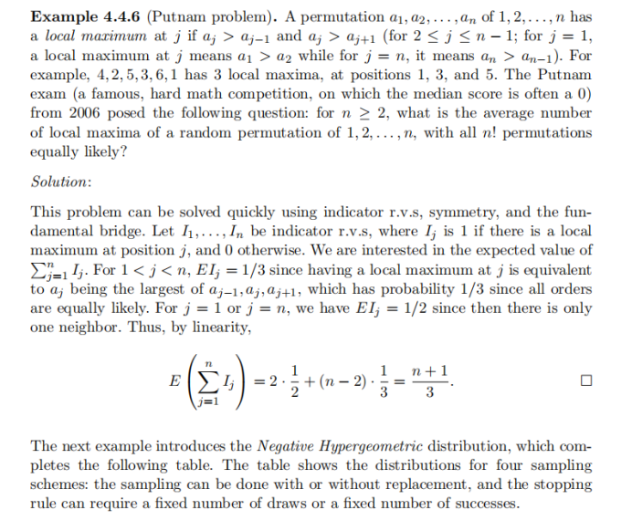
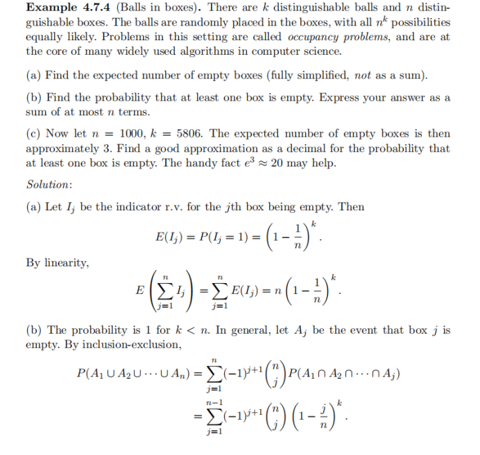
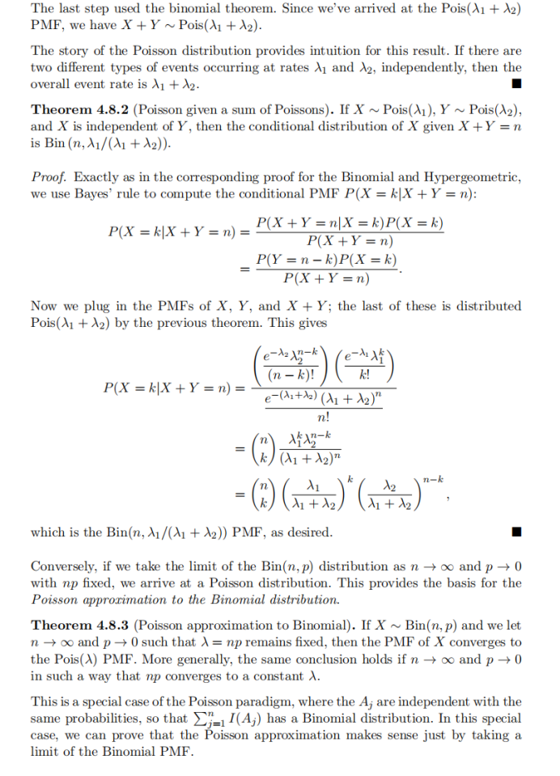
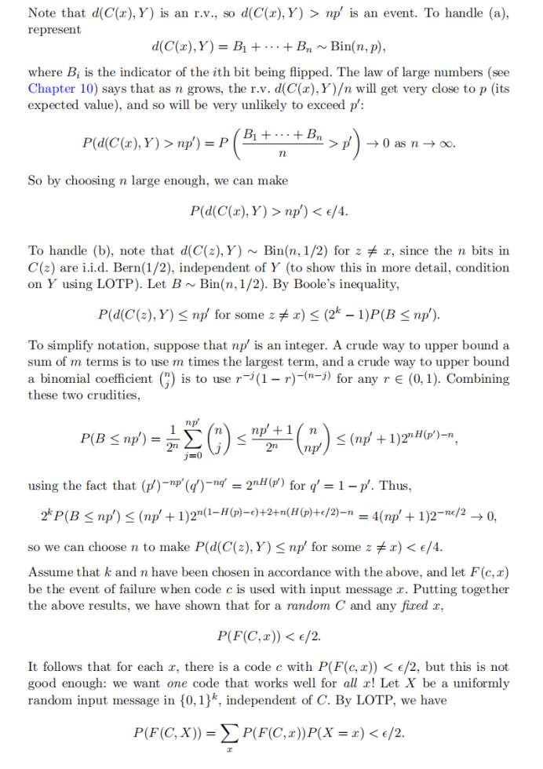

# Chapter 4


期望（Expectation）——随机变量平均行为的定量刻画
==============================

> **本节概览**：
> 
> *   为什么需要“期望”这一概念？
>     
> *   从算术平均数到加权平均数，再到离散随机变量的期望
>     
> *   期望的形式定义、直观解释与常见例子
>     
> *   “质心”类比与频率学派视角
>     
> *   期望只依赖于分布的基本性质
>     

* * *

1\. 背景动机：用一个数字总结一整个分布
---------------------

上一章我们介绍了**随机变量的分布**，它给出了随机变量  $X$  落入任意集合的概率。然而，分布往往包含大量信息（例如完整的 PMF / PDF 或 CDF），在实际问题中管理起来并不方便。

*   **需求**：我们常常希望用**一个数字**来概括随机变量“总体水平”的位置，这就是所谓的“平均”或“期望”值。
    
*   **更深层意义**：统计学不仅关注中心位置，也关注分散程度（方差、标准差等），而这些量都建立在期望的基础之上。
    

* * *

2\. 从算术平均数到加权平均数
----------------

*   **算术平均数**（Arithmetic Mean）  
    给定确定的数列  $x_1,x_2,\dots,x_n$ ，其平均数
    
    $$
     \bar{x}\;=\;\frac{1}{n}\sum_{j=1}^n x_j.
    $$
    
    这是最熟悉的“把所有数相加再除以个数”。
    
*   **加权平均数**（Weighted Mean）  
    若每个  $x_j$  伴随一个**非负权重**  $p_j$ ，且  $\sum_{j=1}^n p_j = 1$ ，则
    
    $$
     \text{weighted-mean}(x)\;=\;\sum_{j=1}^n x_j p_j.
    $$
    
    当  $p_j=\tfrac1n$  时退化为算术平均数。
    

> **思路跳转**：**概率质量函数 PMF  $P(X=x_j)$ ** 恰好提供了“权重”，这便自然引出离散随机变量的期望定义。

* * *

3\. 离散随机变量的期望定义
---------------

### 3.1 形式化定义

设离散随机变量  $X$  可能取值集合为  $\{x_1,x_2,\dots\}$ ，对应概率  $P(X=x_j)$ 。若级数

$$
 \sum_{j=1}^\infty |x_j|P(X=x_j)
$$

收敛，则 **期望（或数学期望、均值）** 定义为

$$
 \boxed{E(X)\;=\;\sum_{j=1}^\infty x_j P(X=x_j).}
$$

若  $X$  只在有限个点上有正概率，上式退化为有限和。也常写成

$$
 E(X)\;=\;\sum_{x}\;x\;\underbrace{P(X=x)}_{\text{PMF at }x}.
$$

> **发散警告**：若  $\sum |x_j|P(X=x_j)$  发散，则  $E(X)$  不存在；若绝对值发散而原级数条件收敛，其值可能依赖求和顺序。

### 3.2 直观解释

期望是“**带概率权重的平均数**”。它告诉我们：如果反复独立地观测  $X$ ，长期平均将趋近于  $E(X)$ 。

* * *

4\. 基本示例与物理类比
-------------

### 示例 1：公平六面骰

 $X\in\{1,2,3,4,5,6\}$ ，每面概率  $1/6$ 。

$$
 E(X)=\frac{1}{6}(1+2+3+4+5+6)=3.5.
$$

> **注意**： $X$  永远不会等于 3.5，这与“一个国家平均每户 1.8 个孩子”而单个家庭绝无半个孩子是同样道理。

### 示例 2：伯努利随机变量

 $X\sim \mathrm{Bern}(p)$ ，取 1 的概率  $p$ ，0 的概率  $q=1-p$ 。

$$
 E(X)=1\cdot p+0\cdot q=p.
$$

*   **质心（center of mass）类比**：如图 4.1，两块小石子质量分别为  $p$  和  $q$ ，位于刻度 1 和 0 处，它们的平衡点正好在  $p$ 。这一物理模型形象展示了期望的“力矩平衡”含义。
    
*   **频率学派解释**：进行大量独立伯努利试验，记录 1 的比例；大数定律保证该比例趋近于  $p$ ，故长期均值即为  $p$ 。
    

### 示例 3：有限多值  $\{a_1,a_2,a_3\}$ 

若概率对应  $\{p_1,p_2,p_3\}$ ，独立重复  $n$  次实验则期望出现约  $p_1n$ ,  $p_2n$ ,  $p_3n$  次；其样本平均

$$
 \frac{p_1n\,a_1+p_2n\,a_2+p_3n\,a_3}{n} =p_1a_1+p_2a_2+p_3a_3 \;=\;E(X).
$$

* * *

5\. 基本性质
--------

1.  **依赖性**： $E(X)$  仅依赖于  $X$  的分布，而与具体样本空间中的实现方式无关。
    
2.  **同分布 ⇒ 同期望**（命题 4.1.2）：若随机变量  $X,Y$  具有相同 PMF，则
    
    $$
     E(X)=E(Y)\quad (\text{若其存在}).
    $$
    
    _证明要点_：定义中只需 PMF，若 PMF 相同则所有求和项相同。
    

> 在后续章节将看到线性性质、迭代法则（全期望公式）、方差定义  $\mathrm{Var}(X)=E[(X-E(X))^2]$  等都构建在本节期望概念之上。

* * *

6\. 小结
------

*   **期望**是用概率加权的平均数，给出随机变量“中心趋势”。
    
*   形式定义： $\displaystyle E(X)=\sum_{x}xP(X=x)$ （离散情形）。
    
*   通过**算术平均 → 加权平均 → 期望**的递进可直观理解其来源。
    
*   经典例子（六面骰、伯努利）说明了计算方法与物理质心类比。
    
*   期望完全由**分布**决定，同分布的随机变量期望必相等。
    


期望的局限与正确用法
==========

> **本节概览**
> 
> *   期望并不足以唯一确定分布
>     
> *   误把随机变量替换成其期望值的常见错误
>     
> *   约定俗成的简写： $E(X)=EX,\;E(X^2)=EX^2,\;E(X^n)=EX^n$ 
>     
> *   运算顺序： $EX^2\neq (EX)^2$ ，先幂后期望！
>     
> *   图 4.2：两条不同 PMF 具有同一“平衡点”（期望）
>     

* * *

1 期望无法“识别”完整分布
--------------

上一小节的命题指出：若  $X$  和  $Y$  具有相同的 **分布**，则  $E(X)=E(Y)$ 。

> **逆命题却不成立**：   $\;E(X)=E(Y)\nRightarrow X\stackrel{d}{=}Y$ 

*   **图 4.2 直观演示**
    
    *   左图：一个四点分布  $\{0,1,2,4\}$ ；右图：另一个三点分布  $\{0,2,4\}$ 。
        
    *   两者都在  $x\approx2$  处标出同一“支点”🔺— **期望值相同**。
        
    *   但概率质量函数（PMF）显然不同 → **期望只能给出“质心”位置，无法告诉我们质量如何分布**（分散/集中）。
        

* * *

2 4.1.3 把随机变量替换成期望值的误区
----------------------

> **数学层面**
> 
> *   随机变量  $X$  是“函数”， $E(X)$  是“常数”。
>     
> *   把  $X$  直接换成  $E(X)$  即把随即性抹掉，只剩一个确定值 → 失去信息。
>     

> **统计层面**
> 
> *   估计或推断时若盲目用  $E(X)$  取代  $X$ ，等价于假设  $X$  无任何变异性。
>     
> *   除非  $X$  **退化**（恒定），否则这种替换既不严谨也不合理。
>     

* * *

3 4.1.4 常用简写符号
--------------

| 原式 | 常写成 | 备注 |
| --- | --- | --- |
|  $E(X)$  |  $EX$  | 省略括号；上下文无歧义即可 |
|  $E(X^2)$  |  $EX^2$  | 同理，幂在“X”外部 |
|  $E(X^n)$  |  $EX^n$  |  $n\ge1$  的高阶矩 |

> **阅读提醒**：省略括号后要特别关注幂的位置，避免与  $(EX)^2$  混淆。

* * *

4 4.1.5 运算顺序的重要性
----------------

*   **先幂后期望**：
    
    $$
     EX^2 \;=\;E\bigl(X^2\bigr)
    $$
    
*   **绝非**
    
    $$
     (EX)^2 \;=\;\bigl(E(X)\bigr)^2
    $$
    

> 举例：设  $X\sim\text{Bern}(0.5)$ 。
> 
> *    $EX = 0.5$ 。
>     
> *    $EX^2 = E(X) $  因为  $X^2=X$ ，故仍为 0.5。
>     
> *    $(EX)^2 = 0.25$ 。  
>     → 二者相差一倍，说明先后顺序错误会导致结果偏差。
>     

* * *

5 综合小结
------

1.  **期望 = “质心”**：只能描述中心，不描述形状。
    
2.  不能随意把随机变量替换成期望值，除非随机性确实可以忽略。
    
3.  记号  $EX,EX^2$  很方便，但要清楚幂的先后。
    
4.  正确理解  $(EX)^2$  与  $EX^2$  的区别，是后续学习方差
    
    $$
     \operatorname{Var}(X)=E\!\left[(X-EX)^2\right]=EX^2-(EX)^2
    $$
    
    的关键。
    

* * *


期望的线性性质
=======

> **概要**
> 
> 1.  **定理 4.2.1**： $E(X+Y)=E(X)+E(Y)$ ， $E(cX)=cE(X)$ （ $c$  为常数）。
>     
> 2.  独立性不是必要条件，哪怕  $X$  与  $Y$  完全相关也成立。
>     
> 3.  “分组 vs. 不分组”两种求平均方式揭示了线性的本质。
>     
> 4.  图 4.3 以“石子-超石子”类比形象说明权重合并的过程。
>     

* * *

1 线性性质的正式陈述
-----------

**定理 4.2.1（期望的线性）**  
对任意随机变量  $X,Y$  与常数  $c$ ，若  $E(X)$ 、 $E(Y)$  存在，则

$$
\boxed{E(X+Y)=E(X)+E(Y)},\qquad\boxed{E(cX)=c\,E(X)}.
$$

*   第二式表示常数可提到期望符号外。
    
*   第一式表明：**无论  $X$  与  $Y$  是否独立**，只要期望存在，其和的期望就是各自期望之和。
    

> **极端示例**  
> 设  $X\equiv Y$ （完全依赖），则  $X+Y=2X$ ，左边  $E(X+Y)=E(2X)=2E(X)$ ；右边  $E(X)+E(Y)=E(X)+E(X)=2E(X)$ 。依然成立 → 线性不需要独立假设。

* * *

2 线性的直观动机：平均数的两种计算方式
--------------------

给定数列  $\{1,1,1,1,1,3,3,5\}$ （共 8 个元素）：

| 方式 | 步骤 | 结果 |
| --- | --- | --- |
| **逐项相加再除以个数** |  $\displaystyle\frac{1+1+1+1+1+3+3+5}{8}$  |  $2$  |
| **先按取值分组再加权平均** | 1 出现 5 次权重  $\frac58$ ；3 出现 2 次权重  $\frac28$ ；5 出现 1 次权重  $\frac18$ 。计算  $\frac58\!\cdot\!1+\frac28\!\cdot\!3+\frac18\!\cdot\!5$  |  $2$  |

两种思路得到完全相同的平均数。

> **关键洞见**：**分组（grouped）** 与 **不分组（ungrouped）** 的平均计算结果一致，这正是期望可将权重“合并”或“拆分”的根源，也就是线性成立的直观理由。

* * *

3 将洞见迁移到随机变量
------------

记样本空间中的每个原始结果  $s$  为一粒小石子（左图 4.3），随机变量  $X$  为每粒石子贴上数值标签  $X(s)$ 。

*   **不分组**：对所有石子各自乘以权重  $\tfrac1{|\Omega|}$ （或更一般的概率），然后求和 —— 对应  $\displaystyle E(X)=\sum_s X(s)P(s)$ 。
    
*   **分组**：把标签相同的石子合并成“超石子”（右图 4.3）。超石子的重量即为发生该标签的总概率  $P(X=x)$ 。期望改写成
    
    $$
     E(X)=\sum_{x}\,x\,P(X=x),
    $$
    
    这正是上一节的定义。
    

当我们有 **两个随机变量  $X,Y$ ** 时：

1.  先“拆分”成石子级别求  $(X+Y)(s)=X(s)+Y(s)$ ，再与概率权重相乘求和；
    
2.  线性可让我们把求和拆开成  $X(s)$  部分与  $Y(s)$  部分各自累加。
    

* * *

4 （选读）离散情形的形式证明思路
-----------------

设  $X,Y$  取值集合分别为  $\{x_i\},\{y_j\}$ ，对每个原始结果  $s$  有概率  $P(s)$ 。

$$
\begin{aligned} E(X+Y) &= \sum_{s} (X(s)+Y(s))\,P(s) \\[3pt] &= \sum_{s} X(s)P(s) \;+\; \sum_{s} Y(s)P(s) \\[3pt] &= E(X)+E(Y). \end{aligned}
$$

常数倍性质同理，故线性得证。

> **泛化**：连续型随机变量时，只需把求和换为积分即可；线性本质来自积分算子/无穷求和算子的可加性。

* * *

5 线性的作用与启发
----------

| 领域 | 典型应用 | 解释 |
| --- | --- | --- |
| **计数问题（指示函数）** | 期望的线性 + 指示变量 = 求平均“数量” | 例：抛  $n$  次硬币，令  $I_i$  表示第  $i$  次是否正面， $E(\sum I_i)=\sum E(I_i)=np$ 。无需关心独立性以外的高阶关系。 |
| **方差展开（稍后章节）** |  $\operatorname{Var}(X)=E(X^2)-(EX)^2$  | 利用线性把  $E[(X-EX)^2]$  展开。 |
| **蒙特卡洛估计** | 可把复杂随机向量的期望拆为分量之和 | 降低实现复杂度，提升可解释性。 |

* * *

6 总结
----

*   **线性是期望最重要的代数性质**，允许我们“先加后取期望”或“先取期望再加”。
    
*   独立性 **不是** 要求，只需每一项的期望存在即可。
    
*   直观解释：平均可以 **不分组** 逐项累加，也可以 **分组** 先合并同值项再加权；两条路径等价。
    
*   图 4.3 的“石子–超石子”示意强调了**权重合并**这一过程。
    
*   线性的威力将贯穿后续统计推断、方差计算、极限定理等多个主题。
    

* * *


期望的线性（二）：统一权重、模拟直观与完整推导
=======================

> **本节概览**
> 
> *   为什么换回“最细粒度”采样空间权重可以简化多随机变量的运算
>     
> *   不同定义的优劣比较：**分布层面** vs. **采样空间层面**
>     
> *   线性推导的第二条思路：**大规模模拟**与列求和示意（图 4.4）
>     
> *   相关性对  $E(X+Y)=E(X)+E(Y)$  完全不起作用
>     
> *   进一步理解大数定律在验证线性中的角色
>     

* * *

1 定义的两种视角：分布权重 vs. 采样空间权重
-------------------------

| 视角 | 核心做法 | 优点 | 缺点 |
| --- | --- | --- | --- |
| **分布层面**<br/>(“超石子”) | 把所有取同一值的样本结果合并成一块“超石子”，权重是  $P(X=x)$ <br/> $\displaystyle E(X)=\sum_x x\,P(X=x)$  | ①直接对 X 的 PMF 计算，不必回到样本空间 | 当有另一个 r.v.  $Y$  时，它会按自己的取值再分组，权重  $P(Y=y)$  与  $P(X=x)$  不同，**难以把  $\sum xP(X=x)$  与  $\sum yP(Y=y)$  组合** |
| **采样空间层面**<br/>(“小石子”) | 对每个最小样本点  $\{s\}$  使用同一权重  $P(\{s\})$ <br/> $\displaystyle E(X)=\sum_{s} X(s) P(\{s\})$  | ① X、Y、 $X+Y$ … 都共享同一组权重  $P(\{s\})$ <br/>② 易于将期望拆分/合并，直接展示线性 | 需要回到“最细”级别，概念上略繁琐 |

> **关键洞见**：**统一权重** 才能把  $\sum_s X(s)P(\{s\})$  与  $\sum_s Y(s)P(\{s\})$  自然拼在一起，得到
> 
> $$
>  E(X)+E(Y)=\sum_s \bigl[X(s)+Y(s)\bigr]P(\{s\})=E(X+Y).
> $$

* * *

2 采样空间权重法的线性推导（完整公式）
--------------------

1.  **逐变量期望**
    
    $$
     E(X)=\sum_{s} X(s)P(\{s\}),\qquad E(Y)=\sum_{s} Y(s)P(\{s\}).
    $$
    
2.  **相加**
    
    $$
     E(X)+E(Y)=\sum_s \!X(s)P(\{s\})+\sum_s \!Y(s)P(\{s\}) =\sum_s [X(s)+Y(s)]P(\{s\}) =E(X+Y).
    $$
    
3.  **常数倍性质** 直接把  $cX(s)$  提到外面即可，略。
    

* * *

3 模拟视角：用大量实验行列说明线性
------------------

*   **思路**：做  $n$  次独立重复实验，记录每次的  $X$ 、 $Y$ 、 $X+Y$ 。
    
*   **表格（图 4.4）**：
    
    | 第 i 行 |  $x_i$  |  $y_i$  |  $x_i+y_i$  |
    | --- | --- | --- | --- |
    | 1 | 3 | 4 | 7 |
    | … | … | … | … |
    

### 两种加总顺序

| 顺序 | 运算 | 结果逼近 |
| --- | --- | --- |
| **列 3 直接平均** |  $\displaystyle \frac1n\sum_{i=1}^n (x_i+y_i)$  |  $E(X+Y)$  |
| **列 1 + 列 2 再平均** |  $\displaystyle \frac1n\sum x_i + \frac1n\sum y_i$  |  $E(X)+E(Y)$  |

> **结论**：两条路径是同一件事的不同顺序，必相等 → 线性。  
> **大数定律**（第 10 章详述）保证样本均值逼近真期望，故模拟能“验证”理论。

* * *

4 相关性与线性无关
----------

*   图 4.4 示例中， $X$  大时  $Y$  也倾向大（正相关）。
    
*   把  $Y$  列随机重排（打乱相关性），列 1 与列 2 的总和 **不变**，列 3 改写为列 1 + 重排后列 2 仍然逐行对应，所以列 3 总和同样不变。
    
*   **依赖结构只影响行内配对，不影响列分别求和**，因此线性对独立性完全没有要求。
    

* * *

5 进一步思考与常见误用
------------

1.  **共享权重概念** 对以后学习 **协方差、共轭随机变量变换** 很重要：一旦所有随机变量都用同一套  $\{P(\{s\})\}$  作为权重，很多多元期望/协方差恒等式的证明就成了“把列拆开再合起来”。
    
2.  **误区提醒**：
    
    *   把  $E(X)+E(Y)$  写成  $E(X+Y)$  需要证明，不能**先假设**。
        
    *   如果忘了统一权重，直接用  $\sum_x xP(X=x)$  与  $\sum_y yP(Y=y)$  企图“对齐”  $x$  和  $y$ ，往往会卡住。
        

* * *

6 小结
----

*   **统一采样空间权重** 是期望线性最本质的理由。
    
*   **模拟大数定律视角** 提供了极具说服力的直观：列平均换序不改变总和。
    
*   **依赖/相关性不影响线性**——这使线性成为使用最广、最方便的期望性质。
    
*   图 4.4 把三个列并排展示，形象总结了
    
    $$
     \overbrace{\frac1n\!\sum x_i}^{\approx E(X)}+\overbrace{\frac1n\!\sum y_i}^{\approx E(Y)} =\overbrace{\frac1n\!\sum (x_i+y_i)}^{\approx E(X+Y)}.
    $$
    

* * *


线性期望的威力与典型应用
============

> **本节涵盖内容概览**
> 
> *   二项分布与超几何分布的期望两种推导思路
>     
> *   指示变量分解  $X=\sum I_j$  与“独立性无关”的要点
>     
> *   期望的单调性命题 (Proposition 4.2.4) 及其简洁证明
>     
> *   结合组合恒等式、线性性质与大数定律的多角度直觉
>     

* * *

1 二项分布  $X\sim\mathrm{Bin}(n,p)$  的期望
-------------------------------------

### 1.1 直接按定义逐项求和

$$
\begin{aligned} E(X) &=\sum_{k=0}^{n} k\binom{n}{k}p^{\,k}q^{\,n-k}\\[4pt] &\stackrel{(a)}{=} \sum_{k=0}^{n} \;k\binom{n}{k}p^{\,k}q^{\,n-k} =\sum_{k=0}^{n} n\binom{n-1}{\,k-1}p^{\,k}q^{\,n-k}\\[6pt] &=np\sum_{k=1}^{n}\binom{\,n-1}{k-1}p^{\,k-1}q^{\,n-k}\\[6pt] &\stackrel{j=k-1}{=}np\sum_{j=0}^{n-1}\binom{\,n-1}{j}p^{\,j}q^{\,(n-1)-j} =np\underbrace{\left(p+q\right)^{\,n-1}}_{=1}=np. \end{aligned}
$$

> (a) 利用组合恒等式  $k\binom{n}{k}=n\binom{n-1}{k-1}$ 。  
> 倒数第二行的求和正是  $\mathrm{Bin}(n-1,p)$  的 PMF 全概率和，故为 1。

### 1.2 指示变量 + 线性期望（更简洁）

令

$$
X=\sum_{j=1}^{n} I_j,\qquad I_j= \begin{cases} 1,&\text{第 }j\text{ 次试验成功}\\[2pt] 0,&\text{否则} \end{cases}
$$

则每个  $I_j\sim\mathrm{Bern}(p)$ ，且

$$
E(I_j)=1\cdot p+0\cdot q=p.
$$

由期望的线性性质（不要求独立性）

$$
E(X)=E\!\Bigl(\sum_{j=1}^{n} I_j\Bigr)=\sum_{j=1}^{n} E(I_j)=np.
$$

> **亮点**：一步到位避开任何组合恒等式，彰显线性的高效。

* * *

2 超几何分布  $X\sim \mathrm{HGeom}(w,b,n)$  的期望
-------------------------------------------

*   **情景**：总共  $w$  个白球、 $b$  个黑球；不放回地抽取  $n$  个球； $X$  为抽到的白球数。
    
*   **关键**：指示变量仍然可用，但 **各  $I_j$  不独立**，因为抽到一个白球会影响剩余球的颜色比例。
    

### 2.1 指示变量表示

$$
X=\sum_{j=1}^{n} I_j,\qquad I_j= \begin{cases} 1,&\text{第 }j\text{ 个抽出的球为白球}\\[2pt] 0,&\text{否则} \end{cases}
$$

**对称性原则**：在随机抽样前，每个位置  $j$  被抽到白球的无条件概率相同：

$$
P(I_j=1)=\frac{w}{w+b}.
$$

于是

$$
E(I_j)=\frac{w}{w+b},\qquad E(X)=\sum_{j=1}^{n}E(I_j)=n\frac{w}{w+b}.
$$

> **要点**：虽然  $I_j$  相关，但线性期望无需独立性 → 推导与二项情形几乎一样快。

* * *

3 期望的单调性 (Proposition 4.2.4)
----------------------------

> **命题表述**  
> 若随机变量  $X,Y$  满足  $P(X\ge Y)=1$ ，则
> 
> $$
>  E(X)\;\ge\;E(Y),
> $$
> 
> 且当且仅当  $P(X=Y)=1$  才有相等。

### 3.1 证明要点

1.  令  $Z=X-Y\ge0$ （逐样本非负）。
    
2.  由于  $Z$  取值非负， $E(Z)=\sum zP(Z=z)\ge0$ 。
    
3.  线性期望给出  $E(Z)=E(X)-E(Y)\ge0$ 。
    
4.  若  $E(X)=E(Y)$  则  $E(Z)=0$ 。因为期望是非负值的加权和，若和为 0 则必须  $P(Z=0)=1$  ⇒  $P(X=Y)=1$ 。
    

> **直觉**：若每一次实验  $X$  都“不小于”  $Y$ ，那么长期平均自然也“不小于”。

* * *

4 线性期望的优势与常见技巧
--------------

| 应用 | 技巧 | 备注 |
| --- | --- | --- |
| **组合型分布求期望** | 把计数型  $X$  写成指示变量之和 | 二项、超几何、负二项等皆如此 |
| **依赖样本问题** | 只用到各项个别期望，无需协方差 | 如不放回抽样、扑克牌问题 |
| **概率不均事件计数** | 指示变量可设不同成功概率  $p_j$  | 期望即  $\sum p_j$  |
| **单调性 / 马尔可夫不等式** | 以  $Z=X-Y$  或  $Z=(X-c)^+$  化为非负 r.v. | 后续扩展到凸函数的 Jensen 不等式 |

* * *

5 本节小结
------

1.  **线性期望是计算期望最强大的“武器”**——一次证明，处处可用，无需关心独立性。
    
2.  二项分布与超几何分布的期望都可用“指示变量 + 线性”几行推完，凸显简洁。
    
3.  期望的单调性由  $X\ge Y\Rightarrow E(X)\ge E(Y)$  体现“整体大 ⇒ 平均也大”。
    
4.  记住：线性性质只关心**求和符号**与**常数倍**，不涉及乘积或非线性函数。
    

* * *


几何分布与其分布函数——“第一次成功之前失败次数”的完整解析
==============================

> **本节内容概况**
> 
> *   “失败计数”视角下的几何分布故事化定义
>     
> *   几何分布的 PMF 推导：一次成功结束、前导串全失败
>     
> *   几何级数验证 PMF 的合法性
>     
> *   几何分布 CDF 的两种推导：直接求和与互补事件
>     
> *   对整数与实数自变量的分段解释
>     

* * *

1 故事化引入：Story 4.3.1
-------------------

*   **实验场景**：重复独立 **伯努利试验**，单次成功概率  $p\in(0,1)$ 。
    
*   **随机变量  $X$ **：**第一次成功之前的失败次数**。
    
*   **记号**： $X\sim\mathrm{Geom}(p)$ 。
    
    *   若抛一枚公平硬币直到首次出现正面，则失败次数（反面数目）服从  $\mathrm{Geom}(1/2)$ 。
    
*   **重要提醒**：这里采用“**失败次数**”的版本（有些教材用“试验次数”版本 —— 成功发生的位置索引）。两者只差 1，可互相平移。
    

* * *

2 几何分布的 PMF（定理 4.3.2）
---------------------

### 2.1 核心逻辑

要让  $X=k$ （恰好有  $k$  次失败后立刻成功），必须出现

$$
\underbrace{0\;0\;\dots\;0}_{k\text{ 个失败}}\;1
$$

*   每个失败概率  $q=1-p$ 
    
*   末尾一次成功概率  $p$   
    ⇒ **联合概率（独立相乘）**
    

$$
\boxed{P(X=k)=q^{k}p},\quad k=0,1,2,\dots
$$

### 2.2 合法性验证——几何级数

$$
\sum_{k=0}^{\infty} q^{k}p = p\sum_{k=0}^{\infty} q^{k} = p\cdot\frac{1}{1-q}=p\cdot\frac{1}{p}=1.
$$

故确为有效 PMF。

> **对比**：二项分布依赖二项级数，总和为 1；几何分布依赖几何级数，总和同样为 1。

* * *

3 几何分布的 CDF（定理 4.3.3）
---------------------

### 3.1 公式

$$
F(x)=P(X\le x)= \begin{cases} 0,&x<0,\\ 1-q^{\lfloor x\rfloor+1},&x\ge0, \end{cases}
$$

其中  $\lfloor x\rfloor$  为向下取整，保证输入为整数。

### 3.2 推导方法 1：直接求和

对非负整数  $n$ （设  $x=n$ ），

$$
\begin{aligned} F(n)&=\sum_{k=0}^{n} q^{k}p =p\frac{1-q^{n+1}}{1-q} =1-q^{n+1}. \end{aligned}
$$

这里利用了有限几何级数求和公式。

### 3.3 推导方法 2：互补事件

事件  $\{X\ge n+1\}$  ⇔ 前  $n+1$  次全部失败，概率  $q^{\,n+1}$ 。

$$
F(n)=1-P(X\ge n+1)=1-q^{\,n+1}.
$$

### 3.4 对实数自变量的延拓

若  $x\ge0$  非整数，则

$$
P(X\le x)=P\bigl(X\le\lfloor x\rfloor\bigr)=1-q^{\lfloor x\rfloor+1}.
$$

举例：

$$
P(X\le3.7)=P(X\le3)=1-q^{4}.
$$

* * *

4 与本章其他分布的比较视角
--------------

| 分布 | 描述变量 | PMF 核心串 | 期望（下一小节将给出） |
| --- | --- | --- | --- |
| 二项  $\mathrm{Bin}(n,p)$  | 固定  $n$  次中成功数 |  $\binom{n}{k}p^{k}q^{n-k}$  |  $np$  |
| 几何  $\mathrm{Geom}(p)$  | 首次成功前失败数 |  $q^{k}p$  |  $\dfrac{q}{p}$  |
| 超几何  $\mathrm{HGeom}(w,b,n)$  | 抽样白球数 | 组合系数比率 |  $n\frac{w}{w+b}$  |

> **洞见**：几何分布是二项分布在“ $n$  不固定”且“直至首个成功”为止的极端情形；等待时间具有“无记忆性”（后续章节会提及）。

* * *

5 小结
----

1.  **几何分布故事化**：独立伯努利串直至首次成功。
    
2.  **PMF**： $P(X=k)=q^{k}p$ ，通过串概率乘积获得。
    
3.  **合法性**：利用几何级数  $\sum_{k=0}^{\infty}q^{k}=1/(1-q)$ 。
    
4.  **CDF**：两种推导一致得到  $F(x)=1-q^{\lfloor x\rfloor+1}$ 。
    
5.  这些结论为后续求期望  $\displaystyle E(X)=\frac{q}{p}$  和负二项分布铺垫基础。
    

* * *


几何分布的两种定义、期望推导与负二项分布的引入
=======================

> **本节概览**
> 
> *   图形直观： $p=0.5$  时 Geom PMF/CDF 的形状与“快速衰减”概念
>     
> *   定义差异：**失败数版本** vs. **试验数版本（First Success，FS）**
>     
> *   两版本的互相转换公式
>     
> *   几何分布期望  $E(X)=\dfrac{q}{p}$  的“微分法”推导
>     
> *   FS 版本期望  $E(Y)=\dfrac1p$  的移位思路
>     
> *   负二项分布的故事化描述与 PMF 公式
>     

* * *

1 图形直观与概率衰减（Figure 4.5）
-----------------------

*   **左图：PMF**——竖线长度随  $k$  指数级衰减； $p$  越大，衰减更快。
    
*   **右图：CDF**——分段阶梯； $x$  每增加 1，概率突跳  $p q^{x}$ 。
    
*   **直觉**：成功概率  $p$  越高，“等太久”的危险越小，CDF 更快逼近 1。
    

* * *

2 4.3.4 几何分布的两种惯例
-----------------

| 版本 | 随机变量含义 | 记号 | 支持 | 与另一版本关系 |
| --- | --- | --- | --- | --- |
| **失败数版**（本书） | 首次成功_之前_的失败次数 |  $X\sim\mathrm{Geom}(p)$  | 许多统计教材 |  $Y=X+1$  |
| **试验数版** | 包含成功在内的累计试验次数 |  $Y\sim\mathrm{FS}(p)$ （First Success） | 计算机科学/离散概率常见 |  $X=Y-1$  |

> **互换公式**
> 
> $$
> P(Y=k)=P(X=k-1),\qquad k=1,2,\dots 
> $$
> 
> 只要扣/加 1 即可在两种 PMF 之间切换，计算时务必留意所用版本。

* * *

3 4.3.5 First Success (FS) 分布正式定义
---------------------------------

*   **实验**：独立伯努利试验直到第一次成功出现。
    
*   **随机变量  $Y$ **：**试验总数（含成功）**。
    
*   **记号**： $Y\sim\mathrm{FS}(p)$ 。
    
*   **PMF 关系**： $P(Y=k)=P(X=k-1)=q^{\,k-1}p,\;k=1,2,\dots$ 。
    

* * *

4 4.3.6 几何分布期望的“微分法”推导
----------------------

> **目标**：
> 
> $$
> E(X)=\sum_{k=0}^{\infty} k q^{\,k}p.
> $$

### 4.1 利用几何级数

1.  基础几何级数
    
    $$
     \sum_{k=0}^{\infty} q^{\,k}=\frac1{1-q},\quad 0<q<1.
    $$
    
2.  两边对  $q$  求导
    
    $$
     \sum_{k=0}^{\infty} k q^{\,k-1}=\frac1{(1-q)^2}.
    $$
    
3.  乘回  $q$  得
    
    $$
     \sum_{k=0}^{\infty} k q^{\,k}= \frac{q}{(1-q)^2}.
    $$
    
4.  再乘  $p$ （别忘了 PMF 里还有  $p$ ）
    
    $$
     E(X)=p\cdot\frac{q}{(1-q)^2}=pq\cdot\frac1{(1-q)^2} =\frac{q}{p}.
    $$
    

### 4.2 一步到位结论

$$
\boxed{E(X)=\dfrac{q}{p}},\qquad q=1-p.
$$

> **首步分析法**（书后示例 9.1.8）会给出相同结果：
> 
> *   若首试即成功 →  $X=0$ ；
>     
> *   若首试失败 → 消耗一试，问题回到原点；
>     
> *   写方程求解同样得到  $q/p$ 。
>     

* * *

5 4.3.7 First Success 期望
------------------------

既然  $Y=X+1$ ，

$$
E(Y)=E(X)+1=\frac{q}{p}+1=\frac1p.
$$

* * *

6 4.3.8 负二项分布故事
---------------

*   **情景**：独立伯努利试验序列，直到出现 **第  $r$  次成功** 才停止。
    
*   **随机变量  $X$ **：此过程中经历的 **失败总数**。
    
*   **记号**： $X\sim\mathrm{NBin}(r,p)$ （Negative Binomial）。
    

> 几何分布是负二项的特例： $r=1$ 。

* * *

7 4.3.9 负二项 PMF 的推导
-------------------

### 7.1 公式

$$
\boxed{P(X=n)=\binom{n+r-1}{\,r-1}p^{\,r}q^{\,n}},\qquad n=0,1,2,\dots
$$

*   最后一个试验必须成功（概率  $p$ ）。
    
*   之前共有  $n+r-1$  个位置放置  $r-1$  个成功，其余  $n$  个为失败序列  $0$ 。
    
*   排列方式  $\binom{n+r-1}{r-1}$ 。
    
*   每种排列独立概率  $p^{\,r-1}q^{\,n}$ 。再乘最后一次成功  $p$  得  $p^r q^n$ 。
    

### 7.2 概念对比

| 分布 | 终止条件 | 随机变量计数 | PMF 核心形态 |
| --- | --- | --- | --- |
| **Binomial** | 试验数固定  $n$  | 成功数  $k$  |  $\binom{n}{k}p^{k}q^{n-k}$  |
| **NegBin** | 成功数固定  $r$  | 失败数  $n$  |  $\binom{n+r-1}{\,r-1}p^{r}q^{n}$  |

> **思路相同**：都是从“0/1 串”计数与乘法概率法则出发，只是固定量不同。

* * *

8 小结与要点回顾
---------

1.  **两种几何分布**：本书用“失败数”版本；另一常见是“试验数”。互换仅需  $\pm1$ 。
    
2.  **期望计算技巧**：
    
    *   微分几何级数快速得出  $E(X)=q/p$ 。
        
    *   FS 版本期望  $\dfrac1p$  由平移得来。
    
3.  **负二项分布**：等待第  $r$  次成功；PMF 与二项形似，组合系数“把成功插入长串失败”而得。
    
4.  **参数依赖**： $p$  越大，PMF 衰减与 CDF 上升越快，同理负二项分布也更紧凑。
    

* * *


负二项分布与收集优惠券问题
=============

> **本节概览**
> 
> *   负二项分布  $\mathrm{NBin}(r,p)$  的“间隔和”表示与期望
>     
> *   指示变量思想：把负二项拆成  $r$  个独立几何间隔
>     
> *   经典例题：收集  $n$  种玩具（优惠券）完成全套所需次数
>     
> *   利用 **First-Success 分布** 分段建模及其期望推导
>     
> *   连接两者的共同框架与关键差异
>     

* * *

1 负二项分布的间隔分解
------------

### 1.1 定理 4.3.10 — **几何间隔和**

设

$$
X\sim\mathrm{NBin}(r,p)
$$

表示在独立伯努利试验中，直到出现第  $r$  次成功之前经历的**失败总数**。

*   记  $X_i$  为**两次连续成功之间**的失败数：
    
    *    $X_1$  = 第一次成功前的失败数
        
    *    $X_2$  = 第一与第二次成功之间的失败数
        
    *   ⋯
        
    *    $X_r$  = 第  $(r-1)$  次成功后到第  $r$  次成功前的失败数
    
*   每个  $X_i$  都服从
    
    $$
     X_i\sim\mathrm{Geom}(p),\qquad P(X_i=k)=q^k p
    $$
    
    因为“等待下一次成功”的情形与几何分布吻合。
    
*   不同区段试验相互独立 ⇒  $X_1,\dots,X_r$  **i.i.d.**
    

于是

$$
\boxed{X=X_1+\cdots+X_r,\quad X_i\stackrel{\text{i.i.d.}}{\sim}\mathrm{Geom}(p)}.
$$

### 1.2 例 4.3.11 — **负二项期望**

利用期望线性：

$$
E(X)=\sum_{i=1}^{r}E(X_i)=r\cdot\frac{q}{p}.
$$

（几何期望  $E(X_i)=q/p$  于上一节已证明。）

* * *

2 收集优惠券（Coupon Collector）问题
---------------------------

### 2.1 题意与建模

*   有 ** $n$  种**玩具，每次随机获得一种，等概率  $1/n$ 。
    
*   随机变量  $N$ ：获得**全套  $n$  种**所需的总次数。
    

> **分段思路**：
> 
> *    $N_1$ ：拿到**第 1 种新玩具**为止的次数（显然  $=1$ ）。
>     
> *    $N_2$ ：在已有 1 种后，再拿到**一个新品种**所需的额外次数。
>     
> *   ⋯
>     
> *    $N_j$ ：已有  $j-1$  种后，再拿到第  $j$  种新品的额外次数。
>     
> 
> 则
> 
> $$
> N=N_1+N_2+\cdots+N_n .
> $$

### 2.2 每段的分布

当已有  $j-1$  种时：

*   成功（拿到新种类）的概率
    
    $$
     p_j=\frac{n-(j-1)}{n}=\frac{n-j+1}{n}.
    $$
    
*   **失败**（重复已有玩具）概率  $q_j=1-p_j$ 。  
    因为我们统计**试验次数**直到成功，使用 **First-Success 分布**（FS）：
    

$$
N_j\sim\mathrm{FS}\!\Bigl(p_j\Bigr), \quad E(N_j)=\frac1{p_j}.
$$

### 2.3 总期望

$$
\begin{aligned} E(N)&=\sum_{j=1}^{n}E(N_j) =1+\frac{n}{n-1}+\frac{n}{n-2}+\cdots+\frac{n}{1}\\[4pt] &=n\sum_{j=1}^{n}\frac1j =n\,H_n, \end{aligned}
$$

其中  $H_n$  为第  $n$  个调和数。

> **渐近近似**：
> 
> $$
> H_n\approx\ln n+\gamma,\quad \gamma\approx0.577\ (\text{欧拉常数}),
> $$
> 
> 故
> 
> $$
> E(N)\approx n(\ln n+0.577).
> $$

### 2.4 图 4.6 示意（ $n=3$ ）

*   圆 → 第 1 类玩具；
    
*   方 → 第 2 类；
    
*   三角 → 第 3 类。
    
*   箭头段  $N_1$  只含首个圆； $N_2$  是直到抽到第一方形的额外次数； $N_3$  是直到抽到三角形的额外次数。
    

* * *

3 负二项分布与优惠券问题的对照
----------------

| 特征 | 负二项（定理 4.3.10） | Coupon Collector |
| --- | --- | --- |
| “成功”概率 | **固定**  $p$  每次不变 | **递减**  $p_j$  随已收集种类变少而变小 |
| 间隔变量 | i.i.d. 几何 (Geom) | 不同参数 FS，独立但不同分布 |
| 是否计入成功本身 | 不计入 ⇒ 间隔 = 失败数 | 计入 ⇒ 间隔 = 总试验数 |
| 求和表达式 |  $X=\sum_{i=1}^{r}X_i$  |  $N=\sum_{j=1}^{n}N_j$  |
| 期望 |  $r\frac{q}{p}$  |  $nH_n$  |

**共同点**：都把“等待过程”拆成多个区段，再用期望线性求和  
**不同点**：成功概率是否恒定；是否把成功本身计入区段长度。

* * *

4 重点回顾
------

1.  **负二项 as 几何间隔之和**：直观点燃，计算期望一行搞定。
    
2.  **Coupon Collector**：利用 FS 分布、调和数，得出著名的  $n\ln n$  级期望。
    
3.  **线性期望**再次体现威力——即便区段独立但分布不同，仍可直接相加。
    
4.  辨别**计数的对象**（失败数 vs. 总试验数）是理解不同分布/题目的关键。
    

* * *


非线性函数的期望与圣彼得堡悖论
===============

> **本节概览**
> 
> 1.  期望的线性 vs. 非线性 —— 何时可以把  $E$ “拿进拿出”
>     
> 2.  圣彼得堡悖论： $E(X)=\infty$  但人们不愿付出高价玩的原因
>     
> 3.  截尾情形：现实世界的上限如何把无限期望拉回到有限值
>     
> 4.  概率尾部 + 巨额回报对期望的致命影响
>     

* * *

1 4.3.13 非线性函数的期望
-----------------

*   **线性性质回顾**：
    
    *    $E(aX+bY)=aE(X)+bE(Y)$ 。
    
*   **非线性警告**：一般而言
    
    $$
     E\bigl(g(X)\bigr)\;\neq\;g\!\bigl(E(X)\bigr).
    $$
    
    只有当  $g$  为线性函数（或满足 Jensen 等特殊条件）时才能交换。
    
*   **后面圣彼得堡悖论** 正是经典反例：
    
    $$
     E\bigl(2^N\bigr)=\infty,\qquad 2^{E(N)}=4.
    $$
    

* * *

2 4.3.14 圣彼得堡悖论（St. Petersburg Paradox）
---------------------------------------

### 2.1 游戏规则

1.  抛一枚公平硬币直至首次出现正面。
    
2.  若在第  $n$  次抛出正面，您获得  $2^n$  美元。
    

设

$$
N\sim\mathrm{FS}\!\bigl(\tfrac12\bigr),\quad P(N=n)=\frac1{2^n},\ n=1,2,\dots
$$

则您的收益

$$
X = 2^N.
$$

### 2.2 计算期望

$$
E(X) =\sum_{n=1}^{\infty} 2^{\,n}\cdot\frac1{2^n} =\sum_{n=1}^{\infty} 1 =\infty.
$$

> **非线性陷阱**：
> 
> $$
> E\bigl(2^N\bigr)=\infty,\quad 2^{E(N)} = 2^{\,2}=4.
> $$
> 
> 二者天差地别，说明“把  $E$  放进非线性函数”是危险的。

### 2.3 悖论核心

*   **数学期望 = ∞**，但现实中几乎无人愿意支付巨款来参与。
    
*   一种直觉解释：现实中的“资金池”并非无限大。
    

* * *

3 现实截尾：将无限尾部“切掉”
----------------

### 3.1 失败 40 次即终止（输光跑路）

*   若游戏进行超过 40 轮对方跑路，
    
*   仍有小于  $1/2^{40}$  的概率能达到此极端，
    
*   **期望**
    
    $$
     E(X) =\sum_{n=1}^{40} 2^{\,n}\cdot\frac1{2^n} =40.
    $$
    

### 3.2 失败 40 次上限但仍给  $2^{40}$ （封顶奖）

*   若到第 41 轮及以后统一给  $2^{40}$  美元：
    
    $$
     E(X) =\sum_{n=1}^{40}\!\frac{2^n}{2^n} +\sum_{n=41}^{\infty}\!\frac{2^{40}}{2^n} =40+1=41.
    $$
    
*   **结论**：只要去掉尾部（再小概率也好），无限期望立即下降为可接受水平。
    

> **洞见**：
> 
> *   期望对**极端稀有但回报巨大的尾部事件**极度敏感。
>     
> *   现实中的任何物理或经济限制都会剪掉这些尾巴，从而大幅降低期望值。
>     

* * *

4 要点回顾
------

| 主题 | 关键信息 | 结论 |
| --- | --- | --- |
| 非线性期望 |  $E[g(X)]\neq g(E[X])$  | 仅在线性或特别情形可交换 |
| 圣彼得堡悖论 |  $E(X)=\infty$  但理性付费有限 | 无穷尾部驱动无限期望 |
| 截尾效果 | 加一个很远但有限的上限 | 期望从  $\infty$  → 有限（如 40 或 41） |
| 实际启示 | 风险评估、期望收益需考虑尾部可行性 | 保险、金融模型经常采用截尾或折现 |


指示随机变量与概率-期望“桥梁”
================

> **本节概况**：本节系统介绍 **指示随机变量**（indicator r.v.）的基本代数性质，以及它们如何搭建 **概率与期望之间的“根本桥梁”**。
> 
> *   **定义回顾**：事件  $A$  的指示变量  $I_A$  取值 1(事件发生)或 0(事件不发生)。
>     
> *   **定理 4.4.1**：列举并证明指示变量的四条核心性质。
>     
> *   **定理 4.4.2（根本桥梁）**：任何事件的概率都等于其指示变量的期望  $P(A)=E(I_A)$ 。
>     
> *   **例 4.4.3**：用指示变量一行式推导 **Boole/Bonferroni 不等式** 与 **容斥原理**。
>     
> *   **方法论延伸**：把复杂 r.v. 写成指示变量之和是计算期望的制胜法宝（Binomial、Hypergeometric、Coupon Collector 均已用过）。
>     

* * *

1 指示随机变量的代数性质（定理 4.4.1）
-----------------------

设  $A,B$  为事件， $I_A,I_B$  为其指示变量，则

| 性质 | 公式 | 直观解释 |
| --- | --- | --- |
| 1\. 幂不变 |  $ (I_A)^{k}=I_A\;\;\;(k\ge1)$  |  $0^k=0,\;1^k=1$  |
| 2\. 互补 |  $I_{A^c}=1-I_A$  | 事件不发生 ⇔ 指示取 0 |
| 3\. 交集 |  $I_{A\cap B}=I_AI_B$  | 两事件同发 ⇒ 两个 1 相乘仍 1 |
| 4\. 并集 |  $I_{A\cup B}=I_A+I_B-I_AI_B$  | 容斥的最小型（两事件版） |

_证明要点_：检查四种取值  $(I_A,I_B)\in\{0,1\}^2$ ，逐项验证即可；性质 1 与 0,1 的幂恒等式直接成立。

* * *

2 根本桥梁定理（Theorem 4.4.2）
-----------------------

$$
\boxed{\,P(A)=E(I_A)\,}
$$

**证明推导**  
 $I_A\sim\mathrm{Bern}(p)$  且  $I_A=1$  当且仅当  $A$  发生，故

$$
E(I_A)=1\cdot P(A)+0\cdot P(A^c)=P(A).
$$

> **意义**：任何概率都能写成期望——这把“概率论问题”变成“求期望问题”，而求期望又可借助已经掌握的线性性质、分解技巧等工具。

* * *

3 Boole / Bonferroni 不等式与容斥原理（例 4.4.3）
--------------------------------------

### 3.1 Boole / Bonferroni 一行推导

$$
I_{A_1\cup\cdots\cup A_n}\le I(A_1)+\cdots+I(A_n)
$$

两边取期望 ⇒

$$
P\!\bigl(A_1\cup\cdots\cup A_n\bigr)\le \sum_{i=1}^{n} P(A_i).
$$

### 3.2 容斥原理（二事件示范 → 推及 n 事件）

*   利用性质 4 得
    
    $$
    1-I_{A_1\cup\cdots\cup A_n} =1-\sum I(A_i)+\sum_{i<j} I(A_i)I(A_j)-\cdots+(-1)^n I(A_1)\cdots I(A_n).
    $$
    
*   两边取期望 → 得 n 事件容斥公式
    
    $$
    P\Bigl(\bigcup_i A_i\Bigr) =\sum_i P(A_i)-\sum_{i<j}P(A_i\cap A_j)+\cdots+(-1)^{n+1}P(A_1\cap\cdots\cap A_n).
    $$
    

* * *

4 策略与应用视角
---------

1.  **把复杂随机变量拆为指示变量之和**
    
    *   Binomial： $X=\sum_{i=1}^{n}I_i$ ， $I_i\sim\mathrm{Bern}(p)$ 。
        
    *   Hypergeometric：不放回抽样，同样求和但  $I_i$  相关。
        
    *   Coupon Collector： $N=\sum_{j=1}^{n}N_j$ ，而  $N_j$  各自服从不同参数的 FS 分布。
    
2.  **操作流程**
    
    *   为“每个潜在对象”定义一个指示变量。
        
    *   用线性期望先算  $\sum E(I_i)=\sum P(I_i=1)$ 。
        
    *   若需要更高阶项，可用性质 3、4 组织交互。
        

* * *

5 总结
----

*   **四条代数规则** + **根本桥梁** = 使用指示变量的一切基础。
    
*   通过指示变量，我们将**概率、逻辑运算**转化为**代数、期望运算**。
    
*   经典不等式/容斥、分布期望、计数问题都可一招解决。
    
*   掌握“识别可拆事件 → 建立指示变量 → 利用线性/桥梁”的套路，是后续解决生日悖论、德‧蒙特朗配对问题等题目的核心技能。
    

* * *

6 报错
----

> **目前截图内容已全部覆盖并详解，若后续章节（如匹配问题、生日问题）的截图再上传，我将继续补充。若有看不清的公式或推导，希望指出，我会详细补齐。**


指示变量应用：配对问题与生日悖论的期望
===================

> **本节概况**
> 
> *   运用 **指示随机变量 + 根本桥梁 + 线性**，无须知道完整分布即可求期望
>     
> *   对称性让所有指示量的期望一致，求和后立即得到答案
>     
> *   例题：
>     
>     1.  **配对问题**（随机排列中位置与标签相同的牌数）
>         
>     2.  **生日问题**（不同生日天数 & 同生日配对数）
>         

* * *

1 配对问题（Example 4.4.4）
---------------------

**问题描述**

*   一副洗匀的牌编号  $1,\dots,n$ 。
    
*   若第  $j$  张牌的编号正好是  $j$ ，称为一次 _match_。
    
*   设随机变量  $X$  = 全部 match 的数量，求  $E(X)$ 。
    

**指示变量建模**

$$
I_j=\begin{cases} 1,&\text{第 }j\text{ 张是 match}\\ 0,&\text{否则} \end{cases},\qquad X=\sum_{j=1}^{n} I_j.
$$

**根本桥梁**

$$
E(I_j)=P(I_j=1)=P(\text{第 }j\text{ 张牌编号为 }j)=\frac1n.
$$

> _对称性_：洗牌后任何编号出现在任何位置的概率均为  $1/n$ ，故所有  $E(I_j)$  相同。

**线性求和**

$$
E(X)=\sum_{j=1}^{n}E(I_j)=n\cdot\frac1n=1.
$$

**结论**  
无论牌数  $n$  多大，**期望总是 1**。

> 注意  $I_j$  依赖复杂（交换一张牌会影响其它位置），但线性期望不需要独立性。

* * *

2 生日问题（Example 4.4.5）
---------------------

### 2.1 不同生日天数

*   假设一年 365 天， $n$  个人生日独立且等概率。
    
*   设  $X$ \=出现过生日的不同日期数量。
    

**指示变量**

$$
I_j=\begin{cases} 1,&\text{有人生日在第 }j\text{ 天}\\ 0,&\text{否则} \end{cases},\qquad X=\sum_{j=1}^{365} I_j.
$$

**概率计算**

$$
E(I_j)=1-P(\text{无人生日在第 }j\text{ 天}) =1-\left(\frac{364}{365}\right)^{n}.
$$

**期望**

$$
E(X)=365\left[1-\left(\frac{364}{365}\right)^{n}\right].
$$

> _极限_：当  $n\ll365$ ，用  $\exp$  近似得  $E(X)\approx n$ 。当  $n$  与 365 同量级，饱和效应显现。

### 2.2 同生日配对数

*   设  $Y$ \=共有多少对人生日相同。
    
*   总共有  $\binom{n}{2}$  对。
    

**指示变量**

$$
J_k=\begin{cases} 1,&\text{第 }k\text{ 对生日相同}\\ 0,&\text{否则} \end{cases},\qquad Y=\sum_{k=1}^{\binom{n}{2}} J_k.
$$

**概率**

$$
E(J_k)=P(\text{两人同生日})=\frac1{365}.
$$

**期望**

$$
E(Y)=\binom{n}{2}\frac1{365}.
$$

* * *

3 方法论回顾
-------

| 工具 | 作用 |
| --- | --- |
| **指示变量  $I_A$ ** | 把“事件是否发生”转为 0–1 随机变量 |
| **根本桥梁  $P(A)=E(I_A)$ ** | 概率 ↔ 期望 |
| **期望的线性** | 允许对（相关）指示量求和后直接加期望 |
| **对称性** | 让所有  $E(I_j)$  等价，只需算一次 |

> 通过 _指示 → 桥梁 → 线性 → 对称_ 这条流水线，许多复杂计数类期望一行求出。Binomial、Hypergeometric 期望，Coupon Collector 等都沿用同样框架。

* * *

4 小结
----

1.  **配对问题**： $E(X)=1$ 。依赖性无妨，期望恒为 1。
    
2.  **生日问题**：
    
    *   不同生日天数期望  $365\bigl[1-(\tfrac{364}{365})^{n}\bigr]$ 。
        
    *   同生日配对数期望  $\displaystyle \frac{\binom{n}{2}}{365}$ 。
    
3.  关键技巧：针对“数对象”类随机变量，为每个潜在对象设指示量 → 利用对称性一劳永逸。
    

* * *

5 报错说明
------

*   若图片后续还有推导细节或下一例题，请继续上传；若有公式看不清或需数值示例，也请指出！





随机排列的局部极大数 & 负超几何分布
===================

> **本次笔记涵盖**
> 
> 1.  Putnam 2006 题：随机排列的局部极大（local maxima）个数期望
>     
> 2.  负超几何分布 (Negative Hypergeometric) 的故事、PMF 双重推导与期望
>     
> 3.  指示随机变量 + 对称性 + 期望线性在两道 seemingly 难题中的高效应用
>     

* * *

一、随机排列的局部极大 —— Putnam 2006
--------------------------

### 1.1 概念与问题

*   **排列**  $a_1,a_2,\dots,a_n$ （ $1\le n$ ）：是 1 到  $n$  的一次洗牌。
    
*   **局部极大** @ 位置  $j$ ：
    
    $$
    a_j>a_{j-1},\;a_j>a_{j+1}\quad(2\le j\le n-1).
    $$
    
    边界点：
    
    *    $j=1$ ：只需  $a_1>a_2$ 
        
    *    $j=n$ ：只需  $a_n>a_{n-1}$ 
    

> **目标**：随机排列等概率取时，求局部极大个数  $X$  的期望  $E(X)$ 。

### 1.2 指示变量建模

$$
I_j=\begin{cases} 1,&\text{第 }j\text{ 位为局部极大}\\ 0,&\text{否则} \end{cases},\qquad X=\sum_{j=1}^{n} I_j.
$$

### 1.3 计算单个  $E(I_j)$ 

*   **中间位置**  $1<j<n$ ：
    
    $$
    P(I_j=1)=\frac{1}{3},
    $$
    
    因为对  $\{a_{j-1},a_j,a_{j+1}\}$  三个互异数的 6 种排列， $a_j$  最大的占 2 种 (最大在中间向两侧递减)、但需满足两侧皆小，共 2 种/6 = 1/3。
    
*   **端点**  $j=1$  或  $n$ ：
    
    $$
    P(I_j=1)=\frac12,
    $$
    
    仅比较相邻 2 个数，较大者概率 1/2 。
    

### 1.4 总期望

$$
\begin{aligned} E(X) &=2\cdot\frac12+(n-2)\cdot\frac13\\ &=\frac{n+1}{3}. \end{aligned}
$$

> **结论**：无论  $n$  如何大，平均总有  $(n+1)/3$  个局部峰值。

* * *

二、负超几何分布 NHGeom $(w,b,r)$ 
--------------------------

### 2.1 场景描述

*   **无放回**从含  $w$  个白球、 $b$  个黑球的 urn 中逐一抽球，直到抽到 **第  $r$  个白球** 时停止。
    
*   随机变量  $X$ ：停止前抽到的 **黑球数**。
    

> 记为  $X\sim\mathrm{NHGeom}(w,b,r)$ 。

### 2.2 与经典分布框格对比

|  | 有放回 | 无放回 |
| --- | --- | --- |
| **抽次固定** | 二项  $\mathrm{Bin}$  | 超几何  $\mathrm{HGeom}$  |
| **成功数固定** | 负二项  $\mathrm{NBin}$  | **负超几何 NHGeom** |

### 2.3 直观推导 PMF（两种视角）

1.  **线性排列视角**
    
    *   第  $(r+k)$  抽为白球（第  $r$  个成功）；
        
    *   前  $r+k-1$  抽中恰有  $r-1$  白球、 $k$  黑球。
        
    *   组合数
        
        $$
        P(X=k)=\frac{\binom{w}{r-1}\binom{b}{k}}{\binom{w+b}{r+k-1}}\cdot \frac{w-r+1}{w+b-r-k+1}, \quad k=0,1,\dots,b.
        $$
    
2.  **全排列视角（更简）**
    
    *   把  $w+b$  个球排成一行，要求第r个白球出现前恰有  $k$  黑球。
        
    *   结果
        
        $$
        P(X=k)=\frac{\binom{r+k-1}{\,r-1}\binom{w+b-r-k}{\,w-r}} {\binom{w+b}{w}}, \quad k=0,\dots,b.
        $$
        

### 2.4 期望 —— 指示变量法

**(1) r=1 基例**

*   给每个黑球  $j$  定义
    
    $$
    I_j=\mathbf 1\{\text{黑球 }j\text{ 在第 1 个白球之前被抽}\}.
    $$
    
*   对称性：
    
    $$
    P(I_j=1)=\frac1{w+1}.
    $$
    
*   故
    
    $$
    E(X)=\sum_{j=1}^{b}E(I_j)=\frac{b}{w+1}.
    $$
    

**(2) 一般 r**

*   划分为  $X=X_1+\dots+X_r$ ：
    
    *    $X_i$  = 第  $i\!-\!1$  个白球抽出后到第  $i$  个白球抽出前的黑球数。
    
*   每段与 r=1 同分布 ⇒  $E(X_i)=b/(w+1)$ 。
    
*   线性相加：
    
    $$
    \boxed{E(X)=\frac{rb}{w+1}}.
    $$
    

### 2.5 一致性检验

*   **极端情况**  $b=0$ ：必无黑球， $E(X)=0$ 。
    
*   **极端**  $w=0$ ：白球耗尽前不可能抽白球 ⇒ 模型不成立，公式给 0/1 正确为 0。
    
*   与 **负二项 Geom(w/(w+b))** 比较：无放回 → 期望略小，直觉符合“信息不复用”更高效。
    

* * *

三、技巧总结
------

| 工具 | 在本节中的体现 |
| --- | --- |
| **指示变量  $I$ ** | 位置局部峰、黑球序位 0/1 化 |
| **对称性** | 每张牌/每球地位同等 ⇒ 单个概率简单 |
| **根本桥梁** |  $E(I)=P(A)$  把概率换期望 |
| **线性** | 合并成总期望，无需独立性 |
| **分段/递归** | NHGeom 把总等待拆成 r 段独立同分布间隔 |

* * *

四、小结
----

1.  **Putnam 局部极大问题**
    
    $$
    E(X)=\frac{n+1}{3},
    $$
    
    对称 + 指示一行求解。
    
2.  **负超几何**
    
    *   PMF 两视角，对应“等概率序列”与“组合抽屉”思路。
        
    *   期望
        
        $$
        E(X)=\frac{rb}{w+1},
        $$
        
        通过 r 段拆分 + 指示变量获得。
        

**再次印证**：对称性 + 指示变量 + 期望线性 = 解偶然复杂问题的黄金三件套。

* * *

### 报错提示

*   所有截图内容（Example 4.4.6, 4.4.7）已完整解析；若有后续例如 tail-probability 期望公式、负超几何方差或更多例题，请继续上传，我将补充。


利用生存函数求期望
=========

> **本节概要**
> 
> *   生存函数（survival function） $G(x)=P(X>x)$  的定义与直觉
>     
> *   **定理 4.4.8**：对所有非负整数型随机变量
>     
>     $$
>      E(X)=\sum_{n=0}^{\infty} G(n).
>     $$
>     
>     换言之，**期望可以看成尾部概率的和**
>     
> *   指示变量视角下的严格证明思路
>     
> *   **例 4.4.9**：用尾部概率再次推导几何分布期望  $E(X)=q/p$ 
>     
> *   方法特点与适用范围
>     

* * *

1\. 关键定义与直观
-----------

*   **累积分布函数 (CDF)**
    
    $$
     F(x)=P(X\le x).
    $$
    
*   **生存函数 (survival function)**
    
    $$
     G(x)=1-F(x)=P(X>x).
    $$
    
    它描述“随机变量仍未达到/超过阈值”的概率，常用于可靠性与寿命分析。
    

* * *

2\. 定理 4.4.8：尾部级数公式
-------------------

> 若  $X$  为**非负整数值**随机变量，则
> 
> $$
>  E(X)=\sum_{n=0}^{\infty} G(n)=\sum_{n=0}^{\infty} P(X>n).
> $$

### 2.1 证明思路（有界情形  $X\le b$ ，无限情形类似）

1.  **指示拆分**
    
    $$
     X=\sum_{k=1}^{b} I_k,\qquad I_k=\mathbf 1\{X\ge k\}.
    $$
    *   当  $X=7$  时， $I_1,\dots,I_7=1$ ，其余 0。
    
2.  **根本桥梁**
    
    $$
     E(I_k)=P(X\ge k).
    $$
    
3.  **线性相加**
    
    $$
     E(X)=\sum_{k=1}^{b} P(X\ge k)=\sum_{n=0}^{b-1} P(X>n).
    $$
    
4.  令  $b\to\infty$ （若  $X$  无上界）即可得到无限和公式。
    

> **直观理解**：期望等于从 0 往上数，随机变量“仍大于该数”的概率有多大，把这些概率全部叠加。

* * *

3\. 例 4.4.9：几何分布期望的尾部推导
-----------------------

设  $X\sim\mathrm{Geom}(p)$ ，记  $q=1-p$ 。

*   事件  $\{X>n\}$ ：前  $n+1$  次试验全部失败 → 概率  $q^{\,n+1}$ 。
    
*   应用定理
    
    $$
    E(X)=\sum_{n=0}^{\infty} q^{\,n+1}=q\sum_{n=0}^{\infty} q^{\,n}=\frac{q}{1-q}=\frac{q}{p},
    $$
    
    与前面用级数微分或首步分析得到的结果一致。
    

> **优势**：仅需“尾部概率”这一单调简单量，无需对 PMF 做繁琐加权。

* * *

4\. 方法总结与适用情景
-------------

| 特点 | 说明 |
| --- | --- |
| **只用尾部概率** | 若 CDF 易算或在右尾有解析式，则该方法极为快捷。 |
| **无需求导** | 与“微分几何级数”相比更加直观。 |
| **要求非负整数型** | 连续或可取负值的随机变量需积分版： $E(X)=\int_{0}^{\infty} G(x)\,dx$ 。 |
| **与指示变量一脉相承** | 本质仍是  $X=\sum_{k\ge1} \mathbf 1\{X\ge k\}$  的分层计数。 |

常见应用：

*   几何、负几何、离散寿命分布
    
*   等待时间类计数（如“再来  $r$  次成功”）
    
*   尾部概率已知的截断分布估计
    

* * *

5\. 小结
------

1.  **定理 4.4.8**提供了一条“尾部求和”捷径，把期望转换为对  $P(X>n)$  的简单相加。
    
2.  证明再次依赖**指示变量 + 线性 + 概率-期望桥梁**这一核心框架。
    
3.  几何分布实例展示了该公式的高效与一致性。
    

* * *

6\. 报错与提醒
---------

*   本节截图（定理 4.4.8 及例 4.4.9）所有公式已完整推导；若后面还有连续型版本、更多尾部技巧或需要演示代码模拟，请继续上传！


无意识统计学定律（LOTUS）——在不改变量的分布下直接求 E(g(X))
=====================================

> **本节概览**
> 
> *   **问题动机**： $E(g(X))$  ≠  $g(E(X))$ （见圣彼得堡悖论）；若  $g$  非线性，如何正确求  $E(g(X))$ ？
>     
> *   **定理 4.5.1（LOTUS）**：只用  $X$  的 PMF，即可直接计算  $E(g(X))$ ，无需先找  $g(X)$  的分布
>     
> *   **核心思想**：把样本空间的“小石子”按  $X$  取值合并成“超石子”后，在每个超石子内  $g(X)$  恒为  $g(x)$ 
>     
> *   **特殊情形演示**与**一般证明**
>     
> *   **LOTUS 的意义与常见误区**
>     

* * *

1 概念与定理
-------

### 1.1 背景回顾

*   线性期望： $E(aX+bY)=aE(X)+bE(Y)$ 。
    
*   非线性函数  $g$  时，一般 **不能** 把  $E$  与  $g$  交换：
    
    $$
     E\bigl(g(X)\bigr)\;\neq\;g\!\bigl(E(X)\bigr).
    $$
    
    圣彼得堡悖论给出典型反例。
    

### 1.2 定理 4.5.1（Law of the Unconscious Statistician, LOTUS）

若  $X$  为离散随机变量， $g:\mathbb{R}\to\mathbb{R}$  为任意函数，则

$$
 \boxed{E\bigl(g(X)\bigr)=\sum_{x} g(x)\,P(X=x)},
$$

其中求和对  $X$  的所有可能取值  $x$  进行。

> **含义**：只需知道 **原变量  $X$ ** 的 PMF，就能求  $E(g(X))$ ——**无需**先列出  $g(X)$  的 PMF。名称 “unconscious” 源于：只要把原公式里的  $x$  替成  $g(x)$ ，似乎“下意识”就做对了。

* * *

2 特殊例子： $g(x)=x^3$ 
-------------------

*   设  $X$  的 PMF： $P(X=n)=p_n$ ， $n=0,1,2,\dots$ 。
    
*    $E(X)=\sum n p_n$ 。
    
*   若要求  $E(X^3)$ ，直接把  $n$  换成  $n^3$ ：
    
    $$
     E(X^3)=\sum n^3 p_n,
    $$
    
    正与 LOTUS 公式一致 —— 演示了在一一映射  $g$  下的直观性。
    

* * *

3 一般证明（分组“小石子”思想）
-----------------

1.  **未分组写法**
    
    $$
     E\bigl(g(X)\bigr)=\sum_{s} g\bigl(X(s)\bigr)\,P(\{s\}),
    $$
    
    其中  $s$  遍历样本空间， $X(s)$  是  $X$  在  $s$  上的取值。
    
2.  **分组成“超石子”**
    
    *   把所有  $s$  按  $X(s)=x$  分类，合成一个超石子。
        
    *   在该超石子内  $g(X)\equiv g(x)$  为常数。
    
3.  **提取公因子**
    
    $$
     E\bigl(g(X)\bigr)=\sum_{x} g(x)\underbrace{\sum_{s:X(s)=x}P(\{s\})}_{P(X=x)} =\sum_{x} g(x)P(X=x).
    $$
    

* * *

4 应用示例：再证几何分布期望（例 4.4.9）
------------------------

*    $X\sim\mathrm{Geom}(p)$ ， $q=1-p$ 。
    
*   事件  $\{X>n\}$ ：前  $n+1$  次都失败 ⇒  $q^{n+1}$ 。
    
*   由 **尾概率公式** (上一节) 与 LOTUS 均可得
    
    $$
     E(X)=\sum_{n=0}^\infty q^{n+1} = \frac{q}{p}.
    $$
    
    再次验证一致性。
    

* * *

5 LOTUS 的重要性与常见误区
-----------------

| 亮点 | 说明 |
| --- | --- |
| **简化计算** | 避免先求  $g(X)$  的分布（尤其当  $g$  非单调或映射复杂时）。 |
| **无须一一映射** |  $g$  可非单射、非线性甚至分段，只需在求和时用到  $g(x)$ 。 |
| **易被误用** | 有人把  $x$  无意识换成  $g(x)$  却忘记配套的 PMF 仍是  $P(X=x)$ ；LOTUS 告诉我们这样做 **恰好正确**，前提是 PMF 仍按  $X$  的取值配权，而非  $g(X)$  的。 |

**易犯错误**

*   将  $P(X=x)$  误替换为  $P(g(X)=g(x))$ 。
    
*   在连续型场景忘记改为积分形式： $E(g(X))=\int g(x)f_X(x)\,dx$ 。
    

* * *

6 小结
----

1.  **LOTUS 定理**：
    
    $$
     E\bigl(g(X)\bigr)=\sum_x g(x)P(X=x),
    $$
    
    是非线性期望计算的万能钥匙。
    
2.  证明再次利用 **分组+提取常数** 的“超石子”逻辑，与线性/分组思想一脉相承。
    
3.  在实际问题中，只要已知 **原变量** 的 PMF（或 PDF），LOTUS 让你直接替换  $g(x)$  后求和 / 积分即可。
    

* * *

7 报错 / 后续
---------

*   本次截图（4.5 节 LOTUS 定理及示例）已全部解析；若后续还有连续型版、更多例题或练习，请继续上传，我会补充详细笔记。


方差──衡量分布“离心度”的另一把标尺
===================

> **本节概览**
> 
> *   为什么期望不足以描述分布？引出“方差／标准差”
>     
> *   方差的正式定义与标准差的单位修正
>     
> *   方差公式两种写法：
>     
>     1.  定义式  $\operatorname{Var}(X)=E\!\bigl[(X-EX)^2\bigr]$ 
>         
>     2.  **“平方差公式”**  $\operatorname{Var}(X)=E(X^2)-(EX)^2$ （计算利器）
>         
> *   LOTUS 与线性为计算  $E(X^2)$  提供便利
>     
> *   为什么不用  $E|X-EX|$  做变异度？几何与可微性的考量
>     

* * *

1 引入：期望与“离散度”
-------------

*   **期望**  $EX$  给出分布的“质心”，却**无法**告诉我们观测值围绕该中心散布得多远：
    
    *   两个分布都可取同样的均值 0，但一个可能集中在  $[-1,1]$ ，另一个则散在  $[-100,100]$ 。
    
*   于是需要**单一数字**来量化“偏离中心”的典型规模——这就是 **方差**（variance）。
    

* * *

2 定义 4.6.1 —— 方差与标准差
--------------------

$$
\boxed{\operatorname{Var}(X)=E\!\bigl[(X-EX)^2\bigr]}.
$$

*   **含义**：
    
    1.  先测量每次观测离均值的差  $X-EX$ 。
        
    2.  为避免正负抵消，对差值平方。
        
    3.  求其平均（期望）得到“平均平方偏差”。
    
*   **单位问题**：若  $X$  以美元计，方差单位美元 $^2$  读起来不直观。
    
    *   **标准差**
        
        $$
         \operatorname{SD}(X)=\sqrt{\operatorname{Var}(X)}
        $$
        
        恢复到与  $X$  相同的物理量纲。
        

>  $\bigl[(X-EX)^2\bigr]$  内外括号：外层  $E$  作用于随机变量  $(X-EX)^2$ ，而非“先取期望后再平方”（那样恒为 0）。

* * *

3 另一等价公式（定理 4.6.2）
------------------

$$
\boxed{\operatorname{Var}(X)=E(X^2)-(EX)^2.}
$$

### 3.1 推导

令  $\mu=EX$ ，展开平方并利用期望线性：

$$
\begin{aligned} \operatorname{Var}(X) &=E\!\left[\,X^2-2\mu X+\mu^2\right] \\ &=E(X^2)-2\mu\,E(X)+\mu^2 \\ &=E(X^2)-2\mu^2+\mu^2 \\ &=E(X^2)-\mu^2. \end{aligned}
$$

### 3.2 实用性

*   实际计算时，直接算  $E(X^2)$  然后减去均值平方，往往比先求  $(X-EX)^2$  的 PMF 更快捷。
    
*   借助 **LOTUS 定理**：
    
    *   要算  $E(X^2)$  只需把原 PMF 中的  $x$  换成  $x^2$  并求和。
        

* * *

4 “为什么不用  $E|X-EX|$ ？”
----------------------

| 考量 | 解释 |
| --- | --- |
| **可微性** | ( |
| **数学深度** | 平方函数与毕达哥拉斯、欧几里得范数、内积空间理论紧密相关，诞生最小二乘、正态分布等核心结果。 |
| **尾部惩罚** | 平方项对远离均值的离群值赋予更大权重，更敏感于尾部厚度，这在许多统计／风险场景中是优点。 |

（当然，在鲁棒统计/金融风控中，人们也会用 **平均绝对偏差 MAD**，但理论工具链与正态性假设就需改写。）

* * *

5 小结
----

1.  **方差定义**：平均平方偏差；标准差为其平方根。
    
2.  **平方差公式**： $\operatorname{Var}(X)=E(X^2)-(EX)^2$  —— 计算方差的首选武器。
    
3.  **LOTUS** 与线性期望让我们不用先求  $X^2$  的分布即可算  $E(X^2)$ 。
    
4.  方差量纲在平方空间，因此要回到原量纲须取平方根（标准差）。
    
5.   $E|X-EX|$  不常用原因：不可微 & 缺乏深层几何结构。


* * *

报错 & 后续
-------

*   当前截图（4.6 节开头、方差定义与公式推导）已完整覆盖；若后续有方差性质（如可加性、切比雪夫不等式）或进一步示例，请继续上传，我会扩展笔记。


方差的性质与典型离散分布的方差计算
=================

> **本次内容概览**
> 
> 1.  方差、标准差的回顾与几何含义
>     
> 2.  方差的四条基本性质（平移不变、比例缩放、独立可加、非负）
>     
> 3.  方差 **不是** 线性的原因
>     
> 4.  LOTUS + 导数技巧：几何 / 负二项方差
>     
> 5.  指示变量法：二项分布方差的两种推导
>     
> 6.  小结与学习提示
>     

* * *

1 方差与标准差快速复习
------------

*   **定义**
    
    $$
     \operatorname{Var}(X)=E\!\bigl[(\,X-E X\,)^2\bigr], \qquad \operatorname{SD}(X)=\sqrt{\operatorname{Var}(X)}.
    $$
    
*   **平方差展开公式**
    
    $$
     \operatorname{Var}(X)=E(X^{2})-(E X)^{2}.
    $$
    
    _计算方差时首选_，只需会算  $E(X)$  与  $E(X^{2})$ 。
    

* * *

2 方差的四条核心性质
-----------

| 性质 | 数学表述 | 直观解释 |
| --- | --- | --- |
| **平移不变** |  $\operatorname{Var}(X+c)=\operatorname{Var}(X)$  | 整体平移只改变“中心”，不改变“离散度” |
| **比例缩放** |  $\operatorname{Var}(cX)=c^{2}\operatorname{Var}(X)$  | 拉伸/压缩  $X$ ，离散度按平方倍改变 |
| **独立可加** | 若  $X,Y$  独立， $\operatorname{Var}(X+Y)=\operatorname{Var}(X)+\operatorname{Var}(Y)$  | 互不干扰的波动可直接相加；若相关则不成立 |
| **非负** |  $\operatorname{Var}(X)\ge0$ ，且 =0 当且仅当  $X$  为常数 | 方差是非负随机变量的期望 |

* * *

3 方差不是线性的原因
-----------

*    $\operatorname{Var}(X+Y)\neq \operatorname{Var}(X)+\operatorname{Var}(Y)$  **若  $X,Y$  相关**：
     
    $$
     \operatorname{Var}(X+Y)=\operatorname{Var}(X)+\operatorname{Var}(Y)+2\operatorname{Cov}(X,Y).
    $$
    
*    $\operatorname{Var}(cX)=c^{2}\operatorname{Var}(X)$ （含平方），与  $E(cX)=cE(X)$  的线性不同。


* * *

4 LOTUS 计算几何 & 负二项方差
--------------------

### 4.1 几何分布  $\mathrm{Geom}(p)$ 

*   已知  $E(X)=q/p$ ， $q=1-p$ 。
    
*   **LOTUS 计算  $E(X^{2})$ **
    
    $$
    \begin{aligned} E(X^{2}) &=\sum_{k=0}^{\infty} k^{2}P(X=k)=\sum_{k=0}^{\infty} k^{2}p q^{k}\\ &\xrightarrow{\text{两次对 }\sum q^{k}\text{ 求导}} \; \frac{q(1+q)}{p^{2}}. \end{aligned}
    $$
    
*   **方差**
    
    $$
     \operatorname{Var}(X)=E(X^{2})-(E X)^{2} =\frac{q(1+q)}{p^{2}}-\left(\frac{q}{p}\right)^{2} =\boxed{\frac{q}{p^{2}}}.
    $$
    

### 4.2 负二项分布  $\mathrm{NBin}(r,p)$ 

*   由定理 4.3.10： $X=\sum_{i=1}^{r}X_{i}$ ， $X_{i}\stackrel{\text{i.i.d.}}{\sim}\mathrm{Geom}(p)$ 。
    
*   **独立可加** ⇒
    
    $$
     \operatorname{Var}(X)=r\,\operatorname{Var}(X_{1})=r\frac{q}{p^{2}}.
    $$
    

* * *

5 二项分布  $\mathrm{Bin}(n,p)$  的方差
--------------------------------

### 5.1 指示变量法（简洁）

*   令  $X=\sum_{j=1}^{n}I_{j}$ ， $I_{j}\sim\mathrm{Bern}(p)$ ，独立。
    
*    $\operatorname{Var}(I_{j})=p(1-p)$ 。
    
*   $$
     \operatorname{Var}(X)=\sum_{j=1}^{n}\operatorname{Var}(I_{j}) =np(1-p).
    $$
    

### 5.2  $E(X^{2})$  法（练习思路）

*   观察  $\binom{X}{2}$  = “成功对数” 作指示可得同一结果，教材练习 48 让读者验证。
    

* * *

6 小结与学习提示
---------

1.  **平移不变 & 缩放平方** 是方差最先要掌握的两条规则。
    
2.  **LOTUS** 让  $E(X^{2})$  的计算“只需”把 PMF 里的  $x$  换成  $x^{2}$  再求和。
    
3.  几何 & 负二项的方差 —— 用导数技巧对几何级数求导两次即可；负二项利用独立求和性质乘以  $r$ 。
    
4.  **指示变量** + **独立可加** 依旧是二项 / 超几何等方差计算的利器。
    
5.  记住：若变量相关则  $\operatorname{Var}(X+Y)$  需要 **协方差** 补偿；后续会在第 7 章详细讨论。
    

* * *

报错 / 后续
-------

*   当前截图所有方差性质与两个例题（4.6.4 几何/负二项，4.6.5 二项）均已完整解析。
    
*   如需推导超几何或负超几何方差、协方差公式，或希望用 Python 随机模拟验证，上图后继续告诉我！


Poisson 分布 —— 稀疏离散事件的“天然模型”
===========================

> **本节概览**
> 
> *   定义与合法性：PMF 来自  $e^{\lambda}$  的泰勒级数
>     
> *   期望与方差同为  $\lambda$  —— LOTUS 与级数微分推导
>     
> *   与二项分布的渊源、形状随  $\lambda$  的变化
>     
> *   典型应用场景与建模要点
>     

* * *

1 Definition 4.7.1
------------------

若随机变量  $X$  的 PMF 为

$$
P(X=k)=\frac{e^{-\lambda}\lambda^{k}}{k!},\qquad k=0,1,2,\dots,\;\lambda>0,
$$

则称  $X\sim\operatorname{Pois}(\lambda)$ 。

*   **合法性检验**：
    
    $$
    \sum_{k=0}^{\infty}\frac{\lambda^{k}}{k!}=e^{\lambda}\quad\Longrightarrow\quad e^{-\lambda}\!\sum_{k}\frac{\lambda^{k}}{k!}=1.
    $$
    

* * *

2 均值与方差同为  $\lambda$ （Example 4.7.2）
------------------------------------

### 2.1 期望

$$
\begin{aligned} E(X) &=e^{-\lambda}\sum_{k=0}^{\infty} k\frac{\lambda^{k}}{k!} \\ &=e^{-\lambda}\lambda\sum_{k=1}^{\infty}\frac{\lambda^{k-1}}{(k-1)!} \\ &=\lambda e^{-\lambda} e^{\lambda}= \boxed{\lambda}. \end{aligned}
$$

### 2.2 方差

1.  求  $E(X^{2})$ 
    
    $$
     E(X^{2})=e^{-\lambda}\sum_{k=0}^{\infty} k^{2}\frac{\lambda^{k}}{k!}.
    $$
    
    连续对  $\sum_{k}\lambda^{k}/k!$  微分两次并补乘  $\lambda$ ，可得
    
    $$
     e^{-\lambda}\sum_{k=0}^{\infty} k^{2}\frac{\lambda^{k}}{k!}= \lambda(1+\lambda).
    $$
    
2.  代入平方差公式
    
    $$
     \operatorname{Var}(X)=E(X^{2})-(EX)^{2}=\lambda(1+\lambda)-\lambda^{2}= \boxed{\lambda}.
    $$
    

> **一行记忆**：Poisson 的“均值 = 方差 =  $\lambda$ ” 是其最大辨识特征。

* * *

3 形状与参数直觉（图 4.7）
----------------

*    $\lambda=2$ ：PMF 偏右单峰，长尾显著；CDF 阶梯在小  $k$  迅速上升。
    
*    $\lambda=5$ ：更接近对称，PMF 看起来“钟形”；CDF 阶梯更平滑。
    
*   **规律**： $\lambda$  越大，Poisson 趋近正态，偏度减小。
    

* * *

4 与二项分布的关系
----------

*   当  $n\to\infty,\;p\to0,\;np\to\lambda$  时
    
    $$
     \operatorname{Bin}(n,p)\;\Longrightarrow\;\operatorname{Pois}(\lambda).
    $$
    
    这使 Poisson 成为 **稀疏独立事件计数**（如电话呼入、射线粒子计数、网页点击）的极限近似。
    

* * *

5 建模提示
------

| 特征 | 适用性检查 |
| --- | --- |
| **独立稀疏事件** | 单位时间/空间内事件概率小、次数可看作独立 |
| **均值≈方差** | 样本方差显著大于或小于均值时需考虑过度 or 欠分散模型（负二项、二项） |
| **整数计数** | 只对  $0,1,2,\dots$  有定义；非负 & 无上界 |

* * *

6 小结
----

1.  **PMF**： $P(k)=e^{-\lambda}\lambda^{k}/k!$ 。
    
2.  **均值 = 方差 =  $\lambda$ ** —— 计算由 LOTUS + 级数微分两三步完成。
    
3.  **形状**： $\lambda$  小 → 右偏； $\lambda$  大 → 近似正态。
    
4.  **二项极限** + “均值=方差” → 判断 Poisson 建模是否合适的核心线索。
    

* * *

### 报错 / 后续

*   若需要推导 Poisson 的 **无记忆近似**、**合并/拆分定理** 或 **泊松过程** 故事，请继续上传或提出，我会追加完整笔记。


稀有事件定律（Poisson paradigm）完整笔记
============================

> **本节定位**：说明什么时候、为什么可以用 Poisson 分布来近似计数型随机变量，并给出相应的误差上界。

* * *

1 情境动机：大量独立（或弱相关）且成功概率极小的试验
---------------------------

典型例子 （教材原文给出的三个场景）：

| 场景 | 潜在试验个数（非常大） | 单次“成功”概率（极小） | 计数随机变量 |
| --- | --- | --- | --- |
| **1\. 每小时收到的邮件数** | 全世界可能给你发信的人或 3.6×10<sup>6</sup> 个毫秒 | 某个人刚好在该小时内发信 | 这一小时真正到达的邮件封数 |
| **2\. 曲奇饼中的巧克力豆数** | 把饼干剖分成很多小立方 | 某立方格里恰好有豆 | 整块饼干里豆子的总数 |
| **3\. 一年内某地区地震次数** | 所有“时间×地点”小网格 | 该网格内恰好发生一次地震 | 当年总地震数 |

这些例子共有的特征：

*   潜在试验次数  $n$  非常大；
    
*   各试验成功概率  $p_j$  很小；
    
*   总成功次数往往取 0,1,2… 的小值；
    
*   事件之间独立或 **依赖非常弱**。
    

* * *

2 定义与近似定理
---------

### 2.1 参数含义

*    $\displaystyle \lambda=\sum_{j=1}^{n} p_j$  —— **稀有事件的平均发生率**。
    
*   对上面三个场景， $\lambda$  可能分别是 20 封/小时、10 颗/饼、2 次/年。
    

### 2.2 Poisson 近似（教材 Approximation 4.7.3）

令

$$
X=\sum_{j=1}^n I(A_j),\qquad P(A_j)=p_j,\quad I(A_j)=\mathbf 1\{A_j\text{ 发生}\},
$$

其中  $A_1,\dots,A_n$  **独立或仅弱相关**，且  $p_j$  很小。则

$$
\boxed{X\;\approx\;\operatorname{Pois}(\lambda),\quad\lambda=\sum_{j=1}^n p_j.}
$$

> **“稀有事件定律”**：很多小概率事件的总发生数服从近似 Poisson。

### 2.3 误差上界（独立情形）

若  $A_j$  完全独立，任取非负整数集合  $B$ ，有

$$
\bigl|P(X\in B)-P(N\in B)\bigr| \;\le\; \min\!\Bigl(1,\frac1\lambda\Bigr) \sum_{j=1}^n p_j^{\,2}, \quad N\sim \operatorname{Pois}(\lambda).
$$

*   **推导方法**：Stein-Chen 方法（高级概率工具，本书不展开）。
    
*   **启示**：只要  $\sum p_j^{2}\ll\lambda$ （或直接很小），Poisson 逼近误差就可忽略。
    

* * *

3 “稀有”一词的正确解读
-------------

*   **稀有 = 单次成功概率  $p_j$  小**；并非要求  $\lambda$  也小。
    
    *   邮件示例：个体发信概率极低，但潜在人很多 →  $\lambda$  可以是几十封。
    
*   只要  $n$  足够大、 $p_j$  足够小，两者乘积  $\lambda$  可取任意正值，Poisson 仍是好近似。
    

* * *

4 近似的局限与可行性
-----------

| 讨论点 | 说明 |
| --- | --- |
| **上界差异** | 真随机变量  $X$  取值至多  $n$ ，而 Poisson 没有上界 → 当  $\lambda\ll n$  时差异才小。 |
| **依赖性** | “弱相关”即可；如果事件显著成对出现/排斥，需要使用**混合 Poisson** 或负二项等模型。 |
| **非同概率** | 各  $p_j$  可不同，只要都小且  $\sum p_j^2$  小即可。 |
| **适用广度** | 几乎所有**计数型数据**（count data）分析都会先试 Poisson，再检验过度或欠分散。 |

* * *

5 学习要点与提醒
---------

1.  **把计数写成指示量之和** 是连接真实场景与 Poisson 近似的第一步。
    
2.  估计  $\lambda$  时通常采用**样本均值**（也是方差）——这与“Poisson 均值 = 方差”吻合。
    
3.  对**过度分散**（方差 > 均值）数据，可考虑 **负二项**；对强自相关计数可考虑 **Poisson 过程/复合 Poisson**。
    
4.  Stein-Chen 界告诉我们：误差受  $\sum p_j^2$  控制；在极端稀疏情形（所有  $p_j$  近似 0）时最精确。
    

* * *

6 小结
----

*   **Poisson paradigm = law of rare events**：大量、几乎不会单独发生的小概率事件总数 ≈ Poisson。
    
*   公式近似： $X=\sum I(A_j)\rightsquigarrow \text{Pois}(\lambda)$ 。
    
*   误差上界： $\displaystyle \le \min\!(1,1/\lambda)\sum p_j^{2}$ 。
    
*   应用范围广：电子邮件流、缺陷计数、交通流事故、自然灾害、基因突变……
    

* * *

### 报错 / 后续

*   本节对 Poisson paradigm、误差界、示例场景与模型适用范围均已覆盖。
    
*   若需深入 Stein-Chen 证明、Poisson 过程或过度分散检验，请继续上传章节或提出需求！





Poisson 范式在“占位／配对”问题中的应用笔记
==========================

> **覆盖内容**
> 
> 1.  Occupancy 问题（Example 4.7.4）：空箱期望、至少一空箱概率、数值近似
>     
> 2.  生日问题的 Poisson 近似（Example 4.7.5）
>     
> 3.  “临近生日”变体（Example 4.7.6）
>     
> 4.  Poisson 范式（Law of Rare Events）再回顾
>     

* * *

1 Balls-in-Boxes（占位问题，Ex 4.7.4）
-------------------------------

设  $k$  颗**可区分**的球随机投入  $n$  个**可区分**的盒子（每种放置方式同概率）。  
记

$$
X=\text{空盒数量},\qquad I_j=\mathbf1\{\text{第 }j\text{ 盒为空}\}.
$$

### (a) 空盒期望

$$
E(I_j)=P(\text{盒 }j\text{ 里 0 球})=\Bigl(1-\frac1n\Bigr)^{k}, \qquad E(X)=\sum_{j=1}^{n}E(I_j)=n\Bigl(1-\frac1n\Bigr)^{k}.
$$

### (b) 至少一空盒的精确概率

令  $A_j$  为“盒  $j$  空”。容斥给

$$
P\!\Bigl(\bigcup_{j=1}^{n}A_j\Bigr)= \sum_{j=1}^{n}(-1)^{j+1}\binom{n}{j}\!\Bigl(1-\frac{j}{n}\Bigr)^{k}.
$$

（当  $k<n$  时概率显然为 1，此式一般化了所有情况）

### (c) 数值近似： $n=1000,\;k=5806$ 

1.  **期望**
    
    $$
    \lambda=E(X)=n\Bigl(1-\tfrac1n\Bigr)^{k}\approx3.
    $$
    
2.  **Poisson 近似**（稀有事件定律）
    
    *   盒子多  $n=1000$ ，单盒“空”概率  $\approx0.003$  很小；
        
    *   盒子之间几乎独立 →  $X\approx \text{Pois}(3)$ .
    
3.  **至少一空盒**
    
    $$
    P(X\ge1)=1-P(X=0)\approx1-e^{-3}\approx0.95.
    $$
    

* * *

2 Birthday Problem 再访（Ex 4.7.5）
-------------------------------

*   群体人数： $m$ 。
    
*   任意一对生日相同概率  $p=\tfrac1{365}$ 。
    
*   总对数： $\binom{m}{2}$ 。
    
*   设  $X=$  “共享生日的对数”
    
    $$
    \lambda=\binom{m}{2}p,\qquad X\approx\text{Pois}(\lambda).
    $$
    

> 至少一对同生日

P(X\\ge1)=1-e^{-\\lambda}.  
\]

*    $m=23$  时  
     $\lambda=\tfrac{253}{365}\approx0.693$ ，  
     $1-e^{-\lambda}\approx0.500002$  —— 与“23 人≈50%”的精确结论吻合。


* * *

3 “一天之内生日相近”变体（Ex 4.7.6）
------------------------

*   “成功”事件：两人生日相差 ≤1 天，概率  $p=\tfrac3{365}$ 。
    
*    $\lambda=\binom{m}{2}\dfrac3{365}$ .
    
*   解  $1-e^{-\lambda}=0.5$  得  
     $m\approx14$ （近似值已是精确整数解）。
    

* * *

4 Poisson 范式要点归纳
----------------

| 元素 | 说明 |
| --- | --- |
| **构造** |  $X=\sum_{j=1}^{n} I(A_j)$ ， $p_j=P(A_j)$  极小 |
| **参数** |  $\lambda=\sum_{j}p_j$ （不要求各  $p_j$  相同） |
| **误差界** | 独立时 ( |
| **“稀有”** | 指单次事件概率小，而 **不是** 要求  $\lambda$  小 |
| **弱相关** | 轻微依赖仍可用（Stein-Chen 理论可给出更一般界） |

> **应用套路**
> 
> 1.  把计数目标拆为大量“是否成功”的指示量。
>     
> 2.  计算  $\lambda$ 。
>     
> 3.  用 Poisson( $\lambda$ ) 做近似 → 可快速估算尾部概率、置信区间等。
>     

* * *

### 结语

通过以上三个例子，你已看到 Poisson 近似如何让复杂的占位、生日类问题“一行搞定”。记住关键判据——“大量试次 + 小概率 + 近独立”——就能在实践中迅速判断 Poisson 是否合适，并给出高质量近似结果。


例 4.7.7 ——“出生同分秒”与 Poisson 近似
=============================

> **本节目标**：在 1600 名大二学生中估计
> 
> 1.  **至少一对**学生在同一“年-月-日-时-分”出生的概率
>     
> 2.  **至少四人**出生在同一“年-月-日-时”区间（同一小时）的概率 —— 用两种近似方法比较精度
>     

* * *

一、问题参数与类别数
----------

*   **人数**： $n=1600$ 
    
*   **类别数**
    
    *   同一「日-时-分」 →  $365\times24\times60=525\;600$ 
        
    *   同一「日-时」 →  $365\times24=8\;760$ 
        

* * *

二、(a) 同日-时-分的**至少一对**
---------------------

1.  **指示量构造**：
    
    *   对每一对学生  $\binom{1600}{2}$  创建指示  $I_{\text{pair}}$ 。
        
    *   “成功”概率  $p=1/525\,600$ 。
    
2.  **泊松参数**
    
    $$
     \lambda_1=\binom{1600}{2}\frac1{525\,600}\approx 2.50.
    $$
    
3.  **Poisson 近似**
    
    $$
    P(\text{至少一对})\approx 1-e^{-\lambda_1}\approx 0.9122.
    $$
    
4.  **检验**（R 函数 `pbirthday(1600, classes=365*24*60)`）  
    真值 0.9125，与近似高度吻合。
    

* * *

三、(b) 同日-时的**至少四人**
-------------------

### 方法 1：对每一个“四元组”做指示

*   指示变量：每一组 4 名学生是否同小时同日出生
    
*   成功概率  $p=1/8\,760$ 
    
*   参数
    
    $$
     \lambda_2=\binom{1600}{4}\,p^{3} \approx 0.404\quad(\text{书中给 }\lambda_2=0.40).
    $$
    
*   概率
    
    $$
     1-e^{-\lambda_2}\approx 0.333.
    $$
    

### 方法 2：对每一个「日-时」时段做指示

1.  **类别-指示**： $I_j=1$  若在第  $j$  个日-时段中有 **≥4** 人出生
    
2.  计算单段成功概率
    
    *   对任意段，单人落入该段的概率  $p=\tfrac1b,\;b=8\,760$ 
        
    *   用二项分布尾和：
        
        $$
         P(I_j=1)=1-\!\!\sum_{r=0}^{3}\!\binom{n}{r}p^{r}(1-p)^{\,n-r}.
        $$
    
3.  **泊松参数**
    
    $$
     \lambda_3=b\,P(I_j=1)\approx0.345.
    $$
    
4.  **概率**
    
    $$
     1-e^{-\lambda_3}\approx0.295.
    $$
    

### 哪个更精确？

*   R 精确值 `pbirthday(1600, classes=8760, coincident=4)` 得 0.296
    
*   **方法 2 更准**
    
    *   **原因**：方法 1 的四元组指示量高度相关；方法 2 把关注点放在 **各时段**，相互依赖性弱，Poisson 近似条件更好满足。
        

* * *

四、小结与要点
-------

| 场景 |  $\lambda$  计算 | 近似概率 | 误差源 |
| --- | --- | --- | --- |
| 同日时分 ≥1 对 |  $\lambda_1=\binom{n}{2}/525600$  |  $1-e^{-\lambda_1}$ ≈0.912 | 依赖弱，近似准确 |
| 同日时 ≥4 人<br/>方法 1 |  $\lambda_2=\binom{n}{4}/8 760^{3}$  | 0.333 | 四元组高度相关 |
| 同日时 ≥4 人<br/>方法 2 |  $\lambda_3=b\,P(\text{≥4 in one box})$  | 0.295 | 依赖极弱，最精准 |

**技巧回顾**

1.  明确“类别”数  $c$ ；大  $n$  小  $p=1/c$ 。
    
2.  设指示变量、求  $\lambda$ 。
    
3.  近似  $P(X\ge t)=1-P(\text{Pois}(\lambda)=0)$ （或尾和）。
    
4.  关注依赖性：越独立越贴合 Poisson。
    

* * *

如需进一步探讨高阶匹配概率、Stein-Chen 误差界或模拟验证，请告诉我！





4.8 Poisson 与 Binomial 的内在联系
============================

> **本节概览**
> 
> *   独立 Poisson 之和 → 仍是 Poisson（λ 相加）
>     
> *   给定总和后，独立 Poisson 的条件分布 → Binomial
>     
> *   由 Binomial 取极限可得 Poisson（经典极限定理）
>     
> *   Poisson 近似 Binomial 的适用条件与误差量级
>     
> *   例题 4.8.4：百万访客中出现 ≥3 人访问的概率近似
>     

* * *

1 “同类相加”定理（Theorem 4.8.1）
-------------------------

若

$$
X\sim\text{Pois}(\lambda_{1}),\qquad Y\sim\text{Pois}(\lambda_{2}),\qquad X\perp Y,
$$

则

$$
X+Y\sim\text{Pois}(\lambda_{1}+\lambda_{2}).
$$

### 证明要点

1.  设  $k$  为给定值，按**全概率公式**分解：
    
    $$
    P(X+Y=k)=\sum_{j=0}^{k}P(Y=k-j)\,P(X=j).
    $$
    
2.  代入 Poisson PMF 并整理：
    
    $$
    e^{-(\lambda_{1}+\lambda_{2})}\frac{(\lambda_{1}+\lambda_{2})^{k}}{k!}.
    $$
    
3.  得证  $\text{Pois}(\lambda_1+\lambda_2)$ 。
    

> **直觉**：两条独立稀疏“事件流”叠加，其总体到达率就是速率之和。

* * *

2 条件分布：给定总和的 Poisson → Binomial（Theorem 4.8.2）
----------------------------------------------

仍设  $X\sim\text{Pois}(\lambda_1)$ 、 $Y\sim\text{Pois}(\lambda_2)$ 、独立。  
若已知  $X+Y=n$ ，则

$$
X\,\bigl|\,X+Y=n \;\sim\; \text{Bin}\!\Bigl(n,\frac{\lambda_1}{\lambda_1+\lambda_2}\Bigr).
$$

### 推导

*   用 **Bayes 定理**：
    
    $$
    P(X=k\,|\,X+Y=n)=\frac{P(Y=n-k)\,P(X=k)}{P(X+Y=n)}.
    $$
    
*   代入三条 Poisson PMF，分子分母中  $e^{-(\lambda_1+\lambda_2)}$  消去；剩余项化为 Binomial 结构。
    

> 类比上一章“超几何—二项”的对应：给定总成功数后的条件分布转为 Binomial。

* * *

3 Binomial → Poisson 的极限（Theorem 4.8.3）
---------------------------------------

若

$$
X_n\sim\text{Bin}(n,p),\qquad n\to\infty,\;p\to0,\quad\text{且 }np\to\lambda,
$$

则

$$
X_n \xrightarrow{\text{分布}} \text{Pois}(\lambda).
$$

**证明**（逐项极限）

$$
\begin{aligned} P(X_n=k) &=\binom{n}{k}p^{k}(1-p)^{n-k} \\ &=\frac{n(n-1)\dots(n-k+1)}{k!} \Bigl(\frac{\lambda}{n}\Bigr)^{k} \Bigl(1-\frac{\lambda}{n}\Bigr)^{n-k}. \end{aligned}
$$

取极限  $n\to\infty$ ：

$$
\frac{n(n-1)\dots(n-k+1)}{n^{k}}\to1,\quad \Bigl(1-\tfrac{\lambda}{n}\Bigr)^{n}\to e^{-\lambda},\quad \Bigl(1-\tfrac{\lambda}{n}\Bigr)^{-k}\to1,
$$

得

$$
P(X_n=k)\to e^{-\lambda}\frac{\lambda^{k}}{k!}.
$$

**含义**：当试验次数巨大、成功概率极小而期望次数  $np$  有限时，Binomial 可用 Poisson 近似。

* * *

4 误差大小与 Poisson 近似 Binomial 的要点
-------------------------------

*   **误差级别**：极限定理外的 Stein-Chen 界给
    
    $$
     \max_{B}|P(X\in B)-P(N\in B)| \;\le\;\min(1,\tfrac1\lambda)\,np^{2}, \quad N\sim\text{Pois}(np).
    $$
    
*   **经验准则**：
    
    *    $n\ge50$ ， $p\le0.05$ ，或
        
    *    $\lambda=np\le10$ ：Poisson 近似相当可用。
    

* * *

5 例 4.8.4 “百万访客”概率估计
--------------------

*   日访客数  $n=10^{6}$ ，单人来访概率  $p=2\times10^{-6}$ 。
    
*   期望  $\lambda = np = 2$  ⇒ 用  $\text{Pois}(2)$ 。
    
*   至少 3 人访问：
    
    $$
     P(X\ge3)=1-e^{-2}-2e^{-2}-\tfrac{2^{2}}{2!}e^{-2} =1-5e^{-2}\approx0.3233.
    $$
    
*   精确计算表明误差极小，验证近似有效。
    

* * *

6 小结
----

1.  **可加性**：独立 Poisson 之和仍是 Poisson（速率相加）。
    
2.  **条件分布**：给定总和后，“各组计数”服从 Binomial，参数为速率占比。
    
3.  **极限关系**：在  $n\to\infty,p\to0,np\to\lambda$  的极限下，Binomial → Poisson。
    
4.  **Poisson 近似应用**：大  $n$  小  $p$  或大量稀有事件的场景，可替换 Binomial 以便快捷计算尾概率。
    

掌握这三条定理，使得在实际中能**自由切换** Poisson 与 Binomial 两大离散模型，并快速判断何时用 Poisson 近似最合适。


### 概率方法与期望法则——用“随机选取”证明对象存在

> **本节概览**
> 
> *   \*\*概率方法（probabilistic method）\*\*两大原则
>     
>     1.  **可能性原则**：若随机选中对象满足性质的概率  $P(A)>0$ ，则必存在满足性质的对象。
>         
>     2.  **好分数原则**：若随机对象得分  $X$  的均值  $\mathbb E[X]\ge c$ ，则至少有一个对象得分  $\ge c$ 。
>         
> *   思维要点：不需要构造，只要“均值/概率 >0”便可断言存在。
>     
> *   **例 4.9.1**：100 人被分到 15 个 20 人的委员会；要证必有两委员会重叠 ≥3 人。
>     
>     *   指示变量建模 → 期望重叠数为  $20/7≈2.857>\!2$ 
>         
>     *   由整数性立刻推出存在重叠 ≥3 的委员会对
>         

* * *

1 概率方法的两条“存在性”法则
----------------

| 名称 | 数学表述 | 直观 |
| --- | --- | --- |
| **可能性原则** | 若事件  $A$  的概率  $P(A)>0$ ，则集合中必有对象满足  $A$ 。 | “抽得到”的东西一定真实存在 |
| **好分数原则** | 若评分变量  $X$  的均值  $\mathbb E[X]\ge c$ ，则必有对象得分 ≥ c。 | 平均不会超过所有人都差的水平 |

_证明_（互为对 contraposition）：

*   若不存在满足  $A$  的对象 ⇒  $P(A)=0$ 。
    
*   若所有得分 < c，则均值 < c，与  $\mathbb E[X]\ge c$  矛盾。
    

* * *

2 例 4.9.1 两委员会至少 3 人交叠
----------------------

> **背景**
> 
> *   人数：100
>     
> *   委员会：15 个，每会 20 人
>     
> *   目标：证明 _存在_ 两个委员会公共成员 ≥3。
>     

### 2.1 指示变量建模

*   选取 **两**委员会  $A,B$  随机。
    
*   定义
    
    $$
     X=\sum_{j=1}^{100} I_j,\qquad I_j=\mathbf1\{\text{第 }j\text{ 人同时在 }A,B\}.
    $$
    
    所以  $X$  =  $A,B$  的公共成员数。
    

### 2.2 计算  $\mathbb E[X]$ 

*   由于对称性， $\mathbb E[X]=100\,\mathbb E[I_1]$ 。
    
*   **求  $\mathbb E[I_1]$ ：**
    
    *   看成从 15 个委员会里抽出 2 个；若把 “Bob” 所在的委员会记作“被标记”3 头白球，其余 12 个为黑球，总 15 球；随机无放回取 2 球，“两球皆白”概率同超几何：
        
        $$
         \mathbb P(I_1=1)=\frac{\binom{3}{2}}{\binom{15}{2}}=\frac{3}{105}=\frac1{35}.
        $$
    
*   因此
    
    $$
     \mathbb E[X]=100\cdot\frac1{35}=\frac{20}{7}\approx2.857.
    $$
    

### 2.3 应用“好分数原则”

*    $\frac{20}{7}>2$ ，且交叠人数  $X$  为整数。
    
*   若所有委员会对重叠 ≤2，则平均 ≤2，与  $\mathbb E[X]=2.857$  矛盾。
    
*   **结论**：必存在一对委员会交叠至少 3 人。
    

* * *

3 方法点评
------

| 特点 | 体现 |
| --- | --- |
| **无需枚举** | 15 选 2 共 105 对，暴力检查庞大；概率法一步到位。 |
| **指示+期望** | 只算单人双重成员概率即可推出整体平均。 |
| **整数逼近** | 均值  $20/7$  与“必须取整”联手给出 ≥3 的保证。 |

* * *

4 思考延伸
------

*   若委员会人数或数量变化，求重叠阈值一般可写成
    
    $$
     \mathbb E[X]=N\cdot\frac{\binom{d}{2}}{\binom{m}{2}}, 
    $$
    
    其中  $N$ \=总人数， $d$ \=每人参加次数， $m$ \=委员会数。
    
*   **希望更大重叠**？提高  $d$ （每人参加更多会）或减少  $m$ （会数变少）能增加期望。
    
*   **寻找实际对**：概率方法只给存在性；若要显式构造，可用贪心或图论匹配，但这超出本节范围。
    

* * *

### 小结

*   概率方法=“随机抽 + 均值/概率>0 ⇒ 存在”。
    
*   空间复杂时（如委员会分配、图染色），该方法常给出优雅的存在性证明。
    
*   在本例中，通过 **超几何概率 + 指示变量均值**，轻松证明两委员会必共享 ≥3 成员。


4.9 用概率与期望证明“存在性”
-----------------

### 4.9.1 _在嘈杂信道上通信_（信息论中的概率法）

* * *

### 1\. 场景 & 问题

在电话、无线链路或互联网中，**每个比特都可能被噪声翻转**。

*   **输入消息**：长度为  $k$  的 0/1 向量  $x\in\{0,1\}^k$ 。
    
*   **编码器**  $c$ ：把  $x$  映射成长度  $n$  码字  $c(x)\in\{0,1\}^n$ 。
    
*   **信道模型**：每一位独立地以概率  $p$  翻转（Binary Symmetric Channel, BSC $_p$ ）。
    
*   **译码器**：收到可能被篡改的码字后，尝试恢复原  $x$ 。
    

> 我们关心：_能否找到一种**高效率**又**低错误率**的编码？_

* * *

### 2\. 基本定义

| 名称 | 记号 | 解释 |
| --- | --- | --- |
| **码率** |  $\displaystyle R=\frac{k}{n}$  | “输出每一比特中，承载多少信息位” |
| **重复码** | 将同一比特发送  $m$  次（ $m$  为奇数），译码取多数 | 错误率可低，但**码率变为**  $1/m$  → 极低 |
| **Hamming 距离** | (d(v,w)=\\sum\_i | v\_i-w\_i |
| **二元熵函数** |  $H(p)=-p\log_2 p-(1-p)\log_2(1-p)$  | Bernoulli( $p$ ) 随机变量所含 **信息量** |

* * *

### 3\. Shannon 的“随机编码”思想

> **克劳德·香农** 把_所有长度  $n$  的随机码_当作整体来分析，证明：  
> **即使信道很糟（ $p<\tfrac12$ ），仍存在码率接近  $1-H(p)$  的编码，其错误率可任意小**。

思路简述 （本节先给直觉，后续章节给完整证明）：

1.  **随机生成** $2^k$  个码字，各位独立均匀。
    
2.  译码采用 _最小 Hamming 距离_ 原则（或最大似然）。
    
3.  计算平均错误率，发现当
    
    $$
     \frac{k}{n}<1-H(p)-\varepsilon
    $$
    
    时平均错误概率  $\overline{P_e}$  随  $n$  指数级衰减。
    
4.  平均值  $<10^{-6}$  ⇒ 肯定_存在_某个具体随机码的错误率小到同级别——这就是**概率方法**的“好分数原则”在信息论中的运用。
    

* * *

### 4\. 二元熵与信道容量

*    $H(p)$  衡量“错误不确定性”
     
    *    $p=0$  或  $1$ ：无噪声 ⇒  $H(p)=0$ 。
        
    *    $p=\tfrac12$ ：最糟，输出与输入无关 ⇒  $H(p)=1$ ，可承载信息量变 0。
    
*   **可达到的最高可靠码率**（信道容量）
    
    $$
     C=1-H(p),\qquad 0<p<\tfrac12.
    $$
    

* * *

### 5\. 概率方法在本节中的两个原则

| 原则 | 形式化 | 用途 |
| --- | --- | --- |
| **可能性原则** | 若随机对象拥有性质  $A$  的概率 >0 ⇒ 必存在对象满足  $A$ 。 | 在随机码集合中找到“低错码” |
| **好分数原则** | 若评分  $X$  的均值  $\mathbb E[X]\ge c$  ⇒ 一定有对象得分  $\ge c$ 。 | 均值→存在高距离、高码率或低错误的码 |

* * *

### 6\. 教材示例 4.9.1 扩展解读

1.  **定义随机变量**
    
    *   随机选择两委员会  $A,B$ ，令
        
        $$
         X=\text{重叠人数}= \sum_{j=1}^{100}I_j.
        $$
    
2.  **计算均值**
    
    *    $\mathbb E[I_j]=1/35$ （超几何计算） ⇒  $\mathbb E[X]=20/7$ 。
    
3.  **得出存在性**
    
    *    $20/7>2$  且  $X$  整数 ⇒ 至少有一对委员会共享≥3人。
    
4.  **意涵**
    
    *   不给出哪对委员会，却已证明“它一定存在”——**典型概率方法证据**。
        

* * *

### 7\. 噪声信道小结

1.  **重复码**能降错但浪费带宽。
    
2.  **香农随机码**借“平均→存在”逻辑，让码率接近极限  $1-H(p)$ 。
    
3.  Hamming 距离与二元熵函数是分析可靠通信的两块基石。
    
4.  概率方法把“找好码”转化为“证明好码概率>0”：
    
    *   计算**平均错误率**或**平均最小距离**
        
    *   平均优良 ⇒ 至少一个码优良。
        

* * *

> **预告**：后续章节将用**大数定律、Chernoff 界、生成函数**等工具，正式完成 Shannon 定理的概率式证明，并展示如何具体构造接近容量的编码方案（如随机线性码、LDPC、Turbo）。





定理 4.9.5（Shannon 随机编码存在性）— 笔记解析
===============================

> **目标结论**  
> 对任意  $0<p<\tfrac12$  与容忍误差  $\varepsilon>0$ ，存在长度  $n$  足够大的 **二进制码**，其
> 
> *   **码率**  $R\ge 1-H(p)-\varepsilon$ 
>     
> *   **最大位翻转概率**  $p$  的 BSC 信道上，**整码错误率** <  $\varepsilon$ 
>     

核心证明策略 = **概率方法 + 指示变量 + 大数/联合界 + expurgation**  
随机挑选码 → 先给“平均版”好结果 → 再说明必有一份具体码达到要求 → 最后剪掉最差一半消息使得“每条消息”都可靠。

* * *

1 参数设定与随机码模型
------------

| 记号 | 选取方式 | 意义 |
| --- | --- | --- |
|  $p$  | 信道翻转概率， $0<p<\tfrac12$  | BSC $_p$  |
|  $p'$  | 取  $p<p'<\tfrac12$ ，且 ( | H(p')-H(p) |
|  $n$  | 足够大 | 码字长度 |
|  $k=\lceil n(1-H(p)-\varepsilon)\rceil+1$  | 信息位数 | 保证码率  $k/n>1-H(p)-\varepsilon$  |

**生成随机码  $C$ ：**  
对每一条输入消息  $x\in\{0,1\}^k$ ，独立均匀地产生码字  $C(x)\in\{0,1\}^n$ （即每个比特  $\sim\mathrm{Bern}(\tfrac12)$ ）。

* * *

2 译码规则（最近邻半径法）
--------------

发送  $x$  ⇒ 信道输出  $Y$ 。

> **译码**：若存在唯一  $z$  使  $d_H\bigl(C(z),Y\bigr)\le np'$   
>      – 返回  $z$ ；  
>      否则声明失败。

错误事件可由两种原因触发

| 代号 | 说明 |
| --- | --- |
| **(a)** | 正确码字与接收向量的距离 **超过**  $np'$ 。 |
| **(b)** | 存在另一个输入  $z\ne x$  其码字 **落进半径**  $np'$ 。 |

* * *

3 控制 (a) —— 大数律
---------------

*    $d\bigl(C(x),Y\bigr)$  在信道下  $\sim \mathrm{Bin}(n,p)$ 。
    
*   选  $p'>p$ ，用 **大数律 / Chernoff** 可使
    
    $$
     P\bigl(d(C(x),Y) > np'\bigr) < \varepsilon/4
    $$
    
    只要  $n$  足够大。
    

* * *

4 控制 (b) —— 联合 (Boole) + Binomial 上界
------------------------------------

*   对任意  $z\ne x$ ： $d(C(z),Y)$  **独立**于  $Y$ ，且  $\sim\mathrm{Bin}(n,\tfrac12)$ 。
    
*   令  $B\sim\mathrm{Bin}(n,\tfrac12)$ ，则
    
    $$
     P\bigl(d(C(z),Y)\le np'\bigr)\le P(B\le np').
    $$
    
*   Boole (并集)
    
    $$
     P\bigl(\exists z\ne x : d(C(z),Y)\le np'\bigr) \le (2^{k}-1)P(B\le np').
    $$
    
*   用粗糙但足够的界： $\displaystyle P(B\le np')\le 2^{-n[1-H(p')]+np'}$ 。
    
*   代入  $2^{k}$  并利用  $k\approx n(1-H(p)-\varepsilon)$ 、 $H(p')\approx H(p)+\varepsilon/2$ ，可得到
    
    $$
     (2^{k}-1)P(B\le np')\;<\;\varepsilon/4
    $$
    
    对于足够大的  $n$ 。
    

* * *

5 随机码的平均错误率
-----------

令  $F(C,x)$  为 “随机码  $C$  在输入  $x$  上失败” 事件。  
以上分析给

$$
\Pr_{C,Y}\bigl[F(C,x)\bigr]\le \varepsilon/2 \quad\text{(对固定 }x).
$$

再取输入消息  $X\sim\text{均匀}\{0,1\}^k$ ，

$$
 \mathbb E_{C}[\,P(F(C,X))\,] < \varepsilon/2.
$$

∴ **存在** 某个确定码  $C^\star$  使得

$$
 P(F(C^\star,X))<\varepsilon/2.
$$

* * *

6 逐条消息可靠性：expurgation
---------------------

*   将错误率最高的  $50\%$  输入消息从码表里“删掉”（重命名信源）。
    
*   留下  $2^{k-1}$  条消息 ⇒ 码率降至
    
    $$
     \frac{k-1}{n}\;\ge\;1-H(p)-\varepsilon.
    $$
    
*   对剩余每条消息  $x$  都有
    
    $$
     P(F(C^\star,x))<\varepsilon,
    $$
    
    达成“最大错误率 <  $\varepsilon$ ” 目标。
    

* * *

7 结论与意义
-------

1.  **存在性**：对任何  $\varepsilon$  皆可 → 错误概率可任意压低。
    
2.  **码率极限**：若要求  $R>1-H(p)+\varepsilon$  则 **不可能** 让错误率→0；因此
    
    $$
     C=1-H(p)
    $$
    
    是 BSC $_p$  的 **信道容量**。
    
3.  **概率方法**：完全不显式构造，只用“平均表现”＋“好分数/可能性原则”证明 **好码存在**。
    
4.  **后续研究**：LDPC、Turbo、Polar Code 等具体编码方案的使命就是 _显式_ 接近 Shannon 界。
    

* * *

### 关键词回顾

*   **随机编码** (random code)
    
*   **Hamming 距离 / 球半径**
    
*   **二元熵  $H(p)$ ** —— 信息量 & 容量
    
*   **Boole 不等式 + Binomial 尾界**
    
*   **Expurgation** —— 剪除最差输入以保证逐条可靠
    

> 本节展示了概率方法最惊艳的应用之一：仅凭“随机化+平均值”即可证明极限性能，实现了信息论的里程碑——**Shannon 定理**。随后章节我们会用 Chernoff 边界、典型集等工具把这一思路推向更一般的信道与多用户情形。


第 4 章总结笔记
=========

> **本节概况**：整合本章全部核心思想与技术手段——期望、方差、指示变量战略、LOTUS、四大离散分布及其相互关系——并配以信息流图与思维导图，帮助你在一页内回忆并串联所有知识点。

* * *

Ⅰ 期望（Expectation）
-----------------

| 公式 | 含义 |
| --- | --- |
| **分组形式**  $E(X)=\displaystyle\sum_{x} xP(X=x)$  | 把同取值  $x$  的样本合并为 “超鹅卵石” |
| **不分组形式**  $E(X)=\displaystyle\sum_{s}X(s)P(\{s\})$  | 直接对样本空间逐点相加 |

*   **线性**： $E(aX+bY)=aE(X)+bE(Y)$  (无独立性要求)
    
*   **常用技巧**：将复杂  $X$  拆成  $\sum I_j$  指示量，再用线性求和。
    

* * *

Ⅱ 方差与标准差
--------

$$
\operatorname{Var}(X)=E[(X-EX)^2]=E(X^2)-(EX)^2,\qquad \operatorname{SD}(X)=\sqrt{\operatorname{Var}(X)}.
$$

| 性质 | 公式 |
| --- | --- |
| 平移不变 |  $\operatorname{Var}(X+c)=\operatorname{Var}(X)$  |
| 缩放平方 |  $\operatorname{Var}(cX)=c^{2}\operatorname{Var}(X)$  |
| 可加条件 |  $\operatorname{Var}(X+Y)=\operatorname{Var}(X)+\operatorname{Var}(Y)$  (仅当  $X\perp Y$ ) |

* * *

Ⅲ 指示变量三步曲
---------

1.  **表达**： $X=\sum I_j$ （例如 Putnam 局部极大、空盒数等）。
    
2.  **概率-期望桥**： $E(I_j)=P(I_j=1)$ 。
    
3.  **线性叠加**： $E(X)=\sum E(I_j)$ 。
    
    *   对称性常让所有  $E(I_j)$  相等，一步搞定均值。
        

* * *

Ⅳ LOTUS（无意识统计学定律）
-----------------

$$
E\!\bigl(g(X)\bigr)=\sum_{x}g(x)P(X=x),
$$

无需知道  $g(X)$  的分布，仅用原 PMF 即可！

> **警示**：非线性时严禁把  $E$  与  $g$  调换位置——圣彼得堡悖论就是反例。

* * *

Ⅴ 新增四个离散分布
----------

| 名称 | 故事参数 | 期望 | 方差 |
| --- | --- | --- | --- |
| **Geom( $p$ )** | 失败数至首成功 |  $q/p$  |  $q/p^{2}$  |
| **NBin( $r,p$ )** | 第  $r$  次成功前的失败数 |  $rq/p$  |  $rq/p^{2}$  |
| **NHGeom( $w,b,r$ )** | 无放回抽球至  $r$  白 |  $rb/(w+1)$  | 同理可得 |
| **Pois( $\lambda$ )** | 稀疏事件计数 |  $\lambda$  |  $\lambda$  |

> **Poisson 范式**：很多小概率试验计数 ≈ Pois $(\lambda)$ 。

* * *

Ⅵ 分布之间的“家谱”（Figure 4.8）
-----------------------

```
HG →(极限)  Bin ←(极限)  Pois
↑(条件)              ↑(条件)
```

*   **Bin ⟶ Pois**： $n\to\infty,\,p\to0,\,np\to\lambda$  极限。
    
*   **Bin ⟶ HG**：给定总成功数（条件化）。
    
*   **Pois ⟶ Bin**：给定两类 Poisson 总和（条件化）。
    

* * *

Ⅶ 四大概率对象的信息流（Figure 4.9）
------------------------

1.  **分布 (CDF / PMF)** 生成 **随机变量  $X$ **
    
2.  从  $X$  派生 **事件**，再计算 **概率 & 期望/方差**
    
3.  对  $X$  取函数  $g(X)$  用 **LOTUS** 求  $E[g(X)]$ 
    
4.  所有数值特征最终只依赖分布  $F$ ，与样本标签无关
    

* * *

Ⅷ 概率方法：存在性证明
------------

*   **可能性原则**：若  $P(A)>0$ ，则存在满足  $A$  的对象。
    
*   **好分数原则**：若均值  $\ge c$ ，则必有样本  $\ge c$ 。
    
*   **应用**：
    
    *   **两委员会交叠 ≥3**（平均交叠  $20/7$ ）
        
    *   **Shannon 随机码**：存在码率  $1-H(p)-\varepsilon$ 、错误率  $<\varepsilon$  的信道编码
        

* * *

Ⅸ 知识串珠
------

| 技术 | 典型用例 |
| --- | --- |
| 指示量＋对称性 | Putnam 局部极大、配对问题、空盒数 |
| LOTUS | 几何/负几何/Poisson 的高阶矩计算 |
| Boole + 尾界 | Poisson 近似误差、Shannon 编码分析 |
| 二元熵  $H(p)$  | 信道容量  $C=1-H(p)$  |

* * *

Ⅹ 本章要点一句话
---------

> **期望线性 + 指示变量** 是计算均值的万能钥匙；  
> **方差平方差公式** 快速衡量离散度；  
> **Poisson–Binomial–Hypergeometric** 通过 **极限** 与 **条件化** 紧密相连；  
> **概率方法** 与 **LOTUS** 让“不好计算”的问题迎刃而解——更高维度的信息论也依赖同样的平均→存在逻辑。

* * *

### 课后自检

1.  解释为什么 LOTUS 在  $g$  线性时“看起来像换符号”却一般不能换？
    
2.  推导 NHGeom 的方差，并验证当  $w\to\infty$  时趋近 Geom( $p$ ) 的方差。
    
3.  给出一个  $n,p$  组合，使得 Binomial 方差与 Poisson  $\lambda$  差距 <5%。
    
4.  设计一个利用指示变量和好分数原则的组合数学存在性证明（例如：图中必有高于平均度数顶点）。
    

若有任何环节想深入或需要数值/代码演示，随时告诉我！


4.11 在 R 里动手——分布函数与蒙特卡罗
=======================

> **目标** 本节给出几行即可上手的 R 范例，帮助你
> 
> 1.  调用 **Geometric／Negative Binomial／Poisson** 的 PMF、CDF 和随机抽样函数；
>     
> 2.  用 **模拟** 验证第 4 章中两个期望结论：
>     
>     *   纸牌匹配数  $E(X)=1$ 
>         
>     *   不同生日数  $E(X)=365\bigl(1-(364/365)^{k}\bigr)$ 
>         

* * *

1 R 中的命名规律
----------

| 分布 | PMF | CDF | 取样 |
| --- | --- | --- | --- |
| Geom( $p$ ) | **dgeom**(x, p) | **pgeom**(x, p) | **rgeom**(n, p) |
| NegBin( $r,p$ ) | **dnbinom**(x, r, p) | **pnbinom**(x, r, p) | **rnbinom**(n, r, p) |
| Poisson( $\lambda$ ) | **dpois**(x, λ) | **ppois**(x, λ) | **rpois**(n, λ) |

> **记忆法**：
> 
> *   `d` density/PMF  `p` cumulative  `r` random
>     
> *   其它分布在 R 中几乎都遵循相同前缀。
>     

### 示范

```r
# Geom(0.5)：P(X = 3)、P(X ≤ 3)
dgeom(3, 0.5);  pgeom(3, 0.5)

# 生成 100 个 Geom(0.8) 观测
x <- rgeom(100, 0.8)

# 若想要 First-Success（含成功本身），在 rgeom 结果基础上 +1
fs <- rgeom(100, 0.8) + 1

# NegBin(5, 0.5) PMF 在 3 点：
dnbinom(3, size = 5, prob = 0.5)

# Poisson CDF：P(Pois(10) ≤ 2)
ppois(2, 10)
```

* * *

2 匹配问题模拟（Example 4.4.4）
-----------------------

**情境** 打乱一副  $n$  张标号牌， $X=$  “位置=编号”的张数，理论值  $E(X)=1$ 。

```r
n <- 100                 # 牌数
r <- replicate(1e4,      # 重复 1 万次
               sum(sample(n) == (1:n)))
mean(r)                  # ≈ 1
```

*   `sample(n)` 随机排列 1…n
    
*   `== (1:n)` 逻辑向量，1 表示匹配
    
*   `sum()` 即本次实验的  $X$ 
    
*   `replicate(B, expr)` 把 expr 执行 B 次并收集结果
    

**解释** 模拟平均几乎等于 1，印证指示变量法得出的解析结果。

* * *

3 不同生日数模拟（Example 4.4.5）
------------------------

**情境**  $k$  个人生日独立均匀， $X=$  不同生日天数。理论期望

$$
E(X)=365\bigl[1-(364/365)^{k}\bigr].
$$

```r
k <- 20
r <- replicate(1e4, {
  bdays <- sample(365, k, replace = TRUE)  # 随机生辰
  length(unique(bdays))                    # 去重后长度
})

mean(r)                                    # ≈ 19.5
365*(1-(364/365)^k)                        # 理论同样 ≈ 19.5
```

*   `sample(365, k, replace = TRUE)` 有放回抽取生日
    
*   `unique()` 去掉重复
    
*   `length()` 统计不同天数
    

* * *

4 快速 Tips
---------

1.  **向量化** R 自带向量化运算，直接对整列数据进行比较/求和常比循环快得多。
    
2.  **参数顺序** 多数分布函数的第 1 个参数是“自变量 x 或 n”，后跟形状参数；`size=`、`prob=` 为安全写法。
    
3.  **模拟次数**  $\sqrt{B}/B$  级别的随机误差；日常验证  $B=10^4$  足够。
    
4.  **作图** `hist()`、`plot(ecdf(...))` 可以直观比较模拟分布与理论曲线。
    

* * *

### 小结

*   三个前缀 `d / p / r` + 分布名 = 统计计算三件套。
    
*   用 `replicate` + 向量化轻松 Monte-Carlo，验证本章解析结果。
    
*   理论 = 思路；模拟 = 眼见。两者相互佐证，帮助你真正消化每个公式。
    

如需进一步示范（例如绘制对比图、检验 Poisson 近似误差），随时告诉我
