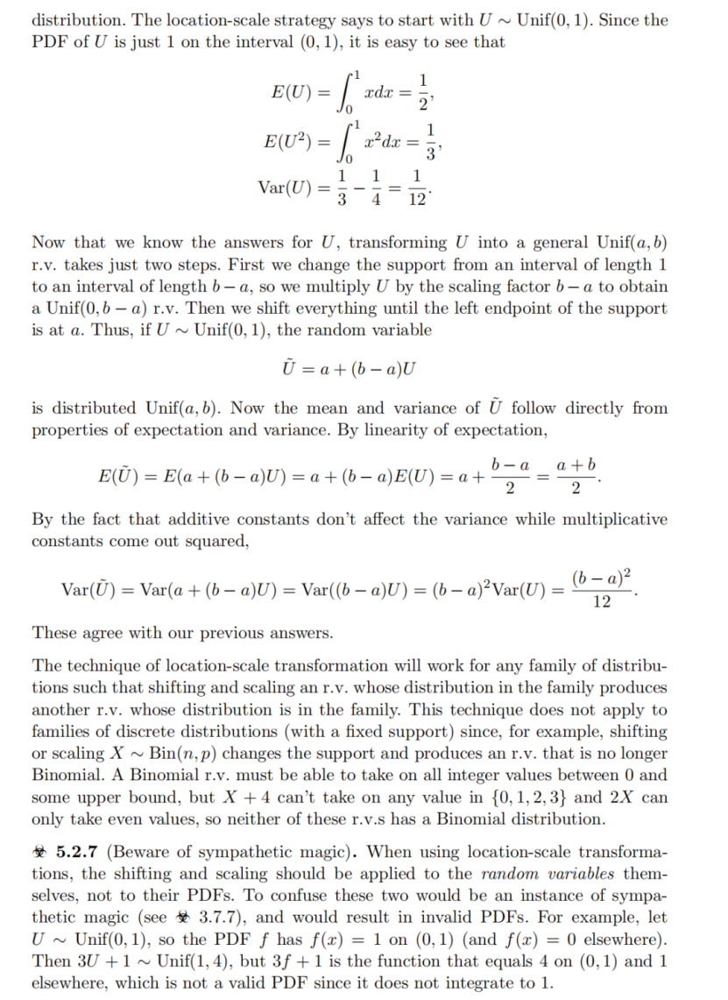
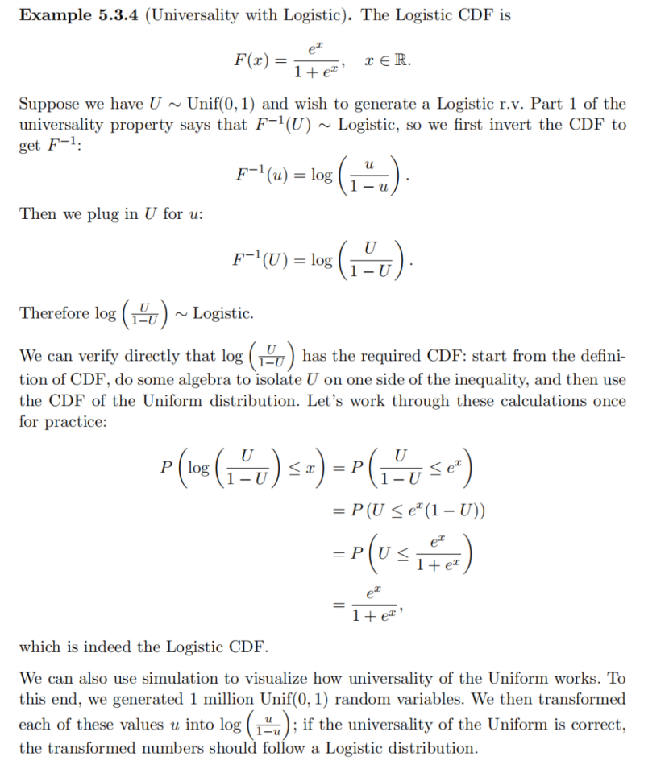
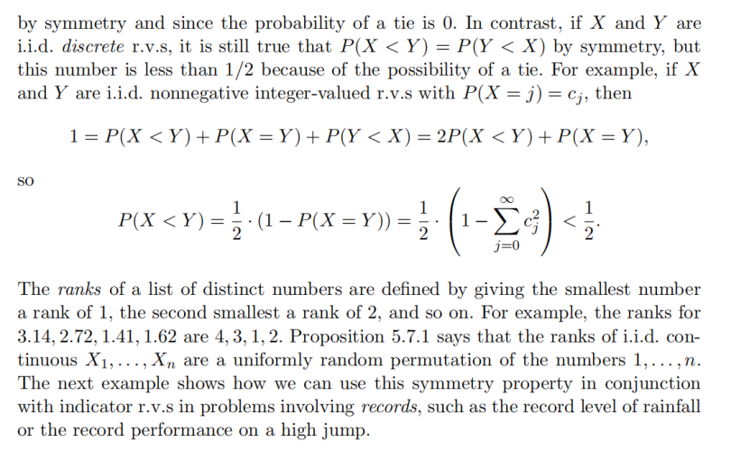
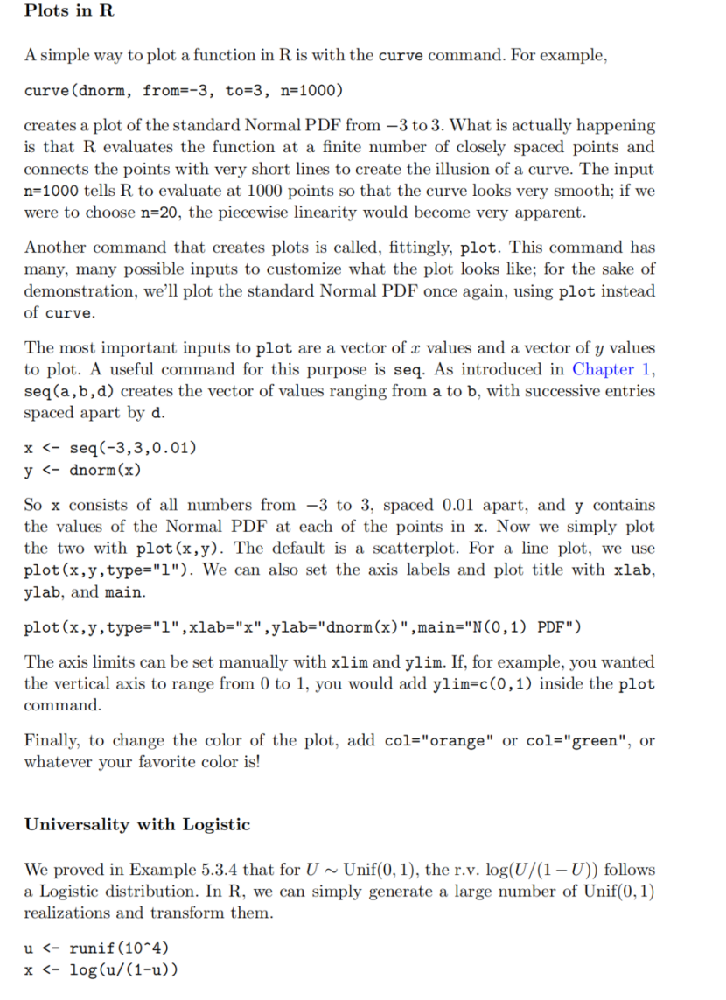

# CHAPTER 5


连续型随机变量与概率密度函数
--------------

> **内容概览：** 本节首先区分了离散型与连续型随机变量，并说明为何需要引入连续型随机变量；随后通过累计分布函数 (CDF) 的“跳跃”或“平滑”特性比较二者；接着给出连续型分布的严格定义，并引入其核心工具——概率密度函数 (PDF) 及其与 CDF 的互换关系；最后给出将 PDF 积分得到 CDF 的命题与证明。

* * *

### 1\. 离散 vs. 连续：为什么要引入连续型随机变量？

1.  **离散型随机变量 (discrete r.v.)** 只能取可列举的数值集合，例如掷骰子的点数 {1, 2, 3, 4, 5, 6}。
2.  **连续型随机变量 (continuous r.v.)** 可在某一实数区间  $(a,b)$ 、 $[0,\infty)$  甚至整条实数轴  $\mathbb{R}$  上取任意实数值。
3.  **动机与应用**
    *   现实世界许多量（温度、时间间隔、长度、电压等）天然连续。
    *   连续分布（Uniform、Normal、Exponential 等）不仅自身重要，还是构造其他分布（例如卡方、t、F 分布）的“积木”。

* * *

### 2\. 累计分布函数 (CDF) 的几何直觉

*   **离散型**：CDF 在每个支撑点处发生**跳跃**，其高度等于该点的概率质量  $P(X=x)$ 。
*   **连续型**：CDF **处处平滑单调**（图 5.1 右），**没有跳跃**。
    *   结果：对连续型 r.v. 来说， $P(X=x)=0$  对一切  $x$  成立，因为 CDF 无跳跃。
    *   实践意义：不再关心单点概率，而关心区间概率  $P(a<X\le b)=F(b)-F(a)$ 。

* * *

### 3\. 连续型分布的定义（Definition 5.1.1）

> **连续型随机变量 (continuous r.v.)**：若其 CDF  $F(x)$  在除了有限／可数端点外**处处可微**，则称其分布为连续型，随机变量称为连续型随机变量。

*   允许 CDF 在极少数端点连续但不可导，只要整体可导即可。
*   直观上：CDF 没有“台阶”，对几乎所有点**存在导数**。

* * *

### 4\. 概率密度函数 (PDF)（Definition 5.1.2）

1.  **定义**：给定连续型 r.v. 的 CDF  $F(x)$ ，其 PDF 定义为
    $$
    f(x)=F'(x)=\frac{d}{dx}F(x).
    $$
    支撑集  $\operatorname{supp}(X)$  为  $\{x\mid f(x)>0\}$ 。
2.  **与 PMF 的差异**
    | 特性 | PMF (离散)  $p(x)$  | PDF (连续)  $f(x)$  |
    | --- | --- | --- |
    | 值域 |  $[0,1]$ ，且  $\sum p(x)=1$  |  $[0,\infty)$  且可大于 1 |
    | 单点概率 |  $P(X=x)=p(x)>0$  可能非零 |  $P(X=x)=0$  一律为 0 |
    | 求区间概率 | 直接求和  $\sum p(x)$  | **积分**  $\int_a^b f(t)\,dt$  |
3.  **概率由积分给出**
    *   若  $f(x)$  在区间  $[a,b]$  上连续，则
        $$
         P(a<X\le b)=\int_a^b f(t)\,dt.
        $$
    *   **f(x) 不是概率本身**；其“面积”才对应概率。

* * *

### 5\. PDF ↔ CDF 的互换（Proposition 5.1.3）

**命题**：设 X 为连续型 r.v.，PDF 为  $f$ 。则 CDF 满

$$
F(x)=\int_{-\infty}^{x} f(t)\,dt.
$$

**证明要点**

1.  PDF 的定义告诉我们  $F'(x)=f(x)$ 。
2.  从微积分基本定理：若  $F$  是  $f$  的一个原函数，
    $$
     \int_{-\infty}^{x} f(t)\,dt = F(x)-F(-\infty)=F(x),
    $$
    因为  $F(-\infty)=\lim_{t\to-\infty}F(t)=0$ 。 ■

* * *

### 6\. 关键洞见与学习提示

1.  **零点概率**：在连续世界，单点概率无意义，必须用积分思想。
2.  **PDF ≥0 但能 >1**：例如在极窄区间集中的分布，密度可高，但整体面积仍为 1。
3.  **建模流程**
    1.  先选定 PDF  $f$ （满足非负、积分为 1）。
    2.  利用命题计算 CDF，进一步求期望、方差等。
4.  **桥梁作用**：PMF ↔ PDF、求和 ↔ 积分；离散与连续理论在形式上平行，但操作工具不同。

* * *

### 7\. 小结

*   **连续型随机变量**：其 CDF 在几乎处处可微——平滑无跳跃。
*   **概率密度函数**：为 CDF 导数；区间下的“面积”给出概率。
*   **基本互换公式**： $f=F'$ ， $F(x)=\int_{-\infty}^x f(t)\,dt$ 。这组公式让我们可以在 PDF 与 CDF 间自由切换，是后续推导期望、方差、经典分布性质的基石。

* * *

### 8\. 报错/补充

*   **清晰度检查**：两张截图内容基本完整、可读；如有遗漏的公式或示意图细节，请重新上传更高分辨率图像。


## Response:
连续型随机变量与概率密度函数（第二部分）
--------------------

> **本节概述：** 继续上一部分，本节侧重说明 “**PDF 积分得概率**” 的核心思想、端点是否列入区间对概率无影响的事实，以及一条判断 **PDF 合法性** 的两条准则。通过与离散型随机变量的类比、微积分基本定理的运用，奠定日后推导常见分布性质和计算概率的统一方法论。

* * *

### 1  “面积即概率”——从 CDF 累积到 PDF 积分

1.  **离散情形回顾**
    *   求  $P(X\le x)$  时，把 **PMF** 在所有  $\le x$  的点上求和（台阶累计）。
2.  **连续情形对应**
    *   CDF  $F(x)=\displaystyle\int_{-\infty}^{x}f(t)\,dt$  —— **把 PDF 在  $(-\infty,x]$ ** 上“累积面积”得到。
    *   由于微积分中“微分与积分互逆”，**CDF 与 PDF 提供了完全等价的分布信息**：
        $$
         F'(x)=f(x),\qquad F(x)=\int_{-\infty}^{x}f(t)\,dt.
        $$

> **直觉**：想象把 PDF 曲线下的面积“扫”到位置  $x$ ，扫过的全部面积就是事件  $X\le x$  的概率。

* * *

### 2  端点的取舍： $P(a<X<b)=P(a<X\le b)=\dots$ 

*   连续型 r.v. 满足  $P(X=x)=0$ 。
*   因此  $(a,b)$ 、 $(a,b]$ 、 $[a,b)$ 、 $[a,b]$  **四种写法概率完全相同**。
*   这在离散情形 **不** 成立，必须谨慎区分“含/不含端点”。

* * *

### 3  区间概率与一般区域概率的统一公式

1.  **基本区间**
    $$
     P(a<X\le b)=F(b)-F(a)=\int_a^b f(x)\,dx.
    $$
2.  **推广**  
    若  $A\subseteq\mathbb{R}$  为任何可测集合，则
    $$
     P(X\in A)=\int_A f(x)\,dx.
    $$
3.  **实用口诀**
    > _求概率 → 积分 PDF 在相应区间/区域_。

* * *

### 4  合法 PDF 的两条标准（Theorem 5.1.5）

| 条件 | 物理/概率学解释 | 若违背会怎样？ |
| --- | --- | --- |
| **非负性**  $f(x)\ge0$  | 概率不能为负 | 若  $f(x_0)<0$ ，在  $x_0$  附近积分会给出负概率 ⟹ 不合法 |
| **单位面积**  $\displaystyle\int_{-\infty}^{\infty} f(x)\,dx =1$  | 确保 “全部可能事件” 的概率为 1 | 若 <1：总概率不足；若>1：概率溢出 |

*   **证明要点**
    1.  非负性： $f(x)$  是 CDF 斜率，若出现负斜率意味着 CDF 在该点下降 ⟹ 概率减少，违反 CDF 单调不减的特性。
    2.  积分为 1： $\int_{-\infty}^{\infty}f=F(\infty)-F(-\infty)=1-0=1$ 。

* * *

### 5  学习提示与常见误区

| 误区 | 正确观念 |
| --- | --- |
| 把  $f(x)$  当作某点的概率 | **错误**！ $f(x)$  只是“密度”。必须在区间上 **积分** 才是概率 |
| 忽略端点是否取到 | 连续型可忽略，但做离散题时必须留意 |
| 忘记检查  $f$  是否积分为 1 | 任何自拟的 PDF 先验都必须归一化 |

* * *

### 6  总结

1.  **PDF–CDF 互换**：微分与积分互逆，信息等价。
2.  **概率计算公式**：
    $$
     P(a<X\le b)=\int_{a}^{b}f(x)\,dx,\quad P(X\in A)=\int_{A}f(x)\,dx.
    $$
3.  **端点零概率**：连续型随机变量令端点取舍无关紧要。
4.  **合法 PDF 判定**：非负 & 面积为 1。

* * *

### 7  报错/补充

*   本次两张截图内容清晰完整，已全部覆盖；若有其他图示或公式片段未上传，请补充。


例题透视：Logistic 分布示例及 PDF‑CDF 转换技巧
--------------------------------

> **本节概览：** 在验证“满足非负且单位面积”的函数  $f$  必为某随机变量的 PDF 之后，教材给出了两个实例——Logistic 与 Rayleigh。本次截图聚焦 **Logistic 分布**：先给出其 CDF，随后通过求导得到 PDF，并演示如何利用 PDF/CDF 计算区间概率  $P(-2<X<2)$ 。过程同时展示了两种做积分的思路：
> 
> 1.  直接利用已知 CDF 的差值；
> 2.  若只知 PDF，则用换元积分。
>     

* * *

### 1  任意满足两条准则的  $f$  都是某个 r.v. 的 PDF

*   **回顾准则**：
    1.   $f(x)\ge0$ （非负），
    2.   $\displaystyle\int_{-\infty}^{\infty} f(x)\,dx=1$ （归一化）。
*   **推论**：对任何这样的  $f$ ，按命题 5.1.3 积分即可构造出满足 CDF 性质的  $F(x)=\int_{-\infty}^x f(t)dt$ 。
*   **Universality of the Uniform（后续章节）**：用反函数  $F^{-1}\bigl(U\bigr)$ （其中  $U\sim\text{Unif}(0,1)$ ）可生成该分布的随机变量。

* * *

### 2  Logistic 分布

#### 2.1  CDF

$$
F(x)=\frac{e^{x}}{1+e^{x}} = \frac1{1+e^{-x}},\qquad x\in\mathbb{R}.
$$

> **性质速览**：对称于 0；极限  $F(-\infty)=0,\;F(\infty)=1$ ；形状 S‑型。

#### 2.2  PDF（对 CDF 求导）

$$
f(x)=F'(x)=\frac{e^{x}}{(1+e^{x})^{2}},\qquad x\in\mathbb{R}.
$$
*   **验证合法性**
    *    $f(x)>0$   $\forall x$ （显然）
    *   可用分部或查表证  $\displaystyle\int_{-\infty}^{\infty}f(x)dx =1$ 。

#### 2.3  区间概率示范： $P(-2<X<2)$ 

| 方法 | 步骤 | 结果 |
| --- | --- | --- |
| **CDF 差值** |  $F(2)-F(-2)$  |  $\displaystyle\frac{e^{2}}{1+e^{2}}-\frac{e^{-2}}{1+e^{-2}}\approx0.76$  |
| **PDF 积分** |  $\displaystyle\int_{-2}^{2} \frac{e^{x}}{(1+e^{x})^{2}}dx$   
换元  $u=1+e^{x}\Rightarrow du=e^{x}dx$  得  $\displaystyle\int_{1+e^{-2}}^{1+e^{2}}\frac1{u^{2}}\,du$  |  $\Bigl[-1/u\Bigr]_{1+e^{-2}}^{1+e^{2}}\approx0.76$  |

> 两法一致，体现了 **PDF ↔ CDF** 的一致性。

#### 2.4  图形解读（Figure 5.2）

1.  **左图：PDF**
    *   黑线为密度曲线，灰色阴影标出  $[-2,2]$  区域面积 ≈ 0.76。
2.  **右图：CDF**
    *   虚线示意  $x=-2,2$  处的高度差即概率；花括号直观标记这段“高度”。

* * *

### 3  Logistic 分布的更多要点（课件未展示，便于加深理解）

| 性质 | 表达式 / 说明 |
| --- | --- |
| **均值** | 0（对称性） |
| **方差** |  $\displaystyle\sigma^{2}=\frac{\pi^{2}}{3}$  |
| **尾部** | 比正态分布更厚 ⇒ 在极值理论、物流增长建模中常见 |
| **与 Logistic 回归** | Logistic 函数  $F(x)$  恰是二分类模型中的 Sigmoid；然而 Logistic 回归假设误差服从 Logistic 而非 Normal |

* * *

### 4  要点归纳

1.  **构造思维**：只要函数  $f$  满足“非负 + 面积 1”，就能通过积分得到合法 CDF，从而定义随机变量。
2.  **Logistic 示例**：
    *   CDF  $F(x)=\frac1{1+e^{-x}}$ ，PDF  $f(x)=\frac{e^{x}}{(1+e^{x})^{2}}$ 。
    *   计算概率可 CDF 差值或 PDF 积分，二者本质等价。
3.  **图示双验证**：面积与高度差的可视化强化“面积即概率”理念。

* * *

### 5  报错 / 补充说明

*   **清晰度**：截图内容完整、公式可读，无需补图。
*   **Rayleigh 分布**：教材下一例将介绍 Rayleigh；若后续截图涉及，请继续上传。


Rayleigh 分布示例与「面积=概率」再练
-----------------------

> **概况：** 延续上一节的 Logistic 例，教材用 **Rayleigh 分布** 进一步熟悉 PDF⇄CDF 的互换与积分求概率的操作。Rayleigh 是工程应用里常见的连续分布，尤其在无线通信、风速建模、杂散噪声幅值等场景。它的**支撑集仅限  $x>0$ **，与之前对称于实轴的 Logistic 形成对比。

* * *

### 1  Rayleigh 分布的定义与基本形式

1.  **CDF**（教材式，不带尺度参数  $\sigma$ ，默认  $\sigma=1$ ）：
    $$
     F(x)=1-e^{-x^{2}/2},\qquad x>0;\quad F(x)=0,\;x\le0 .
    $$
2.  **PDF**（对 CDF 求导）：
    $$
     f(x)=x\,e^{-x^{2}/2},\qquad x>0;\quad f(x)=0,\;x\le0 .
    $$
3.  **合法性验证速记**
    | 准则 | 检查 | 结论 |
    | --- | --- | --- |
    |  $f(x)\ge0$  |  $x\ge0$  时  $x e^{-x^{2}/2}\ge0$ ，其他处取 0 | √ |
    |  $\int_0^{\infty} f(x)dx=1$  | 令  $u=x^{2}/2\Rightarrow du = x\,dx$  ⟹  $\int_0^{\infty} e^{-u}du=1$  | √ |

* * *

### 2  区间／尾部概率的两种算法

*   **示例目标**： $P(X>2)$ 。
*   **方法 A（CDF差值，最快最稳）：**
    $$
     P(X>2)=1-F(2)=e^{-2^{2}/2}=e^{-2}\approx0.1353\;(\text{教材四舍五入 ≈0.14}).
    $$
*   **方法 B（直接积分 PDF）：**
    $$
     P(X>2)=\int_{2}^{\infty}x e^{-x^{2}/2}\,dx.
    $$
    换元  $u=-x^{2}/2\Rightarrow du=-x\,dx$ ：
    $$
     \int_{2}^{\infty} x e^{-x^{2}/2}\,dx =\int_{-2}^{-\infty}(-e^{u})\,du =e^{-2}.
    $$
*   **思维要点**
    1.  **有 CDF 用 CDF**。若 CDF 解析易评估，首选差值。
    2.  **无 CDF 或更复杂区间** 时，必须积分 PDF；掌握换元与分部技巧。

* * *

### 3  PDF 与 CDF 图形解读（Figure 5.3）

| 图 | 关键观察 | 直观链接 |
| --- | --- | --- |
| **左：PDF** | 峰值出现在  $x=1$ （后文注：模式  $x_{\text{mode}}=\sigma$ ）。灰色阴影  $[2,\infty)$  面积 = 尾部概率。 | **面积** ↔ **概率** |
| **右：CDF** | S 型但起点在  $x=0$ 。竖线  $x=2$  处 CDF 高度差（花括号）= 尾部概率。 | **高度差** ↔ **概率** |

* * *

### 4  Rayleigh 分布的进一步性质（补充课堂知识）

| 性质 |  $\sigma=1$  的表达式 | 说明 / 启示 |
| --- | --- | --- |
| **均值** |  $\mu = \sqrt{\frac{\pi}{2}}\approx1.253$  | 大于模式，右偏长尾 |
| **方差** |  $\sigma^{2}_{X}=2-\frac{\pi}{2}\approx0.429$  | 与标准差无关的“σ”概念勿混淆 |
| **模式** |  $x_{\text{mode}}=1$  | PDF 峰值位置 |
| **尺度化版本** | 若引入参数  $\sigma>0$ ： $f(x)=\dfrac{x}{\sigma^{2}}e^{-x^{2}/(2\sigma^{2})}$  | 调整水平伸缩，可拟合不同场景 |

> **工程应用小贴士**
> 
> *   **无线多径衰落**：接收信号幅值 ≈ Rayleigh，因 I/Q 分量均 ~  $N(0,\sigma^{2})$ 。
> *   **风速分布**：实测风速常近似 Rayleigh，尤其在低地形起伏区域。
>     

* * *

### 5  Rayleigh vs. Logistic：对比反思

| 维度 | Logistic（对称） | Rayleigh（单边重尾） | 体会 |
| --- | --- | --- | --- |
| 支撑集 |  $\mathbb{R}$  |  $(0,\infty)$  | 分布范围先天不同 |
| CDF 形状 | S 型，对称 | S 型，左截断 | 端点性质对公式推导有影响 |
| 单点概率 | 全为 0 |  $x\le0$  处 PDF=0，CDF=0 | “支撑” 概念再加强 |
| 应用 | 分类 Sigmoid、经济增长 | 信号幅度、风速 | 选择分布时需考虑物理含义 |

* * *

### 6  小结

1.  **任意符合法则的  $f$ ** ↔ **可积分成合法 CDF** ↔ **可生成随机变量**。
2.  **Rayleigh 示例** 强化：
    *   先导后差/先差后导的灵活性；
    *   尾概率    $\;1-F(x)$  在单调 CDF 下计算极便捷。
3.  **“面积/高度差 = 概率”** 图形化直观再加固。
4.  拓展性：Rayleigh 带尺度参数广用工程；熟练它让你能快速识别并处理 **半正支撑、单峰右偏** 的数据。

* * *

### 7  报错 / 补充

*   本段截图已完整覆盖教材示例，若还有后续章节（如 Section 5.2 期望与方差的计算或 5.3 Universality of the Uniform）请继续上传。


!


### 概率密度函数的**单位直觉**与**面积采样模拟**

> **概况：** 本节通过两个“Intuition”小节（5.1.8 与 5.1.9）回答了两个常见疑惑：
> 
> 1.  ** $f(x)$  到底代表什么？** —— 它不是概率，而是“每单位长度的概率密度”。
> 2.  **如何凭直觉“画图取样”生成连续随机变量？** —— 在 PDF 曲线下**随机抛点**，横坐标就是所需样本。
>     

* * *

1\. 单点处的  $f(x)$  如何理解？——“极小区间概率”近似
-----------------------------------

| 关键式 | 含义 |
| --- | --- |
|  $\displaystyle P\bigl(x-\tfrac{\varepsilon}{2} < X < x+\tfrac{\varepsilon}{2}\bigr)=\int_{x-\varepsilon/2}^{x+\varepsilon/2} f(t)\,dt\approx f(x)\,\varepsilon$  | 当  $\varepsilon\to0$  时， $f(t)$  在极小区间内接近常值  $f(x)$ ，面积≈矩形面积。 |

*   **直觉**： $f(x)$  的“高度”并非概率，而是**把概率密集到单位长度**后的“密度”。
*   只要区间足够短，“面积≈高×宽” ⇒  $f(x)$  近似给出“**单位长度的概率**”。
*   **与离散 PMF 对比**：PMF 直接给单点概率；PDF 只能给“概率密度”，需乘长度。

* * *

2\.  $f(x)$  的**量纲**（units）——为什么叫“density”？
-------------------------------------------

| 量 | 物理单位示例 | 说明 |
| --- | --- | --- |
| 随机变量  $X$  | cm（长度） | 具有实际量纲 |
| CDF  $F(x)$  | 无量纲 | 概率 ≤ 1 |
| PDF  $f(x)=F'(x)$  | cm $^{-1}$  | “每 cm 的概率” |
| 积分  $\int_a^b f(x)\,dx$  | 无量纲 | “密度 × 长度 = 概率”  
忘记  $dx$  就失去量纲平衡 |

> **核对答案是否合理的小技巧**：检查单位！若最后算出的“概率”带有 cm、s 等物理单位，一定有哪一步漏乘或漏除长度。

* * *

3\. 面积采样法（Intuition 5.1.9）——“抛点”生成随机变量
--------------------------------------

1.  **思想**
    *   在 PDF 曲线下方、x 轴与  $x$  范围外壳围成的**面积 = 1** 的二维区域中，**均匀随机抽取一点  $(x,y)$ **。
    *   令输出随机变量  $X = x$ 。
2.  **为何可行？**
    *   对任意区间  $[a,b]$ ，其在曲线下的面积 =  $P(a\le X\le b)$ 。
    *   点  $(x,y)$  落入该垂直条形区域当且仅当  $x\in[a,b]$ ，从而横坐标分布满足目标 PDF。
3.  **图示 (Fig 5.4)**
    *   灰色阴影表示  $[3,6]$  的条形；若抽得点在此阴影，下落  $X$  恰分布于该区间。
4.  **实践拓展**
    *   此法即“**均匀-拒绝采样**”思想的雏形：先在简单区域均匀采样，再映射到复杂分布。
    *   若曲线最高点未知，可先找上界再做接受–拒绝。

* * *

4\. 关键要点 & 常见误区
---------------

| 误区 | 正解 |
| --- | --- |
| “ $f(3)=0.2$  表示  $P(X=3)=0.2$ ” | **错**！单点概率 0；应理解为“约 0.2 × 0.01 = 0.002 的概率落在长度 0.01 的小区间”。 |
| 忽视量纲导致概率>1 或 <0 | 保持公式两侧**量纲一致**；积分式  $\int f(x)\,dx$  才能给出无量纲概率。 |
| 面积采样法 “只是画图示意，不具数值意义” | 实则可实现：在计算机上对复杂 PDF 进行随机采样的基础。 |

* * *

5\. 小结
------

*   ** $f(x)$ ** → **每单位长度的概率密度**；通过“极小区间近似”可直观解释其大小。
*   **量纲思维** 是检错利器： $f(x)$  单位为 “概率 × 长度 $^{-1}$ ”；乘  $dx$  才还原成概率。
*   **面积采样** 揭示“概率 = 面积”在随机抽样上的直接应用，也是后续接受–拒绝算法的几何原理。

* * *

### 报错/补充

*   当前截图已覆盖 Intuition 5.1.8–5.1.9 全部内容；若后续章节（如 5.2 期望、5.3 均匀分布的普适性）仍需解析，请继续上传对应图片。


连续型随机变量的期望与 LOTUS
-----------------

> **概要：** 本节正式把“期望（平均值）”的概念从离散型推广到连续型随机变量，并给出 **期望的线性性质** 与 **连续版 LOTUS（Law Of The Unconscious Statistician）**。期望不仅是“概率质量分布的质心”，在连续情形下同样可视为 **PDF 的平衡点**。

* * *

### 1\. 期望的定义（Definition 5.1.10）

$$
E(X)=\int_{-\infty}^{\infty} x\,f(x)\,dx.
$$

| 关键词 | 细节解析 |
| --- | --- |
| **类比离散情形** | 把  $\sum x\cdot p(x)$  中的求和  $\sum$  换成积分  $\int$ ，把 PMF  $p(x)$  换成 PDF  $f(x)$ 。 |
| **积分区间** | 理论上全体  $(-\infty,\infty)$ 。若  $X$  支撑有限（如 Rayleigh： $x>0$ ），可直接在支撑上积分。 |
| **存在性** | 并非所有 PDF 都保证 (\\int |
| **量纲检验** | 若  $X$  单位为 cm，则  $x f(x)\,dx$  单位为 cm·cm $^{-1}$ ·cm = cm ⇒  $E(X)$  单位正确。 |
| **几何解释** | 见 Fig 5.5：在 Rayleigh PDF 下，灰色三角指示“质心”位置  $\mu=\sqrt{\pi/2}\approx1.25$ 。此图强化“期望=平衡点”直觉。 |

* * *

### 2\. 期望的核心性质

1.  **线性性（Linearity of Expectation）**
    $$
     E(aX+bY)=aE(X)+bE(Y).
    $$
    连续情形与离散完全一致。推导仅用积分线性： $\int (a x + b y)f_{X,Y}=a\int x f + b\int y f$ 。
2.  **对 PDF 的可视化平衡**
    *   把 PDF 曲线看成“薄板”(密度∝概率)。
    *   期望是能让整个板“杠杆平衡”的点。
    *   若 PDF 右偏（如 Rayleigh），期望 > 模式；若 PDF 对称（如 Logistic），期望=中位=模式。

* * *

### 3\. LOTUS（连续版）——Theorem 5.1.11

$$
E\bigl(g(X)\bigr)=\int_{-\infty}^{\infty} g(x)\,f(x)\,dx.
$$

| 要点 | 说明 |
| --- | --- |
| **何时用？** | 当只知道  $X$  的 PDF，但想求  $g(X)$ （如  $X^{2}$ 、 $\sin X$ 、 $\mathbb{1}_{\{X>c\}}$  等）期望时。 |
| **优势** | 无需先求  $g(X)$  的 PDF，再积分；直接把  $g(x)$  乘  $f(x)$  积分即可。 |
| **经典应用** | 方差公式  $Var(X)=E(X^{2})-[E(X)]^{2}$ ；动量矩、生成函数、熵  $E(-\log f(X))$ 。 |
| **与离散版对比** | 离散 LOTUS： $E(g(X))=\sum g(x)p(x)$ 。同样是“把原变量的权重函数换成  $g(x)$ ”。 |

* * *

### 4\. 跨章节衔接与学习提示

| 连接点 | 未来用途 |
| --- | --- |
| **Uniform 的普适性（Section 5.3）** | 利用  $U\sim Unif(0,1)$  + 反函数  $F^{-1}(U)$  生成任意分布后，可直接套 LOTUS 求  $E(g(X))$ 。 |
| **后续分布的期望** | Uniform、Normal、Exponential 等命名分布都将用 Definition 5.1.10 直接给出  $\mu$  与 higher moments。 |
| **计算策略** | 先判收敛 → 选最易积分形式 → 检查单位 → 代入线性或 LOTUS。 |

* * *

### 5\. 小结

1.  **期望定义**： $\displaystyle E(X)=\int x f(x)dx$ 。
2.  **几何直觉**：PDF 的**质心**；图像平衡点。
3.  **性质**：线性不变、单位正确。
4.  **LOTUS**： $\displaystyle E\bigl(g(X)\bigr)=\int g(x)f(x)dx$ ，一招通吃各种函数期望。
5.  有了这些工具，后续处理任何连续分布的均值、方差、矩、尾概率都会“套路化”——先写 PDF，再套公式。

* * *

### 6\. 报错

*   本次截图文字与公式清晰完整，无遮挡与遗漏，解释亦已涵盖；若仍有细节未包含，请上传对应部分。


5.2 Uniform 分布
--------------

> **本节概览：** Uniform（均匀）随机变量是“在区间  $(a,b)$  内随处等可能”最直观的连续模型。其 PDF 在区间内保持常数、CDF 呈线性爬坡，概率与区间长度成正比；即使在子区间上作条件化，仍保持均匀——这是 Uniform 独有的“无记忆式”局部一致性。

* * *

### 1  Uniform 分布的正式定义（Definition 5.2.1）

令  $U$  为连续随机变量，若存在常数  $a<b$ ，使其 **概率密度函数** 为

$$
f(x)= \begin{cases} \dfrac{1}{\,b-a\,}, & a<x<b,\\[4pt] 0, & \text{otherwise}, \end{cases}
$$

则称  $U\sim\mathrm{Unif}(a,b)$ 。

| 直观要点 | 数学验证 |
| --- | --- |
| “在  $(a,b)$  任何长度相等的子区间概率相等” | 该  $f$  是常数 → 任意子区间面积只与长度相关 |
| PDF 合法性 | 面积： $(b-a)\times\dfrac1{b-a}=1$  ✓ |

**累积分布函数（CDF）** 由面积累积得到

$$
F(x)= \begin{cases} 0, & x\le a,\\[4pt] \dfrac{x-a}{b-a}, & a<x<b,\\[4pt] 1, & x\ge b . \end{cases}
$$

* * *

### 2  标准均匀 Unif(0,1)

最常用特例： $(a,b)=(0,1)$ 。

$$
f(x)=1,\;F(x)=x,\quad 0<x<1.
$$

Fig 5.6（教材）左图显示高为 1 的矩形 PDF；右图 CDF 为 45° 线。该分布是随机数生成器的核心 “白纸”，后续章节的 **逆变换采样法  $F^{-1}(U)$ ** 建基于此。

* * *

### 3  “概率 ∝ 长度”——Uniform 的核心性质（Proposition 5.2.2）

> **命题：** 设  $U\sim\text{Unif}(a,b)$ ，若  $(c,d)\subset(a,b)$ ，长度  $l=d-c$ ，则
> 
> $$
> P(c<U<d)=\frac{l}{b-a}.
> $$

*   **证明精要**： $\displaystyle \int_{c}^{d}\frac1{b-a}dx = \frac{l}{b-a}$ 。
*   **含义**：子区间长度翻倍 → 概率翻倍；“一寸概率一寸金”。

* * *

### 4  条件均匀性（Proposition 5.2.3）

> **命题：** 给定  $U\sim\text{Unif}(a,b)$ ，且已知  $U\in(c,d)\subset(a,b)$ ，则
> 
> $$
> U\mid \bigl(U\in(c,d)\bigr)\ \sim\ \text{Unif}(c,d).
> $$

| 证明思路 | 关键步骤 |
| --- | --- |
| 利用条件 CDF | 对  $u\in(c,d)$ ， |
|  $P(U\le u\mid U\in(c,d))=\dfrac{P(c<U\le u)}{P(c<U<d)}=\dfrac{u-c}{d-c}$ . |  |
| 解析结果 | 条件 CDF 呈线性 → PDF 常数  $\frac1{d-c}$  → Unif(c,d). |

> **意义**：Uniform 是唯一在子区间上仍保持 Uniform 的分布；这为 **两步采样**、**截断采样** 提供便利。

* * *

### 5  几何与工程直觉

1.  **PDF**：高度  $1/(b-a)$ ，面积 1；“概率密度 = 高度 × 宽度”。
2.  **CDF**：斜率恒  $1/(b-a)$ ，所以概率与长度成线性比例。
3.  **期望 & 方差**
    $$
    E(U)=\frac{a+b}{2},\qquad Var(U)=\frac{(b-a)^{2}}{12}.
    $$
    *   期望在区间中心；
    *   方差随长度平方增长，分布越“宽”越分散。
4.  **模拟意义**：多数编程语言随机库 `rand()` 即  $\mathrm{Unif}(0,1)$ 。其他连续分布常由其变换而来。

* * *

### 6  学习提示与常见误区

| 误区 | 正确观念 |
| --- | --- |
| 以为 Uniform 仅限 (0,1) | 任何  $(a,b)$  均可；尺度平移不改变“等可能”特性 |
| 忽视长度比例 | Uniform 唯一满足“等长度 → 等概率”，别的分布非线性 |
| 条件分布一定改形状 | Uniform 在子区间仍 Uniform，这是它的**特异性** |

* * *

### 7  小结

*   **定义**： $f(x)=1/(b-a)$  on  $(a,b)$ 。
*   **属性**：概率与长度成正比；条件 Uniform 仍 Uniform。
*   **作用**：随机数发生器基石；逆变换法桥梁。

* * *

### 8  报错 / 补充

*   本段截图完整；如需 Uniform 期望、方差推导细节或逆变换采样例题，请继续上传相应图片。


**Uniform 分布（二）：长度比例、条件均匀性与均值‑方差推导**
====================================

> **内容概览：** 本节基于 _Example 5.2.4_ 和后续推导，完成对 Uniform 分布核心性质的实战演示，并给出期望、方差的两种推导思路。最后引入 **location‑scale 变换** 的统一框架，为后续各分布的推广埋下伏笔。

* * *

1  长度决定概率：Example 5.2.4 的直观演示
-----------------------------

*   **场景设定**： $U\sim\text{Unif}(0,1)$ 。
*   **命题回顾**：对 Uniform，任意子区间  $(c,d)$  的概率 **仅与长度**  $l=d-c$  成正比：
    $$
     P(c<U<d)=l.
    $$
*   **实例验证**
    | 子区间 | 长度  $l$  | 结果 |
    | --- | --- | --- |
    |  $(0,0.3)$  | 0.3 |  $P=0.3$  |
    |  $(0.3,0.6)$  | 0.3 |  $P=0.3$  |
    | 其他长度为 0.3 的区间 | 0.3 | 同理  $P=0.3$  |

> **结论**：在  $\text{Unif}(0,1)$  中，概率 = 区间长度。该性质将在蒙特卡洛积分、随机采样校验中频繁出现。

* * *

2  条件均匀性：更新信息仍“等可能”
-------------------

*   **条件信息**：得知  $U\in(0.4,0.7)$ 。
*   **结论**：
    $$
     U \;\big|\; (U\in(0.4,0.7))\ \sim\ \text{Unif}(0.4,0.7).
    $$
    即 **在子区间内部依旧均匀**。
*   **概率示例**
    *   求  $P\bigl(U\in(0.4,0.6)\,\big|\,U\in(0.4,0.7)\bigr)$ ：
        $$
         \frac{\text{长度 }0.2}{\text{长度 }0.3}= \frac23.
        $$
    *   求  $P\bigl(U\in(0,0.6)\,\big|\,U\in(0.4,0.7)\bigr)$ ：子区间  $(0,0.4)$  被剔除，同理只看  $(0.4,0.6)$ ，仍为  $\tfrac23$ 。

> **启示**：Uniform 拥有“子区间再均匀”特性，是进行 **截断采样** 与 **连续均匀再分块** 的基础。

* * *

3  期望与方差的完整推导
-------------

### 3.1 期望  $E(U)$ 

$$
 E(U)=\int_{a}^{b} x\cdot \frac1{b-a}\,dx =\frac1{b-a}\left[\frac{x^{2}}{2}\right]_{a}^{b} =\frac{b^{2}-a^{2}}{2(b-a)} =\frac{a+b}{2}.
$$

> **直觉**：PDF 高度恒定，质心落在区间中点——与离散等权平均完全一致。

### 3.2 使用 LOTUS 先求  $E(U^{2})$ 

$$
 E(U^{2}) = \int_{a}^{b} x^{2}\frac1{b-a}\,dx =\frac1{b-a}\left[\frac{x^{3}}{3}\right]_{a}^{b} =\frac{b^{3}-a^{3}}{3(b-a)}.
$$

### 3.3 方差  $\operatorname{Var}(U)$ 

$$
 \operatorname{Var}(U)=E(U^{2})-\bigl(E(U)\bigr)^{2} =\frac{b^{3}-a^{3}}{3(b-a)}-\left(\frac{a+b}{2}\right)^{2} =\frac{(b-a)^{2}}{12}.
$$

> **结果记忆小技巧**：区间长度  $\ell=b-a$ ，则
> 
> $$
> E(U)=\frac{a+b}{2},\qquad \sigma^{2}=\frac{\ell^{2}}{12}.
> $$

* * *

4  更快的“location–scale 变换”法
--------------------------

### 4.1 核心思想

*   对任意随机变量  $X$ ，设
    $$
     Y=\sigma X+\mu\quad(\sigma>0),
    $$
    则  $Y$  为 **location–scale 变换**（Definition 5.2.5）。
*   **对 Uniform**：平移（ $\mu$ ) 改变位置，缩放（ $\sigma$ ) 改变长度，仍是 Uniform。

### 4.2 直接由  $\text{Unif}(0,1)$  推出均值方差

1.  令  $U\sim\text{Unif}(0,1)$ ，取  $Y=(b-a)U+a\Rightarrow Y\sim\text{Unif}(a,b)$ 。
2.  已知  $\displaystyle E(U)=\frac12,\;Var(U)=\frac{1}{12}$ 。
3.  用线性运算性质：
    $$
     E(Y)= (b-a)\frac12 + a=\frac{a+b}{2},\quad Var(Y)=(b-a)^{2}\frac{1}{12}=\frac{(b-a)^{2}}{12}.
    $$

> **优点**：免积分；任意分布的 location–scale 族都可用此技巧快速获得新参数。

* * *

5  位置‑尺度（location–scale）变换：统一视角
-------------------------------

| 符号 | 解释 |
| --- | --- |
|  $\mu$  | **location**：整体平移量，决定“中心” |
|  $\sigma$  | **scale**：拉伸/压缩因子，控制“宽度” |
| 例 | 若  $X\sim\Phi(0,1)$ （标准正态），则  $Y=\sigma X+\mu\sim\mathcal{N}(\mu,\sigma^{2})$ 。Uniform、Normal、Exponential（只缩放）均有相似结构 |

> **后续章节应用**：掌握 location–scale 可快速构造新分布、推导统计量、做参数估计 (MLE) 与蒙特卡洛采样。

* * *

6  小结与要点回顾
----------

1.  **长度 → 概率**：Uniform 的概率完全由区间长度决定。
2.  **条件分布仍 Uniform**：在任何子区间内保持均匀。
3.  **均值、方差**：
    $$
     E=\frac{a+b}{2},\qquad Var=\frac{(b-a)^{2}}{12}.
    $$
4.  **两条推导路**
    *   直接积分 + LOTUS；
    *   从  $\text{Unif}(0,1)$  经 location–scale 变换。
5.  **Location–scale 框架**：统一理解多分布族的“平移‑缩放”规律，极大简化推导和实现。

* * *

### 7  报错 / 待补充

* 截图内容已覆盖 Example 5.2.4、期望方差推导及 Definition 5.2.5。

* 若后续还有关于 **Exponential 分布** 或 **Normal 分布** 的章节，请继续上传相关图片。

  

## 
已思考 22 秒

收到更多有关连续随机变量的截图，主要涉及5.2节的均匀分布，以及5.2.4示例（位置-尺度变换）和相关的5.2.6、5.2.7笔记。根据用户的要求，我将继续用中文提供详细笔记。这次会总结位置-尺度变换的内容，特别是与期望和方差计算的关系，并警示需要注意“心灵魔法效应”。接下来将整合之前的均匀分布内容，按要求做详细解析。

完成

Uniform 分布（三）：位置‑尺度变换、期望‑方差的“一步推导”与常见误区
---------------------------------------

> **本节概览：** 继续 Uniform 章节，我们聚焦于位置‑尺度（location‑scale）思想：
> 
> 1.  解释 **线性变换** 如何保持 Uniform 性质，而非线性变换则通常破坏均匀；
> 2.  演示先在 **标准 Unif (0, 1)** 上求期望/方差，再经位置‑尺度快速得到 **Unif (a, b)** 的结果；
> 3.  指出“只改变变量，不要直接改 PDF 曲线高度”的常见错误（⚠ sympathetic magic）。
>     

* * *

### 1  位置‑尺度变换的基本结论（注 5.2.6）

*   **线性变换**  $Y=cX+d,\;c>0$ ：
    $$
     X\sim\text{Unif}(a,b)\quad\Longrightarrow\quad Y\sim\text{Unif}(ca+d,\,cb+d).
    $$
    *   **平移**  $d$ ：整体向右/左移动，改变“位置” (location)。
    *   **缩放**  $c$ ：拉伸或压缩区间长度，改变“尺度” (scale)。
*   **非线性变换** （例如  $Y=X^{2}$ ）：一般 **不再均匀**，仅改变支撑集。
    *   例：若  $X\sim\text{Unif}(a,b),\,0\le a<b$ ，则  $Y=X^{2}$  支撑为  $(a^{2},b^{2})$ ，但分布密度不恒定。

> **策略性启示**：先在最简单的 Unif (0, 1) 上求任何公式，再用线性变换映射到一般  $(a,b)$ 。

* * *

### 2  用 Unif (0, 1) 一步推导期望与方差

1.  **标准分布**  $U\sim\text{Unif}(0,1)$ ：PDF 为 1（区间 (0, 1)）。
    $$
    E(U)=\int_{0}^{1}x\,dx=\tfrac12,\qquad E(U^{2})=\int_{0}^{1}x^{2}dx=\tfrac13,\qquad Var(U)=\tfrac13-\left(\tfrac12\right)^{2}=\tfrac1{12}.
    $$
2.  **线性映射到  $(a,b)$ **
    $$
     \widetilde{U}=a+(b-a)U\;\;\Longrightarrow\;\;\widetilde{U}\sim\text{Unif}(a,b).
    $$
    *   **期望**（线性性）
        $$
         E(\widetilde{U})=a+(b-a)E(U)=a+\tfrac{b-a}{2}=\tfrac{a+b}{2}.
        $$
    *   **方差**（常数不影响方差，系数要平方）
        $$
         Var(\widetilde{U})=(b-a)^{2}Var(U)=\tfrac{(b-a)^{2}}{12}.
        $$
    *   结果与前一节的积分推导一致，但**更快捷**。

* * *

### 3  位置‑尺度家族概念与适用范围

| 分布类型 | 线性变换后仍在原家族？ | 备注 |
| --- | --- | --- |
| 连续 Uniform、Normal、Cauchy… | **是**（location‑scale 家族） | 参数变化即可描述新分布 |
| 离散 Binomial、Poisson（有固定支持） | **否** | 平移/缩放会破坏支持的整数结构 |

> 位置‑尺度思想在生成样本、做极值归一化、最大似然估计中极为常用。

* * *

### 4  警惕 “sympathetic magic”——只改变量，别直接改 PDF（注 5.2.7）

*   **正确**： $3U+1$ （对随机变量做线性变换） ⇒  $\text{Unif}(1,4)$ 。
*   **错误**： $3f(x)+1$ （直接对 PDF 加倍并平移） ⇒ 不再是 PDF（面积 ≠ 1）。

> **记忆口诀**：**“变随机变量，不动密度曲线”**。

* * *

### 5  统一回顾与学习要点

1.  **线性变换保均匀**，非线性会改变分布形状。
2.  **期望 = 区间中点**，**方差 = 长度² / 12**，可用位置‑尺度秒推。
3.  任何位置‑尺度家族（Normal、Cauchy、Student‑t…）都能“先标准化 → 后还原”加速计算。
4.  操作为 **变量级**，绝不直接对 PDF 做同样变换。

* * *

### 6  报错 / 后续内容

*   当前截图（5.2.6–5.2.7）已完整解析。如需继续学习 **5.3 Universality of the Uniform** 或下一分布（Normal、Exponential）请继续上传课件。


5.3 Uniform 的普适性（Universality of the Uniform）
---------------------------------------------

> **概况**
> 
> *   **核心命题**：只要有一份 **Unif (0, 1)** 随机数，就能“逆 CDF”生成任何**连续分布**的随机变量；反过来，取任意随机变量的 **CDF 值** 又必定落在 (0, 1)，且本身服从 **Unif (0, 1)**。
> *   **同义称呼**：概率积分变换 (probability integral transform)、逆变换采样 (inverse transform sampling)、分位数变换 (quantile transformation)、模拟的基本定理 (fundamental theorem of simulation) 等。
>     

* * *

### 一、Theorem 5.3.1 （Uniform 的普适性）

设  $F$  是**连续且在其支撑上严格单调递增**的 CDF（保证  $F^{-1}$  存在）。则：

| 方向 | 结论 | 思想与证明要点 |
| --- | --- | --- |
| **1. 生成目标分布** | 令  $U\sim\mathrm{Unif}(0,1)$ ，设  $\displaystyle X=F^{-1}(U)$ ，则 ** $X$  的 CDF 就是  $F$ **。 |  $P(X\le x)=P\bigl(U\le F(x)\bigr)=F(x)$ 。利用  $U$  的 CDF 为  $u$ 。 |
| **2. 回到 Uniform** | 令随机变量  $X$  的 CDF 为  $F$ ，则 ** $Y=F(X)\sim\mathrm{Unif}(0,1)$ **。 | 对  $y\in(0,1)$ ， $P(Y\le y)=P\bigl(F(X)\le y\bigr)=P\!\bigl(X\le F^{-1}(y)\bigr)=F\!\bigl(F^{-1}(y)\bigr)=y$ 。 |

> **图像直觉**
> 
> 1.  _逆函数采样_：把 (0,1) 的横轴拉伸/压缩成目标分布的横坐标。
> 2.  _概率积分变换_：用 CDF 把原横轴“折叠”到 (0,1) 上，高度即概率累计。
>     

* * *

### 二、条款 5.3.2 ——“别被记号绕晕”

*   把 **随机变量  $X$ ** 代入 **它自己的 CDF**： $Y=F(X)$ 。
*   易误写成 “ $F(x)=P(X\le x)=1$ ”（将变量当成常数）；正确做法是：
    1.  先写 CDF 函数的普通表达式  $F(x)$ 。
    2.  再把  $x$  换成随机变量  $X$ ，得到新随机变量  $F(X)$ 。
*   例：若  $F(x)=1-e^{-x}\;(x>0)$ ，则  $F(X)=1-e^{-X}$  而 **非** “ $F(X)=1$ ”。

* * *

### 三、实操视角：从 Uniform 生成任意分布

1.  **给定目标 CDF  $F$ **：
    1.  产生  $U\sim\mathrm{Unif}(0,1)$ （调用随机库）。
    2.  计算  $X=F^{-1}(U)$ 。
    3.   $X$  即服从  $F$ 。
2.  **离散或不可逆情形**：
    *   若  $F$  不可解析求逆，可用数值查表、分段插值；或转用 **接受‑拒绝采样**、**MCMC** 等高级方法。
3.  **代码片段示意（Python + SciPy）**
    ```python
    import numpy as np
    from scipy.stats import norm  # 目标：标准正态
    U = np.random.rand(10000)        # Uniform(0,1)
    X = norm.ppf(U)                  # ppf = F^{-1}
    ```

* * *

### 四、从任意分布“标准化”回 Uniform 的用途

*   **模型诊断**：检验残差  $F(\hat X)$  是否近似 Uniform，以评估拟合优度。
*   **概率图 (Q–Q plot)**：比较经验分布与理论分布；点应落近于  $y=x$ 。
*   **随机数检验**：把伪随机序列输进 CDF，看结果是否 Uniform 来测试生成器质量。

* * *

### 五、知识串联与总结

1.  **逆变换采样** 是位置‑尺度思想的进一步推广，Uniform 成为一切连续分布的“母板”。
2.  **双向性** 构成闭环：
    *   Uniform → 任意连续分布（逆 CDF）；
    *   任意分布 → Uniform（CDF）。
3.  **条件**： $F$  连续且严格单调（确保可逆）；若有平坦段需额外处理或使用随机化逆函数。
4.  与前一节 **location‑scale** 合用，可高效地把 Unif(0,1) 变到  $\text{Unif}(a,b)$ ，再经逆 CDF 至目标分布。

* * *

### 六、报错／补充

*   本次两张截图（Theorem 5.3.1‑5.3.2 与证明）内容已完整解析。
*   若后续继续介绍 **常见分布（Normal、Exponential 等）**、或展示 **逆 CDF 实例代码**，请上传相应课件。


百分位数与 Uniform 普适性的直观联系
----------------------

> **本节标题：** _Example 5.3.3 – Percentiles, Quantiles & Universality of the Uniform_  
> **内容概况：** 利用考试成绩与百分位数（percentile）的日常例子，深化量化函数  $F^{-1}$ （quantile function）及定理 _Universality of the Uniform_ 的含义：
> 
> 1.  **百分位数 = CDF 值**；2. **成绩 = 量化函数  $F^{-1}$  的输出**；3. **全体学生的百分位数分布必为  $\mathrm{Unif}(0,1)$ **。这三点共同说明了为什么 “把  $X$  代入自身 CDF 得到 Uniform” 以及 “逆 CDF 把 Uniform 变回原分布” 既自然又必然。
>     

* * *

### 1  场景设定与术语

1.  **考试成绩随机变量  $\mathbf{X}$ **
    *   取值区间近似连续  $(0,100)$ ；真实成绩离散，但人数庞大 → 可用连续建模。
    *   设其 CDF 为  $F$ ，且在区间上**严格递增**（方便定义反函数）。
2.  **百分位数 (percentile)** = **分位数 (quantile)**
    *   给定分数  $x$ ，其百分位数是  $F(x)$ ：即低于  $x$  的学生比例。
    *   反向：给定百分位数  $p\in(0,1)$ ，对应分数为量化函数  $F^{-1}(p)$ 。

> **例子**
> 
> *   中位数  $=60$  ⇒  $F(60)=0.5$ 。
> *   Fred 得 72 分 ⇒ 其百分位数  $=F(72)$  ∈ (0.5, 1)。
>     

* * *

### 2  百分位分布为何 Uniform？

*   **随机选择一名学生** → 其分数为  $X$ 。
*   令 ** $Y=F(X)$ **（即取其百分位数）。
*   由 _Universality of the Uniform_：
    $$
     Y\sim\mathrm{Unif}(0,1).
    $$
    因为 **CDF 把任何分布拉平到 (0,1)**：
    *   10% 的学生百分位数在 0–0.1；
    *   再 10% 在 0.1–0.2；…… 完全均匀。
*   **解释**：虽然原始成绩曲线可能偏斜、集中、双峰…… 百分位数始终“等间隔对应等人群”，确保统计公平。

> **教学启示**：
> 
> 1.  CDF 把“复杂分布” $\to$ “简单 Uniform”；
> 2.  逆 CDF 把“简单 Uniform” $\to$ “复杂分布”；
> 3.  量化函数  $F^{-1}$  与百分位数概念天然连接。
>     

* * *

### 3  从 percentiles 角度再看 F(F‑¹) 与 F‑¹(F)

| 操作 | 解释 | 结果 |
| --- | --- | --- |
| ** $X \mapsto F(X)$ ** | 成绩 → 百分位数 | 分布拉平 ⇒  $\mathrm{Unif}(0,1)$  |
| ** $U\sim\mathrm{Unif}(0,1) \mapsto F^{-1}(U)$ ** | 百分位数 → 对应分数 | 生成具有 CDF =  $F$  的随机成绩 |

* * *

### 4  直观感悟与常见误区

| 误区 | 纠正 | 说明 |
| --- | --- | --- |
| “ $F(X)=P(X\le X)=1$ ” | **F 是函数，先写  $F(x)$ ，再把  $x$  换成  $X$ ** | 记号上要区分“变量”与“随机变量” |
| 百分位数分布也跟成绩分布一样偏斜 | **不！百分位数必均匀** | 因定义决定了每 10% 的人落在相等刻度 |
| 非连续成绩是否可用？ | 离散分布亦可，但需注意 CDF 平坦段；本例用连续逼近方便推导 |  |

* * *

### 5  小结

1.  **百分位数 = CDF**： $p = F(x)$ 。
2.  **分数 = 量化函数**： $x = F^{-1}(p)$ 。
3.  **Universality**： $F(X)\sim\mathrm{Unif}(0,1)$ ， $F^{-1}(U)\sim F$ 。
4.  **实务意义**：
    *   数据标准化：把任意分布映射到 Uniform；
    *   随机生成：Uniform 随机数 + 逆 CDF 实现模拟；
    *   统计公平：百分位刻度均匀表示人群比例。

* * *

### 6  报错 / 补充

*   当前截图 (Example 5.3.3) 信息已完整解析；若接下来教材对 Logistic、Rayleigh 应用 universality，请继续上传。



Uniform 普适性示例：用 **Logistic** 分布举例
---------------------------------

> **内容概览：** 通过 Example 5.3.4，教材演示了如何利用 _Universality of the Uniform_ (Uniform 的普适性定理) ，把 **Unif (0, 1)** 随机数一步映射为 **Logistic** 随机变量；并反向说明将 Logistic 变量代入其 CDF 会得到 Uniform。该例也让你直观认识 _logit_ 变换  $x\mapsto\log\!\big(\tfrac{x}{1-x}\big)$  在生成 Logistic 分布中的作用。

* * *

### 1  目标分布与逆 CDF

*   **Logistic CDF**
    $$
     F(x)=\frac{e^{x}}{1+e^{x}},\qquad x\in\mathbb{R}.
    $$
*   **求逆 (quantile) 函数**
    $$
     u=F(x)\Longrightarrow x=\log\!\Bigl(\tfrac{u}{1-u}\Bigr) \;\;\Longrightarrow\;\; F^{-1}(u)=\log\!\Bigl(\tfrac{u}{1-u}\Bigr),\;u\in(0,1).
    $$

* * *

### 2  从 Unif (0, 1) 生成 Logistic

1.  **产生**  $U\sim\text{Unif}(0,1)$ 。
2.  **映射**
    $$
     X\;=\;F^{-1}(U)=\log\!\Bigl(\tfrac{U}{1-U}\Bigr).
    $$
3.  **结论** (定理第 1 部分)：
    $$
     X\sim\text{Logistic}.
    $$

> **一行验证**
> 
> $$
> P\!\left(\log\!\Bigl(\tfrac{U}{1-U}\Bigr)\le x\right) =P\!\Bigl(U\le\tfrac{e^{x}}{1+e^{x}}\Bigr) =F(x).
> $$

* * *

### 3  反向：Logistic → Uniform

若  $X\sim\text{Logistic}$ ，则

$$
 Y=F(X)=\frac{e^{X}}{1+e^{X}}\sim\text{Unif}(0,1)
$$

（定理第 2 部分）。这说明 **logit 与 logistic CDF 相互逆变换**，能够把分布在实线  $\mathbb{R}$  上的随机变量“拉直”到 (0, 1)。

* * *

### 4  数值模拟 (Figure 5.7)

| 图示 | 说明 |
| --- | --- |
| **上排左**： $U$  直方图 | 高度均匀，符合  $\text{Unif}(0,1)$  |
| **上排右**：理论 Unif PDF | 供对照 |
| **下排左**： $\log\!\big(U/(1-U)\big)$  直方图 | 呈尖峰重尾形 |
| **下排右**：理论 Logistic PDF | 与下排左几乎重合，验证转换正确 |

*   **实验设置**：对  $10^{6}$  个  $U$  做 logit 变换。
*   **观察**：样本分布与理论 Logistic PDF 形状匹配。

* * *

### 5  要点提炼

1.  **逆 CDF 把 Uniform 变成任意分布**；Logistic 示例中对应到 **logit**。
2.  **CDF 把任意分布压平为 Uniform**；Logistic 变量的百分位数  $F(X)$  均匀分布。
3.  **实现简洁**（Python 示例）：
    ```python
    import numpy as np
    U = np.random.rand(n)          # Unif(0,1)
    X = np.log(U/(1-U))            # Logistic
    ```
4.  **摄影机视角**：上帝给了我们一把 Uniform 骰子，任意连续分布都能用逆 CDF 抛出来；这就是模拟与抽样的根基。

* * *

### 6  小结

*   **logit 变换** 是 Logistic 的量化函数；
*   **Universality of the Uniform** 提供双向桥梁：
    $$
     U\xrightarrow{F^{-1}}X,\qquad X\xrightarrow{F}U.
    $$
*   通过本例你已掌握：**把 Uniform 随机数喂进逆 CDF，就“烤”出目标分布的随机样本**。

* * *

### 7  报错 / 补充

本次截图文字与图形清晰，已完整解析；若有后续 Rayleigh 示例或其它分布的逆变换采样，请继续上传对应图片。


Rayleigh 分布与 Uniform 普适性
------------------------

> **本节概览：** 通过 _Example 5.3.5_，展示如何把 **Unif (0, 1)** 随机数映射成 **Rayleigh** 随机变量，以及反向将 Rayleigh 变量压平成 Uniform。核心步骤是求出 Rayleigh CDF 的反函数，再用 **逆变换采样**；随后用  $10^{6}$  次模拟直观验证，两幅直方图与理论 PDF 极为吻合。

* * *

### 1  目标分布与量化函数

1.  **Rayleigh CDF**（尺度  $\sigma=1$ ）：
    $$
     F(x)=1-e^{-x^{2}/2},\qquad x>0.
    $$
2.  **逆 CDF（quantile function）**：
    $$
     u=F(x)\Longrightarrow x=\sqrt{-2\log(1-u)} \quad\bigl(u\in(0,1)\bigr).
    $$
    记住公式： $\boxed{F^{-1}(u)=\sqrt{-2\ln(1-u)}}$ 。

* * *

### 2  Uniform → Rayleigh：逆变换采样

1.  取  $U\sim\text{Unif}(0,1)$ 。
2.  设
    $$
     X = F^{-1}(U)=\sqrt{-2\ln(1-U)}.
    $$
3.  **结论**： $X\sim\text{Rayleigh}(1)$ 。

> **一行验证**
> 
> $$
> P\!\bigl(X\le x\bigr)=P\!\Bigl(U\le 1-e^{-x^{2}/2}\Bigr)=1-e^{-x^{2}/2}=F(x).
> $$

* * *

### 3  Rayleigh → Uniform：概率积分变换

若  $X\sim\text{Rayleigh}(1)$ ，则

$$
 Y=F(X)=1-e^{-X^{2}/2}\;\sim\;\text{Unif}(0,1).
$$

因此 Rayleigh 变量的百分位数均匀分布，符合 _Universality of the Uniform_。

* * *

### 4  模拟验证（Figure 5.8）

| 图例 | 说明 |
| --- | --- |
| **上排** |  $10^{6}$  个  $U$  的直方图 + Unif PDF 对照；条形高度近似持平。 |
| **下排** |  $\sqrt{-2\ln(1-U)}$  样本直方图与 Rayleigh PDF 对照；峰值约在 1，右尾衰减，形状匹配。 |

> 实验再次确认：**逆 CDF 采样** 能精准生成目标分布。

* * *

### 5  要点提炼

1.  **关键公式**：
    $$
     X=\sqrt{-2\ln(1-U)}\quad\bigl(U\sim\text{Unif}(0,1)\bigr).
    $$
2.  **通用流程**
    *   写出目标  $F(x)$ ；
    *   求逆  $x=F^{-1}(u)$ ；
    *   用 Uniform 数塞进去。
3.  **Rayleigh 逆 CDF** 与 **指数分布** 类似（都是  $-\ln$  形式），但多了平方根。
4.  **概率积分变换** 有助于检验模型 residual：若把观测代入拟合 CDF 后不 Uniform，则模型欠佳。

* * *

### 6  小结

*   **Rayleigh ⇄ Uniform** 完整双向示范：
    $$
     \text{Unif}(0,1)\xrightarrow{\sqrt{-2\ln(1-u)}}\text{Rayleigh}\xrightarrow{F}\text{Unif}(0,1).
    $$
*   逆变换采样是 Monte Carlo 模拟的基石；熟练掌握该方法，可快速为任意可逆 CDF 构造采样器。

* * *

### 7  报错/补充

*   课件截图已完整可读；若接下去还有其他分布示例或下一章，请继续上传。


离散情形下的 Uniform 普适性
------------------

> **内容概览：** 本节说明「Uniform 普适性」在**离散随机变量**中的实现方式。虽然离散 r.v. 的 CDF 有跳跃、 $F^{-1}$  不具通常意义上的可逆性，但仍可用 Unif (0, 1) 随机变量构造**任意给定 PMF** 的离散随机变量。关键做法：把区间 (0, 1) **按 PMF 的概率质量切分**，再用  $U$  落入的子区间决定离散取值。

* * *

### 1  问题动机与难点

| 连续场景 | 离散场景 |
| --- | --- |
| **逆 CDF 采样**： $X=F^{-1}(U)$ （ $F^{-1}$  存在） | CDF 有平坦段 ⇒ 不可逆，无法直接用  $F^{-1}$  |
| 解决思路 | 直接对 **PMF** 动手，把 (0, 1) 切成概率块 |

* * *

### 2  切分法构造离散随机变量

1.  **已知 PMF**： $\{p_{0},p_{1},\dots,p_{n}\}$ ，满足  $\sum_{j=0}^{n}p_{j}=1$ 。
2.  **把区间 (0, 1) 划分成 n+1 段**
    $$
     (0,1) \;=\; (0,p_{0})\;\cup\;(p_{0},p_{0}+p_{1})\;\cup\;\dots\;\cup\;\bigl(\sum_{j=0}^{n-1}p_{j},1\bigr)
    $$
    如 Figure 5.9 所示，每段长度恰好对应一个  $p_{j}$ 。
3.  **定义随机变量  $X$ **
    $$
     X= \begin{cases} 0,&U\in(0,p_{0});\\ 1,&U\in(p_{0},p_{0}+p_{1});\\ \;\vdots\\ j,&U\in\bigl(\sum_{k=0}^{j-1}p_{k},\sum_{k=0}^{j}p_{k}\bigr);\\ \;\vdots \end{cases}
    $$
4.  **验证**
    $$
     P(X=j)=P\Bigl(U\textrm{ 落在第 }j\textrm{ 段}\Bigr)=p_{j}.
    $$
    因为 **Uniform 的概率 = 区间长度**。

> **结论**：用这种「切区段」方法，Uniform 一样能生成 **有限或可数无限** 的离散分布（例如把 (0, 1) 切成无限小段可得到 Poisson、几何等）。

* * *

### 3  方法特点与扩展

| 特点 | 说明 |
| --- | --- |
| **简单直观** | 直接按 PMF 大小切长度，易于实现。 |
| **通用** | 对任何离散分布都适用（只要能列出或近似概率质量）。 |
| **效率** | 若类别很多，可用累积概率表 + 二分查找；或用 Alias method 提高 O(1) 采样效率。 |
| **无限值域** | 像 Poisson 这类无限支撑集：把 (0, 1) 切成无限段，依旧成立（但需数值截断或接受‑拒绝技巧）。 |

* * *

### 4  连接前文与实践意义

1.  **与连续逆 CDF 采样对称**：
    *   连续：用  $F^{-1}$  把 **长度** 转成 **实数坐标**；
    *   离散：直接把 **长度** 当 **概率质量**。
2.  **模拟蒙特卡洛**：任何离散模型（多项分布、马尔科夫链初始状态等）均可用此法。
3.  **教材承诺兑现**：呼应第 3 章定理 3.2.7——任意满足 PMF 条件的函数，确实是某随机变量的 PMF（因为可以用 Uniform 构造出来）。

* * *

### 5  小结

*   对**离散 CDF 不可逆**的问题，**切分 (0, 1) 区间** 提供了逆变换采样的离散版本。
*   **Uniform → 任意离散分布** 的算法步骤：
    1.  构造累积概率边界；
    2.  生成  $U\sim\text{Unif}(0,1)$ ；
    3.  找到  $U$  落入的区段索引作为输出值。
*   该方法同样保证**概率质量精确等于 PMF 值**，与连续情形的“面积=概率”理念一致。

* * *

### 6  报错 / 后续

*   截图 5.9 内容已全部讲解；若教材接下来进入下一章或新分布，请继续上传。


离散随机变量下的 Uniform 普适性 & 生存函数求期望
------------------------------

> **本次内容概览**
> 
> 1.  说明 _Universality of the Uniform_ 第 2 部分在离散型随机变量上的局限（§ 5.3.6），并总结 Uniform 普适性的实践价值。
> 2.  引入 **生存函数**（survival function）的概念（Definition 5.3.7）。
> 3.  给出并证明 **用生存函数积分求期望** 的恒等式（Theorem 5.3.8），又称 _Darth Vader rule_。
>     

* * *

### 1  为什么离散型不满足“CDF → Uniform”

*   **连续情形回顾**：若  $X$  连续，则  $F(X)\sim\mathrm{Unif}(0,1)$ 。
*   **离散情形问题**
    *    $F$  含 **跳跃** 与 **平坦段**，故  $F(X)$  仍是**离散**；
    *   例： $X\sim\mathrm{Bern}(p)$  时  $F(X)$  只可能取  $\{1-p,1\}$ ，显然不是 Uniform。
*   **简评**
    *   **Part 2 失效**：无法用 CDF 把离散变量压平；
    *   **Part 1 仍成立**：可用 Uniform 造任意离散分布（上一节“切段法”）。

* * *

### 2  Uniform 普适性的双重意义

| 方向 | 作用 | 具体方法 |
| --- | --- | --- |
| **Uniform → 目标分布** | **模拟/采样** | 连续：逆 CDF；离散：区间切割按 PMF |
| **目标分布 → Uniform (仅连续)** | **理论推导/统计推断** |  $U=F(X)$ →检验残差、构造 P‑transform |

> **比喻**：Uniform 像“通用蓝图”——逆 CDF/切段法把它改造成任意“房子”；而对连续分布，CDF 又能把复杂房子折回简洁蓝图。

* * *

### 3  生存函数（Definition 5.3.7）

*   **定义**：
    $$
     G(x)=1-F(x)=P(X>x).
    $$
    常用于可靠性工程、寿险精算（故称 _survival_）。

* * *

### 4  生存函数积分求期望（Theorem 5.3.8）

> **定理（Darth Vader rule）**  
> 若  $X\ge0$ ，则
> 
> $$
>  E(X)=\int_{0}^{\infty}P(X>x)\,dx =\int_{0}^{\infty}G(x)\,dx.
> $$

#### 4.1  证明思路

1.  **把数值  $x$ ** 写成区间长度：
    $$
     x=\int_{0}^{x}dt=\int_{0}^{\infty}I(x>t)\,dt.
    $$
2.  **随机变量层面**
    $$
     X(s)=\int_{0}^{\infty}I\!\bigl(X(s)>t\bigr)\,dt.
    $$
3.  **取期望 & 互换顺序**
    $$
     E(X)=\int_{0}^{\infty}E\bigl[I(X>t)\bigr]\,dt =\int_{0}^{\infty}P(X>t)\,dt.
    $$

> **直观图解**：把 PDF 曲线下的面积“竖切”→ 用尾部面积条求总体面积。

#### 4.2  实用场景

| 应用 | 说明 |
| --- | --- |
| **重尾分布期望** | 直接积分尾概率往往比积分  $x f(x)$  更简洁。 |
| **可靠性平均寿命 (MTTF)** |  $E(T)=\int_0^\infty S(t)dt$ ； $S$  为生存函数。 |
| **保险赔付期望** | 赔偿金额随机，尾概率易得时可直接用此公式。 |

* * *

### 5  学习要点与易错点

| 主题 | 易错 | 正解 |
| --- | --- | --- |
| 离散  $F(X)$  分布 | 以为也 Uniform | 仅有有限取值，故非 Uniform |
| 切段法实现 | 忽略累积边界精度 | 需用累积和确保片段长度精确足够（浮点累误可调和） |
| 生存函数积分 | 误以为只适用连续 | **任何非负随机变量**（离散亦可）均成立 |

* * *

### 6  小结

*   **Uniform 普适性**：
    *   连续：双向；
    *   离散：仅 Uniform → 任意 PMF。
*   **生存函数法**：另辟蹊径计算非负变量期望：
    $$
     E(X)=\int_0^\infty P(X>x)\,dx.
    $$
    在尾概率表达简单时极为高效。

* * *

### 7  报错 / 后续内容

*   本两张截图（§ 5.3.6 + Def 5.3.7 & Thm 5.3.8）已全部解析。
*   若后续进入新章节或要示例计算，请继续上传相应课件图片。


将期望视作“面积”——生存函数与分位函数的双重积分恒等式
----------------------------

> **对应课件位置：** 图 5.10 及其文字说明（非负连续随机变量 CDF 上方阴影面积的两种计算方式）  
> **核心公式：**
> 
> $$
> E(X)=\int_{0}^{\infty}\!\bigl[1-F(x)\bigr]\,dx =\int_{0}^{1}F^{-1}(p)\,dp.
> $$
> 
> 该恒等式连结了**生存函数**  $1-F(x)$  与 **分位函数**  $F^{-1}(p)$ ，为我们提供了两条计算非负随机变量期望的捷径，也构建了“概率–几何”之间的桥梁。

* * *

### 1\. 图形直觉：一块“转头可见”的面积

1.  **灰色区域的两种边界**
    *   **水平视角**：上界为  $p=1$ ，下界是 CDF 曲线  $F(x)$ 。阴影宽度为  $dx$ ，高度为  $1-F(x)$ 。
    *   **垂直视角**：左界  $p=0$ ，右界  $p=1$ 。将图像旋转 90°，横轴换成  $p$ ，纵轴为  $x$ 。此时阴影宽度为  $dp$ ，高度为  $F^{-1}(p)$ 。
2.  **同一面积 → 两种积分**
    | 计算方式 | 面积细分 | 得到的表达式 |
    | --- | --- | --- |
    | 水平切片 | 宽  $dx$ ,×,高  $1-F(x)$  |  $\displaystyle\int_0^\infty (1-F(x))\,dx$  |
    | 垂直切片 | 宽  $dp$ ,×,高  $F^{-1}(p)$  |  $\displaystyle\int_0^1 F^{-1}(p)\,dp$  |
3.  **与期望的对应**
    *   根据前节 _Darth Vader rule_： $\displaystyle\int_0^\infty(1-F(x))dx=E(X)$ 。
    *   通过 **LOTUS + Uniform 普适性**：
        $$
         \int_0^1F^{-1}(p)dp =E\!\bigl[F^{-1}(U)\bigr]=E(X),
        $$
        其中  $U\sim\text{Unif}(0,1)$ 。
    *   因此两条路径均跳到同一结果  $E(X)$ ，证明公式成立。

* * *

### 2\. 公式应用与思考

| 应用场景 | 为什么方便？ | 示例 |
| --- | --- | --- |
| **长尾或难写 PDF** | 尾概率比密度简单， $\int_{0}^{\infty}P(X>x)dx$  更易算 | **指数分布**： $E(X)=\int_0^\infty e^{-\lambda x}dx = \frac1{\lambda}$  |
| **有现成分位函数** | 比如分布给定 **Closed‑Form 量化函数**（Weibull, Pareto）时，用  $\int_{0}^{1}F^{-1}(p)dp$  无需对密度积分 | **Rayleigh( $\sigma$ )**： $F^{-1}(p)=\sigma\sqrt{-2\ln(1-p)}$ ，带入易算出  $E(X)=\sigma\sqrt{\pi/2}$  |
| **蒙特卡洛估计** | 在随机模拟里，把 Uniform 样本直接喂入  $F^{-1}$  并平均，即  $\frac{1}{n}\sum F^{-1}(U_i)\approx E(X)$  | 用逆 CDF 采样同时获得样本与期望估计 |

> **延伸**：对任何非负 r.v.，都可将期望视作“CDF 之上、 $p=1$  之下”的面积⩘无论分布形状如何，这一几何意义恒在。

* * *

### 3\. 公式推导关键点回顾

1.  **把数值当“宽 × 高”分解**： $x=\int_0^{x}dt$ 。
2.  **指示函数表示**： $x>t$  的真假决定积分贡献。
3.  **交换积分与期望**：Fubini/Tonelli 保证合法。
4.  **替换变量**：水平 →  $x$ , 垂直 →  $p$ （将  $x$  与  $p=F(x)$  对调）。

* * *

### 4\. 与已学概念的关联

*   **生存函数 S(x)**：在寿命/故障模型中常用的  $P(X>x)$ 。本恒等式让期望可由  $S(x)$  直接得到。
*   **量化函数/逆 CDF**：配合 Uniform 采样与 LOTUS，提供另一条同值公式。
*   **Universality**：再次强调 Uniform 作“蓝图”→ 任意分布；此处则利用“蓝图面积”反求期望。

* * *

### 5\. 小结

1.  **E(X) 的双色几何**：
    $$
     E(X)=\underbrace{\int_{0}^{\infty}(1-F(x))dx}_{\text{尾概率面积}} =\underbrace{\int_{0}^{1}F^{-1}(p)dp}_{\text{分位函数面积}}.
    $$
2.  **选法技巧**：
    *   如果 **尾部形式简单** ⇒ 走左边；
    *   若 **量化函数封闭** ⇒ 走右边。
3.  **理念升华**：期望是“面积”而非“点值加权”，转动视角找最顺手的切片方向，问题往往迎刃而解。

* * *

### 6\. 报错 / 补充

*   此张截图内容已完整解析，无模糊与遗漏；若后续章节进入 **Uniform 之后的新分布 (Normal, Exponential)** 或更多期望技巧，请继续上传。


### **正态分布（Normal Distribution）概述与标准正态的正式定义**

> **内容总览：** 本节 5.4 由“万金油”分布——**正态分布**开篇，先介绍其在统计学中的地位与来源（中心极限定理），随后聚焦于最简化的 **标准正态分布**  $\mathcal N(0,1)$ 。我们将：
> 
> 1.  解释为什么先研究标准正态；
> 2.  写出其 PDF、CDF 的精确定义；
> 3.  说明归一化常数  $\frac{1}{\sqrt{2\pi}}$  的来历；
> 4.  链接到之前学过的 **位置‑尺度变换**，展示任何  $\mathcal N(\mu,\sigma^{2})$  都可由标准正态平移缩放得到；
> 5.  为后续章节（如中心极限定理、正态期望/方差推导、z‑分数应用）奠定基础。
>     

* * *

1  正态分布在统计学中的地位
---------------

| 关键词 | 说明 |
| --- | --- |
| **钟形曲线** | 对称、单峰、左右尾部渐近于 0。 |
| **中心极限定理 (CLT)** | 只要把足够多 **独立同分布**（i.i.d.）的随机变量相加或取均值，**不论原始分布形状**，其和/均值就趋向正态。故正态常被视作“误差分布”或“随机噪声”的天然模型。 |
| **普适模型** | 在自然科学测量误差、社会科学统计量、机器学习模型残差等领域均大量出现。 |

> _CLT_ 将在 **第 10 章**专门论述；此处先掌握正态分布本身的性质与公式。

* * *

2  为什么先从 **标准正态** 开始？
---------------------

1.  **最简形态**： $\mu=0$ 、 $\sigma^{2}=1$ ，中心在零、单位方差，便于记忆与运算。
2.  **位置‑尺度族**（回顾 § 5.2）：任意  $\mathcal N(\mu,\sigma^{2})$  可由
    $$
     X=\sigma Z+\mu,\quad Z\sim\mathcal N(0,1)
    $$
    得到，因此**研究好标准正态即可掌握所有正态**。

* * *

3  定义 5.4.1：标准正态分布
------------------

### 3.1  概率密度函数（PDF）

$$
 \varphi(z)=\frac{1}{\sqrt{2\pi}}\;e^{-z^{2}/2},\qquad -\infty<z<\infty.
$$
*   **归一化常数**  $\frac{1}{\sqrt{2\pi}}$ ：确保
    $$
     \int_{-\infty}^{\infty}\varphi(z)\,dz=1.
    $$
    无此因子则面积为  $\sqrt{2\pi}$ ，不符合 PDF 条件。

### 3.2  累计分布函数（CDF）

$$
 \Phi(z)=\int_{-\infty}^{z}\varphi(t)\,dt.
$$
*   **无初等闭式**：无法用有限组合的多项式、指数、三角等函数表示；常以数值积分、误差函数  $\operatorname{erf}$  或表格/软件实现。
*   **性质**： $\Phi(0)=0.5$ （对称中点）， $\Phi(-z)=1-\Phi(z)$ 。

* * *

4  标准正态的基本特性（将在后文严证）
--------------------

| 性质 | 值 / 公式 | 说明 |
| --- | --- | --- |
| **期望**  $E(Z)$  | 0 | 曲线左右对称 |
| **方差**  $\mathrm Var(Z)$  | 1 | 故名“标准” |
| **奇偶性** |  $\varphi(-z)=\varphi(z)$  | 纯偶函数，导致所有奇数阶中心矩为 0 |
| **尾概率** |  $P(Z>z)=1-\Phi(z)$  | “Z‑表”常用来查此尾部面积 |

* * *

5  位置‑尺度变换到一般正态
---------------

给定  $\mu\in\mathbb R,\;\sigma>0$ ，定义

$$
 X=\sigma Z+\mu,\quad Z\sim\mathcal N(0,1).
$$
*   **PDF**：
    $$
     f_{X}(x)=\frac1{\sigma}\;\varphi\!\Bigl(\tfrac{x-\mu}{\sigma}\Bigr) =\frac1{\sqrt{2\pi}\sigma}\exp\!\Bigl[-\tfrac{(x-\mu)^{2}}{2\sigma^{2}}\Bigr].
    $$
*   **CDF**：
    $$
     F_{X}(x)=\Phi\!\Bigl(\tfrac{x-\mu}{\sigma}\Bigr).
    $$
*   **期望/方差**： $E(X)=\mu,\;\mathrm Var(X)=\sigma^{2}$ 。

> 这再次运用我们在 Uniform、Rayleigh 等分布已经熟练的 **location‑scale 策略**。

* * *

6  学习提示 & 先行笔记
--------------

1.  **Z‑分数标准化**：任何随机变量  $Y$ （均值  $\mu_Y$ 、标准差  $\sigma_Y$ ）常通过
    $$
     Z=\frac{Y-\mu_Y}{\sigma_Y}
    $$
    转为标准正态近似，以便查表／计算概率。
2.  **中心极限定理** 会告诉我们： $\displaystyle \bar X_n = \frac{1}{n}\sum_{i=1}^{n}X_i$  的分布在  $n$  大时近似  $\mathcal N\bigl(\mu,\sigma^{2}/n\bigr)$ ——正态成为推断与置信区间的基石。
3.  **数值工具**：由于  $\Phi(z)$  无闭式，务必熟悉 Python `scipy.stats.norm.cdf` / `ppf` 或查表方法。

* * *

7  本节小结
-------

*   正态分布 **来源广泛**：大量独立随机效应叠加后的极限形状。
*   **标准正态**  $\mathcal N(0,1)$  是一切正态分布的母体，不变式为
    $$
     \varphi(z)=\frac{1}{\sqrt{2\pi}}e^{-z^{2}/2},\quad \Phi(z)=\int_{-\infty}^{z}\varphi.
    $$
*   利用 **位置‑尺度变换**，可轻松得到一般  $\mathcal N(\mu,\sigma^{2})$ 。
*   由于 CDF 无初等形式，需要数值方法或表格。

* * *

### 报错 / 补充

*   **当前截图**（5.4 引言 + Definition 5.4.1）已完整解析。如果接下来教材继续推导  $\mathcal N(0,1)$  的期望、方差、或介绍 **误差函数  $\operatorname{erf}$ **、**68‑95‑99.7 规则** 等，请继续上传相关页面。


标准正态分布的符号、对称性与归一化常数
-------------------

> **概况**：本节首先说明标准正态 PDF/CDF 的专用希腊字母记号 φ 与 Φ，并通过图 5.11 强调其“钟形‑S 形”特征；随后提炼出三条对称性性质；最后给出著名的 **高斯积分** 计算，证明常数  $\frac1{\sqrt{2\pi}}$  恰能把密度归一化，从而为后续推导  $E(Z)=0,\,\mathrm{Var}(Z)=1$  奠定基础。

* * *

### 1\. 记号约定（Notation 5.4.2）

| 符号 | 含义 |
| --- | --- |
| ** $Z$ ** | 标准正态随机变量  $\mathcal N(0,1)$  |
| ** $\varphi(z)$ ** | 标准正态 **PDF**，公式  $\displaystyle \frac{1}{\sqrt{2\pi}}e^{-z^{2}/2}$  |
| ** $\Phi(z)$ ** | 标准正态 **CDF**， $\displaystyle\Phi(z)=\int_{-\infty}^{z}\varphi(t)\,dt$  |

> 专属希腊字母提醒我们：正态分布在统计里地位特殊。

* * *

### 2\. 图形观察（Figure 5.11）

| 左图：PDF φ | 右图：CDF Φ |
| --- | --- |
| **钟形 (bell‑shaped)**，以 0 为中心，对称单峰；尾部比 Logistic 衰减更快 | **S‑形**，斜率在 0 处最大，左右渐近 0 与 1 |

* * *

### 3\. 三条核心对称性

1.  **密度偶函数**
    $$
     \varphi(z)=\varphi(-z),\quad\forall z.
    $$
2.  **尾部对称面积**
    $$
     \Phi(z)=1-\Phi(-z).
    $$
    > 例如： $P(Z\le-2)=\Phi(-2)=1-\Phi(2)=P(Z\ge2)$ 。
3.  **分布关于取负保持不变**
    $$
     Z\sim\mathcal N(0,1)\;\Longrightarrow\;-Z\sim\mathcal N(0,1).
    $$
    其实质正是上一式在随机变量层面的表现。

* * *

### 4\. 归一化常数的证明：高斯积分

目标：

$$
 \int_{-\infty}^{\infty} e^{-z^{2}/2}\,dz=\sqrt{2\pi}.
$$

**步骤概览**

1.  把同一积分写两遍并相乘：
    $$
     I^{2}=\Bigl(\int_{-\infty}^{\infty}e^{-z^{2}/2}dz\Bigr) \Bigl(\int_{-\infty}^{\infty}e^{-y^{2}/2}dy\Bigr) =\iint_{\mathbb R^{2}}\!e^{-(x^{2}+y^{2})/2}\,dxdy.
    $$
2.  转换为极坐标  $(r,\theta)$ ：Jacobian 贡献额外  $r$ 。
    $$
     I^{2}= \int_{0}^{2\pi}\!\int_{0}^{\infty} e^{-r^{2}/2} r\,dr\,d\theta = 2\pi\!\int_{0}^{\infty} e^{-u}\,du \quad\bigl(u=r^{2}/2\bigr) = 2\pi.
    $$
3.  故  $I=\sqrt{2\pi}$ 。将  $I$  放入 PDF 得到
    $$
     \varphi(z)=\frac1{\sqrt{2\pi}}e^{-z^{2}/2},
    $$
    面积正好为 1，验证其为合法 PDF。

* * *

### 5\. 后续目标提示

接下来需进一步证明：

*   **期望**  $E(Z)=0$ （由偶函数与对称性可快速得出）；
*   **方差**  $\mathrm{Var}(Z)=1$ （需算  $E(Z^{2})$  并利用上一积分结果）。  
    一旦完成，借助位置‑尺度变换即可推广至任意  $\mathcal N(\mu,\sigma^{2})$ 。

* * *

### 6\. 小结

*   使用希腊字母 φ、Φ 强调正态的重要性。
*   图形与三条对称性让我们对正态曲线“心中有数”：偶函数 → 中心均值 0；尾部面积对称 → 计算概率可只查正值。
*   高斯积分技巧（“平方→平面→极坐标”）不仅归一化了 PDF，也将在大量概率/物理问题中重复出现。

* * *

### 7\. 报错/补充

*   本次截图文本与公式已完全解析；若后面章节继续推导  $E(Z),\mathrm{Var}(Z)$  或介绍 68-95-99.7 经验法则，请继续上传。

## 
标准正态分布的均值与方差
============

> **本节概览：** 在上一节确认了标准正态 PDF 的归一化常数后，这两页课件完成了
> 
> 1.  **均值  $E(Z)=0$ ** 的对称性推断；
> 2.  **方差  $\operatorname{Var}(Z)=1$ ** 的完整积分推导（利用 LOTUS 与分部积分）；
> 3.  再次强调任何  $\mathcal N(\mu,\sigma^{2})$  可由位置‑尺度变换生成。
>     

* * *

1  均值  $E(Z)=0$ ：偶函数&对称性一眼可见
----------------------------

$$
 E(Z)=\frac1{\sqrt{2\pi}}\int_{-\infty}^{\infty} z\,e^{-z^{2}/2}\,dz.
$$
*   被积函数  $g(z)=z e^{-z^{2}/2}$  是**奇函数**——左右面积相互抵消 ⇒  $E(Z)=0$ 。
*   同理，所有奇数阶中心矩  $E(Z^{n})\,(n\text{ odd})$  皆为 0。

* * *

2  方差  $Var(Z)=1$ ：LOTUS + 分部积分
-------------------------------

1.  **按定义**
    $$
     Var(Z)=E(Z^{2})-\bigl(EZ\bigr)^{2}=E(Z^{2})=\frac1{\sqrt{2\pi}}\int_{-\infty}^{\infty} z^{2}e^{-z^{2}/2}\,dz =\frac{2}{\sqrt{2\pi}}\int_{0}^{\infty} z^{2}e^{-z^{2}/2}\,dz
    $$
    （利用偶性把区间减半并乘 2）。
2.  **设**  $u=z,\;dv=z e^{-z^{2}/2}dz$  →  $du=dz,\;v=-e^{-z^{2}/2}$ 。  
    分部积分得
    $$
     Var(Z)=\frac{2}{\sqrt{2\pi}}\Bigl[-z\,e^{-z^{2}/2}\Bigr]_{0}^{\infty} +\frac{2}{\sqrt{2\pi}}\int_{0}^{\infty} e^{-z^{2}/2}\,dz.
    $$
3.  **边界项**  $z e^{-z^{2}/2}\xrightarrow{z\to\infty}0$ ； $z=0$  亦为 0。  
    第二项正好是  $\tfrac{2}{\sqrt{2\pi}}\times \tfrac{\sqrt{2\pi}}{2}=1$ （使用之前得到的高斯积分面积  $\sqrt{2\pi}$ ).

> **结果**： $Var(Z)=1$ 。至此，标准正态确认为“零均值、单位方差”。

* * *

3  位置‑尺度变换回顾
------------

*   任取  $\mu\in\mathbb R,\;\sigma>0$ ：
    $$
     X=\sigma Z+\mu\ \ \Longrightarrow\ \ X\sim\mathcal N(\mu,\sigma^{2}).
    $$
*   均值、方差平移伸缩： $E(X)=\mu,\;Var(X)=\sigma^{2}$ 。

* * *

4  关键概念串联
---------

| 知识点 | 本节强化 |
| --- | --- |
| **对称性 → 均值 0** | 奇函数积分 0；尾部概率对称公式  $\Phi(z)=1-\Phi(-z)$  |
| **偶函数 → 方差积分减半** | 只算半区间，效率翻倍 |
| **高斯积分** |  $\int_{-\infty}^{\infty}e^{-z^{2}/2}dz=\sqrt{2\pi}$  是多处计算的“万能钥匙” |
| **LOTUS** | 直接把  $g(z)=z^{2}$  乘 PDF 积分求  $E(g(Z))$  |

* * *

5  学习提示
-------

1.  **记忆技巧**：
    *   均值 0 ——“钟形中心”；
    *   方差 1 ——“标准宽度”。
2.  **计算套路**
    1.  先检查对称性能否使积分直接为 0；
    2.  对偶函数积分先折半；
    3.  用已有面积结果（如高斯积分）简化。
3.  **软件实践**：遇到未知  $\mu,\sigma$  的正态数据，往往先标准化到  $Z$  再用查表/数值库计算概率。

* * *

### 报错 / 补充

*   课件截图文字清晰、公式完整，本节内容已全部解析；若需要继续解析正态分布更多性质（如误差函数、68‑95‑99.7 规则、中心极限定理预告）或进入下一分布，请继续上传对应图片。

## 

---------------------------------------------------------------------------------

正态分布（续）：一般  $\mathcal N(\mu,\sigma^{2})$  的定义、标准化、PDF/CDF 公式与 **68‑95‑99.7 经验法则**
---------------------------------------------------------------------------------

> **对应课件：** Definition 5.4.3、Theorem 5.4.4、Theorem 5.4.5  
> **本节要点：**
> 
> 1.  用位置‑尺度变换给出一般正态分布的严格定义；
> 2.  说明如何 **标准化** 任意正态随机变量；
> 3.  利用标准化推导一般正态的 PDF、CDF 闭式；
> 4.  给出统计学常用的“三西格玛”概率近似（68‑95‑99.7 规则）。
>     

* * *

### 1  一般正态分布的正式定义（Definition 5.4.3）

*   若  $Z\sim\mathcal N(0,1)$ ，设
    $$
     X=\mu+\sigma Z,\quad\text{其中 }\mu\in\mathbb R,\;\sigma>0,
    $$
    则称  $X$  服从 **正态分布  $\mathcal N(\mu,\sigma^{2})$ **，均值  $\mu$ ，方差  $\sigma^{2}$ 。
*   **期望、方差** 由线性运算立即得出：
    $$
     E(X)=\mu,\qquad Var(X)=\sigma^{2}.
    $$
    （注意乘的是标准差  $\sigma$ ，而不是  $\sigma^{2}$ 。）

* * *

### 2  标准化（Standardization）

*   从  $\mathcal N(\mu,\sigma^{2})$  返还标准正态：
    $$
     Z=\frac{X-\mu}{\sigma}\;\sim\;\mathcal N(0,1).
    $$
*   **应用场景**：查表、构造 z‑分数、置信区间、假设检验等。

* * *

### 3  一般正态的 CDF 与 PDF 公式（Theorem 5.4.4）

| 表达式 | 推导思路 |
| --- | --- |
| **CDF**： $\displaystyle F_{X}(x)=\Phi\!\Bigl(\tfrac{x-\mu}{\sigma}\Bigr)$  | 直接标准化  $P(X\le x)=P(Z\le\frac{x-\mu}{\sigma})$ 。 |
| **PDF**： $\displaystyle f_{X}(x)=\frac{1}{\sigma}\,\varphi\!\Bigl(\tfrac{x-\mu}{\sigma}\Bigr)=\frac{1}{\sqrt{2\pi}\,\sigma}\exp\!\Bigl[-\tfrac{(x-\mu)^{2}}{2\sigma^{2}}\Bigr]$  | 对 CDF 做链式法则微分 (d/dx)。 |

> **记忆法**
> 
> *   将  $x$  **平移**成  $x-\mu$ ，再 **缩放**成  $(x-\mu)/\sigma$ 。
> *   PDF 多一个  $\frac1{\sigma}$  调整单位。
>     

* * *

### 4  68‑95‑99.7 规则（Theorem 5.4.5）

对于  $X\sim\mathcal N(\mu,\sigma^{2})$ ：

$$
\begin{aligned} P\bigl(|X-\mu|<\sigma\bigr)&\approx 0.68,\\ P\bigl(|X-\mu|<2\sigma\bigr)&\approx 0.95,\\ P\bigl(|X-\mu|<3\sigma\bigr)&\approx 0.997. \end{aligned}
$$
*   **标准化后同理**：
    $$
     P(|Z|<1)\approx0.68,\; P(|Z|<2)\approx0.95,\; P(|Z|<3)\approx0.997.
    $$
*   **常用速算**：
    *   95% 置信区间 ≈  $\mu\pm1.96\sigma$ （书下注²解释）。
    *   在质量控制、六西格玛等领域用于快速判断异常值。

* * *

### 5  关键洞见与实战提示

| 主题 | 实战意义 |
| --- | --- |
| **位置‑尺度族** | 任何正态分布都能被“标准化 ↔ 反标准化”无痛转换；简化推导与代码实现。 |
| **PDF 写法** | 出现  $\frac{(x-\mu)^{2}}{2\sigma^{2}}$  时立刻联想到正态；分母未开根号的是方差平方。 |
| **68‑95‑99.7** | 统计报告、工程规格快速“拍脑袋”概率判断；亦说明尾部概率非常小。 |

* * *

### 6  小结

1.  **一般正态定义**： $X=\mu+\sigma Z$ （Z 标准正态）。
2.  **标准化公式**： $\displaystyle Z=\frac{X-\mu}{\sigma}$ 。
3.  **PDF/CDF**：用标准正态 φ、Φ 通过平移缩放直接表达。
4.  **三西格玛规则**：约 68%、95%、99.7% 落在  $\mu\pm1\sigma,2\sigma,3\sigma$  内——常用概率 benchmark。

* * *

### 7  报错 / 补充

*   截图内容已完全解析；若教材继续阐述正态分布的其他特征（如误差函数、线性组合保持正态、中心极限定理实例），请继续上传。

## 
例题讲解：正态分布的实战概率与 Folded Normal（折叠正态）
===================================

* * *

Ⅰ |X| < 3 的精确概率与近似（Example 5.4.6）
---------------------------------

### 1\. 题目概况

*   **给定分布**： $X\sim\mathcal N(\mu=-1,\;\sigma^{2}=4)\;\Rightarrow\;\sigma=2$ 。
*   **事件**： $|X|<3$ 。

### 2\. **标准化**与精确计算

$$
Z=\frac{X-\mu}{\sigma}=\frac{X+1}{2}\quad\Longrightarrow\quad|X|<3 \;\Leftrightarrow\;-3<X<3 \;\Leftrightarrow\; -1<Z<2.
$$

精确概率

$$
P(-1<Z<2)=\Phi(2)-\Phi(-1).
$$

> 课本数值： $\Phi(2)-\Phi(-1)\approx0.8186$ 。

### 3\. **68‑95‑99.7 规则近似**

*    $\displaystyle P(|Z|<1)\approx0.68$ 
*    $\displaystyle P(|Z|<2)\approx0.95$ 

> 从  $\pm1\sigma$  扩展到  $\pm2\sigma$  额外增加的面积≈0.27，左右各一半 ⇒

$$
P(-1<Z<2)\approx0.68+\frac{0.27}{2}=0.815.
$$

### 4\. 结果比较

*   **近似值**：0.815
*   **精确值**：0.8186
*   **误差** ≈ 0.0036（0.44%），说明经验法则在实务中十分好用。

* * *

Ⅱ Folded Normal 分布  $Y=|Z|$ ，其中  $Z\sim\mathcal N(0,1)$ （Example 5.4.7）
-----------------------------------------------------------------------

> **折叠正态**：把标准正态的负半轴“翻折”到正半轴，常见于 **测量绝对误差**、**信号幅值** 等场景。

### (a) 期望  $E(Y)$ 

利用偶性只需半区间

$$
E(Y)=E(|Z|)=2\!\int_{0}^{\infty} z\,\varphi(z)\,dz =2\!\int_{0}^{\infty}\frac{z}{\sqrt{2\pi}}e^{-z^{2}/2}dz =\sqrt{\dfrac{2}{\pi}}\;\approx0.798.
$$

### (b) 方差  $Var(Y)$ 

*   已知  $Y^{2}=Z^{2}\Rightarrow E(Y^{2})=E(Z^{2})=Var(Z)=1$ 。
*   $$
    Var(Y)=E(Y^{2})-\bigl(EY\bigr)^{2}=1-\frac{2}{\pi}\;\approx0.363.
    $$

### (c) CDF 与 PDF

| 区间 | CDF  $F_{Y}(y)$  | PDF  $f_{Y}(y)$  |
| --- | --- | --- |
|  $y\le0$  |  $0$  |  $0$  |
|  $y>0$  | (P( | Z |

**一致性检查**

*    $2\Phi(y)-1\xrightarrow{y\to\infty}1$  ✓
*    $f_{Y}(y)$  在  $y<0$  为 0、 $y>0$  双倍密度，概率质量守恒。

* * *

Ⅲ 总结
----

| 知识点 | 关键公式／结论 |
| --- | --- |
| 标准化 |  $Z=\dfrac{X-\mu}{\sigma}$  |
| 精确概率 |  $P(-1<Z<2)=\Phi(2)-\Phi(-1)$  |
| 68‑95‑99.7 | ( |
| Folded Normal 期望 | (E( |
| Folded Normal 方差 |  $1-2/\pi$  |
| Folded Normal PDF |  $f_Y(y)=2\varphi(y)\;(y>0)$  |

* * *

Ⅳ 报错检查
------

*   本组截图文字与公式均清晰可辨，无缺失。
*   如需对 Folded Normal 更多推导或示例应用，或继续下一分布内容，请继续提供图片！

## 
已思考 19 秒

用户提供了关于指数分布的课本图片，并要求详细的讲义笔记。我将根据要求继续编写详细的笔记，包含标题、概述、每个要点的详细讲解，并与之前的内容保持一致。具体内容包括引入指数分布的定义、PDF、CDF、缩放，与均值、方差、无记忆性进行解释。还将

完成

指数分布（Exponential Distribution）
------------------------------

——等待时间的连续模型与几何分布的姊妹篇

* * *

### 一、整体概况

*   **应用场景**：在连续时间轴上等待第一次「成功」(事件) 的到来；事件以**速率** λ （单位：次/时间）到达。
*   **离散对应**：几何分布（等待第一个成功所需的失败数）。当伯努利试验频率→∞、成功概率→0，而期望速率固定时，几何分布极限即指数分布。

* * *

### 二、正式定义（Definition 5.5.1）

若连续随机变量  $X$  的 **概率密度函数** 为

$$
f_{X}(x)=\lambda e^{-\lambda x},\qquad x>0,\;\lambda>0,
$$

则称  $X\sim\mathrm{Expo}(\lambda)$ 。

| 相关函数 | 解析式 | 备注 |
| --- | --- | --- |
| **PDF**  $f(x)$  |  $\lambda e^{-\lambda x}$  | 单调递减； $f(0^{+})=\lambda$  |
| **CDF**  $F(x)$  |  $1-e^{-\lambda x}$  |  $x\to\infty$  时趋 1 |
| **生存函数**  $S(x)$  |  $e^{-\lambda x}$  | 等同于尾概率  $P(X>x)$  |

> **图 5.12** 展示了 λ=1 时的 PDF、CDF：左图呈下滑曲线，右图呈凹向上渐饱和曲线。

* * *

### 三、尺度变换：由 Expo(1) 推至 Expo(λ)

1.  **基础分布**：设  $X\sim\mathrm{Expo}(1)$ 。
2.  **放缩**：令  $Y=\dfrac{X}{\lambda}$ 。
    $$
     P(Y\le y)=P\!\Bigl(X\le \lambda y\Bigr)=1-e^{-\lambda y}\quad\Rightarrow\quad Y\sim\mathrm{Expo}(\lambda).
    $$
3.  **逆向**：若  $Y\sim\mathrm{Expo}(\lambda)$ ，则  $\lambda Y\sim\mathrm{Expo}(1)$ 。

> **要点**：指数分布**只能缩放**；平移会破坏左端点 0 的定义域。

* * *

### 四、均值与方差的推导

先从 **Expo(1)** 出发，再用缩放性质推广。

| 计算 | 步骤 | 结果 |
| --- | --- | --- |
| ** $E(X)$ ** |  $\displaystyle\int_{0}^{\infty} x\,e^{-x}\,dx$ （分部积分） | 1 |
| ** $E(X^{2})$ ** |  $\displaystyle\int_{0}^{\infty} x^{2}e^{-x}\,dx=2$  |  |
| **Var(X)** |  $E(X^{2})-(E X)^{2}$  | 1 |

缩放到一般 λ：

$$
E\!\bigl(\tfrac{X}{\lambda}\bigr)=\tfrac1\lambda,\qquad Var\!\bigl(\tfrac{X}{\lambda}\bigr)=\tfrac1{\lambda^{2}}.
$$

> **直觉**：λ 越大，事件频率越高 → 等待时间更短 → 平均 1/λ。

* * *

### 五、指数分布的核心性质

1.  **无记忆性 (memoryless)**
    $$
     P(X>t+s\mid X>t)=P(X>s),\qquad \forall s,t>0.
    $$
    → 再等多久与已等待多久无关。
2.  **失效率 (hazard rate)**
    $$
     h(x)=\frac{f(x)}{S(x)}=\lambda,\quad\text{常数！}
    $$
    → 同样说明未来到达概率恒定。
3.  **与泊松过程的联系**
    *   泊松过程事件间隔  $T_i\stackrel{iid}{\sim}\mathrm{Expo}(\lambda)$ 。
    *    $N(t)\sim\mathrm{Poisson}(\lambda t)$ 。

* * *

### 六、与几何分布的对照

| 特性 | 几何 Geom(p) | 指数 Expo(λ) |
| --- | --- | --- |
| 自变量 | 离散次数 k | 连续时间 x |
| PMF / PDF |  $p(1-p)^{k-1}$  |  $\lambda e^{-\lambda x}$  |
| 无记忆性 |  $P(X>m+n\mid X>m)=P(X>n)$  | 同式 (连续版) |
| 均值 |  $1/p$  |  $1/\lambda$  |

* * *

### 七、小结

*   **定义公式**： $f(x)=\lambda e^{-\lambda x}$ ， $F(x)=1-e^{-\lambda x}$ 。
*   **期望 / 方差**： $E=1/\lambda,\;Var=1/\lambda^{2}$ 。
*   **无记忆性**使得指数分布成为排队论、可靠性工程的核心模型。
*   通过**缩放**可由 Expo(1) 获得任何 λ，此策略与前面 Uniform/Normal 的 location‑scale 变换一脉相承。

* * *

### 报错 / 补充

*   当前截图已完整解析。如需深入无记忆性质证明、泊松过程关系或更多示例，欢迎继续提供图片！

## 
**指数分布的无记忆性 (Memoryless Property)**
===================================

> **本节概览**  
> 1. 给出**无记忆性**的正式定义，并用具体概率式说明；  
> 2. 直观解释为什么“已经等了多久”对未来等待时间没有影响；  
> 3. 用条件概率直接验证 **Expo(λ)** 满足无记忆性；  
> 4. 讨论该性质带来的现实含义及指数分布的重要性；  
> 5. 给出并证明 _唯一性定理_：在 (0, ∞) 上，指数分布是 **唯一** 具有无记忆性的连续分布。

* * *

1  无记忆性的定义（Definition 5.5.2）
----------------------------

对于连续随机变量  $X$ ，若

$$
P(X\ge s+t\mid X\ge s)=P(X\ge t),\qquad \forall\,s,t\ge0,
$$

则称  $X$  具有 **无记忆性**。

*   **含义**：已等待  $s$  后，再等  $t$  的概率 = 一开始就等  $t$  的概率。
*   **换句话说**：在条件  $X\ge s$  下，剩余等待时间  $X-s$  与原分布同型。
*   **直接推论**：
    $$
     E(X\mid X\ge s)=s+E(X)=s+\frac{1}{\lambda}.
    $$

* * *

2  指数分布确实无记忆
------------

设  $X\sim\mathrm{Expo}(\lambda)$ 。

$$
\frac{P(X\ge s+t)}{P(X\ge s)}=\frac{e^{-\lambda(s+t)}}{e^{-\lambda s}} =e^{-\lambda t}=P(X\ge t).
$$

因此满足定义式，指数分布 **memoryless**。

> **生活比喻**：公交到站时间若真服从 Expo(λ)，等了半小时仍“不增进”即将到来的概率——仿佛刚到站一样。

* * *

3  无记忆性的现实与理论意义
---------------

1.  **真实现象**：
    *   放射性衰变、电子击穿、电信系统随机故障等确实展现“等待无记忆”。
2.  **模型枢纽**：
    *   与泊松过程天然配对（事件间隔 iid~Expo(λ)、计数过程 N(t)~Poisson(λt))。
3.  **构造更灵活分布的基石**：
    *   如 **Weibull**、**Gamma** 可以视为对指数的“磨损”或“叠加”推广。

* * *

4  唯一性定理（Theorem 5.5.3）
-----------------------

> **命题**：若正值连续 r.v.  $X$  具有无记忆性，则  $X\sim\mathrm{Expo}(\lambda)$ 。

### 证明概要

1.  **记生存函数**  $G(x)=P(X>x)=1-F(x)$ 。
2.  无记忆性给出 **函数方程**：
    $$
     G(s+t)=G(s)G(t),\qquad\forall s,t\ge0.
    $$
3.  令  $t=1$ ：对整数、分数、实数逐步扩展得到
    $$
     G(tx)=G(t)^{x}\quad\Rightarrow\quad G(x)=e^{-\lambda x},\quad\lambda=-\log G(1)>0.
    $$
4.  生存函数指数形式 ⇒  $F(x)=1-e^{-\lambda x}$ ，即 Expo(λ) PDF。

* * *

5  要点回顾
-------

| 核心概念 | 关键公式 / 结论 |
| --- | --- |
| 无记忆性定义 |  $P(X\ge s+t\mid X\ge s)=P(X\ge t)$  |
| 指数分布验证 |  $e^{-\lambda(s+t)}/e^{-\lambda s}=e^{-\lambda t}$  |
| 条件期望 |  $E(X\mid X\ge s)=s+1/\lambda$  |
| 唯一性 | 无记忆 ⇔ 指数分布 |
| 应用 | 泊松过程间隔、可靠性、排队论等 |

* * *

### 报错 / 补充

*   截图内容（Definition 5.5.2、无记忆验证、场景讨论、Theorem 5.5.3 及证明）已完整解析；若后续进入泊松-指数联结或 Weibull 分布，请继续上传。

## 
### 5.5 记忆无关性的离散版本与公交等待示例

> **概览**
> 
> *   把上一节连续型的记忆无关性（仅指数分布拥有）平行地搬到离散世界——唯一满足的分布是**几何分布**。
> *   通过 **Example 5.5.4** 比较两座城市公交系统：准点（Uniform 等待） vs. 随机间隔（Exponential 等待），借此操练无记忆性的计算与“长度偏倚抽样”陷阱。
>     

* * *

1  离散版记忆无关性：几何分布独占
------------------

### 1.1 正式定义

若离散 r.v.  $X$ （取值 0,1,2,…）满足

$$
P(X\ge j+k\mid X\ge j)=P(X\ge k),\qquad \forall j,k\in\mathbb Z_{\ge0},
$$

则称其 **memoryless**。

### 1.2 结论

*   **几何分布**  $X\sim\mathrm{Geom}(p)$ （等待第一个成功所需失败数）满足此式；直观上硬币没有“攒人品”。
*   在支持  $\{0,1,2,\dots\}$  的离散分布里 **唯独几何**具有此性质，与连续情形下**唯独指数**镜像对应。

* * *

2  Example 5.5.4：Blissville vs Blotchville
------------------------------------------

> **情境**
> 
> *   Blissville：公交间隔固定 **10 min**，Fred 随机时刻到站。
> *   Blotchville：两车间隔  $T\sim\mathrm{Expo}(\lambda=0.1)$ （均值 10 min），Fred 同样随机时刻到站，且到达与流程独立。
>     

### (a) Blissville——等待时间  $T$  分布

*   公交循环周期固定 10；到站时刻 ~ Uniform(0,10)。
*   **分布**： $T\sim\mathrm{Unif}(0,10)$ 
*   **均值**： $E(T)=5\,\mathrm{min}$ 。

### (b) 条件概率：已等 6 min 还要 ≥3 min？

$$
P(T\ge9\mid T>6)=\frac{P(T\ge9)}{P(T>6)}=\frac{1/10}{4/10}=\tfrac14.
$$

> 非无记忆：若刚来要等 ≥3 min 概率  $7/10$ ；等了 6 min 后仅  $1/4$ 。

### (c) Blotchville——Expo(0.1)

*   等待时间依旧 **Expo(0.1)**，与到站时刻无关（无记忆）。
*   **平均等待**： $E(T)=1/\lambda=10\,\mathrm{min}$ 。

### (d) 朋友的谬误 & 长度偏倚抽样 (length‑biased sampling)

*   朋友将“区间平均长度 10”误当“等待时间平均 5”。
*   但 Fred **更可能**在长区间中随机落点，导致期望等待 >5。
*   类似 **班级规模悖论 / sibling 问题**：随机抽人比随机抽班级更偏向“大区间”。

* * *

3  长度偏倚抽样的要点
------------

| 现象 | 解释 |
| --- | --- |
| **抽区间中的随机点** | 落在长区间的可能性 ∝ 区间长度 |
| **结果** | 观测到的区间长度分布被“拉长”——均值 > 原始均值 |
| **其他例子** | 抽学生报告班级人数，抽随机人报告兄弟数量，抽路上车流测车距等 |

* * *

4  关键信息总结
---------

1.  **几何 & 指数** = 唯二 memoryless 分布（离散 vs 连续）。
2.  Uniform 等待 **无无记忆性**，条件概率会变。
3.  Expo 等待 **无论已等多久仍保持均值 λ⁻¹**。
4.  **长度偏倚**：取样单位若随长度加权，平均量被放大；需用合适权重/建模纠正。

* * *

### 报错

*   图文信息完整，无缺失或模糊。若需深入 Poisson 过程或 more length‑biased 示例，请上传后续页。

## 
**泊松过程（Poisson Process）入门笔记**
-----------------------------

**概况**：泊松过程是一条时间线上的“到达点”序列——在任意长度为 t 的区间内，到达数服从 **泊松分布 Pois(λt)**，且不重叠区间内的到达数相互独立。它把上一节的 **指数分布**（单个到达的等待时间）与 **泊松分布**（固定区间到达次数）无缝衔接。

* * *

### 1. 定义与直观（Definition 5.6.1）

**泊松过程速率 λ 的两条核心条件**

1.  **计数分布**：长度 t 的时间区间里到达数  $N(t)\sim \text{Pois}(\lambda t)$ 。
2.  **独立增量**：互不重叠区间的  $\{N\}$  统计量独立。

> 图 5.13 用刻度线  $T_1,T_2,\dots$  所示：每个 “×” 为一次到达；这些到达沿时间轴随机散布，但满足“①区间计数 ~ Pois(λt) ②区间计数独立”两条规则。

* * *

### 2. 泊松分布、指数分布、泊松过程三位一体

| 视角 | 描述的量 | 分布 | 关键性质 |
| --- | --- | --- | --- |
| **离散计数** |  $N(t)$  = t 区间到达数 |  $\text{Pois}(\lambda t)$  | 期望 λt，方差 λt |
| **连续间隔** | 相邻到达间隔  $T_i$  |  $\text{Expo}(\lambda)$  | 无记忆，均值 1/λ |
| **到达时刻** |  $S_n=\sum_{i=1}^{n}T_i$  |  $\text{Gamma}(n,\lambda)$  | 累计 n 次到达所需时间 |

> **等价性**
> 
> *   “区间计数 ~ Pois” + “独立增量” ⇒ 间隔  $T_i$  iid~Expo(λ)。
> *   反过来，若间隔 iid Expo(λ)，则区间计数必 Pois(λt)。
>     

* * *

### 3. 基本推导片段

*   **单位区间到达数**  $N(1)\sim\text{Pois}(\lambda)$ 。
*   **分段独立**：如  $[0,10]、[10,12]、[15,\infty)$  的到达数相互独立。
*   **缩放属性**：若  $X\sim\text{Expo}(1)$ ，则  $X/\lambda \sim\text{Expo}(\lambda)$ ，同理  $\lambda Y\sim\text{Expo}(1)$ 。
*   **期望验证**： $E(X)=1,\ Var(X)=1$  in Expo(1) ⇒  $E(Y)=1/\lambda,\ Var(Y)=1/\lambda^2$ .

* * *

### 4. 为何泊松过程重要

1.  **自然现象**：放射性衰变、光子计数、保险索赔等都匹配“独立增量+均匀速率”。
2.  **理论枢纽**：后续将扩展到 **齐次/非齐次泊松过程**、**多维泊松过程**、**复合泊松过程**。
3.  **指数分布的“桥梁”角色**：通过无记忆性将离散几何 ↔ 连续指数 ↔ 计数泊松整合为一体。

* * *

### 5. 小结

*   **定义记死**：计数 Pois(λt) + 区间独立。
*   **三件套**：
    *   区间计数 →泊松
    *   间隔时间 →指数
    *   第 n 次到达时间 →伽马
*   **参数 λ** 同时控制“单位时间平均到达数”“间隔的倒数”“伽马分布速率”。
*   **图像直观**：沿时间轴随机打“×”，任何窗口数目 ∼ Pois，窗口滑动彼此独立。

* * *

若需深入泊松过程的更多性质（平稳增量、总变差、泊松分割公式等）或多维推广，可继续上传后续课件图片！


泊松过程与指数分布：从到达计数到到达时间
====================

> **本笔记对应课件 § 5.6（图片 5.6.1–5.6.3），完整解析定义、性质与例题**

* * *

一、核心概念概览
--------

*   **泊松过程 (Poisson process)**：在时间线上随机出现到达点，满足
    1.  **计数分布**：长度为  $t$  的任意区间内到达数  $N(t)\sim\text{Pois}(\lambda t)$ 。
    2.  **独立增量**：互不重叠区间的到达数独立。
*   **速率 λ**：单位时间平均到达次数，也是指数分布、伽马分布中出现的同一参数。
*   **计数‑时间对偶**：
    $$
     T_n>t \;\Longleftrightarrow\; N_t<n,
    $$
    将**离散计数  $N_t$ ** 与**连续时间  $T_n$ ** 纽带化，贯穿泊松与指数。

* * *

二、定义与直观 (Definition 5.6.1)
--------------------------

| 术语 | 数学表述 | 直观示意 |
| --- | --- | --- |
| **到达（arrival）** | 时间轴某点出现事件 | 图 5.13 中“×” |
| ** $N(t)$ ** |  $(0,t]$  区间到达数 | 条件 ①给出 Pois(λt) |
| ** $T_n$ ** | 第 n 次到达时刻 (累计时间) | 条件 ②保障区间独立 |

* * *

三、计数‑时间对偶与 **指数 interarrival**
------------------------------

### 3.1 首到达时间  $T_1$ 

$$
P(T_1>t)=P(N_t=0)=e^{-\lambda t}\quad\Longrightarrow\quad T_1\sim\text{Expo}(\lambda).
$$

### 3.2 后续间隔  $T_{n}-T_{n-1}$ 

*   独立增量 ⇒ 过去无关 → 间隔同分布 & 独立 (i.i.d.)
*   结论：所有 interarrival  $X_i=T_i-T_{i-1}\stackrel{iid}{\sim}\text{Expo}(\lambda)$ 。

> **一行总结**：**泊松计数 ⇒ 指数间隔；指数间隔 ⇒ 泊松计数**（二者互为充要）。

* * *

四、到达时间之和：伽马分布 (✪ 5.6.2)
-----------------------

*   第二次到达时刻  $T_2=T_1+(T_2-T_1)=X_1+X_2$ 。
*   **两指数之和 ≠ 指数**，而是 **Gamma( shape = 2, rate = λ )**。
*   推广：第 n 次到达时间  $T_n \sim \mathrm{Gamma}(n,\lambda)$ 。

* * *

五、例题 5.6.3 —— 多个指数的最小值
----------------------

> **题设**： $X_1,\dots,X_n$  独立， $X_j\sim\text{Expo}(\lambda_j)$ 。求

$$
L=\min\{X_1,\dots,X_n\}.
$$

### 解题思路

使用**生存函数**  $P(L>t)$ ：

$$
P(L>t)=P(X_1>t)\cdots P(X_n>t)=e^{-\lambda_1 t}\cdots e^{-\lambda_n t}=e^{-(\lambda_1+\dots+\lambda_n)t},
$$

故

$$
L\sim \text{Expo}(\lambda_1+\dots+\lambda_n).
$$

> **直觉解释**：把  $n$  条独立泊松过程“叠加”为一个综合速率  $\lambda_{\text{tot}}$  的泊松过程；等待最先出现的到达点，自然是 Expo( $\lambda_{\text{tot}}$ )。

* * *

六、知识点总结
-------

| 模块 | 结论 / 公式 |
| --- | --- |
| **泊松过程定义** |  $N(t)\sim\text{Pois}(\lambda t)$ ，区间独立 |
| **计数‑时间对偶** |  $T_n>t \Leftrightarrow N_t<n$  |
| **首到达时间** |  $T_1\sim\text{Expo}(\lambda)$  |
| **interarrival i.i.d.** |  $X_i \sim \text{Expo}(\lambda)$  |
| **累计到达时间** |  $T_n\sim\text{Gamma}(n,\lambda)$  |
| **最小值性质** |  $\min\{\text{Expo}(\lambda_j)\}\sim\text{Expo}(\sum\lambda_j)$  |

* * *

### 练习提示

*   若问“在 2 小时内至少 5 次到达”的概率，先用 Poisson 计数；
*   若问“第二次到达恰在 15 分钟前”的密度，使用 Gamma PDF；
*   若问“多路请求中最快到达者”可直接套用最小指数性质。

* * *

**下一节通常将深入泊松过程的更多性质（平稳增量、无后效性）或 Gamma 分布细节，如需继续，请上传相关课件！**

## 
最大值与综合故障：独立指数变量的更多应用
--------------------

> **本次内容概览**  
> 1. 性质提醒：若 _最小值_ ~ Expo，但 **最大值并不指数**（§ 5.6.4）。  
> 2. **例 5.6.5**：3 名学生完成作业的最早时间（最大值）——分解法求期望；  
> 3. **例 5.6.6**：机器维修与“容错‑5 组件”设计——泊松过程与最小值技巧结合。

* * *

### 1  性质 5.6.4：Min ⇢ Expo，Max ≠ Expo

*   **结论**：独立  $X_1,\dots,X_n\sim\text{Expo}(\lambda)$ 
    *    $\displaystyle L=\min X_i \sim \text{Expo}(n\lambda)$ （上一节已证）。
    *    $\displaystyle M=\max X_i$  **不再指数**；CDF 为  $\bigl(1-e^{-\lambda t}\bigr)^n$ ，其 PDF 呈  $\lambda n e^{-\lambda t}\bigl(1-e^{-\lambda t}\bigr)^{n-1}$ 。

* * *

### 2  Example 5.6.5：3 名学生作业完成的最早时间

> **参数**：每人完成时间  $X_i\sim\text{Expo}(\lambda)$ ，其中  $\lambda=\frac16$  h⁻¹（均值 6 h）  
> **目标**： $T=\max(X_1,X_2,X_3)$  的  $E(T)$ 。

#### 2.1 直接思路

*   CDF  $F_T(t)=\bigl(1-e^{-\lambda t}\bigr)^3$  ⇒ PDF  $f_T(t)=3\lambda e^{-\lambda t}(1-e^{-\lambda t})^2$ 。
*   但积分求  $E(T)=\int t f_T(t)dt$  计算繁琐。

#### 2.2 巧用“最小值 + 无记忆”分解

$$
T=T_1+T_2+T_3,
$$

其中

| 段 | 意义 | 分布 |
| --- | --- | --- |
|  $T_1=\min(X_i)$  | 第 1 人完成 |  $\text{Expo}(3\lambda)$  |
|  $T_2$  | 其余 2 人剩余最小 |  $\text{Expo}(2\lambda)$  |
|  $T_3$  | 最后 1 人剩余时间 |  $\text{Expo}(\lambda)$  |

*   **原因**：第 1 人完成后，其余两人 **记忆消失**、时间重置；依次类推。
*   独立性也由无记忆性保证。

#### 2.3 求期望

$$
E(T)=\frac1{3\lambda}+\frac1{2\lambda}+\frac1{\lambda} =\frac{1+1.5+3}{\lambda}=11\ \text{h}.
$$

> **结论**：平均需 11 小时（下午 1 pm → 午夜）。分解法避开繁琐积分。

* * *

### 3  Example 5.6.6：机器维修 & 5 组件容错

#### 3.1 问题 (a) | 转换次数

*   正常‑故障‑… 转换间隔 iid ~ Expo(λ) → 转换时刻形成 **泊松过程(λ)**。
*   因此  $N(t)\sim\text{Pois}(\lambda t)$ 。

#### 3.2 问题 (b) | 5 组件容错系统

*   **失效条件**：≥2 组件失效。
*   5 组件各自寿命  $X_i\sim\text{Expo}(λ)$ 。
*   **首次失效时间**  $T_1=\min X_i\sim\text{Expo}(5λ)$ 。
*   **第二次失效**（给定已失 1 件）同理  $T_2\sim\text{Expo}(4λ)$ 。
*   期望停机时间
    $$
     E(T)=\frac1{5λ}+\frac1{4λ}=\frac{9}{20λ}.
    $$

> **技巧共性**：_最小指数_ + _无记忆_ → 递次剥离；结构与例 5.6.5 完全平行。

* * *

### 4  总结与启发

| 主题 | 技巧要点 |
| --- | --- |
| **最大值非指数** | 用 **分段分解** 替代直接积分。 |
| **分解三步** | 取最小 → 无记忆刷新 → 递迭列和。 |
| **系统可靠性** | “容错 k” ⇒ 依次用 Expo(nλ)、Expo((n‑1)λ)… 叠和求期望。 |
| **长度偏倚 vs 无记忆** | 记忆性决定条件分布是否保持同形；Uniform/固定间隔无此属性。 |

* * *

如需进一步探讨 Gamma 分布或 Poisson 过程在队列论中的应用，请继续上传后续课件！

## 
**独立同分布连续随机变量的对称性质**
--------------------

> **概述**  
> 本节 5.7 说明：若  $X_1,\dots,X_n$  为 **i.i.d. 连续型** 随机变量，则它们之间任何排列出现的概率完全相同；在  $n=2$  的特例下，这意味着  $P(X<Y)=\frac12$ 。该结论依赖于连续分布“同点概率为 0”的特征，并与离散型情形形成对比。

* * *

### 1\. 对称性命题（Proposition 5.7.1）

**结论**

$$
P\bigl(X_{a_1}<X_{a_2}<\dots<X_{a_n}\bigr)=\frac1{n!},\qquad \forall\;a_1,\dots,a_n\text{为 }1,\dots,n\text{的一切排列}.
$$

**推理要点**

1.  **i.i.d.** → 分布结构相同，无信息区分索引 ⇒ 各排列等可能；
2.  **连续性** →  $P(X_i=X_j)=0$ ，故不存在“并列”；
3.  所有  $n!$  种严格排序概率相同且总和为 1，遂得每种概率  $1/n!$ 。

* * *

### 2\. 依赖性破坏对称（§ 5.7.2）

若  $X_1,X_2$  高度相关，甚至恒等，则排序事件概率可崩溃为 0。

> 例：若  $P(X_1=X_2)=1$  则  $P(X_1<X_2)=0$ 。  
> 说明**独立性**是命题必要条件之一。

* * *

### 3\. 二元情形：概率对半（Proposition 5.7.3）

对于 i.i.d. **连续**  $X,Y$ 

$$
P(X<Y)=P(Y<X)=\frac12.
$$

若 **离散** i.i.d.，则

$$
P(X<Y)=\frac12\bigl(1-P(X=Y)\bigr)<\tfrac12,
$$

因为平局（tie）概率  $>0$ 。

* * *

### 4\. 排名 (Ranks) 的均匀性

*   将  $X_1,\dots,X_n$  按大小排序得到秩  $1,\dots,n$ 。
*   由 Proposition 5.7.1 可知 **秩向量** 在全部  $n!$  个排列上 **均匀分布**。
*   该对称性常用于研究 **纪录值 (records)**、最大值出现位置等问题。

* * *

### 5\. 与前文知识的连接

| 主题 | 联系 |
| --- | --- |
| **指数/泊松与最小值** | 本节将“秩均匀”推广到任意连续分布；对最小值来说，均匀秩→最小者出现概率  $1/n$ 。 |
| **Gamma 累加** | 排序后的间隔之和可与 Gamma 形状联系（稍后章节）。 |
| **长度偏倚抽样** | 若样本被长度权重扭曲，则秩分布不再均匀，如公交例子中的长区间偏好。 |

* * *

### 6\. 学习小结

1.  **连续+独立+同分布 ⇒ 完全置换对称**。
2.  **两变量对称 ⇒ 概率对半**，但离散因 tie 减少到  $\tfrac12(1-p_{\text{tie}})$ 。
3.  **秩均匀** 为后续研究纪录、顺序统计量的基石。

* * *

### 7\. 报错

*   截图内容已全部覆盖；若后续将介绍纪录值或顺序统计量，请继续上传！


记录值（Records）的对称性实例笔记
--------------------

> 对应课本 **Example 5.7.4**：跳高运动员依次出场， $X_j$  表示第  $j$  位跳高成绩；若  $X_j$  严格高于此前所有成绩  $X_1,\dots,X_{j-1}$ ，则称 **第  $j$  位创造了纪录 (record)**。  
> 下面 (a)–(c) 探讨纪录事件的独立性与期望个数。

* * *

### 1\. 事件独立性 (a)

设指标变量  $I_j=\mathbf 1\{j\text{ 位运动员创纪录}\}$ 。

*   对于连续型 **i.i.d.** 成绩，任意一次成为到目前为止最高的概率
    $$
     P(I_j=1)=\frac1j.
    $$
*   考察第 110 与 111 位同时创纪录的概率
    $$
     P(I_{110}=1,I_{111}=1)=\frac{109!}{111!} =\frac1{110\cdot111}.
    $$
    而
    $$
     P(I_{110}=1)\,P(I_{111}=1)=\frac1{110}\cdot\frac1{111},
    $$
    二者相等 ⇒ **独立**。

> **直觉**：第 110 次纪录与第 111 次纪录之间没有信息交织；第 111 人的“内部排名”与前 110 人排序无关。

* * *

### 2\. 纪录个数期望 (b)

纪录总数  $R_n=\sum_{j=1}^{n}I_j$ 。

$$
E(R_n)=\sum_{j=1}^{n}E(I_j)=\sum_{j=1}^{n}\frac1j=H_n,
$$

其中  $H_n$  为第 n 阶 **调和数**，随  $n\to\infty$  发散（ $\sim\log n$ ）。

> **含义**：观察人数越多，创造新纪录的次数虽变得罕见（概率  $1/j$ ），但累加后期望仍无界增长。

* * *

### 3\. 双纪录 (double record) (c)

定义：若第  $j$  位和第  $j-1$  位均创纪录，则在时刻  $j$  发生双纪录。

*   指标变量  $J_j=\mathbf 1\{\text{双纪录在 }j\}$ 。
    $$
     P(J_j=1)=\frac1{j(j-1)}.
    $$
*   期望双纪录数
    $$
     E(D_n)=\sum_{j=2}^{n}\frac1{j(j-1)} =\sum_{j=2}^{n}\Bigl(\frac1{j-1}-\frac1j\Bigr) =1-\frac1n\;\xrightarrow{n\to\infty}\;1.
    $$

> **启示**：无论观测多少人，平均仅出现约 **一次** 连续纪录。

* * *

### 4\. 知识要点汇总

| 结论 | 公式 / 备注 |
| --- | --- |
| 单次纪录概率 |  $P(\text{第 }j\text{ 人创纪录})=1/j$  |
| 纪录数期望 |  $E(R_n)=H_n\to\infty$  （发散） |
| 双纪录数期望 |  $E(D_n)\to1$  |
| 独立性条件 |  $I_{j_1}$  与  $I_{j_2}$ （ $j_1<j_2$ ）独立，因对称+连续无并列 |

* * *

### 5\. 延伸思考

*   **纪录间隔分布**：可用极值理论接近；相邻纪录位置差距平均  $\approx e$ 。
*   **离散分布**：若成绩可能并列，则纪录概率 <  $1/j$ ，需减去平局概率。
*   **应用**：降水纪录、世界纪录刷新、股票历史高点……都可用此模型评估“刷新频率”。

* * *

如需继续探讨极值、顺序统计量或更多“纪录”类问题，上传后续材料即可！

## 
第 5 章总结笔记
=========

——连续随机变量、三大核心分布与概率“蓝图”全景

* * *

1\. 离散 vs. 连续：概念对照表
-------------------

|  | **离散随机变量** | **连续随机变量** |
| --- | --- | --- |
| **CDF** |  $F(x)=P(X\le x)$  | 同上 |
| **PMF / PDF** |  $P(X=x)$   
• PMF 为 CDF 跳跃高度  
• 非负、求和为 1 |  $f(x)=F'(x)$   
• PDF 为 CDF 导数  
• 非负、积分为 1 |
| **求概率** |  $P(X\in A)=\sum_{x\in A}P(X=x)$  |  $P(X\in A)=\int_A f(x)\,dx$  |
| **期望** |  $E(X)=\sum_x xP(X=x)$  |  $E(X)=\int_{-\infty}^{\infty}x f(x)\,dx$  |
| **LOTUS** |  $E(g(X))=\sum_x g(x)P(X=x)$  |  $E(g(X))=\int g(x)f(x)\,dx$  |

> **要点**：连续型“点概率为 0”，概率靠**面积**（积分）而非 PDF 高度。

* * *

2\. 三大基础连续分布
------------

1.  **Uniform  $U\sim\text{Unif}(a,b)$ **
    *   “完全随机”落在区间  $(a,b)$ ；概率∝区间长度。
    *   **普适性**：
        *   由  $U\sim\text{Unif}(0,1)$  通过**反函数**可生成任意连续分布（Universality of the Uniform）。
        *   若把任意连续 r.v. 代入自身 CDF，也得到 Unif(0,1)。
2.  **Normal  $X\sim\mathcal N(\mu,\sigma^{2})$ **
    *   对称钟形 PDF；68‑95‑99.7 规则给出 ±1,2,3σ 覆盖概率。
    *   **位置‑尺度转换**：从标准正态  $Z\sim\mathcal N(0,1)$  得  $X=\mu+\sigma Z$ 。
    *   中心极限定理使其在统计中占据核心。
3.  **Exponential  $T\sim\text{Expo}(\lambda)$ **
    *   连续时间“第一次成功”等待；均值  $1/\lambda$ 。
    *   **无记忆性**：唯一满足  $P(T>s+t\mid T>s)=P(T>t)$  的正值连续分布。
    *   与 **几何分布**（离散）极限对应；与 **泊松过程**相连。

* * *

3\. 泊松过程：连接计数与间隔
----------------

*   条件①  $N(t)\sim\text{Pois}(\lambda t)$ ；条件② 不重叠区间独立。
*   interarrival  $X_i\stackrel{iid}{\sim}\text{Expo}(\lambda)$ 。
*   Poisson ↔ Exponential ↔ Geometric 三角关系汇入“概率分布地图”（图 5.14 上部箭头演示）。

* * *

4\. **i.i.d. 连续变量的对称性**
-----------------------

*   排序概率均等： $P(X_{a_1}<\dots<X_{a_n})=1/n!$ 。
*   二元特例： $P(X<Y)=P(Y<X)=1/2$ 。
*   **记录值**：第 j 次创纪录概率  $1/j$ ；纪录数期望 ~ 调和数  $H_n$  发散；双纪录期望 → 1。

* * *

5\. 位置‑尺度转移策略回顾
---------------

| 分布族 | “简单版” | 一般版得到方式 |
| --- | --- | --- |
| **Uniform** |  $U\sim\text{Unif}(0,1)$  |  $\tilde U=a+(b-a)U\sim\text{Unif}(a,b)$  |
| **Normal** |  $Z\sim\mathcal N(0,1)$  |  $X=\mu+\sigma Z\sim\mathcal N(\mu,\sigma^{2})$  |
| **Exponential** |  $X\sim\text{Expo}(1)$  |  $Y=X/\lambda\sim\text{Expo}(\lambda)$  |

> **注意**：指数族不能平移（否则支持不再从 0 起）。

* * *

6\. 概率“四大对象”蓝图刷新（图 5.14 下半部分）
-----------------------------

1.  **分布(蓝图)**：CDF + PMF / PDF
2.  **随机变量**：按分布生成
3.  **事件**： $\{X\le x\}$ 、 $\{X=x\}$ …
4.  **数字**：概率 & 期望类  $E(X),\ Var(X)$ 
    *   LOTUS 链接随机变量函数  $g(X)$  与期望。

* * *

7\. 章节要点速览
----------

*   **PDF vs. PMF**：连续靠积分，离散靠求和。
*   **Uniform ↔ 万能生成器**；**Normal ↔ 极限定理支柱**；**Expo ↔ 无记忆 & 泊松桥梁**。
*   **泊松过程**将计数与间隔统一；最小指数 ~ Expo，最大值需分解技巧。
*   **对称与纪录**：i.i.d. 连续样本秩均匀；纪录期望呈对数增长，双纪录稀少。
*   **位置‑尺度法**：先解最简，再缩放/平移获得通解。

* * *

### 小贴士

*   看到 **“等待第 n 次”、“最小/最大”** → 想到 Expo/Gamma + 无记忆分块。
*   需要**随机抽样**某非标准分布 → 用 Unif(0,1) 逆变换法。
*   提到“到达数 vs. 时间”问题 → 计数‑时间对偶：Poisson ↔ Gamma/Expo。

—— **至此，第 5 章核心内容尽览！** 若想深入顺序统计量、Gamma 分布或 Poisson 过程高级性质，请继续学习后续章节。




R 语言中的连续分布与模拟（第 5.9 节笔记）
------------------------

> **概况**  
> 本节用 R 演示：  
> 1. 三类核心连续分布（Uniform、Normal、Exponential）的 PDF / CDF / 随机采样函数；  
> 2. 位置‑尺度转换在 R 中的默认设置与常见陷阱；  
> 3. 用 `curve` 与 `plot` 绘制 PDF；  
> 4. 利用 **“Uniform → 任意分布”**（以 Logistic 为例）做模拟；  
> 5. 用指数间隔快速模拟泊松过程。

* * *

### 1\. 在 R 中调用连续分布函数

| 分布 | PDF (d\*) | CDF (p\*) | 采样 (r\*) | 默认参数 |
| --- | --- | --- | --- | --- |
| **Uniform(a,b)** | `dunif(x,a,b)` | `punif(x,a,b)` | `runif(n,a,b)` | Unif(0,1) |
| **Normal(μ,σ²)** | `dnorm(x, mu, sigma)` | `pnorm(x, mu, sigma)` | `rnorm(n, mu, sigma)` | N(0,1) |
| **Expo(λ)** | `dexp(x, rate=lambda)` | `pexp(x, lambda)` | `rexp(n, lambda)` | Expo(1) |

> ⚠ **常见坑 (5.9.1)**：
> 
> *   Normal 的 `sigma` 是**标准差**，不是方差！
> *   不加参数时：`dunif(0.5)` → Unif(0,1) PDF；`rnorm(10)` → N(0,1) 样本。
>     

#### 1.1 位置‑尺度示例

```r
mu <- 1; sigma <- 2
# 方式 1：直接指定
rnorm(1, mu, sigma)
# 方式 2：标准正态 + 线性变换
mu + sigma * rnorm(1)
```

两者均生成  $N(\mu,\sigma^{2})$  随机数。

* * *

### 2\. R 作图基础

#### 2.1 快捷曲线 `curve`

```r
curve(dnorm, from = -3, to = 3, n = 1000)   # 标准正态 PDF
```

`n=1000` 控制评估点密度（平滑度）。

#### 2.2 通用 `plot` + `seq`

```r
x <- seq(-3, 3, 0.01)
y <- dnorm(x)
plot(x, y, type = "l",
     xlab = "x", ylab = "dnorm(x)",
     main = "N(0,1) PDF",
     col  = "orange", ylim = c(0, 0.5))
```

*   `type="l"`：折线图；
*   `xlim`/`ylim` 手动调轴；
*   `col` 改颜色。

* * *

### 3\. **Uniform → Logistic**：展示普适性

```r
u <- runif(1e4)           # 生成 10^4 个 Unif(0,1)
x <- log(u / (1 - u))     # 逆 CDF 变换 → Logistic
hist(x, breaks = 100)     # breaks 控制柱数
```

所得直方图应接近 Logistic PDF，验证逆变换法（Universality）。

* * *

### 4\. 泊松过程模拟（速率 λ，取 n 次到达）

```r
n      <- 50
lambda <- 10                  # 每单位时间 10 次
x <- rexp(n, lambda)          # n 个指数间隔
t <- cumsum(x)                # 到达时刻向量
```

*   先用 `rexp` 生成 i.i.d. Expo(λ) 间隔；
*   `cumsum` 变成累计到达时间；
*   向量 `t` 即泊松过程样本路径的 50 个到达点。

* * *

### 5\. 关键提醒与技巧

1.  **d / p / r 前缀规则**：
    *   **d**ensity、**p**robability（CDF）、**r**andom sampling。
2.  **默认分布**：不带参数时，`runif` → (0,1)、`rnorm` → N(0,1)、`rexp` → Expo(1)。
3.  **sigma ≠ variance**：Normal 系列函数传入的是 σ。
4.  **画图细节**：
    *   `curve` 快捷；`plot` 更灵活。
    *   少点数会出现折线“锯齿”，增加 `n` 或使用 `seq`。
5.  **逆变换法**：`log(u/(1-u))` 只是一个例子；换任意可逆 CDF 即可生成对应分布。
6.  **泊松过程简化**：指数间隔 + `cumsum` 是最简单且高效的实现。

* * *

> 通过本节，你已掌握 **R 中连续分布函数族、绘图命令及随机过程模拟** 的基础套路；结合前面理论，可以快速验证概率性质或进行蒙特卡洛实验。


