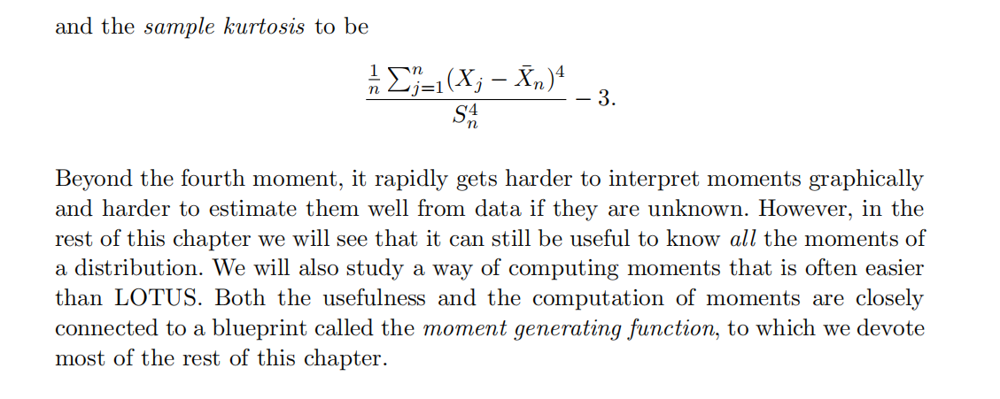

# ST6

**User:** Anonymous (dqswordman@gmail.com)  
**Created:** 8/28/2025 18:52:34  
**Updated:** 8/29/2025 12:20:34  
**Exported:** 8/31/2025 17:05:28  
**Link:** [https://chatgpt.com/c/68b034ef-f060-832d-96a3-6f9bf71b05ed](https://chatgpt.com/c/68b034ef-f060-832d-96a3-6f9bf71b05ed)  


第6章笔记：**矩（moments）与分布的集中趋势概括（中位数与众数）**
======================================

本章开头先定义**第 n 阶矩**  $E(X^n)$ ，说明矩如何刻画随机变量分布的形状。前两阶矩给出**均值**  $E(X)$  与**方差**  $E(X^2)-(E X)^2$ ，它们总结了“中心位置”和“离散程度”。但分布远不止均值与方差：**三阶与四阶中心矩**分别反映**偏度（asymmetry）**与**尾部/极端值（tails）**的行为。随后会引入**矩母函数**（moment generating function, MGF），既能帮助求矩，也是一种等价地“刻画一个分布”的方式。

接着进入 §6.1，对**分布的概括量**进行定义，除均值外，特别给出\*\*中位数（median）**与**众数（mode）\*\*的严格数学定义与直观解释，并配以一个既有“多个众数”又有“无穷多个中位数”的例子（图6.1）。

* * *

1\. 矩与矩母函数（章节引言要点）
------------------

### 1.1 原点矩与中心矩

*   **第 n 阶原点矩**： $\mu'_n = E(X^n)$ 。
    *    $n=1$ ： $\mu'_1 = E(X)$ （均值）。
    *    $n=2$ ： $\mu'_2 = E(X^2)$ 。
*   **第 n 阶中心矩**： $\mu_n = E\!\big[(X-EX)^n\big]$ 。
    *    $n=2$ ： $\mu_2 = \mathrm{Var}(X)$ （方差）。
    *    $n=3$ ： $\mu_3$  描述分布的**偏斜方向与程度**（偏度  $\gamma_1=\mu_3/\sigma^3$ ）。
    *    $n=4$ ： $\mu_4$  关联**尾部厚度/峰态**（峰度  $ \gamma_2=\mu_4/\sigma^4$ ；常用超额峰度  $\gamma_2-3$ ）。

> 直观理解：
> 
> *   偏度  $>0$  常表示右尾更长/更重， $<0$  表示左尾更长/更重。
> *   峰度越大，分布越“尖/尾更重”；越小则更“平/尾更轻”。
>     

### 1.2 矩母函数（MGF）的角色

*   **定义**： $M_X(t) = E\big[e^{tX}\big]$ （在0附近存在时）。
*   **求矩**： $M_X^{(n)}(0) = E(X^n)$ 。MGF 的导数在  $t=0$  给出各阶原点矩。
*   **识别分布**：若 MGF 在  $t=0$  的邻域存在，则它**唯一刻画**该分布（同一 MGF ⇒ 同一分布）。
*   **常见例**：正态  $N(\mu,\sigma^2)$  的 MGF 为  $\exp\big(\mu t + \tfrac12 \sigma^2 t^2\big)$ 。

> 提醒：有些分布（如柯西）MGF 不存在；此时可用特征函数或其它工具。

* * *

2\. §6.1 分布的集中趋势概括：均值、中位数与众数
----------------------------

书中强调：均值是“集中趋势”的度量之一，但不是唯一；**中位数**与**众数**也是常用概括量。它们**只取决于分布本身**，与“是哪一个具体的随机变量”无关——只要分布相同，均值/中位数/众数就相同。比如  $Z\sim N(0,1)$ ，由于对称性  $\Phi(0)=1/2$ ，其**中位数为 0**；标准正态的“分布的中位数”就是 0。

### 2.1 中位数（Median）的严格定义（Definition 6.1.1）

> **定义**：数  $c$  是随机变量  $X$  的一个**中位数**，若
> 
> $$
> P(X\le c)\ge \tfrac12 \quad\text{且}\quad P(X\ge c)\ge \tfrac12.
> $$
> 
> 最简单的情形是分布函数  $F$  在  $c$  处正好满足  $F(c)=1/2$ 。但考虑到**跳跃型 CDF** 的存在（离散或混合分布），用上述“双侧 ≥ 1/2”的方式更稳妥。

*   **连续且严格单调的情形**：若 CDF  $F$  连续且严格递增，则**中位数唯一**，为
    $$
    c = F^{-1}(1/2).
    $$
*   **直观含义**：中位数把“概率质量”分成两半：左侧 ≥ 50%，右侧 ≥ 50%。
*   **可能不唯一**：若存在区间使  $F$  在该区间“平坦”（无密度、或存在断裂并对称分配质量），则**这一整段区间都可作为中位数**（见图6.1）。

> **离散/混合分布的更精确表述**：中位数集合
> 
> $$
> \mathcal{M}=\big\{m:\; F(m)\ge \tfrac12 \ \text{且}\ F(m^-)\le \tfrac12\big\}
> $$
> 
> 可能是一个区间而非单点。

### 2.2 众数（Mode）的严格定义（Definition 6.1.2）

*   **离散型**： $c$  是众数，若
    $$
    P(X=c)\ge P(X=x),\ \forall x.
    $$
*   **连续型**（存在 PDF  $f$ ）： $c$  是众数，若
    $$
    f(c)\ge f(x),\ \forall x.
    $$
*   **直观含义**：众数是“最可能出现”的取值（离散）或“密度最高”的位置（连续）。
*   **可能有多个众数**：**多峰分布（multimodal）** 可有多个峰值点；众数可出现在分布支持的不同位置。

> 注意：连续情形下“众数”的数值依赖于密度的具体表达/光滑程度（实际数据中用直方图或核密度估计时，**分箱/带宽**会影响众数的位置与个数）。

### 2.3 三者关系与性质补充

*   **不等价**：均值、中位数、众数一般不相等；
    *   对称且单峰的理想情形（如正态）：**均值 = 中位数 = 众数**；
    *   偏斜分布：三者顺序关系常为（右偏）众数 < 中位数 < 均值。
*   **稳健性**：
    *   中位数对极端值**更稳健**（50% breakdown point）；
    *   均值受异常值影响更大；
    *   众数在连续情形对“带宽/分箱”较敏感。
*   **单调变换**：若  $g$  严格单调递增， $\mathrm{median}(g(X)) = g(\mathrm{median}(X))$ 。众数一般**不具**此良好不变性。

* * *

3\. 图 6.1 的例子：**两个众数与无穷多个中位数**
------------------------------

*   **支持集**： $[-5,-1]\cup[1,5]$ 。在  $[-1,1]$  之间**PDF 为 0**（“中间断掉”）。
*   **众数**：左右两团各有一个峰，图示峰值大致在  $-3$  与  $3$ ，因此**有两个众数**  $-3$  与  $3$ 。
*   **中位数**：因为  $[-1,1]$  间没有密度，且总质量在左右两边平均分配（各 1/2），于是**任何  $x\in[-1,1]$  都使左右两侧质量各为 1/2**，故该区间上的每个点都是**中位数**——**无穷多个中位数**。
*   **要点**：
    *   “中位数必须相邻地出现”（形成区间），因为它由“把质量一分为二”的条件定义；
    *   “众数可以分散在支持集的不同区域”，对应不同峰。

* * *

4\. 计算与应用要点（从定义到实务）
-------------------

### 4.1 从分布出发（理论量）

*   **中位数**：
    *   连续严格单调： $m=F^{-1}(0.5)$ 。
    *   离散/混合：找满足  $F(m^-)\le 0.5\le F(m)$  的点/区间。
*   **众数**：
    *   离散：比较各  $P(X=x)$ 。
    *   连续：求  $\arg\max_x f(x)$ （如可导，解  $f'(x)=0$  并检验极大值）。

### 4.2 从样本出发（统计量）

*   **样本中位数**：排序后取中间位置（偶数样本取中间两者的任一点/常用平均）。
*   **样本众数**：离散频数最高的值；连续数据常先做**密度估计**（直方图/核密度）再取峰。
*   **稳健选择**：有异常值时，中位数与分位数更可靠；需要“最可能值”时，众数有解释优势（但注意估计敏感性）。

* * *

5\. 小结
------

*   **矩**  $E(X^n)$  提供从“位置—离散—偏斜—尾部”的系统刻画；方差是二阶中心矩，偏度与峰度由三/四阶中心矩归一化而来。
*   **MGF**  $M_X(t)=E[e^{tX}]$  在 0 邻域存在时可唯一刻画分布，并可通过求导一键得到各阶矩。
*   **中位数**把质量“一分为二”，在连续严格单调的情形唯一且为  $F^{-1}(0.5)$ ；非严格单调或有间断时可能形成**一个区间的中位数**。
*   **众数**是概率/密度的最大点，可能有多个（多峰）。
*   图6.1 直观展示：**两峰 ⇒ 两个众数；中间断带 ⇒ \[-1,1\] 为整段中位数**。

* * *

6\. 报错/可读性说明
------------

*   本次两页内容清晰可读，未发现缺失。若后续页（偏度/峰度的正式定义、MGF 详细性质与例子）你继续截图发来，我会把它们与本节的概念衔接起来，形成一整章的完整笔记与推导。


## Response:
已思考 45s

这段话首先分析了均值、中位数和众数在薪资统计中的不同应用。选择取决于目标，例如众数对于所有薪资唯一时不太有用，而更适合只有少数薪资值时。此外，它强调了中位数对异常值的鲁棒性，并介绍了均值、方差、以及最小化不同误差的方法。

这段思考通过不等式分析了 |X - a| - |X - m| 的差异，定义了 Y = |X - a| - |X - m|，并通过分段期望 E(Y) 来推导。这其中涉及了中位数的定义，并证明了对比中位数和其他值 a 时，E|X - m| 小于或等于 E|X - a|。

在这段推导中，首先分析了当 X ≤ m 和 X > m 时的情况，计算了 |X-a| - |X-m| 的不同结果。然后使用了指示函数将结果结合，得到了 E(Y) ≥ 0 的结论，证明了中位数的特殊性质，即当 P(X ≤ m) 处于特定范围时，期望值始终大于等于零。

这段思考首先证明了 E|X - m| ≤ E|X - a|，然后规划了制作笔记的步骤。笔记内容包括标题参考，同时引用示例 6.1.3 和定理 6.1.4，针对 MSE 和 MAE 最小化问题的讨论。接着，计划针对薪资数据集举例，阐明适应不同目标的选择：例如，选择均值、中位数或众数的情况。

完成

6.1 实例精讲：工资数据的均值—中位数—众数；以及“用哪个更好”的准则（MSE vs. MAE）
=================================================

本节围绕一个公司 100 名员工的**工资**示例展开，解释三种“集中趋势”量的含义与取舍，并通过定理 6.1.4 证明：

*   **最小化均方误差**  $E(X-c)^2$  的最佳点是**均值**  $\mu$ ；
*   **最小化平均绝对误差**  $E|X-c|$  的最佳点是**中位数**  $m$ 。

设工资从小到大排序为  $s_1\le s_2\le\cdots\le s_{100}$ 。令随机变量  $X$  表示“**等概率随机抽取一名员工**的工资”。那么这组数据的“均值/中位数/众数”，就是随机变量  $X$  的对应量。

* * *

一、三种概括量在工资数据中的直觉与局限
-------------------

### 1) 众数（mode）

*   **若所有工资都不同**：每个值都“出现 1 次”，于是**有 100 个众数**，众数就几乎没信息量。
*   **若工资只有少数几个档位**：众数更有意义。但也可能“分布接近打平”。
    *   例：34 人拿  $a$ ，33 人拿  $b$ ，33 人拿  $c$ 。众数是  $a$ ，但**只报告  $a$ ** 会**忽略**另外 66% 接近  $b,c$  的人群信息。

**结论**：众数适合**离散且确有明显高频档位**的情形；否则它往往信息不足或受分箱/带宽选择（连续情形的密度估计）影响很大。

### 2) 中位数（median）

*   对偶数个观测（此处是 100 个），**“中间有两个数”**： $s_{50}$  与  $s_{51}$ 。
*   **任何**  $m\in[s_{50},\,s_{51}]$  都是中位数（左边至少 50%，右边也至少 50%）。
*   习惯上取**中位数的代表值**为
    $$
    m=\frac{s_{50}+s_{51}}{2}.
    $$
*   **稳健性**：对极端值不敏感。CEO 工资从略高到极高会**显著拉高均值**，但**对中位数几乎无影响**。
    *   因此在回答“**典型工资**是多少？”这类问题时，中位数往往比均值更合适。

### 3) 均值（mean）

*   表示“**重心**”。优点是**可加性**强。
*   例如要知道公司**总工资支出**：若只知道中位数或众数，无法推出总额；但**知道均值**就能直接乘以人数（100）得到总额。
*   缺点：对**极端值**敏感。

> **小结（取舍的关键句）**：**“用哪个更好，取决于目标（it depends on the goal）。”**
> 
> *   关注**典型水平/稳健概括** → 中位数更合适；
> *   关注**总量/可加性/回归平方误差** → 均值是自然选择；
> *   关注**最常见档位**且数据本身就离散集中 → 众数有意义。
>     

* * *

二、定理 6.1.4：用误差准则选择“最佳单点概括”
--------------------------

**设**  $X$  的均值为  $\mu$ ， $m$  是  $X$  的一个中位数。

**结论**

1.  使  $E(X-c)^2$  **最小**的  $c$  是  $c=\mu$ （**唯一**）。
2.  使  $E|X-c|$  **最小**的  $c$  可以取为**任一中位数**  $m$ （若中位数唯一，则最优也唯一）。

> 这对应数据分析/机器学习里的\*\* $L_2$  损失\*\*（平方）与 ** $L_1$  损失**（绝对值）的经典结论：
> 
> *   ** $L_2$ ** 的经验风险最小化给出**样本均值**；
> *   ** $L_1$ ** 的经验风险最小化给出**样本中位数**。  
>     更一般地，非对称  $L_1$  损失的最小化给出**分位数回归**（ $\tau$ \-分位数）。
>     

### 证明要点（按书中思路复现并补足直觉）

**(A) 关于均方误差  $E(X-c)^2$ **  
先证恒等式：

$$
E(X-c)^2=\mathrm{Var}(X)+(\mu-c)^2.
$$

这是把  $X$  拆为  $(X-\mu)+\mu$  并展开即可，或利用“加常数不改变方差”。于是

$$
E(X-c)^2=\underbrace{\mathrm{Var}(X)}_{\text{与 }c\text{ 无关}}+(\mu-c)^2.
$$

显然当且仅当  $c=\mu$  时取到全局最小值，且**唯一**。

**(B) 关于平均绝对误差  $E|X-c|$ **  
要证：对任意  $a\ne m$ ，都有

$$
E|X-m|\ \le\ E|X-a|.
$$

在不失一般性地令  $m<a$ （ $m>a$  同理）。对任意  $X$ ：

*   若  $X\le m$ ，则
    $$
    |X-a|-|X-m|=(a-X)-(m-X)=a-m.
    $$
*   若  $X>m$ ，有
    $$
    |X-a|-|X-m|\ \ge\ (X-a)-(X-m)=m-a.
    $$

令指示变量  $I=\mathbf{1}\{X\le m\}$ ，并记

$$
Y=|X-a|-|X-m|.
$$

于是

$$
\begin{aligned} E(Y) &=E(YI)+E(Y(1-I))\\ &\ge (a-m)E(I)+(m-a)E(1-I)\\ &=(a-m)P(X\le m)+(m-a)P(X>m)\\ &=(a-m)\big(2P(X\le m)-1\big). \end{aligned}
$$

由于  $m$  是中位数，按定义  $P(X\le m)\ge \tfrac12$  且  $P(X\ge m)\ge \tfrac12$ ，从而

$$
2P(X\le m)-1\ \ge\ 0\quad\Rightarrow\quad E(Y)\ge 0.
$$

这等价于  $E|X-m|\le E|X-a|$ 。证毕。

> 直觉：当把  $c$  往右挪到  $a>m$  时，**左侧样本的绝对误差**都增加  $a-m$ ，而**右侧样本的绝对误差**至多减少  $a-m$ ；若左/右两侧的概率各 ≥ 1/2（中位数性质），总体期望不会下降。

* * *

三、如何在实际问题里选用？
-------------

*   **抗离群/厚尾数据**：选**中位数/分位数**（ $L_1$  或分位数损失）。
*   **可加性与总量推断**（如预算/总支出/能耗总量）：选**均值**（ $L_2$ ）。
*   **离散类别里“最常见值”**：选**众数**（但要防“多峰/近似并列”的误导）。
*   **建模训练**：
    *   **MSE** 目标会把预测拉向**条件均值**；
    *   **MAE** 目标会把预测拉向**条件中位数**；
    *   **分位数损失**（pinball loss）拉向**条件  $\tau$ \-分位数**（做不确定性区间很有用）。

* * *

四、与样本版的对应（便于实操）
---------------

*   给定样本  $x_1,\dots,x_n$ ：
    *    $\displaystyle \arg\min_c \sum_{i=1}^n (x_i-c)^2=\bar x$ （样本均值）。
    *    $\displaystyle \arg\min_c \sum_{i=1}^n |x_i-c|=\text{任何样本中位数}$ （偶数样本时为中间两数之间的任何点，常取两者平均）。

* * *

五、小结
----

*   **众数**：适合确有“最常见档”的离散情境；多峰或近并列时要谨慎。
*   **中位数**：稳健、对应最小化  $E|X-c|$ ；偶数样本时是**区间**  $[s_{50},s_{51}]$ 。
*   **均值**：可加性强、对应最小化  $E(X-c)^2$ ；但对极端值敏感。
*   **选择取决于目标**：典型水平 vs. 总量 vs. 最常见值。

* * *

6\. 报错 / 可读性
------------

*   你提供的三页内容清晰完整：工资示例、对比讨论、定理 6.1.4 与证明均可辨认，无缺页。
*   若后续继续到“偏度/峰度或 MGF 的性质与例题”，请把截图发来，我将把这些结果与本节统一进一份连续的“第6章完整笔记”。


第6章笔记（续）：**同均值同方差，不同“形状”——偏度与尾厚（图6.2–6.4）**
===========================================

本段通过三组对照图，强调：**仅用均值与方差不足以刻画一个分布**。我们还需要看“形状”——是否对称（**偏度**，由三阶中心矩衡量）以及**尾部厚度**（由四阶中心矩衡量，常称**峰度/尾厚**）。

* * *

1\. 图 6.2：同为均值 2、方差 12，但形状完全不同
------------------------------

*   **浅色曲线**： $N(2,\,12)$  正态，**对称**于 2，因此
    $$
    \text{mean}=\text{median}=\text{mode}=2.
    $$
*   **深色曲线**：**对数正态（Log-Normal）**，明显**右偏（right-skewed）**：  
    右尾很长，左尾短。书中给出它也具有  
     $\text{mean}=2,\ \text{var}=12$ ，但
    $$
    \text{median}=1,\quad \text{mode}=0.25.
    $$

### 为何对数正态能做到（2,12）且中位数 1、众数 0.25？（推导）

设  $X\sim\text{LogNormal}(\mu,\sigma^2)$ （即  $\ln X\sim N(\mu,\sigma^2)$ ），有

$$
E[X]=e^{\mu+\sigma^2/2},\quad \mathrm{Var}(X)=(e^{\sigma^2}-1)\,e^{2\mu+\sigma^2},\\ \mathrm{median}=e^\mu,\quad \mathrm{mode}=e^{\mu-\sigma^2}.
$$

若取  $\mu=0$ （则 median  $=1$ ），令  $E[X]=2\Rightarrow e^{\sigma^2/2}=2\Rightarrow \sigma^2=2\ln2$ 。  
此时

$$
\mathrm{Var}(X)=\big(e^{2\ln2}-1\big)e^{2\ln2} =(4-1)\cdot 4=12,
$$

且  $\mathrm{mode}=e^{-\sigma^2}=e^{-2\ln2}=1/4=0.25$ 。与图注一致。

> **要点**：均值与方差**相同**，但**偏度**不同——正态完全对称；对数正态强右偏。若只看均值与方差，根本识别不出这种不对称性。

* * *

2\. 图 6.3：离散分布的“左偏/右偏”，同样可有**相同均值与方差**
--------------------------------------

*   左图： $X\sim\mathrm{Bin}(10,0.9)$ 。
    $$
    E[X]=10\times0.9=9,\quad \mathrm{Var}(X)=10\times0.9\times0.1=0.9.
    $$
    其 PMF 高峰靠右端（9、10附近），左侧拖出更长的“稀疏”部分，称为**左偏（left-skewed）**（注意：峰在右、尾在左 ⇒ 左偏）。  
    众数  $\approx \lfloor (n+1)p\rfloor=\lfloor 11\times0.9\rfloor=9$ ；中位数也在 9 附近（书中直接给出三者都等于 9）。
*   右图： $Y=8+\mathrm{Bin}(10,0.1)$ 。
    $$
    E[Y]=8+10\times0.1=9,\quad \mathrm{Var}(Y)=0.9.
    $$
    形状与左图镜像，对应**右偏（right-skewed）**。  
    **结论**：两者**均值、方差、（在此例中）中位数与众数都相同**，但形状天差地别——一个左偏，一个右偏。

### 偏度的标准化量（预告）

三阶中心矩  $\mu_3=E[(X-EX)^3]$  捕捉不对称；**标准化偏度**

$$
\gamma_1=\frac{\mu_3}{\sigma^3}.
$$

对二项分布有显式公式

$$
\gamma_1=\frac{1-2p}{\sqrt{np(1-p)}}.
$$

代入  $n=10$ ：

*    $p=0.9\Rightarrow \gamma_1\approx\frac{1-1.8}{\sqrt{0.9}}<0$ （左偏）；
*    $p=0.1\Rightarrow \gamma_1>0$ （右偏）。  
    右移 +8 不改变偏度符号，只是整体平移。

* * *

3\. 图 6.4：对称分布也会“尾部不同”
----------------------

*   左图对比：
    *   浅色： $N(0,1)$ ；
    *   深色：** $t_3$  缩放到方差 1**（原  $t_3$  方差为  $3/(3-2)=3$ ，故用  $\tfrac{1}{\sqrt{3}}$  缩放）。  
        二者**均值=0，方差=1**，且都**对称**，但  $t_3$ **峰更尖、尾更厚（heavy-tailed）**。
*   右图放大右尾，可见  $t_3$  的尾部**衰减更慢**（远端概率更大）。

### 尾厚/峰度（kurtosis）的标准化量（预告）

四阶中心矩  $\mu_4=E[(X-EX)^4]$  反映尾部与峰态；**标准化峰度**

$$
\gamma_2=\frac{\mu_4}{\sigma^4}\quad (\text{超额峰度}=\gamma_2-3).
$$
*   正态的超额峰度为 0；值越大常被理解为“**更尖峰、尾更厚**”。
*   但需注意：**并非所有分布都存在四阶矩**。例如  $t_\nu$  的四阶矩需  $\nu>4$ 。对 ** $t_3$ **，四阶矩**不存在**（“无限峰度”），这正是**极厚尾**的一个信号。

> **要点**：即使“**均值相同 + 方差相同 + 都对称**”，尾部也仍能非常不同——这部分信息**均值/方差无法提供**。

* * *

4\. 贯穿三图的统一本质
-------------

1.  **均值**（一阶）与**方差**（二阶）只描述“位置”和“整体离散度”。
2.  **偏度**（三阶）捕捉**不对称性**（左偏 / 右偏）。
3.  **尾厚/峰度**（四阶）刻画**极端值/尾部概率**的相对大小。
4.  现实建模中，若只依赖  $(\text{mean},\text{var})$ ，会在以下方面**误判**：
    *   典型值（如中位数/众数）与均值差异巨大（图6.2）；
    *   两个系统风险溢价相同（方差相同），但**尾部风险**完全不同（图6.4）；
    *   只是把质量“挪到一边”（左/右偏），均值与方差都不变（图6.3）。

* * *

5\. 方法与实践提示（联系统计/机器学习）
----------------------

*   **建模目标含尾部**（极端损失/风险管理）：需超越方差，引入**尾部度量**（峰度、分位数/ES、超额概率等）。
*   **检测不对称**：计算或估计**偏度**；对离散数据可直接看频图/条形图的“长尾方向”。
*   **参数选择**：拟合/比较分布时，不要只对齐  $\mu,\sigma^2$ ；应同时检查偏度/尾厚，或直接比较**分位数曲线**与**尾部衰减**。

* * *

6\. 小结
------

*   图6.2展示：**同均值同方差**却**偏度不同**（正态对称 vs. 对数正态右偏；中位数与众数相差甚远）。
*   图6.3展示：离散分布可通过“**镜像+平移**”得到**同均值同方差**但**相反偏度**的形状。
*   图6.4展示：即使**对称且方差相同**，**尾厚**也可大不相同（正态轻尾 vs.  $t_3$  厚尾）。
*   因此，对分布的全面理解需要**更高阶矩**（至少三阶与四阶）或分位数/尾部概率等更直接的形状度量。

* * *

7\. 报错 / 可读性
------------

*   本次三页图文清晰可读，未发现缺失。若你继续发送后续关于“偏度与峰度的正式定义、计算例题与 MGF 部分”，我会把它们并入一个连贯的“第6章完整讲义”。


6.2 解释“矩”（Interpreting moments）：种类、物理类比、偏度与对称性
==============================================

本节把“矩”的三种常用形式系统化，并给出物理直观：**均值=第一矩（质量中心）**，**方差=第二中心矩（关于质心的转动惯量）**。随后正式定义**偏度**（第三标准化矩）以及**关于均值的对称**，并给出连续情形下“PDF 的对称等价条件”及证明。

* * *

1) 定义 6.2.1：矩、中心矩与**标准化矩**（三种“矩”）
---------------------------------

设随机变量  $X$  的均值  $E(X)=\mu$ ，方差  $\mathrm{Var}(X)=\sigma^{2}$ 。

*   **第  $n$  阶矩（原点矩）**： $\displaystyle E(X^{n})$ 。
*   **第  $n$  阶中心矩**： $\displaystyle E\big((X-\mu)^{n}\big)$ （例如二阶中心矩就是方差）。
*   **第  $n$  阶标准化矩**： $\displaystyle E\!\left(\frac{X-\mu}{\sigma}\right)^{\!n}$ 。

> 说明：标准化（减均值、除以标准差）使该量**与单位和尺度无关**，因此更适合描述“形状”（对称性、尾厚等）而非位置/尺度本身。

### 物理类比（图 6.5 的含义）

把离散  $X$  看成在数轴上若干位置  $x_1,\dots,x_n$  处放置小石子，**质量**为  
 $m_j=P(X=x_j)$ 。  
则：

$$
E(X)=\sum_{j=1}^{n} m_j x_j \quad\text{（系统的**质心**）},
$$

$$
\mathrm{Var}(X)=\sum_{j=1}^{n} m_j \big(x_j-E(X)\big)^2 \quad\text{（关于质心的**转动惯量**）}.
$$

这给出“均值=第一矩，方差=第二中心矩”的物理直觉。

* * *

2) 定义 6.2.2：**偏度（Skewness）**
----------------------------

$$
\boxed{\ \mathrm{Skew}(X)=E\!\left(\frac{X-\mu}{\sigma}\right)^{\!3}\ }
$$

它是**第三标准化矩**，用于把“不对称性”量化：

*    $\mathrm{Skew}>0$ ：**右偏**（右尾更长/更重）；
*    $\mathrm{Skew}<0$ ：**左偏**；
*    $\mathrm{Skew}=0$ ：对称分布的典型情形（也有非对称但三阶矩不存在/为0的特殊例外，通常我们以“对称 ⇒ 偏度 0”为主要结论）。

> 为什么要“标准化”后再立方？
> 
> 1.  去除位置与尺度影响；2) 立方保留“方向信息”（高于/低于均值）；3) 得到**无单位**的形状指标。
>     

* * *

3) 定义 6.2.3：**关于  $\mu$  的对称（Symmetry）**
----------------------------------------

称  $X$  **关于  $\mu$  对称**，若  $X-\mu$  与  $\mu-X$  同分布（等价于与  $-(X-\mu)$  同分布）。  
这几个表达“ $X$  关于  $\mu$  对称 /  $X$  的分布关于  $\mu$  对称 /  $X$  对称于其均值”是同一件事（在均值存在时）。

### 重要推论

*   **若均值存在，则对称中心就是均值**：
    $$
    E(X)-\mu=E(X-\mu)=E(\mu-X)=\mu-E(X)\ \Rightarrow\ E(X)=\mu.
    $$
*   ** $\mu$  也是一个中位数**：由“ $X-\mu$  与  $\mu-X$  同分布”得
    $$
    P(X\le \mu)=P(\mu\le X)=\tfrac12,
    $$
    于是  $P(X\le\mu)\ge \tfrac12,\ P(X\ge\mu)\ge \tfrac12$  成立。
*   **所有奇数阶中心矩为 0**：特别是
    $$
    E\big[(X-\mu)^{2k+1}\big]=0\ \Rightarrow\ \mathrm{Skew}(X)=0.
    $$

> 备注 6.2.4：常把“关于  $\mu$  对称”简写为“**关于 0 对称**”，意思是把  $X$  **先中心化**为  $X-\mu$ ；此时  $-(X-\mu)$  与  $X-\mu$  同分布，连续情形 PDF 为**偶函数**。

* * *

4) 命题 6.2.5（连续型的等价表述：看 PDF 就能判对称）
---------------------------------

**命题**：设  $X$  连续，PDF 为  $f$ 。则

$$
X\ \text{关于}\ \mu\ \text{对称}\quad\Longleftrightarrow\quad \boxed{\ f(x)=f(2\mu-x),\ \forall x\ }.
$$

### 证明（两向）

**(⇒)** 已知对称。对 CDF  $F(x)=P(X\le x)$  有

$$
F(x)=P(X-\mu\le x-\mu)=P(\mu-X\le x-\mu)=P(X\ge 2\mu-x)=1-F(2\mu-x).
$$

两侧对  $x$  求导（连续处）得  $f(x)=f(2\mu-x)$ 。

**(⇐)** 反之，若  $f(x)=f(2\mu-x)$ ，则对任意  $t$ ：

$$
\begin{aligned} P(X-\mu\le t) &=\int_{-\infty}^{\mu+t} f(x)\,dx =\int_{-\infty}^{\mu+t} f(2\mu-x)\,dx \\ &\xrightarrow{w=2\mu-x}\ \int_{\mu-t}^{\infty} f(w)\,dw = P(X\ge \mu-t)=P(\mu-X\le t), \end{aligned}
$$

故  $X-\mu$  与  $\mu-X$  同分布， $X$  关于  $\mu$  对称。■

> 直观： $f(x)=f(2\mu-x)$  表示“以  $\mu$  为镜像轴”，左右两侧密度完全一致；离散型时相应等式为  $p(x)=p(2\mu-x)$ 。

* * *

5) 小扩展：标准化矩的**仿射不变性**
---------------------

对任意  $Y=a+bX$ （ $b>0$ ），有

*    $E(Y)=a+b\mu$ ,   $\ \mathrm{Var}(Y)=b^2\sigma^2$ ；
*   但对  $n\ge 3$ ，
    $$
    E\!\left(\frac{Y-EY}{\sqrt{\mathrm{Var}(Y)}}\right)^{\!n} =E\!\left(\frac{X-\mu}{\sigma}\right)^{\!n},
    $$
    因而**偏度、峰度等标准化矩不随线性单位变化**。这就是我们用它们描述“形状”的根本原因。

* * *

6) 与前面图形（6.2–6.4）的呼应
--------------------

*   **正态  $N(\mu,\sigma^2)$ **：关于  $\mu$  对称 ⇒ 偏度 0；PDF 满足  $f(\mu+t)=f(\mu-t)$ 。
*   **对数正态**：非对称 ⇒ 偏度  $>0$ ，且“均值=2、方差=12”的构造对应  $\mu_{\log}=0$ 、 $\sigma^2_{\log}=2\ln2$ ，中位数=1、众数=0.25。
*   ** $t_3$  缩放到方差 1**：仍关于 0 对称（偏度 0），但四阶矩不存在 ⇒ 尾部远重于正态（峰度无穷/不可用），提醒我们“是否存在高阶矩”本身就是尾部厚度的一个信号。

* * *

7) 小结
-----

1.  **三类“矩”**：原点矩  $E(X^n)$  描述整体幂次；**中心矩**消除位移；**标准化矩**进一步消除尺度，专注“形状”。
2.  **物理直觉**： $E(X)$ \=**质心**； $\mathrm{Var}(X)$ \=**转动惯量**。
3.  **偏度**\= $E[((X-\mu)/\sigma)^3]$ ，度量**不对称性**；对称分布 ⇒ 偏度 0，且奇数阶中心矩全为 0。
4.  **对称的等价刻画**：
    *   分布上： $X-\mu \overset{d}{=} \mu-X$ ；
    *   PDF 上： $f(x)=f(2\mu-x)$ （连续型）；
    *   结论：若均值存在， $\mu=E(X)$  且  $\mu$  也是中位数。
5.  **为什么要标准化矩**：与单位无关、对线性变换不变，能稳定描述分布形状（偏度、尾厚）。

* * *

8) 报错 / 可读性
-----------

*   你提供的三页内容（定义 6.2.1、6.2.2、6.2.3，备注 6.2.4，命题 6.2.5 与证明）清晰可读，无缺失、无模糊。
*   若继续有“峰度（第四标准化矩）的正式定义、例题与 MGF 相关内容”，请接着发图；我会把它们与本节合并成**第 6 章的完整讲义**与推导链。


6.2（续）**对称性的等价表达 & 对称分布的奇数阶中心矩为 0**
===================================

本节把上一页命题 6.2.5 的证明收尾，并给出一个重要推论：**若分布关于  $\mu$  对称，则所有奇数阶中心矩（若存在）都等于 0**。这与“偏度”＝第三标准化矩的直觉完全一致。

* * *

1) 命题 6.2.5（PDF 视角的对称性）回顾与收尾
----------------------------

**命题**：连续型  $X$  的 PDF 为  $f$ 。则

$$
X \text{ 关于 } \mu \text{ 对称}\quad\Longleftrightarrow\quad f(x)=f(2\mu-x),\ \forall x.
$$

**证明思路（书中）**

*   若对称，则对 CDF  $F(x)$  有
    $$
    F(x)=P(X\le x)=P(X\ge 2\mu-x)=1-F(2\mu-x).
    $$
    两侧对  $x$  求导得  $f(x)=f(2\mu-x)$ 。
*   反过来，若  $f(x)=f(2\mu-x)$ ，则对任意  $t$ :
    $$
    \begin{aligned} P(X-\mu\le t) &=\int_{-\infty}^{\mu+t} f(x)\,dx =\int_{-\infty}^{\mu+t} f(2\mu-x)\,dx\\ &\xrightarrow{w=2\mu-x}\ \int_{\mu-t}^{\infty} f(w)\,dw =P(X\ge \mu-t)=P(\mu-X\le t), \end{aligned}
    $$
    于是  $X-\mu$  与  $\mu-X$  同分布， $X$  关于  $\mu$  对称。■

> 直观： $f(x)=f(2\mu-x)$  就是“以  $\mu$  为镜像轴”的密度镜像；把  $\mu$  左侧的每一段概率质量折到右侧完全重合。

* * *

2) 命题 6.2.6 **（对称分布的奇数阶中心矩）**
-----------------------------

**命题**：若  $X$  关于其均值  $\mu$  对称，则对任意**奇数**  $m$ ，

$$
E\big[(X-\mu)^m\big]=0
$$

（前提是该矩“存在”）。

**证明（书中极简法）**  
因为  $X-\mu$  与  $\mu-X=-(X-\mu)$  **同分布**，对奇数  $m$ ：

$$
E\big[(X-\mu)^m\big]=E\big[(\mu-X)^m\big]=E\big[(-1)^m (X-\mu)^m\big]=-E\big[(X-\mu)^m\big].
$$

移项即得  $E[(X-\mu)^m]=0$ 。■

**更通用的表述**  
对称分布满足：对任意**奇函数**  $g$ （ $g(-y)=-g(y)$ ），只要期望存在，

$$
E\big[g(X-\mu)\big]=0.
$$

令  $g(y)=y^m$ （ $m$  奇数）得到上式。

### 重要提示

*   “为 0”**建立在“该矩存在”的条件上**。例如  $t_\nu$  分布对称，但仅当  $\nu>m$  时  $m$  阶矩才存在：
    *    $t_3$  对称， $\mu=0$ ；但其三阶矩**并不存在**（因为只对  $m<3$  存在），因此“偏度”并**未定义**，不能说它的偏度为 0，只能说“若存在则应为 0”。
*   **反向不成立**： $\mu_3=E[(X-\mu)^3]=0$  不必然推出“分布对称”。所以“对称 ⇒ 奇数阶中心矩为 0”，但“某个奇数阶中心矩为 0 ⇒ 对称”是**假的**（第三矩 = 0 仍可能不对称）。

* * *

3) 与偏度的关系
---------

*   偏度定义为第三**标准化**矩：
    $$
    \mathrm{Skew}(X)=E\!\left[\left(\frac{X-\mu}{\sigma}\right)^{\!3}\right].
    $$
*   若  $X$  对称且三阶矩存在，则  $\mathrm{Skew}(X)=0$ 。
*   若分布厚尾导致三阶矩不存在（如  $t_3$ ），则**偏度未定义**；这提示我们：**先检查矩是否存在**，再谈数值。

* * *

4) 实用小结与要点回顾
------------

1.  **对称性的三个等价视角**
    *   分布视角： $X-\mu \overset{d}{=} \mu-X$ 。
    *   PDF 视角（连续）： $f(x)=f(2\mu-x)$ 。
    *   统计量视角：若均值存在， $\mu=E(X)$ ，且  $\mu$  也是中位数；所有奇数阶中心矩（若存在）为 0。
2.  **偏度与“存在性”**
    *   对称 ⇒ 偏度 0（若三阶矩存在）。
    *   厚尾分布可能“对称但偏度未定义”；对尾部的研究还需看四阶矩/峰度、分位数与尾概率等。
3.  **分析与建模提示**
    *   判断对称性时，**画图 + 统计检验**（如比较左右分位数、检查样本奇数阶样本矩是否接近 0）；
    *   在极端值多/厚尾情况下，**不要仅依赖均值/方差/偏度**，先确认相关矩是否存在，再选择稳健统计量（分位数、MAD、分布拟合的分位差等）。

* * *

5) 本页小结
-------

*   命题 6.2.5 给出了**PDF 等价条件**并完成证明细节。
*   命题 6.2.6 说明：**对称分布的所有奇数阶中心矩为 0（若存在）**；这是“偏度为 0”的理论根基，但**存在性**是前提。

* * *

报错/可读性
------

*   本页内容清晰完整、公式和推导可辨，无缺失或模糊。
*   继续发来“峰度（第四标准化矩）”“MGF 与矩”的页面，我会把它们并入前文，形成第 6 章的**一体化讲义**与练习。


第6章笔记（续）：**偏度与峰度（第三、第四标准化矩） + 图6.6三例详解**
========================================

本段进入“如何用更高阶矩读懂分布形状”。**偏度**用来衡量“不对称”，**峰度**（更准确说**尾厚**）用来衡量“极端值/尾部的分量”。它们分别对应**第三**与**第四标准化矩**。

* * *

1\. 为什么用“第三标准化矩”刻画偏度？
---------------------

设  $Z=\dfrac{X-\mu}{\sigma}$ （先中心化，再按标准差归一）。

*   **第一标准化矩**  $E(Z)=0$ （恒为0，无信息）。
*   选用**奇次幂**能够保留“方向”（大于/小于均值）；其中**三次幂**是最小的奇次幂，**稳定性最好、估计方差更小**，因此约定**偏度**为
     $$
     \boxed{\ \mathrm{Skew}(X)=E\!\left(\frac{X-\mu}{\sigma}\right)^{\!3}\ }.
     $$*    $\mathrm{Skew}>0$ ：**右偏**（右尾长/重）； $\mathrm{Skew}<0$ ：**左偏**。

> 注：存在一些不对称分布的奇数阶中心矩全为0（构造例），故“奇数矩都为0 ⇒ 对称”不成立；但**对称 ⇒ 奇数中心矩为0（若存在）**。

* * *

2\. 为什么要看“尾厚”（峰度）？
------------------

均值与方差固定时，**极端事件**（远离均值处的概率）差别仍可能巨大。金融风险管理特别关心**尾部概率**：许多资产的收益分布左尾很厚，**罕见但幅度巨大的亏损**会主导风险。  
单一指标没法完美概括尾行为，但最常用的“单数”总结是**第四标准化矩**（去掉正态的基准）：

### 定义 6.2.7（峰度，kurtosis）

$$
\boxed{\ \mathrm{Kurt}(X)=E\!\left(\frac{X-\mu}{\sigma}\right)^{\!4}-3\ }.
$$*   之所以**减3**（注6.2.8），是为了让**任何正态分布的峰度=0**，便于与正态做可比性标尺。
*   有些资料把  $E(Z^4)$  本身称为 kurtosis，而把上式称为**超额峰度**（excess kurtosis）。

> 术语提示：
> 
> *    $\mathrm{Kurt}>0$ ：**厚尾/尖峰（leptokurtic）**；
> *    $=0$ ：与正态尾厚相当（mesokurtic）；
> *    $<0$ ：**轻尾/平顶（platykurtic）**（如均匀分布“无尾”）。
> *   **存在性前提**： $\mathrm{Kurt}$  需四阶矩存在；如柯西或  $t_3$  的四阶矩不存在，峰度就**未定义**。
>     

* * *

3\. 图 6.6 三个“具名分布”的偏度与峰度（含推导）
-----------------------------

### (a) 指数分布  $\mathrm{Expo}(1)$ （左图，PDF  $f(x)=e^{-x},x\ge0$ ）

已知： $\mu=1,\ \sigma^2=1$ 。

*   中心三阶矩  $\mu_3=2$  ⇒  
     $\displaystyle \mathrm{Skew}=\frac{\mu_3}{\sigma^3}=\frac{2}{1}= \boxed{2}$ （**强右偏**）。
*   中心四阶矩  $\mu_4=9$  ⇒  
     $\displaystyle \mathrm{Kurt}=\frac{\mu_4}{\sigma^4}-3=9-3=\boxed{6}$ （**很厚的右尾**）。

### (b) 泊松分布  $\mathrm{Pois}(\lambda)$ ，此处  $\lambda=4$ （中图，PMF）

已知： $\mu=\sigma^2=\lambda$ 。

*    $\displaystyle \mu_3=\lambda\Rightarrow \mathrm{Skew}=\frac{\mu_3}{\sigma^3}=\frac{\lambda}{\lambda^{3/2}} =\boxed{\frac{1}{\sqrt{\lambda}}}=\boxed{0.5}$ （轻度右偏）。
*    $\displaystyle \mu_4=\lambda+3\lambda^2\Rightarrow \frac{\mu_4}{\sigma^4}-3 =\frac{\lambda+3\lambda^2}{\lambda^2}-3 =\boxed{\frac{1}{\lambda}}=\boxed{0.25}$ （**比正态稍厚**）。

### (c) 均匀分布  $\mathrm{Unif}(0,1)$ （右图，PDF 常数  $1$ ）

 $\mu=\tfrac12,\ \sigma^2=\tfrac1{12}$ 。

*   对称 ⇒  $\mathrm{Skew}= \boxed{0}$ 。
*    $\mu_4=\tfrac1{80}$ ， $\sigma^4=(\tfrac1{12})^2=\tfrac1{144}$  ⇒  
     $\displaystyle \mathrm{Kurt}=\frac{1/80}{1/144}-3 =\frac{144}{80}-3=1.8-3=\boxed{-1.2}$ （**极轻尾/无尾**）。

> 三例对照：指数和泊松都**右偏且峰度>0**（厚尾程度不同），而均匀分布**对称**且**峰度<0**（“无尾”导致比正态还轻）。

* * *

4\. 实务与估计的注意点
-------------

1.  **尺度不变性**：偏度与峰度都以  $Z=(X-\mu)/\sigma$  定义，对单位/线性变换不敏感，专注“形状”。
2.  **存在性**：在厚尾分布下（如  $t_\nu$ ），可能只有某些阶矩存在——先确认再计算（ $\nu>3$  才有三阶矩， $\nu>4$  才有四阶矩）。
3.  **样本估计**：样本偏度/峰度对离群点很敏感，有限样本方差大；金融等领域常辅以**分位数、VaR/ES、尾指数**等更直接的尾部度量。
4.  **诠释**：峰度主要反映**尾部概率**而非“峰有多尖”本身（后者容易被直方图带宽/核带宽影响）。

* * *

5\. 小结
------

*   **偏度**\= $E[((X-\mu)/\sigma)^3]$ ：正右负左，衡量不对称。
*   **峰度**\= $E[((X-\mu)/\sigma)^4]-3$ ：相对正态的尾厚度；>0 厚尾，<0 轻尾。
*   指数(1)： $\mathrm{Skew}=2$ ,  $\mathrm{Kurt}=6$ ；泊松(4)： $\mathrm{Skew}=0.5$ ,  $\mathrm{Kurt}=0.25$ ；均匀(0,1)： $\mathrm{Skew}=0$ ,  $\mathrm{Kurt}=-1.2$ 。
*   在风险/极端事件分析中，**仅看均值与方差远远不够**；必须引入偏度、峰度或其他尾部指标。

* * *

6\. 报错 / 可读性
------------

*   本次两页与图6.6均清晰可辨，无缺失。若你继续提供 MGF 章节或练习题页，我会把它们与前面的偏度/峰度统一成“第6章完整讲义 + 题解”。

## Prompt:


## Response:
已思考 35s

用户需要非常详细的讲解，尤其是结合图像内容进行逐步解释。第6.3节主要讲解样本矩的定义。要解释样本均值的无偏性、方差及其估计量，另外也提到大数法则（LLN）的内容，虽然会在第10章进一步证明，提前提及预估分布和样本均值的性质也非常有用。

我们需要展示一些推导：例如利用线性性质和同分布属性，证明样本矩的期望 E(M\_k) = E(X\_1^k)。接着要通过独立性来推导样本均值的方差。还可以提到样本第二矩的无偏性以及贝塞尔修正法，指出样本方差估计器的无偏性。

用户要求详细说明图像内容，并制作长篇讲义。我们会提供详细的推导和阐释，同时保持内容不过于冗长。样本矩的定义中，使用随机变量与插件样本值区分。样本均值是第一个样本矩，阐述无偏性和大数法则，通过期望的线性性质和相同分布证明。

完成

6.3 样本矩（Sample moments）：用数据估计“分布的矩”
===================================

本节聚焦**如何用样本去估计总体的矩**（如均值、二阶矩、方差等）。设观测为 i.i.d. 随机变量  $X_1,\dots,X_n$ ，其公共分布的均值为  $\mu=E(X_j)$ 、方差为  $\sigma^2=\mathrm{Var}(X_j)$ 。

* * *

1) 直观开场：用样本去“替代”总体矩
-------------------

例：观测到  $\{3,1,1,5\}$ 。

*   **样本均值**（一阶样本矩）： $\bar X_4=(3+1+1+5)/4=2.5$ ，自然地用来估计总体均值  $\mu$ 。
*   **二阶样本矩**： $\displaystyle M_2=\frac1{4}(3^2+1^2+1^2+5^2)=9$ ，自然地用来估计总体的二阶原点矩  $E(X^2)$ 。

> 注意：**二阶样本矩估的是  $E(X^2)$  而不是方差**。方差是二阶**中心**矩  
>  $\mathrm{Var}(X)=E(X^2)-(E X)^2$ 。

* * *

2) 定义 6.3.1：**第  $k$  阶样本矩**
----------------------------

令  $X_1,\dots,X_n$  i.i.d.，定义随机变量
$$
\boxed{\ M_k \;=\; \frac1n\sum_{j=1}^n X_j^{\,k}\ }.
$$
特别地，**一阶样本矩**就是**样本均值**
$$
\boxed{\ \bar X_n \;=\; \frac1n\sum_{j=1}^n X_j\ }.
$$
与之相对，总体的一阶原点矩是  $E(X)$ ，即**总体/真均值**；总体的第  $k$  阶原点矩为  $E(X^k)$ 。

* * *

3) 大数定律（将于第10章证明）& 无偏性
----------------------

*   **大数定律（LLN）**：当  $n\to\infty$ ，第  $k$  阶样本矩  $M_k$  **收敛**到总体第  $k$  阶矩  $E(X^k)$ （在通常的 i.i.d. 条件与矩存在下）。这说明样本矩是**一致/相合**的估计。
*   **无偏性**：
$$
    E(M_k)\;=\;E\!\left(\frac1n\sum_{j=1}^n X_j^{\,k}\right) \;=\;\frac1n\sum_{j=1}^n E(X_j^{\,k}) \;=\;E(X_1^{\,k})\;=\;E(X^k).
    $$
    因而  $M_k$  对  $E(X^k)$  是**无偏估计**。
    > 这里只用到了**线性性**和**同分布**；与是否独立无关。独立性将在方差计算时起作用。

* * *

4) 定理 6.3.2：样本均值的期望与方差
----------------------

若  $X_1,\dots,X_n$  i.i.d.，且  $E(X_j)=\mu,\ \mathrm{Var}(X_j)=\sigma^2$ ，则：

$$
\boxed{\,E(\bar X_n)=\mu\,}\quad(\text{无偏}), \qquad \boxed{\,\mathrm{Var}(\bar X_n)=\frac{\sigma^2}{n}\,}.
$$

**证明要点**

*   期望：上面“无偏性”取  $k=1$  已证。
*   方差（用独立性）：
    $$
    \mathrm{Var}(\bar X_n) =\mathrm{Var}\!\left(\frac1n\sum_{j=1}^n X_j\right) =\frac{1}{n^2}\sum_{j=1}^n \mathrm{Var}(X_j) =\frac{n\sigma^2}{n^2} =\frac{\sigma^2}{n}.
    $$
    这里用到了“独立随机变量的方差可相加”。

**含义**

*    $n$  越大， $\bar X_n$  的变异越小，**均值估计更稳定**；标准误差  $\mathrm{SE}(\bar X_n)=\sigma/\sqrt{n}$ 。
*   这和 LLN 一致： $\bar X_n \to \mu$ （概率收敛），且在更强条件下由 CLT（后续章节）有近似  
     $\bar X_n \approx N(\mu,\sigma^2/n)$ 。

* * *

5) 补充：方差的样本估计（与样本矩的关系）
----------------------

虽然本页未展开，但结合“样本矩”常见的两个做法是：

*   **“矩估计”方差**： $\widehat{\mathrm{Var}}_1 = M_2-(M_1)^2=\frac1n\sum X_i^2-\bar X_n^{\,2}$ ，这是对方差的**有偏**估计；
*   **无偏样本方差**（贝塞尔校正）：
    $$
    S^2=\frac{1}{n-1}\sum_{i=1}^n (X_i-\bar X_n)^2,
    $$
    满足  $E(S^2)=\sigma^2$ 。二者差别来自自由度的消耗（估计了均值）。

* * *

6) 把例子做到底： $\{3,1,1,5\}$ 
-------------------------

*    $n=4$ ， $\bar X_4=2.5$ 。
*    $M_2=9$ （估计  $E(X^2)$ ）。
*   “矩估计方差” $\widehat{\mathrm{Var}}_1=9-(2.5)^2=2.75$ 。
*   无偏样本方差
    $$
    S^2=\tfrac1{3}\big[(3-2.5)^2+(1-2.5)^2+(1-2.5)^2+(5-2.5)^2\big] =\tfrac{14}{3}\approx 4.667.
    $$

二者数值不同，体现了“是否做了贝塞尔校正”。

* * *

7) 小结
-----

*   **样本矩**  $M_k$  自然估计总体矩  $E(X^k)$ ：**无偏**，且由 LLN **一致**。
*   **样本均值**是最重要的一阶样本矩： $E(\bar X_n)=\mu$ ， $\mathrm{Var}(\bar X_n)=\sigma^2/n$ 。
*   **独立性**用于方差相加；**同分布**用于无偏性与 LLN 的“共同目标”。
*   估计**方差**需区分：
    *    $M_2-(M_1)^2$ （有偏）；
    *    $S^2=\frac1{n-1}\sum (X_i-\bar X_n)^2$ （无偏）。

* * *

8) 报错 / 可读性
-----------

*   你提供的两页内容清晰、公式与定理完整；未发现模糊或缺失。
*   如果后面还有“样本方差的无偏性证明、中心极限定理近似、矩母函数与样本矩”的页面，继续发来，我会把它们融入第 6 章的完整讲义与题解。




## Response:
已思考 2m 7s

用户要求详细说明，我会提供深入的步骤，涵盖无偏性推导、样本方差的期望值、和 M2 - (M1)^2 与 S^2 的区别，讲解贝塞尔修正及样本标准差的偏差，还会提及样本偏度和峰度的定义及其与总体的异同。对于小样本，讨论 Fisher 修正和时刻调整的差异。

我刚才计算了样本方差  $S^2$  时出错了。之前写下的结果是  $14/3 \approx 4.667$ ，但现在重新计算得到的正确值应为  $11/3 = 3.6667$ ，这才是正确答案。感谢发现这个问题！我们要确保每个步骤都计算准确。

我发现我们之前在“6.3 章节”给出的样本方差值有误。原先的  $S^2 = 14/3$  应修正为  $S^2 = 11/3$ 。为了保持准确性，我会在响应中指出这一更正。我也会回顾如何通过  $n-1$  来估算无偏方差。

我们将将重点放在  $c = Xbar$  时总平方和的分解，并与 SSE 和 TSS 相关联。同时，提及当  $c = \mu$  时，它如何连接样本的平方偏差总和与方差之间的关系。

接下来，我会通过推导显式地证明  $E(S_n^2) = \sigma^2$ 。

首先，标准差的数学期望通常低于真实值，因为平方根是凹函数，E\[S\] ≤ E\[S\_n^2\]的平方根等于σ，只有在S是常数时才相等。接着，我们将介绍如何计算样本偏度和峰度，可以通过公式进行解释和示例计算。

6.3（续）样本方差与无偏性；样本偏度与样本峰度；为什么是 n−1

```python
import math
S2 = 11/3
S = math.sqrt(S2)
S, S2*S, (9/4)/ (S2*S)
```

undefined

样本标准差S已经计算为1.91485，S的立方约为7.02113。样本偏度的计算结果为0.320461，接下来我们计算样本峰度。四次方偏差的总和为49.25，除以n得到12.3125。接下来，需要从该值中减去3，得出样本峰度。

计算样本峰度

```python
num = (0.5**4)+(-1.5)**4+(-1.5)**4+(2.5)**4
num_n = num/4
S2 = 11/3
S4 = S2**2
val = num_n / S4 - 3
num, num_n, S4, val
```

undefined

样本峰度（超额）约为-2.0842，表示轻尾分布，这对这么小的样本来说是合理的。我们展示了这些计算并进一步解释为什么分母是n-1：以确保无偏，因为样本均值已被估计，消耗了一个自由度。Bessel校正也由此产生。

简单的修正：前文提到的S²计算错误已更正为11/3。接下来，我们简要总结样本方差的无偏性、样本标准差的偏差、样本偏度与峰度的定义。另外，对于小样本修正和Fisher调整的一些说明，包括计算公式和注意事项，也要做出提醒。

通过推导，我们看到  $M_2 - (M_1)^2$  实际上是样本方差的无偏估计量表达。样本偏度和样本峰度的公式也已呈现。将样本方差除以  $n-1$  可以确保其无偏性。有了这个推理后，我们确定不再需要进一步的工具支持。

完成

6.3（续）样本方差与“n−1”的来历；样本偏度与样本峰度（含完整推导与小例）
=======================================

本段给出**样本方差/标准差**的标准定义与“为什么要用  $n-1$ ”（贝塞尔校正）的严格证明；随后给出**样本偏度**与**样本峰度**的定义，并说明与软件里常见“修正版本”的区别。最后用一个 4 个观测的小例子把所有公式走一遍。

* * *

1) 定义 6.3.3：样本方差  $S_n^2$  与样本标准差  $S_n$ 
-----------------------------------------

给定 i.i.d. 样本  $X_1,\dots,X_n$ ，样本均值

$$
\bar X_n=\frac1n\sum_{j=1}^n X_j.
$$

**样本方差**

$$
\boxed{\ S_n^2=\frac{1}{\,n-1\,}\sum_{j=1}^n (X_j-\bar X_n)^2\ }.
$$

**样本标准差**  $S_n=\sqrt{S_n^2}$ 。

> 直观：模仿总体方差  $\mathrm{Var}(X)=E\{(X-E X)^2\}$ ，只是把“期望”换成“样本平均”，并用  $\bar X_n$  代替  $E X$ 。但**分母用  $n-1$  而不是  $n$ **——其动机是使  $S_n^2$  对  $\sigma^2$  **无偏**（下一节证明）。

顺手记一个常用恒等式（便于计算）：

$$
\sum_{j=1}^n (X_j-\bar X_n)^2=\sum_{j=1}^n X_j^2-n\bar X_n^2.
$$

于是

$$
S_n^2=\frac{n}{n-1}\Big(M_2-(M_1)^2\Big),
$$

其中  $M_k=\frac1n\sum X_j^k$  是**第  $k$  阶样本矩**。

* * *

2) 关键恒等式（平方和分解）与**无偏性证明**
-------------------------

**平方和分解恒等式**（对任意常数  $c$  都成立）：

$$
\boxed{\ \sum_{j=1}^n (X_j-c)^2=\sum_{j=1}^n (X_j-\bar X_n)^2+n(\bar X_n-c)^2\ }.
$$

**证明**：把左侧每项改写为  $(X_j-\bar X_n+\bar X_n-c)^2$  展开；交叉项  
 $\sum (X_j-\bar X_n)(\bar X_n-c)=(\bar X_n-c)\sum(X_j-\bar X_n)=0$   
（因为  $\sum(X_j-\bar X_n)=0$ ），即可得到上式。

> 这也是 ANOVA 中“**总平方和 = 误差平方和 + 组间平方和**”的数学原型。

取  $c=\mu=E(X_1)$ ，再对两边取期望：

$$
\begin{aligned} E\!\left[\sum_{j=1}^n (X_j-\mu)^2\right] &=E\!\left[\sum_{j=1}^n (X_j-\bar X_n)^2\right] +n\,E(\bar X_n-\mu)^2\\ n\sigma^2 &=E\!\left[\sum_{j=1}^n (X_j-\bar X_n)^2\right] +n\,\mathrm{Var}(\bar X_n) \quad(\bar X_n\text{ 无偏})\\ n\sigma^2 &=E\!\left[\sum_{j=1}^n (X_j-\bar X_n)^2\right] +n\cdot\frac{\sigma^2}{n}. \end{aligned}
$$

故

$$
E\!\left[\sum_{j=1}^n (X_j-\bar X_n)^2\right]=(n-1)\sigma^2,
$$

两边除以  $n-1$  得

$$
\boxed{\,E(S_n^2)=\sigma^2\,}.
$$

这就是**贝塞尔校正**的本质：由于我们已经用  $\bar X_n$  估计了  $\mu$ （“消耗 1 个自由度”），要想在**平均意义**上不偏，需要把分母设为  $n-1$ 。

> 若用分母  $n$ ： $\displaystyle \frac1n\sum (X_j-\bar X_n)^2$  的期望为  $\frac{n-1}{n}\sigma^2$ （**低估**  $\sigma^2$ ）。

* * *

3)  $S_n$  的**偏性**与一个简洁判断
-------------------------

样本**标准差**  $S_n=\sqrt{S_n^2}$  一般**不是**  $\sigma$  的无偏估计。直觉可由**詹森不等式**给出方向：

$$
E(S_n)=E\big[\sqrt{S_n^2}\big]\ \le\ \sqrt{E(S_n^2)}=\sqrt{\sigma^2}=\sigma,
$$

其中  $\sqrt{\cdot}$  是凹函数（对非退化随机变量严格小于）。

> 在某些场景，允许一点偏差能换取更低的 MSE（均方误差），这在估计学里是常见权衡。

* * *

4) 样本偏度与样本峰度（与第 6.2 节呼应）
------------------------

书本按“**矩法**”定义（分母用  $n$ ，用  $S_n$  做标准化）：

$$
\boxed{\ \text{样本偏度}\quad g_1 =\frac{\frac1n\sum_{j=1}^n (X_j-\bar X_n)^3}{S_n^3}\ }
$$  $$
\boxed{\ \text{样本峰度（超额）}\quad g_2 =\frac{\frac1n\sum_{j=1}^n (X_j-\bar X_n)^4}{S_n^4}-3\ }.
$$

> 实务提醒：不少软件/文献采用**小样本修正**（Fisher–Pearson 版本）。例如  
>  $\displaystyle G_1=\frac{\sqrt{n(n-1)}}{n-2}\,g_1$ （ $n>2$ ），  
>  $\displaystyle G_2=\frac{n-1}{(n-2)(n-3)}\big[(n+1)g_2+6\big]$ （ $n>3$ ）。  
> 本教材此处使用的是“未修正的样本矩”版本  $g_1,g_2$ 。

* * *

5) 一个 4 点小例完整演算： $\{3,1,1,5\}$ 
-------------------------------

$$
\bar X=\frac{3+1+1+5}{4}=2.5,\quad X-\bar X=(0.5,-1.5,-1.5,2.5).
$$
*   **平方和**： $0.5^2+1.5^2+1.5^2+2.5^2=0.25+2.25+2.25+6.25=11$ .
    $$
    S_n^2=\frac{11}{4-1}=\boxed{\tfrac{11}{3}\approx 3.6667},\quad S_n\approx 1.9149.
    $$
    （用  $n$  作分母的“矩估计”是  $M_2-(M_1)^2=9-2.5^2=2.75$ ，确实低于  $S_n^2$ ）
*   **样本偏度**
    $$
    \tfrac1n\sum (X-\bar X)^3=\tfrac14\,(0.5^3-1.5^3-1.5^3+2.5^3) =\tfrac14\cdot 9=2.25,
    $$
    $$
    g_1=\frac{2.25}{S_n^3}\approx \frac{2.25}{7.0211}\approx \boxed{0.320}.
    $$
*   **样本峰度（超额）**
    $$
    \tfrac1n\sum (X-\bar X)^4=\tfrac14\,(0.5^4+1.5^4+1.5^4+2.5^4) =\tfrac{49.25}{4}=12.3125,
    $$
    $$
    g_2=\frac{12.3125}{S_n^4}-3 =\frac{12.3125}{(11/3)^2}-3 \approx \boxed{-2.084}.
    $$
    （样本很小且分散在中间 ⇒ 估计出“很轻的尾部”，仅作演示）

* * *

6) 小结
-----

*   **样本方差**： $S_n^2=\dfrac1{n-1}\sum (X_j-\bar X_n)^2$ ；  
    利用平方和分解与  $\mathrm{Var}(\bar X_n)=\sigma^2/n$ ，得  $E(S_n^2)=\sigma^2$ （**无偏**）。
*   **样本标准差**  $S_n$  对  $\sigma$  **有偏**（通常向下），但常用作尺度描述。
*   **样本偏度/峰度**以  $S_n$  做标准化；与软件输出的**修正版本**（ $G_1,G_2$ ）需区分。
*   用分母  $n$  的“方差矩估计”会**系统低估**  $\sigma^2$ （期望为  $(n-1)/n\,\sigma^2$ ）。

* * *

7) 报错 / 更正
----------

*   我在上一条“6.3 样本矩”中用  $\{3,1,1,5\}$  例子时，**误把无偏样本方差写成  $14/3$ **。正确是
    $$
    S_n^2=\frac{11}{3}\approx 3.6667,
    $$
    已在本条中更正并给出完整计算。
*   本次三页内容清晰可读，无缺失。若接下来进入 **矩母函数（MGF）**，请继续发图，我会把它与前面的“矩/样本矩/偏度峰度”汇成第 6 章的完整讲义与题解。


6.4 矩母函数（MGF，moment generating function）（上）
===========================================

本节进入“生成函数”的世界：**把一串矩  $E(X^n)$  编码成一个可微函数  $M(t)$ **，从而用微积分的工具统一处理矩、识别分布，并（接下来会看到）方便地处理独立和的分布。

* * *

1\. 定义与直觉（Definition 6.4.1）
---------------------------

*   **定义**：随机变量  $X$  的**矩母函数**
    $$
    M(t)=E(e^{tX}),\qquad t\in(-a,a)\ \text{某个包含 0 的开区间上有限}.
    $$
    若不存在这样的开区间（只在  $t=0$  有限），则称 **MGF 不存在**。
*   **“ $t$ ”是什么？** 只是一个“**记账变量**”（bookkeeping device），没有物理含义；它让我们把离散的矩序列变成一个可微函数来操作。
*   **快速自检**：任何有效的 MGF 都满足
    $$
    M(0)=E(e^{0\cdot X})=1.
    $$

> 小提示
> 
> *   若  $M(t)$  在 0 的邻域存在，则可证明**所有阶矩都存在**（见 6.4.5）。
> *   有些分布（如柯西）没有 MGF（在 0 的邻域外发散）；这时常改用**特征函数**。
>     

* * *

2\. 例子：三类常见分布的 MGF
------------------

### 例 6.4.2：**Bernoulli**  $X\sim\mathrm{Bern}(p)$ 

$$
M(t)=E(e^{tX})=pe^{t}+q,\qquad q=1-p.
$$
*   对所有  $t\in\mathbb{R}$  有限（整个实线）。
*   由导数得矩：
    $$
    M'(t)=pe^{t}\Rightarrow M'(0)=p=E[X],\quad M''(t)=pe^{t}\Rightarrow M''(0)=p=E[X^2].
    $$
    方差  $=M''(0)-(M'(0))^2=p-p^2=pq$ 。

* * *

### 例 6.4.3：**Geometric**  $X\sim\mathrm{Geom}(p)$ （取**支持**  $0,1,2,\dots$ ，即“首个成功前失败次数”）

$$
\begin{aligned} M(t) &=E(e^{tX}) =\sum_{k=0}^{\infty} e^{tk}\,q^{k}\,p =p\sum_{k=0}^{\infty}(qe^{t})^{k} =\frac{p}{1-qe^{t}}, \end{aligned}
$$

收敛条件  $|qe^{t}|<1\Rightarrow t\in(-\infty,\log(1/q))$ ，这是**包含 0 的开区间**。

*   用导数求前两阶矩：
    $$
    M'(t)=\frac{pqe^{t}}{(1-qe^{t})^{2}},\quad M''(t)=\frac{pqe^{t}(1+qe^{t})}{(1-qe^{t})^{3}}.
    $$
    代  $t=0$ ：
    $$
    E[X]=M'(0)=\frac{q}{p},\qquad E[X^{2}]=M''(0)=\frac{q(1+q)}{p^{2}},
    $$
    $$
    \mathrm{Var}(X)=E[X^{2}]-(E[X])^{2}=\frac{q}{p^{2}}.
    $$

* * *

### 例 6.4.4：**Uniform**  $U\sim\mathrm{Unif}(a,b)$ 

$$
M(t)=E(e^{tU}) =\frac{1}{b-a}\int_{a}^{b} e^{tu}\,du =\frac{e^{tb}-e^{ta}}{t(b-a)}\ (t\neq 0),\quad M(0)=1.
$$

（对任意有限  $t$  都有限。）

*   用泰勒展开求矩：
    $$
    e^{tb}-e^{ta} =t(b-a)+\frac{t^{2}}{2}(b^{2}-a^{2})+\frac{t^{3}}{6}(b^{3}-a^{3})+\cdots
    $$
    除以  $t(b-a)$  得
    $$
    M(t)=1+\frac{t}{2}(a+b)+\frac{t^{2}}{6}(a^{2}+ab+b^{2})+\cdots
    $$
    因而
    $$
    E[U]=\frac{a+b}{2},\qquad E[U^{2}]=\frac{a^{2}+ab+b^{2}}{3},
    $$
    $$
    \mathrm{Var}(U)=\frac{(b-a)^{2}}{12}.
    $$

* * *

3\. 为什么 MGF 如此重要？（三大理由的第 1 条）
-----------------------------

> 书中接下来给出三个定理作为理由：
> 
> 1.  **MGF 的导数直接给出各阶矩**（下面的定理 6.4.5）；
> 2.  **若在 0 的邻域存在，MGF 唯一刻画分布**（稍后定理）；
> 3.  **独立和的 MGF 易处理：乘法则**（稍后定理）。
>     

### 定理 6.4.5（由导数取矩）

若  $M(t)=E(e^{tX})$  在 0 的邻域存在，则

$$
\boxed{\,E(X^{n})=M^{(n)}(0)\,}\qquad(n=1,2,\dots)
$$

**证明思路**

*   把  $M(t)$  在 0 处作泰勒展开：
    $$
    M(t)=\sum_{n=0}^{\infty} \frac{M^{(n)}(0)}{n!}t^{n}.
    $$
*   又因  $e^{tX}=\sum_{n\ge0}\frac{(tX)^{n}}{n!}$ ，在  $E(e^{tX})$  有限的邻域内可**交换期望与无穷和**（有界/支配收敛）：
    $$
    M(t)=E\!\left(\sum_{n\ge0}\frac{t^{n}X^{n}}{n!}\right) =\sum_{n\ge0}\frac{t^{n}}{n!}E(X^{n}).
    $$
*   比较两式的系数，得  $M^{(n)}(0)=E(X^{n})$ 。■

> 实操要点
> 
> *   **算矩**：先求  $M(t)$ ，再在  $t=0$  处求导。
> *   **检查**：算完别忘记  $M(0)=1$ ；若不等于 1，多半出错或越界了（例如几何分布忘记收敛条件）。
>     

* * *

4\. 小结与技巧
---------

*   **MGF 定义**： $M(t)=E(e^{tX})$ ，必须在 0 的邻域**有限**。
*   **快速定位矩**： $M^{(n)}(0)=E(X^{n})$ ；方差  $=M''(0)-[M'(0)]^{2}$ 。
*   **三例**：
    *   Bernoulli： $M(t)=pe^{t}+q$ （全实线）；
    *   Geom（从 0 起）： $M(t)=\dfrac{p}{1-qe^{t}}$ ，域  $t<\log(1/q)$ ；
    *   Unif(a,b)： $M(t)=\dfrac{e^{tb}-e^{ta}}{t(b-a)}$ （全实线， $t=0$  取极限为 1）。
*   **预告**：下一页会看到——**MGF 能唯一确定分布**，且**独立和的 MGF 等于各自 MGF 的乘积**，从而极大简化“和”的分布求解。

* * *

5\. 报错 / 可读性
------------

*   本次两页内容清晰无缺失；推导与公式均可辨。如你继续上传后续页（MGF 的唯一性、和的 MGF 乘法则与若干例题），我会把它们并入这一节，形成“6.4 完整笔记 + 练习详解”。


6.4 矩母函数（MGF）（下）：**唯一性、独立和的乘法则、二项与负二项的 MGF**
============================================

本段给出 MGF 的两条核心性质：

*   **唯一性**：若两个随机变量在 0 的某个邻域上具有相同的 MGF，则它们的**分布必相同**。
*   **独立和**：独立和的 MGF 等于各自 MGF 的**乘积**。  
    随后用它们**一行推**出二项与负二项分布的 MGF，并从图 6.7 读出均值与方差。

* * *

1) 定理 6.4.6：**MGF 唯一刻画分布**
--------------------------

> 若  $M_X(t)=M_Y(t)$  在某个包含 0 的开区间  $(-a,a)$  上成立，则  $X$  与  $Y$  的**分布完全相同**。

*   这条定理解释了“为什么可以拿 MGF 来识别一个分布”。只要 MGF 在 0 邻域存在（有限），它就像“指纹”。
*   这一定理证明涉及分析中的**复分析/幂级数**技巧，书里不证明，但作为工具可直接使用。
*   **提醒**：有些分布（如柯西）**没有** MGF（在 0 邻域外发散），这时应改用**特征函数**（总是存在，亦唯一刻画分布）。

* * *

2) 定理 6.4.7：**独立和的 MGF 乘法则**
----------------------------

若  $X$  与  $Y$  **独立**，则

$$
M_{X+Y}(t)=E\big(e^{t(X+Y)}\big) =E\big(e^{tX}e^{tY}\big) =E(e^{tX})\,E(e^{tY}) = M_X(t)\,M_Y(t).
$$

由此立刻推广到**有限多个独立变量的和**：MGF 等于各因子的乘积。

> 这条性质让“**卷积**”问题化简为“**相乘**”，是 MGF 在求和分布上的最大威力来源。

* * *

3) 例 6.4.8：**二项分布**  $\mathrm{Bin}(n,p)$  的 MGF
-----------------------------------------------

把二项看作  $n$  个独立 **Bernoulli** 和： $S_n=\sum_{i=1}^n B_i$ ，其中  $B_i\sim\mathrm{Bern}(p)$ 。  
已知  $M_{B}(t)=pe^{t}+q$ （ $q=1-p$ ）。于是

$$
\boxed{\ M_{S_n}(t)=(pe^{t}+q)^{n}\ }.
$$

### 用导数读出矩（顺手复习图 6.7）

*    $M_{S_n}'(t)=n(pe^{t}+q)^{n-1}\cdot pe^{t}\Rightarrow \boxed{E[S_n]=M_{S_n}'(0)=np}$ .
*    $M_{S_n}''(t)=n(pe^{t}+q)^{n-2}\big(p e^{t}\big)\big(p e^{t}+np e^{t}\big)$ ，代  $t=0$  得
  
$$
E[S_n^2]=M''(0)=npq+(np)^2.
$$

所以

$$
\boxed{\ \mathrm{Var}(S_n)=E[S_n^2]-E[S_n]^2=npq\ }.
$$*   **图 6.7**是  $n=2,p=\tfrac12$  的例子：  
     $M(t)=(\tfrac12 e^{t}+\tfrac12)^2$ 。  
    斜率  $M'(0)=1\Rightarrow \text{mean}=1$ ；  
    曲率  $M''(0)=\tfrac32\Rightarrow \text{Var}=\tfrac32-1=\tfrac12$ 。与二项  $\mathrm{Bin}(2,\tfrac12)$  一致。

* * *

4) 例 6.4.9：**负二项分布**  $\mathrm{NBin}(r,p)$  的 MGF
-------------------------------------------------

把负二项理解为\*\* $r$  个独立 Geom(p)\*\*（取支持  $0,1,2,\dots$ ，表示每次成功前的失败数）的和：  
 $X=\sum_{i=1}^{r} G_i$ ， $G_i\sim\mathrm{Geom}(p)$ ，且独立。  
前面已得  $M_G(t)=\dfrac{p}{1-qe^{t}}$ （域： $qe^t<1$ ）。于是
$$
\boxed{\ M_X(t)=\left(\frac{p}{1-qe^{t}}\right)^{\!r},\qquad qe^{t}<1\ }.
$$*   **均值与方差**（用对数导更快）：
    $$
    \log M_X(t)=r\big(-\log(1-qe^{t})\big)+r\log p.
    $$
    $$
    E[X]=M'(0)=M(0)\cdot\big(\log M\big)'_{t=0} =r\frac{q}{1-q}=r\frac{q}{p},
    $$
    $$
    \mathrm{Var}(X)=\big(\log M\big)''_{t=0} =r\frac{q}{p^{2}}.
    $$
    这与“** $r$  个 Geom 的和**”的直觉完全一致（均值、方差均是几何分布相应量的  $r$  倍）。

* * *

5) 小技巧与常见坑
----------

*   **先认“指纹”**：很多分布族只要看到形如  $(pe^{t}+q)^{n}$ 、 $\big(p/(1-qe^{t})\big)^{r}$ 、 $\exp(\mu t+\tfrac12\sigma^2 t^2)$ （正态）等，就能**秒认出分布**。
*   **检查定义域**：如几何/负二项需  $qe^{t}<1$ ，即  $t<\log(1/q)$ 。超出域时级数发散，MGF 不成立。
*   **MGF 不存在 ≠ 没法分析**：可改用**特征函数**或**拉普拉斯变换**；但是一旦 MGF 存在，它的“唯一性 + 乘法则”极其好用。
*   **导数取矩**：记住  $M^{(n)}(0)=E(X^{n})$ ，方差  $=M''(0)-[M'(0)]^{2}$ 。

* * *

6) 小结
-----

*   **唯一性**：在 0 邻域相等的 MGF ⇒ 分布相同。
*   **乘法则**：独立和的 MGF=因子 MGF 的乘积。
*   **二项**： $M(t)=(pe^{t}+q)^{n}$ ，均值  $np$ ，方差  $npq$ 。
*   **负二项**： $M(t)=\big(p/(1-qe^{t})\big)^{r}$ ，均值  $rq/p$ ，方差  $rq/p^{2}$ 。
*   **图 6.7**直观展示了“MGF 在  $t=0$  的斜率=均值、曲率=二阶矩”。

* * *

7) 报错 / 可读性
-----------

*   本次两页（定理 6.4.6、6.4.7、例 6.4.8–6.4.9 与图 6.7）清晰可读，无缺失与模糊。
*   若你继续提供后续关于“Gamma/正态的 MGF、指数族、累积量（CGF）”等内容，我会接着把它们并入 6.4 的完整讲义与题解。


6.4 矩母函数（MGF）（续）：存在性与特征函数；位置-尺度变换；正态与指数的 MGF
============================================

本页继续 6.4 节：先澄清**MGF 可能不存在**以及**特征函数（CF）总是存在**；再给出**位置-尺度变换下的 MGF 公式**；随后用它一口气得到**正态**与**指数族**的 MGF，并从中读出均值方差。

* * *

一、MGF 未必存在 & 特征函数一定存在（注 6.4.10）
-------------------------------

*   **MGF 定义回顾**： $M_X(t)=E(e^{tX})$ 。只有当它**在 0 的某个开邻域  $(-a,a)$ ** 内有限时，我们才说“MGF 存在”。
*   **可能不存在的两类原因**：
    1.  连 **一阶或某阶矩** 都不存在（如柯西分布连  $E(X)$  都不存在）；
    2.  **虽有全部矩，但  $E(e^{tX})$ ** 在  $t\to0^+$  处仍会爆（增长太快）。经典例子：**对数正态**有全部矩，但对任意  $t>0$ ， $E(e^{tX})=\infty$ ；因此**没有**包含 0 的开邻域能让 MGF 有限。
*   **特征函数（CF）**： $\psi_X(t)=E(e^{itX})$ （ $i=\sqrt{-1}$ ）。
    *   **总是存在**（ $|e^{itX}|=1$ ）；
    *   与 MGF 一样能**唯一刻画分布**，还具有**独立和的乘法则**；
    *   本书优先用 MGF（无需处理复数），但**MGF 不存在时就用 CF**。

* * *

二、命题 6.4.11：位置-尺度变换的 MGF
------------------------

若  $X$  的 MGF 为  $M(t)$ ，则对任意常数  $a\in\mathbb{R}$ 、 $b\in\mathbb{R}$ ：

$$
\boxed{\,M_{a+bX}(t)=E\!\left(e^{t(a+bX)}\right)=e^{at}E\!\left(e^{(bt)X}\right)=e^{at}M(bt).\,}
$$

**含义**

*   **平移  $+a$ **：MGF 乘上  $e^{at}$ ；
*   **缩放  $\times b$ **：把自变量  $t$  换成  $bt$ 。  
    这条式子把“标准化/反标准化”一键连通：例如已知标准正态的 MGF，即可立得一般正态的 MGF。

* * *

三、例 6.4.12：**正态分布的 MGF**
------------------------

### 1) 标准正态  $Z\sim N(0,1)$ 

$$
\begin{aligned} M_Z(t) &=E(e^{tZ})=\int_{-\infty}^{\infty} e^{tz}\,\frac{1}{\sqrt{2\pi}}e^{-z^2/2}\,dz\\ &=\int \frac{1}{\sqrt{2\pi}}\exp\!\left(-\frac{z^2-2tz}{2}\right)\!dz =\int \frac{1}{\sqrt{2\pi}}\exp\!\left(\frac{t^2}{2}-\frac{(z-t)^2}{2}\right)\!dz\\ &=e^{t^2/2}\underbrace{\int \frac{1}{\sqrt{2\pi}}e^{-(z-t)^2/2}dz}_{=1} =\boxed{\,e^{t^{2}/2}\,}\quad(\forall t\in\mathbb{R}). \end{aligned}
$$

### 2) 一般正态  $X=\mu+\sigma Z\sim N(\mu,\sigma^2)$ 

用命题 6.4.11：

$$
\boxed{\,M_X(t)=e^{\mu t}M_Z(\sigma t)=\exp\!\left(\mu t+\tfrac12\sigma^2 t^2\right).\,}
$$*   立刻读出： $E[X]=M'_X(0)=\mu$ ， $\mathrm{Var}(X)=M''_X(0)-(M'_X(0))^2=\sigma^2$ 。

> 小结：正态的 MGF **在全实轴存在**，是二次指数型： $\exp(\mu t+\tfrac12\sigma^2 t^2)$ 。

* * *

四、例 6.4.13：**指数分布的 MGF**
------------------------

### 1) 率参数为 1 的指数  $X\sim\mathrm{Expo}(1)$ 
$$
M_X(t)=E(e^{tX})=\int_0^\infty e^{tx}e^{-x}dx=\int_0^\infty e^{-(1-t)x}dx=\boxed{\,\frac{1}{1-t}\,},\quad t<1.
$$
（检查： $M_X(0)=1$ ；定义域来自几何级数/拉普拉斯积分收敛条件  $1-t>0$ 。）

### 2) 一般率参数  $\lambda>0$  的指数  $Y\sim\mathrm{Expo}(\lambda)$ 

把  $Y=X/\lambda$ （尺度变换；均值变为  $1/\lambda$ ），则
$$
\boxed{\,M_Y(t)=M_X\!\left(\tfrac{t}{\lambda}\right)=\frac{\lambda}{\lambda-t},\quad t<\lambda.}
$$*   读出矩： $E[Y]=M'_Y(0)=1/\lambda$ ， $\mathrm{Var}(Y)=M''_Y(0)-(M'_Y(0))^2=1/\lambda^2$ 。
*   **延伸**：Gamma $(k,\lambda)$ （同率参数，形状  $k$ ）的 MGF 是  $\big(\frac{\lambda}{\lambda-t}\big)^k$ （ $t<\lambda$ ），指数是  $k=1$  的特例。

* * *

五、把这一页与前文贯通
-----------

*   **MGF 不存在时怎么办？** 用 **特征函数**（总存在，亦唯一）。
*   **位置-尺度命题**是快速“从标准型得到一般型”的关键（正态、指数都演示了）。
*   **与前页的两大性质呼应**：
    *   **唯一性**：有 MGF 的族可用它“认身份”；
    *   **乘法则**：独立和的 MGF 直接相乘（例如 Gamma 形状参数可由“指数和”得到）。

* * *

六、小结
----

1.  并不是每个分布都有 MGF；但**特征函数**总存在并能替代。
2.  **位置-尺度变换**： $M_{a+bX}(t)=e^{at}M_X(bt)$ 。
3.  **正态**： $M_{N(\mu,\sigma^2)}(t)=\exp(\mu t+\tfrac12\sigma^2 t^2)$ 。
4.  **指数**： $M_{\mathrm{Expo}(\lambda)}(t)=\dfrac{\lambda}{\lambda-t}$ （域  $t<\lambda$ ）；均值  $1/\lambda$ 、方差  $1/\lambda^2$ 。
5.  这些公式与“唯一性 + 乘法则”一起，构成用 MGF 解题/识别分布的快刀。

* * *

七、报错 / 可读性
----------

*   本页截图内容完整清晰：注 6.4.10、命题 6.4.11、例 6.4.12–6.4.13 无缺失。若你继续发送后续（例如 Gamma、正态族的累积量、更多 MGF 应用题），我会把它们与本节合并成一份完整讲义与题解。


## Response:
已思考 52s

We’re dealing with exponential and gamma distributions; the moment generating function (mgf) for Expo(1) is defined for t<1, and we can derive E(X^n) = n! for Expo(1). For general gamma distributions, the formula involves gamma functions. However, the user requested a focus on images, so I’ll stick to that and add explanations as footnotes.

我计划结构化我的回答：

1.  标题和概述
2.  详细解读：
    *   6.5 小节：使用mgf通过泰勒展开推导矩。展示如何避免积分，同时计算所有矩不重复。
*   例子6.5.1：展示指数分布矩、mgf和几何级数，利用系数匹配推导E(X^n)=n!，然后通过变换计算Expo(λ)的均值和方差。

我还会一步一步演示系数匹配。

完成

6.5 用 MGF “批量”求矩（图文全解析）
=======================

这一节展示：有了 MGF，就能**不用积分**、也不用一阶一阶地求导，而是**一次性**把所有矩都读出来。核心技巧：把  $M(t)$  在  $t=0$  处做泰勒展开，并与

$$
M(t)=\sum_{n=0}^\infty \frac{E(X^n)}{n!}\,t^n
$$

逐项**对齐系数**，即可得到每个  $E(X^n)$ 。

* * *

A. 例 6.5.1：指数分布的各阶矩
-------------------

设  $X\sim\mathrm{Expo}(1)$ ，上一节得  $M(t)=\dfrac{1}{1-t}$ （定义域  $t<1$ ）。  
在  $|t|<1$  内将其写成几何级数：

$$
M(t)=\frac{1}{1-t}= \sum_{n=0}^{\infty} t^n = \sum_{n=0}^{\infty} \underbrace{n!}_{\text{人为乘除}}\frac{t^n}{n!}.
$$

与

$$
M(t)=\sum_{n=0}^{\infty} \frac{E(X^n)}{n!} t^n
$$

**系数比较**，得到

$$
\boxed{E(X^n)=n!\quad (n=0,1,2,\dots)}
$$

（这也等价于  $\Gamma(n+1)=n!$  对指数/伽马分布的经典结果）。

> 技巧：**先把  $M(t)$  展开为  $\sum c_n t^n$ **，再用  $E(X^n)=n!\,c_n$  一次性读出所有矩。

**尺度变换**（命题 6.4.11）：若  $Y\sim\mathrm{Expo}(\lambda)$ ，可写  $Y=X/\lambda$ （其中  $X\sim\mathrm{Expo}(1)$ ）。于是

$$
Y^n=\frac{X^n}{\lambda^n}\ \Rightarrow\ \boxed{E(Y^n)=\frac{n!}{\lambda^n}}.
$$

特别地，

$$
E(Y)=\frac{1}{\lambda},\qquad \mathrm{Var}(Y)=E(Y^2)-[E(Y)]^2=\frac{2}{\lambda^2}-\frac{1}{\lambda^2} =\boxed{\frac{1}{\lambda^2}}.
$$

* * *

B. 例 6.5.2：标准正态的各阶矩
-------------------

对  $Z\sim N(0,1)$ ，上一节得  $M(t)=e^{t^2/2}$ 。在  $t=0$  展开：

$$
M(t)=e^{t^2/2} =\sum_{n=0}^{\infty}\frac{(t^2/2)^n}{n!} =\sum_{n=0}^{\infty}\frac{t^{2n}}{2^n n!}.
$$

与  $\displaystyle M(t)=\sum_{m=0}^{\infty}\frac{E(Z^m)}{m!}t^{m}$  对齐系数可知：

*   **奇数阶矩为 0**（因为展开里没有奇次幂  $t^{2n+1}$ ；亦与“关于 0 对称 ⇒ 奇数中心矩为 0”一致）；
*   对偶数阶（令  $m=2n$ ）：
    $$
    \frac{E(Z^{2n})}{(2n)!}=\frac{1}{2^n n!} \ \Rightarrow\ \boxed{E(Z^{2n})=\frac{(2n)!}{2^n\,n!}}.
    $$

这恰好是奇数连乘的**双阶乘**形式：

$$
\frac{(2n)!}{2^n n!}=(2n-1)!!=1\cdot 3\cdot 5\cdots(2n-1).
$$

所以

$$
E(Z^2)=1,\quad E(Z^4)=3,\quad E(Z^6)=15,\ \ldots
$$

> 由此立刻得出：对任意正态  $X\sim N(\mu,\sigma^2)$ ，其**超额峰度**

$$
\mathrm{Kurt}(X)=E\!\left(\frac{X-\mu}{\sigma}\right)^4-3=E(Z^4)-3=3-3= \boxed{0}.
$$

* * *

C. 一页方法论（怎么操作最快）
----------------

1.  **写出  $M(t)$ **，确保你在它的收敛域（通常是含 0 的邻域）内工作；
2.  **把  $M(t)$  展开成幂级数**  $M(t)=\sum c_n t^n$ ；
3.  **读系数**： $\boxed{E(X^n)=n!\,c_n}$ ；
4.  用位置-尺度命题  $M_{a+bX}(t)=e^{at}M_X(bt)$ **迁移**到其他参数；
5.  需要方差时： $\mathrm{Var}(X)=M''(0)-[M'(0)]^2$  或直接用已读出的  $E(X)$ 、 $E(X^2)$ 。

* * *

D. 小结
-----

*   **指数(1)**： $M(t)=\tfrac{1}{1-t}=\sum t^n\Rightarrow E(X^n)=n!$ ；  
    指数( $\lambda$ )： $E(X^n)=\tfrac{n!}{\lambda^n}$ ，均值  $1/\lambda$ ，方差  $1/\lambda^2$ 。
*   **标准正态**： $M(t)=e^{t^2/2}\Rightarrow E(Z^{2n})=\dfrac{(2n)!}{2^n n!}$ ，奇数阶矩 0；正态的超额峰度为 0。
*   **思想**：用 MGF 的**级数系数匹配法**，能“一锅端”地获得**全部矩**，远比逐次求导/LOTUS 积分更快。

* * *

报错 / 可读性
--------

*   你发的两页内容（例 6.5.1、6.5.2 与展开、峰度结论）清晰可读，无缺失、无模糊。
*   若继续有本章后续（例如更多分布的 MGF 与矩、CGF/累积量），发来我会把它们接入到这份“第 6 章·矩与 MGF 完整笔记”中。


6.5.3 对数正态（Log-Normal）的矩与偏度：**MGF 不存在，但所有矩都能求**
===============================================

这两页解决三个核心点：  
(1) 定义  $Y=e^{X}$  且  $X\sim N(\mu,\sigma^2)$  的**对数正态**；(2) 说明 **Log-Normal 的 MGF 不存在**；(3) 利用“**底层正态的 MGF**”一次性拿到 Log-Normal 的全部矩，并以此推导均值、方差与**偏度**的显式公式。

* * *

1\. 定义与参数含义（Example 6.5.3 & 注 6.5.4）
------------------------------------

*   记  $Y\sim \mathrm{LN}(\mu,\sigma^2)$  当且仅当  $Y=e^{X}$ 、 $X\sim N(\mu,\sigma^2)$ 。
*   **不要把“Log-Normal”理解成“Normal 的对数”**；真正含义是“**log 是 Normal**”。本节中的  $\mu,\sigma^2$  指 ** $X=\ln Y$ ** 的均值和方差，而**不是**  $Y$  的均值和方差。

* * *

2\. 为什么 Log-Normal 的 **MGF 不存在**？
---------------------------------

MGF 定义  $M_Y(t)=E(e^{tY})$ 。取  $Y=e^{Z}$ 、 $Z\sim N(0,1)$ ，则

$$
E(e^{tY})=E(e^{t e^{Z}})=\int_{-\infty}^{\infty} e^{t e^{z}}\frac{1}{\sqrt{2\pi}} e^{-z^2/2}dz.
$$

当  $t>0$  且  $z\to\infty$  时，指数中的  $t e^{z}-z^2/2\to\infty$ （ $e^z$  增长远快于  $z^2$ ），故积分**发散**。因此在任何包含 0 的开区间上都不有限 ⇒ **MGF 不存在**。（一般  $\mu,\sigma^2$  亦同理。）

> 但这**不妨碍矩的存在**：因为  $E(Y^n)=E(e^{nX})$ ，而正态  $X$  的 MGF 在全实轴都存在。

* * *

3\. 借助正态的 MGF：**一次性拿到全部矩**
--------------------------

若  $X\sim N(\mu,\sigma^2)$ ，其 MGF 为

$$
M_X(t)=\exp\!\left(\mu t+\tfrac12\sigma^2 t^2\right).
$$

于是对任意整数  $n$ ：

$$
\boxed{\,E(Y^n)=E(e^{nX})=M_X(n)=\exp\!\left(n\mu+\tfrac12 n^2\sigma^2\right).\,}
$$

由此立刻得：

$$
E(Y)=e^{\mu+\frac12\sigma^2},\qquad E(Y^2)=e^{2\mu+2\sigma^2}.
$$

所以

$$
\boxed{\,\mathrm{Var}(Y)=E(Y^2)-[E(Y)]^2 =\big(e^{\sigma^2}-1\big)\,e^{2\mu+\sigma^2}.}
$$

常把  $m:=E(Y)=e^{\mu+\sigma^2/2}$  作为记号，则  $\mathrm{Var}(Y)=m^2\big(e^{\sigma^2}-1\big)$ 。

> 旁注：所有正、负整数阶矩都存在，因为对正态的  $M_X(t)$  任意实  $t$  有限。

* * *

4\. 右偏度：以  $\mu=0$  为例推导（与前面图 6.2 呼应）
-------------------------------------

令  $X\sim N(0,\sigma^2)$ ，则  $m=E(Y)=e^{\sigma^2/2}>1$ 。  
由上式

$$
E(Y^n)=m^{n^2},\qquad \mathrm{Var}(Y)=m^2(m^2-1).
$$

第三中心矩：

$$
\begin{aligned} E\!\big[(Y-m)^3\big] &=E(Y^3)-3mE(Y^2)+2m^3\\ &=m^{9}-3m^{5}+2m^{3} = m^3\big(m^{6}-3m^{2}+2\big). \end{aligned}
$$

标准差  $\mathrm{SD}(Y)=\sqrt{\mathrm{Var}(Y)}=m\sqrt{m^{2}-1}$ 。  
故**偏度**（第三标准化矩）：

$$
\begin{aligned} \mathrm{Skew}(Y) &=\frac{E[(Y-m)^3]}{\mathrm{SD}^3(Y)} =\frac{m^3(m^{6}-3m^{2}+2)}{m^3(m^{2}-1)^{3/2}}\\ &=\frac{(m^{2}+2)(m^{2}-1)^2}{(m^{2}-1)^{3/2}} =\boxed{(m^{2}+2)\sqrt{m^{2}-1}}. \end{aligned}
$$

用  $\sigma$  表示更直观： $m^{2}=e^{\sigma^{2}}$ ，

$$
\boxed{\,\mathrm{Skew}(Y)=\big(e^{\sigma^{2}}+2\big)\sqrt{e^{\sigma^{2}}-1}\,}>0,
$$

且随  $\sigma$  **快速增大**（强右偏）。

> 与图 6.2 的特例一致：取  $\sigma^2=2\ln 2$  时  $m=2$ ，  
>  $\mathrm{Skew}=(4+2)\sqrt{3}=6\sqrt{3}\approx 10.39$ （右尾非常厚）。

* * *

5\. 关联到“均值=2、方差=12”的例子（回扣前文）
----------------------------

此前图 6.2 的深色曲线来自  $\mu=0,\ \sigma^2=2\ln2$ 。此时

$$
E(Y)=e^{\sigma^2/2}=2,\quad \mathrm{Var}(Y)=m^2(m^2-1)=4(4-1)=12,\\ \mathrm{median}=e^\mu=1,\quad \mathrm{mode}=e^{\mu-\sigma^2}=e^{-2\ln2}=\tfrac14,
$$

清楚体现“**均值、方差相同也可能强右偏**”。

* * *

6\. 小结
------

*   **Log-Normal 的 MGF 不存在**（ $E(e^{tY})$  对任意  $t>0$  发散），但**全部阶矩存在**。
*   **关键技巧**：用底层正态的 MGF 在  $t=n$  处的值给出  $E(Y^n)$ 。
*   **均值/方差**： $E(Y)=e^{\mu+\sigma^2/2}$ ， $\mathrm{Var}(Y)=(e^{\sigma^2}-1)e^{2\mu+\sigma^2}$ 。
*   **偏度（ $\mu=0$ ）**： $\mathrm{Skew}(Y)=(e^{\sigma^{2}}+2)\sqrt{e^{\sigma^{2}}-1}$ （显著右偏，随  $\sigma$  激增）。

* * *

7\. 报错 / 可读性
------------

*   本两页内容清晰完整，无模糊；所有公式与推导均可辨。
*   若你继续发送 Weibull 的部分，我会把它与这里的“Log-Normal”一起纳入第 6 章完整讲义。


6.5.5 例：Weibull 分布（由指数分布幂变换得到）
==============================

本节把**Weibull**系统化：它把指数分布  $X\sim \mathrm{Expo}(\lambda)$  先做一个**幂变换**

$$
T=X^{1/\gamma},\qquad \lambda>0,\ \gamma>0,
$$

记为  $T\sim \mathrm{Wei}(\lambda,\gamma)$ 。当  $\gamma=1$  退化为指数分布。该族在生存分析/可靠性工程中非常常见。

* * *

1) 分布函数与密度（由变换得到）
-----------------

$$
F_T(t)=P(T\le t)=P\!\big(X\le t^{\gamma}\big)=1-e^{-\lambda t^{\gamma}},\quad t>0,
$$
$$
\boxed{\,f_T(t)=F_T'(t)=\lambda\gamma\,t^{\gamma-1}e^{-\lambda t^{\gamma}},\quad t>0.}
$$

直观： $\gamma$  控制**形状/尾部**， $\lambda$  控制**尺度/速率**。

> 小贴士：常见另一种参数化是“形状  $k$ 、尺度  $\theta$ ”：  
>  $F(t)=1-\exp\{-(t/\theta)^k\}$ 。本书与其的对应为  
>  $\boxed{k=\gamma,\ \theta=\lambda^{-1/\gamma}}$ 。阅读不同资料时需先对齐参数化（见文末 6.5.6 的提醒）。

* * *

2) 题设特例： $\lambda=1,\ \gamma=\tfrac13$ （因此  $T=X^{1/\gamma}=X^{3}$ ）
--------------------------------------------------------------------

### (a) 记忆无关性（memoryless）？

CDF： $F_T(t)=1-e^{-t^{1/3}}$ （ $t>0$ ）。于是

$$
P(T>s+t\mid T>s) =\frac{P(T>s+t)}{P(T>s)} =\frac{e^{-(s+t)^{1/3}}}{e^{-s^{1/3}}} =e^{-\big((s+t)^{1/3}-s^{1/3}\big)}.
$$

这**不是**  $e^{-t^{1/3}}$ ，因此 ** $T$  不具记忆无关性**（只有指数分布才具此性质）。

### (b) 各阶矩、均值与方差

这里  $T=X^{3}$ 。上一节已知对  $\mathrm{Expo}(1)$ ：  $\,E(X^n)=n!$ 。  
于是

$$
\boxed{\,E(T^n)=E(X^{3n})=(3n)!\,}
$$
$$
E(T)=3!=6,\qquad \mathrm{Var}(T)=E(T^2)-[E(T)]^2=6!-6^2=720-36=\boxed{684}.
$$

> 更一般（任意  $\lambda,\gamma$ ）可用伽马函数写出
> 
> $$
> \boxed{\,E(T^n)=\frac{\Gamma\!\left(1+\frac{n}{\gamma}\right)}{\lambda^{\,n/\gamma}}\,,\quad E(T)=\frac{\Gamma(1+\tfrac1\gamma)}{\lambda^{1/\gamma}},\quad \mathrm{Var}(T)=\frac{\Gamma(1+\tfrac{2}{\gamma})}{\lambda^{2/\gamma}} -\left(\frac{\Gamma(1+\tfrac1\gamma)}{\lambda^{1/\gamma}}\right)^2.}
> $$
> 
> （本题选用  $\gamma=\tfrac13$  是为了让  $\tfrac{n}{\gamma}=3n$  为整数，直接落到阶乘。）

### (c) MGF 是否存在？

按 LOTUS：

$$
M_T(t)=E(e^{tT})=E(e^{tX^3}) =\int_{0}^{\infty} e^{t x^{3}-x}\,dx.
$$

当  $t>0$  且  $x\to\infty$  时，指数项  $t x^{3}-x\to\infty$ （三次幂主导一次项）。更定量地：  
若  $t x^{3}-x>x\iff t x^{2}>2\iff x>\sqrt{2/t}$ ，则

$$
\int_{\sqrt{2/t}}^\infty e^{t x^3-x}dx >\int_{\sqrt{2/t}}^\infty e^{x}dx=\infty.
$$

故 **MGF 不存在**（对任意  $t>0$  都发散），尽管所有矩都存在。■

* * *

3) 通用要点（帮助理解/记忆）
----------------

*   **记忆性只在  $\gamma=1$  成立**：Weibull 的存活函数  $S(t)=e^{-\lambda t^{\gamma}}$  给出**风险函数**
    $$
    h(t)=\frac{f(t)}{S(t)}=\lambda\gamma t^{\gamma-1}.
    $$
    它随  $t$  **递增**（ $\gamma>1$ ）、**常数**（ $\gamma=1$ ）、或**递减**（ $\gamma<1$ ）——这也是 Weibull 在寿命建模中广泛使用的原因。
*   **MGF 的存在性随  $\gamma$  改变**（只作直观总结）：
    *    $\gamma>1$ ：尾部比指数更轻， $\int e^{t u-\lambda u^\gamma}du$  收敛 ⇒ **MGF 对所有  $t$  存在**（但通常无闭式）。
    *    $\gamma=1$ （指数）：**仅当  $t<\lambda$ ** 时存在。
    *    $0<\gamma<1$ ：尾比指数更厚，任何  $t>0$  都发散 ⇒ **MGF 不存在**。
*   **参数化差异（注 6.5.6）**：有的文献把“先幂后缩放”写成  $T=(X^p)\cdot c$  或直接  $F(t)=1-\exp(-(t/\theta)^k)$ 。务必先确认  $k,\theta$  与  $(\gamma,\lambda)$  的转换：   $\;k=\gamma,\;\theta=\lambda^{-1/\gamma}$ 。

* * *

4) 小结
-----

1.   $T=X^{1/\gamma},\,X\sim\mathrm{Expo}(\lambda)\Rightarrow T\sim\mathrm{Wei}(\lambda,\gamma)$ ；  
     $F(t)=1-e^{-\lambda t^\gamma},\ f(t)=\lambda\gamma t^{\gamma-1}e^{-\lambda t^\gamma}\,(t>0)$ 。
2.  例： $\lambda=1,\gamma=\tfrac13$ ，**不记忆**； $E(T^n)=(3n)!$ ， $E(T)=6$ ， $\mathrm{Var}(T)=684$ ；MGF **不存在**。
3.  一般矩： $E(T^n)=\Gamma(1+n/\gamma)/\lambda^{n/\gamma}$ 。
4.  MGF 的存在与形状  $\gamma$  有关： $\gamma>1$  一般存在（尾轻）， $\gamma<1$  不存在（尾厚）。

* * *

5) 报错
-----

*   你提供的两页（Weibull 定义、PDF、三问(a)(b)(c)及解、参数化提醒）内容清晰可读，无缺失或模糊。若你继续上传后面的练习或其它分布（如 Gamma/对数逻辑斯蒂），我会把它们与现有笔记整合成第 6 章的完整讲义。


6.6 **独立随机变量和的分布：用 MGF 一步到位**
=============================

**要点导读**：因为**独立和的 MGF=各自 MGF 的乘积**（6.4.7），而且**MGF 唯一刻画分布**（6.4.6），于是“求和的分布”可以走一条非常省力的路：  
1）先把每个加数的 MGF 写出来；2）相乘；3）看乘积是不是某个“熟悉分布”的 MGF。下面两组例子把这套套路完整演示。

* * *

一、例 6.6.1：**Poisson 可加性（独立时）**
------------------------------

**目标**：若  $X\sim\mathrm{Pois}(\lambda)$ 、 $Y\sim\mathrm{Pois}(\mu)$  且独立，证明  $X+Y\sim\mathrm{Pois}(\lambda+\mu)$ 。

### 1) 先求单个 Poisson 的 MGF

$$
\begin{aligned} M_X(t)&=E(e^{tX})=\sum_{k=0}^\infty e^{tk}\,\frac{e^{-\lambda}\lambda^k}{k!} =e^{-\lambda}\sum_{k=0}^\infty \frac{(\lambda e^t)^k}{k!} = e^{\lambda(e^t-1)}. \end{aligned}
$$

同理  $M_Y(t)=e^{\mu(e^t-1)}$ 。

### 2) 利用独立性做乘法

$$
M_{X+Y}(t)=M_X(t)M_Y(t)=e^{(\lambda+\mu)(e^t-1)}.
$$

### 3) 识别分布

上式**恰是  $\mathrm{Pois}(\lambda+\mu)$  的 MGF**，由 6.4.6 得

$$
\boxed{\,X+Y\sim\mathrm{Pois}(\lambda+\mu)\,}.
$$

> **独立性的重要性（注 6.6.2）**：若不独立（比如 **极端相关**：令  $X=Y$ ），则  $X+Y=2X$  只取**偶数**，不可能是 Poisson。此时  $M_{X+Y}(t)=E(e^{2tX})\neq (E(e^{tX}))^2$ ，乘法法则失效。

* * *

二、例 6.6.3：**正态分布的“封闭性”**
------------------------

**结论**：若  $X_1\sim N(\mu_1,\sigma_1^2)$ 、 $X_2\sim N(\mu_2,\sigma_2^2)$  且独立，则

$$
X_1+X_2\sim N\!\big(\mu_1+\mu_2,\ \sigma_1^2+\sigma_2^2\big).
$$

**证明（MGF 乘法）**  
单个正态的 MGF： $M_{X_i}(t)=\exp(\mu_i t+\tfrac12\sigma_i^2 t^2)$ 。  
于是

$$
\begin{aligned} M_{X_1+X_2}(t) &=M_{X_1}(t)M_{X_2}(t)\\ &=\exp\!\left((\mu_1+\mu_2)t+\tfrac12(\sigma_1^2+\sigma_2^2)t^2\right), \end{aligned}
$$

这正是  $N(\mu_1+\mu_2,\ \sigma_1^2+\sigma_2^2)$  的 MGF，结论成立。

> 这条“**正态对加法封闭**”的性质极其常用；在后续 CLT 中也会再次出现。

* * *

三、例 6.6.4：**“和是正态 ⇒ 加数也是正态”（Cramér 定理的特例）**
-------------------------------------------

结论的**完全版**（Cramér 定理）较难；本书给出**易证情形**：若  $X_1,X_2$  **独立同分布**，且  $X_1+X_2$  服从正态，则  $X_1,X_2$  本身也必须正态。

**证明思路（i.i.d. 情形）**  
不失一般性，令  $X_1+X_2\sim N(0,1)$ ，其 MGF 为  $e^{t^2/2}$ 。独立 ⇒

$$
e^{t^2/2}=M_{X_1+X_2}(t)=M_{X_1}(t)M_{X_2}(t)=[M(t)]^2,
$$

故  $M(t)=e^{t^2/4}$ ，这正是  $N(0,\tfrac12)$  的 MGF。于是

$$
\boxed{\,X_1,X_2\stackrel{\text{i.i.d.}}{\sim}N(0,\tfrac12)\,}.
$$

由 MGF 唯一性得到“和是正态 ⇒ 各自正态”的结论（在 i.i.d. 情形）。

* * *

四、方法论小抄：用 MGF 处理“和”的三步法
-----------------------

1.  **写单个 MGF**（务必检查定义域，和时取相交的域）；
2.  **相乘**（前提：**独立**）；
3.  **识别**乘积是否是某个“具名分布”的 MGF。能认出就直接得分布；认不出就至少能读出均值/方差，或换用第 8 章的卷积法求 PMF/PDF。

**可举一反三的“闭包”族**（都可由乘积一眼认出）

*   **二项**： $(pe^t+q)^n$ （同  $p$ ）相乘 ⇒ 次数相加；
*   **负二项**： $\big(\frac{p}{1-qe^t}\big)^r$  ⇒ 形状参数可加；
*   **Gamma**（同 rate  $\lambda$ ）： $\big(\frac{\lambda}{\lambda-t}\big)^k$  ⇒ 形状  $k$  可加；
*   **Poisson**： $e^{\lambda(e^t-1)}$  ⇒ 强可加性；
*   **正态**： $\exp(\mu t+\tfrac12\sigma^2 t^2)$  ⇒ 均值相加、方差相加。

> 若**单个 MGF 不存在**（如对数正态、Weibull 的某些形状），或乘积**认不出来**，就去第 8 章用**卷积/变换**手段直接求 PMF/PDF。

* * *

五、小结
----

*   **核心法则**：独立 ⇒  $M_{X+Y}=M_X\cdot M_Y$ ；再靠**唯一性**辨认分布。
*   **Poisson 可加**： $\mathrm{Pois}(\lambda)+\mathrm{Pois}(\mu)=\mathrm{Pois}(\lambda+\mu)$ 。
*   **正态封闭**：独立正态之和仍正态，均值相加、方差相加。
*   **逆向判断**（i.i.d. 版 Cramér）：若  $X_1,X_2$  独立同分布，且  $X_1+X_2$  正态，则各自也正态。
*   **警告**：**没有独立性就不能乘**；极端相关（如  $X=Y$ ）会直接破坏结论。

* * *

报错
--

*   你提供的两页图片清晰、内容完整；公式与注释均可辨，无遗漏。继续发来第 8 章卷积或本章习题，我会把它们并入成“第 6 章完整讲义 + 题解”。


6.7 概率母函数 PGF（_Probability Generating Functions_）
=================================================

**这一页做了三件事：**

1.  给出**PGF 的定义**并说明它**总能**用于“取非负整数值”的随机变量；
2.  解释 **PGF 与 MGF 的关系**；
3.  通过 **掷骰子** 的故事引出 PGF 在“和的分布/计数组合”里的威力。

* * *

一、定义 6.7.1（PGF）
---------------

设  $X$  为**非负整数值**随机变量，PMF 为  $p_k=P(X=k)$ 。其**概率母函数**（PGF）定义为

$$
G_X(t)\;=\;E(t^X)\;=\;\sum_{k=0}^{\infty} p_k\,t^k .
$$
*   **为何一定存在？** 当  $|t|\le 1$  时，有  $|p_k t^k|\le p_k$ ，而  $\sum_{k\ge0}p_k=1$  收敛，所以级数必在  $|t|\le1$  收敛，且  $G_X(t)\in[-1,1]$ 。因此 PGF **至少在  $[-1,1]$ ** 是良好的。
*   **它生成的是什么？** ——**PMF 的系数**。把  $G_X(t)$  展开成幂级数，
    $$
    G_X(t)=p_0 + p_1 t + p_2 t^2+\cdots ,
    $$
    直接“读系数”就取回了每个  $p_k$ 。（因此 PGF **唯一刻画分布**；后续页会给出正式论证。）
*   **与 MGF 的关系：** 若两者均存在，
    $$
    G_X(t)=E(t^X)=E\big(e^{X\log t}\big)=M_X(\log t)\quad (t>0),
    $$
    反之  $M_X(s)=G_X(e^s)$ 。PGF像是“把 MGF 的自变量取了指数”。

> 小技巧（用 PGF 读矩）：  
>  $G'_X(t)=E\big[X\,t^{X-1}\big]\Rightarrow G'_X(1^-)=E[X]$ 。  
>  $G''_X(t)=E\big[X(X-1)\,t^{X-2}\big]\Rightarrow G''_X(1^-)=E[X(X-1)]$ 。  
> 从而  $\mathrm{Var}(X)=G''_X(1)+G'_X(1)-\{G'_X(1)\}^2$ 。

* * *

二、例 6.7.2（**用 PGF 生成骰子和的概率**）
-----------------------------

**单个公平六面骰**  $D$ ：

$$
G_D(t)=E(t^D)=\frac{t+t^2+\cdots+t^6}{6} =\frac{t(1-t^6)}{6(1-t)} .
$$

**独立和的 PGF 乘法：** 若  $S_n=D_1+\cdots+D_n$ （ $D_i$  独立同分布），

$$
G_{S_n}(t)=\big(G_D(t)\big)^n.
$$

于是“**和等于  $s$  的概率**”就是  $\big(G_D(t)\big)^n$  中 ** $t^s$  的系数**。

### 1) 三个骰子的和等于 10 的概率

$$
G_{S_3}(t)=\Big(\frac{t+t^2+\cdots+t^6}{6}\Big)^3.
$$

取出  $t^{10}$  的系数即可。等价于求方程

$$
x_1+x_2+x_3=10,\quad x_i\in\{1,\dots,6\}
$$

的解数。令  $z_i=x_i-1\ge0$ ，则  $z_1+z_2+z_3=7$  且  $z_i\le5$ 。

*   无上界的非负解数： $\binom{7+3-1}{3-1}=\binom{9}{2}=36$ ；
*   至少一个  $z_i\ge6$ ：选出该  $i$ （3 选 1），令  $w_i=z_i-6\ge0$ ，剩余和变 1，解数  $\binom{1+3-1}{2}=3$ ，共  $3\times3=9$ ；
*   两个以上  $\ge6$  不可能（和已超 7）。  
    故可行解数  $=36-9=27$ 。
    
$$
\boxed{P(S_3=10)=\frac{27}{6^3}=\frac{27}{216}=\frac18=0.125.}
$$

> 这就是 Mosteller 老师故事里所说的“**不再靠手指头数**”：PGF/多项式系数一眼拿下。

### 2) 六个骰子的和等于 18（拓展示范）

同理

$$
P(S_6=18)=\frac{[t^{18}]\,(t+\cdots+t^6)^6}{6^6}.
$$

等价于  $x_1+\cdots+x_6=18$ （每个  $1\!\sim\!6$ ）；令  $z_i=x_i-1$  得  $\sum z_i=12$ 、 $z_i\le5$ 。

*   无上界解数： $\binom{12+6-1}{5}=\binom{17}{5}=6188$ ；
*   至少一个  $\ge6$ ：选变量 6 种，余和 6，解数  $\binom{11}{5}=462$  ⇒ 减  $6\cdot462=2772$ ；
*   至少两个  $\ge6$ ：选对  $\binom{6}{2}=15$  种，余和 0，只有 1 解 ⇒ 加回 15。  
    故计数  $=6188-2772+15=3431$ ，
    
$$
\boxed{P(S_6=18)=\dfrac{3431}{6^6}=\dfrac{3431}{46656}\approx 0.0735.}
$$

* * *

三、小结（这一页的关键信息）
--------------

*   **PGF**： $G_X(t)=E(t^X)=\sum p_k t^k$ ，对**非负整数值**随机变量在  $|t|\le1$  **必收敛**，并**唯一决定**分布（系数就是 PMF）。
*   **与 MGF 的换元关系**： $G_X(t)=M_X(\log t)$ （ $t>0$ ）。
*   **独立和 → 乘法**： $G_{X+Y}(t)=G_X(t)\,G_Y(t)$ 。求“和等于某值”的概率 = 取乘积多项式对应幂次的**系数**。
*   **骰子应用**：三骰和 10 的概率  $=1/8$ ；六骰和 18 的概率  $=3431/46656$ 。

* * *

四、报错
----

*   你发的本页清晰可读，所有公式与文字都能辨认；无缺失或看不清之处。若后续还有“PGF 决定分布的定理证明、PGF 求均值方差/复合分布（如分枝过程）的应用”，继续发来，我会把它补全到第 6 章的完整笔记中。

## :
已思考 44s

我们需要继续以中文写出详细的推导，按照之前的风格。用户提供了图像，似乎是第6.7节内容的延续，讲解如何通过生成函数(1 - t^6)^6/(1 - t)^6推导六个骰子和为18的概率。我要避免询问澄清，细致地说明步骤，包括系数提取的公式，利用几何级数与二项式展开给出答案。

我们正在通过几何级数展开(1+t+...+t^5)^6，利用二项式定理展开(1 - t^6)^6。接着，将1/(1 - t)^6转换成级数形式，得出每项的系数与Bose-Einstein计数有关。最后，我们计算t^12的系数，利用展开式中的系数相乘得到答案。这就是系数提取的过程。

通过计算每一项，得到j=0到j=2的值：6188，-2772和15。其余项为零。将这些相加得到3431，再除以6^6，结果接近0.0735，符合之前的计算。接下来，我们基于此推导出一个针对任意n个骰子和任意面数的广义公式。

使用星号与条形法结合包含排除原理，推导猜想s=18时的结果：j=0时为6188，j=1时为-2772，j=2时为15。我们还可以使用生成函数得到一致的结果。此外，强调“记账装置”，并提供简明的总结。

完成

6.7 概率母函数（PGF）应用精讲：六骰和为 18 的概率（以及一键推广到任意和）
==========================================

**任务**：设  $X=X_1+\cdots+X_6$  为 6 个公平六面骰点数之和，求  
 $P(X=18)$ （并顺带看看  $P(X=19)$ ）。

* * *

1\. 把“列举 3431 种情形”改写成“取多项式系数”
-----------------------------

单个骰子的 PGF：

$$
G_{X_1}(t)=E(t^{X_1})=\frac{t+t^2+\cdots+t^6}{6}.
$$

独立同分布  $\Rightarrow$  总和的 PGF 乘法：

$$
G_X(t)=E(t^{X})=\prod_{i=1}^6G_{X_i}(t) =\Big(\frac{t+t^2+\cdots+t^6}{6}\Big)^6 =\frac{t^6}{6^6}\,(1+t+\cdots+t^5)^6.
$$

故

$$
P(X=18)=\left[ t^{18} \right] G_X(t) =\frac{1}{6^6}\left[ t^{12} \right](1+t+\cdots+t^5)^6 .
$$

也就是说：**数出**  $(1+t+\cdots+t^5)^6$  **中  $t^{12}$  的系数**即可（这是“有上界的星与杠”问题的系数版）。

* * *

2\. 把等比和化简： $(1+t+\cdots+t^5)^6$ 
---------------------------------

几何级数给出

$$
(1+t+\cdots+t^5)^6=\Big(\frac{1-t^6}{1-t}\Big)^6 =\underbrace{(1-t^6)^6}_{\text{分子}}\;\underbrace{\cdot\ \frac{1}{(1-t)^6}}_{\text{分母}} .
$$
*   **分子**（二项式展开）：
    $$
    (1-t^6)^6=\sum_{j=0}^{6}\binom{6}{j}(-1)^j t^{6j}.
    $$
*   **分母**： $\displaystyle \frac{1}{(1-t)^6}=(1+t+t^2+\cdots)^6 =\sum_{k=0}^\infty a_k t^k$ 。  
    其中  $a_k$  是从 6 个  $(1+t+t^2+\cdots)$  中各选一项，指数和为  $k$  的**选法数**。这等价于非负整解个数
    $$
    y_1+\cdots+y_6=k,\quad y_i\ge0,
    $$
    即 **Bose–Einstein 计数**：
    $$
    a_k=\binom{k+5}{5},\qquad \frac{1}{(1-t)^6}=\sum_{k=0}^\infty \binom{k+5}{5}t^k .
    $$

于是

$$
(1+t+\cdots+t^5)^6 =\Big(\sum_{j=0}^{6}\binom{6}{j}(-1)^j t^{6j}\Big) \Big(\sum_{k=0}^\infty \binom{k+5}{5} t^k\Big).
$$

* * *

3\. 取系数：得到闭式计数公式
----------------

要  $\left[t^{12}\right]$  的系数，配对满足  $6j+k=12$  的项：

$$
\left[t^{12}\right](1+t+\cdots+t^5)^6 =\sum_{j\ge0} \binom{6}{j}(-1)^j\binom{12-6j+5}{5},
$$

其中仅  $j=0,1,2$  有效（再大指数为负）。

逐项计算：

$$
\begin{aligned} j=0:&\ \binom{17}{5}=6188,\\ j=1:&\ -\binom{6}{1}\binom{11}{5}=-6\times 462=-2772,\\ j=2:&\ +\binom{6}{2}\binom{5}{5}=15\times1=15. \end{aligned}
$$

合计 ** $6188-2772+15=3431$ **。因此

$$
\boxed{P(X=18)=\frac{3431}{6^6}=\frac{3431}{46656}\approx0.0735}.
$$

这与前页用容斥“上界 5”的做法得到的  $3431$  完全一致，但**只做了一次标准代数展开**。

* * *

4\. 同理秒算  $P(X=19)$ （书中提到的“如果问 19 怎么办？”）
----------------------------------------

把上面的“12”替换成“13”，可得

$$
\left[t^{13}\right](1+t+\cdots+t^5)^6 =\sum_{j\ge0}\binom{6}{j}(-1)^j\binom{13-6j+5}{5} =\binom{18}{5}-6\binom{12}{5}+\binom{6}{2}\binom{6}{5}.
$$

数值： $8568-6\cdot 792+15\cdot 6=8568-4752+90=3906$ 。  
所以

$$
\boxed{P(X=19)=\frac{3906}{46656}\approx0.08375 }.
$$

* * *

5\. 一步推广：**n 个 m 面骰和为 s 的通用公式**
-------------------------------

PGF 为  $\big(\frac{t+t^2+\cdots+t^m}{m}\big)^n$ 。同样化简得

$$
\#\{x_1+\cdots+x_n=s,\ 1\le x_i\le m\} =\sum_{j=0}^{\left\lfloor\frac{s-n}{m}\right\rfloor} (-1)^j\binom{n}{j}\binom{s-mj-1}{n-1},
$$

（把负参数的组合数视为 0）。概率再除以  $m^n$ 。

> 这就是**有上界的星杠 + 容斥**的系数公式；与 PGF 完全等价。

* * *

6\. 小结
------

*   用 PGF，把“枚举所有情形”降维为“**取幂级数系数**”。
*   等比化简  $(1+\cdots+t^5)^6=\frac{(1-t^6)^6}{(1-t)^6}$  ；分子**二项式**、分母**Bose–Einstein**，相乘后**配平指数**即可。
*   计算得：
    $$
    P(X=18)=\frac{3431}{46656},\qquad P(X=19)=\frac{3906}{46656}.
    $$
*   该套路一键推广到任意  $n,m,s$ ，见通用公式。

* * *

7\. 报错
------

*   该页所有公式与文字均清晰可读，无缺失。若你继续发送“PGF 唯一刻画分布的证明、用 PGF 求均值/方差、复合 PGF（分枝过程）”等内容，我会接着串到第 6 章完整笔记里。


## 
6.7 概率母函数（PGF）继续：六骰求和的系数法、PGF 唯一性与“从 PGF 取出 PMF”、二项分布的 PGF 与阶乘矩
===============================================================

**本次要点概览**

1.  用等比拆分与二项式展开，把  $(1+t+\cdots+t^5)^6$  的 ** $t^{12}$ ** 系数算到手，从而得到  $P(X=18)$ 。
2.  证明思路：**PGF 决定分布**，并且 **PMF 可由 PGF 的导数在 0 处读出**。
3.  以 **二项分布** 为例：给出 PGF、直接读出 PMF，以及用 PGF 求均值、方差与**阶乘矩**。

* * *

一、六骰和为 18 的概率（接上页的推导收尾）
-----------------------

回忆

$$
G_X(t)=\Big(\tfrac{t+t^2+\cdots+t^6}{6}\Big)^6 =\tfrac{t^6}{6^6}\,(1+t+\cdots+t^5)^6,
$$

所以

$$
P(X=18)=\frac{1}{6^6}\,[t^{12}](1+t+\cdots+t^5)^6 .
$$

把等比和化为分式并分子分母分别展开：

$$
(1+t+\cdots+t^5)^6=\Big(\frac{1-t^6}{1-t}\Big)^6 =(1-t^6)^6\cdot\frac{1}{(1-t)^6}.
$$
*   **分子**：二项式展开  
     $(1-t^6)^6=\sum_{j=0}^{6}\binom{6}{j}(-1)^j t^{6j}$ 。
*   **分母**：  
     $\displaystyle\frac{1}{(1-t)^6}=\sum_{k=0}^{\infty}\binom{k+5}{5}t^k$   
    （“Bose–Einstein 计数”：从 6 个  $(1+t+t^2+\cdots)$  中各取一项，指数和为  $k$  的选法数）。

> 也可以写成  $\sum_{k\ge0}\binom{k+5}{5}(1-t)^6 t^k=1$ （在  $0<t<1$  上成立），这揭示了 $(1-t)^{-6}$  与**负二项式定理**之间的联系，也解释“负二项分布”名字的历史缘起（指数为负而非“负的二项”）。

**取  $t^{12}$  系数**：只需配对满足  $6j+k=12$  的项，故  $j=0,1,2$ ；于是

$$
[t^{12}](1+t+\cdots+t^5)^6 =\binom{17}{5}-6\binom{11}{5}+\binom{6}{2} =6188-2772+15=3431.
$$

因此

$$
\boxed{\,P(X=18)=\dfrac{3431}{6^6}\,}.
$$

（书中给了三种配对示例： $(j,k)=(0,12),(1,6),(2,0)$ 。例如  $j=1,k=6$  贡献  
 $-\binom{6}{1}\binom{11}{5}t^{12}$ 。）

* * *

二、定理 6.7.3：PGF **唯一**刻画非负整数型分布，且可由导数取出 PMF
------------------------------------------

设  $X,Y$  为非负整数值 r.v.，PGF 分别为  $g_X,g_Y$ 。若存在  $a\in(0,1)$  使得

$$
g_X(t)=g_Y(t)\quad\text{对所有 }t\in(-a,a) \text{ 成立},
$$

则 ** $X$  与  $Y$  同分布**，并且

$$
\boxed{\,P(X=k)=\dfrac{g_X^{(k)}(0)}{k!}\,}\qquad(k=0,1,2,\dots).
$$

**证明要点**  
写  $g_X(t)=\sum_{k\ge0}p_k t^k$ 。

*    $g_X(0)=p_0\Rightarrow P(X=0)$  取回；
*    $g'_X(t)=\sum_{k\ge1}k p_k t^{k-1}\Rightarrow g'_X(0)=p_1$ ；
*   依此类推，用高阶导数依次取回所有  $p_k$ 。  
    由于幂级数在 0 邻域**唯一**， $g_X\equiv g_Y$  ⇒ 系数全相同 ⇒ PMF 相同。

* * *

三、例 6.7.4：二项分布的 PGF、PMF 与矩
--------------------------

令  $X\sim\mathrm{Bin}(n,p)$ ，记  $q=1-p$ 。  
单个 Bernoulli 的 PGF 为  $pt+q$ ，故

$$
\boxed{\,g(t)=(pt+q)^{n}\,}.
$$

### 1) 由 PGF 直接读出 PMF

用二项式展开

$$
g(t)=\sum_{k=0}^{n}\binom{n}{k}p^{k}q^{n-k}t^{k},
$$

系数就是  $P(X=k)$ 。这也说明：**任何 PGF 为  $(pt+q)^n$  的 r.v. 必为二项分布**（由定理 6.7.3 的唯一性）。

### 2) 用 PGF 求均值与方差

$$
g'(t)=np(pt+q)^{n-1}=\sum_{k\ge1}k\,p_k\,t^{k-1}\ \Rightarrow\ \boxed{E[X]=g'(1)=np}.
$$

$$
g''(t)=n(n-1)p^2(pt+q)^{n-2} =\sum_{k\ge2}k(k-1)p_k\,t^{k-2}\ \Rightarrow\ E[X(X-1)]=g''(1)=n(n-1)p^2.
$$

于是

$$
\boxed{\mathrm{Var}(X)=E[X(X-1)]+E[X]-E[X]^2=npq}.
$$

### 3) 阶乘矩（factorial moments）

推广可得

$$
\boxed{E\big(X(X-1)\cdots(X-k+1)\big)=k!\binom{n}{k}p^k}.
$$

两边除以  $k!$  得

$$
\boxed{E\!\left[\binom{X}{k}\right]=\binom{n}{k}p^k},
$$

也可用“从  $n$  次伯努利试验中选  $k$  个成功的子集”的故事证明。

* * *

四、小结
----

*    $(1+t+\cdots+t^5)^6=\big(\frac{1-t^6}{1-t}\big)^6$  结合**二项式 + Bose–Einstein**展开，能把“六骰和问题”化为**配平指数取系数**；  
     $P(X=18)=3431/6^6$ 。
*   **PGF 唯一性**：在 0 的邻域相等 ⇒ 分布相同；并且  $p_k=g^{(k)}(0)/k!$ 。
*   **二项分布**：PGF  $(pt+q)^n$ ；均值  $np$ ，方差  $npq$ ，阶乘矩  $E[(X)_k]=n^{\underline{k}}p^k$ 。

* * *

报错
--

本次两页图片内容清晰、可读性良好，未发现遗漏或无法辨认的符号/公式。如需我把“PGF 决定分布的严格证明细节”或“复合 PGF（如分枝过程）”继续补充，请把相应页发上来，我会接着整理到完整笔记中。


6.8 本章回顾（Recap）——矩、MGF、PGF与“蓝图”思维
=================================

本页把第 6 章的主线串起来：**用“矩”刻画分布**，用 **MGF/PGF** 高效计算与识别分布，并把它们放进“概率蓝图”里互相联通。

* * *

1\. 用矩（moments）描述分布的**位置与形状**
-----------------------------

*   **第 1 矩**： $E(X)$  —— 位置（平均/质心）。
*   **第 2 中心矩**： $\mathrm{Var}(X)=E\{(X-EX)^2\}$  —— 离散程度/能量（物理学里是“关于质心的转动惯量”）。
*   **第 3 标准化矩**：
    $$
    \mathrm{Skew}(X)=E\!\left(\frac{X-\mu}{\sigma}\right)^{\!3}
    $$
    —— **偏度**，衡量**不对称性**（右长尾为正，左长尾为负）。
*   **第 4 标准化矩减 3**：
    $$
    \mathrm{Kurt}(X)=E\!\left(\frac{X-\mu}{\sigma}\right)^{\!4}-3
    $$
    —— **尾厚度/峰态**（正：尾更重/峰更尖；负：尾更轻/更平）。

> 这些“低阶矩”给出可解释的形状信息；更高阶矩也能提供信息，但可解释性与稳定性会下降。

* * *

2\. MGF：用导数“批量”拿到所有矩，并**唯一**确定分布
--------------------------------

**定义**：若存在含 0 的开区间使

$$
M(t)=E(e^{tX})
$$

有限，则称  $M$  为  $X$  的**矩母函数**（MGF）。

**重要等式（在  $t=0$ ）**：

$$
M(0)=1,\quad M'(0)=E(X),\quad M''(0)=E(X^2),\quad M^{(3)}(0)=E(X^3),\ \ldots
$$

即 **第  $n$  阶导数在 0 处 = 第  $n$  阶矩**。因此：

*   计算矩时可**不用 LOTUS 做积分/求和**，而改为“对  $M$  求导数或做泰勒展开并**对齐系数**”；
*   **独立和的 MGF 可乘**： $M_{X+Y}(t)=M_X(t)M_Y(t)$ （独立），从而快速识别诸如**Poisson 可加**、**正态对加法封闭**等性质；
*   若 MGF 存在，则它**唯一决定**分布（6.4.6），因此 MGF 也是“刻画一个分布的**蓝图**”。

> 提醒：并非所有分布都存在 MGF（如对数正态、某些 Weibull 形状）。这时可用**特征函数**（始终存在）或回到 LOTUS。

* * *

3\. 变换视角：Log-Normal 与 Weibull 的“回到母分布”法
---------------------------------------

*   **Log-Normal**： $Y=e^X,\ X\sim N(\mu,\sigma^2)$ 。直接的  $M_Y(t)=E(e^{tY})$  不存在，但**所有矩都可由正态 MGF 在  $t=n$  处读取**：  
     $E(Y^n)=\exp(n\mu+\tfrac12 n^2\sigma^2)$ 。研究它的最佳方式：**把  $\log Y$  变回 Normal**。
*   **Weibull**： $T=X^{1/\gamma},\ X\sim\mathrm{Expo}(\lambda)$ 。矩可由  $E(X^k)=k!/\lambda^k$  推得；当  $\gamma<1$  时  $M_T(t)$  不存在。研究它的最佳方式：**把幂次变回 Exponential**。

> 第 8 章将系统讲“随机变量变换”，是本章这条思路的延伸。

* * *

4\. 概率母函数 PGF（离散非负整数型）
----------------------

*   **定义**： $G_X(t)=E(t^X)=\sum_{k\ge0}p_k t^k$ ，对  $|t|\le1$  总收敛；与 MGF 的关系： $G(t)=M(\log t)\,(t>0)$ 。
*   **用途**：
    1.  **取系数=取概率**（系数就是 PMF）；
    2.  **独立和的 PGF 相乘**，从而用系数/容斥迅速得到和分布（如“六骰和 18”的  $3431/6^6$ ）；
    3.   $G'(1^-)=E(X),\ G''(1^-)=E[X(X-1)]\Rightarrow \mathrm{Var}(X)=G''(1)+G'(1)-G'(1)^2$ 。
*   **唯一性**：在 0 邻域相等的 PGF ⇒ 分布相同；并且  $p_k=G^{(k)}(0)/k!$ 。

* * *

5\. 图 6.8 的“概率蓝图”（文字版导读）
------------------------

*   **distributions（分布）**：包含 **CDF/PMF/PDF、名字、参数、MGF**。  
    通过 **“generate”** 产生 **random variable  $X$ **。
*   **events（事件）**：如  $X\le x$ 、 $X=x$ 。  
    用概率映到 **numbers（数值）**： $P(X\le x),P(X=x)$ 。
*   **函数型信息**：对  $X$  取  $X,X^2,X^3,g(X)$ ，经 **LOTUS**（或 MGF/PGF）得到  
      $\,E(X),\mathrm{Var}(X),E(g(X))$  等**数值特征**。
*   **闭环**：若 **MGF 存在**，则由  $\{E(X),E(X^2),E(X^3),\ldots\}$ （或直接由  $M(t)$ ）**反过来确定分布**，把我们从“数值特征”带回到“分布”，形成**全回路**。

* * *

6\. 一页速记（第 6 章核心结论）
-------------------

*   **矩=形状语言**：均值/方差/偏度/（超额）峰度。
*   **MGF**：
    *    $M^{(n)}(0)=E(X^n)$ ；
    *   独立和 ⇒ **MGF 相乘**；
    *   若存在 ⇒ **唯一确定分布**。
*   **PGF（离散非负整型）**： $($ 乘法求和分布，**系数=概率**，导数取矩 $)$ 。
*   **典型连接**：
    *    $\log(\mathrm{LogNormal})\to \mathrm{Normal}$ ；
    *    $(\mathrm{Expo})^{1/\gamma}\to \mathrm{Weibull}$ 。
*   **实战范式**：
    1.  先看 **MGF/PGF 是否存在**；
    2.  能展开就**对齐系数**一次性拿全矩；
    3.  和的问题用**乘法**；
    4.  不存在时回到 **LOTUS/特征函数/变换**。

* * *

7\. 报错
------

你发来的两张“Recap + 图 6.8”清晰可读，无缺失或模糊之处。若你愿意，我可以把整章的要点整理成一页“考试/复习提纲 + 常用公式表”，或者出几道小题练练手（如“给一个 MGF/PGF 识别分布、由矩恢复参数、和的分布计算”等）。


6.9 R：用代码玩转 MGF、矩与样本矩
=====================

**本节主旨**：把第 6 章的概念落到 R 语言上。你会学到：如何把 **MGF 定义成函数**、如何 **用 `integrate`/`sum` 计算理论矩**、如何 **用随机数算样本矩**，以及在 R 里实现 **偏度/峰度** 等。

* * *

一、Functions：把 MGF 写成 R 函数
-------------------------

以标准正态  $Z\sim\mathcal N(0,1)$  的 MGF  $M_Z(t)=e^{t^2/2}$  为例：

```r
M <- function(t) { exp(t^2/2) }
```

*   `function(t)` 表示这是 **一元函数**，自变量名是 `t`。
*   `M(0)` 评估在 0；`M(1:10)` 会**向量化**输出  $t=1,\dots,10$  处的值；
*   `curve(M, from=-3, to=3)` 可直接画函数图像。
*   自变量名无关紧要，`M <- function(x) exp(x^2/2)` 等价。

### 多参数 + 命名实参 + 缺省值

一般正态  $X\sim\mathcal N(\mu,\sigma^2)$  的 MGF： $g(t)=\exp(\mu t + \sigma^2 t^2/2)$ 。在 R 中：

```r
g <- function(t, mean=0, sd=1) { exp(mean*t + sd^2 * t^2 / 2) }
```

*   `mean=0, sd=1` 给了**默认值**，因此 `g(t=3, sd=5)` 就是  $\mathcal N(0,5^2)$  在  $t=3$  的 MGF。
*   **强烈建议命名参数**：`g(t=1, mean=2, sd=3)`、`g(mean=2, sd=3, t=1)` 都行。
*   **避免**写 `g(3,5)`：位置参数顺序容易混淆，R 会把它解释为 `g(t=3, mean=5)`，`sd` 留默认 1。

* * *

二、Moments：用 LOTUS + 数值积分/求和算理论矩
-------------------------------

### 1) 连续型：`integrate` 做 LOTUS

要近似  $\mathcal N(0,1)$  的**第六矩**  $E(Z^6)=15$ ：

```r
g <- function(x) x^6 * dnorm(x)
integrate(g, lower=-Inf, upper=Inf)
```

*   `dnorm` 是正态 **PDF**；R 会给出 `value` 和 **绝对误差**（文中约  $<7.9\times 10^{-5}$ ）。
*   同理验证  $\mathrm{Unif}(-1,1)$  的二阶矩  $=1/3$ ：

```r
h <- function(x) x^2 * dunif(x, -1, 1)
integrate(h, lower=-1, upper=1)
```

> 💡 **6.9.1 数值积分陷阱**：无穷上限要用 `upper=Inf`，不要用一个“很大”的数。很多系统里  
> `integrate(dnorm, 0, 10^6)` 会给 0，而 `integrate(dnorm, 0, Inf)` 正确给 0.5。  
> 另外，传给 `integrate` 的函数最好**向量化**（上面写法已经向量化）。

### 2) 离散型：`sum` + PMF

例如  $X\sim \mathrm{Pois}(7)$  的二阶矩  $E(X^2)=\mathrm{Var}(X)+(EX)^2=7+49=56$ ：

```r
g <- function(k) k^2 * dpois(k, 7)
sum(g(0:100))
```

*   `dpois` 是 Poisson **PMF**。
*   截到 100 是因为尾部已经可忽略（数值稳定 + 速度快）。

* * *

三、Sample moments：用随机数与一行函数完成样本矩
-------------------------------

### 1) 样本矩与样本方差

```r
x <- rnorm(100)     # 100 个 N(0,1) 样本
mean(x)             # 样本均值  \bar X
mean(x^6)           # 第 6 个“样本矩”  M_6
var(x)              # 样本方差  S_n^2，分母 n-1
sd(x)               # 样本标准差  = sqrt(var(x))
```

*   `var(x)` 使用**无偏**定义（分母  $n-1$ ）；若 `length(x)==1` 将返回 `NA`（合理）。
*   `rnorm(n, mean=μ, sd=σ)` 里 `sd` 是**标准差  $\sigma$ **，不是方差  $\sigma^2$ \*\*。

一个小实验：

```r
z <- rnorm(1000)
mean(z)  # ≈ 0
var(z)   # ≈ 1
```

这验证了大数定律的“样本逼近真值”。

### 2) 样本偏度 / 样本（超额）峰度

R 基础包没有内置“样本偏度、峰度”，我们可按**矩定义**自己写（非偏差修正版）：

```r
skew <- function(x) {
  cm3 <- mean((x - mean(x))^3)    # 第三中心矩
  cm3 / (sd(x)^3)                 # / σ^3
}

kurt <- function(x) {
  cm4 <- mean((x - mean(x))^4)    # 第四中心矩
  cm4 / (sd(x)^4) - 3             # 超额峰度：减 3
}
```

*   这与第 6 章定义一致： $\mathrm{Skew}=\tfrac{E[(X-\mu)^3]}{\sigma^3}$ ， $\mathrm{Kurt}=\tfrac{E[(X-\mu)^4]}{\sigma^4}-3$ 。
*   注意：小样本下这些统计量**有偏**；若需要无偏修正，可使用 `moments` 或 `e1071` 等包的选项。

* * *

四、把本节与第 6 章知识点对齐
----------------

*   **MGF 是函数** ⇒ 在 R 里就是一个返回数值的函数对象；对它**求导/做泰勒展开**（或直接取值）来读矩。
*   **LOTUS**（连续积分 / 离散求和）在 R 中分别由 `integrate` / `sum` 实现。
*   **样本矩**：与 6.3 节的定义一致（`mean(x^k)`），样本方差使用  $n-1$  的无偏公式；`sd(x)=\sqrt{\text{var}(x)}`。
*   **偏度/峰度**：正是第 6.2 节的三、四阶**标准化矩**（峰度为**超额峰度**，已减 3）。

* * *

五、常见坑与建议
--------

1.  `integrate`：尽量用 `Inf/-Inf`，并检查返回的 **绝对误差**；必要时调大 `subdivisions`、调小 `rel.tol`/`abs.tol`。
2.  离散和：先粗估尾部量级，合理截断（如 Poisson 的 3–4 个标准差之外贡献极小）。
3.  `rnorm` 的第二个参数是 `sd` 不是方差；`rgamma` 等函数也要注意参数化（rate/scale）。
4.  偏度/峰度的**样本版**不唯一：教材这里采用“矩法/超额峰度”口径，和某些统计软件默认可能不同。

* * *

六、小结
----

*   在 R 中，**MGF/PGF 就是函数**；连续用 `integrate`、离散用 `sum`，可把 **LOTUS** 变成一行代码。
*   **样本矩**与**样本方差/标准差**一行搞定；偏度/峰度可以**自定义函数**。
*   编程层面的这些操作，正是把第 6 章的“矩—MGF—PGF—样本矩”落地成可重复的计算流程。

* * *

报错
--

你提供的 3 张图片内容清晰、完整：函数定义、默认参数、`integrate`/`sum` 的用法、样本矩示例、以及 `skew`/`kurt` 函数都能辨认，无缺失或看不清之处。若你想，我可以把这些 R 代码整理成一个 **可执行脚本（含注释）** 或者补充 **Python/Numpy** 的对照实现，方便平时练习与作业。


## Response:
已思考 47s

我们需要包含以下几个部分：1. 标题概述；2. 对每个知识点和代码行的详细解释；3. 总结；4. 错误部分（如果有不明确的地方）。像是 uniroot 返回根的问题、quantile 函数 qexp、索引偏差等，也要特别注意。

对于 n=50, p=0.2 的情况，计算时 np=10，which.max 输出 11，意味着中位数和众数是 10。此外，R 的 lognormal 和 weibull 分布函数参数解释中，“mean”和“sigma”应为“meanlog”和“sdlog”，即分别是对数正态分布的均值和标准差，而不是常规正态分布的参数。

他们明确表示应避免使用 LN(1,2) 或 LN，其中均值等于 1，解释很到位。关于 Weibull 分布，R 使用形状和尺度参数，并提到从 λ 和 γ 的转换公式。同时，掷骰子模拟的结果也是很好的展示，利用蒙特卡洛方法计算得到了准确概率。

之前他们提供了样本模式的代码，不过要注意：R 中的 mode(x) 返回的是对象类型，而非统计学上的模式。因此，我们可以定义一个函数 datamode。另外，对于连续分布，任何单一精确值的概率为零，模式指的是密度的最大点，我们使用了 optimize。

他们提供了样本模式的代码，但是提醒要小心：R 的 mode(x) 返回的是对象类型而非统计学上的模式，因此我们可以定义一个 datamode 函数。另需注意，对于连续分布，单一精确值的概率为零，“模式”指的是密度的最大点。

完成

6.9（续）R 实战：中位数与众数、Log-Normal/Weibull、与骰子蒙特卡洛
============================================

本节把上一章的概念落到 **R 代码**：怎样用 _数值根_ 与 _分位数函数_ 求**中位数**，用 _优化_ 求**众数**；离散型用向量化函数“找位置”；以及在 R 里如何调用 **对数正态**、**Weibull** 分布函数，最后用 **模拟** 验证六枚骰子点数和的概率。

* * *

1\. 连续型：中位数（median）
-------------------

**目标**：解  $F(x)=\tfrac12$ 。

### 1) 用数值解方程 `uniroot`

```r
g <- function(x) pexp(x) - 1/2      # 对 Expo(1)，F(x)-1/2
uniroot(g, lower=0, upper=1)
```

*   在区间  $[0,1]$  内找根；Expo(1) 的答案应为  $\log 2\approx0.693$ 。
*   **注意（6.9.2）**：`uniroot` 只保证在你给的区间里**找到一个根**（若端点函数值不同号），可能找不到，也不保证是唯一根。

### 2) 更简单：直接用分位数函数

```r
qexp(0.5)  # Expo(1) 的中位数
```

*   `qexp(p)` 给出  $x$  使  $P(X\le x)=p$ 。

* * *

2\. 连续型：众数（mode）
----------------

**定义**：最大化 PDF（连续型的“概率为 0”的单点不适用，故看密度）。

以  $\text{Gamma}(6,1)$ （第 7 章会引入）为例，PDF 比例于  $x^5 e^{-x}$ ，计算众数应在  $x=5$ 。

```r
h <- function(x) x^5 * exp(-x)      # 只差一个归一化常数
optimize(h, lower=0, upper=20, maximum=TRUE)
```

*   `optimize` 在闭区间做一维优化；`maximum=TRUE` 表示最大化（最小化就 `FALSE`）。

* * *

3\. 离散型：二项分布的中位数与众数
-------------------

一个有趣事实：当 **均值**  $np$  是整数时， $\mathrm{Bin}(n,p)$  的 **中位数** 和 **众数** 都等于  $np$ （即使分布很偏）。用  $n=50,p=0.2$  检验（此时  $np=10$ ）：

```r
n <- 50; p <- 0.2

# 中位数：第一次使 CDF ≥ 0.5 的位置
which.max(pbinom(0:n, n, p) >= 0.5)   # → 11  (R 的索引从 1 开始)
# 因为我们传入的是 0:n，索引 11 ⇒ 实际取值为 10

# 众数：PMF 的最大处
which.max(dbinom(0:n, n, p))          # → 11  ⇒ 众数 10
```

> 补充：一般情形下，二项分布的**众数**是  $\lfloor (n+1)p\rfloor$ （若  $(n+1)p$  为整数，则有两个相邻众数）；**中位数**满足  $\lfloor np\rfloor \le \text{median}\le \lceil np\rceil$ 。

### 样本数据的“众数”

R 里的 `mode(x)` 是“对象类型”，**不是统计学众数**。可用下述函数返回最频繁的取值（若有并列会全部返回）：

```r
datamode <- function(x) {
  t <- table(x)
  m <- max(t)
  as.numeric(names(t[t == m]))
}
```

* * *

4\. Log-Normal 与 Weibull 的 R 用法
-------------------------------

### 4.1 Log-Normal

*   R 提供：`dlnorm / plnorm / rlnorm`。
*   这套函数的参数是**底层正态**的均值与标准差（R 的参数名是 `meanlog`, `sdlog`）。
*   例如：
    ```r
    dlnorm(x, 1, 2)   # 即 LN(μ=1, σ^2=4)（μ、σ 指 log 的均值、标准差）
    rlnorm(n, mu, sigma)   # 等价于 exp(rnorm(n, mu, sigma))
    ```
    > 不是 “均值为 1 的对数正态”，也不是 “LN(1,2)” 里把 2 当方差；这里的 1、2 是**log 变量**的参数。

### 4.2 Weibull

*   R 提供：`dweibull / pweibull / rweibull`，**参数化**为 `shape=a`、`scale=b`。
*   本书定义的  $\text{Wei}(\lambda, \gamma)$ （与第 6 章 Expo 的幂变换一致）与 R 的换算：
    $$
    a=\gamma,\qquad b=\lambda^{-1/\gamma}.
    $$
*   另法：先生成 `rexp(n, rate=λ)`，再取幂  $^{1/\gamma}$  得到 Weibull。

* * *

5\. 骰子模拟（Monte Carlo）
---------------------

六枚公平骰子、和为 18 的概率理论值  $\frac{3431}{6^6}\approx 0.07354$ 。模拟  $10^6$  次：

```r
rr <- replicate(10^6, sum(sample(6, 6, replace=TRUE)))
mean(rr == 18)
```

*   典型输出约 `0.07346`，与真值非常接近。
*   估计的**标准误**  $\sqrt{p(1-p)/N}\approx \sqrt{0.0735\cdot0.9265/10^6}\approx 2.6\times10^{-4}$ ，  
    也即“±0.00026”的量级，和上面偏差匹配。

* * *

6\. 小结与实战提示
-----------

*   **中位数**：连续型用 `q*` 系列（有解析分位数时最佳）；无解析用 `uniroot`（确保区间包含根、函数值异号）。
*   **众数**：连续型最大化 PDF（`optimize`）；离散型直接找 PMF 最大元素（`which.max`），注意**索引与取值的换算**。
*   **对数正态/Weibull**：牢记 R 的参数化（`meanlog/sdlog`；`shape/scale`）与教材记号的换算。
*   **模拟**：`replicate + sample` 一行跑蒙特卡洛；始终心里有个\*\*√(p(1-p)/N)\*\* 的误差标尺。

* * *

报错
--

两页内容清晰完整、代码与文字均可辨认。本次笔记已逐行解释所有代码与公式，没有发现缺漏。若你想，我可以把本章的 **R 代码清单**整理成一个脚本（含注释与可复现实验块），或给出 **Python/Numpy 对照实现**来练习。


---
Powered by [ChatGPT Exporter](https://www.chatgptexporter.com)