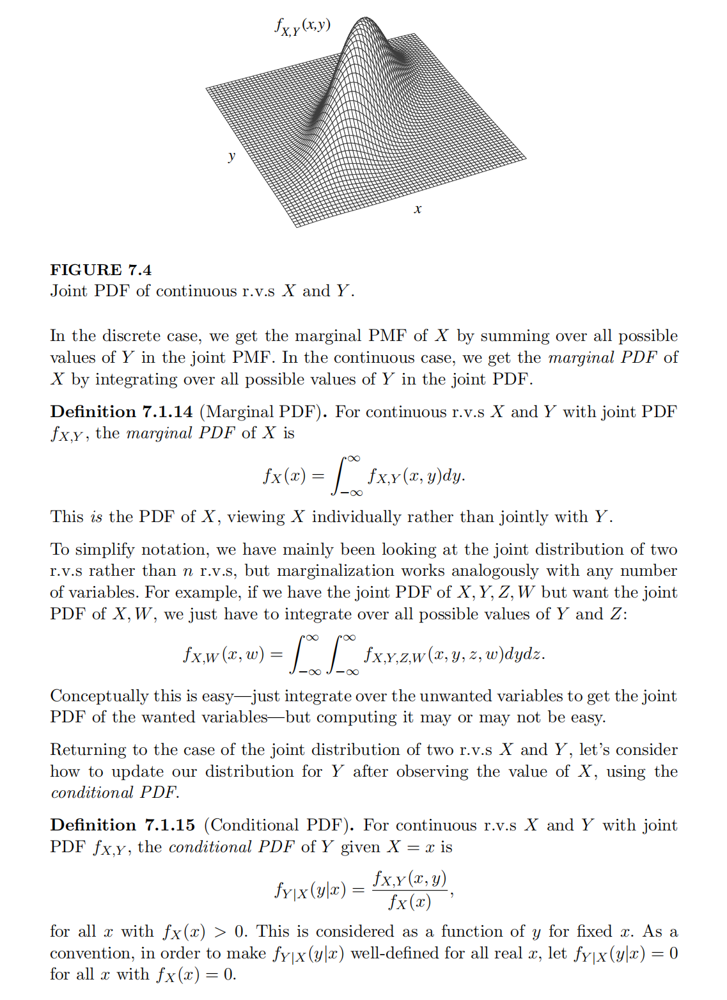
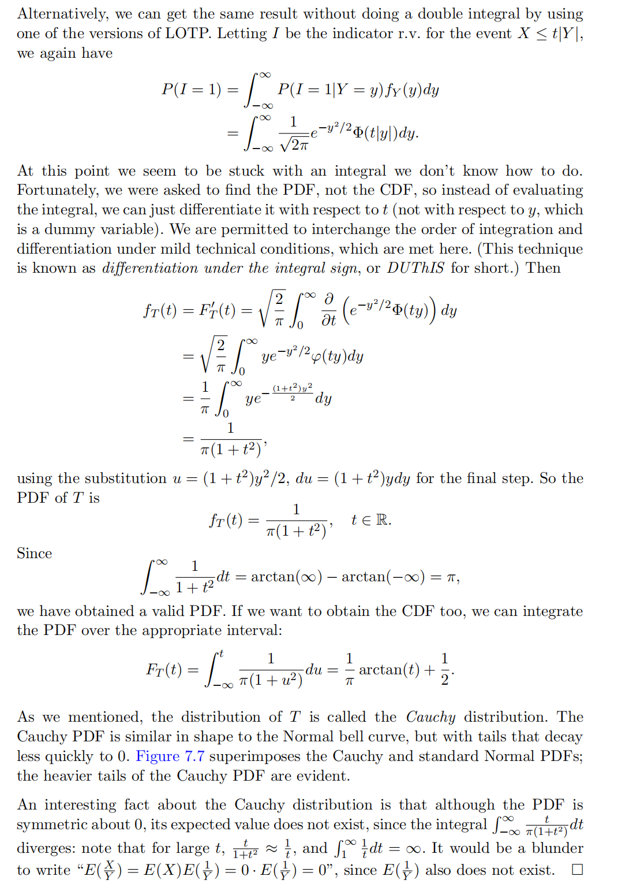

# st7


## Response:
已思考 27s

我们应该创建结构化的笔记，涵盖随机变量（r.v.s），边际与联合分布的定义，伯努利例子，单独与联合分析的区别，医学、遗传学、时间序列的应用。联合分布捕捉交互、相关性和依赖，提及边际化操作、独立性条件等。

我将逐步扩展重要概念：定义、区别、示例。首先，定义联合分布及其价值，然后讨论使用场景：推理、预测、参数估计、分解等。我会根据用户的要求，提供符合图片结构的完整笔记，涵盖标题+概述、详细解释、总结家报告。如果内容没有问题，最后说明页面清晰可读。

我需要解释什么是联合分布（多元分布），并说明为什么单独使用边际分布不够。因为边际分布可能相同，但依赖关系不同。例如：两个硬币抛掷，一个独立另一个完全反相关，即使它们是同一枚硬币（正反面）。

我会解释联合分布（多元分布）的概念，并说明为什么单独使用边际分布不足。因为虽然边际分布相同，依赖关系却可能不同。例如：两个硬币抛掷时，独立和完全反相关的情况，或者当它们在同一次抛掷中表现出某种关系时。

完成

第7章导学笔记：Joint Distributions（联合分布 / 多元分布）
========================================

**本页主旨概览**  
仅知道多个随机变量各自的分布（边缘分布）并不能说明它们之间是否存在**依赖关系**。现实问题常常关心多个变量**共同**出现的模式，因此需要用“**联合分布**（multivariate / joint distributions）”来完整刻画它们的相互关系。本章将系统引入**多元版的 CDF、PMF、PDF**，并在后面讨论若干经典多元分布（如二项分布与正态分布的高维推广）。

* * *

1\. 为什么“只看单个分布”是不够的？
--------------------

*   **边缘分布（individual distribution）**：每个随机变量各自的分布（如  $X$  的 PMF/PDF， $Y$  的 PMF/PDF）。  
    这些信息**不包含**二者之间“如何关联”的细节。
*   **反例直观**（教材 coin flip 思路）：  
    令  $X,Y\sim \text{Bern}(1/2)$ 。
    *   **独立情形**：若  $X$  与  $Y$  分别表示“两次**不同**抛硬币”是否为正面，则
        $$
        p_{X,Y}(x,y)=p_X(x)\,p_Y(y),\quad x,y\in\{0,1\},
        $$
        四种组合  $(0,0),(0,1),(1,0),(1,1)$  各自概率  $1/4$ 。
    *   **依赖情形**：若  $X$  与  $Y$  来自**同一次**抛硬币，且  
         $X=\mathbf{1}\{\text{为正面}\}$ ,  $Y=\mathbf{1}\{\text{为反面}\}$ ，则
        $$
        \mathbb{P}(X=1,Y=0)=\mathbb{P}(X=0,Y=1)=1/2,\quad \mathbb{P}(X=Y)=0.
        $$
        虽然  $X$  与  $Y$  **各自**仍是  $\text{Bern}(1/2)$ ，但它们呈**完全负相关**（ $X+Y=1$ ）。  
        👉 结论：**相同的边缘分布可以对应完全不同的依赖结构**。要刻画这种结构，就需要**联合分布**。

* * *

2\. 联合分布：核心定义与三件套
-----------------

> 多个随机变量一起的分布，刻画它们“同时取某些值”的概率/密度。

*   **联合 CDF（离散/连续统一的“上界概率”）**
    $$
    F_{X,Y}(x,y)=\mathbb{P}(X\le x,\;Y\le y).
    $$
    性质：非减、右连续；可由它推出边缘 CDF：  
     $F_X(x)=\lim_{y\to\infty}F_{X,Y}(x,y)$ ,  $F_Y(y)=\lim_{x\to\infty}F_{X,Y}(x,y)$ 。
*   **联合 PMF（离散型）**
    $$
    p_{X,Y}(x,y)=\mathbb{P}(X=x,\;Y=y),\qquad \sum_{x}\sum_{y}p_{X,Y}(x,y)=1.
    $$
    边缘化（求边缘分布）：  
     $p_X(x)=\sum_y p_{X,Y}(x,y),\; p_Y(y)=\sum_x p_{X,Y}(x,y)$ 。
*   **联合 PDF（连续型）**
    $$
    f_{X,Y}(x,y)\ge 0,\quad \iint f_{X,Y}(x,y)\,dx\,dy=1,
    $$
    有
    $$
    F_{X,Y}(x,y)=\int_{-\infty}^x\int_{-\infty}^y f_{X,Y}(u,v)\,dv\,du.
    $$
    边缘化：  
     $f_X(x)=\int_{-\infty}^{\infty} f_{X,Y}(x,y)\,dy$ ,  
     $f_Y(y)=\int_{-\infty}^{\infty} f_{X,Y}(x,y)\,dx$ 。

> **概率区域计算模板**
> 
> $$
> \mathbb{P}(a<X\le b,\;c<Y\le d)= \begin{cases} \displaystyle \sum_{x\in(a,b]}\sum_{y\in(c,d]} p_{X,Y}(x,y) & (\text{离散})\\[6pt] \displaystyle \int_{a}^{b}\int_{c}^{d} f_{X,Y}(x,y)\,dy\,dx & (\text{连续}) \end{cases}
> $$

* * *

3\. 依赖与独立：如何在联合分布中表达？
---------------------

*   **独立的判定（任何型）**
    $$
    F_{X,Y}(x,y)=F_X(x)\,F_Y(y)\quad\forall x,y.
    $$
    等价地：
    $$
    \text{离散： } p_{X,Y}(x,y)=p_X(x)\,p_Y(y);\qquad \text{连续： } f_{X,Y}(x,y)=f_X(x)\,f_Y(y).
    $$
*   **不独立**：上式不成立即表示存在某种**相互作用/依赖**（也可能表现为相关、非线性依赖等）。

* * *

4\. 现实为何必须“联合地”看待变量？
--------------------

> 教材列举的三类动机（这里做更贴近应用的扩展）：

1.  **医学（Medicine）**  
    病人的“血压—心率—胆固醇”等多项指标**联合**观察，才能识别共变模式（如代谢综合征特征）。
    *   统计任务：通过联合分布推导**条件概率/条件分布**（如高胆固醇人群的心率分布），用于诊断与分层决策。
2.  **遗传学（Genetics）**  
    多个遗传标记（SNP）与疾病**交互作用**常被忽略，单独看每个 SNP 的边缘效应会漏掉**基因-基因交互（epistasis）**。
    *   统计任务：构建多元模型或检验交互项，基于联合分布衡量“组合变异”对疾病风险的贡献。
3.  **时间序列（Time series）**  
    温度、股价、失业率等**随时间的序列**，往往需要**联合**分析不同时间点的取值（甚至多维序列的相互影响）。
    *   统计任务：用多元分布或协方差结构刻画“随时间”的依赖，用于趋势判别与**预测**。

* * *

5\. 先导术语与记号速查
-------------

*   r.v. = random variable（随机变量）
*   Bern $(1/2)$ ：取值  $\{0,1\}$ ，取 1 的概率为  $1/2$ 。
*   **边缘化（marginalization）**：由联合分布“求单边分布”的过程（求和/积分）。
*   **相互作用 / 依赖（interaction / dependence）**：两个或多个变量并非独立，联合分布中出现结构性关联。

* * *

6\. 练手小例（离散表格直观）
----------------

**A. 独立的二元 Bernoulli**（两次独立抛硬币）

$$
\begin{array}{c|cc} & Y=0 & Y=1\\\hline X=0 & 1/4 & 1/4\\ X=1 & 1/4 & 1/4 \end{array}
$$

每行/列求和得  $p_X,p_Y$ ，均为  $1/2$ 。

**B. 完全负相关**（同一次抛： $X$ \=正面指示， $Y$ \=反面指示）

$$
\begin{array}{c|cc} & Y=0 & Y=1\\\hline X=0 & 0 & 1/2\\ X=1 & 1/2 & 0 \end{array}
$$

边缘仍是  $1/2$ ，但联合结构完全不同。

* * *

7\. 本章将要铺开的路线图（读前心中有数）
----------------------

> 虽然本页只是绪论，但为了自洽理解，先给出后续常用公式“导航”，便于你读后即可独立做题。

*   **条件分布**（离散为例）
    $$
    p_{Y\mid X}(y\mid x)=\frac{p_{X,Y}(x,y)}{p_X(x)}\quad (p_X(x)>0).
    $$
    连续型同理： $f_{Y\mid X}(y\mid x)=f_{X,Y}(x,y)/f_X(x)$ 。
*   **全概率 / Bayes 链接**
    $$
    p_Y(y)=\sum_x p_{Y\mid X}(y\mid x)\,p_X(x),\qquad p_{X\mid Y}(x\mid y)=\frac{p_{Y\mid X}(y\mid x)p_X(x)}{p_Y(y)}.
    $$
*   **协方差与相关系数**（量化线性依赖）
    $$
    \mathrm{Cov}(X,Y)=\mathbb{E}\big[(X-\mu_X)(Y-\mu_Y)\big],\qquad \rho=\frac{\mathrm{Cov}(X,Y)}{\sigma_X\sigma_Y}.
    $$
    （ $\rho=0$  仅表示“线性不相关”，**不等于**独立。）
*   **多元常见分布**
    *   多项式/多元二项、**多元正态**（后文会作为“高维推广”的典型）。

* * *

8\. 与实际学习的衔接建议
--------------

1.  做题先画**区域**或列**概率表**，再用“边缘化/条件化/独立性判定”的三板斧。
2.  看到“只给了各自分布”的题，要主动警惕：**还缺依赖信息**，除非补充了“独立”假设。
3.  任何“预测/推断”任务若涉及**多个变量同时出现**，优先考虑联合分布建模（哪怕是近似/参数化版本）。

* * *

本页小结
----

*   边缘分布不含依赖结构；联合分布补齐了“变量之间如何一起变化”的关键信息。
*   本章将引入多元版的 CDF/PMF/PDF，并由此发展出条件分布、独立性判定、边缘化等基本操作，最终走向多元经典分布与应用。

* * *

报错/可读性
------

本页截图清晰、内容完整，无不可辨识之处。若你接下来继续发送后续页，我会把它们**视作同一连续章节**，接着在此笔记上扩展并串联讲解。


## Response:
已思考 36s

首先设定标题为“7.1 联合、边缘与条件（离散版）”。

接着，我会将内容分为三大部分：第一部分介绍概念，包括 r.v. 的分布、联合分布、边缘分布和条件分布；

第二部分讲解联合 CDF 的定义及性质，重点讨论离散变量的阶梯性质；

第三部分涉及联合 PMF 的定义与约束，给出具体的计算示例。

首先，给出数字示例，并描述一个 3D 条形图的视觉效果：“总条形高度之和为1”。每列固定 x 对应 Y 的分布。其实描述里提到的是，每列代表固定 x，每行代表固定 y，计算边际 PMF 时，通过对 y 求和得到边际分布。

接着，解释如何通过求和计算边际概率。

首先，我要展示如何将公式推广到n个变量，例如 p\_{X\_i}(x\_i) = Σ 其他变量。接着，提供一个算法：1) 确认支持；2) 使用 p\_{X,Y} 表格；3) 通过行/列求和得到边际分布；4) 对事件集求和；5) 检验独立性：检查 p\_{X,Y} = p\_X p\_Y。

此外，提醒一些潜在问题，特别是联合CDF的边界和支持部分的矩形限制。

我决定先提到，虽然这个内容可能稍后出现，但现在补充也很好，可以帮助解释联合分布如何完全决定所有内容。

此外，我会解释“边际化可看作堆叠条形图”。特别提到一些边缘案例可能不规则，因此离散情况下使用PMF而非CDF更方便。

还会提到常见的混淆，比如 P(X≤x,Y≤y) 和 P(X=x,Y=y) 的不同，重点是如何用差分CDF计算，并提到支持集的概念。

完成

7.1 联合、边缘与条件（离散版起步）
===================

**本页要点概览**

*   三个关键词：**联合（joint）**、**边缘（marginal）**、\*\*条件（conditional）\*\*分布。
*   单变量的分布能给出  $X$  在实数轴**任何集合**上的概率；类比地，**联合分布**给出向量  $(X,Y)$  在平面**任何区域**上的概率。
*   **边缘分布**是“只看其中一个变量”的分布（例如只看  $X$ ，把  $Y$  忽略/求和掉）。
*   **条件分布**是“观测到  $Y=y$  之后，对  $X$  的**更新**分布”。
*   离散情形中，最通用的联合刻画是 **联合 CDF**  $F_{X,Y}(x,y)=\mathbb{P}(X\le x,\;Y\le y)$ ，但更好用、更直观的是 **联合 PMF**  $p_{X,Y}(x,y)=\mathbb{P}(X=x,Y=y)$ 。

* * *

1\. 联合 CDF（Joint CDF）
---------------------

**定义（Definition 7.1.1）**

$$
F_{X,Y}(x,y)=\mathbb{P}(X\le x,\; Y\le y).
$$
*   适用于离散、连续、混合随机变量，因而是“**最一般**的描述”。
*   基本性质（了解）：
    1.  对  $x,y$  **分别非减**；2) 右连续；3) 边界：  
         $\lim_{x\to -\infty}F_{X,Y}(x,y)=0,\;\lim_{x\to\infty}F_{X,Y}(x,y)=F_Y(y)$ （把  $X$  放到  $+\infty$  等价于“只看  $Y$ ”）；  
        同理  $\lim_{y\to\infty}F_{X,Y}(x,y)=F_X(x)$ ， $\lim_{x,y\to\infty}F_{X,Y}(x,y)=1$ 。
*   **离散例行提醒**：CDF 在离散情形由“**台阶+平坦**”组成（跳跃函数），可读性不如 PMF，因此实际做题常换用 PMF。

> （进阶桥接）离散时，CDF 与 PMF 可互转：
> 
> $$
> p_{X,Y}(x,y)=F_{X,Y}(x,y)-F_{X,Y}(x^{-},y)-F_{X,Y}(x,y^{-})+F_{X,Y}(x^{-},y^{-}),
> $$
> 
> 这里  $x^{-}$  表示  $x$  左侧的“紧邻前一个取值”。

* * *

2\. 联合 PMF（Joint PMF）
---------------------

**定义（Definition 7.1.2）**

$$
p_{X,Y}(x,y)=\mathbb{P}(X=x,\;Y=y).
$$

**合法性条件**（和单变量 PMF 一样）：

$$
p_{X,Y}(x,y)\ge 0,\qquad \sum_{x}\sum_{y} p_{X,Y}(x,y)=1,
$$

求和范围覆盖  $(X,Y)$  的所有可能取值（称为**支持集**，support）。

**用联合 PMF 计算任意事件概率**  
给定平面上的任意点集  $A$ （只包含格点  $(x,y)$ ），

$$
\mathbb{P}\big((X,Y)\in A\big)=\sum_{(x,y)\in A} p_{X,Y}(x,y).
$$

这就是“**把事件对应的格点概率加起来**”。

**图像直观（Figure 7.1）**

*   把每个格点  $(x,y)$  竖起一根“概率柱”，高度就是  $p_{X,Y}(x,y)$ ；
*   **所有柱子的总高度之和为 1**；
*   这幅 3D 小棒图非常利于“看出质量集中在哪儿”。

> **期望与函数概率**（提前给出最常用模板）  
> 对任何函数  $g$ ，
> 
> $$
> \mathbb{E}[g(X,Y)] = \sum_{x}\sum_{y} g(x,y)\,p_{X,Y}(x,y).
> $$
> 
> 这说明：**一旦知道联合 PMF，所有与  $(X,Y)$  相关的期望、方差、协方差，都能计算出来**。

* * *

3\. 边缘 PMF（Marginal PMF）
------------------------

**动机**  
从联合分布退回“只看  $X$ ”或“只看  $Y$ ”。教材把“只看  $X$ ”称为  $X$  的**边缘/无条件分布**（marginal/unconditional）。

**定义（Definition 7.1.3）**

$$
p_X(x)=\mathbb{P}(X=x)=\sum_{y} \mathbb{P}(X=x,Y=y)=\sum_{y} p_{X,Y}(x,y).
$$

同理

$$
p_Y(y)=\sum_{x} p_{X,Y}(x,y).
$$

**可视化理解（教材对 Figure 7.2 的文字说明）**

*   把联合 PMF 看作“按列（固定  $x$ ）的一叠小棒”。
*   对固定的  $x$ ，把该列所有  $y$  上的柱子**逐个相加并堆叠**，得到总高度  $p_X(x)$ 。
*   对每个  $x$  重复此操作，就得到整条  $p_X$  曲线（“**把  $Y$  边缘化掉**”）。
*   同理，沿“行”（固定  $y$ ）求和得到  $p_Y(y)$ 。

> **本质理由**： $\{(X=x,Y=y): y\text{ 取遍其支持}\}$  是一组**互斥并集**，由概率公理  
>  $\mathbb{P}(\biguplus_y A_y)=\sum_y\mathbb{P}(A_y)$  直接得到边缘化公式。

* * *

4\. 迷你数值例子（把定义用“表格”落地）
----------------------

设  $(X,Y)$  的支持与 PMF 为（只举 6 个格点；其余为 0）：

|  $y\backslash x$  | 0 | 1 |
| --- | --- | --- |
| 0 | 0.10 | 0.15 |
| 1 | 0.25 | 0.20 |
| 2 | 0.05 | 0.25 |

*   合法性检查：总和  $=1$ 。
*   **求边缘**
    $$
    p_X(0)=0.10+0.25+0.05=0.40,\quad p_X(1)=0.15+0.20+0.25=0.60;
    $$
    $$
    p_Y(0)=0.10+0.15=0.25,\; p_Y(1)=0.25+0.20=0.45,\; p_Y(2)=0.05+0.25=0.30.
    $$
*   **求事件概率**（例如  $A=\{(x,y): x=1,\; y\in\{0,2\}\}$ ）  
     $\mathbb{P}((X,Y)\in A)=0.15+0.25=0.40$ 。
*   **独立性快检**：若独立应对每个格点有  $p_{X,Y}(x,y)=p_X(x)p_Y(y)$ 。  
    例如检查  $(x,y)=(0,1)$ ：左边  $0.25$ ，右边  $0.40\times0.45=0.18$ ，不相等 ⇒ **不独立**。

* * *

5\. 和条件分布的衔接（预告，下一页会正式给出）
-------------------------

一旦有了联合与边缘，**条件 PMF** 自然写成

$$
p_{Y\mid X}(y\mid x)=\frac{p_{X,Y}(x,y)}{p_X(x)}\qquad(p_X(x)>0),
$$

并有

$$
p_Y(y)=\sum_x p_{Y\mid X}(y\mid x)\,p_X(x),\qquad p_{X\mid Y}(x\mid y)=\frac{p_{Y\mid X}(y\mid x)p_X(x)}{p_Y(y)}.
$$

这些是“联合—边缘—条件”三件套之间的基本通道。

* * *

6\. 常见易混&解题套路
-------------

*   **CDF 与 PMF 不要混**：  
     $F_{X,Y}(x,y)$  计算的是“矩形  $(-\infty,x]\times(-\infty,y]$ ”的概率；  
     $p_{X,Y}(x,y)$  是“格点  $(x,y)$ ”的概率。
*   **求边缘＝按行/按列求和**；**求事件＝挑格子相加**。
*   **看独立性**：检查是否  $p_{X,Y}(x,y)=p_X(x)p_Y(y)$  对所有支持点都成立（只要有一个不等即不独立）。
*   **支持不规则**时，格点加和的“范围”要按题意精确圈定；不要偷把“不可能点”算进去。

* * *

小结
--

*   本页建立了离散情形的三基石：**联合 CDF**（通用但不便于离散可视化）、**联合 PMF**（最常用的离散刻画）、**边缘 PMF**（把另一维“求和掉”）。
*   有了联合 PMF，任何概率、期望及独立性判断都能完成；边缘化就是“把另一维的柱子堆起来”。
*   下一步自然是：**条件分布**、**独立性判定的等价形式**与**连续情形的联合 PDF**。

* * *

报错 / 可读性
--------

*   两页截图清晰、公式与图示可辨。文中提到的 _Figure 7.2_ 尚未出现在你给的图片里；若需要我会在你发来该页后继续衔接讲解“边缘化的柱状堆叠图”。


7.1（续）从联合到边缘，再到条件：把“堆柱子”说透（离散）
==============================

**本页要点**

*   **Figure 7.2** 用“鸟瞰柱状图”解释：对固定的  $x$ ，把联合 PMF 在 **y 方向** 的所有小柱子**相加**，就得到边缘  $p_X(x)=\mathbb{P}(X=x)$ 。
*   也可用**联合 CDF 取极限**得到边缘 CDF： $F_X(x)=\lim_{y\to\infty}F_{X,Y}(x,y)$ 。
*   只知道边缘  $p_X,p_Y$ **无法**还原联合  $p_{X,Y}$ （“堆起来容易，拆回去难”）。
*   观测到  $X=x$  后，应使用**条件 PMF** 更新  $Y$  的分布：
    $$
    p_{Y\mid X}(y\mid x)=\frac{p_{X,Y}(x,y)}{p_X(x)}\quad(p_X(x)>0).
    $$

* * *

1\. “堆柱子”＝边缘化（marginalization）
------------------------------

### 1.1 用 PMF 求边缘（Figure 7.2 的数学表达）

*   **定义回顾**：联合 PMF  $p_{X,Y}(x,y)=\mathbb{P}(X=x,Y=y)$ 。
*   **对  $X$  的边缘**（把  $Y$  消去）：
    $$
    p_X(x)=\sum_{y} p_{X,Y}(x,y).
    $$
    直观就是：**固定  $x$ **，把这一列所有  $y$  的小柱子加起来。
*   **对  $Y$  的边缘**：
    $$
    p_Y(y)=\sum_{x} p_{X,Y}(x,y),
    $$
    即对每个固定  $y$  沿 **x 方向** 把柱子加起来。

> 关键理解：联合 PMF 像“二维质量分布”，边缘化就是把一维**压扁**到另一维上。

### 1.2 用联合 CDF 取极限得到边缘 CDF

$$
F_X(x)=\mathbb{P}(X\le x) =\lim_{y\to\infty}\mathbb{P}(X\le x,\;Y\le y) =\lim_{y\to\infty}F_{X,Y}(x,y).
$$

（离散里通常还是用 PMF 更直观易算。）

### 1.3 为什么“知道边缘还原不了联合”

*    $p_X,p_Y$  只告诉我们“每列/每行的总高度”，但**列内各柱子如何分配**（也就是依赖结构）并不唯一。
*   需要**额外假设**（如独立、某种参数化模型、协方差/相关结构等）才能确定或估计联合。

* * *

2\. 条件 PMF：观测后的“更新分布”
---------------------

**Definition 7.1.4（条件 PMF）**  
对离散  $X,Y$ ，若  $p_X(x)>0$ ，

$$
p_{Y\mid X}(y\mid x)=\mathbb{P}(Y=y\mid X=x) =\frac{\mathbb{P}(X=x,Y=y)}{\mathbb{P}(X=x)} =\frac{p_{X,Y}(x,y)}{p_X(x)}.
$$

把  $x$  视为已知常数后， $p_{Y\mid X}(\cdot\mid x)$  是  $y$  的函数。

### 2.1 条件 PMF 的基本性质

1.  **非负、归一**： $\sum_y p_{Y\mid X}(y\mid x)=1$ （当  $p_X(x)>0$ ）。
2.  **联合=边缘×条件（链式法则）**：
    $$
    p_{X,Y}(x,y)=p_{Y\mid X}(y\mid x)\,p_X(x) =p_{X\mid Y}(x\mid y)\,p_Y(y).
    $$
3.  **全概率公式**：
    $$
    p_Y(y)=\sum_x p_{Y\mid X}(y\mid x)\,p_X(x).
    $$
4.  **Bayes 公式**（离散版）：
    $$
    p_{X\mid Y}(x\mid y) =\frac{p_{Y\mid X}(y\mid x)\,p_X(x)}{p_Y(y)}\quad(p_Y(y)>0).
    $$
5.  **独立性的刻画**：若对所有  $x$  有  $p_{Y\mid X}(y\mid x)=p_Y(y)$ （对所有  $y$  成立），则  $X$  与  $Y$ **独立**；反之亦然。

> **注意“分母为 0”**：当  $p_X(x)=0$  时  $p_{Y\mid X}(y\mid x)$  不定义（该条件事件本身概率为 0）。

* * *

3\. 数值小例：从联合到边缘与条件
------------------

设联合 PMF（未出现的点概率为 0）：

|  $y\backslash x$  | 0 | 1 |
| --- | --- | --- |
| 0 | 0.10 | 0.15 |
| 1 | 0.25 | 0.20 |
| 2 | 0.05 | 0.25 |

1.  **边缘**
  
$$
p_X(0)=0.10+0.25+0.05=0.40,\quad p_X(1)=0.60;
$$

$$
p_Y(0)=0.25,\;p_Y(1)=0.45,\;p_Y(2)=0.30.
$$
2.  **条件**（例如给定  $X=1$ ）
  
$$
p_{Y\mid X}(0\mid1)=\frac{0.15}{0.60}=0.25,\quad p_{Y\mid X}(1\mid1)=\frac{0.20}{0.60}=0.333\ldots,\quad p_{Y\mid X}(2\mid1)=\frac{0.25}{0.60}=0.416\ldots
$$

校验：三者相加为 1。

> 与边缘  $p_Y$  比较可见：观测到  $X=1$  后， $Y=2$  的概率从 0.30 提升到约 0.416，说明**存在依赖**。

3.  **由条件与边缘复原联合**  
    例如  $(x,y)=(1,2)$ ：  
     $p_{X,Y}(1,2)=p_{Y\mid X}(2\mid1)\,p_X(1)=0.416\ldots\times 0.60\approx0.25$ （与原表吻合）。

* * *

4\. 解题流程模板（离散）
--------------

1.  **先写出/读出**联合 PMF 支持与数值。
2.  要边缘：**按行或按列求和**（对应 Figure 7.2 的“堆柱子”）。
3.  要条件：先算分母的边缘  $p_X(x)$  或  $p_Y(y)$ ，再用商公式。
4.  查独立：检验  $p_{X,Y}(x,y)\overset{?}{=}p_X(x)p_Y(y)$ ；或看  $p_{Y\mid X}(y\mid x)$  是否与  $x$  无关。
5.  事件概率：把事件包含的格点**逐个相加**。

* * *

5\. 与连续情形的桥接（预告）
----------------

*   连续时把“求和”换成“积分”：  
     $f_X(x)=\int f_{X,Y}(x,y)\,dy$ ，  
     $f_{Y\mid X}(y\mid x)=\dfrac{f_{X,Y}(x,y)}{f_X(x)}$ （若  $f_X(x)>0$ ）。
*   CDF 取极限的思路同样成立： $F_X(x)=\lim_{y\to\infty}F_{X,Y}(x,y)$ 。

* * *

本页小结
----

*   **边缘化**： $p_X(x)=\sum_y p_{X,Y}(x,y)$ ， $p_Y(y)=\sum_x p_{X,Y}(x,y)$ ；图上就是把柱子沿另一维**相加**。
*   **只知边缘不足以确定联合**；需要独立性或参数化等**额外信息**。
*   **条件 PMF**是观测后的“更新法则”，满足归一，且把联合、边缘、Bayes 与全概率紧密连接。

* * *

报错 / 可读性
--------

截图清晰完整；Figure 7.2 的箭头和柱状示意可读性良好，无缺失内容。后续页若进入“条件 PMF 的计算例题/连续版”，请继续发来，我会在本笔记上衔接扩展。


## Response:
已思考 49s

我正在展示如何计算条件概率，比如P(Y=1|X=1)=5/25=0.2，理解为当前吸烟者发生肺癌的概率为20%。接下来计算P(Y=1|X=0)=3/75=0.04，另外也可以计算P(X=1|Y=1)=5/8=0.625。此外，利用贝叶斯公式推导P(X=1|Y=1)。

首先介绍条件PMF的本质，解释重标定过程，并展示数学推导，例如对于固定的x，定义S={y}等，并确保PMF和其性质符合规则，和“为每个x定义一个条件PMF族”。然后通过图7.3解释每个步骤，包括选择列、丢弃其他条形、再重标定。最后简要介绍贝叶斯公式和全概率公式。

我在分析例子7.1.5中展示了2x2表，计算了边际分布，并将其解读为伯努利分布。接着，我计算了条件概率、检查了独立性、评估了风险指标和比率，并通过贝叶斯公式验证了计算。部分内容涉及通用解题流程及注意避免常见错误，如条件与无条件概率区分。

基于表格计算了边际总数、条件概率和相对比率。比如，P(Y=1 | X=1) = 0.2，P(Y=1 | X=0) = 0.04等，同时验证了独立性与风险比，并计算了赔率比。此外, 我还解释了条件PMF的归一化过程和期望值的公式。

完成

7.1（续）条件 PMF、Bayes 与 2×2 列联表实例
==============================

**本页概况**  
在“联合→边缘”的基础上，本页把重点放在**条件 PMF**（观测到一个变量后的更新分布）及其可视化理解（**重标定 renormalize**），并给出与 **Bayes 公式**、**全概率公式** 的连接。随后用一个吸烟（ $X$ ）与肺癌（ $Y$ ）的 **2×2 列联表**做完整数值推导与解读。

* * *

1\. 条件 PMF 的本质：对一列做“重标定”
------------------------

**条件 PMF 定义回顾（离散）**

$$
p_{Y\mid X}(y\mid x)=\frac{p_{X,Y}(x,y)}{p_X(x)},\qquad p_X(x)=\sum_y p_{X,Y}(x,y),\quad (p_X(x)>0).
$$

**为何称“重标定（renormalize）”？（Figure 7.3 的直观）**

1.  先看联合 PMF 的“柱状森林”。
2.  **条件在  $X=x$ **：除“列  $x$ ”以外的所有柱子都与事实不相容，故**忽略**。
3.  “列  $x$ ”里仍有若干小柱（不同  $y$ ）。它们的总高就是  $p_X(x)$ 。要把这列变成一个**合法 PMF**，必须让其**总和=1**，因此把每根柱子**除以**  $p_X(x)$ 。  
    这一步就是 **renormalize**：
    $$
    \text{新高度}= \frac{\text{旧高度 }p_{X,Y}(x,y)}{\text{该列总高 }p_X(x)}.
    $$
4.  对每个可能的  $x$  都能得到一条不同的  $p_{Y\mid X}(\cdot\mid x)$ ，所以条件 PMF 是一**族**分布（每个  $x$  一条）。

> 有效性： $\sum_y p_{Y\mid X}(y\mid x)=\frac{\sum_y p_{X,Y}(x,y)}{p_X(x)}=\frac{p_X(x)}{p_X(x)}=1$ 。

**条件期望的提示**  
既然  $p_{Y\mid X}(\cdot\mid x)$  是合法 PMF，就可定义

$$
\mathbb{E}[Y\mid X=x]=\sum_{y} y\,p_{Y\mid X}(y\mid x).
$$

（教材第 9 章会系统展开，这里先作概念连接。）

* * *

2\. 与 Bayes & 全概率 的桥接（书中等式）
---------------------------

*   **Bayes 公式（离散）**
    $$
    \mathbb{P}(Y=y\mid X=x)=\frac{\mathbb{P}(X=x\mid Y=y)\,\mathbb{P}(Y=y)}{\mathbb{P}(X=x)}.
    $$
    它只是把联合写成两种“边缘×条件”的分解并相等：  
     $p_{X,Y}=p_{Y\mid X}p_X=p_{X\mid Y}p_Y$ 。
*   **全概率公式（LOTP）**
    $$
    p_X(x)=\sum_{y} p_{X\mid Y}(x\mid y)\,p_Y(y).
    $$
    直观：用“按  $Y$  分层”的条件分布对  $X$  做加权平均（权重是  $p_Y$ ）。

* * *

3\. 数值例（Example 7.1.5）——2×2 列联表
-------------------------------

设  $X$ \=是否为当前吸烟者（1 是，0 否）， $Y$ \=一生中是否患肺癌（1 是，0 否）。给出联合 PMF：

$$
\begin{array}{c|cc} & Y=1 & Y=0\\\hline X=1 & \frac{5}{100} & \frac{20}{100}\\ X=0 & \frac{3}{100} & \frac{72}{100} \end{array}
$$

（未列出的组合概率为 0。）

### 3.1 先求边缘（把行/列的柱子“堆起来”）

*    $p_X(1)=\tfrac{5+20}{100}=\tfrac{25}{100}=0.25,\;\; p_X(0)=0.75.$   
    ⇒  $X\sim \text{Bern}(0.25)$ （25% 的人是当前吸烟者）。
*    $p_Y(1)=\tfrac{5+3}{100}=\tfrac{8}{100}=0.08,\;\; p_Y(0)=0.92.$   
    ⇒  $Y\sim \text{Bern}(0.08)$ （总体肺癌概率 8%）。

### 3.2 条件分布（对列做重标定）

*    $\displaystyle p(Y=1\mid X=1)=\frac{5/100}{25/100}=\frac{5}{25}=0.2.$   
    解释：在吸烟者中，患肺癌的条件概率为 **20%**（相比无条件 8% 明显升高）。
*    $\displaystyle p(Y=1\mid X=0)=\frac{3/100}{75/100}=\frac{3}{75}=0.04.$   
    不吸烟者的条件概率 **4%**。

（校验：对  $X=1$ ， $p(Y=0\mid X=1)=1-0.2=0.8$ ；对  $X=0$ ， $p(Y=0\mid X=0)=0.96$ ，均合法。）

### 3.3 反向条件与 Bayes 检验

*    $\displaystyle p(X=1\mid Y=1)=\frac{5/100}{8/100}=\frac{5}{8}=0.625.$   
    解释：在患肺癌者里，62.5% 是当前吸烟者。
*   用 Bayes 验证同一数值：  
     $\displaystyle \frac{p(Y=1\mid X=1)p_X(1)}{p_Y(1)}=\frac{0.2\times 0.25}{0.08}=0.625.$  ✅

### 3.4 是否独立？（一眼看穿）

若独立，应有  $p_{X,Y}(1,1)=p_X(1)p_Y(1)=0.25\times 0.08=0.02$ 。  
实际  $p_{X,Y}(1,1)=0.05\neq 0.02$  ⇒ **不独立**（且呈正关联）。

### 3.5 统计学常用效应量（加深理解）

*   **相对危险度（Risk Ratio）**：  
     $\displaystyle RR=\frac{p(Y=1\mid X=1)}{p(Y=1\mid X=0)}=\frac{0.20}{0.04}=5.$   
    吸烟者患病风险是非吸烟者的 **5 倍**。
*   **比值比（Odds Ratio）**：  
     $\displaystyle OR=\frac{(5/20)}{(3/72)}=\frac{5\times 72}{20\times 3}=6.$ 

### 3.6 条件期望与 LIE（迭代期望律）的小核对

*    $\mathbb{E}[Y\mid X=1]=1\cdot 0.2+0\cdot 0.8=0.2$ ，  
     $\mathbb{E}[Y\mid X=0]=0.04$ 。
*    $\mathbb{E}[Y]=0.2\times 0.25+0.04\times 0.75=0.05+0.03=0.08$ （与边缘  $p_Y(1)$  一致）。  
    这就是 LIE： $\mathbb{E}[Y]=\mathbb{E}\big[\mathbb{E}(Y\mid X)\big]$ 。

* * *

4\. 解题与易错点清单
------------

*   **条件 = 选列并重标定**；别忘了**分母**  $p_X(x)$  或  $p_Y(y)$ （若为 0 则条件概率不定义）。
*   **Bayes 是“翻转条件”的合法途径**：  
     $p(Y\mid X)=\dfrac{p(X\mid Y)p(Y)}{p(X)}$ ，切勿直接把  $p(Y\mid X)$  当作  $p(X\mid Y)$ 。
*   **全概率**：要边缘就“按另一变量分层加权”。
*   **独立性检查**：任取一点看  $p_{XY}(x,y)\stackrel{?}=p_X(x)p_Y(y)$ ；或看  $p(Y\mid X)$  是否与  $x$  **无关**。
*   **2×2 表常见总结**：同时给出边缘（行/列合计）、条件（行内或列内占比）、并可进一步算 RR/OR 解释关联强度。

* * *

本段小结
----

*   **条件 PMF**就是把联合 PMF 中与事件不相容的柱子丢掉，对与事件相容的一列做**重标定**使和为 1。
*   与 **Bayes**、**全概率**相结合，可以在“联合—边缘—条件”三者之间自由切换与校验。
*   通过 2×2 列联表，我们完成了边缘、条件、Bayes、独立性与效应量的一次性演练。

* * *

报错 / 清晰度
--------

两张截图内容完整清晰，公式与表格可读性良好，无缺漏。若你继续发送后续小节（如**连续型联合 PDF 与条件密度**），我会把笔记按同一脉络继续拓展与串联。


## Response:
已思考 27s

We’re focusing on independence, using the 2x2 table to check it. If the product of marginal probabilities doesn’t match the joint probability, they’re not independent. For example, p(X=1, Y=1) vs. the product of p\_X(1) and p\_Y(1). A quick test algorithm can simplify this.

我们需要保持一致的语气，以中文表述。标题定为“7.1（终）独立性的三种等价刻画与列联表判断”。

具体内容包括：精确定义，使用CDF因式分解、PMF因式分解和条件PMF平等。通过差异CDF和求和简短证明独立性，其中涉及事件级特性P(X ≤ x, Y ≤ y) = P(X ≤ x)P(Y ≤ y)。

对于离散变量，独立性通过所有集合的等式表示。联结PMF因式分解证明了独立性。如果PMF因式分解，则联合分布的概率可以表示为各自概率的乘积，反之亦然。

条件等价：1. 联合CDF因式分解；2. 离散联合PMF因式分解；3. 条件不变性。

需要计算每行条件概率并检查行之间的一致性，确保“行概率在X上保持不变”。可以利用卡方检验，但可能过于深入。还可以展示关于边际PMF和条件分布之间的关系。

结构包括标题、总结、边际定义、独立性定义、等价条件展示以及具体示例。

完成

7.1（终）独立性的等价刻画与 2×2 列联表检验
=========================

**本页概况**  
在已经掌握“联合—边缘—条件”的基础上，这一页把**独立性**系统化：给出三种**等价**刻画，并用上页的吸烟( $X$ )—肺癌( $Y$ ) 2×2 表做数值验证。还解释了“marginal（边缘）”一词在统计学语境中的含义。

* * *

1\. “marginal”的含义补充（7.1.6）
--------------------------

*   经济学里 **marginal** 常指“导数/边际变化”（如边际收益的导数意义）。
*   统计学里 **marginal** 指“把另一个变量**求和/积分**掉的**边缘分布**”。在列联表中，把行或列求和写在表格**边缘**（margin），直观地体现了“marginal”。

* * *

2\. 独立性的三种等价刻画（Definition 7.1.7）
--------------------------------

令  $X,Y$  为离散随机变量，则以下三条**两两等价**：

### (a) CDF 因式分解

$$
F_{X,Y}(x,y)=F_X(x)\,F_Y(y)\quad \forall\,x,y.
$$

### (b) PMF 因式分解（离散最常用）

$$
p_{X,Y}(x,y)=p_X(x)\,p_Y(y)\quad \forall\,x,y.
$$

### (c) 条件概率“不更新”

$$
\mathbb{P}(Y=y\mid X=x)=\mathbb{P}(Y=y)\quad \forall\,x,y\ \text{且 }p_X(x)>0.
$$

> 直观：知道  $X=x$  后，对  $Y$  的看法**不需要更新**；换言之，所有条件 PMF 都与  $Y$  的**边缘 PMF**相同。

**等价性的直观证明思路**

*   (b) ⇒ (c)： $\displaystyle \mathbb{P}(Y=y\mid X=x)=\frac{p_{X,Y}(x,y)}{p_X(x)}=\frac{p_X(x)p_Y(y)}{p_X(x)}=p_Y(y)$ 。
*   (c) ⇒ (b)： $\displaystyle p_{X,Y}(x,y)=\mathbb{P}(Y=y\mid X=x)p_X(x)=p_Y(y)p_X(x)$ 。
*   (a) 与 (b) 的等价：在离散型，把 CDF 的“台阶跳跃”与单点质量一一对应，即可互推。

**重要提醒**

*   **一般情况下**，仅知道边缘  $p_X,p_Y$  **不足以**确定联合  $p_{X,Y}$ 。
*   但在**独立**这个特例里，边缘已经足够：直接做乘积得到联合。

* * *

3\. 回到 2×2 列联表（Example 7.1.8）：检验不独立
-----------------------------------

联合 PMF（行是  $X$ ，列是  $Y$ ）：

$$
\begin{array}{c|cc|c} & Y=1 & Y=0 & \text{Total}\\\hline X=1 & \tfrac{5}{100} & \tfrac{20}{100} & \tfrac{25}{100}\\ X=0 & \tfrac{3}{100} & \tfrac{72}{100} & \tfrac{75}{100}\\\hline \text{Total} & \tfrac{8}{100} & \tfrac{92}{100} & 1 \end{array}
$$

**边缘**  
 $p_X(1)=0.25,\; p_Y(1)=0.08$ 。

**用 (b) 检验**  
若独立应有

$$
p_{X,Y}(1,1)=p_X(1)\,p_Y(1)=0.25\times 0.08=0.02.
$$

而表中  $p_{X,Y}(1,1)=0.05\neq 0.02$  ⇒ **不独立**。

**用 (c) 再检验**

$$
\mathbb{P}(Y=1\mid X=1)=\frac{5/100}{25/100}=0.2\neq 0.08=\mathbb{P}(Y=1).
$$

条件概率随  $X$  改变 ⇒ **不独立**（并且是**正关联**：吸烟提升患病概率）。

* * *

4\. 速用清单（做题模板）
--------------

1.  **PMF 因式分解法**：任选若干格点，看  $p_{XY}(x,y)\stackrel{?}{=}p_X(x)p_Y(y)$ 。
2.  **条件不更新法**：比较  $p(Y=y\mid X=x)$  与  $p_Y(y)$  是否相等（或看不同行的条件列比例是否一致）。
3.  **CDF 法**（少用在离散题）：检查  $F_{XY}=F_XF_Y$ 。

> 小心：**零相关（Cov=0）≠ 独立**（除非已知是联合正态等特殊情形）。

* * *

5\. 一句话总结
---------

*   **独立** ⇔ **联合=边缘乘积** ⇔ **条件=边缘（不更新）**。
*   仅在独立时，边缘就能“拼”出联合；否则必须研究联合来把握**依赖结构**。

* * *

报错 / 可读性
--------

本页截图清晰、内容完整，无缺失或模糊之处。若你继续发送下一小节（如“连续情形的联合 PDF 与条件密度/独立性”），我会把笔记无缝衔接下去。


## Response:
已思考 41s

在这个问题中，独立性似乎有些反直觉，但泊松随机性带来了独立性。例如，若X和Y是独立的泊松分布，则X + Y 仍是泊松分布。然后，如果N是泊松分布，且X|N=n是二项分布（Binomial），则X和Y是独立的。

我注意到，P(X=x | X + Y = n) ≠ P(X=x | Y = n-x)，因为前者是基于二项分布（Binomial）而非泊松分布。这个错误很重要，要特别小心条件概率的表述和变量的左对右关系。此外，我会重新验证之前的表格，澄清非独立性并给出导出式。

我发现，通过观察指数项  $e^{-\lambda}$  可以分解为  $e^{-\lambda p} e^{-\lambda q}$ ，因为  $\lambda = \lambda p + \lambda q$ 。接着，将  $\lambda^{i+j} p^i q^j$  的公式转化为乘法形式，得出了正确的表达： $e^{-\lambda p} \frac{(\lambda p)^i}{i!} \times e^{-\lambda q} \frac{(\lambda q)^j}{j!}$ 。

关于泊松分裂，可以提到生成函数  $G_X(t) = \exp(\lambda p (t-1))$ ，等式可根据需要使用。但要小心一些误区，比如错误地把  $P(X=x|Y=n-x)$  看作  $P(X=x)$ 。如果是独立的，才成立，但要确保正确区分条件概率中的变量和数值。

完成

7.1（续）“鸡蛋故事”：Poisson 拆分（thinning）与意外的独立性
========================================

**本页概况**

*   用上节 2×2 表再次否定独立：只要找到一个  $(x,y)$  使  $p_{XY}(x,y)\ne p_X(x)p_Y(y)$  即可。
*   重要提醒：相关≠因果（Simpson 悖论告诫我们注意混杂因子）。
*   **Story 7.1.9（Chicken-egg）**：若总蛋数  $N\sim \text{Pois}(\lambda)$ ，每枚蛋以概率  $p$  孵化、以概率  $q=1-p$  不孵化；令  
     $X=$  孵化数， $Y=$  未孵化数，满足  $X+Y=N$ 。求  $(X,Y)$  的**联合 PMF**，并判断是否独立。  
    结论：
    $$
    p_{X,Y}(i,j)=\frac{e^{-\lambda p}(\lambda p)^i}{i!}\cdot\frac{e^{-\lambda q}(\lambda q)^j}{j!},
    $$
    因而  $X\sim\text{Pois}(\lambda p),\;Y\sim\text{Pois}(\lambda q)$ ，且 ** $X\perp Y$ **（独立）。  
    ——这就是 **Poisson 拆分/稀疏化（thinning / splitting）** 性质。

* * *

1\. “鸡蛋故事”推导：从条件化到总概率
---------------------

**设定**

*    $N\sim\text{Pois}(\lambda)$  为总蛋数；给定  $N=n$  时， $n$  枚蛋**相互独立**地“成功/失败”。
*   因此
    $$
    X\mid N=n\sim\text{Bin}(n,p),\qquad Y\mid N=n\sim\text{Bin}(n,q).
    $$
    且在给定  $n$  时， $X$  与  $Y$  完全由“成功/失败”划分决定（实际上  $Y=n-X$ ）。

**第一步：全概率分解**

$$
\mathbb{P}(X=i,Y=j)=\sum_{n=0}^{\infty}\mathbb{P}(X=i,Y=j\mid N=n)\mathbb{P}(N=n).
$$

**第二步：兼容性约束**  
只有当  $n=i+j$  时，才可能同时出现  $X=i,Y=j$ ；其余  $n$  的条件概率为 0。  
于是

$$
\mathbb{P}(X=i,Y=j)=\mathbb{P}(X=i\mid N=i+j)\cdot\mathbb{P}(N=i+j).
$$

**第三步：代入二项与 Poisson PMF**

$$
\begin{aligned} \mathbb{P}(X=i\mid N=i+j) &=\binom{i+j}{i}p^i q^j,\\ \mathbb{P}(N=i+j) &=\frac{e^{-\lambda}\lambda^{\,i+j}}{(i+j)!}. \end{aligned}
$$

**合并**

$$
\begin{aligned} \mathbb{P}(X=i,Y=j) &=\binom{i+j}{i}p^i q^j\,\frac{e^{-\lambda}\lambda^{i+j}}{(i+j)!}\\ &=\frac{e^{-\lambda}\lambda^{i+j}}{i!\,j!}\,p^i q^j =\frac{e^{-\lambda p}(\lambda p)^i}{i!}\cdot\frac{e^{-\lambda q}(\lambda q)^j}{j!}. \end{aligned}
$$

（利用  $e^{-\lambda}=e^{-\lambda p}e^{-\lambda q}$  与  $\lambda^{i+j}p^i q^j=(\lambda p)^i(\lambda q)^j$ 。）

**结论**  
联合 PMF 被**因式分解**成两个 Poisson PMF 的乘积 ⇒

$$
X\sim\text{Pois}(\lambda p),\quad Y\sim\text{Pois}(\lambda q),\quad X\perp Y.
$$

> 直觉：若 **总数  $n$  固定**，则  $Y=n-X$ ，必然依赖；但现在  $n$  也是随机的（Poisson），这种“合适的随机性”恰好使无条件的  $X,Y$  **独立**。这就是 Poisson 的特殊“可拆分”性质。

* * *

2\. 反向定理与对照（教材定理 7.1.10–7.1.11）
-------------------------------

*   **定理 7.1.10（正向）**  
    若  $X\sim\text{Pois}(\lambda p)$ 、 $Y\sim\text{Pois}(\lambda q)$  且  $X\perp Y$ ，  
    则  $N=X+Y\sim\text{Pois}(\lambda)$ ，并且  $X\mid N=n\sim\text{Bin}(n,p)$ 。
*   **定理 7.1.11（逆向，也即“鸡蛋故事”）**  
    若  $N\sim\text{Pois}(\lambda)$ ，且  $X\mid N=n\sim\text{Bin}(n,p)$ ，令  $Y=N-X$ ，  
    则  $X\sim\text{Pois}(\lambda p)$ 、 $Y\sim\text{Pois}(\lambda q)$ ，并且  $X\perp Y$ 。

> 两个定理合起来刻画了 **Poisson↔Binomial** 的“拆分/合并”互逆结构：  
> **合并**：独立 Poisson 相加仍为 Poisson；  
> **拆分**：Poisson 总量按 Bernoulli“打标签”，各标签计数是**独立** Poisson。

* * *

3\. 常见易错（7.1.12 的提醒）
--------------------

*   不要把事件与数值混淆在条件符号两侧。错误写法：
    $$
    \mathbb{P}(X=x \mid X+Y=n)=\mathbb{P}(X=x\mid Y=n-x)\quad(\text{❌}).
    $$
    右式把“ $X=x$ ”错误地带入了条件里，逻辑混乱。
*   正确理解：  
     $\mathbb{P}(X=x\mid N=n)$  是 **Binomial** 的 PMF；  
    而  $\mathbb{P}(X=x\mid Y=n-x)=\mathbb{P}(X=x)$ （因为本例中  $X\perp Y$ ）是 **Poisson** 的 PMF。  
    两者完全不同，切勿互替。
*   总结口诀：**看清条件竖线两边是谁（随机变量 vs. 取值）**，别把  $X$  与  $x$  混为一谈。

* * *

4\. 补充：再验证一次边缘为 Poisson（可做练习）
-----------------------------

由上式直接求  $X$  的边缘：

$$
\begin{aligned} \mathbb{P}(X=i) &=\sum_{j=0}^{\infty}\mathbb{P}(X=i,Y=j) =\frac{e^{-\lambda p}(\lambda p)^i}{i!}\sum_{j=0}^{\infty}\frac{e^{-\lambda q}(\lambda q)^j}{j!}\\ &=\frac{e^{-\lambda p}(\lambda p)^i}{i!}\cdot 1 =\text{Pois}(\lambda p)\text{ 的 PMF}. \end{aligned}
$$

（因为第二个求和就是  $e^{-\lambda q}e^{\lambda q}=1$ 。）

* * *

5\. 与因果的区分（回到吸烟例）
-----------------

*   通过 2×2 表我们只得到**关联**： $p(Y=1\mid X=1)=0.20$  与  $p(Y=1\mid X=0)=0.04$  不同 ⇒ 不独立。
*   但是否“吸烟 **导致** 肺癌”不能仅凭此判断；需要控制混杂变量并用因果方法（实验/工具变量/匹配/回归断点等）。这就是教材提到的 **Simpson 悖论** 警示。

* * *

6\. 解题模板（Poisson 拆分型题目）
-----------------------

1.  **识别结构**：总量  $N\sim\text{Pois}(\lambda)$ ；每个个体以概率  $p_k$  被分到第  $k$  类。
2.  **条件化**：先定  $N=n$ ，各类别计数  $\sim\text{Multinomial}(n;\,p_1,\dots,p_K)$ 。
3.  **全概率/兼容性**：只有  $n=\sum_k i_k$  的项保留。
4.  **化简**：联合 PMF 变为  $\prod_k \text{Pois}(\lambda p_k)$  ⇒ **各类独立 Poisson**。
5.  **扩展**： $K$  类情形同理（多项式 + Poisson），称 **Poisson-Multinomial 分解**。

* * *

小结
--

*   “鸡蛋故事”展示了 Poisson 的**拆分独立性**：先 Binomial 再混合 Poisson，会得到**相互独立**的 Poisson 计数。
*   技术要点：**条件化 → 全概率 → 兼容性只保留  $n=i+j$  → 代入 PMF → 因式分解**。
*   概念要点：严守条件符号两侧的语义，避免把事件与数值混写；关联≠因果。

* * *

报错 / 可读性
--------

两页截图公式与推导清晰，无缺漏或模糊。若你继续发“连续型联合分布与条件密度”或“多元正态”部分，我将把笔记无缝衔接扩展。


## Response:
已思考 19s

现在我们需要继续完成关于连续联合分布的细节记录。我们将解释联合累积分布（CDF）可以微分，联合概率密度函数（PDF）的定义，积分的条件等等。我们还会结合公式进行计算，并与离散部分的内容联系起来，例如通过双重积分计算矩形区域的概率：P(X<3, 1<Y<4) = ∫_{1}^{4} ∫_{-∞}^{3} f(x,y) dx dy。

我考虑加入有关独立性条件的内容，比如 f\_{X,Y}(x,y) = f\_X(x) f\_Y(y)，但可能在后续页面提到更合适，提前介绍也无妨。还可以讨论“表面下的体积”概念，解释概率质量等于体积问题，并讲解积分顺序切换。

我们需要展示如何通过求导获取联合PDF的条件。要注意，CDF在某些地方可能不能二次可微，虽然假设是理想情况。还可以提到混合型分布的边缘情况，如在某点有质量的分布（狄拉克δ）。接下来，可以创建笔记框架，包括定义、计算方法等。

完成

7.1.2 连续型联合分布（Joint PDF）
========================

**本页要点概况**  
把离散情形里的“对格点求和”换成“对区域积分”。当  $(X,Y)$  是**连续型**时：

*   **联合 CDF**  $F_{X,Y}(x,y)=\mathbb{P}(X\le x,\;Y\le y)$  在  $x,y$  上可微；
*   **联合 PDF** 定义为它的**二阶偏导**：
    $$
    f_{X,Y}(x,y)=\frac{\partial^2}{\partial x\,\partial y}F_{X,Y}(x,y).
    $$
*   合法联合 PDF 满足
    $$
    f_{X,Y}(x,y)\ge 0,\qquad \iint_{\mathbb{R}^2} f_{X,Y}(x,y)\,dx\,dy=1.
    $$
*   任意区域  $A\subset\mathbb{R}^2$  的概率由**二重积分**给出：
    $$
    \mathbb{P}\!\big((X,Y)\in A\big)=\iint_{A} f_{X,Y}(x,y)\,dx\,dy.
    $$
    例如： $\mathbb{P}(X<3,\;1<Y<4)=\displaystyle\int_{1}^{4}\!\!\int_{-\infty}^{3} f_{X,Y}(x,y)\,dx\,dy$ 。

* * *

1) 定义与直观
--------

*   **联合 CDF → 联合 PDF**：若  $F_{X,Y}$  在  $x,y$  上可微，则其“面下体积”的**密度函数**就是  $f_{X,Y}$ 。
*   **几何图像（Figure 7.4 思路）**：把  $f_{X,Y}(x,y)$  看作  $xy$ \-平面上方的一张曲面。区域  $A$  的概率等于**曲面与区域  $A$ ** 之间的**体积**。
*   **连续变量的关键提醒**：
    *   单个点（甚至一条曲线）的概率为 **0**；只有“**正面积**”的区域概率才可能非零。
    *   因此写  $\le$  或  $<$  在连续型里对概率**无影响**（边界是零测度）。

* * *

2) 计算套路（连续版“求和换积分”）
-------------------

1.  **画图/想象区域  $A$ **，决定先对  $x$  还是先对  $y$  积分（次序可换；非负函数可用 Tonelli，或可积时用 Fubini）。
2.  **写内层积分的上下限**（它随外层变量而变）。
3.  **外层再积分**，得到概率。
4.  **检查**：结果应在  $[0,1]$  内；全空间积分应为 1。

**模板**

*   矩形区域  $(a<x<b,\;c<y<d)$ ：
    $$
    \int_{c}^{d}\!\int_{a}^{b} f_{X,Y}(x,y)\,dx\,dy \quad\text{或}\quad \int_{a}^{b}\!\int_{c}^{d} f_{X,Y}(x,y)\,dy\,dx.
    $$
*   一般区域：先写不等式描述，再据此给出分段或变上、变下限的积分式。

* * *

3) 与边缘/条件/独立（连续版的桥接，先记要式）
-------------------------

*   **边缘密度**
    $$
    f_X(x)=\int_{-\infty}^{\infty} f_{X,Y}(x,y)\,dy,\qquad f_Y(y)=\int_{-\infty}^{\infty} f_{X,Y}(x,y)\,dx.
    $$
*   **条件密度**（当  $f_X(x)>0$ ）
    $$
    f_{Y\mid X}(y\mid x)=\frac{f_{X,Y}(x,y)}{f_X(x)}, \quad \int f_{Y\mid X}(y\mid x)\,dy=1.
    $$
*   **独立性（连续）**
    $$
    f_{X,Y}(x,y)=f_X(x)\,f_Y(y)\ \ (\forall x,y) \quad\Longleftrightarrow\quad F_{X,Y}(x,y)=F_X(x)F_Y(y).
    $$

* * *

4) 一个“手感”小例（矩形上均匀）
------------------

令

$$
f_{X,Y}(x,y)=c,\quad 0<x<1,\ 0<y<2;\ \text{否则 }0.
$$

归一化： $\iint f= c\times(\text{面积 }1\times 2)=1\Rightarrow c=\tfrac12$ 。  
求  $\mathbb{P}(X<0.5,\ 0.5<Y<1.5)$ ：

$$
\int_{0.5}^{1.5}\!\int_{0}^{0.5}\tfrac12\,dx\,dy =\tfrac12\times(0.5)\times(1.0)=0.25.
$$

> 边界取  $<$  或  $\le$  均给 0.25（边界概率为 0）。

* * *

5) 常见易错
-------

*   **把点值当概率**： $f_{X,Y}(x_0,y_0)$  是“密度高度”，**不是**概率。
*   **边界/线段贡献**：在连续型里对概率**无贡献**，勿人为加上。
*   **积分次序与上下限**：先画区域再写积分；不规则区域往往要**分块**。
*   **归一化检查**：若给了形式  $f$  但没给常数，先用“全空间积分=1”定出常数。

* * *

小结
--

*   连续联合分布用 **联合 PDF** 描述；概率＝对区域的**二重积分**（体积）。
*   单点/曲线概率为 0；只对正面积区域积分才会得到非零概率。
*   与离散情形完全平行：**求和→积分**、**边缘化→对另一维积分**、**条件→除以边缘密度**、**独立→因式分解**。

* * *

报错
--

截图清晰、内容完整，无模糊或缺漏。若你继续发送“连续条件密度的例题/独立性判断/多元正态”页，我会在本笔记上继续衔接与推导。



## Response:
已思考 34s

I’m pondering which distribution to use—should I go with a simple uniform rectangle or the bivariate normal? A simple uniform distribution on a unit square seems manageable, with f\_X(x)=1 and f\_Y|X(y|x)=1. But I shift to another example with f(X,Y) = 2(x+y), adjusting to make it valid. It all checks out! Okay, I’ll stick with f\_{X,Y}(x,y)=x+y on \[0,1\]^2.

完成

7.1.2 连续型联合分布②：边缘密度与条件密度（Fig. 7.4；Def. 7.1.14–7.1.15）
=====================================================

**本页概况**

*   图 7.4 把**联合 PDF**  $f_{X,Y}(x,y)$  画成  $xy$ \-平面上的一张曲面：**概率=曲面在某个区域上方的体积**。
*   **边缘 PDF（Marginal PDF）**：把不关心的变量“积分掉”。
*   **条件 PDF（Conditional PDF）**：在连续情形与离散情形完全平行，公式是
    $$
    f_{Y\mid X}(y\mid x)=\frac{f_{X,Y}(x,y)}{f_X(x)},\qquad f_X(x)=\int_{-\infty}^{\infty} f_{X,Y}(x,y)\,dy.
    $$
    这给出“观测  $X=x$  后， $Y$  的更新密度”。

* * *

1\. 图像直观（Figure 7.4）
--------------------

*   竖直方向的高度是  $f_{X,Y}(x,y)$ 。但**点值高度不是概率**；**只有“正面积”的区域**在积分后才产生非零概率。
*   连续型下，单点（甚至一条光滑曲线）的概率都为 0；所以写  $\le$  或  $<$  不影响概率。

* * *

2\. 定义与公式
---------

### 2.1 边缘 PDF（Definition 7.1.14）

$$
f_X(x)=\int_{-\infty}^{\infty} f_{X,Y}(x,y)\,dy,\qquad f_Y(y)=\int_{-\infty}^{\infty} f_{X,Y}(x,y)\,dx.
$$
*   这与离散时“沿行/列求和”一模一样，只是**求和→积分**。
*   多元推广也完全平行：若已知  $f_{X,Y,Z,W}(x,y,z,w)$ ，而我们只要  $(X,W)$  的联合密度：
    $$
    f_{X,W}(x,w)=\int_{-\infty}^{\infty}\!\!\int_{-\infty}^{\infty} f_{X,Y,Z,W}(x,y,z,w)\,dy\,dz.
    $$
*   归一性检查： $\int f_X(x)\,dx=\iint f_{X,Y}(x,y)\,dxdy=1$ 。

### 2.2 条件 PDF（Definition 7.1.15）

$$
f_{Y\mid X}(y\mid x)= \frac{f_{X,Y}(x,y)}{f_X(x)}\quad\text{(当 } f_X(x)>0\text{)}.
$$
*   对固定  $x$ ， $f_{Y\mid X}(\cdot\mid x)$  是  $y$  的密度，满足  
     $\int f_{Y\mid X}(y\mid x)\,dy=1$ 。
*   条件概率要靠积分：  
     $\mathbb{P}(Y\in B\mid X=x)=\int_B f_{Y\mid X}(y\mid x)\,dy$ 。
*   **独立性的连续刻画**：若  $f_{X,Y}(x,y)=f_X(x)f_Y(y)$ （对所有  $x,y$ ），则  
     $f_{Y\mid X}(y\mid x)=f_Y(y)$ ，即“知道  $X$ ”不会改变  $Y$  的分布。

> 约定：当  $f_X(x)=0$  时，把  $f_{Y\mid X}(y\mid x)$  定义为 0（保证“几乎处处”有定义）。

* * *

3\. 两个手感小例
----------

### 例1：单位正方形上的均匀分布

设  $f_{X,Y}(x,y)=1$  于  $0<x<1,\,0<y<1$ ；否则 0。

$$
f_X(x)=\int_0^1 1\,dy=1\ (0<x<1),\qquad f_{Y\mid X}(y\mid x)=\frac{1}{1}=1\ (0<y<1).
$$

→ 边缘均为  $U(0,1)$ ，且  $f_{XY}=f_Xf_Y$ ，所以  $X\perp Y$ 。

### 例2：相关但非独立

设  $f_{X,Y}(x,y)=x+y$  于  $0<x<1,\,0<y<1$ （其余为 0；该函数已归一化）。

$$
f_X(x)=\int_0^1 (x+y)\,dy=x+\tfrac12,\qquad f_{Y\mid X}(y\mid x)=\frac{x+y}{\,x+\tfrac12\,}.
$$
*   条件密度显含  $x$  ⇒  $X,Y$  **不独立**。
*   例如  $\mathbb{E}[Y\mid X=x]=\frac{x\cdot(1/2)+1/3}{x+1/2}$ 。

* * *

4\. 计算套路与易错点
------------

**套路**

1.  画区域、定积分顺序；
2.  设好上下限（必要时分段）；
3.  先求边缘  $f_X,f_Y$  再写条件密度；
4.  检查结果是否归一、是否在  $[0,1]$ 。

**易错**

*   把  $f_{X,Y}(x_0,y_0)$  当作概率；
*   忘记边界概率为 0（连续型）；
*   分母  $f_X(x)$  可能为 0（此时条件密度不定义/按约定置 0）；
*   多元边缘化时上下限依赖其他变量，**不要盲目“先积分谁都行”**，要以区域方程为准。

* * *

小结
--

*   **边缘密度**：对联合密度对“无关变量”积分；
*   **条件密度**：联合密度除以对应边缘密度；
*   **独立**：联合密度因式分解 ⇔ 条件密度与边缘相同。  
    这些与离散版公式一一对应，只是“求和”换成了“积分”。

* * *

报错
--

截图清晰、内容完整，无遗漏。继续发下一页（若进入“连续条件密度的例题/独立性判断/多元正态”），我会把笔记无缝衔接下去。


## Response:
7.1.2 连续型：条件 PDF、贝叶斯与全概率（Fig. 7.5；Def. 7.1.15；Thm. 7.1.18）
==========================================================

**本页概况**  
把离散里的“选一列并重标定（renormalize）”搬到连续情形：给定  $X=x$ ，从联合密度  $f_{X,Y}(x,y)$  里**取一条垂直切片**并“除以该切片下的面积”  $f_X(x)$ ，得到条件密度

$$
f_{Y\mid X}(y\mid x)=\frac{f_{X,Y}(x,y)}{f_X(x)},\qquad f_X(x)=\int_{-\infty}^{\infty} f_{X,Y}(x,y)\,dy .
$$

据此可写出**连续版贝叶斯公式**与**连续版全概率公式**，并处理“在概率为 0 的事件  $X=x$  上取条件”的技术细节。

* * *

1\. 记号与图像直观（Notation 7.1.16；Figure 7.5）
---------------------------------------

*   书里用下标区分三类函数：  
     $f_{X,Y}$ （联合密度）、 $f_X$ （边缘密度）、 $f_{Y\mid X}$ （条件密度）。  
    也可以抽象写成  $g(y\mid x)=f(x,y)/h(x)$ ，但下标更不易混淆。
*   **Fig. 7.5**（“切片→重标定”）：
    1.  在  $x$  处取联合密度曲面的**竖直切片**；切片下的面积正是  $f_X(x)$ 。
    2.  为使“切片”成为一个**合法密度**（面积=1），把高度整体**除以  $f_X(x)$ **。  
        于是得到  $f_{Y\mid X}(\cdot\mid x)$ 。

* * *

2\. 概率为 0 的条件事件如何理解？（§ 7.1.17）
------------------------------

严格地说，连续型  $X$  的事件  $\{X=x\}$  概率为 0。我们等价地**对小区间条件**：

$$
\mathbb{P}(Y\in B\mid X\in(x-\varepsilon,x+\varepsilon))
$$

并令  $\varepsilon\downarrow 0$ 。在这个极限意义下，常用结论（如贝叶斯、全概率）都按直觉成立。

* * *

3\. 用条件 + 边缘 “拼回”联合
-------------------

$$
f_{X,Y}(x,y)=f_{Y\mid X}(y\mid x)\,f_X(x) =f_{X\mid Y}(x\mid y)\,f_Y(y).
$$

这正是连续情形里“联合 = 条件 × 边缘”的两种分解。

* * *

4\. 定理 7.1.18：连续版贝叶斯与全概率
------------------------

**贝叶斯公式（连续）**（当  $f_X(x)>0$ ）

$$
f_{Y\mid X}(y\mid x) =\frac{f_{X\mid Y}(x\mid y)\,f_Y(y)}{f_X(x)} .
$$

**全概率公式（连续）**

$$
f_X(x)=\int_{-\infty}^{\infty} f_{X\mid Y}(x\mid y)\,f_Y(y)\,dy .
$$

**证明思路**  
由定义  $f_{Y\mid X}f_X=f_{X,Y}=f_{X\mid Y}f_Y$  立得贝叶斯；对  $f_{X,Y}$  对  $y$  积分即得全概率。  
顺带推出：对任意  $x$ （且  $f_X(x)>0$ ），

$$
\int_{-\infty}^{\infty} f_{Y\mid X}(y\mid x)\,dy=1,
$$

验证了条件密度的归一性。

* * *

5\. 混合类型的版本（本页最后两条公式）
---------------------

*   ** $X$  离散、 $Y$  连续**：
    $$
    \mathbb{P}(X=x)=\int_{-\infty}^{\infty} \mathbb{P}(X=x\mid Y=y)\,f_Y(y)\,dy .
    $$
*   **一般事件的分解（按连续  $Y$  分层）**：
    $$
    \mathbb{P}(A)=\int_{-\infty}^{\infty} \mathbb{P}(A\mid Y=y)\,f_Y(y)\,dy .
    $$

* * *

6\. 两个“小而全”的手算例
---------------

### 例1（“三角形均匀”——切片重标定的手感）

令

$$
f_{X,Y}(x,y)=2,\quad 0<y<x<1;\ \text{否则 }0.
$$

（归一化：区域面积  $1/2$ ，乘 2 得 1。）

*   边缘： $f_X(x)=\int_{0}^{x}2\,dy=2x \ (0<x<1)$ 。
*   条件： $f_{Y\mid X}(y\mid x)=\dfrac{2}{2x}=\dfrac{1}{x}\quad(0<y<x)$ 。
*   例如  $\mathbb{P}(Y<0.25\mid X=0.5)=\int_{0}^{0.25} (1/0.5)\,dy=0.5$ 。  
    直观看到：把“斜三角形的一条纵切片”高度按总面积  $2x$  归一化。

### 例2（ $X$  离散、 $Y$  连续——用混合版全概率）

令  $Y\sim U(0,1)$ ，给定  $Y=y$  时  $X\sim\text{Bernoulli}(y)$ 。

*    $\mathbb{P}(X=1)=\int_{0}^{1} y\cdot 1\,dy=1/2$ 。
*   反向条件密度（贝叶斯）：  
     $f_{Y\mid X}(y\mid 1)=\dfrac{\mathbb{P}(X=1\mid Y=y)\,f_Y(y)}{\mathbb{P}(X=1)} =\dfrac{y}{1/2}=2y\ (0<y<1)$ ；  
     $f_{Y\mid X}(y\mid 0)=2(1-y)$ 。二者都归一。

* * *

7\. 独立性的连续刻画（和前文完全平行）
---------------------

$$
X\perp Y \quad\Longleftrightarrow\quad f_{X,Y}(x,y)=f_X(x)f_Y(y)\ \ \forall x,y \quad\Longleftrightarrow\quad f_{Y\mid X}(y\mid x)=f_Y(y).
$$

即：知道  $X$  不会“更新”  $Y$  的分布。

* * *

8\. 解题模板（连续条件密度）
----------------

1.  **从联合到边缘**：先算  $f_X(x)=\int f_{X,Y}(x,y)\,dy$ （或  $f_Y$ ）。
2.  **写条件密度**： $f_{Y\mid X}=f_{X,Y}/f_X$  并**标明支持范围**（常需分段）。
3.  **概率/期望**：对条件密度再积分；或用全概率/贝叶斯切换方向。
4.  **检查**： $\int f_{Y\mid X}(\cdot\mid x)=1$ ；边缘与联合的一致性。

* * *

9\. 易错点速查
---------

*   把  $f_{X,Y}(x_0,y_0)$  当作“概率”而非“密度高度”。
*   忘记连续情形下边界/曲线的概率为 0。
*   条件密度分母  $f_X(x)$  为 0 的点不能直接代入（按约定令条件密度为 0，仅“几乎处处”有意义）。
*   写错支持：先画区域再给积分上下限与条件密度的定义域。
*   贝叶斯中**别把随机变量和取值混淆**（竖线左右各是谁，保持一致）。

* * *

小结
--

*   连续情形的“选列并重标定”＝**切片并除以边缘面积**。
*   **连续版贝叶斯**与**全概率**把“概率和”换成“密度积分”，其逻辑与离散完全平行。
*   混合类型（离散×连续）也可用“按连续变量分层积分”的形式统一处理。

* * *

报错
--

两张截图清晰、内容完整，无不可辨识之处。继续发后续页（如多元正态或连续例题），我会在本笔记上无缝扩展。


7.1.2（终）四象限版贝叶斯 & 全概率；连续型独立性的等价刻画；“乘积分解”命题
==========================================

**本页概况**

*   把 **贝叶斯公式** 与 **全概率公式（LOTP）** 按 “ $X$ / $Y$  离散 or 连续” 列成 **4×4 版本**。
*   连续型 **独立性** 的三种等价刻画：CDF 因式分解、PDF 因式分解、条件密度不更新。
*   **命题 7.1.21**：若联合密度能写成  $g(x)h(y)$  的乘积（非负），则  $X\perp Y$ ；并给出如何从中恢复边缘密度。

* * *

一、四个版本的贝叶斯公式（表中要点逐条记忆）
----------------------

> 记号：离散用  $\mathbb{P}$ ，连续用密度  $f$ 。

*   **(DD)  $X,Y$  均离散**
    $$
    \mathbb{P}(Y=y\mid X=x)= \frac{\mathbb{P}(X=x\mid Y=y)\,\mathbb{P}(Y=y)}{\mathbb{P}(X=x)}.
    $$
*   **(DC)  $X$  离散， $Y$  连续**
    $$
    f_{Y\mid X}(y\mid x)= \frac{f_{X\mid Y}(x\mid y)\,f_Y(y)}{\mathbb{P}(X=x)},\quad \mathbb{P}(X=x)>0.
    $$
*   **(CD)  $X$  连续， $Y$  离散**
    $$
    \mathbb{P}(Y=y\mid X=x)= \frac{f_{X\mid Y}(x\mid y)\,\mathbb{P}(Y=y)}{f_X(x)},\quad f_X(x)>0.
    $$
*   **(CC)  $X,Y$  均连续**
    $$
    f_{Y\mid X}(y\mid x)= \frac{f_{X\mid Y}(x\mid y)\,f_Y(y)}{f_X(x)},\quad f_X(x)>0.
    $$

* * *

二、四个版本的全概率（LOTP）
----------------

*   **(DD)**  $\displaystyle \mathbb{P}(X=x)=\sum_{y}\mathbb{P}(X=x\mid Y=y)\,\mathbb{P}(Y=y).$ 
*   **(DC)**  $\displaystyle \mathbb{P}(X=x)=\int_{-\infty}^{\infty}\mathbb{P}(X=x\mid Y=y)\,f_Y(y)\,dy.$ 
*   **(CD)**  $\displaystyle f_X(x)=\sum_{y}f_{X\mid Y}(x\mid y)\,\mathbb{P}(Y=y).$ 
*   **(CC)**  $\displaystyle f_X(x)=\int_{-\infty}^{\infty} f_{X\mid Y}(x\mid y)\,f_Y(y)\,dy.$ 

> 这些就是把“概率的加权求和”推广为“密度的积分加权”。

* * *

三、连续型独立性：三种等价刻画（Definition 7.1.19）
----------------------------------

对所有  $x,y$ ：

1.  **CDF 因式分解**
    $$
    F_{X,Y}(x,y)=F_X(x)\,F_Y(y).
    $$
2.  **PDF 因式分解**（更常用）
    $$
    f_{X,Y}(x,y)=f_X(x)\,f_Y(y).
    $$
3.  **条件密度不更新**
    $$
    f_{Y\mid X}(y\mid x)=f_Y(y)\quad (f_X(x)>0).
    $$

> **注（7.1.20）**： $f_Y(y)$  只依赖  $y$ ；而  $f_{Y\mid X}(y\mid x)$  一般会依赖  $x$ 。只有在独立时，条件密度才与  $x$  **无关**。

**实战小招**

*   观察**支持集**：若  $f_{X,Y}>0$  的区域不是“矩形（或可忽略零测集合的 A×B）”，基本不可能独立（例如三角区  $0<y<x<1$ ）。
*   反之，若写成  $f_{X,Y}(x,y)=f_X(x)f_Y(y)$  并与支持相容，则独立。

* * *

四、命题 7.1.21：乘积分解  $g(x)h(y)$  ⇒ 独立
----------------------------------

**命题**  
若  $f_{X,Y}(x,y)=g(x)h(y)$ （ $g,h\ge0$ ），则  $X\perp Y$ 。  
若  $g$  或  $h$  中有一个本身就是**合法 PDF**（积分为 1），则另一个也必为合法 PDF，且它们分别就是  $f_X,f_Y$ 。

**证明要点（书中思路）**  
令  $c=\int_{-\infty}^{\infty}h(y)\,dy$ ，则

$$
f_{X,Y}(x,y)=\Big(cg(x)\Big)\cdot\frac{h(y)}{c}.
$$

注意  $h(y)/c$  已是合法 PDF。再积分得

$$
f_X(x)=\int f_{X,Y}(x,y)\,dy=cg(x),\qquad f_Y(y)=\int f_{X,Y}(x,y)\,dx=\frac{h(y)}{c},
$$

于是  $f_{X,Y}=f_X f_Y\Rightarrow X\perp Y$ 。  
如果  $g$  已是 PDF，则  $\int g=1\Rightarrow c=1$ ，从而  $h$  也自动是 PDF（反之亦然）。

**直观**  
联合密度的“所有  $x$  与所有  $y$  的耦合”若完全可拆成“只看  $x$ ”与“只看  $y$ ”的乘积，就不存在交互，因而独立。

* * *

五、两道即算即验的小例子
------------

1.  **独立（指数族）**  
     $f_{X,Y}(x,y)=e^{-x}\mathbf{1}_{x>0}\cdot e^{-y}\mathbf{1}_{y>0}$ 。  
    直接读出  $f_X(x)=e^{-x}\mathbf{1}_{x>0}$ 、 $f_Y(y)=e^{-y}\mathbf{1}_{y>0}$ ；显然独立。
2.  **非独立（支撑非矩形）**  
     $f_{X,Y}(x,y)=2\mathbf{1}_{0<y<x<1}$ 。  
     $f_X(x)=\int_0^x 2\,dy=2x$ ， $f_Y(y)=\int_y^1 2\,dx=2(1-y)$ 。  
    若独立则应  $f_Xf_Y=4x(1-y)$ ，但在三角区内  $f_{X,Y}\equiv 2\neq 4x(1-y)$ （且支撑也非 A×B），故不独立。

* * *

六、解题模板与易错点
----------

**模板**

1.  给联合  $f_{X,Y}$ ：先找**支持区域**；
2.  求边缘  $f_X,f_Y$ （积分掉另一维）；
3.  **独立性检验**：看是否  $f_{X,Y}=f_Xf_Y$ （在全支持上）；或检验  $f_{Y\mid X}=f_Y$ ；
4.  需要时用（DD/DC/CD/CC）版本的**贝叶斯**和**全概率**在概率与密度间切换。

**易错**

*   把  $f(x,y)$  的点值当作概率；
*   忘记先检查**归一化**（ $\iint f=1$ ）；
*   在非矩形支持上误判独立；
*   混淆“变量  $X$ ”与“取值  $x$ ”的位置，写错条件（见前页 7.1.12 的提醒）。

* * *

小结
--

*   贝叶斯与全概率有 **四种搭配**（离散/连续），互相对应；
*   连续独立性：**CDF 因式分解 ⇔ PDF 因式分解 ⇔ 条件密度不更新**；
*   只要联合密度能写成  $g(x)h(y)$  的**乘积**（并与支持相容），即可判定**独立**，边缘密度可由一个常数缩放得出。

* * *

报错
--

两张截图内容完整清晰，无不可辨识之处。若你继续发送后续小节（如“联合分布上的变换与雅可比”“多元正态”），我会在本笔记上无缝续写。


## Response:
已思考 1m 4s

We should clarify why these variables aren't independent. The support limits the range of Y by x, or because at certain values (like f\_XY(0.9, 0.9)=0), it doesn't match the product of individual probabilities, f\_X(0.9)f\_Y(0.9) > 0. Also, demonstrating Example 7.1.24 explains how the integral models P(T1<T2) and uses rate comparisons.

They used the property P(T ≤ t) = P(X/Y ≤ t), and because of symmetry between X/Y and X/|Y|, we know these distributions are equal. This means dividing by |Y| preserves the inequality. From there, integrating allows us to find F\_T(t), using the standard normal distribution φ(z) and careful rearrangement.

The next steps involve differentiating under the integral sign and using Leibniz's rule to show that f\_T(t) = 1/(π(1+t^2)). We can also derive the distribution of T = X/Y using polar coordinates, where X = R cos Θ and Y = R sin Θ, leading to the Cauchy distribution from the uniform angle Θ.

To follow the textbook method, we first integrate to obtain the cumulative distribution function (CDF) for F\_T(t), then differentiate it to get the probability density function (PDF) of f\_T(t) = 1/(π(1+t^2)). We'll investigate both transformations and derivatives, providing detailed steps and comments on how factorization and independence should behave in such scenarios.

完成

7.1.22–7.1.25：区域均匀分布、独立性的“支持陷阱”、指数“赛跑”、正态之比为柯西
==============================================

**本次内容概况**

*   先给出一个重要的**警示（7.1.22）**：判定连续型独立时，要求“联合 PDF 能分解为  $g(x)h(y)$ ”应在**整个平面  $\mathbb{R}^2$ **（或至多差一个零测集合）成立，而不是只在“ $f_{X,Y}>0$  的支持内”成立。
*   **例 7.1.23** 对比两个“区域均匀”联合分布：
    *   在**单位方形**上均匀 ⇒  $X,Y$  的边缘为  $U(0,1)$ ，且**独立**；
    *   在**单位圆盘**上均匀 ⇒  $X,Y$  的边缘是“半圆密度”  $ \tfrac{2}{\pi}\sqrt{1-x^2}$ （ $|x|\le1$ ），且**不独立**；给定  $X=x$  时， $Y\mid X=x\sim U\!\big(-\sqrt{1-x^2},\sqrt{1-x^2}\big)$ 。
*   **例 7.1.24**：两条互相独立的指数寿命  $T_1\sim\mathrm{Exp}(\lambda_1)$ 、 $T_2\sim\mathrm{Exp}(\lambda_2)$ ，求谁先坏：  
     $\displaystyle \mathbb{P}(T_1<T_2)=\frac{\lambda_1}{\lambda_1+\lambda_2}$ 。
*   **例 7.1.25**：若  $X,Y\stackrel{\text{i.i.d.}}{\sim}\mathcal N(0,1)$  且独立，令  $T=X/Y$ ，则  $T$  的 PDF 为
    $$
    f_T(t)=\frac{1}{\pi(1+t^2)}\quad (t\in\mathbb{R}),
    $$
    即**标准柯西分布**（厚尾，均值与方差都不存在）。

* * *

一、7.1.22 警示：分解要在全平面成立
---------------------

*   命题 7.1.21 说：若  $f_{X,Y}(x,y)=g(x)h(y)\ge0$ （对**所有**  $x,y$ ）则  $X\perp Y$ 。
*   **为什么不能只在支持上分解就判独立？**  
    因为“只在支持上常数相乘”会忽视**支持形状**携带的依赖：如果支持不是“矩形（可写为  $A\times B$ ）”，则  $X$  的值会**限制**  $Y$  的可取范围（反之亦然），即便支持内部的高度是常数，也**不独立**。下面的“圆盘均匀”就是反例。

* * *

二、例 7.1.23 区域均匀分布（Uniform on a region）
--------------------------------------

### 1）单位方形  $[0,1]^2$  上均匀

$$
f_{X,Y}(x,y)=\begin{cases} 1,& 0\le x\le1,\,0\le y\le1,\\ 0,& \text{otherwise.} \end{cases}
$$
*   归一化显然（面积为 1）。
*   **边缘密度**
    $$
    f_X(x)=\int_0^1 1\,dy=1\ (0<x<1),\quad f_Y(y)=1\ (0<y<1).
    $$
*   **独立性**： $f_{X,Y}=f_X f_Y$ （在支持上为  $1=1\cdot1$ ，支持亦为矩形）⇒  $X\perp Y$ 。
*   **条件密度**： $f_{Y\mid X}(y\mid x)=1\ (0<y<1)$ ，与  $x$  无关（再次说明独立）。

### 2）单位圆盘  $x^2+y^2\le1$  上均匀

$$
f_{X,Y}(x,y)=\begin{cases} \frac{1}{\pi},& x^2+y^2\le1,\\ 0,& \text{otherwise.} \end{cases}
$$
*   归一化常数  $1/\pi$  来自“面积=  $\pi$ ”。
*   **非独立的直观与快检**
    *   给定  $X=x$  时，  $Y$  必须落在区间  $\big[-\sqrt{1-x^2},\,\sqrt{1-x^2}\big]$ ，区间长度随  $x$  变化 ⇒ 依赖。
    *   取  $x=y=0.9$ ： $f_{X,Y}(0.9,0.9)=0$ （点在圆外），但  $f_X(0.9)>0,\, f_Y(0.9)>0$ ，故  $f_{X,Y}\ne f_Xf_Y$ 。
*   **边缘密度（半圆密度）**
    $$
    f_X(x)=\int_{-\sqrt{1-x^2}}^{\sqrt{1-x^2}}\frac{1}{\pi}\,dy =\frac{2}{\pi}\sqrt{1-x^2},\quad -1\le x\le1,
    $$
    同理  $f_Y(y)=\frac{2}{\pi}\sqrt{1-y^2}\ (-1\le y\le1)$ 。  
    ⇒  $X,Y$  **并非**  $U[-1,1]$ ；靠近 0 的概率更大。
*   **条件密度（均匀于竖切片）**
    $$
    f_{Y\mid X}(y\mid x)=\frac{\tfrac{1}{\pi}}{\tfrac{2}{\pi}\sqrt{1-x^2}} =\frac{1}{2\sqrt{1-x^2}},\quad y\in\big[-\sqrt{1-x^2},\sqrt{1-x^2}\big].
    $$
    它依赖  $x$  ⇒ 明确**不独立**。

> **一般结论**：区域  $R$  上“常数密度”的均匀分布，只有当  $R$  是**矩形（可写作  $A\times B$ **）时  $X$  与  $Y$  才可能独立；只要  $X$  的取值会**限制**  $Y$  的可取范围（如圆、三角形等非矩形区域），就**不独立**。

* * *

三、例 7.1.24 指数“赛跑”（谁先坏？）
-----------------------

设  $T_1\sim\mathrm{Exp}(\lambda_1)$ 、 $T_2\sim\mathrm{Exp}(\lambda_2)$  独立。求  $\mathbb{P}(T_1<T_2)$ 。  
**积分法（书中推导）**：

$$
\begin{aligned} \mathbb{P}(T_1<T_2) &=\int_{0}^{\infty}\!\int_{0}^{t_2}\lambda_1 e^{-\lambda_1 t_1}\,\lambda_2 e^{-\lambda_2 t_2}\,dt_1dt_2\\ &=\int_{0}^{\infty}\big(1-e^{-\lambda_1 t_2}\big)\lambda_2 e^{-\lambda_2 t_2}\,dt_2\\ &=1-\int_{0}^{\infty}\lambda_2 e^{-(\lambda_1+\lambda_2)t_2}\,dt_2\\ &=1-\frac{\lambda_2}{\lambda_1+\lambda_2} =\frac{\lambda_1}{\lambda_1+\lambda_2}. \end{aligned}
$$

**直观解释**：把  $\lambda$  理解为“到达速率/故障率”。两部件并行“比赛”，先到达的概率正比于各自的速率 ⇒ “**指数赛跑定律**”。（ $\lambda_1=\lambda_2$  时答案  $1/2$  也符合对称性。）

* * *

四、例 7.1.25 正态之比为柯西（Cauchy）
--------------------------

令  $X,Y\stackrel{\text{i.i.d.}}{\sim}\mathcal N(0,1)$  且独立， $T=X/Y$ 。书中用 CDF 法：

### 1）CDF 写法与化简

由于对称性， $X/Y$  与  $X/|Y|$  分布相同，且  $|Y|\ge0$  不翻号，故

$$
F_T(t)=\mathbb{P}(T\le t)=\mathbb{P}\!\big(X\le t|Y|\big) =\int_{-\infty}^{\infty}\!\int_{-\infty}^{t|y|} \phi(x)\phi(y)\,dx\,dy =\int_{-\infty}^{\infty}\phi(y)\,\Phi\!\big(t|y|\big)\,dy,
$$

其中  $\phi(u)=\frac1{\sqrt{2\pi}}e^{-u^2/2}$  是标准正态 PDF， $\Phi$  是 CDF。由偶对称，

$$
F_T(t)=\sqrt{\frac{2}{\pi}}\int_{0}^{\infty}e^{-y^2/2}\,\Phi(ty)\,dy.
$$

### 2）对  $t$  求导得 PDF

$$
\frac{d}{dt}\Phi(ty)=y\,\phi(ty),
$$

于是

$$
\begin{aligned} f_T(t) &=\sqrt{\frac{2}{\pi}}\int_{0}^{\infty}e^{-y^2/2}\,y\,\phi(ty)\,dy =\sqrt{\frac{2}{\pi}}\int_{0}^{\infty}e^{-y^2/2}\,y\,\frac{1}{\sqrt{2\pi}}e^{-t^2y^2/2}\,dy\\ &=\frac{1}{\pi}\int_{0}^{\infty} y\,e^{-(1+t^2)y^2/2}\,dy =\frac{1}{\pi}\cdot\frac{1}{1+t^2}. \end{aligned}
$$

（用  $\int_{0}^{\infty} y e^{-a y^2/2}\,dy=\frac{1}{a}$ 。）  
因此  $T\sim\mathrm{Cauchy}(0,1)$ （标准柯西）。**性质**：重尾； $\mathbb{E}[T]$  与  $\mathrm{Var}(T)$  均不存在。

> **另一种一眼证明（极坐标）**：令  $X=R\cos\Theta,\,Y=R\sin\Theta$ ，则  $\Theta\sim U(-\pi,\pi)$ ，  
>  $T=X/Y=\cot\Theta$  的分布即标准柯西。

* * *

五、知识点串讲与小结
----------

1.  **独立性与支持形状**
    *   独立需要  $f_{X,Y}=f_X f_Y$  在全平面（忽略零测集）成立；
    *   **矩形支持**常见于独立情形；**非矩形支持**（圆、三角等）往往意味着依赖。
2.  **区域均匀**
    *   方形均匀：边缘均匀、独立；
    *   圆盘均匀：边缘为半圆密度，条件区间长度依赖  $x$  ⇒ 不独立。
3.  **指数赛跑定律**  
     $\displaystyle \mathbb{P}(T_1<T_2)=\frac{\lambda_1}{\lambda_1+\lambda_2}$ 。可从积分、最小值分布或泊松过程三路得到。
4.  **正态之比=柯西**
    *   CDF 积分或极坐标变换皆可；
    *   结果  $f(t)=1/[\pi(1+t^2)]$ ，提醒“厚尾/均值不存在”的反直觉现象。

* * *

报错（可读性与完整性）
-----------

本次所有截图（7.1.22 到 7.1.25）内容清晰，无模糊；公式、图 7.6 的几何关系与积分上下限均可辨，无缺失。若你继续发送下一节（如“变量变换与雅可比”或“多元正态”），我会把笔记无缝续写。




## Response:
已思考 30s

Hmm, it seems like E(1/Y) for a standard normal distribution is infinite because of the singularity near y=0. That means it’s incorrect to write E(X/Y) = E(X)E(1/Y), and it’s a mistake to assume E(1/Y) exists—it doesn’t. Even though E(X) is 0, this doesn’t work!

E(1/Y) is undefined because of a singularity near y=0 where the integral diverges, like log(ε). The Leibniz rule for differentiating under the integral sign works, but it needs integrable bounds. We could also cross-check by using a tangent distribution, yielding a Cauchy distribution. I'll summarize this with bullet points for clarity!

We should mention Figure 7.7: it compares Cauchy and Normal distributions, emphasizing the heavy tails of the Cauchy. We can highlight the infinite variance and provide the quantile formula derived from the CDF: t = tan(π (u - 1/2)). Additionally, I'll show integral evaluation steps and give an example calculation for clarity.

完成

7.1.25（续）正态之比的柯西分布：用“积分号下求导”一眼到位
================================

**本页概况**  
这一页把上一页“ $T=X/Y$  的 CDF → PDF”的做法再精炼一遍：利用**全概率**把  $F_T(t)=\mathbb{P}(X\le t|Y|)$  写成对  $y$  的**单重积分**，然后对  $t$ **在积分号内求导**（DUThIS，differentiation under the integral sign），直接得到 PDF：

$$
f_T(t)=\frac{1}{\pi(1+t^2)}\quad(t\in\mathbb{R}),
$$

这就是标准**柯西分布**。随后用积分得到 CDF，并讨论“厚尾→期望与方差不存在”的要点与误区。图 7.7 将柯西与标准正态的 PDF 叠加，显示柯西尾部远比正态更厚。

* * *

1\. 用 LOTP 把 CDF 化为单重积分
-----------------------

令  $I=\mathbf{1}\{X\le t|Y|\}$ 。由全概率（按  $Y$  分层）并用  $|Y|$  的对称性：

$$
\begin{aligned} F_T(t)=\mathbb{P}(T\le t) &=\mathbb{P}(X\le t|Y|)\\ &=\int_{-\infty}^{\infty}\mathbb{P}(X\le t|y|)\,f_Y(y)\,dy\\ &=\int_{-\infty}^{\infty}\Phi(t|y|)\,\phi(y)\,dy =\sqrt{\frac{2}{\pi}}\int_{0}^{\infty}e^{-y^2/2}\,\Phi(ty)\,dy, \end{aligned}
$$

其中  $\phi(u)=\frac{1}{\sqrt{2\pi}}e^{-u^2/2}$ 、 $\Phi$  是标准正态的 PDF/CDF。

> 直接算这个积分不容易，但我们要的是 **PDF** 而不是 CDF。对  $t$  求导更容易。

* * *

2\. DUThIS：在积分号下对  $t$  求导 → 直接得 PDF
------------------------------------

在本例中交换“求导与积分”的次序合法（可由支配收敛或莱布尼兹法则保证）。于是

$$
\begin{aligned} f_T(t)=F_T'(t) &=\sqrt{\frac{2}{\pi}}\int_{0}^{\infty} \frac{\partial}{\partial t}\Big(e^{-y^2/2}\,\Phi(ty)\Big)\,dy\\ &=\sqrt{\frac{2}{\pi}}\int_{0}^{\infty} e^{-y^2/2}\,y\,\phi(ty)\,dy\\ &=\sqrt{\frac{2}{\pi}}\int_{0}^{\infty} e^{-y^2/2}\,y\,\frac{1}{\sqrt{2\pi}}e^{-t^2y^2/2}\,dy\\ &=\frac{1}{\pi}\int_{0}^{\infty} y\,e^{-\frac{(1+t^2)y^2}{2}}\,dy. \end{aligned}
$$

令  $u=\frac{(1+t^2)y^2}{2}\Rightarrow du=(1+t^2)\,y\,dy$ ，得

$$
f_T(t)=\frac{1}{\pi}\cdot\frac{1}{1+t^2}\int_{0}^{\infty}e^{-u}\,du =\frac{1}{\pi(1+t^2)}.
$$

**归一化校验**  
 $\displaystyle \int_{-\infty}^{\infty} f_T(t)\,dt=\frac{1}{\pi}\,[\arctan t]_{-\infty}^{\infty}=1$ 。

**CDF（顺带推得）**

$$
F_T(t)=\int_{-\infty}^{t} \frac{1}{\pi(1+u^2)}\,du =\frac{1}{\pi}\arctan(t)+\frac{1}{2}.
$$

因此**中位数**与**众数**均为 0（关于 0 对称）。

* * *

3\. 柯西 vs 正态：尾部更厚，均值/方差不存在
--------------------------

*   **厚尾**：对大  $x$ ， $\mathbb{P}(|T|>x)\sim \dfrac{2}{\pi x}$ （幂次衰减），而正态是  $\sim e^{-x^2/2}$ （指数衰减）。图 7.7 直观看到柯西（黑色）尾部更高。
*   **期望不存在**：
    $$
    \int_{0}^{\infty}\frac{t}{1+t^2}\,dt=\infty \quad\Rightarrow\quad \mathbb{E}|T|=\infty,
    $$
    因而  $\mathbb{E}(T)$  与  $\mathrm{Var}(T)$  都不存在（不是 0，而是**未定义**）。
*   **常见误区**：  
    有人会写  $\mathbb{E}\!\left(\dfrac{X}{Y}\right)=\mathbb{E}(X)\,\mathbb{E}\!\left(\dfrac{1}{Y}\right)=0\cdot\mathbb{E}\!\left(\dfrac{1}{Y}\right)=0$ 。  
    这是错误的： $\mathbb{E}\!\left(\dfrac{1}{Y}\right)$  **不存在**（在  $y=0$  处的  $\int \frac{1}{|y|}\phi(y)\,dy$  发散），更别说乘法分解并不适用一般随机变量。

> 小提示：由 CDF 可立即写出**分位数函数**  
>  $Q(u)=\tan\big(\pi(u-\tfrac12)\big)$ ；因此样本**中位数**是自然的集中趋势估计，而样本均值对柯西是灾难的（不收敛）。

* * *

4\. 与上一页方法的对照与扩展
----------------

*   上一页先把双重积分**化简为单重积分**，再 DUThIS；也可以从极坐标一招定输赢：  
    设  $X=R\cos\Theta,\ Y=R\sin\Theta$ ，独立下  $\Theta\sim U(-\pi,\pi)$ ，  
     $T=\frac{X}{Y}=\cot\Theta\Rightarrow f_T(t)=\frac{1}{\pi(1+t^2)}$ （同一结论）。
*   DUThIS 是常用技巧：当“参数只出现在被积函数内”且可交换次序时，**对参数求导**往往比直接积分更容易。

* * *

5\. 小练习（巩固）
-----------

1.  证明：对任意  $a>0$ ， $\displaystyle \mathbb{P}(|T|>a)=\frac{2}{\pi}\arctan\!\frac{1}{a}$ 。
2.  计算  $\mathbb{P}(T\in[-1,1])$  并与标准正态的  $\mathbb{P}(|Z|\le1)$  比较，体会“中心更扁、尾更厚”。
3.  设  $X\sim \mathcal N(0,\sigma^2),Y\sim \mathcal N(0,\tau^2)$  独立，求  $X/Y$  的 PDF（提示：比例仍为柯西，尺度为  $\sigma/\tau$ ）。

* * *

小结
--

*   借助 **LOTP + DUThIS**，我们无需显式求 CDF 的难积分，直接得到  $X/Y$  的 PDF：
    $$
    T=\frac{X}{Y}\sim \mathrm{Cauchy}(0,1),\quad f_T(t)=\frac{1}{\pi(1+t^2)},\quad F_T(t)=\frac{1}{\pi}\arctan t+\frac12.
    $$
*   柯西分布**厚尾**导致  $\mathbb{E}(T)$ 、 $\mathrm{Var}(T)$ **不存在**，样本均值不收敛；对这类分布应使用**中位数/分位数**等稳健统计量。
*   图 7.7 形象展示了“相似的钟形 + 明显更厚的尾部”的对比。

* * *

报错
--

两张截图内容清晰完整，公式与图像都可辨；无未解释之处。若你继续发送下一节（比如**变量变换与雅可比**或**多元正态**），我会把笔记无缝衔接。


## Response:
已思考 48s

我想为这个问题准备一个结构化的笔记。首先，标题是“7.1.3 混合型（Hybrid）联合分布：离散×连续、混合指数、贝叶斯与无记忆性的失效”。接下来，概述一下混合型分布，包含概念、伯努利模型、Exponential分布等。然后，展示CDF和PDF的推导，提供高危和生存函数。

我在简化这个式子：分子和分母都除以  $e^{-λ0 s}$ ，结果是  $\frac{p0 e^{-λ0 t} + p1 e^{-λ1 t} e^{-(λ1 - λ0) s}}{p0 + p1 e^{-(λ1 - λ0) s}}$ 。这取决于  $s$ ，除非  $\lambda1 = \lambda0$  或  $p0 = 0$  或  $p1 = 0$ 。

然后计算  $I$  在  $T = t$  的条件分布，最后考虑  $t \to 0^+$  时的极限。

我可以提到一些想法：首先，后验概率问题，表示给定生命周期  $t$ ，公司1生产的概率。这可以作为证据来解释  $s$  的变化。

接着，提供一个通用流程，像EM算法一样应该处理混合模型与责任分配，最后展示如何通过对数似然比来计算逻辑函数。

完成

7.1.3 混合型（Hybrid）联合分布：离散×连续、两指数混合、混合版 Bayes/LOTP 的实战
====================================================

**本页概况**

*   研究一个**离散 r.v.**  $I$ （谁生产的灯泡）与一个**连续 r.v.**  $T$ （寿命）的联合。
*   条件模型：
    $$
    I\sim\operatorname{Bern}(p_1),\quad p_0=1-p_1,\qquad T\mid I=i\sim\operatorname{Exp}(\lambda_i),\ \lambda_0<\lambda_1 .
    $$
    也即——Company 0 的寿命“更长”（失效率  $\lambda_0$  更小）。
*   目标：  
    (a) 求  $T$  的 CDF/PDF；(b)  $T$  是否“无记忆”？  
    (c) 求  $P(I=1\mid T=t)$  并看  $t\to\infty$  的极限。
*   技术路线：**混合版的全概率（LOTP）与贝叶斯（Bayes）**。

* * *

1\. 图示理解（Figure 7.8）与“混合联合分布”的样子
--------------------------------

*   与两连续变量不同， $(T,I)$  的“联合密度”只有两片**竖切面**：
    *   在  $I=0$  平面上是一条  $\operatorname{Exp}(\lambda_0)$  曲线；
    *   在  $I=1$  平面上是一条  $\operatorname{Exp}(\lambda_1)$  曲线；
    *    $I$  的边缘是 Bernoulli( $p_1$ )。
*   因而后面所有计算，本质上都是**在  $I\in\{0,1\}$  两种可能之间做加权**。

* * *

2\. (a)  $T$  的 CDF 与 PDF（两指数混合）
--------------------------------

**CDF（按  $I$  分层的 LOTP）**  
对  $t>0$ ：

$$
\begin{aligned} F_T(t) &=P(T\le t) = P(T\le t\mid I=0)p_0+P(T\le t\mid I=1)p_1\\ &=(1-e^{-\lambda_0 t})p_0 + (1-e^{-\lambda_1 t})p_1\\ &=1 - p_0e^{-\lambda_0 t} - p_1e^{-\lambda_1 t}. \end{aligned}
$$

（对  $t\le0$ ， $F_T(t)=0$ 。）

**PDF（对上式求导）**

$$
f_T(t)=p_0\lambda_0 e^{-\lambda_0 t}+p_1\lambda_1 e^{-\lambda_1 t},\qquad t>0,
$$

且  $f_T(t)=0$ （ $t\le0$ ）。

> 这就是**两指数混合（mixture of exponentials）**：边缘是“加权和”，权重为先验  $p_0,p_1$ 。

**生存函数与风险率（看无记忆伏笔）**

$$
S_T(t)=1-F_T(t)=p_0e^{-\lambda_0 t}+p_1e^{-\lambda_1 t},\qquad h_T(t)=\frac{f_T(t)}{S_T(t)}=\frac{p_0\lambda_0 e^{-\lambda_0 t}+p_1\lambda_1 e^{-\lambda_1 t}}{p_0e^{-\lambda_0 t}+p_1e^{-\lambda_1 t}}.
$$

若是单一指数， $h_T(t)$  应为常数  $\lambda$ ；这里一般**不是常数**。

> 小结：只要  $\lambda_0\ne\lambda_1$  且  $p_0,p_1\in(0,1)$ ， $T$  就**不是指数分布**。

* * *

3\. (b)  $T$  是否无记忆？
--------------------

指数的无记忆性表述： $\displaystyle P(T>s+t\mid T>s)=P(T>t)$ （与  $s$  无关）。  
这里

$$
\frac{S_T(s+t)}{S_T(s)}=\frac{p_0e^{-\lambda_0(s+t)}+p_1e^{-\lambda_1(s+t)}} {p_0e^{-\lambda_0 s}+p_1e^{-\lambda_1 s}} =\frac{p_0e^{-\lambda_0 t}+p_1e^{-\lambda_1 t}\,e^{-(\lambda_1-\lambda_0)s}} {p_0+p_1 e^{-(\lambda_1-\lambda_0)s}},
$$

显然**依赖于  $s$ **（除非  $\lambda_0=\lambda_1$  或某个  $p_i=0$ ）。  
因此  $T$  **没有无记忆性**。

* * *

4\. (c) 事后判定“哪家公司生产”（混合版 Bayes）
-------------------------------

混合 Bayes（“ $X$  连续， $Y$  离散” 版本）：

$$
P(I=1\mid T=t)=\frac{f_{T\mid I}(t\mid 1)\,P(I=1)}{f_T(t)} =\frac{p_1\lambda_1 e^{-\lambda_1 t}}{p_0\lambda_0 e^{-\lambda_0 t}+p_1\lambda_1 e^{-\lambda_1 t}} =\frac{p_1\lambda_1}{p_0\lambda_0 e^{(\lambda_1-\lambda_0)t}+p_1\lambda_1}.
$$
*   **极限  $t\to\infty$ **：因  $\lambda_1-\lambda_0>0$ ，分母首项占优 ⇒  $P(I=1\mid T=t)\to 0$ 。  
    直觉：灯泡越耐用，越可能出自失效率较低的 Company 0。
*   **极限  $t\to0^+$ **： $\displaystyle \frac{p_1\lambda_1}{p_0\lambda_0+p_1\lambda_1}$ （初始时只看“瞬时风险率”的加权）。
*   **逻辑斯蒂形式**（理解为“证据更新”）：
    $$
    P(I=1\mid T=t)=\frac{1}{1+\frac{p_0\lambda_0}{p_1\lambda_1}e^{(\lambda_1-\lambda_0)t}},
    $$
    是  $t$  的单调**递减**函数。

* * *

5\. 进一步理解与易错点
-------------

*   **混合 ≠ 指数**：许多“看似指数衰减”的曲线其实是**混合指数**；其风险率  $h_T(t)$  随时间变化（一般递减），这正是“无记忆失败”的反面。
*   **参数可解释性**：  
     $\mathbb{E}[T]=p_0/\lambda_0+p_1/\lambda_1$ ， $\operatorname{Var}(T)=p_0/\lambda_0^2+p_1/\lambda_1^2-(\mathbb{E}[T])^2$ （混合的线性性）。
*   **混合版 Bayes 公式**要严守格式：  
    分子用**条件密度**  $f_{T\mid I}(t\mid i)$  × **先验**  $P(I=i)$ ；  
    分母用**边缘密度**  $f_T(t)$ （而不是  $P(T=t)$ ，后者对连续变量没有意义）。
*   **图 7.8 的要点**：两片“指数幕布”＋一个 Bernoulli 先验；这就是“混合联合分布”的几何图。

* * *

6\. 总结（本页 takeaways）
--------------------

1.  **混合（Hybrid）联合分布**：一个离散 + 一个连续；计算时用混合版 **LOTP/Bayes**。
2.  **两指数混合**：
    $$
    F_T(t)=1-p_0e^{-\lambda_0 t}-p_1e^{-\lambda_1 t},\qquad f_T(t)=p_0\lambda_0e^{-\lambda_0 t}+p_1\lambda_1e^{-\lambda_1 t}.
    $$
3.  **非无记忆**：除非两速率相同（或某一类概率为 0），否则  $T$  不是指数分布、风险率不恒定。
4.  **事后概率**：
    $$
    P(I=1\mid T=t)=\frac{p_1\lambda_1}{p_0\lambda_0 e^{(\lambda_1-\lambda_0)t}+p_1\lambda_1}\downarrow 0\ (t\to\infty).
    $$
    观测到更长的寿命会把后验更偏向失效率更小的厂家。

* * *

报错
--

截图内容清晰、完整；符号（ $p_0,p_1,\lambda_0,\lambda_1$ ）与图示可辨，无需要我额外猜测的缺失。若你继续发下一节（如“变量变换与雅可比”或“次序统计量”），我会按同样笔记风格衔接。


## Response:
已思考 9s

我们需要详细的中文讲解，内容包括2D LOTUS定理以及例子。解释推导过程、几何解释、期望线性等。计算均匀分布、正态分布的E|X-Y|，得出2/√π。保持一致风格，避免工具，加入过程推理，分析与替代方法。常见错误检查，提供n维LOTUS的推广与随机向量的期望公式等。

完成

7.2　二维 LOTUS（Law of the Unconscious Statistician）
=================================================

**本页概况**  
二维 LOTUS 直接用  $(X,Y)$  的**联合分布**去计算任意函数  $g(X,Y)$  的期望，无需先找到  $g(X,Y)$  的分布。这和一维 LOTUS 完全平行，只是把“对单变量求和/积分”换成“对二维区域求和/积分”。

* * *

一、定理 7.2.1（二维 LOTUS）
--------------------

*   **离散型**（ $(X,Y)$  取值在网格上）
    $$
    \mathbb E\big[g(X,Y)\big]=\sum_x\sum_y g(x,y)\, \mathbb P(X=x,Y=y).
    $$
*   **连续型**（联合密度  $f_{X,Y}$ ）
    $$
    \mathbb E\big[g(X,Y)\big]=\int_{-\infty}^{\infty}\!\!\int_{-\infty}^{\infty} g(x,y)\,f_{X,Y}(x,y)\,dx\,dy.
    $$

> **要点**：只要会写出联合 PMF/PDF，并能确定积分（求和）区域，就能直接求出  $g(X,Y)$  的期望；不必先求  $g(X,Y)$  的分布。

* * *

二、用途与思路
-------

*   **何时用二维 LOTUS？**  
    ①  $g$  是“简单函数”，但  $g(X,Y)$  的分布不好求；  
    ② 联合分布已知（或容易写），直接积分最省心；  
    ③ 需要验证线性性质、对称性等，也可借 LOTUS 一步到位。
*   **常见技巧**
    1.  **画区域**：把积分区域画在  $xy$ \-平面，这能决定积分次序与上下限；
    2.  **拆绝对值/分段**：如  $|x-y|$  这类函数，沿直线  $x=y$  把方形/矩形一分为二；
    3.  **利用对称**：若联合分布或被积函数关于某线/点对称，常可把两个相等的积分合并成 2 倍一个；
    4.  **独立因式分解**：若  $f_{X,Y}=f_X f_Y$  可把二重积分化成积的形式；
    5.  **聪明换元**：当  $g$  只依赖  $X\pm Y$ 、 $\max/\min$  等，可考虑先把二维问题降成一维。

* * *

三、例 7.2.2：两均匀之差的期望距离
--------------------

**题目**： $X,Y\stackrel{\text{i.i.d.}}{\sim}U(0,1)$ ，求  $\mathbb E|X-Y|$ 。

**做法（二维 LOTUS）**  
联合 PDF 为 1（在单位方形内）。于是

$$
\mathbb E|X-Y| =\int_{0}^{1}\!\!\int_{0}^{1} |x-y|\,dx\,dy .
$$

沿直线  $x=y$  把区域一分为二，并用对称性得

$$
\mathbb E|X-Y| =2\int_{0}^{1}\!\!\int_{y}^{1} (x-y)\,dx\,dy =2\int_{0}^{1}\Big[\tfrac12(x-y)^2\Big]_{x=y}^{1}dy =2\int_{0}^{1}\tfrac12(1-y)^2dy =\frac{1}{3}.
$$

**顺带推论**（最大最小的期望）：  
设  $M=\max(X,Y),\,L=\min(X,Y)$ 。因为  $M+L=X+Y$ ，且  $M-L=|X-Y|$ ，解方程组得

$$
\mathbb E[M]=\tfrac{2}{3},\qquad \mathbb E[L]=\tfrac{1}{3}.
$$

（两者以  $1/2$  为中心对称，符合直觉。）

* * *

四、例 7.2.3：两独立标准正态之差的期望距离
------------------------

**题目**： $X,Y\stackrel{\text{i.i.d.}}{\sim}\mathcal N(0,1)$ ，求  $\mathbb E|X-Y|$ 。

**捷径**：独立正态的和/差仍为正态。

$$
X-Y\sim\mathcal N(0,2)\ \Rightarrow\ X-Y=\sqrt{2}\,Z,\ Z\sim\mathcal N(0,1).
$$

于是

$$
\mathbb E|X-Y|=\sqrt{2}\,\mathbb E|Z|=\sqrt{2}\cdot\sqrt{\frac{2}{\pi}}=\frac{2}{\sqrt{\pi}},
$$

其中  $\mathbb E|Z|=\sqrt{2/\pi}$  为标准结论（可由偶函数积分或极坐标推得）。

> 这相当于把“二维 LOTUS”降成“一维 LOTUS”，大幅简化。

* * *

五、例 7.2.4：用二维 LOTUS 快速证明“期望的线性性”
--------------------------------

设  $X,Y$  为连续随机变量（离散情形同理）。取  $g(x,y)=x+y$ ：

$$
\begin{aligned} \mathbb E(X+Y) &=\iint (x+y)\,f_{X,Y}(x,y)\,dx\,dy \\ &=\iint x f_{X,Y}\,dx\,dy + \iint y f_{X,Y}\,dx\,dy \\ &=\mathbb E(X)+\mathbb E(Y). \end{aligned}
$$

最后一步可理解为：对第一项，把  $y$  当常数，对  $x$  积分后得到  $f_Y(y)$ ；同理第二项得到  $f_X(x)$ 。这给出了**线性性**的一个极简证明。

* * *

六、扩展与对照
-------

*   **高维版本**：若  $\mathbf X=(X_1,\ldots,X_n)$  联合密度为  $f_{\mathbf X}$ ，则
    $$
    \mathbb E[g(\mathbf X)]=\int\cdots\int g(\mathbf x)\, f_{\mathbf X}(\mathbf x)\,d\mathbf x .
    $$
*   **与条件期望配合**：常可先算  $\mathbb E[g(X,Y)\mid X=x]$ ，再对  $x$  平均（塔式性质），尤其在  $g$  对某一维更“友好”时。
*   **几何直观**：二维 LOTUS 就是在  $xy$ \-平面上对“曲面  $g(x,y)f_{X,Y}(x,y)$ ”取体积。

* * *

七、易错点速查
-------

1.  **忘记写支持**：积分上下限必须与联合分布的支持一致。
2.  **绝对值未分段**： $|x-y|$  这类必须按  $x\ge y$  与  $x<y$  分区（或用对称性）。
3.  **错把独立当默认**：只有  $f_{X,Y}=f_Xf_Y$  时才能拆成两个一维积分。
4.  **线性性证明中把变量当常数**：分离时要用“内层积分把另一维边缘化”的思想，不是简单把  $y$  拉出去。

* * *

八、小练习（巩固）
---------

1.   $X,Y\stackrel{\text{i.i.d.}}{\sim}U(0,1)$ ，用二维 LOTUS 求  $\mathbb E[\max(X,Y)]$  与  $\mathbb E[\min(X,Y)]$ （应得  $2/3,1/3$ ）。
2.   $X,Y$  独立，密度  $f_X(x)=2x\,\mathbf 1_{(0,1)}(x)$ 、 $f_Y(y)=1\,\mathbf 1_{(0,1)}(y)$ 。求  $\mathbb E|X-Y|$ 。
3.  设  $X,Y$  独立标准正态，求  $\mathbb E[(X+Y)^2\mathbf 1\{X>Y\}]$ （提示：对区域  $x>y$  积分或换元至  $(S,D)=(X+Y,X-Y)$ ）。

* * *

小结
--

*   **二维 LOTUS**： $\mathbb E[g(X,Y)]=\iint g(x,y)f_{X,Y}(x,y)\,dx\,dy$ 。
*   它避免了先求  $g(X,Y)$  分布的繁琐，是多变量期望计算的“瑞士军刀”。
*   例题显示：
    *    $U(0,1)$  情形  $\mathbb E|X-Y|=\tfrac13$ （几何分区+对称）；
    *   正态情形用“和/差仍为正态”降维得  $\tfrac{2}{\sqrt\pi}$ ；
    *   LOTUS 还可一行证明**期望的线性性**。

* * *

报错
--

截图文字与公式清晰完整，无模糊或缺漏；我的推导与书中一致。如你继续发“7.3 变量变换与雅可比（或多元正态）”，我会延续此笔记风格继续讲解。

## Prompt:


## Response:
7.3 协方差与相关性（Covariance & Correlation）
=====================================

**本页概况**

*   协方差把两个随机变量的**联合分布**压缩成一个数，衡量它们相对各自均值“同涨同跌”（正）或“此消彼长”（负）的**线性趋势**。
*   独立 ⇒ 协方差为 0（称为**不相关**），但反过来不成立：0 协方差并不保证独立。
*   本页还列出协方差的核心代数性质，并用散点图直观展示“正相关 / 负相关 / 独立 / 依赖但不相关”。

* * *

1\. 协方差的定义与等价形式（Definition 7.3.1）
---------------------------------

$$
\mathrm{Cov}(X,Y)=\mathbb{E}\big[(X-\mathbb{E}X)(Y-\mathbb{E}Y)\big].
$$

把括号乘开并用期望的线性性，得到常用计算式：

$$
\boxed{\ \mathrm{Cov}(X,Y)=\mathbb{E}(XY)-\mathbb{E}X\cdot\mathbb{E}Y\ }.
$$

**直观**

*   若  $X$  高于均值时  $Y$  也倾向于高于均值（或二者都低），乘积  $(X-\mathbb{E}X)(Y-\mathbb{E}Y)$  多为正 ⇒ 协方差 **\>0**。
*   若一个高一个低，乘积多为负 ⇒ 协方差 **<0**。
*   若围绕均值无系统线性关系，上式平均趋近 0 ⇒ 协方差 **≈0**（但未必独立）。

**单位与尺度**

*   单位是“单位 $_X$ ×单位 $_Y$ ”；数值会随尺度变化（例如把米改成厘米，协方差会被放大 100 倍×100 倍）。

* * *

2\. 独立 ⇒ 不相关（Theorem 7.3.2）
---------------------------

若  $X$  与  $Y$  独立，则  $f_{X,Y}=f_X f_Y$ 。用二维 LOTUS：

$$
\mathbb{E}(XY)=\iint xy\,f_X(x)f_Y(y)\,dxdy =\Big(\int x f_X(x)\,dx\Big)\Big(\int y f_Y(y)\,dy\Big) =\mathbb{E}X\cdot\mathbb{E}Y,
$$

所以  $\mathrm{Cov}(X,Y)=0$ 。

> 该结论对离散/连续都成立；证明只把 PDF 换成 PMF 即可。

**反例（0 协方差 ≠ 独立）**  
令  $X\sim\mathcal N(0,1)$ ， $Y=X^2$ 。则  
 $\mathbb{E}(XY)=\mathbb{E}(X^3)=0$ （标准正态奇次矩为 0），而  $\mathbb{E}X=0$ 。  
于是  $\mathrm{Cov}(X,Y)=0$ ，但  $Y$  是  $X$  的确定函数，显然**不独立**。

> 协方差只度量**线性**关系；非线性依赖可能被它“忽略”。图 7.9 右下角就展示了“依赖但不相关”的抛物线形状。

* * *

3\. 相关系数（Correlation）——把协方差“标准化”
--------------------------------

为消除单位与尺度的影响，引入皮尔逊相关系数：

$$
\boxed{\ \rho_{X,Y}=\dfrac{\mathrm{Cov}(X,Y)}{\sqrt{\mathrm{Var}(X)}\sqrt{\mathrm{Var}(Y)}}\ },\qquad -1\le\rho\le1.
$$*    $|\rho|=1$ ：两者几乎处处是**严格线性关系**（ $Y=aX+b$ ，其中  $a$  与  $\rho$  同号）。
*    $\rho=0$ ：**线性不相关**（但可存在非线性依赖）。
*   只有当方差有限且非 0 时才定义  $\rho$ 。

> 在**联合正态**的特例里，“不相关”与“独立”是等价的；一般分布不成立。

* * *

4\. 协方差的关键性质（书上 1–7 条）
----------------------

1.   $\mathrm{Cov}(X,X)=\mathrm{Var}(X)$ 。
2.  对称性： $\mathrm{Cov}(X,Y)=\mathrm{Cov}(Y,X)$ 。
3.  与常数的协方差为 0： $\mathrm{Cov}(X,c)=0$ 。
4.  齐次性： $\mathrm{Cov}(aX,Y)=a\,\mathrm{Cov}(X,Y)$ 。
5.  可加性（对第一元）： $\mathrm{Cov}(X+Y,Z)=\mathrm{Cov}(X,Z)+\mathrm{Cov}(Y,Z)$ 。
6.  双线性推广： $\mathrm{Cov}(X+Y,Z+W)=\mathrm{Cov}(X,Z)+\mathrm{Cov}(X,W)+\mathrm{Cov}(Y,Z)+\mathrm{Cov}(Y,W)$ 。
7.  方差的加法公式：
    
$$
\mathrm{Var}(X+Y)=\mathrm{Var}(X)+\mathrm{Var}(Y)+2\,\mathrm{Cov}(X,Y).
$$
一般到  $n$  维：
$$
\mathrm{Var}\!\Big(\sum_{i=1}^n X_i\Big) =\sum_{i=1}^n \mathrm{Var}(X_i)+2\!\!\sum_{i<j}\mathrm{Cov}(X_i,X_j).
$$
> 若两两独立，上式中所有协方差项为 0，就得到熟悉的“独立方差可加”。

**（小推导）**  
用定义与线性性即可：  
 $\mathrm{Var}(X+Y)=\mathbb{E}[(X+Y-\mathbb{E}X-\mathbb{E}Y)^2]$ ，展开平方并收集项，恰得性质 7。

* * *

5\. 计算与推理的常用套路
--------------

*   **二维 LOTUS**： $\mathrm{Cov}(X,Y)=\iint xy\,f_{X,Y}-\mathbb{E}X\,\mathbb{E}Y$ 。
*   **条件期望法（有时更简）**：
$$
    \mathrm{Cov}(X,Y)=\mathbb{E}\!\big[Y\,\mathbb{E}(X\mid Y)\big]-\mathbb{E}X\,\mathbb{E}Y,
    $$
    或“总协方差公式”
    $$
    \mathrm{Cov}(X,Y)=\mathbb{E}\big[\mathrm{Cov}(X,Y\mid Z)\big] +\mathrm{Cov}\big(\mathbb{E}(X\mid Z),\mathbb{E}(Y\mid Z)\big).
    $$
    当给出条件结构（比如层内独立、层间变化）时非常高效。
*   **尺度变换**：先把变量中心化、标准化，有时题目就变成求  $\rho$ 。

* * *

6\. 图 7.9 解读：四种典型散点形态
---------------------

*   **左上（正相关）**：点云沿着正斜率椭圆带分布； $\mathrm{Cov}>0,\ \rho>0$ 。
*   **右上（负相关）**：点云沿负斜率； $\mathrm{Cov}<0,\ \rho<0$ 。
*   **左下（独立）**：圆形/各向同性云团； $\rho\approx0$ ，且（在该图中）真的独立。
*   **右下（依赖但不相关）**：抛物线型（ $Y\approx X^2$ ）；明显依赖，但关于  $x$  轴对称 ⇒  $\rho=0$ 。

* * *

7\. 例题速练（自测）
------------

1.  设  $X,Y$  独立且  $X\sim U(-1,1),Y\sim U(0,2)$ 。求  $\mathrm{Cov}(X,Y)$  与  $\rho$ 。  
    _提示：独立 ⇒ 协方差 0，相关系数也 0。_
2.  设  $\mathbb{P}(X=1)=\mathbb{P}(X=-1)=\tfrac12$ ，令  $Y=X^2$ 。求  $\mathrm{Cov}(X,Y)$ 。  
    _解： $XY=X^3=X$ ； $\mathbb{E}(XY)=0,\ \mathbb{E}X=0\Rightarrow \mathrm{Cov}=0$ ，但  $Y$  与  $X$  完全依赖。_
3.  若  $Y=aX+b+\varepsilon$ ，其中  $\varepsilon$  与  $X$  独立、 $\mathbb{E}\varepsilon=0$ 。证明  
     $\rho_{X,Y}=\dfrac{a\sigma_X}{\sqrt{a^2\sigma_X^2+\sigma_\varepsilon^2}}$ ，并讨论  $\sigma_\varepsilon\downarrow0$  时  $\rho\to\mathrm{sign}(a)$ 。

* * *

小结
--

*   协方差是“**中心化后相乘再取平均**”，等价于  $\mathbb{E}(XY)-\mathbb{E}X\,\mathbb{E}Y$ 。
*   **独立 ⇒ 不相关**，但“0 协方差不代表独立”（非线性依赖是典型陷阱）。
*   协方差具备**双线性**与**对称**等性质；方差可加公式中的“交叉项”就是两两协方差。
*   相关系数把协方差**无量纲化**到  $[-1,1]$ ，反映线性强度与方向，是实际建模与数据分析最常用的指标。

* * *

报错
--

三张截图内容清晰、完整：定义、定理 7.3.2、性质列表与图 7.9 均可辨识；无缺页或模糊处。需要的话可以继续发“相关系数的进一步性质/协方差矩阵与二次型/多元正态中的相关性”等页，我会在此笔记上接着讲。

## Prompt:


## Response:
已思考 32s

当我们处理协方差的时候，要注意之前提到的性质。比如，独立随机变量的方差可以加和，因为协方差会消失。要特别注意，独立时Var(X - Y) = Var(X) + Var(Y)，而不是Var(X) - Var(Y)。最后，定义相关性时，要注意缩放和移动对相关性没有影响。

我可以提一下退化条件：Var为零。

定理7.3.5：相关性的界限是-1到1。证明使用Var(X±Y) ≥ 0，结合单位方差（缩放不影响）。所以ρ的范围是\[-1,1\]。

在例子7.3.6中，给定X，Y为独立同分布指数分布，计算最大值和最小值的相关性。

在定理7.3.7中，我需要解释为什么正相关有意义，因为M ≥ L的约束，并警告避免错误地使用事件M=X或Y等。这是因为条件下的协方差不是线性的，所以不能简单地将协方差相加。

然后，我还想提一下协方差如何帮助计算依赖性随机变量之和的方差。接着该讲一下超几何分布的方差（尽管这里并没有包括）。final笔记中，要确保风格自然同时详尽，并包括和公式。

完成

7.3（续）：协方差的运算律、相关系数及其界，指数最大值与最小值的相关性
====================================

**本次内容概览**

*   复盘协方差 1–7 条性质如何推得，并给出“独立 ⇒ 方差可加”的严格式。
*   纠正常见误区：独立时  $\mathrm{Var}(X-Y)=\mathrm{Var}(X)+\mathrm{Var}(Y)$ ，绝不是“相减”。
*   定义**相关系数**  $\mathrm{Corr}(X,Y)$ ，说明它对**平移/缩放不变**并且必在  $[-1,1]$ 。
*   例 7.3.6：当  $X,Y\stackrel{\text{i.i.d.}}{\sim}\mathrm{Exp}(1)$  时， $\max(X,Y)$  与  $\min(X,Y)$  的相关系数是  $1/\sqrt{5}$ 。

* * *

一、协方差性质 1–7 的推导要点与独立时方差可加
-------------------------

**性质回顾**

1.   $\mathrm{Cov}(X,X)=\mathrm{Var}(X)$ 。
2.  对称： $\mathrm{Cov}(X,Y)=\mathrm{Cov}(Y,X)$ 。
3.  与常数的协方差为 0： $\mathrm{Cov}(X,c)=0$ 。
4.  齐次性： $\mathrm{Cov}(aX,Y)=a\,\mathrm{Cov}(X,Y)$ 。
5.  可加性： $\mathrm{Cov}(X+Y,Z)=\mathrm{Cov}(X,Z)+\mathrm{Cov}(Y,Z)$ 。
6.  双线性推广： $\mathrm{Cov}(X+Y, Z+W)=\mathrm{Cov}(X,Z)+\mathrm{Cov}(X,W)+\mathrm{Cov}(Y,Z)+\mathrm{Cov}(Y,W)$ 。
7.  方差展开式： $\mathrm{Var}(X+Y)=\mathrm{Var}(X)+\mathrm{Var}(Y)+2\,\mathrm{Cov}(X,Y)$ 。

**书中思路**

*   性质 6 由 2 与 5 连续展开即可；
*   性质 7 用 1 把方差写成协方差，再用 6 展开。

**独立时的方差可加**  
若  $X_1,\dots,X_n$  独立，则两两协方差为 0，由性质 7 反复应用得

$$
\mathrm{Var}\!\Big(\sum_{j=1}^n X_j\Big)=\sum_{j=1}^n \mathrm{Var}(X_j).
$$

> 这也解释了**不相关**（协方差为 0）时，性质 7 的“交叉项”会消失。

* * *

二、⚠️ 常见误区 7.3.3：独立时  $\mathrm{Var}(X-Y)$  怎么算？
----------------------------------------------

*   正确式： $\mathrm{Var}(X-Y)=\mathrm{Var}(X)+\mathrm{Var}(Y)-2\mathrm{Cov}(X,Y)$ 。
*   若 **独立**（或不相关）， $\mathrm{Cov}(X,Y)=0$ ，故
     $$
    \boxed{\ \mathrm{Var}(X-Y)=\mathrm{Var}(X)+\mathrm{Var}(Y)\ }.
    $$
*   绝不是“ $\mathrm{Var}(X)-\mathrm{Var}(Y)$ ”，因为后者甚至可能为负。

* * *

三、相关系数（Definition 7.3.4）与尺度不变性
------------------------------

$$
\boxed{\ \mathrm{Corr}(X,Y)=\rho_{X,Y}=\frac{\mathrm{Cov}(X,Y)} {\sqrt{\mathrm{Var}(X)}\sqrt{\mathrm{Var}(Y)}}\ },\quad \text{（若方差均非 0）}.
$$

**不变性**

*   **平移不变**：加常数不改变协方差与方差 ⇒ 相关不变。
*   **缩放不变**：
    $$
    \mathrm{Corr}(cX,Y)=\frac{c\,\mathrm{Cov}(X,Y)}{\sqrt{c^2\mathrm{Var}(X)}\sqrt{\mathrm{Var}(Y)}}=\mathrm{Corr}(X,Y).
    $$

因此相关是**无量纲**、便于比较不同单位/尺度下的线性关联强度。

* * *

四、相关系数的界（Theorem 7.3.5）
-----------------------

对任意  $X,Y$ ，都有

$$
-1\le \rho_{X,Y}\le 1.
$$

**证明思路**（书中策略）：不失一般性令  $\mathrm{Var}(X)=\mathrm{Var}(Y)=1$ ，此时  $\rho=\mathrm{Cov}(X,Y)$ 。由方差非负与性质 7：

$$
\mathrm{Var}(X+Y)=2+2\rho\ge 0,\quad \mathrm{Var}(X-Y)=2-2\rho\ge 0 \ \Rightarrow\ -1\le \rho\le 1.
$$

> 取等号的情形： $\rho=1$  当且仅当  $Y=aX+b$  且  $a>0$  几乎处处成立； $\rho=-1$  则  $a<0$ 。

* * *

五、例 7.3.6： $\max$  与  $\min$  的相关性（指数族）
---------------------------------------

**设定**： $X,Y\stackrel{\text{i.i.d.}}{\sim}\mathrm{Exp}(1)$ 。令  
 $M=\max(X,Y)$ ， $L=\min(X,Y)$ 。

**关键事实（来自记忆性与 5 章结论）**

*    $L\sim\mathrm{Exp}(2)$ ；
*    $M-L\sim\mathrm{Exp}(1)$ ，且与  $L$ **独立**；
*   注意  $M-L=|X-Y|$ 。

**计算协方差**

$$
\mathrm{Cov}(M,L)=\mathrm{Cov}(M-L+L,\ L) =\mathrm{Cov}(M-L,L)+\mathrm{Var}(L) =0+\frac{1}{4}=\frac{1}{4}.
$$

**计算方差**

$$
\mathrm{Var}(M)=\mathrm{Var}(M-L+L) =\mathrm{Var}(M-L)+\mathrm{Var}(L)=1+\frac14=\frac54,\qquad \mathrm{Var}(L)=\frac14.
$$

**相关系数**

$$
\mathrm{Corr}(M,L)=\frac{\frac14}{\sqrt{\frac54\cdot \frac14}} =\frac{1}{\sqrt{5}}.
$$

**直观解释**（书中 7.3.7 提醒）

*   相关为正是合理的： $M\ge L$  的结构约束使它们同向变化倾向更强。
*   但**切勿**用“情形分解”的错误论证：  
    “要么  $M=X,L=Y$ ，要么  $M=Y,L=X$ ，于是  $\mathrm{Cov}(M,L)$  是  $\mathrm{Cov}(X,Y)$  或  $\mathrm{Cov}(Y,X)$  ……所以为 0”。  
    这些是**事件**而非确定关系，协方差不能这样按事件线性拆分；正确做法是利用独立性与记忆性（如上所示）。

* * *

六、小结与要点回顾
---------

*   协方差的**双线性**与**对称性**带来一整套计算律；独立时“交叉协方差项”全为零 ⇒ **方差可加**。
*    $\mathrm{Var}(X-Y)=\mathrm{Var}(X)+\mathrm{Var}(Y)-2\mathrm{Cov}(X,Y)$ ；独立时为两者之和。
*   **相关系数**将协方差标准化，**平移/缩放不变**，必在  $[-1,1]$ ，等号对应严格线性关系。
*   指数例子： $\mathrm{Corr}\big(\max(X,Y),\min(X,Y)\big)=1/\sqrt{5}$ 。技巧是把  $\max,\min$  改写成  $L$  与  $M-L$ ，并用指数的**记忆性 + 独立性**。

* * *

报错
--

两页截图文字与公式清楚完整，无缺失或无法辨认处；例 7.3.6 的步骤与结论已逐步推导并解释。若你继续发后续（如“协方差矩阵与线性变换”“多元正态中的相关”），我会延续此笔记风格衔接。


## Response:
已思考 40s

我需要使用公式计算Var(X)，首先形成基础公式并逐步简化。会提供方差公式的详细推导，也会说明极限情况下的表现，例如当N无限大时，因子趋近于1等等。此外，会描述二项分布的方差和超几何分布方差，最后给出一些直观理解。

我正在计算I1和I2的期望，意味着取出两个白球的概率，不放回的情况下。通过分步推导，已得出期望E(I1I2)。然后讨论超几何分布的关系，以及FPC的连接。计算结果表明，I1和I2的协方差为负。

我正在计算E(I1I2) - p^2，并试图通过代数步骤简化差值。首先从公式出发，得到E = (w(w-1)) / (N(N-1)) 和 p^2 = w^2 / N^2。通过合并分母并展开，我推导出最终的差值为 E - p^2 = -w \* b / \[N^2(N-1)\]。

我计算了p(1-p)的结果，得到 Cov(I1, I2) = - p(1 - p) / (N - 1)，然后将其代入到方差公式中。最终，我得出了Var(X) = n p (1 - p) \* (N - n) / (N - 1)。并提醒E\[X\] = n p。解释时会展示完整的推导步骤，确保清晰明了。

完成

7.3.8 超几何分布的方差：用协方差法一把算清（含“有限总体修正”）
===================================

**本页要点概览**  
从一个只有白球  $w$  个、黑球  $b$  个（总数  $N=w+b$ ）的坛子里**不放回**地抽  $n$  个球，记

$$
X\sim\mathrm{HGeom}(w,b,n)=\text{样本中白球个数}.
$$

把  $X$  写成**指示变量**之和  $X=\sum_{j=1}^n I_j$ （第  $j$  个取到白球则  $I_j=1$ ，否则 0）。  
每个  $I_j$  都有同样的均值与方差

$$
p=\mathbb E I_j=\frac{w}{N},\qquad \mathrm{Var}(I_j)=p(1-p),
$$

但因为**不放回**， $\{I_j\}$  之间**相关（负相关）**，不能直接把方差相加，必须用协方差展开。

* * *

1) 协方差展开（把依赖性放进来）
-----------------

$$
\begin{aligned} \mathrm{Var}(X) &=\mathrm{Var}\!\Big(\sum_{j=1}^n I_j\Big) =\sum_{j=1}^n \mathrm{Var}(I_j)+2\!\!\sum_{i<j}\!\mathrm{Cov}(I_i,I_j)\\ &=n\,p(1-p)+2\binom{n}{2}\mathrm{Cov}(I_1,I_2), \end{aligned}
$$

最后一步用对称性（任意一对的协方差都相同）。

* * *

2) 计算两指标的协方差
------------

用“**基本桥**” $\mathrm{Cov}(A,B)=\mathbb E(AB)-\mathbb E A\,\mathbb E B$ ：

$$
\begin{aligned} \mathrm{Cov}(I_1,I_2) &=\mathbb P(\text{前两次都是白})-p^2 \\ &=\frac{w}{N}\cdot\frac{w-1}{N-1}-\Big(\frac{w}{N}\Big)^2 = -\,\frac{p(1-p)}{N-1}\;<0 . \end{aligned}
$$

> 负号揭示了“不放回”的本质：第一抽到白会**降低**第二次再抽到白的概率（负相关）。

* * *

3) 代回并化简 ⇒ 标准结论
---------------

$$
\begin{aligned} \mathrm{Var}(X) &=n\,p(1-p)+2\binom{n}{2}\!\left(-\frac{p(1-p)}{N-1}\right) \\ &=n\,p(1-p)\!\left[1-\frac{n-1}{N-1}\right] \\ &=\boxed{\; n\,p(1-p)\cdot \frac{N-n}{N-1}\;} , \end{aligned}
$$

其中  $p=w/N$ 、 $N=w+b$ 。

把它写成更常见的形式：

$$
\boxed{\ \mathrm{Var}(X)=n\frac{w}{N}\Big(1-\frac{w}{N}\Big)\cdot \underbrace{\frac{N-n}{N-1}}_{\text{finite population correction (FPC)}}\ }.
$$

* * *

4) 直觉与检验
--------

*   **有限总体修正（FPC） $(N-n)/(N-1)$ **：与二项分布  $\mathrm{Var}_{\mathrm{Bin}}=n p(1-p)$  的差异**全在这个因子**上；它把“无替换导致的负相关”折算为**更小**的方差。
*   **极限/边界检查**
    *    $N\to\infty$  且  $n$  固定： $\frac{N-n}{N-1}\to1$ ，不放回≈放回 ⇒ 回到二项分布。
    *    $n=1$ ： $\frac{N-1}{N-1}=1$ ，一次抽样当然与放回无异。
    *    $n=N$ ：FPC  $=0$ ，抽空整个坛子，随机性消失，方差为 0。
*   **协方差为何必须出现？**  
    抽样不放回使  $\{I_j\}$  之间产生负相关，若忽略协方差项，会**高估**  $\mathrm{Var}(X)$ 。

* * *

5) 常用派生结果（便于应用）
---------------

*   **均值**： $\mathbb E[X]=n p=n\cdot\frac{w}{N}$ 。
*   **样本比例**  $\hat p=X/n$  的方差：
    $$
    \mathrm{Var}(\hat p)=\frac{p(1-p)}{n}\cdot\frac{N-n}{N-1},
    $$
    是调查抽样里最常用的公式（FPC 清晰可见）。

* * *

6) 小练习（巩固）
----------

1.  设  $w=40,b=60,N=100,n=20$ 。比较  
     $\mathrm{Var}_{\mathrm{HGeom}}(X)$  与  $\mathrm{Var}_{\mathrm{Bin}}(X)$ ，并计算 FPC。
2.  证明在本模型中  $\mathrm{Cov}(I_i,I_j)=-\dfrac{p(1-p)}{N-1}$  不随  $n$  变化，只由总体大小  $N$  与白球比例  $p$  决定。
3.  设先抽  $m$  个查看白球数  $Y$ ，再从剩余中抽  $n$  个得到  $X$ 。求  $\mathrm{Cov}(X,Y)$ （提示：条件于第一次结果）。

* * *

小结
--

*   核心技巧：**把超几何写成指示量之和**，用协方差展开 + 计算两指标的协方差。
*   结论： $\mathrm{Var}(X)=n p(1-p)\cdot\dfrac{N-n}{N-1}$ ；与二项的差异由**有限总体修正 FPC**捕捉。
*   直觉：不放回 ⇒ 负相关 ⇒ 方差更小；总体巨大或只抽一个时，与放回几乎等价。

* * *

报错
--

截图内容清晰完整，公式与符号（ $w,b,n,N,p$ ）可辨，无缺失。若你继续发“多项分布（Multinomial）”或“多元正态（Multivariate Normal）”的页面，我会按相同风格继续整理笔记。


## Response:
已思考 46s

用户提到每张图片都是前后相关的一部分。对于第7.4节，我们可以包含期望、方差和协方差的计算结果，虽然这些可能会出现在后面的页面。我们可以首先介绍联合概率质量函数以及边际分布（如二项分布），然后逐步解析定理7.4.2、7.4.3、7.4.4，结合条件分布。

我会提供简单的例子，比如骰子分类、字母统计与多项式分布的关系，或者三种结果的硬币抛掷。提醒用户，二项分布是特殊情况下k=2的结果，并展示样本空间和组合数。我还会讲解独立性与分量之间的负协方差关系，尽管没有完整推导。最后，我会加上“报错”部分，并以中文详尽地整理笔记。

需要谨慎匹配公式和符号细节。在离散情况下，联合概率质量函数为：P(X1=n1,...,Xk=nk) = (n!/(n1!...nk!)) × Π\_{j=1}^k p\_j^{n\_j}, 且Σ n\_j = n。边际分布：X\_j Bin(n, p\_j)。通过故事讲解并注意合并：Xi + Xj Bin(n, pi + pj)，合并后仍为多项分布，条件分布也可以推导出条件二项分布。

我们可以提到，X\_j | X1 = n1 是二项分布 Bin(n - n1, p\_j / (1 - p\_1))，但它们不是独立的；它们条件地遵循多项分布。我们应确保精确性，比如验证正态化，并确保合并类别时，与边际化和条件化一致。我们还可以检查该分布在条件下如何简化为超几何分布。

完成

7.4 多项分布（Multinomial）
=====================

**本页概况**  
多项分布是二项分布的直接推广：一次做  $n$  次独立试验，每次不再只有“成功/失败”两类，而是有  $k$  个互斥的类别（如“优/良/中/差/不及格”、或骰子 1–6 点）。令第  $j$  类在一次试验中出现的概率为  $p_j$ (非负，且  $\sum_{j=1}^k p_j=1$ )，记  $X_j$  为  $n$  次试验中落入第  $j$  类的个数，则  $\mathbf X=(X_1,\ldots,X_k)$  服从多项分布，记为

$$
\mathbf X\sim \mathrm{Mult}_k(n,\mathbf p),\qquad \mathbf p=(p_1,\ldots,p_k).
$$

* * *

1\. 故事 7.4.1：多项分布的建模方式
----------------------

*   做  $n$  次、相互独立、同分布（i.i.d.）的试验；
*   每次试验结果只落入  $k$  个类别之一：第  $j$  类的概率为  $p_j$ ；
*   令  $X_j$  为第  $j$  类在  $n$  次试验中出现的总次数，则  $\sum_{j=1}^k X_j=n$ 。

> 把  $\mathbf X$  称为**随机向量**，因为它由多个随机变量组成，并且它们之间**不独立**（总和被钉死为  $n$ ，自然有负相关）。

* * *

2\. 定理 7.4.2：联合 PMF
-------------------

若  $\mathbf X\sim \mathrm{Mult}_k(n,\mathbf p)$ ，则对所有非负整数  $n_1,\ldots,n_k$  满足  $n_1+\cdots+n_k=n$ ，有

$$
\boxed{\ \mathbb P(X_1=n_1,\ldots,X_k=n_k)= \frac{n!}{n_1!\,n_2!\cdots n_k!}\, p_1^{\,n_1}p_2^{\,n_2}\cdots p_k^{\,n_k}. \ }
$$

**推导思路（与“STATISTICS 排字问题”完全同构）**

*   任意固定的一种“落位方式”的概率是  $p_1^{n_1}\cdots p_k^{n_k}$ ；
*   但把  $n$  次试验中哪  $n_1$  次落入 1 类、哪  $n_2$  次落入 2 类……进行排列，一共有  
     $\displaystyle \frac{n!}{n_1!\cdots n_k!}$  种方式；
*   两者相乘即得联合 PMF。

**检验**：把所有  $(n_1,\ldots,n_k)$  的概率加总为 1（多项式定理）。

* * *

3\. 定理 7.4.3：边际分布（每一维都是二项）
--------------------------

对任意  $j$ ，

$$
\boxed{\,X_j\sim \mathrm{Bin}(n,p_j)\, }.
$$

**直观**：把“落入第  $j$  类”视作“成功”（概率  $p_j$ ）， $n$  次独立伯努利之和自然是二项。

> 因为“合并其余所有类别”只会把“非第  $j$  类”并到一起，不影响第  $j$  类的出现次数。

**更一般的“合并类别”**  
把若干类别合成一类，得到的新随机向量仍是多项的：若我们把  $S\subset\{1,\dots,k\}$  里的类别合并，则

$$
\big(\,\sum_{i\in S}X_i,\; (X_j)_{j\notin S}\big)\ \sim\ \mathrm{Mult}_{\,k-|S|+1}\!\Big(n,\ \sum_{i\in S}p_i,\ (p_j)_{j\notin S}\Big).
$$

特别地，合并  $i$  与  $j$  得   $\,X_i+X_j\sim \mathrm{Bin}(n,p_i+p_j)$ （定理 7.4.4）。

* * *

4\. 条件分布：给定某一类的计数后，其余仍是“多项”
---------------------------

设观察到  $X_1=n_1$ ，想更新对其余类别  $(X_2,\ldots,X_k)$  的看法。

*   这等价于：剩余的  $n-n_1$  个样本在“**不属于 1 类**”的前提下，继续独立落入类别  $2,\ldots,k$ 。
*   由 Bayes 比例（条件概率重标定），单个样本在“不是 1 类”的条件下落入第  $j$  类（ $j\ge2$ ）的概率是
    $$
    \mathbb P(\text{in }j\mid \text{not in }1)=\frac{p_j}{p_2+\cdots+p_k}=\frac{p_j}{1-p_1}.
    $$

于是得到**结论**（书上接下来的定理）：

$$
\boxed{\ (X_2,\ldots,X_k)\mid (X_1=n_1)\ \sim\ \mathrm{Mult}_{k-1}\!\Big(n-n_1,\ \Big(\frac{p_2}{1-p_1},\ldots,\frac{p_k}{1-p_1}\Big)\Big).\ }
$$

> 个别维度上也可读出： $X_j\mid (X_1=n_1)\sim \mathrm{Bin}\!\big(n-n_1,\frac{p_j}{1-p_1}\big)$ ，但它们**彼此并不独立**，联合必须用多项来描述。

* * *

5\. 与前文的联系与常见结论（提前预告）
---------------------

*   **期望/方差/协方差**（将在后页给出推导，这里先给出标准结果，便于记忆）
    $$
    \mathbb E[X_j]=n p_j;\quad \mathrm{Var}(X_j)=n p_j(1-p_j);\quad \mathrm{Cov}(X_i,X_j)=-n p_i p_j\ (i\neq j).
    $$
    负协方差来自“份额竞争”：某一类多了，其他类自然要少些（总和被固定为  $n$ ）。
*   **二项是多项的特例**： $k=2$  时立即退化为  $\mathrm{Bin}(n,p)$ 。
*   **近似超几何**：在总体巨大、等概率抽样的情形，多项近似“有放回”抽样；与本章前一节的超几何（不放回）对照，能看清“有限总体修正”的作用。

* * *

6\. 快速例题（体会公式）
--------------

**例**：掷一枚不均匀骰子  $n=10$  次，六面概率  $\mathbf p=(0.2,0.1,0.1,0.2,0.1,0.3)$ 。

*    $\mathbb P\big((X_1,\ldots,X_6)=(2,1,0,2,1,4)\big) =\dfrac{10!}{2!\,1!\,0!\,2!\,1!\,4!}\,0.2^2 0.1^1 0.1^0 0.2^2 0.1^1 0.3^4$ 。
*    $X_6\sim \mathrm{Bin}(10,0.3)$ ；
*   合并“1点或2点”为“低点”得  $(X_1+X_2, X_3,X_4,X_5,X_6)\sim \mathrm{Mult}_5(10,\ 0.3,0.1,0.2,0.1,0.3)$ 。
*   若观测到  $X_1=3$ ，则  $(X_2,\ldots,X_6)\mid X_1=3 \sim \mathrm{Mult}_5\!\big(7,\ (\tfrac{0.1}{0.8},\tfrac{0.1}{0.8},\tfrac{0.2}{0.8},\tfrac{0.1}{0.8},\tfrac{0.3}{0.8})\big)$ 。

* * *

7\. 易错点与小贴士
-----------

1.  **别把“每次独立”误解为“各  $X_j$  独立”**： $(X_1,\ldots,X_k)$  的分量一般是相关的（负相关）。
2.  **记住“合并类别”规则**：概率直接相加、维度减一；这是处理“其他/不关心”类别的常用手段。
3.  **条件后仍是多项**：给定某一类的计数后，其余类别的“有效样本量”和“重标定后概率”一起变化。
4.  **总和约束**：永远检查  $\sum_j X_j=n$  和  $\sum_j p_j=1$ 。

* * *

小结
--

*   多项分布用一个简洁的联合 PMF 把“多分类 i.i.d. 计数”完整刻画：  
     $\displaystyle \frac{n!}{\prod n_j!}\prod p_j^{n_j}$ 。
*   任一分量边际是二项；**合并类别**后仍为多项；给定某一类的计数后，其余分量的**条件分布**是“样本量缩减 + 概率重标定”的多项。
*   这些结论与前文的协方差工具、二项/超几何模型互相呼应，构成离散多元建模的核心模块。

* * *

报错
--

三张截图信息完整清晰；第三张最后一句“Putting it all together, we have the following result.” 后面的正式定理标题未截到，但我已按文意写出完整的条件多项公式。如需，我可以在你补充下一页时，把书中的定理号与表述原样补齐，并继续推导  $\mathbb E/\mathrm{Var}/\mathrm{Cov}$  等性质。

## Prompt:


## Response:
7.4 多项分布（下）：条件分布、合并与协方差；独立试验但分量相关；Statwoman 例题
==============================================

**本节概况**  
在已给出多项分布的“故事”和联合 PMF 后，这几页把三件最常用的工具讲全：  
1）在观测到某一类的计数后，其余类别的**条件多项**；  
2）分量之间的**协方差（负相关）**；  
3）一个综合例题（Statwoman）把“边际=二项”“合并类别”“条件多项”“极大似然”“Poisson 分裂”串起来。

* * *

一、定理 7.4.5：多项分布的**条件化**（conditioning）
-------------------------------------

> 若  $\mathbf X=(X_1,\ldots,X_k)\sim\mathrm{Mult}_k(n,\mathbf p)$ ，其中  $\mathbf p=(p_1,\ldots,p_k)$ 。给定  $X_1=n_1$  后，其余分量的联合分布为

$$
(X_2,\ldots,X_k)\mid (X_1=n_1)\ \sim\ \mathrm{Mult}_{k-1}\!\Big(n-n_1,\ (p'_2,\ldots,p'_k)\Big),
$$

其中  $p'_j=\dfrac{p_j}{p_2+\cdots+p_k}=\dfrac{p_j}{1-p_1}$ （ $j=2,\ldots,k$ ）。

**直观理解**

*   观测到  $n_1$  个样本已经落在 1 类，剩余样本量变为 ** $n-n_1$ **；
*   在“不是 1 类”的条件下，落入  $j$  类的条件概率要**重标定**为  $p_j/(1-p_1)$ ；
*   于是其余分量仍是一个“样本量变小 + 概率重标定”的**多项分布**。  
    （这与我们在上一页给出的口头结论完全一致，这里给出了正式的定理号。）

* * *

二、定理 7.4.6：多项分布中的**协方差**
------------------------

> 设  $\mathbf X=(X_1,\ldots,X_k)\sim\mathrm{Mult}_k(n,\mathbf p)$ 。则对任意  $i\neq j$ ，

$$
\boxed{\ \mathrm{Cov}(X_i,X_j)=-\,n\,p_i p_j\ }.
$$

**证明思路（书上做  $i=1,j=2$ ）：**

*   由“合并类别”与边际为二项可知：  
     $X_1+X_2\sim\mathrm{Bin}(n,p_1+p_2)$ 、 $X_1\sim\mathrm{Bin}(n,p_1)$ 、 $X_2\sim\mathrm{Bin}(n,p_2)$ 。
*   用方差展开：
  
$$
\underbrace{\mathrm{Var}(X_1+X_2)}_{n(p_1+p_2)\,[1-(p_1+p_2)]} = \underbrace{\mathrm{Var}(X_1)}_{np_1(1-p_1)} + \underbrace{\mathrm{Var}(X_2)}_{np_2(1-p_2)} +2\,\mathrm{Cov}(X_1,X_2).
$$
*   化简得  $\mathrm{Cov}(X_1,X_2)=-np_1p_2$ 。任意  $i\neq j$  同理。

**含义**

*   分量出现**负相关**：一个类别多拿走了一部分“份额”，其他类别的总份额自然变小。
*   特殊情形  $k=2$ ： $(X,n-X)$  的相关系数是  $-1$ （完全负相关）。

* * *

三、备注 7.4.7：**独立试验 vs. 相关分量**
----------------------------

*    $n$  次**试验相互独立**，但向量  $(X_1,\ldots,X_k)$  的**分量不独立**（总和被固定为  $n$ ）。
*   极端情形  $k=2$  最直观： $(X,n-X)$  完全负相关。

* * *

四、例 7.4.8（Statwoman）：把核心概念串起来
-----------------------------

设明年有  $n$  场战斗，每场独立地只会与三名对手中的一位遭遇：  
Confounder（C）、Extrapolator（E）、Overfitter（O），对应概率  $p_1,p_2,p_3$ ，且  $p_1+p_2+p_3=1$ 。  
令  $X_1,X_2,X_3$  为分别遇到三人的次数。

### (a) 求  $(X_1,X_2,X_3)$  的联合分布

直接由故事：

$$
(X_1,X_2,X_3)\sim\mathrm{Mult}_3\!\big(n,\ (p_1,p_2,p_3)\big).
$$

### (b) 求  $\mathrm{Corr}(X_1,X_2)$ 

*    $\mathrm{Cov}(X_1,X_2)=-np_1p_2$ ；
*    $\mathrm{Var}(X_1)=np_1(1-p_1)$ 、 $\mathrm{Var}(X_2)=np_2(1-p_2)$ 。  
    故
     $$
    \boxed{\ \mathrm{Corr}(X_1,X_2)=\frac{-np_1p_2}{\sqrt{np_1(1-p_1)\,np_2(1-p_2)}} = -\sqrt{\frac{p_1p_2}{(1-p_1)(1-p_2)}}\ }.
$$
### (c) 令  $X_{23}=X_2+X_3$ ，求  $(X_1,X_{23})$  的分布

合并类别（lumping）：
$$
(X_1,X_{23})\sim\mathrm{Mult}_2\!\big(n,\ (p_1,\ p_2+p_3)\big).
$$
### (d)  $p_1,p_2,p_3$  未知，给定  $n=360$ 、观测  $X_3=36$ 。求  $p_3$  的极大似然估计（MLE）

*   因为  $X_3\sim\mathrm{Bin}(n,p_3)$ ，似然  
     $L(p_3)\propto p_3^{\,36}(1-p_3)^{\,324}$ 。
*   最大化  $\log L(p_3)=36\log p_3+324\log(1-p_3)$  得  
     $\hat p_3=36/360=0.1$ （二阶导为负确保极大）。  
    **结论**： $\mathrm{MLE}=$ “样本频率”。

### (e) 只知  $X_3=0$ 。求  $(X_1,X_2)\mid (X_3=0)$ 

对“剩余两个对手”做条件多项：
$$
(X_1,X_2)\mid (X_3=0)\ \sim\ \mathrm{Mult}_2\!\Big(n,\ \Big(\frac{p_1}{p_1+p_2},\ \frac{p_2}{p_1+p_2}\Big)\Big).
$$
（样本量仍为  $n$ ，概率按“不遇到 O”的条件重标定。）

### (f) 现在战斗总数  $N\sim\mathrm{Pois}(\lambda)$ （不再固定为  $n$ ）。求  $(X_1,X_2,X_3)$  的联合分布

**Poisson 分裂（Poisson thinning/splitting）**：
$$
\boxed{\ X_1,X_2,X_3\ \text{相互独立},\quad X_j\sim\mathrm{Pois}(\lambda p_j)\ }.
$$
**证明思路**（“鸡蛋-小鸡”故事的多项版）：
$$
\mathbb P(X_1=x_1,X_2=x_2,X_3=x_3) =\sum_{n}\mathbb P(\cdot\mid N=n)\,\mathbb P(N=n),
$$
只有  $n=x_1+x_2+x_3$  项非零；把多项 PMF 与 Poisson( $\lambda$ ) 组合，恰好分解成三项独立 Poisson 的乘积。

* * *

五、学习要点与常用公式小抄
-------------

*   **联合 PMF**： $\displaystyle \frac{n!}{\prod n_j!}\prod p_j^{n_j}$ 。
*   **边际**： $X_j\sim\mathrm{Bin}(n,p_j)$ 。
*   **合并类别**：把  $i,j$  并为一类 ⇒  $(X_i+X_j,\text{others})$  仍为多项，概率  $p_i+p_j$ 。
*   **条件多项**：给定  $X_1=n_1$ ，其余  $(X_2,\ldots,X_k)\sim\mathrm{Mult}_{k-1}(n-n_1,\ p_j/(1-p_1))$ 。
*   **均值/方差/协方差**：
$$
    \mathbb E[X_j]=np_j,\quad \mathrm{Var}(X_j)=np_j(1-p_j),\quad \mathrm{Cov}(X_i,X_j)=-np_ip_j\ (i\neq j).
    $$
*   **Poisson 分裂**：若总次数  $N\sim\mathrm{Pois}(\lambda)$  且每次按  $\mathbf p$  分类，则各类计数**独立**且  $X_j\sim\mathrm{Pois}(\lambda p_j)$ 。

* * *

小结
--

*   多项分布把“多分类计数”完整刻画；**条件化**与**合并**是处理部分已知信息或降低维度的两把钥匙。
*   分量的负协方差来自“总额约束”，与独立试验不矛盾。
*   在“总次数 Poisson”场景，多项与 Poisson 产生漂亮的**可分独立**结构，是建模与推断中的常用工具（如到达过程、点击流、词袋模型）。

* * *

报错
--

所有截图内容清晰，公式与定理号（7.4.5、7.4.6、备注 7.4.7、例 7.4.8 a–f）均可辨识，没有缺失。如需，我可以把多项分布的**矩阵协方差形式**（ $\mathrm{Cov}(\mathbf X)=n(\mathrm{diag}(\mathbf p)-\mathbf p\mathbf p^\top)$ ）和更多练习题解也补充上来。


7.5 多元正态（Multivariate Normal, MVN）
==================================

**概览**  
本节把“一维正态”推广到高维。我们**不**直接写联合 PDF，而是用“任意线性组合都服从正态”来**定义**多元正态；接着给出一个**反例**（边缘都是正态但联合不是 BVN），一个**真例子**（独立标准正态的线性变换仍是 BVN），以及两个**闭包性质**：取**子向量**仍是 MVN；把**两个独立的 MVN 向量拼接**在一起仍是 MVN。

* * *

1) 定义 7.5.1：多元正态的本质
-------------------

令随机向量  $\mathbf X=(X_1,\dots,X_k)$ 。称  $\mathbf X$  服从**多元正态**（MVN），若对任意常数  $t_1,\dots,t_k$ ，线性组合

$$
t_1X_1+\cdots+t_kX_k
$$

都服从**正态分布**。若这个线性组合是常数（例如所有  $t_i=0$ ），也视为“退化正态”（方差为 0）。

*    $k=2$  的特例称为**二元正态**（Bivariate Normal, BVN）。
*   由定义立刻得出：每个分量的**边缘分布**都是正态（取一个  $t_i=1$ ，其余为 0）。

> **然而反向不成立**：边缘都正态 **≠** 联合是多元正态。下一小节就是反例。

* * *

2) 例 7.5.2（**非**MVN 的反例）
------------------------

设  $X\sim \mathcal N(0,1)$ ，再独立地取

$$
S=\begin{cases} \ \ \,1,& 1/2\\ -1,& 1/2 \end{cases} ,\quad Y=SX .
$$
*   由于标准正态的**对称性**， $Y$  也是  $\mathcal N(0,1)$ 。因此  $X、Y$  的**边缘**都是正态。
*   但  $(X,Y)$  **不是**二元正态。理由：当  $S=-1$ （概率  $1/2$ ）时  $Y=-X$ ，于是
    $$
    \mathbb P(X+Y=0)=\mathbb P(S=-1)=\tfrac12 .
    $$
    而任何正态随机变量（连续分布）在某个**点**上的概率都必须是 0。既然  $X+Y$  的线性组合在 0 处有**正质量**  $1/2$ ，就**不可能是正态**，从而违背了 MVN 的定义。

> 直观图像：这是两条直线  $y=x$  与  $y=-x$  的“**混合**”，而不是在平面上具有密度的连续分布。

* * *

3) 例 7.5.3（真正的 MVN）
-------------------

若  $Z,W\overset{\text{i.i.d.}}{\sim}\mathcal N(0,1)$  且相互独立，则  $(Z,W)$  是 BVN。更一般地，

$$
(Z+2W,\ \ 3Z+5W)\ \text{也是 BVN，}
$$

因为任意线性组合

$$
t_1(Z+2W)+t_2(3Z+5W)=(t_1+3t_2)Z+(2t_1+5t_2)W
$$

仍是**独立正态的线性组合**，因此是正态。这正体现了 MVN 对**线性变换**的闭包性。

* * *

4) 两个“造新向量”的闭包性质
----------------

### 定理 7.5.4（**取子向量**仍为 MVN）

若  $(X_1,X_2,X_3)$  是 MVN，则  $(X_1,X_2)$  也是 MVN。  
**理由**：对任意常数  $t_1,t_2$ ， $t_1X_1+t_2X_2$  可看作  $(X_1,X_2,X_3)$  的线性组合（令  $X_3$  的系数取 0），按定义即为正态。

### 定理 7.5.5（**独立拼接**仍为 MVN）

若  $\mathbf X=(X_1,\dots,X_n)$  与  $\mathbf Y=(Y_1,\dots,Y_m)$  都是 MVN，且  $\mathbf X$  与  $\mathbf Y$ **独立**，则拼接向量

$$
\mathbf W=(X_1,\dots,X_n,\ Y_1,\dots,Y_m)
$$

是 MVN。  
**理由**：对任意系数  $s_1,\dots,s_n,t_1,\dots,t_m$ ，

$$
s^\top\mathbf X + t^\top\mathbf Y
$$

分别是正态，再利用“**独立正态之和仍正态**”（第 6 章用 MGF 证明）即可。

> 小提示：更广泛的事实是，对 MVN 向量做任意**线性/仿射变换**（ $\mathbf A\mathbf X+\mathbf b$ ）仍是 MVN；取子向量、线性变换、独立拼接都可统一在这个视角下理解。

* * *

5) 关键要点 & 常见误解
--------------

*   **定义记忆法**：MVN ⇔ **所有**线性组合  $t^\top \mathbf X$  都是正态（允许退化）。
*   **边缘正态≠联合 MVN**：例 7.5.2 是典型反例（“对称混合”产生直线上的点质量）。判断思路：找一条线性组合出现**点质量**或其它非正态特征即可判伪。
*   **闭包性**：
    *   线性变换（例 7.5.3）
    *   取子向量（定理 7.5.4）
    *   独立拼接（定理 7.5.5）
*   术语： $k=2$  时称 **Bivariate Normal (BVN)**。

* * *

6)（补充操作感）与均值/协方差的关系
-------------------

虽然本页没有写出参数化形式，但在实践中常记为  $\mathbf X\sim \mathcal N_k(\boldsymbol\mu,\boldsymbol\Sigma)$ ，此时任意线性组合

$$
t^\top \mathbf X\ \sim\ \mathcal N\big(t^\top\boldsymbol\mu,\ \ t^\top\boldsymbol\Sigma\,t\big),
$$

与本节“线性组合为正态”的定义完全一致。后续页面通常会以  $(\boldsymbol\mu,\boldsymbol\Sigma)$  来刻画 MVN。

* * *

小结
--

*   **MVN 的定义**来自“任意线性组合皆正态”，而不是写出联合密度。
*   **边缘正态并不足够**；用例 7.5.2 牢记“混合≠MVN”。
*   **线性变换、取子向量、独立拼接**是构造新 MVN 的三把钥匙（例 7.5.3、定理 7.5.4、7.5.5）。
*   这套工具使得 MVN 在建模、推断、以及线性代数操作中极其方便。

* * *

报错
--

两张图片内容清晰可辨，无缺失；若你希望，我可以把“仿射变换  $A\mathbf X+b$ ”更系统地写成矩阵形式、补上均值/协方差如何变换的公式与例题。


!

## Response:
已思考 37s

我在复查标准双变量正态分布的公式。标准公式应该是 f(x, y) = 1/(2π√(1-ρ^2)) exp(-1/(2(1-ρ²)) (x² - 2ρxy + y²)。截图显示τ = √(1-ρ²)，分母应为 2πτ，而不是 τ²。对于指数部分，2τ² 是一致的，因(1-ρ²)=τ²。接着可以解释椭圆轮廓和相关性变化。

我在复核常规随机变量的矩母函数（MGF）。对于任意的r.v，MGF为 M\_W(s) = exp(s E(W) + 1/2 s² Var(W))，但文中提到s=1时，E(e^W)=e^(E(W)+½ Var(W))。接下来对于矩阵的展开也要检查，最后通过协方差展开计算 Var(t·X)。另外，独立性和零相关性在MVN中的不同要明确。

假设X = (X1, X2)，如果 Cov(X1, X2) = 0，则相关性为0；展示联合MGF的因式分解：M(t1,t2) = exp(t1 μ1 + t2 μ2 + ½ (σ1² t1² + σ2² t2² + 2ρσ1σ2 t1 t2))。当ρ=0时，交叉项消失，MGF因式分解为一元MGF的乘积，因此是独立的。

接下来，针对一般k的参数化，Σ为半正定矩阵，给出一般二维pdf标准形态及其公式。

我们可以结合图像扩展并提供典型公式作为有用的背景。根据先前的要求，我们可以扩展并解释椭圆轮廓。还可以详细展开 Var(t·X) 和 MGF 计算。然后区分MVN中的无相关性与独立性，并提供例如标准化情况下相关性为0时的独立性示例。

完成

7.5 多元正态（参数、联合 MGF 与“零相关 ⇒ 独立”）
===============================

**本节主旨**

*   用**均值向量**与**协方差矩阵**刻画 MVN；
*   写出**标准二元正态**的联合密度并解释其等高线形状；
*   定义\*\*联合矩母函数（joint MGF）\*\*并给出 MVN 的闭式；
*   证明 MVN 家族里“**不相关 ⇒ 独立**”。

* * *

1) MVN 的参数化： $\mu$  与  $\Sigma$ 
--------------------------------

> “一个多元正态分布完全由各分量的均值、方差以及任意两分量之间的协方差/相关决定。”

*   **均值向量**： $\boldsymbol\mu=(\mu_1,\dots,\mu_k)$ ，其中  $\mu_j=E(X_j)$ 。
*   **协方差矩阵**： $\boldsymbol\Sigma=[\operatorname{Cov}(X_i,X_j)]_{k\times k}$ ，对称、半正定（正定则非退化）。

> 维度计数：
> 
> $$
> \text{参数个数}=k\ (\text{均值})+ \tfrac{k(k+1)}{2}\ (\text{协方差矩阵的独立元素}) =\tfrac{k(k+3)}{2}.
> $$

**二元正态（BVN）**  $(X,Y)$  完全由 5 个参数确定：

$$
E(X),\ E(Y),\ \operatorname{Var}(X),\ \operatorname{Var}(Y),\ \operatorname{Corr}(X,Y)=\rho.
$$

（当然也可用  $\operatorname{Cov}(X,Y)=\rho\,\sigma_X\sigma_Y$  取代  $\rho$ 。）

> 常用分解： $\boldsymbol\Sigma=\mathbf D\,\mathbf R\,\mathbf D$ ，  
> 其中  $\mathbf D=\operatorname{diag}(\sigma_1,\ldots,\sigma_k)$  是标准差对角阵， $\mathbf R$  是**相关矩阵**。

* * *

2) 标准二元正态的联合 PDF 与几何图像
----------------------

若  $X,Y\sim\mathcal N(0,1)$  且相关系数  $\rho\in(-1,1)$ ，设  $\tau=\sqrt{1-\rho^2}$ 。其联合密度为

$$
f_{X,Y}(x,y)=\frac{1}{2\pi \tau}\exp\!\left(-\frac{1}{2\tau^2}\big(x^2+y^2-2\rho xy\big)\right).
$$
*   当  $\rho=0$ ：指数项化为  $-\tfrac12(x^2+y^2)$ ，等高线是**同心圆**；此时  $X$  与  $Y$  独立。
*   当  $|\rho|>0$ ：等高线是**椭圆**，长轴方向与  $\rho$  的符号一致（ $\rho>0$  沿  $y\approx x$ ； $\rho<0$  沿  $y\approx -x$ ）。 $|\rho|$  越大，椭圆越“扁”。

> 一般  $k$  维情形常写作
> 
> $$
> f_{\mathbf X}(\mathbf x)=\frac{1}{(2\pi)^{k/2}|\boldsymbol\Sigma|^{1/2}} \exp\!\left(-\frac12(\mathbf x-\boldsymbol\mu)^\top\boldsymbol\Sigma^{-1}(\mathbf x-\boldsymbol\mu)\right),
> $$
> 
> 与本节的标准二元式是一致的特例（课文后会正式推导）。

* * *

3) 联合矩母函数（Joint MGF）
--------------------

**定义 7.5.6（joint MGF）**  
对随机向量  $\mathbf X=(X_1,\ldots,X_k)$ ，定义

$$
M(\mathbf t)=E\!\left(e^{\,\mathbf t^\top\mathbf X}\right)=E\!\left(e^{t_1X_1+\cdots+t_kX_k}\right),\quad \mathbf t\in\mathbb R^k,
$$

并要求在原点邻域有限（对正态它对所有  $\mathbf t$  都存在）。

**MVN 的关键结论**  
因为  $W=\mathbf t^\top\mathbf X$  本身是\*\*（一维）正态\*\*，用一维正态的恒等式

$$
E\big(e^{W}\big)=\exp\!\big(EW+\tfrac12\,\operatorname{Var}(W)\big),
$$

立刻得到 MVN 的联合 MGF：

$$
\boxed{\,M(\mathbf t)=\exp\!\Big(\mathbf t^\top\boldsymbol\mu+\tfrac12\,\operatorname{Var}(\mathbf t^\top\mathbf X)\Big) =\exp\!\Big(\mathbf t^\top\boldsymbol\mu+\tfrac12\,\mathbf t^\top\boldsymbol\Sigma\,\mathbf t\Big).\,}
$$

> 展开式（便于手算）：
> 
> $$
> \operatorname{Var}(\textstyle\sum t_iX_i) =\sum_i t_i^2\operatorname{Var}(X_i)+2\sum_{i<j} t_it_j\operatorname{Cov}(X_i,X_j).
> $$

* * *

4) MVN 中“零相关 ⇒ 独立”
------------------

一般来说，**不相关并不等于独立**。但 MVN 极其特殊：

**定理 7.5.7**  
若  $\mathbf X=(\mathbf X_1,\mathbf X_2)$  服从 MVN，且  $\operatorname{Cov}(\mathbf X_1,\mathbf X_2)=\mathbf 0$ （等价于相关为 0），则  $\mathbf X_1$  与  $\mathbf X_2$ **独立**。

**证明要点（用 MGF）**  
把联合 MGF 写为

$$
M(\mathbf t_1,\mathbf t_2) =\exp\!\Big(\mathbf t_1^\top\mu_1+\mathbf t_2^\top\mu_2+\tfrac12 \big[\mathbf t_1^\top\Sigma_{11}\mathbf t_1 +2\,\mathbf t_1^\top\Sigma_{12}\mathbf t_2 +\mathbf t_2^\top\Sigma_{22}\mathbf t_2\big]\Big).
$$

当  $\Sigma_{12}=\mathbf 0$ （不相关）时，

$$
M(\mathbf t_1,\mathbf t_2)= \exp\!\big(\mathbf t_1^\top\mu_1+\tfrac12\mathbf t_1^\top\Sigma_{11}\mathbf t_1\big)\; \exp\!\big(\mathbf t_2^\top\mu_2+\tfrac12\mathbf t_2^\top\Sigma_{22}\mathbf t_2\big) =M_1(\mathbf t_1)\,M_2(\mathbf t_2),
$$

联合 MGF **因子化**，由 MGF 的**唯一性**可知  $\mathbf X_1\perp\!\!\!\perp \mathbf X_2$ 。

> 推广：若  $\boldsymbol\Sigma$  是**块对角**，则对应的各子向量成独立；这在建模中很实用。

* * *

5) 直观与实操补充
----------

*   **形状与相关**： $\rho$  控制椭圆的方向与“扁平程度”； $|\rho|\to 1$  时等高线趋于长条。
*   **生成 MVN 的常见方式**：若  $\mathbf Z\sim\mathcal N(\mathbf 0,\mathbf I)$  且  $\mathbf A\mathbf A^\top=\boldsymbol\Sigma$ （如 Cholesky），则
    $$
    \mathbf X=\boldsymbol\mu+\mathbf A\mathbf Z \ \sim\ \mathcal N_k(\boldsymbol\mu,\boldsymbol\Sigma).
    $$
*   **参数估计的直观**：样本均值估  $\mu$ ，样本协方差估  $\Sigma$ ；二元情况估计  $\rho$  最自然是样本相关系数。
*   **域与存在性**：正态的 joint MGF 对所有  $\mathbf t\in\mathbb R^k$  都存在，这让“用 MGF 证明独立”变得顺手。

* * *

6) 小结
-----

1.  **完整刻画**：MVN 由  $\boldsymbol\mu$  与  $\boldsymbol\Sigma$  完全决定；二元正态需要 5 个参数。
2.  **标准 BVN 密度**： $\displaystyle f(x,y)=\frac{1}{2\pi\sqrt{1-\rho^2}}\exp\!\left[-\frac{x^2+y^2-2\rho xy}{2(1-\rho^2)}\right]$ 。
3.  **联合 MGF**： $\displaystyle M(\mathbf t)=\exp\!\big(\mathbf t^\top\boldsymbol\mu+\tfrac12\mathbf t^\top\boldsymbol\Sigma\,\mathbf t\big)$ 。
4.  **MVN 特性**：在 MVN 家族内，**零相关等价于独立**（协方差块为 0 ⇔ 子向量独立）。

* * *

报错
--

两张截图内容清晰，无缺字/模糊处；若你想，我可以继续把“一般  $k$  维 MVN 的密度公式、条件分布与边缘分布、线性变换下  $\mu,\Sigma$  的变换”写成一页“可抄公式表”。

## Prompt:


## Response:
已思考 1m 32s

I’m thinking of splitting a triangle and using symmetry, followed by applying linear constructs like 2D LOTUS. Then, for covariance, I'll explain how it’s calculated and interpret its relation to co-movement. I'll also clarify that uncorrelated variables may still be dependent, and demonstrate covariance properties including linearity.

I’m thinking about deriving variance for the hypergeometric distribution with indicator methods and population corrections. For the multinomial distribution, I’ll explain the joint PMF formula, marginal relationships, and how category merging works. I’ll also provide covariance and variance details for multinomial variables to clarify their behavior.

I need to derive variance for the sum of independent trials with constrained outcomes, like  $\text{Var}(X_1 + X_2)$ . For the example with Statwoman, I'll walk through subparts (a) and (b). I'll also calculate the correlation between  $X_1$  and  $X_2$ , using the formula based on covariance and standard deviations.

I will cover further parts of the multinomial distribution, such as probability mass functions and likelihood estimations. For example, I'll show how to estimate  $p_3$  using log-likelihood for given data. I'll also explain the multivariate normal (MVN) distribution, with properties of linear transformations and concatenation of independent vectors.

完成

第7章 联合分布（Joint distributions）——系统笔记
===================================

**导言与纲要**  
单个随机变量（r.v.）的分布能告诉我们它在实轴上的行为，但**两个或多个随机变量之间的关系**（是否相互独立、如何相互影响）只有通过**联合分布**才能刻画。本章从离散到连续、再到混合情形，系统地给出**联合/边缘/条件**分布的定义与互相转换，进而引出\*\*贝叶斯公式、全概率公式（LOTP）\*\*在多维情形的四种版本。随后讨论二维 LOTUS（期望的换元积分/求和法）、**协方差与相关**（线性关联的数值摘要），再介绍两大多维分布：**多项分布（Multinomial）**与**多元正态（MVN）**。贯穿全章有若干直观图与经典例题（2×2 列联表、鸡蛋数故事、单位圆盘均匀分布、指数寿命比较、Cauchy 比值、混合指数“灯泡厂商”、Statwoman、超几何方差等）。

* * *

7.1 联合、边缘与条件（Joint, marginal, conditional）
------------------------------------------

### 7.1.1 离散型

**联合 CDF**  
两离散 r.v.  $X,Y$  的**联合分布函数**

$$
F_{X,Y}(x,y)=P(X\le x,\;Y\le y).
$$

（多维 CDF 的“跳跃+平台”性质在离散情形较难用，通常不如 PMF 好用。）

**联合 PMF**（_核心工作对象_）

$$
p_{X,Y}(x,y)=P(X=x,\;Y=y).
$$

要求  $p_{X,Y}\ge0$  且对所有可取  $(x,y)$  求和为 1。任何集合  $A\subseteq\mathbb R^2$  的概率为

$$
P\big((X,Y)\in A\big)=\sum_{(x,y)\in A} p_{X,Y}(x,y).
$$

**边缘 PMF**（把另一个变量“求和消去”，又称“边缘化”）

$$
p_X(x)=\sum_y p_{X,Y}(x,y),\qquad p_Y(y)=\sum_x p_{X,Y}(x,y).
$$

图像直观：把联合 PMF 的“柱状森林”沿  $y$  方向每列求和，得到  $P(X=x)$ ；对  $y$  同理。（Figure 7.1–7.2）

**条件 PMF**（列归一化）  
当  $p_X(x)>0$  时

$$
p_{Y\mid X}(y\mid x)=\frac{p_{X,Y}(x,y)}{p_X(x)}.
$$

直观：**在联合 PMF 中固定一列  $X=x$ ，把这列重新归一化到 1**（Figure 7.3）。  
由此也得

$$
p_{X,Y}(x,y)=p_{Y\mid X}(y\mid x)\,p_X(x)=p_{X\mid Y}(x\mid y)\,p_Y(y).
$$

**贝叶斯与全概率（离散版）**

$$
p_{Y\mid X}(y\mid x)=\frac{p_{X\mid Y}(x\mid y)p_Y(y)}{p_X(x)},\qquad p_X(x)=\sum_y p_{X\mid Y}(x\mid y)p_Y(y).
$$

**独立（离散）**  
以下三者等价（对所有  $x,y$ ）：

$$
F_{X,Y}(x,y)=F_X(x)F_Y(y) \iff p_{X,Y}(x,y)=p_X(x)p_Y(y) \iff p_{Y\mid X}(y\mid x)=p_Y(y).
$$

若存在任意一对  $(x,y)$  使  $p_{X,Y}(x,y)\ne p_X(x)p_Y(y)$ ，即可判定**不独立**。

**例：2×2 列联表（吸烟与肺癌）**  
给定

$$
\begin{array}{c|cc} & Y=1 & Y=0 \\\hline X=1 & 5/100 & 20/100\\ X=0 & 3/100 & 72/100 \end{array}
$$

边缘： $P(Y=1)=8/100$ ,  $P(X=1)=25/100$ ；  
条件： $P(Y=1\mid X=1)=\frac{5/100}{25/100}=0.2$ ,  $P(Y=1\mid X=0)=0.04$ 。  
检验独立： $p_{11}=0.05\ne (0.25)(0.08)=0.02\Rightarrow$  **相关**。

> 注意：相关≠因果。此仅说明“吸烟与肺癌有统计关联”，不能由此下因果结论；需警惕 **辛普森悖论** 与混杂因子。

**例：鸡蛋数（Poisson 拆分/混合到独立）**  
 $N\sim\text{Pois}(\lambda)$ 。每个蛋独立以概率  $p$  孵化，令  $X=$  孵化数， $Y=$  未孵化数，则  $X+Y=N$ 。  
条件于  $N=n$ ： $X\mid N\sim\text{Bin}(n,p)$ ,  $Y\mid N\sim\text{Bin}(n,1-p)$ 。  
只在  $n=i+j$  时有贡献，代入并化简得

$$
P(X=i,Y=j)=\frac{e^{-\lambda p}(\lambda p)^i}{i!}\cdot\frac{e^{-\lambda(1-p)}(\lambda(1-p))^j}{j!},
$$

故

$$
X\sim\text{Pois}(\lambda p),\quad Y\sim\text{Pois}(\lambda(1-p)),\quad \text{且独立。}
$$

> 易错点（7.1.12）：**条件符号右边不能偷偷把  $X=x$  换成  $Y=n-x$ **。条件与等式两侧的变量必须与“竖线右边”一致。

* * *

### 7.1.2 连续型

**联合 CDF / PDF**  
若  $F_{X,Y}$  对  $x,y$  可微，定义联合 PDF

$$
f_{X,Y}(x,y)=\frac{\partial^2}{\partial x\partial y}F_{X,Y}(x,y),\quad f_{X,Y}\ge0,\quad \iint f_{X,Y}=1.
$$

区域概率：   $\;P((X,Y)\in A)=\iint_A f_{X,Y}\,dx\,dy$ 。

**边缘 PDF**

$$
f_X(x)=\int_{-\infty}^{\infty} f_{X,Y}(x,y)\,dy,\qquad f_Y(y)=\int f_{X,Y}(x,y)\,dx.
$$

**条件 PDF**（切片后归一化）

$$
f_{Y\mid X}(y\mid x)=\frac{f_{X,Y}(x,y)}{f_X(x)}\quad (f_X(x)>0).
$$

严谨性（7.1.17）：连续型“条件  $X=x$ ”本是零概率事件，理解为对区间  $(x-\varepsilon,x+\varepsilon)$  条件化再令  $\varepsilon\downarrow0$ 。

**连续版贝叶斯与全概率**

$$
f_{Y\mid X}(y\mid x)=\frac{f_{X\mid Y}(x\mid y)f_Y(y)}{f_X(x)},\qquad f_X(x)=\int f_{X\mid Y}(x\mid y)f_Y(y)\,dy.
$$

**独立（连续）**

$$
F_{X,Y}=F_XF_Y\iff f_{X,Y}=f_Xf_Y\iff f_{Y\mid X}=f_Y.
$$

**可因子化 ⇒ 独立（7.1.21）**  
若  $f_{X,Y}(x,y)=g(x)h(y)$ （在整个  $\mathbb R^2$  上非负），则  $X,Y$  独立；且若  $g$  或  $h$  已是合法 PDF，另一边也必然是（归一化常数由积分给出）。

> 警示（7.1.22）：必须在**整个平面**上可因子化，而不是“只在支撑内”；否则会被下一例子“圆盘均匀分布”击破。

**例：正方形与圆盘的“均匀”**

*   **单位正方形**  $[0,1]^2$ ： $f_{X,Y}=1$ （内）、0（外）。边缘  $X,Y\sim\text{Unif}(0,1)$ ，且独立； $Y\mid X=x\sim\text{Unif}(0,1)$ 。
*   **单位圆盘**  $x^2+y^2\le1$ ： $f_{X,Y}=1/\pi$ （内）、0（外）。
    $$
    f_X(x)=\int_{-\sqrt{1-x^2}}^{\sqrt{1-x^2}}\frac{1}{\pi}dy=\frac{2}{\pi}\sqrt{1-x^2},\ |x|\le1,
    $$
    同理  $f_Y(y)=\frac{2}{\pi}\sqrt{1-y^2}$ 。  
    条件  $Y\mid X=x\sim\text{Unif}\!\big[-\sqrt{1-x^2},\sqrt{1-x^2}\big]$ （区间长度依赖于  $x$ ），故**不独立**。

**例：两指数寿命谁先坏**  $T_1\sim\text{Expo}(\lambda_1)$ ,  $T_2\sim\text{Expo}(\lambda_2)$  独立。

$$
P(T_1<T_2)=\int_0^\infty\!\!\int_0^{t_2}\lambda_1e^{-\lambda_1 t_1}\lambda_2e^{-\lambda_2 t_2}dt_1dt_2 =\frac{\lambda_1}{\lambda_1+\lambda_2}.
$$

直观：把  $\lambda$  看作“故障率”，率越大越容易先坏。

**例：Cauchy（正态比值）**  
 $X,Y$  i.i.d.  $N(0,1)$ ， $T=X/Y$ 。对  $F_T(t)=P(X\le t|Y|)$  做二重积分，换为单积分后用**积分号下求导**（DUTIHS）得

$$
f_T(t)=\frac{1}{\pi(1+t^2)},\quad t\in\mathbb R.
$$

**重尾**：与正态形似，但尾部衰减慢，导致  $E(T)$  不存在（ $\int t/(1+t^2)$  发散）。

* * *

### 7.1.3 混合（Hybrid）——离散指示 + 连续寿命

**灯泡厂商**：厂商  $I\in\{0,1\}$ （ $P(I=1)=p_1$ ），寿命  $T\mid I=i\sim\text{Expo}(\lambda_i)$ （ $\lambda_0<\lambda_1$ ）。

*   **边缘 CDF/PDF（寿命是混合指数）**
    $$
    F_T(t)=1-p_0e^{-\lambda_0 t}-p_1e^{-\lambda_1 t},\qquad f_T(t)=p_0\lambda_0e^{-\lambda_0 t}+p_1\lambda_1e^{-\lambda_1 t}.
    $$
    因为不是单一  $\lambda e^{-\lambda t}$ ，**不具记忆性**。
*   **后验厂商**（贝叶斯，连续版）
    $$
    P(I=1\mid T=t)=\frac{p_1\lambda_1 e^{-\lambda_1 t}}{p_0\lambda_0 e^{-\lambda_0 t}+p_1\lambda_1 e^{-\lambda_1 t}} \xrightarrow[t\to\infty]{}0.
    $$
    直觉：灯泡活得越久，越像低故障率的厂商 0 生产。

* * *

7.2 二维 LOTUS（Law of the Unconscious Statistician）
-------------------------------------------------

对任意函数  $g:\mathbb R^2\to\mathbb R$ ，

*   离散： $\displaystyle E[g(X,Y)]=\sum_x\sum_y g(x,y)p_{X,Y}(x,y)$ ；
*   连续： $\displaystyle E[g(X,Y)]=\iint g(x,y) f_{X,Y}(x,y)\,dx\,dy$ 。  
    意义：**无需先找出  $g(X,Y)$  的分布**，直接在联合 PMF/PDF 上加权求和/积分。

**例： $X,Y\sim\text{Unif}(0,1)$  独立，求  $E|X-Y|$ **  
把单位正方形按  $x\ge y$  与  $x<y$  对称划分：

$$
E|X-Y|=2\int_0^1\!\int_y^1 (x-y)dx\,dy =2\int_0^1\Big[\tfrac{(x-y)^2}{2}\Big]_{x=y}^{1}dy =\frac13.
$$

顺带得  $M=\max(X,Y),L=\min(X,Y)$  的期望：解联立  
 $E(M)+E(L)=E(X+Y)=1$ ,  $E(M)-E(L)=E|X-Y|=1/3$ ，得  $E(M)=2/3,E(L)=1/3$ 。

**例： $X,Y\sim N(0,1)$  独立，求  $E|X-Y|$ **  
 $X-Y\sim N(0,2)\Rightarrow |X-Y|=\sqrt2 |Z|$ （ $Z\sim N(0,1)$ ）。已知  $E|Z|=\sqrt{2/\pi}$ ，故

$$
E|X-Y|=\sqrt2\,E|Z|=\frac{2}{\sqrt\pi}.
$$

**线性期望的二维证明**

$$
E(X+Y)=\iint (x+y)f_{X,Y}=\iint x f_{X,Y}+\iint y f_{X,Y}=E X+E Y.
$$

（对离散同理。）

* * *

7.3 协方差与相关（Covariance & Correlation）
------------------------------------

**定义与直觉**

$$
\mathrm{Cov}(X,Y)=E\big[(X-EX)(Y-EY)\big]=E(XY)-EX\cdot EY.
$$
*   同向偏离均值 ⇒ 正协方差；反向 ⇒ 负；无系统线性同动 ⇒ 约 0。
*   **独立 ⇒ 协方差为 0（不相关）**。证明：独立  $\Rightarrow f_{X,Y}=f_X f_Y$ ，用 2D LOTUS 分离出  $E(X)E(Y)$ 。

> **不相关不等于独立**：如  $X\sim N(0,1), Y=X^2$ 。奇次矩为 0，得  $\mathrm{Cov}(X,Y)=0$ ，但  $Y$  完全由  $X$  决定，强相关（非线性）。

**基本性质**

1.   $\mathrm{Cov}(X,X)=\mathrm{Var}(X)$ ；2) 对称；3) 与常数的协方差为0；
2.   $\mathrm{Cov}(aX,Y)=a\,\mathrm{Cov}(X,Y)$ ；
3.   $\mathrm{Cov}(X+Y,Z)=\mathrm{Cov}(X,Z)+\mathrm{Cov}(Y,Z)$ ；
4.  类似地对四项和；
5.  方差的加法公式： $\mathrm{Var}(X+Y)=\mathrm{Var}X+\mathrm{Var}Y+2\mathrm{Cov}(X,Y)$ ；推广到  $n$  项： $\mathrm{Var}\!\left(\sum X_i\right)=\sum\mathrm{Var}X_i+2\sum_{i<j}\mathrm{Cov}(X_i,X_j)$ 。  
    若  $X_i$  独立，则协方差项全为 0，退化为方差可加。

**相关系数**

$$
\mathrm{Corr}(X,Y)=\frac{\mathrm{Cov}(X,Y)}{\sqrt{\mathrm{Var}X\,\mathrm{Var}Y}}\in[-1,1].
$$

单位无关、平移缩放不变。界由  $\mathrm{Var}(X\pm Y)\ge0$  得。

**例：两独立 Expo(1) 的最大/最小的相关**  
设  $M=\max(X,Y), L=\min(X,Y)$ 。已知  $L\sim\text{Expo}(2)\Rightarrow \mathrm{Var}(L)=1/4$ ； $M-L\sim\text{Expo}(1)$  且与  $L$  独立，因此

$$
\mathrm{Var}(M)=\mathrm{Var}(M-L)+\mathrm{Var}(L)=1+1/4=5/4,\quad \mathrm{Cov}(M,L)=\mathrm{Var}(L)=1/4.
$$

故

$$
\mathrm{Corr}(M,L)=\frac{1/4}{\sqrt{(5/4)(1/4)}}=\frac{1}{\sqrt5}>0.
$$

> 注（7.3.7）：不要把“某事件必发生其一”误当成“随机变量恒等式”，协方差线性只对**随机变量**线性组合成立。

**例：超几何分布的方差（用协方差快速推导）**  
总体  $N=w+b$ ，样本量  $n$  不放回， $X=$  样本中白球数。指标变量  $I_j=\mathbf1\{\text{第 }j\text{个是白球}\}$ ，则  $X=\sum_{j=1}^n I_j$ 。

$$
\mathrm{Var}(X)=\sum\mathrm{Var}(I_j)+2\sum_{i<j}\mathrm{Cov}(I_i,I_j) =n p(1-p)+2\binom{n}{2}\mathrm{Cov}(I_1,I_2),\quad p=\frac{w}{N}.
$$

由基本桥：

$$
\mathrm{Cov}(I_1,I_2)=P(\text{前两球白})-p^2=\frac{w}{N}\frac{w-1}{N-1}-p^2.
$$

代入并化简得著名结果

$$
\boxed{\ \mathrm{Var}(X)=\frac{N-n}{N-1}\,n p(1-p)\ }.
$$

乘子  $\frac{N-n}{N-1}$  为**有限总体修正**（FPC）：当  $N\to\infty$  或  $n=1$  时趋于 1。

* * *

7.4 多项分布（Multinomial）
---------------------

**故事与记号**  
 $n$  次独立试验，每次落入  $k$  个类别之一，落入第  $j$  类概率  $p_j$ （ $\sum p_j=1$ ）。令  $X_j$  为第  $j$  类计数，则

$$
\mathbf X=(X_1,\dots,X_k)\sim\mathrm{Mult}_k(n,\mathbf p),\quad \sum X_j=n.
$$

**联合 PMF**

$$
P(X_1=n_1,\dots,X_k=n_k)=\frac{n!}{\prod_j n_j!}\prod_{j=1}^k p_j^{\,n_j}.
$$

**边缘与合并**

*   单个分量： $X_j\sim\mathrm{Bin}(n,p_j)$ 。
*   合并（lumping）：把类别  $i$  与  $j$  合并，新向量仍是 Mult，概率改为  $p_i+p_j$ 。

**条件分布**（知道某一类计数后，其余仍为多项）

$$
(X_2,\dots,X_k)\mid(X_1=n_1)\sim \mathrm{Mult}_{k-1}\big(n-n_1,\; (p_2',\dots,p_k')\big), \quad p_j'=\frac{p_j}{1-p_1}.
$$

**协方差结构**

$$
\mathrm{Var}(X_j)=n p_j(1-p_j),\qquad \mathrm{Cov}(X_i,X_j)=-n p_i p_j\ (i\ne j).
$$

分量间带**负相关**：总和固定为  $n$ ，某类多了，其他类得少。

**例：Statwoman（三类对手）**

*   (a)  $(X_1,X_2,X_3)\sim \mathrm{Mult}_3(n,(p_1,p_2,p_3))$ 。
*   (b)  $\displaystyle \mathrm{Corr}(X_1,X_2)=\frac{-n p_1 p_2}{\sqrt{n p_1(1-p_1)\,n p_2(1-p_2)}}=-\sqrt{\frac{p_1p_2}{(1-p_1)(1-p_2)}}$ 。
*   (c) 令  $X_{23}=X_2+X_3$ ，则  $(X_1,X_{23})\sim \mathrm{Mult}_2(n,(p_1,p_2+p_3))$ （本质为二项）。
*   (d) 已知  $n=360, X_3=36$ ，对  $p_3$  的极大似然估计  $\hat p_3=X_3/n=0.1$ （对二项似然取对数后求导得）。
*   (e) 条件于  $X_3=0$ ： $(X_1,X_2)\mid(X_3=0)\sim \mathrm{Mult}_2\!\left(n,\left(\frac{p_1}{p_1+p_2},\frac{p_2}{p_1+p_2}\right)\right)$ 。
*   (f) **Poisson 化（多项的鸡蛋故事）**：若战斗总数  $N\sim\text{Pois}(\lambda)$ ，且条件于  $N$  时  $\mathrm{Mult}_3(N,\mathbf p)$ ，则
    $$
    X_j\sim \text{Pois}(\lambda p_j)\ \text{且相互独立}.
    $$

* * *

7.5 多元正态（Multivariate Normal, MVN）
----------------------------------

**定义（线性组合判定）**  
随机向量  $\mathbf X=(X_1,\dots,X_k)$  称为 MVN，若**任意**常数向量  $\mathbf t$  下，线性组合  $\mathbf t^\top \mathbf X$  服从一维正态。 $k=2$  时称**二元正态（BVN）**。

*   **闭包性**：MVN 的任何线性组合仍正态；子向量仍是 MVN（Theorem 7.5.4）；两个独立 MVN 的拼接仍是 MVN（Theorem 7.5.5）。
*   **反例**：若  $X\sim N(0,1)$ ，取独立的  $S\in\{\pm1\}$ （各半），令  $Y=SX$ 。边缘看  $X,Y$  都是  $N(0,1)$ ，但  $P(X+Y=0)=1/2$  ⇒  $X+Y$  非连续分布 ⇒ **不**是 BVN。
*   **参数化**：MVN 由**均值向量**  $\boldsymbol\mu=(\mu_1,\dots,\mu_k)$  与**协方差矩阵**  $\boldsymbol\Sigma=(\mathrm{Cov}(X_i,X_j))$  完全刻画。

**标准化 BVN 的联合密度**（边缘  $N(0,1)$ ，相关  $\rho$ ）

$$
f_{X,Y}(x,y)=\frac{1}{2\pi\sqrt{1-\rho^2}} \exp\!\left(-\frac{1}{2(1-\rho^2)}(x^2+y^2-2\rho xy)\right).
$$

 $\rho=0$  时等高线为圆； $|\rho|>0$  等高线为长轴与短轴不等的椭圆（Figure 7.10）。

**MVN 的联合 MGF**  
对任意  $\mathbf t$ ，  $\ \mathbf t^\top\mathbf X\sim N(\mathbf t^\top\boldsymbol\mu,\ \mathbf t^\top\boldsymbol\Sigma\mathbf t)$ ，故

$$
M_{\mathbf X}(\mathbf t)=E(e^{\mathbf t^\top\mathbf X}) =\exp\!\left(\mathbf t^\top\boldsymbol\mu+\tfrac12\,\mathbf t^\top\boldsymbol\Sigma\mathbf t\right).
$$

**MVN 的特性：零相关 ⇔ 独立**（二元情形最直观）  
若  $(X,Y)$  是 BVN，均值  $\mu_1,\mu_2$ ，方差  $\sigma_1^2,\sigma_2^2$ ，相关  $\rho$ 。其联合 MGF：

$$
M_{X,Y}(s,t)=\exp\!\left(s\mu_1+t\mu_2+\tfrac12(s^2\sigma_1^2+t^2\sigma_2^2+2st\,\sigma_1\sigma_2\rho)\right).
$$

当  $\rho=0$  时， $M_{X,Y}(s,t)=M_X(s)M_Y(t)$ ，于是  $X,Y$  独立。

> 这是一维“零相关不必独立”的重要例外：**在 MVN 家族内，零相关就等于独立**。

* * *

重点公式速查
------

*   **离散**：  
    联合 PMF  $p_{X,Y}(x,y)$ ；边缘  $p_X(x)=\sum_y p_{X,Y}(x,y)$ ；条件  $p_{Y|X}(y|x)=p_{X,Y}(x,y)/p_X(x)$ 。  
    贝叶斯： $p_{Y|X}(y|x)=p_{X|Y}(x|y)p_Y(y)/p_X(x)$ 。  
    LOTP： $p_X(x)=\sum_y p_{X|Y}(x|y)p_Y(y)$ 。  
    独立： $p_{X,Y}=p_Xp_Y$ 。
*   **连续**：  
    联合 PDF  $f_{X,Y}=\partial^2 F_{X,Y}/\partial x\partial y$ ；边缘  $f_X(x)=\int f_{X,Y}(x,y)dy$ 。  
    条件  $f_{Y|X}(y|x)=f_{X,Y}(x,y)/f_X(x)$ 。  
    贝叶斯/LOTP 的积分版同上。  
    独立： $f_{X,Y}=f_Xf_Y$ 。
*   **二维 LOTUS**：  
     $E[g(X,Y)]=\sum\sum g p$  或  $\iint g f$ 。
*   **协方差/相关**：  
     $\mathrm{Cov}(X,Y)=E(XY)-EX\cdot EY$ ；  
     $\mathrm{Var}(X+Y)=\mathrm{Var}X+\mathrm{Var}Y+2\mathrm{Cov}(X,Y)$ ；  
     $\mathrm{Corr}(X,Y)=\frac{\mathrm{Cov}(X,Y)}{\sqrt{\mathrm{Var}X\,\mathrm{Var}Y}}\in[-1,1]$ 。
*   **超几何方差**：  $\ \mathrm{Var}(X)=\frac{N-n}{N-1}\,n p(1-p)$ 。
*   **多项**：  
     $P(\mathbf X=\mathbf n)=\frac{n!}{\prod n_j!}\prod p_j^{n_j}$ ；  
     $\mathrm{Var}(X_j)=np_j(1-p_j)$ ， $\mathrm{Cov}(X_i,X_j)=-np_ip_j (i\ne j)$ ；  
    条件： $(X_2,\dots,X_k)\mid (X_1=n_1)\sim \mathrm{Mult}_{k-1}(n-n_1,\ p_j'=\frac{p_j}{1-p_1})$ 。  
    Poisson 化：若  $N\sim\text{Pois}(\lambda)$ ，则  $X_j\sim\text{Pois}(\lambda p_j)$  且独立。
*   **二元正态密度（标准边缘）**：  
     $\displaystyle f(x,y)=\frac{1}{2\pi\sqrt{1-\rho^2}} \exp\!\Big(-\frac{x^2+y^2-2\rho xy}{2(1-\rho^2)}\Big)$ 。  
    **MVN 的 MGF**：  $\ M_{\mathbf X}(\mathbf t)=\exp(\mathbf t^\top\boldsymbol\mu+\tfrac12\mathbf t^\top\boldsymbol\Sigma\mathbf t)$ 。  
    **BVN： $\rho=0\Rightarrow$  独立**。

* * *

小结与思维导图
-------

1.  **三件套**：联合→边缘（求和/积分消去），联合→条件（切片归一），条件+边缘↔联合（乘起来）。
2.  **四象限**：离散/连续 × 贝叶斯/LOTP，八个公式相互镜像。
3.  **LOTUS** 是计算期望的“捷径”，避开先求分布。
4.  **协方差/相关**量化**线性**关系：独立 ⇒ 不相关；反之一般不成立，但 **MVN 例外**。
5.  **Multinomial**：独立试验但**分量相依**；合并与条件都保持多项形；与 **Poisson 拆分**互通。
6.  **MVN**：以“所有线性组合都正态”为定义，闭包性强，参数化简洁（ $\mu,\Sigma$ ），且“零相关=独立”。

* * *

报错与可读性
------

*   本次所有图片内容**清晰完整**，公式均已覆盖并在文中推导/解释；未发现看不清或遗漏之处。若你希望，我可以把每个例题的计算过程再展开成逐步解题卡片，或配上可视化草图与 Python 验证脚本。


## Response:
第7章联合分布（完整笔记）
=============

本章讨论**多个随机变量如何一起分布**。单变量的PMF/PDF/CDF只能告诉我们每个变量各自的“蓝图”，却无法表达它们之间是否独立、正相关/负相关、条件关系等。联合分布（joint distributions）正是为了解决这一缺失的信息。

* * *

7.1 联合、边缘与条件（离散与连续统一框架）
-----------------------

### 7.1.1 离散情形

#### ① 联合CDF

两离散r.v.s  $X,Y$  的联合CDF定义为

$$
F_{X,Y}(x,y)=P(X\le x,\;Y\le y).
$$

它完整刻画 $(X,Y)$  落在平面任意集合中的概率，但由于离散CDF“台阶+常值区间”的形状，**可视化和计算更习惯用联合PMF**。

#### ② 联合PMF

$$
p_{X,Y}(x,y)=P(X=x,\;Y=y).
$$

它必须非负，且对所有支持上的 $(x,y)$  满足

$$
\sum_x\sum_y p_{X,Y}(x,y)=1.
$$

任意集合  $A\subseteq \text{supp}(X,Y)$  的概率由**在A上把PMF求和**得到：

$$
P\big((X,Y)\in A\big)=\sum_{(x,y)\in A} p_{X,Y}(x,y).
$$

#### ③ 边缘PMF（marginal）

由联合PMF对另一维求和得到：

$$
p_X(x)=\sum_y p_{X,Y}(x,y),\qquad p_Y(y)=\sum_x p_{X,Y}(x,y).
$$

这一操作称为**边缘化（marginalize out）**。直观图像：从“针状”的联合PMF柱状图的**整列/整行求和**，得到单变量的总高度（Figure 7.2）。

#### ④ 条件PMF

观测到  $X=x$  后， $Y$  的更新分布：

$$
P(Y=y\mid X=x)=\frac{p_{X,Y}(x,y)}{p_X(x)},\quad p_X(x)>0.
$$

要点：**对联合PMF中“与 $X=x$ 相容”的那一列重新归一化**（Figure 7.3）。

#### ⑤ Bayes 与全概率（LOTP）的离散版本

*   **Bayes**： $\displaystyle P(Y=y\mid X=x)=\frac{P(X=x\mid Y=y)P(Y=y)}{P(X=x)}$ .
*   **LOTP**： $\displaystyle p_X(x)=\sum_y P(X=x\mid Y=y)P(Y=y)$ .  
    它说明边缘分布是若干条件分布的**加权平均**（权为另一维的边缘概率）。

#### ⑥ 2×2列联表示例（吸烟与肺癌）

给定联合表：

$$
\begin{array}{c|cc|c} & Y=1 & Y=0 & \text{Total}\\ \hline X=1 & 5/100 & 20/100 & 25/100\\ X=0 & 3/100 & 72/100 & 75/100\\ \hline \text{Total} & 8/100 & 92/100 & 1 \end{array}
$$
*   边缘： $P(X=1)=0.25,\;P(Y=1)=0.08$ 。
*   条件： $P(Y=1\mid X=1)=\frac{5/100}{25/100}=0.2,\; P(Y=1\mid X=0)=\frac{3/100}{75/100}=0.04$ 。
*   **不独立**：因为  $p_{X,Y}(1,1)\ne p_X(1)p_Y(1)$ （0.05 ≠ 0.02），且条件分布≠边缘分布。

> 重要提醒：**相关≠因果**。仅由联合/条件概率看出依赖，并不能推出吸烟“导致”肺癌；可能还受混杂因素影响（Simpson悖论）。

#### ⑦ 独立性的等价表述（离散）

 $X\perp Y$  若且唯若以下等价命题之一成立：

*    $F_{X,Y}(x,y)=F_X(x)F_Y(y)\;\forall x,y$ ;
*    $p_{X,Y}(x,y)=p_X(x)p_Y(y)\;\forall x,y$ ;
*    $P(Y=y\mid X=x)=P(Y=y)\;\forall x,y$ （且  $p_X(x)>0$ ）。  
    只需找到**任意一对**  $(x,y)$  使得  $p_{X,Y}\ne p_Xp_Y$  即可否定独立性。

#### ⑧ “鸡蛋”故事：Poisson-二项的独立性奇迹

*   鸡下蛋数  $N\sim\text{Pois}(\lambda)$ ；每枚蛋独立孵化，成功概率  $p$ 。
*   孵化数  $X\sim\text{Pois}(\lambda p)$ ，未孵化数  $Y\sim\text{Pois}(\lambda q)$ （ $q=1-p$ ），而且\*\* $X\perp Y$ \*\*。
*   推导要点：对  $N$  先条件化， $(X\mid N=n)\sim\text{Bin}(n,p)$ ，只在  $n=i+j$  处有贡献；与  $P(N=i+j)$  相乘后得到
  
$$
p_{X,Y}(i,j)=\frac{e^{-\lambda p}(\lambda p)^i}{i!}\cdot \frac{e^{-\lambda q}(\lambda q)^j}{j!}=p_X(i)p_Y(j).
$$

这是\*\*Poisson“稀疏化/拆分（thinning & splitting）”\*\*的核心性质：先Poisson，后独立伯努利分类，会使各类计数相互独立且仍是Poisson。

> ⚠️7.1.12 旁注：严格区分  $P(X=x\mid N=n)$  与  $P(X=x\mid Y=n-x)$ 。右侧把**条件放在Y上**，结果是  $P(X=x)$ （Poisson），并非Binomial。

* * *

### 7.1.2 连续情形

#### ① 联合PDF

若  $F_{X,Y}$  对  $x,y$  可偏导，定义

$$
f_{X,Y}(x,y)=\frac{\partial^2}{\partial x\partial y}F_{X,Y}(x,y),\quad f_{X,Y}\ge0,\;\iint f_{X,Y}\,dxdy=1.
$$

对区域  $A\subset\mathbb R^2$ ：

$$
P\big((X,Y)\in A\big)=\iint_A f_{X,Y}(x,y)\,dxdy.
$$

#### ② 边缘PDF与条件PDF

$$
f_X(x)=\int_{-\infty}^\infty f_{X,Y}(x,y)\,dy,\quad f_{Y\mid X}(y\mid x)=\frac{f_{X,Y}(x,y)}{f_X(x)} \;(f_X(x)>0).
$$

图形直觉：对固定  $x$  取**竖切面**，其面积是  $f_X(x)$ ；再把该截面**除以**  $f_X(x)$  归一化，即得到  $Y\mid X=x$  的PDF（Figure 7.5）。

#### ③ 连续版 Bayes 与 LOTP

*   **Bayes**： $\displaystyle f_{Y\mid X}(y\mid x)=\frac{f_{X\mid Y}(x\mid y)f_Y(y)}{f_X(x)}$ .
*   **LOTP**： $\displaystyle f_X(x)=\int f_{X\mid Y}(x\mid y)f_Y(y)\,dy$ .  
    并有  $\int f_{Y\mid X}(y\mid x)\,dy=1$ 。

#### ④ 独立性的等价表述（连续）

$$
X\perp Y\quad\Longleftrightarrow\quad F_{X,Y}=F_XF_Y \quad\Longleftrightarrow\quad f_{X,Y}=f_Xf_Y \quad\Longleftrightarrow\quad f_{Y\mid X}(\cdot\mid x)=f_Y(\cdot).
$$

#### ⑤ 两个直观例子：方形与圆盘的“均匀点”

*   **单位方形**： $(X,Y)$  在  $[0,1]^2$  上均匀， $f_{X,Y}=1$ 。  
    边缘  $X,Y\sim\text{Unif}(0,1)$ ，且独立（因为  $f_{X,Y}=f_Xf_Y$ ）。
*   **单位圆盘**： $(X,Y)$  在  $x^2+y^2\le1$  上均匀， $f_{X,Y}=1/\pi$ 。  
    边缘  $f_X(x)=\frac{2}{\pi}\sqrt{1-x^2}\;(x\in[-1,1])$ ， $f_Y$  同理；**不独立**，因  $X=x$  会把  $Y$  限制在  $[-\sqrt{1-x^2},\sqrt{1-x^2}]$ ，条件PDF为常数  $\displaystyle \frac1{2\sqrt{1-x^2}}$ 。

#### ⑥ 指数比较： $P(T_1<T_2)=\lambda_1/(\lambda_1+\lambda_2)$ 

独立  $T_1\sim\text{Expo}(\lambda_1),T_2\sim\text{Expo}(\lambda_2)$ 。  
在区域  $0<t_1<t_2$  上积分联合PDF得：

$$
P(T_1<T_2)=\int_0^\infty \lambda_2e^{-\lambda_2t_2}\left(\int_0^{t_2}\lambda_1e^{-\lambda_1t_1}dt_1\right)dt_2 =\frac{\lambda_1}{\lambda_1+\lambda_2}.
$$

也可用记忆性或“最小值是Expo( $\lambda_1+\lambda_2$ )”的故事推得。

#### ⑦ **Cauchy** 由比值产生： $T=X/Y$ （ $X,Y\stackrel{iid}{\sim}N(0,1)$ ）

*   计算  $F_T(t)=P(X\le t|Y|)=\int \Phi(t|y|)\phi(y)dy$ 。
*   用**对积分号求导（DUTIS）**：  
     $\displaystyle f_T(t)=\frac{d}{dt}F_T(t)=\int_0^\infty \frac{1}{\sqrt{2\pi}}ye^{-y^2/2}\cdot \phi(ty)\cdot y\,dy = \frac{1}{\pi(1+t^2)}$ .
*   结论：Cauchy无期望（尾巴太重），切忌做  $E(X/Y)=E(X)E(1/Y)$  之类“线性”误用。

* * *

### 7.1.3 **混合型（离散+连续）**：两家灯泡厂的混合指数

*   厂0寿命  $ \text{Expo}(\lambda_0)$ ，厂1寿命  $ \text{Expo}(\lambda_1)$ ；灯泡来源  $I\sim\text{Bern}(p_1)$ 。
*   寿命  $T$  的边缘CDF/PDF（LOTP）：
  
$$
F_T(t)=1-p_0e^{-\lambda_0 t}-p_1e^{-\lambda_1 t},\quad f_T(t)=p_0\lambda_0e^{-\lambda_0t}+p_1\lambda_1e^{-\lambda_1 t}.
$$

非指数 ⇒ **无记忆性**。

*   反推来源的后验（Bayes混合式）：
  
$$
P(I=1\mid T=t)=\frac{p_1\lambda_1e^{-\lambda_1 t}}{p_0\lambda_0e^{-\lambda_0 t}+p_1\lambda_1e^{-\lambda_1 t}} =\frac{p_1\lambda_1}{p_0\lambda_0e^{(\lambda_1-\lambda_0)t}+p_1\lambda_1}\downarrow 0.
$$

灯泡越耐用，越可能来自**失效率更低**的公司0。

* * *

7.2 二维 LOTUS（期望的法宝）
-------------------

设  $g:\mathbb R^2\to\mathbb R$ 。

*   离散： $\displaystyle E[g(X,Y)]=\sum_x\sum_y g(x,y)p_{X,Y}(x,y)$ .
*   连续： $\displaystyle E[g(X,Y)]=\iint g(x,y)f_{X,Y}(x,y)\,dxdy$ .

> **核心意义**：无需先求  $g(X,Y)$  的分布，只要有联合PMF/PDF即可直接求期望。

### 例：两Uniform的期望距离

 $X,Y\stackrel{iid}{\sim}\text{Unif}(0,1)$ ，求  $E|X-Y|$ 。  
在单位方阵分成两大三角形，利用对称：

$$
E|X-Y|=2\int_0^1\int_y^1 (x-y)\,dx\,dy=\frac{1}{3}.
$$

顺带得到    $\;E(\max)=2/3,\;E(\min)=1/3$ 。

### 例：两标准正态的期望距离

 $X-Y\sim N(0,2)=\sqrt2 Z$ （ $Z\sim N(0,1)$ ），

$$
E|X-Y|=\sqrt2 E|Z|=\frac{2}{\sqrt\pi}.
$$

### 线性性质的小证明

$$
E(X+Y)=\iint (x+y)f_{X,Y}dxdy=E(X)+E(Y).
$$

* * *

7.3 协方差与相关
----------

### 7.3.1 定义与直觉

$$
\mathrm{Cov}(X,Y)=E\big[(X-EX)(Y-EY)\big]=E(XY)-E(X)E(Y).
$$
*   同向波动 ⇒ 协方差为正；反向为负；独立 ⇒ 协方差0（**但反过来不成立**）。

### 7.3.2 独立  $\Rightarrow$  不相关（零协方差）

$$
E(XY)=\iint xy\,f_X(x)f_Y(y)dxdy=E(X)E(Y).
$$

反例：令  $X\sim N(0,1), Y=X^2$ 。则  $E(XY)=E(X^3)=0$ ，协方差0，但  $Y$  完全由  $X$  决定，**强依赖**。

> 协方差只度量**线性**关联。

### 关键性质

1.   $\mathrm{Cov}(X,X)=\mathrm{Var}(X)$ ；
2.  对称性  $\mathrm{Cov}(X,Y)=\mathrm{Cov}(Y,X)$ ；
3.  与常数协方差为0；
4.  缩放： $\mathrm{Cov}(aX,Y)=a\,\mathrm{Cov}(X,Y)$ ；
5.  可加性： $\mathrm{Cov}(X+Y,Z)=\mathrm{Cov}(X,Z)+\mathrm{Cov}(Y,Z)$ ；
6.  推广到四项；
7.  方差展开式：
  
$$
\mathrm{Var}\Big(\sum_{i=1}^n X_i\Big)=\sum_i \mathrm{Var}(X_i)+2\sum_{i<j}\mathrm{Cov}(X_i,X_j).
$$

> **独立和式方差可加**就是第7条在独立情形的特例。

### 相关系数

$$
\mathrm{Corr}(X,Y)=\frac{\mathrm{Cov}(X,Y)}{\sqrt{\mathrm{Var}(X)\mathrm{Var}(Y)}}\in[-1,1],
$$

与量纲无关；平移、缩放不改变相关。

### 例： $\max(X,Y)$  与  $\min(X,Y)$  的相关（ $X,Y\stackrel{iid}{\sim}\text{Expo}(1)$ ）

记  $M=\max,\,L=\min$ 。已知  $L\sim\text{Expo}(2),\,M-L\sim\text{Expo}(1)$ ，且  $L\perp(M-L)$ 。

$$
\mathrm{Cov}(M,L)=\mathrm{Var}(L)=\tfrac14,\quad \mathrm{Var}(M)=\mathrm{Var}(M-L)+\mathrm{Var}(L)=1+\tfrac14=\tfrac54,
$$

$$
\mathrm{Corr}(M,L)=\frac{1/4}{\sqrt{(5/4)(1/4)}}=\frac{1}{\sqrt5}>0.
$$

### 例：超几何方差（用指示器与协方差）

总体  $w$  白、 $b$  黑，样本量  $n$ ，记  $X$  为白球个数。  
令  $I_j=\mathbf1\{\text{第}j\text{个是白}\}$ ，则  $X=\sum_{j=1}^n I_j$ 。

$$
\mathrm{Var}(X)=np(1-p)+2\binom{n}{2}\mathrm{Cov}(I_1,I_2).
$$

两次均白的概率为  $\frac{w}{w+b}\cdot\frac{w-1}{w+b-1}$ 。代入得

$$
\mathrm{Var}(X)=\frac{N-n}{N-1}\,np(1-p),\quad N=w+b.
$$

这就是**有限总体修正系数**。

* * *

7.4 多项分布 Multinomial
--------------------

### 7.4.1 故事与联合PMF

每个试验独立地落入  $k$  类之一，概率向量  $\mathbf p=(p_1,\dots,p_k)$ ，共  $n$  次。  
记  $X_j$  为第  $j$  类计数， $\sum_j X_j=n$ ，写作  $\mathbf X\sim \text{Mult}_k(n,\mathbf p)$ 。  
联合PMF：

$$
P(X_1=n_1,\dots,X_k=n_k)= \frac{n!}{n_1!\cdots n_k!}\,p_1^{n_1}\cdots p_k^{n_k}.
$$

### 7.4.2 边缘 & 合并

*   **边缘**：每一维  $X_j\sim\mathrm{Bin}(n,p_j)$ 。
*   **合并（lumping）**：把第  $i,j$  类合成一类，得到
  
$$
(X_i+X_j,\text{其余})\sim \text{Mult}_{k-1}\big(n,\,(p_i+p_j,\text{其余 }p)\big).
$$

### 7.4.3 条件分布

给定  $X_1=n_1$ ，剩余  $n-n_1$  次里各类仍独立分类，且概率重标化：

$$
(X_2,\dots,X_k)\,\big|\,X_1=n_1\;\sim\;\text{Mult}_{k-1}\!\left(n-n_1,\;\left(\frac{p_2}{1-p_1},\dots,\frac{p_k}{1-p_1}\right)\right).
$$

### 7.4.4 协方差

$$
\mathrm{Var}(X_i)=np_i(1-p_i),\qquad \mathrm{Cov}(X_i,X_j)=-np_ip_j\;(i\ne j).
$$

**负相关**的直观：总次数固定，多一个给了A，就少一个给B。

### 7.4.8 例：Statwoman

*   (a)  $(X_1,X_2,X_3)\sim \text{Mult}_3(n,(p_1,p_2,p_3))$ 。
*   (b)  $\displaystyle \mathrm{Corr}(X_1,X_2)= -\sqrt{\frac{p_1p_2}{(1-p_1)(1-p_2)}}$ 。
*   (c)  $X_{23}=X_2+X_3\Rightarrow (X_1,X_{23})\sim \text{Mult}_2(n,(p_1,p_2+p_3))$ 。
*   (d)  $X_3=x$  的MLE： $\hat p_3=x/n$ （常见的二项似然最大化）。
*   (e) 条件  $X_3=0$  后， $(X_1,X_2)\sim \text{Mult}_2\big(n,(\tfrac{p_1}{p_1+p_2},\tfrac{p_2}{p_1+p_2})\big)$ 。
*   (f) 若总战斗数  $N\sim\text{Pois}(\lambda)$ ，条件于  $N=n$  后多项，再对  $N$  取消条件 ⇒ **鸡蛋故事的多项版**：
  
$$
X_j\stackrel{ind}{\sim}\text{Pois}(\lambda p_j).
$$

* * *

7.5 多元正态（MVN）
-------------

### 7.5.1 定义与闭包

向量  $\mathbf X=(X_1,\dots,X_k)$  称为MVN，若**任意线性组合**  $t_1X_1+\cdots+t_kX_k$  都是（一维）正态。

*   **子向量闭包**：子集仍MVN。
*   **连接闭包**：若  $\mathbf X$  与  $\mathbf Y$  独立且各自MVN，则  $(\mathbf X,\mathbf Y)$  亦MVN。
*   **线性变换闭包**：线性组合/仿射变换仍MVN（由定义即得）。

> 反例（非BVN）：令  $Y=SX$ ，其中  $X\sim N(0,1)$ ， $S=\pm1$  各半且独立。 $X$  与  $Y$  边缘都标准正态，但  $(X,Y)$  的联合不是BVN（因为  $X+Y$  在0处有正质量）。

### 7.5.2 参数化与BVN密度

MVN由**均值向量**  $\boldsymbol\mu=(\mu_j)$  与**协方差矩阵**  $\Sigma=[\mathrm{Cov}(X_i,X_j)]$  完全确定。  
对 **BVN** 且边缘  $N(0,1)$ 、相关  $\rho$ ：

$$
f_{X,Y}(x,y)=\frac{1}{2\pi\tau}\exp\!\left(-\frac1{2\tau^2}(x^2+y^2-2\rho xy)\right),\quad \tau=\sqrt{1-\rho^2}.
$$

等高线为圆（ $\rho=0$ ）或椭圆（ $|\rho|>0$ ）（Figure 7.10）。

### 7.5.3 联合MGF与“零相关=独立”（MVN特有）

MVN的联合MGF：

$$
M_{\mathbf X}(\mathbf t)=E\big(e^{\mathbf t^\top \mathbf X}\big) =\exp\!\Big(\mathbf t^\top E[\mathbf X]+\tfrac12\,\mathrm{Var}(\mathbf t^\top \mathbf X)\Big).
$$

对BVN  $(X,Y)$ ，若  $\mathrm{Corr}(X,Y)=\rho=0$ ，则联合MGF分解为一维MGF的乘积 ⇒ **在MVN类中，不相关⇔独立**。

### 例：和与差的独立性（正态特征）

若  $X,Y\stackrel{iid}{\sim}N(0,1)$ ，则

$$
\mathrm{Cov}(X+Y,\,X-Y)=\mathrm{Var}(X)-\mathrm{Cov}(X,Y)+\mathrm{Cov}(Y,X)-\mathrm{Var}(Y)=0.
$$

在BVN下零相关即独立，故  $X+Y\perp X-Y$ 。该“和差独立”是正态分布的**刻画性质**之一。

### 例：样本均值与样本方差独立

 $X_1,\dots,X_n\stackrel{iid}{\sim}N(\mu,\sigma^2)$ 。向量  
 $(\bar X,\;X_1-\bar X,\dots,X_n-\bar X)$  为MVN，且  $\bar X$  对每个  $X_j-\bar X$  的协方差为0 ⇒ 在MVN类中独立 ⇒  $\bar X\perp S_n^2$ 。这也是正态分布的又一独特性质。

### 例：用独立标准正态生成给定相关  $\rho$  的BVN

若有  $X,Y\stackrel{iid}{\sim}N(0,1)$ ，令

$$
Z=X,\qquad W=\rho X+\sqrt{1-\rho^2}\,Y.
$$

则  $(Z,W)$  是边缘标准正态、相关为  $\rho$  的BVN。极端情形： $\rho=1\Rightarrow W=Z$ ， $\rho=-1\Rightarrow W=-Z$ ， $\rho=0\Rightarrow W=Y$ 。

* * *

重要易错点与小结
--------

### 易错点

1.  **把边缘当联合**：仅有  $p_X,p_Y$  不能恢复  $p_{X,Y}$ ；除非独立。
2.  **条件事件写错边**： $P(X=x\mid N=n)$  与  $P(X=x\mid Y=n-x)$  完全不同（7.1.12）。
3.  **连续条件的“零概率”误解**： $X=x$  概率虽为0，但条件密度通过极限定义良好（7.1.17）。
4.  **协方差为0不等于独立**（除MVN类）。
5.  **Cauchy 期望不存在**，切勿做不合法的线性分解。
6.  **Multinomial分量是负相关**（总数固定）。
7.  **混合分布不具记忆性**（混合指数 ≠ 指数）。

### 本章要点回顾

*   **三件套**：联合（CDF/PMF/PDF）、边缘、条件；Bayes与LOTP的四种形态（离散/连续 × 条件谁在上）。
*   **独立**：联合因子化 ⇔ 条件=边缘。
*   **Poisson奇迹**：稀疏化与拆分 ⇒ 各类计数独立且仍Poisson。
*   **2D LOTUS**：直接对联合分布积分/求和来算期望。
*   **协方差/相关**：性质、方差展开、应用（超几何方差、max/min）。
*   **Multinomial**：联合PMF、边缘Binomial、合并、条件、协方差为  $-np_ip_j$ 。
*   **MVN**：由“任意线性组合正态”定义；在MVN类中**零相关=独立**；和差独立、 $\bar X$  与样本方差独立；构造给定相关的BVN方法  $W=\rho X+\sqrt{1-\rho^2}Y$ 。

* * *

报错 / 可读性说明
----------

*   你发送的所有图片内容清晰、公式完整，无明显缺失；若你有更高分辨率的图（如Figure 7.1–7.10），我也可以把几何直觉再配合数值演示拓展。

## Prompt:


## Response:
已思考 14s

*   **定义**：联合分布描述两个或多个随机变量的联合概率或密度函数。
*   **离散与连续**：对离散变量，用求和表示；对连续变量，用积分表示。
*   **边际分布**：通过对联合分布求和或积分得到边际概率/密度。
*   **条件分布**：给定一个变量的条件下，其他变量的分布。
*   **独立性**：如果联合分布等于边际分布的乘积，则变量独立。
*   **协方差与相关性**：衡量两个随机变量之间的偏离情况，相关性为协方差标准化后的结果。
*   **多项式分布**：用于描述试验结果的多个类别。
*   **多元正态分布**：多维正态分布的一般形式，用均值向量和协方差矩阵表示。

完成

多元分布一页速记（中文）
============

核心对象
----

*   **联合分布函数（Joint CDF）**  
    两离散或连续随机变量  $X,Y$ ： $F_{X,Y}(x,y)=P(X\le x,\,Y\le y)$ 。
*   **联合 PMF / PDF**
    *   离散： $p_{X,Y}(x,y)=P(X=x,\,Y=y)$ 。
    *   连续： $f_{X,Y}(x,y)=\dfrac{\partial^2}{\partial x\,\partial y}F_{X,Y}(x,y)$ ，且  $f\ge0,\ \iint f\,dxdy=1$ 。

边缘与条件
-----

*   **边缘（Marginal）**
    *   离散： $p_X(x)=\sum_y p_{X,Y}(x,y)$ ， $p_Y(y)=\sum_x p_{X,Y}(x,y)$ 。
    *   连续： $f_X(x)=\int_{-\infty}^{\infty} f_{X,Y}(x,y)\,dy$ ， $f_Y(y)=\int f_{X,Y}(x,y)\,dx$ 。
*   **条件（Conditional）**
    *   离散： $P(Y=y\mid X=x)=\dfrac{p_{X,Y}(x,y)}{p_X(x)}$ 。
    *   连续： $f_{Y\mid X}(y\mid x)=\dfrac{f_{X,Y}(x,y)}{f_X(x)}$ （ $f_X(x)>0$ ）。

贝叶斯与全概率（两套版本）
-------------

*   **离散**  
     $P(Y=y\mid X=x)=\dfrac{P(X=x\mid Y=y)P(Y=y)}{P(X=x)}$ ，  
     $P(X=x)=\sum_y P(X=x\mid Y=y)P(Y=y)$ 。
*   **连续**  
     $f_{Y\mid X}(y\mid x)=\dfrac{f_{X\mid Y}(x\mid y)f_Y(y)}{f_X(x)}$ ，  
     $f_X(x)=\int f_{X\mid Y}(x\mid y)f_Y(y)\,dy$ 。

独立
--

*   **判别**  
     $(X,Y)$  独立当且仅当  $F_{X,Y}(x,y)=F_X(x)F_Y(y)$ 。  
    离散： $p_{X,Y}(x,y)=p_X(x)p_Y(y)$ ；连续： $f_{X,Y}(x,y)=f_X(x)f_Y(y)$ 。  
    等价地，若对所有  $x$  有  $f_{Y\mid X}(y\mid x)=f_Y(y)$ ，则独立。
    > 注意：**零协方差不必然独立**（正态除外）。

2D LOTUS（期望换元）
--------------

*   对任意函数  $g$ ：
    *   离散： $\mathbb E[g(X,Y)]=\sum_x\sum_y g(x,y)\,p_{X,Y}(x,y)$ 。
    *   连续： $\mathbb E[g(X,Y)]=\iint g(x,y)\,f_{X,Y}(x,y)\,dxdy$ 。

协方差与相关
------

*    $\mathrm{Cov}(X,Y)=\mathbb E(XY)-\mathbb E X\,\mathbb E Y$ 。
*   **性质**：双线性、 $\mathrm{Cov}(X,X)=\mathrm{Var}(X)$ 、 $\mathrm{Cov}(X,c)=0$ 。
*   **方差加法**： $\mathrm{Var}(X+Y)=\mathrm{Var}X+\mathrm{Var}Y+2\mathrm{Cov}(X,Y)$ 。
*   **相关系数**： $\rho=\dfrac{\mathrm{Cov}(X,Y)}{\sqrt{\mathrm{Var}X\,\mathrm{Var}Y}}\in[-1,1]$ 。

代表性例子（直观要点）
-----------

*   **2×2 列联表**：边缘=行/列和；若  $p_{X,Y}\ne p_Xp_Y$  或条件分布随  $x$  变，则不独立。
*   **“鸡蛋-小鸡”故事（Poisson 分裂）**：若  $N\sim\mathrm{Pois}(\lambda)$  且每个个体独立地以  $p$  成功、 $q=1-p$  失败，则  
     $X\sim\mathrm{Pois}(\lambda p)$ 、 $Y\sim\mathrm{Pois}(\lambda q)$ ，**且  $X\perp Y$ **，联合 PMF 可写成乘积。
*   **平面均匀分布**
    *   正方形  $[0,1]^2$ ： $X,Y$  独立且  $\mathrm{Unif}(0,1)$ 。
    *   单位圆盘： $f_{X,Y}=\dfrac1\pi$ （圆内），但  $X,Y$  不独立；边缘  $f_X(x)=\dfrac{2}{\pi}\sqrt{1-x^2}$ 。
*   **混合（离散+连续）**：例：灯泡寿命  $T$  由两厂混合指数分布  
     $f_T(t)=p_0\lambda_0e^{-\lambda_0 t}+p_1\lambda_1e^{-\lambda_1 t}$ （非指数→无记忆性消失）；  
     $P(I=1\mid T=t)=\dfrac{p_1\lambda_1 e^{-\lambda_1 t}}{p_0\lambda_0 e^{-\lambda_0 t}+p_1\lambda_1 e^{-\lambda_1 t}}$ 。

Multinomial（多项分布）
-----------------

*   **故事**： $n$  次独立投掷，落入  $k$  类，概率向量  $\mathbf p$ ，计数向量  $\mathbf X\sim\mathrm{Mult}_k(n,\mathbf p)$ 。  
    联合 PMF： $\dfrac{n!}{\prod_j n_j!}\prod_j p_j^{\,n_j}$ 。
*   **边缘**： $X_j\sim\mathrm{Bin}(n,p_j)$ 。
*   **并类（lumping）**：合并类  $i,j$  后仍是 Mult，多出的概率相加。
*   **条件**：给定  $X_1=n_1$ ，其余  $n-n_1$  次在其余  $k-1$  类上按归一化概率  $\propto (p_2,\dots,p_k)$  的 Mult。
*   **协方差**： $\mathrm{Var}(X_j)=np_j(1-p_j)$ ， $\mathrm{Cov}(X_i,X_j)=-n p_ip_j\ (i\ne j)$ 。

Multivariate Normal（多元正态, MVN）
------------------------------

*   **定义**：任意线性组合  $t_1X_1+\cdots+t_kX_k$  皆服从正态。
*   **关键性质**：在 MVN 中，**零相关  $\Rightarrow$  独立**。
*   **标准 Bivariate Normal 的联合密度（边缘  $N(0,1)$ ）**：  
     $f(x,y)=\dfrac{1}{2\pi\tau}\exp\!\left(-\dfrac{x^2+y^2-2\rho xy}{2\tau^2}\right),\ \tau=\sqrt{1-\rho^2}$ 。
*   **生成法**（给定  $\rho$ ）：取独立  $X,Y\sim N(0,1)$ ，令  
     $Z=X,\quad W=\rho X+\sqrt{1-\rho^2}\,Y$  →  $(Z,W)$  边缘  $N(0,1)$ ，相关为  $\rho$ 。
*   **典型结论**：
    *    $X,Y\stackrel{i.i.d.}{\sim}N(0,1)$  ⇒  $X+Y$  与  $X-Y$  独立。
    *   i.i.d. 正态样本中， $\bar X$  与样本方差  $S^2$  独立（正态的特征性质）。

其它实用结论
------

*   **超几何方差**（无放回）：若总体大小  $N=w+b$ 、样本量  $n$ 、白球比例  $p=w/N$ ，  
     $\mathrm{Var}(X)=\dfrac{N-n}{N-1}\,n p(1-p)$ （“有限总体校正”）。
*   **两指数比较**：独立  $T_1\sim\mathrm{Exp}(\lambda_1),T_2\sim\mathrm{Exp}(\lambda_2)$ ，  
     $P(T_1<T_2)=\dfrac{\lambda_1}{\lambda_1+\lambda_2}$ 。

* * *

**使用提示**：

1.  先写联合（PMF/PDF/CDF），2) 求边缘（求和/积分），3) 再得条件（比值），4) 需要期望就用 2D LOTUS，5) 判断独立看是否因子化或条件是否无  $x$  依赖，6) 正态类中“零相关=独立”。

2/2

## Prompt:


## Response:
已思考 35s

根据用户的提示，他们可能想要了解R语言中的7.7节内容，特别是多项式分布、正态分布函数以及Cauchy分布的相关函数。我可以提供一个简洁的中文总结，解释`dmultinom`、`rmultinom`、`dmvnorm`等函数的使用方法，并展示协方差矩阵与双变量正态分布的生成代码，同时包括Cauchy分布的函数例子。

我应该直接提供中文解释，而不是等待或提问。可以结合代码片段进行说明，确保传达清晰准确，避免拖延。直接给出完整的解决方案，并确保举的例子和说明易懂、跟用户要求匹配。

*   多项分布：`dmultinom` 用于计算概率质量函数；`rmultinom` 生成样本矩阵。
*   多元正态：安装并加载`mvtnorm`包，使用`rmvnorm`生成样本，演示协方差矩阵构建与样本校验。
*   柯西分布：使用`dcauchy`, `pcauchy`, `rcauchy`，演示其尾重特性。

提供简明的速查表，并通过代码示例验证`dmultinom`计算多项分布的概率。以`X=(2,0,3)`, `n=5`, `p=(1/3, 1/3, 1/3)`为例，计算概率为`10/243 ≈ 0.041152`。使用`rmultinom`生成样本矩阵，验证每列和为5。

完成

下面给你一份**R 中多项分布、二元/多元正态分布与柯西分布**的速查＋示例，直接可用。

* * *

多项分布 Multinomial
----------------

*   概率质量函数（PMF）：`dmultinom(x, size, prob)`
    *   `x` 是各类别的计数向量（如 `c(2,0,3)`），**必须**满足 `sum(x) = size`。
    *   `prob` 是各类别概率向量（和为 1）。
*   随机抽样：`rmultinom(n_draws, size, prob)`
    *   返回一个矩阵：**每一列**是一组抽样结果，各列之和都等于 `size`。

**例子**

```r
# PMF：P(X1=2, X2=0, X3=3), n=5, p=(1/3,1/3,1/3)
x <- c(2,0,3)
n <- 5
p <- c(1/3, 1/3, 1/3)
dmultinom(x, size = n, prob = p)   # 结果 = 10/243 ≈ 0.04115226
```

```r
# 抽 10 次，每次 5 个试验，3 类
set.seed(1)
rmultinom(10, size = 5, prob = p)
# 每一列是一组结果，列和均为 5
```

> 小技巧
> 
> *   概率很小时可用 `dmultinom(..., log = TRUE)` 防止下溢。
> *   想要“每行一条样本”，可对结果做转置：`t(rmultinom(...))`。
>     

* * *

多元正态（以二元为例）
-----------

安装与载入（一次性）：

```r
# install.packages("mvtnorm")
library(mvtnorm)
```

*   联合密度：`dmvnorm(x, mean, sigma)`（`x` 可为向量或矩阵）
*   抽样：`rmvnorm(n, mean, sigma)`（返回 n×k 矩阵）

**生成相关系数为 ρ 的标准二元正态 (Z, W)**

方法一（直接给协方差矩阵）：

```r
set.seed(1)
rho <- 0.7
Sigma <- matrix(c(1, rho, rho, 1), nrow = 2)  # Var(Z)=Var(W)=1, Cov=ρ
r <- rmvnorm(n = 1000, mean = c(0,0), sigma = Sigma)
plot(r, pch = 16, cex = .6)        # 散点图
cov(r)                              # 估计协方差矩阵
cor(r)[1,2]                         # 估计相关系数，接近 0.7
```

方法二（线性组合构造法，与教材一致）：

```r
set.seed(1)
rho <- 0.7
tau <- sqrt(1 - rho^2)

X <- rnorm(1000)                    # 独立 N(0,1)
Y <- rnorm(1000)
Z <- X
W <- rho * X + tau * Y              # Corr(Z, W) = rho

R <- cbind(Z, W)
cor(R)[1,2]                         # ≈ 0.7
```

> 说明
> 
> *   若想要非常规均值与方差，只需将 `mean` 设为目标均值向量，将 `sigma` 设为目标协方差矩阵。
> *   联合 CDF 可用 `mvtnorm::pmvnorm`（维度不大时）。
>     

* * *

柯西分布 Cauchy
-----------

*   密度：`dcauchy(x)`
*   分布函数：`pcauchy(q)`
*   随机数：`rcauchy(n)`  
    （也有分位数函数 `qcauchy(p)`）

**例子：重尾直观演示**

```r
set.seed(1)
x <- rcauchy(1000)
hist(x, breaks = 50)
```

> 注意
> 
> *   柯西分布**均值和方差都不存在**；样本均值可能不收敛且极不稳定。做统计推断时宜用中位数、分位数或稳健方法。
>     

* * *

### 小结

*   **多项分布**：`dmultinom` 计算精确概率，`rmultinom` 生成计数向量；列为一次抽样，列和等于试验次数。
*   **多元正态**：`rmvnorm`/`dmvnorm` 来生成与评估；给定协方差矩阵即可控制边际方差与相关性；或用线性组合构造相关样本。
*   **柯西分布**：`dcauchy`/`pcauchy`/`rcauchy`；重尾、均值方差不存在，做图能看到大量极端值。

需要我把上述代码改成 **可复用的函数** 或 **改成 Python/numpy 版本**也可以直接给出。


---
Powered by [ChatGPT Exporter](https://www.chatgptexporter.com)